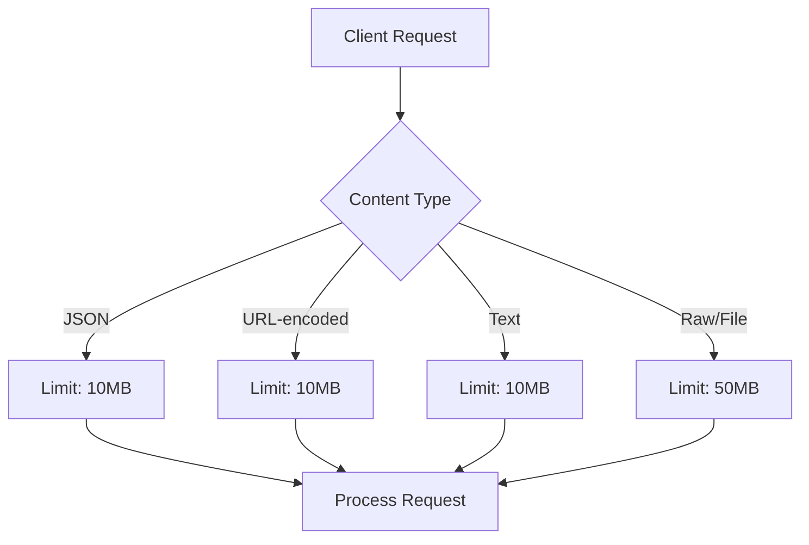
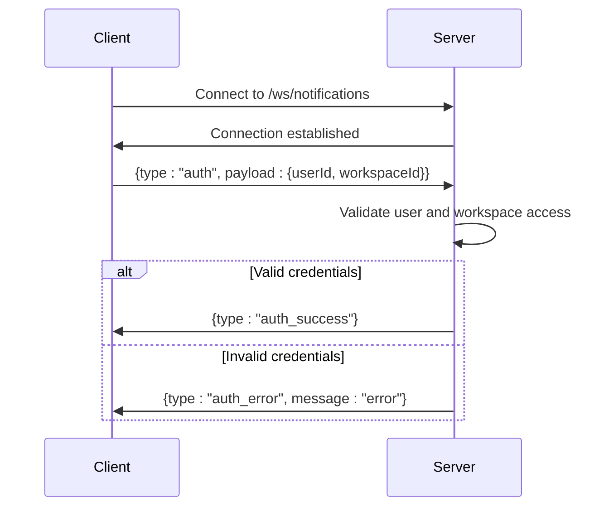
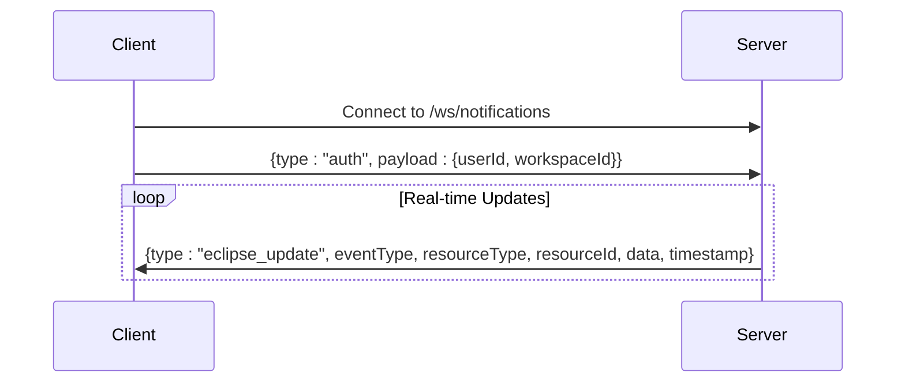
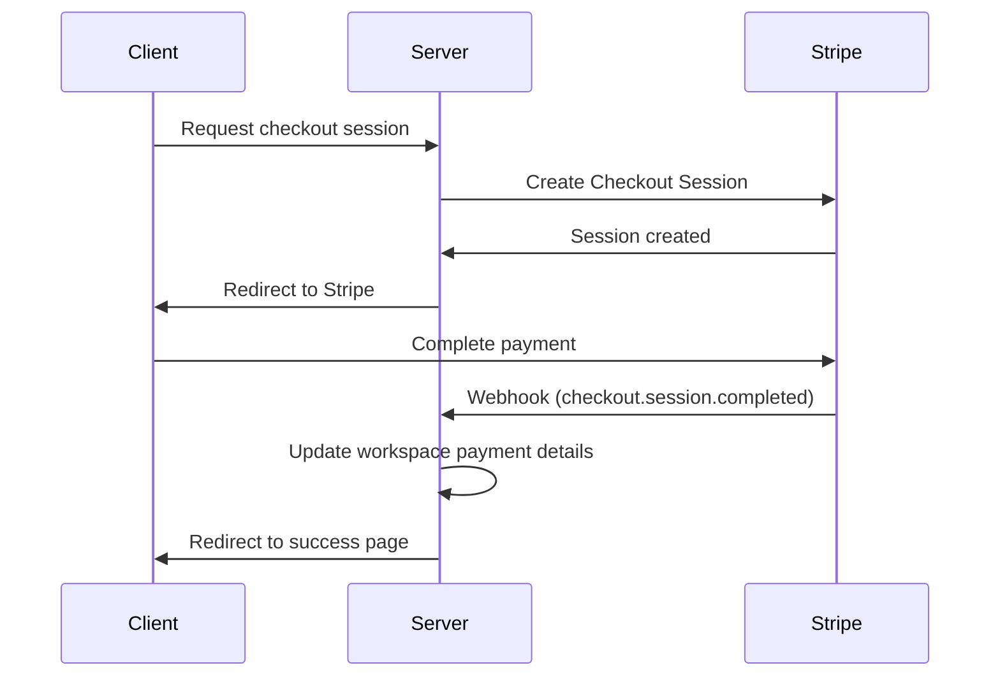
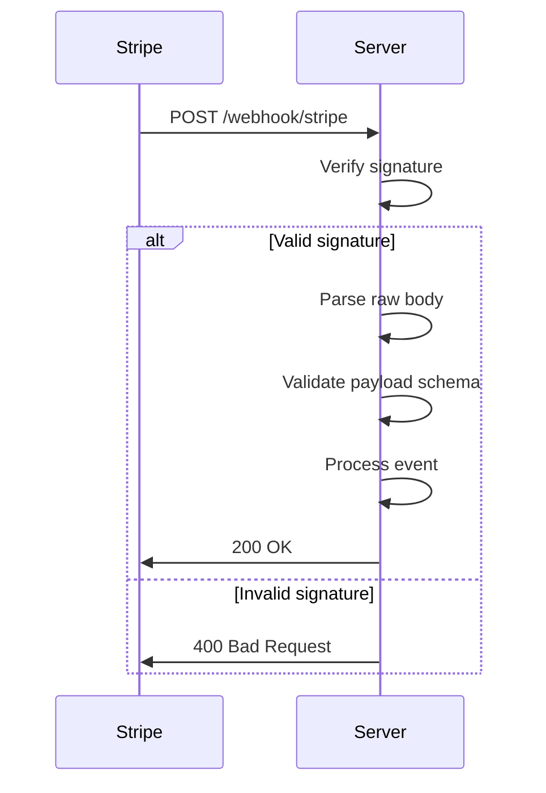
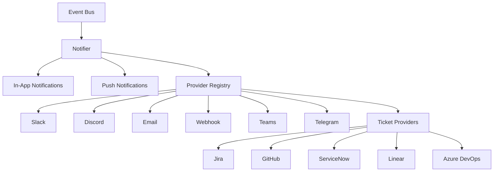
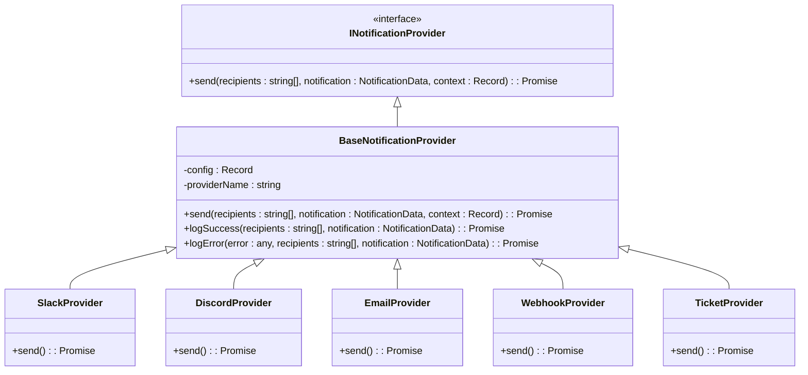
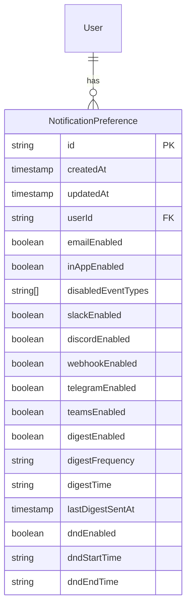
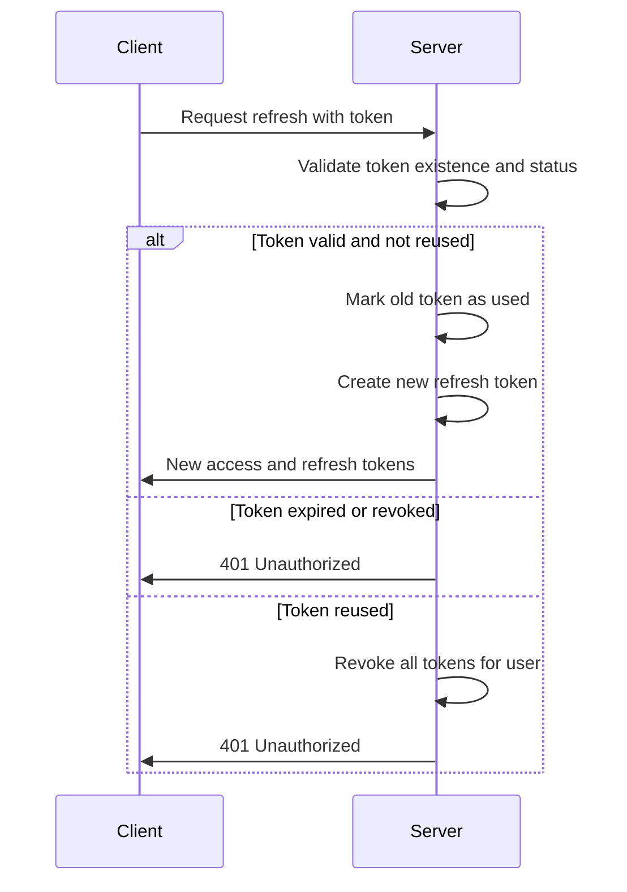
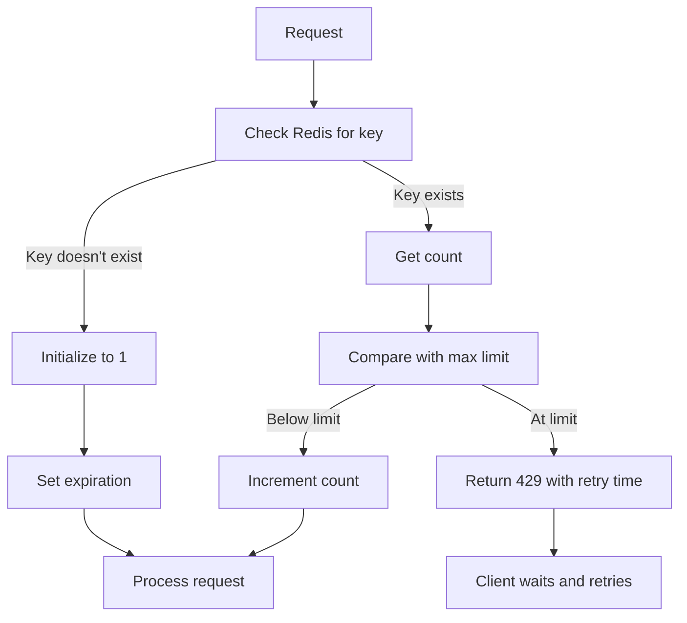

# API Reference

<cite>
**Referenced Files in This Document**   
- [middlewareConfig.ts](file://src/server/middlewareConfig.ts)
- [rateLimit.ts](file://src/server/rateLimit.ts)
- [security.ts](file://src/server/security.ts)
- [websocketSetup.ts](file://src/server/websocketSetup.ts)
- [upload.ts](file://src/server/api/upload.ts)
- [screenshot.ts](file://src/server/api/screenshot.ts)
- [emailPreview.ts](file://src/server/api/emailPreview.ts)
- [refreshToken.ts](file://src/core/auth/refreshToken.ts)
- [twoFactorOperations.ts](file://src/core/auth/twoFactorOperations.ts)
- [paymentProcessor.ts](file://src/core/payment/paymentProcessor.ts)
- [stripe/paymentProcessor.ts](file://src/core/payment/stripe/paymentProcessor.ts)
- [stripe/webhook.ts](file://src/core/payment/stripe/webhook.ts)
- [stripe/webhookPayload.ts](file://src/core/payment/stripe/webhookPayload.ts)
- [operations.ts](file://src/core/notifications/operations.ts)
- [notifier.ts](file://src/core/notifications/notifier.ts)
- [providers/base.ts](file://src/core/notifications/providers/base.ts)
- [providers/slackProvider.ts](file://src/core/notifications/providers/slackProvider.ts)
- [providers/discordProvider.ts](file://src/core/notifications/providers/discordProvider.ts)
- [providers/emailProvider.ts](file://src/core/notifications/providers/emailProvider.ts)
- [providers/jiraProvider.ts](file://src/core/notifications/providers/tickets/jiraProvider.ts)
- [providers/githubProvider.ts](file://src/core/notifications/providers/tickets/githubProvider.ts)
- [providers/serviceNowProvider.ts](file://src/core/notifications/providers/tickets/serviceNowProvider.ts)
- [useNotifications.ts](file://src/client/hooks/useNotifications.ts)
- [useEclipseRealtime.ts](file://src/client/hooks/useEclipseRealtime.ts)
- [NotificationList.tsx](file://src/client/components/notifications/NotificationList.tsx)
- [CheckoutPage.tsx](file://src/client/pages/payment/CheckoutPage.tsx)
- [migration.sql](file://migrations/20251117150008_add_notification_preferences_and_delivery_log/migration.sql)
</cite>

## Table of Contents
1. [Introduction](#introduction)
2. [RESTful API Endpoints](#restful-api-endpoints)
3. [WebSocket APIs](#websocket-apis)
4. [Payment Processing](#payment-processing)
5. [Notification Providers](#notification-providers)
6. [Security Considerations](#security-considerations)
7. [Rate Limiting](#rate-limiting)
8. [Client Implementation Examples](#client-implementation-examples)
9. [Versioning](#versioning)

## Introduction
This document provides comprehensive API documentation for SentinelIQ, covering all public interfaces including RESTful endpoints, WebSocket APIs, payment processing, and notification providers. The system implements JWT-based authentication, real-time notifications, Stripe integration for payments, and supports multiple notification channels including Slack, Discord, Email, and ticketing systems (Jira, GitHub, ServiceNow).

The API follows standard REST conventions for stateless operations and uses WebSocket connections for real-time updates and progress tracking. All endpoints require authentication via JWT tokens, with refresh token rotation for enhanced security.

**Section sources**
- [security.ts](file://src/server/security.ts#L1-L268)
- [refreshToken.ts](file://src/core/auth/refreshToken.ts#L1-L192)

## RESTful API Endpoints

### Authentication Endpoints
SentinelIQ uses JWT-based authentication with refresh token rotation. All authentication endpoints require HTTPS and follow standard security practices.

#### Request Size Limits
The API enforces request size limits to prevent DoS attacks:
- JSON payloads: 10MB maximum
- URL-encoded forms: 10MB maximum
- Text payloads: 10MB maximum
- Raw/file uploads: 50MB maximum



**Diagram sources**
- [middlewareConfig.ts](file://src/server/middlewareConfig.ts#L1-L49)

### File Upload API
Handles multipart/form-data file uploads to MinIO/S3 storage with real-time progress updates.

**Endpoint**: `POST /api/upload`

**Request Body (multipart/form-data)**:
- `file`: File to upload (required)
- `workspaceId`: Workspace ID (required)
- `folder`: Target folder (optional, default: 'uploads')
- `type`: Upload type ('logo', 'avatar', 'document', etc.)

**Authentication**: JWT required

**Validation**:
- File types: JPEG, PNG, GIF, WebP, SVG
- Maximum size: 5MB
- Workspace storage quota enforced

**Response**:
```json
{
  "success": true,
  "uploadId": "string",
  "file": {
    "key": "string",
    "url": "string",
    "size": "number",
    "contentType": "string"
  }
}
```

**Error Codes**:
- 400: No file provided, Invalid file type, File size exceeds limit
- 401: Unauthorized
- 403: Access denied to workspace, Storage quota exceeded
- 500: Failed to upload file

**Section sources**
- [upload.ts](file://src/server/api/upload.ts#L1-L229)

### Screenshot API
Serves screenshots for Eclipse alerts from S3/MinIO storage with access control.

**Endpoint**: `GET /api/screenshot/:alertId`

**Authentication**: JWT required

**Response**:
- 303 See Other: Redirect to S3/MinIO public URL
- 404: Alert not found or no screenshot available
- 401: User not authenticated
- 403: User lacks access to alert's workspace

**Access Control**:
1. Verify user authentication
2. Check alert existence
3. Validate workspace membership
4. Ensure screenshot URL availability

**Section sources**
- [screenshot.ts](file://src/server/api/screenshot.ts#L1-L127)

### Email Preview API
Development-only endpoint for previewing email templates.

**Endpoint**: `GET /api/email-preview`

**Query Parameters**:
- `template`: Template name (required)
- `format`: Response format ('html' or 'json')
- `branding`: Custom branding JSON
- Additional variables for template rendering

**Authentication**: Development mode only

**Response**:
- 200: Template preview (HTML or JSON)
- 403: Not available in production
- 400: Failed to preview template

**Section sources**
- [emailPreview.ts](file://src/server/api/emailPreview.ts#L1-L76)

## WebSocket APIs

### Notification WebSocket
Real-time notification system for in-app alerts, unread counts, and workspace events.

**Connection URL**: `wss://<host>/ws/notifications`

**Authentication Flow**:
1. Client establishes WebSocket connection
2. Client sends authentication message
3. Server validates credentials
4. Server acknowledges connection



**Message Types**:
- `auth`: Authenticate connection
- `auth_success`: Authentication successful
- `auth_error`: Authentication failed
- `new_notification`: New notification received
- `notification_read`: Notification marked as read
- `unread_count`: Unread count update
- `workspace_switched`: Workspace changed
- `error`: Server error
- `ping`: Keepalive request
- `pong`: Keepalive response

**Reconnection Strategy**:
- Exponential backoff with maximum 5 attempts
- 3-second base delay
- Ping/pong keepalive every 30 seconds

**Section sources**
- [websocketSetup.ts](file://src/server/websocketSetup.ts#L1-L31)
- [useNotifications.ts](file://src/client/hooks/useNotifications.ts#L1-L359)

### Eclipse Real-time Updates
WebSocket-based real-time updates for Eclipse module activities.

**Connection URL**: `wss://<host>/ws/notifications`

**Message Types**:
- `eclipse_update`: Eclipse-specific update with eventType, resourceType, resourceId, data, and timestamp

**Event Types**:
- Brand monitoring updates
- Infringement detection alerts
- Action status changes
- Audit log entries



**Section sources**
- [useEclipseRealtime.ts](file://src/client/hooks/useEclipseRealtime.ts#L1-L166)

## Payment Processing

### Stripe Integration
SentinelIQ integrates with Stripe for payment processing using both subscription and one-time payment models.

**Checkout Flow**:
1. Client requests checkout session
2. Server creates Stripe Checkout Session
3. Client redirected to Stripe-hosted payment page
4. Stripe processes payment
5. Stripe sends webhook to server
6. Server updates workspace payment details



**Section sources**
- [paymentProcessor.ts](file://src/core/payment/stripe/paymentProcessor.ts#L1-L54)
- [webhook.ts](file://src/core/payment/stripe/webhook.ts#L1-L385)

### Webhook Integration
Stripe webhooks handle various payment events with proper validation and error handling.

**Supported Events**:
- `checkout.session.completed`: Successful checkout
- `invoice.paid`: Invoice payment received
- `invoice.payment_failed`: Payment failed
- `customer.subscription.updated`: Subscription updated
- `customer.subscription.deleted`: Subscription canceled

**Webhook Security**:
- Signature verification using STRIPE_WEBHOOK_SECRET
- Raw body parsing (not JSON)
- 200 response required for acknowledgment
- Error handling with appropriate status codes

**Payload Validation**:
Uses Zod schemas to validate incoming webhook payloads:
- Generic Stripe event schema
- Session completed data schema
- Invoice paid data schema
- Subscription updated schema
- Subscription deleted schema



**Section sources**
- [webhook.ts](file://src/core/payment/stripe/webhook.ts#L1-L385)
- [webhookPayload.ts](file://src/core/payment/stripe/webhookPayload.ts#L1-L107)

### Checkout Page
Client-side implementation for handling checkout results.

**Success Flow**:
1. User redirected from Stripe with success=true
2. Payment status displayed as "Payment Successful!"
3. Automatic redirect to workspace settings billing tab after 4 seconds

**Cancellation Flow**:
1. User redirected from Stripe with canceled=true
2. Payment status displayed as "Payment Canceled"
3. Automatic redirect to workspace settings billing tab after 4 seconds

**Section sources**
- [CheckoutPage.tsx](file://src/client/pages/payment/CheckoutPage.tsx#L1-L56)

## Notification Providers

### Notification System Architecture
SentinelIQ provides a modular notification system supporting multiple providers with configurable preferences.



**Diagram sources**
- [notifier.ts](file://src/core/notifications/notifier.ts#L1-L141)

### Provider Interface
All notification providers implement a common interface with standardized configuration and error handling.



**Diagram sources**
- [base.ts](file://src/core/notifications/providers/base.ts#L1-L37)

### Slack Integration
Sends notifications to Slack channels via incoming webhooks.

**Configuration**:
- `webhookUrl`: Slack webhook URL (required)
- `channel`: Target channel (optional)

**Validation**:
- Webhook URL must be valid
- Channel name must be valid if specified

**Section sources**
- [operations.ts](file://src/core/notifications/operations.ts#L1-L38)
- [slackProvider.ts](file://src/core/notifications/providers/slackProvider.ts)

### Discord Integration
Sends notifications to Discord channels via webhooks.

**Configuration**:
- `webhookUrl`: Discord webhook URL (required)
- `username`: Bot username (optional)

**Validation**:
- Webhook URL must be valid
- Username must be valid if specified

**Section sources**
- [operations.ts](file://src/core/notifications/operations.ts#L1-L38)
- [discordProvider.ts](file://src/core/notifications/providers/discordProvider.ts)

### Email Integration
Sends email notifications to configured recipients.

**Configuration**:
- `recipients`: Array of email addresses (at least one required)
- `subject`: Email subject (optional)

**Validation**:
- All recipients must have valid email format
- At least one recipient required

**Section sources**
- [operations.ts](file://src/core/notifications/operations.ts#L1-L38)
- [emailProvider.ts](file://src/core/notifications/providers/emailProvider.ts)

### Ticketing System Integration
Creates tickets in external systems including Jira, GitHub, ServiceNow, Linear, and Azure DevOps.

**Common Configuration**:
- API credentials
- Project/Repository identification
- Issue type mapping
- Field mappings

**Provider-Specific Features**:
- Jira: Supports custom fields and workflows
- GitHub: Creates issues with labels and assignees
- ServiceNow: Integrates with incident management
- Linear: Supports cycle and priority settings
- Azure DevOps: Works with work items and backlogs

**Section sources**
- [jiraProvider.ts](file://src/core/notifications/providers/tickets/jiraProvider.ts)
- [githubProvider.ts](file://src/core/notifications/providers/tickets/githubProvider.ts)
- [serviceNowProvider.ts](file://src/core/notifications/providers/tickets/serviceNowProvider.ts)

### Notification Preferences
Users can configure notification preferences for different event types and delivery methods.

**Preference Settings**:
- Email enabled/disabled
- In-app notifications enabled/disabled
- Slack enabled/disabled
- Discord enabled/disabled
- Webhook enabled/disabled
- Telegram enabled/disabled
- Teams enabled/disabled
- Digest enabled/disabled (frequency, time)
- Do Not Disturb schedule
- Disabled event types

**Storage**: PostgreSQL database with NotificationPreference table



**Diagram sources**
- [migration.sql](file://migrations/20251117150008_add_notification_preferences_and_delivery_log/migration.sql#L1-L30)

## Security Considerations

### Authentication and Authorization
SentinelIQ implements robust security measures for authentication and authorization.

**JWT Implementation**:
- Access tokens with short expiration
- Refresh tokens with rotation and revocation
- Maximum of 5 active refresh tokens per user
- Token reuse detection and automatic revocation

**Refresh Token Security**:
- 30-day expiration
- Usage count tracking
- Reuse detection triggers revocation of all tokens
- IP address and user agent tracking
- Automatic cleanup of expired tokens



**Section sources**
- [refreshToken.ts](file://src/core/auth/refreshToken.ts#L1-L192)

### Two-Factor Authentication
Optional 2FA implementation using TOTP (Time-based One-Time Password).

**Setup Flow**:
1. User requests 2FA enablement
2. Server generates TOTP secret and QR code
3. User scans QR code with authenticator app
4. User verifies code
5. 2FA activated

**Verification**:
- Code must match current TOTP window
- Backup codes available for recovery

**Section sources**
- [twoFactorOperations.ts](file://src/core/auth/twoFactorOperations.ts#L56-L123)

### CORS and Security Headers
Comprehensive security headers and CORS configuration.

**CORS Configuration**:
- Allowed origins: Production domains, localhost (development)
- Credentials: Enabled
- Methods: GET, POST, PUT, DELETE, PATCH, OPTIONS
- Headers: Content-Type, Authorization, X-Requested-With, X-Workspace-Id
- Exposed headers: X-Total-Count, X-Rate-Limit-Remaining

**Security Headers**:
- Content Security Policy (CSP)
- HTTP Strict Transport Security (HSTS)
- X-Frame-Options: DENY
- X-XSS-Protection: 1; mode=block
- Referrer Policy: strict-origin-when-cross-origin

**Section sources**
- [security.ts](file://src/server/security.ts#L1-L268)

## Rate Limiting

### Rate Limit Configuration
Distributed rate limiting using Redis to prevent abuse.

**Predefined Limits**:
- `CREATE_WORKSPACE`: 5 per hour
- `UPDATE_WORKSPACE`: 30 per minute
- `INVITE_MEMBER`: 10 per minute
- `SEND_INVITATION`: 10 per minute
- `ACCEPT_INVITATION`: 10 per minute

**Implementation**:
- Redis-based counter with expiration
- Fail-open behavior if Redis unavailable
- 429 status code with retry information
- Reset time calculated from Redis TTL



**Section sources**
- [rateLimit.ts](file://src/server/rateLimit.ts#L1-L85)

## Client Implementation Examples

### WebSocket Connection Example
JavaScript implementation for connecting to the notification WebSocket.

```javascript
function connectWebSocket() {
  const protocol = window.location.protocol === 'https:' ? 'wss:' : 'ws:';
  const wsUrl = `${protocol}//${window.location.host}/ws/notifications`;
  
  const ws = new WebSocket(wsUrl);
  
  ws.onopen = () => {
    // Authenticate connection
    ws.send(JSON.stringify({
      type: 'auth',
      payload: {
        userId: currentUser.id,
        workspaceId: currentWorkspace.id,
      },
    }));
  };
  
  ws.onmessage = (event) => {
    const message = JSON.parse(event.data);
    handleNotificationMessage(message);
  };
  
  ws.onclose = () => {
    // Implement exponential backoff reconnection
    setTimeout(connectWebSocket, 3000);
  };
  
  // Send ping every 30 seconds to keep connection alive
  setInterval(() => {
    if (ws.readyState === WebSocket.OPEN) {
      ws.send(JSON.stringify({ type: 'ping' }));
    }
  }, 30000);
}
```

**Section sources**
- [useNotifications.ts](file://src/client/hooks/useNotifications.ts#L39-L80)

### Notification List Component
React component for displaying real-time notifications.

```typescript
function NotificationList() {
  const { 
    notifications, 
    unreadCount, 
    isConnected, 
    error,
    reconnect 
  } = useNotifications();
  
  useEffect(() => {
    if (error) {
      toast.error(`Notification updates: ${error}`);
    }
  }, [error]);
  
  return (
    <div className="notification-list">
      <div className="header">
        <h3>Notifications ({unreadCount})</h3>
        {!isConnected && (
          <button onClick={reconnect}>Reconnect</button>
        )}
      </div>
      {notifications.map(notification => (
        <NotificationItem 
          key={notification.id} 
          notification={notification} 
        />
      ))}
    </div>
  );
}
```

**Section sources**
- [NotificationList.tsx](file://src/client/components/notifications/NotificationList.tsx#L1-L46)

## Versioning
SentinelIQ follows semantic versioning (MAJOR.MINOR.PATCH) for API versioning. Currently, all endpoints are part of the v1 API with version information conveyed through documentation rather than URL paths. Future versions will be indicated in the URL (e.g., `/api/v2/...`). Breaking changes will increment the MAJOR version, new features will increment the MINOR version, and bug fixes will increment the PATCH version.