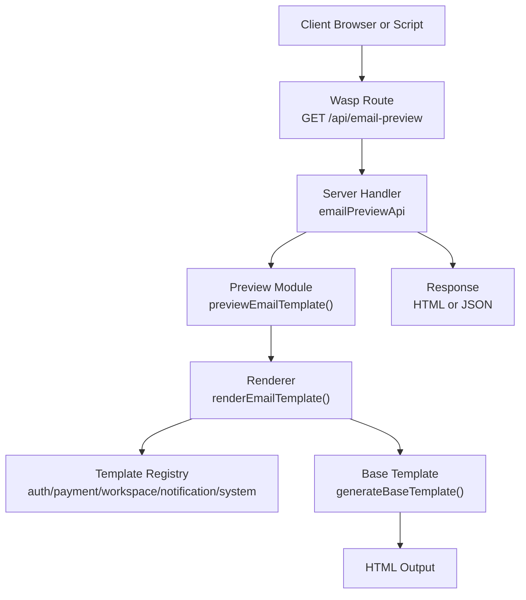
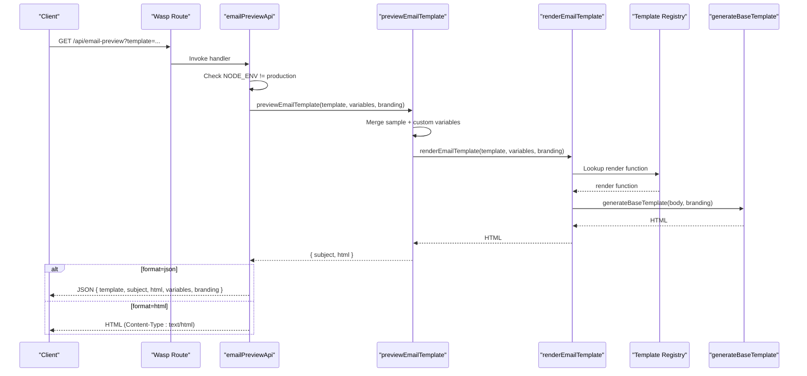
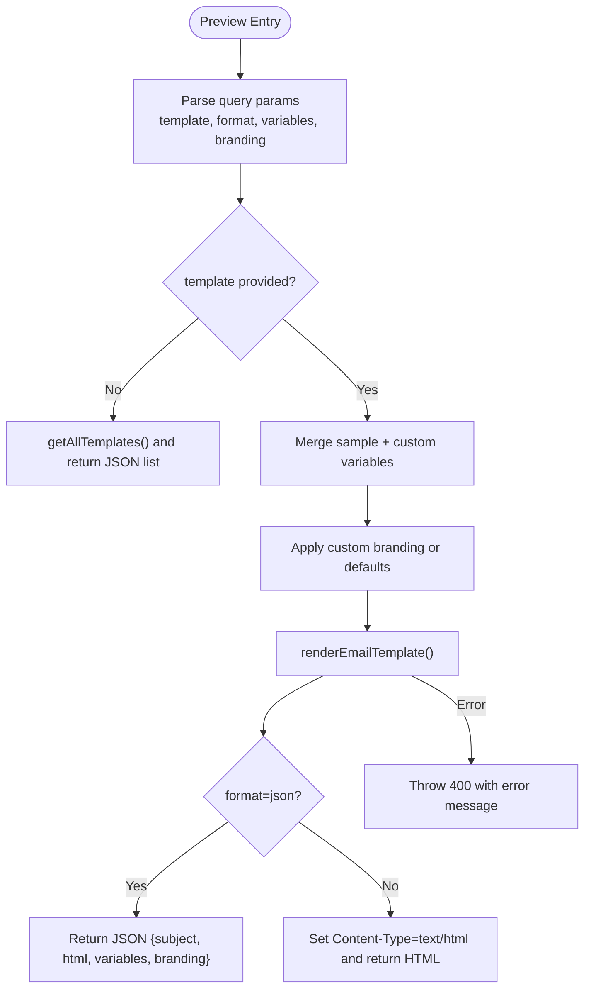
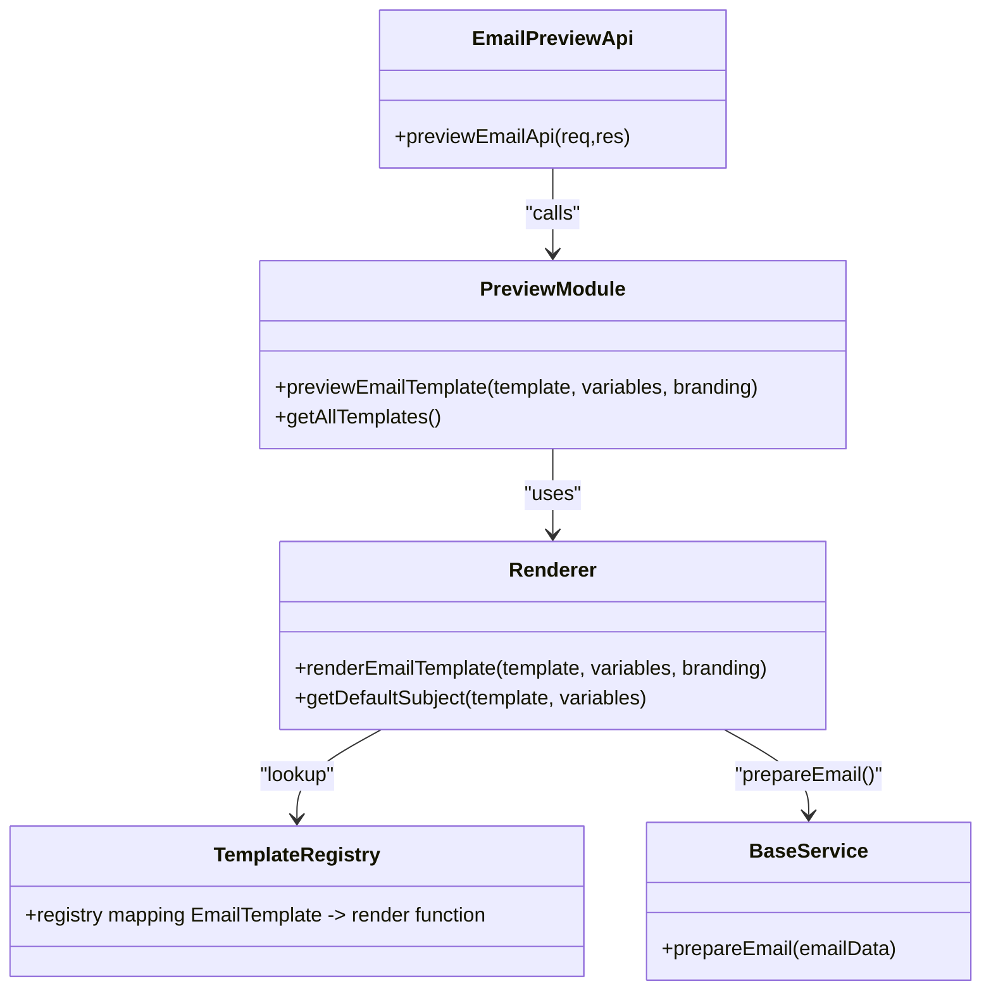
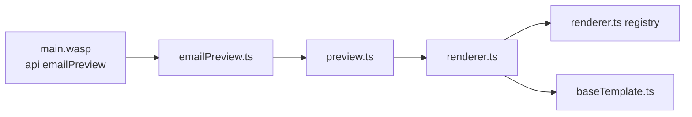

# Email Preview API

<cite>
**Referenced Files in This Document**
- [emailPreview.ts](file://src/server/api/emailPreview.ts)
- [preview.ts](file://src/core/email/preview.ts)
- [renderer.ts](file://src/core/email/renderer.ts)
- [types.ts](file://src/core/email/types.ts)
- [baseTemplate.ts](file://src/core/email/baseTemplate.ts)
- [service.ts](file://src/core/email/service.ts)
- [main.wasp](file://main.wasp)
</cite>

## Table of Contents
1. [Introduction](#introduction)
2. [Project Structure](#project-structure)
3. [Core Components](#core-components)
4. [Architecture Overview](#architecture-overview)
5. [Detailed Component Analysis](#detailed-component-analysis)
6. [Dependency Analysis](#dependency-analysis)
7. [Performance Considerations](#performance-considerations)
8. [Troubleshooting Guide](#troubleshooting-guide)
9. [Conclusion](#conclusion)

## Introduction
This document describes the Email Preview API endpoint in SentinelIQ. It provides a development-only mechanism to preview rendered email templates with sample data and optional custom variables and branding overrides. The endpoint is restricted to development environments and returns either an HTML preview for browsers or structured JSON for programmatic consumption. It integrates with the core email templating system and renderer pipeline.

## Project Structure
The Email Preview API is exposed via a Wasp route and backed by a server-side handler that delegates to the core email preview module. The preview module uses the renderer to build HTML from templates and applies default or custom branding.

**Diagram sources**
- [emailPreview.ts](file://src/server/api/emailPreview.ts#L1-L76)
- [preview.ts](file://src/core/email/preview.ts#L1-L120)
- [renderer.ts](file://src/core/email/renderer.ts#L1-L120)
- [baseTemplate.ts](file://src/core/email/baseTemplate.ts#L1-L120)
- [main.wasp](file://main.wasp#L213-L218)

**Section sources**
- [emailPreview.ts](file://src/server/api/emailPreview.ts#L1-L76)
- [preview.ts](file://src/core/email/preview.ts#L1-L120)
- [renderer.ts](file://src/core/email/renderer.ts#L1-L120)
- [baseTemplate.ts](file://src/core/email/baseTemplate.ts#L1-L120)
- [main.wasp](file://main.wasp#L213-L218)

## Core Components
- HTTP endpoint: GET /api/email-preview
- Environment restriction: Only available when NODE_ENV is not production; otherwise returns 403
- Query parameters:
  - template: Email template identifier (optional; if omitted, returns available templates)
  - format: Output format; "html" (default) or "json"
  - custom variables: Any additional key-value pairs passed as query parameters are merged into the template variables
  - branding: JSON-encoded branding object overriding defaults
- Response formats:
  - HTML: Sets Content-Type to text/html and returns rendered HTML
  - JSON: Returns subject, html, variables, and branding fields

Key behaviors:
- Template discovery: When template is omitted, responds with a list of available templates grouped by category
- Dynamic rendering: Merges sample data with custom variables; applies custom branding overrides
- Error handling: Throws 400 on preview failures; 403 in production

**Section sources**
- [emailPreview.ts](file://src/server/api/emailPreview.ts#L19-L76)
- [preview.ts](file://src/core/email/preview.ts#L1-L120)
- [renderer.ts](file://src/core/email/renderer.ts#L1-L120)
- [types.ts](file://src/core/email/types.ts#L1-L126)

## Architecture Overview
The Email Preview API sits on top of the email templating system. It validates environment, parses query parameters, resolves template variables and branding, renders HTML, and returns either HTML or JSON.

**Diagram sources**
- [emailPreview.ts](file://src/server/api/emailPreview.ts#L19-L76)
- [preview.ts](file://src/core/email/preview.ts#L1-L120)
- [renderer.ts](file://src/core/email/renderer.ts#L1-L120)
- [baseTemplate.ts](file://src/core/email/baseTemplate.ts#L1-L120)

## Detailed Component Analysis

### Endpoint Definition and Behavior
- Route registration: Wasp route maps GET /api/email-preview to the preview handler
- Environment guard: Throws 403 if NODE_ENV equals production
- Query parsing: Extracts template, format, and arbitrary custom variables; branding is parsed from JSON if provided
- Template discovery: If template is absent, returns available templates grouped by category
- Output selection: Returns HTML for browsers or JSON for programmatic access

Security and validation:
- Production restriction prevents accidental exposure of internal preview logic
- JSON parsing of branding is performed safely; invalid JSON yields a 400 error

**Section sources**
- [emailPreview.ts](file://src/server/api/emailPreview.ts#L19-L76)
- [main.wasp](file://main.wasp#L213-L218)

### Template Discovery
When template is omitted, the handler calls getAllTemplates() to return:
- A categorized list of available EmailTemplate identifiers
- Guidance on how to preview a specific template

This enables quick exploration of supported templates without prior knowledge of identifiers.

**Section sources**
- [preview.ts](file://src/core/email/preview.ts#L338-L401)
- [emailPreview.ts](file://src/server/api/emailPreview.ts#L31-L40)

### Dynamic Rendering and Variables
The preview pipeline merges:
- Sample data keyed by template
- Custom variables supplied via query parameters
- Optional branding overrides

The renderer uses a registry mapping EmailTemplate to render functions. It validates required variables and throws descriptive errors if missing.

**Diagram sources**
- [emailPreview.ts](file://src/server/api/emailPreview.ts#L19-L76)
- [preview.ts](file://src/core/email/preview.ts#L1-L120)
- [renderer.ts](file://src/core/email/renderer.ts#L1-L120)

**Section sources**
- [preview.ts](file://src/core/email/preview.ts#L1-L120)
- [renderer.ts](file://src/core/email/renderer.ts#L1-L120)

### Branding Overrides
Branding supports:
- logoUrl
- primaryColor
- secondaryColor
- companyName
- companyUrl

Defaults are applied when customBranding is not provided. The base template composes the final HTML with branding-aware components.

**Section sources**
- [types.ts](file://src/core/email/types.ts#L57-L63)
- [preview.ts](file://src/core/email/preview.ts#L28-L40)
- [baseTemplate.ts](file://src/core/email/baseTemplate.ts#L1-L120)

### Integration with Core Email System
The preview module reuses the same renderer and template registry used by the production email service. This ensures parity between preview and actual delivery.

**Diagram sources**
- [emailPreview.ts](file://src/server/api/emailPreview.ts#L19-L76)
- [preview.ts](file://src/core/email/preview.ts#L1-L120)
- [renderer.ts](file://src/core/email/renderer.ts#L1-L120)
- [service.ts](file://src/core/email/service.ts#L1-L120)

**Section sources**
- [preview.ts](file://src/core/email/preview.ts#L1-L120)
- [renderer.ts](file://src/core/email/renderer.ts#L1-L120)
- [service.ts](file://src/core/email/service.ts#L1-L120)

## Dependency Analysis
- Route-to-handler mapping: main.wasp registers GET /api/email-preview to the preview handler
- Handler-to-core: The handler imports previewEmailTemplate and getAllTemplates from the preview module
- Renderer-to-templates: The renderer maintains a registry mapping EmailTemplate to render functions across categories (auth, payment, workspace, notification, system)
- Base template: generateBaseTemplate composes the final HTML with branding-aware components

**Diagram sources**
- [main.wasp](file://main.wasp#L213-L218)
- [emailPreview.ts](file://src/server/api/emailPreview.ts#L1-L76)
- [preview.ts](file://src/core/email/preview.ts#L1-L120)
- [renderer.ts](file://src/core/email/renderer.ts#L1-L120)
- [baseTemplate.ts](file://src/core/email/baseTemplate.ts#L1-L120)

**Section sources**
- [main.wasp](file://main.wasp#L213-L218)
- [emailPreview.ts](file://src/server/api/emailPreview.ts#L1-L76)
- [renderer.ts](file://src/core/email/renderer.ts#L1-L120)

## Performance Considerations
- Rendering cost: HTML generation occurs synchronously in the handler; keep branding and variables minimal for rapid iteration
- JSON vs HTML: Prefer JSON for programmatic access to avoid unnecessary HTML parsing overhead
- Template discovery: Listing templates is lightweight; avoid frequent polling in production

[No sources needed since this section provides general guidance]

## Troubleshooting Guide
Common issues and resolutions:
- 403 Forbidden in production: The endpoint is disabled in production. Switch to development or use the production email service for actual delivery
- 400 Bad Request on preview: Indicates template rendering failure. Verify template name and required variables
- Invalid branding JSON: Ensure branding is valid JSON; otherwise parsing fails and returns 400
- Missing required variables: The renderer validates required fields per template; add missing keys to query parameters

Operational tips:
- Use format=json for automated testing and CI pipelines
- Use format=html to visually inspect rendered emails in a browser
- Combine custom variables with branding overrides to simulate real-world scenarios

**Section sources**
- [emailPreview.ts](file://src/server/api/emailPreview.ts#L23-L76)
- [renderer.ts](file://src/core/email/renderer.ts#L83-L137)

## Conclusion
The Email Preview API provides a safe, development-only way to render and inspect email templates with sample data and custom overrides. It leverages the same renderer and template registry used by the production email service, ensuring consistency. Use format=json for automation and format=html for manual inspection. Respect the environment guard to prevent unintended exposure in production.