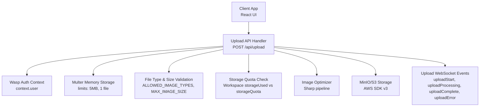
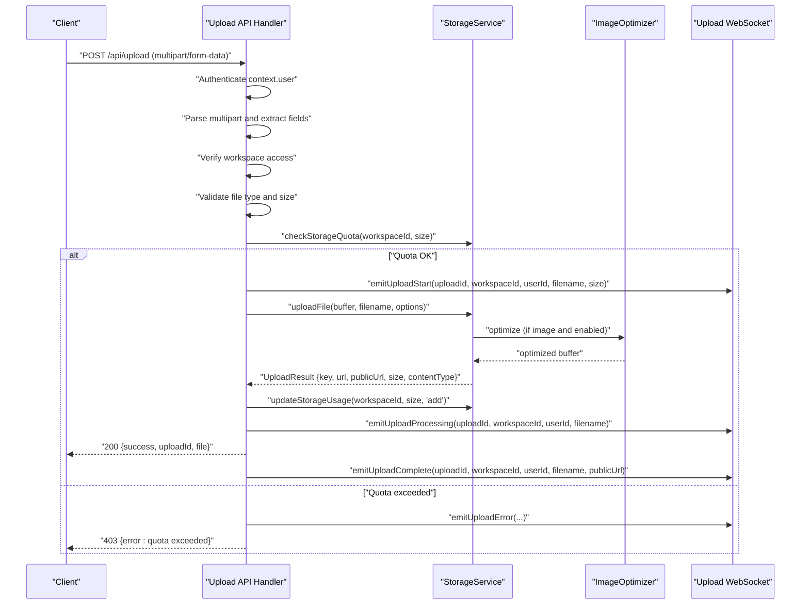
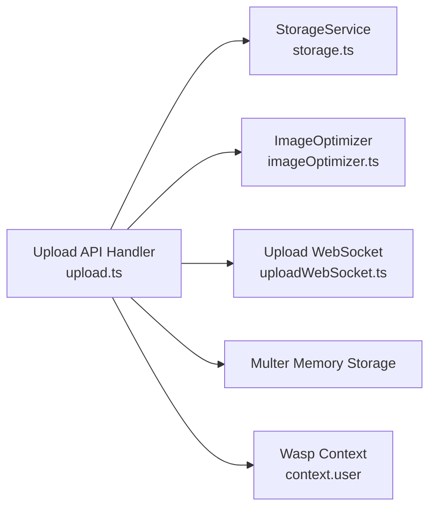

# File Upload API

<cite>
**Referenced Files in This Document**
- [upload.ts](file://src/server/api/upload.ts)
- [storage.ts](file://src/server/storage.ts)
- [uploadWebSocket.ts](file://src/server/uploadWebSocket.ts)
- [websocketSetup.ts](file://src/server/websocketSetup.ts)
- [useUploadProgress.ts](file://src/client/hooks/useUploadProgress.ts)
- [imageOptimizer.ts](file://src/server/imageOptimizer.ts)
- [validation.ts](file://src/server/validation.ts)
- [security.ts](file://src/server/security.ts)
- [requestContext.ts](file://src/server/requestContext.ts)
- [20251117142501_add_storage_quota/migration.sql](file://migrations/20251117142501_add_storage_quota/migration.sql)
</cite>

## Table of Contents
1. [Introduction](#introduction)
2. [Project Structure](#project-structure)
3. [Core Components](#core-components)
4. [Architecture Overview](#architecture-overview)
5. [Detailed Component Analysis](#detailed-component-analysis)
6. [Dependency Analysis](#dependency-analysis)
7. [Performance Considerations](#performance-considerations)
8. [Troubleshooting Guide](#troubleshooting-guide)
9. [Conclusion](#conclusion)

## Introduction
This document describes the File Upload API endpoint in SentinelIQ. It covers the HTTP method, URL pattern, multipart/form-data request format, authentication, validation, storage integration with MinIO/S3, automatic image optimization, storage quota enforcement, and client-side progress tracking via WebSocket events.

## Project Structure
The File Upload API is implemented as a Wasp server route that validates requests, authenticates users, verifies workspace access, enforces file type and size limits, checks storage quotas, optimizes images when applicable, uploads to S3/MinIO, and emits real-time progress events to clients.

**Diagram sources**
- [upload.ts](file://src/server/api/upload.ts#L1-L229)
- [storage.ts](file://src/server/storage.ts#L1-L600)
- [uploadWebSocket.ts](file://src/server/uploadWebSocket.ts#L1-L219)
- [websocketSetup.ts](file://src/server/websocketSetup.ts#L1-L31)

**Section sources**
- [upload.ts](file://src/server/api/upload.ts#L1-L229)
- [storage.ts](file://src/server/storage.ts#L1-L600)
- [uploadWebSocket.ts](file://src/server/uploadWebSocket.ts#L1-L219)
- [websocketSetup.ts](file://src/server/websocketSetup.ts#L1-L31)

## Core Components
- Upload API handler: Validates JWT-authenticated user, parses multipart/form-data, performs workspace access verification, validates file type and size, checks storage quota, optimizes images, uploads to S3/MinIO, and emits WebSocket events.
- StorageService: Integrates with AWS SDK v3 for MinIO/S3-compatible storage, handles upload, deletion, signed URLs, listing, and quota management.
- ImageOptimizer: Uses Sharp to resize, compress, and convert images to WebP with configurable dimensions and quality.
- Upload WebSocket: Provides real-time progress updates to clients via Socket.IO rooms keyed by workspaceId.
- Client hook: Subscribes to WebSocket events and exposes progress/status/state to UI components.

**Section sources**
- [upload.ts](file://src/server/api/upload.ts#L1-L229)
- [storage.ts](file://src/server/storage.ts#L1-L600)
- [imageOptimizer.ts](file://src/server/imageOptimizer.ts#L1-L290)
- [uploadWebSocket.ts](file://src/server/uploadWebSocket.ts#L1-L219)
- [useUploadProgress.ts](file://src/client/hooks/useUploadProgress.ts#L1-L179)

## Architecture Overview
The upload flow integrates authentication, validation, storage, and real-time progress reporting.

**Diagram sources**
- [upload.ts](file://src/server/api/upload.ts#L44-L204)
- [storage.ts](file://src/server/storage.ts#L102-L216)
- [imageOptimizer.ts](file://src/server/imageOptimizer.ts#L65-L149)
- [uploadWebSocket.ts](file://src/server/uploadWebSocket.ts#L131-L194)

## Detailed Component Analysis

### API Endpoint Definition
- Method: POST
- URL: /api/upload
- Content-Type: multipart/form-data
- Required fields:
  - file: Binary file content (buffer)
  - workspaceId: String identifier of the target workspace
- Optional fields:
  - folder: String target folder (default: uploads or logos when type=logo)
  - type: String indicating upload purpose (e.g., logo)

Authentication:
- The handler expects a valid user in the request context (context.user). If absent, it returns 401 Unauthorized.

Validation:
- File type validation uses ALLOWED_IMAGE_TYPES.
- File size validation uses MAX_IMAGE_SIZE.
- Workspace access verification ensures the user is a member of the workspace.

Storage quota:
- The handler checks workspace storage quota before upload and returns 403 if exceeded.

Response schemas:
- Success (200): JSON with success flag, uploadId, and file metadata (key, url, publicUrl, size, contentType).
- Error (400): Invalid file type or missing required fields.
- Error (401): Unauthorized (no context.user).
- Error (403): Access denied to workspace or storage quota exceeded.
- Error (500): Internal server error.

**Section sources**
- [upload.ts](file://src/server/api/upload.ts#L44-L204)
- [storage.ts](file://src/server/storage.ts#L48-L69)
- [storage.ts](file://src/server/storage.ts#L226-L304)

### Storage Integration (MinIO/S3)
- StorageService uses AWS SDK v3 with MinIO-compatible configuration (endpoint, credentials, path-style URLs).
- Upload keys are structured under workspaces/{workspaceId}/{folder}/{timestamp}-{filename}.
- Public URLs are generated using S3_PUBLIC_URL and endpoint.
- Optional image optimization is enabled by default for images; logos use specific dimensions.
- Quota enforcement and usage updates are performed via workspace storageUsed and storageQuota.

**Section sources**
- [storage.ts](file://src/server/storage.ts#L22-L47)
- [storage.ts](file://src/server/storage.ts#L102-L216)
- [storage.ts](file://src/server/storage.ts#L226-L304)
- [20251117142501_add_storage_quota/migration.sql](file://migrations/20251117142501_add_storage_quota/migration.sql#L1-L4)

### Image Optimization
- ImageOptimizer uses Sharp to resize, compress, and convert images to WebP.
- For logos, a dedicated optimization pipeline targets workspace branding dimensions.
- If optimization fails, the original file is uploaded with a warning.

**Section sources**
- [imageOptimizer.ts](file://src/server/imageOptimizer.ts#L65-L149)
- [storage.ts](file://src/server/storage.ts#L115-L165)

### Real-Time Progress Tracking (WebSocket)
- The API emits four events: uploadStart, uploadProcessing, uploadComplete, uploadError.
- Clients join a workspace-specific room and listen for upload-progress events.
- The client hook provides a simple API to track progress and status.

**Section sources**
- [upload.ts](file://src/server/api/upload.ts#L97-L204)
- [uploadWebSocket.ts](file://src/server/uploadWebSocket.ts#L131-L219)
- [useUploadProgress.ts](file://src/client/hooks/useUploadProgress.ts#L1-L179)
- [websocketSetup.ts](file://src/server/websocketSetup.ts#L15-L30)

### Authentication and Security
- Authentication relies on Wasp’s context.user. The handler returns 401 if context.user is missing.
- CORS and Helmet are configured centrally to protect the API.
- Request size limits are enforced to mitigate DoS risks.

**Section sources**
- [upload.ts](file://src/server/api/upload.ts#L46-L53)
- [security.ts](file://src/server/security.ts#L149-L191)
- [security.ts](file://src/server/security.ts#L198-L214)

## Dependency Analysis
The upload API depends on:
- StorageService for S3/MinIO operations and quota management
- ImageOptimizer for image processing
- Upload WebSocket for progress events
- Wasp’s request context for authentication and entity access
- Multer for parsing multipart/form-data

**Diagram sources**
- [upload.ts](file://src/server/api/upload.ts#L1-L229)
- [storage.ts](file://src/server/storage.ts#L1-L600)
- [imageOptimizer.ts](file://src/server/imageOptimizer.ts#L1-L290)
- [uploadWebSocket.ts](file://src/server/uploadWebSocket.ts#L1-L219)

**Section sources**
- [upload.ts](file://src/server/api/upload.ts#L1-L229)
- [storage.ts](file://src/server/storage.ts#L1-L600)
- [imageOptimizer.ts](file://src/server/imageOptimizer.ts#L1-L290)
- [uploadWebSocket.ts](file://src/server/uploadWebSocket.ts#L1-L219)

## Performance Considerations
- Prefer batch uploads with minimal overhead per request. Use folder and type to organize storage efficiently.
- Leverage automatic image optimization to reduce bandwidth and storage costs.
- Monitor WebSocket room sizes and clean up completed/error events to avoid memory bloat.
- Use signed URLs for private assets when appropriate to offload CDN traffic.
- Consider chunked uploads for very large files if needed, though the current implementation streams buffers.

[No sources needed since this section provides general guidance]

## Troubleshooting Guide
Common issues and resolutions:
- 401 Unauthorized: Ensure the client sends a valid JWT and the request includes the authenticated user context.
- 400 Bad Request: Verify file type is among ALLOWED_IMAGE_TYPES and size does not exceed MAX_IMAGE_SIZE.
- 403 Forbidden (workspace access): Confirm the user belongs to the workspace.
- 403 Forbidden (quota exceeded): Reduce file size or upgrade plan; verify storageUsed vs storageQuota.
- 500 Internal Server Error: Inspect server logs for S3 upload failures or optimization errors.

Operational checks:
- Verify S3 endpoint, credentials, and bucket configuration.
- Ensure WebSocket server is initialized and clients connect to the correct path.
- Validate CORS settings for the client origin.

**Section sources**
- [upload.ts](file://src/server/api/upload.ts#L56-L227)
- [storage.ts](file://src/server/storage.ts#L226-L304)
- [uploadWebSocket.ts](file://src/server/uploadWebSocket.ts#L1-L219)
- [security.ts](file://src/server/security.ts#L149-L191)

## Conclusion
The File Upload API provides a robust, secure, and observable file upload experience. It enforces authentication, validates inputs, manages storage quotas, optimizes images automatically, and delivers real-time progress feedback to clients. The architecture cleanly separates concerns across handlers, services, and WebSocket layers, enabling scalability and maintainability.