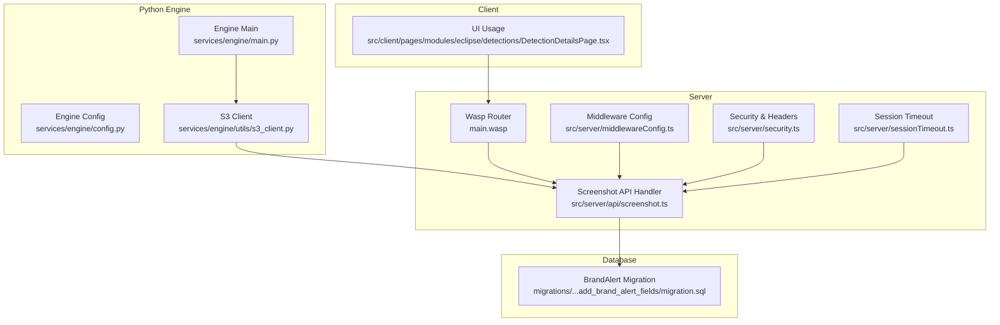
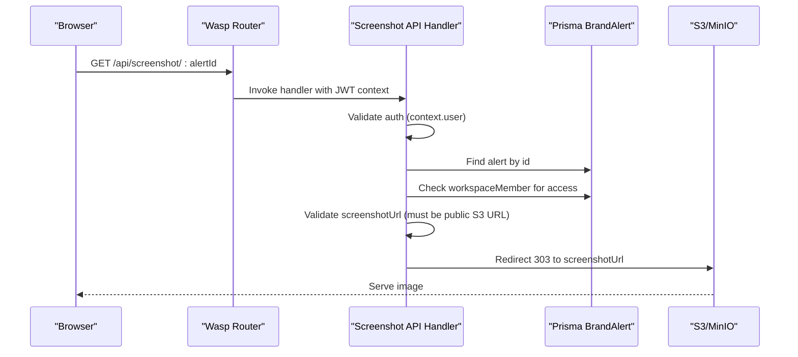
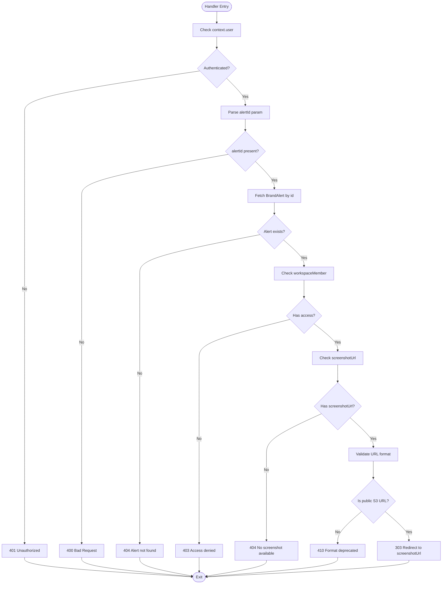
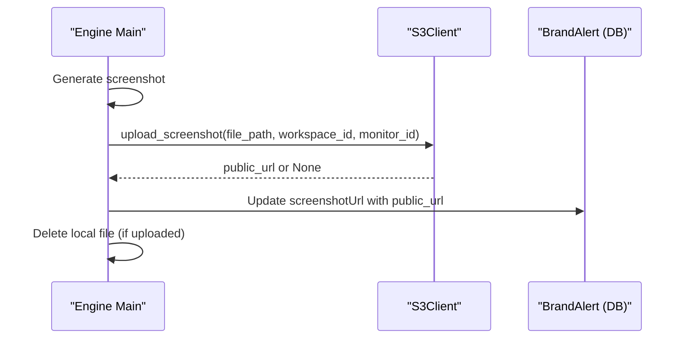
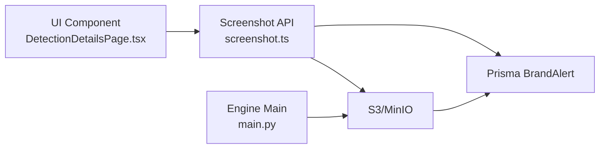

# Screenshot API

<cite>
**Referenced Files in This Document**
- [screenshot.ts](file://src/server/api/screenshot.ts)
- [main.wasp](file://main.wasp)
- [DetectionDetailsPage.tsx](file://src/client/pages/modules/eclipse/detections/DetectionDetailsPage.tsx)
- [s3_client.py](file://services/engine/utils/s3_client.py)
- [main.py](file://services/engine/main.py)
- [config.py](file://services/engine/config.py)
- [migration.sql](file://migrations/20251120052630_add_brand_alert_fields/migration.sql)
- [middlewareConfig.ts](file://src/server/middlewareConfig.ts)
- [security.ts](file://src/server/security.ts)
- [sessionTimeout.ts](file://src/server/sessionTimeout.ts)
</cite>

## Table of Contents
1. [Introduction](#introduction)
2. [Project Structure](#project-structure)
3. [Core Components](#core-components)
4. [Architecture Overview](#architecture-overview)
5. [Detailed Component Analysis](#detailed-component-analysis)
6. [Dependency Analysis](#dependency-analysis)
7. [Performance Considerations](#performance-considerations)
8. [Troubleshooting Guide](#troubleshooting-guide)
9. [Conclusion](#conclusion)

## Introduction
This document describes the Screenshot API endpoint used by SentinelIQ’s Eclipse module to serve alert screenshots stored in S3/MinIO. The API is a GET endpoint that validates authentication and authorization, checks the alert’s screenshot availability, and redirects clients to a public S3/MinIO URL. It also documents the backend pipeline that generates screenshots via the Python engine and uploads them to S3, the deprecation of legacy screenshot formats, and client-side usage patterns with fallback handling.

## Project Structure
The Screenshot API is defined in the server API layer and wired into the Wasp router. The Python engine handles screenshot generation and uploads to S3/MinIO. The UI consumes the API to display screenshots.

**Diagram sources**
- [main.wasp](file://main.wasp#L227-L231)
- [screenshot.ts](file://src/server/api/screenshot.ts#L1-L127)
- [middlewareConfig.ts](file://src/server/middlewareConfig.ts#L1-L49)
- [security.ts](file://src/server/security.ts#L193-L252)
- [sessionTimeout.ts](file://src/server/sessionTimeout.ts#L1-L60)
- [main.py](file://services/engine/main.py#L104-L126)
- [config.py](file://services/engine/config.py#L60-L78)
- [s3_client.py](file://services/engine/utils/s3_client.py#L1-L59)
- [migration.sql](file://migrations/20251120052630_add_brand_alert_fields/migration.sql#L1-L10)
- [DetectionDetailsPage.tsx](file://src/client/pages/modules/eclipse/detections/DetectionDetailsPage.tsx#L420-L455)

**Section sources**
- [main.wasp](file://main.wasp#L227-L231)
- [screenshot.ts](file://src/server/api/screenshot.ts#L1-L127)
- [middlewareConfig.ts](file://src/server/middlewareConfig.ts#L1-L49)
- [security.ts](file://src/server/security.ts#L193-L252)
- [sessionTimeout.ts](file://src/server/sessionTimeout.ts#L1-L60)
- [main.py](file://services/engine/main.py#L104-L126)
- [config.py](file://services/engine/config.py#L60-L78)
- [s3_client.py](file://services/engine/utils/s3_client.py#L1-L59)
- [migration.sql](file://migrations/20251120052630_add_brand_alert_fields/migration.sql#L1-L10)
- [DetectionDetailsPage.tsx](file://src/client/pages/modules/eclipse/detections/DetectionDetailsPage.tsx#L420-L455)

## Core Components
- API endpoint definition and route registration
- Authentication and authorization checks
- Alert lookup and workspace membership verification
- Screenshot URL validation and redirect behavior
- Legacy screenshot format deprecation
- Python engine screenshot generation and S3 upload
- Client-side usage with fallback handling

**Section sources**
- [main.wasp](file://main.wasp#L227-L231)
- [screenshot.ts](file://src/server/api/screenshot.ts#L1-L127)
- [s3_client.py](file://services/engine/utils/s3_client.py#L1-L59)
- [main.py](file://services/engine/main.py#L104-L126)
- [DetectionDetailsPage.tsx](file://src/client/pages/modules/eclipse/detections/DetectionDetailsPage.tsx#L420-L455)

## Architecture Overview
The Screenshot API is a thin server-side proxy that validates access and redirects browsers to a public S3/MinIO URL. The Python engine generates screenshots and uploads them directly to S3/MinIO, setting the alert’s screenshotUrl to a public URL. The UI requests the API endpoint and displays the resulting image.

**Diagram sources**
- [main.wasp](file://main.wasp#L227-L231)
- [screenshot.ts](file://src/server/api/screenshot.ts#L1-L127)
- [s3_client.py](file://services/engine/utils/s3_client.py#L89-L130)

## Detailed Component Analysis

### API Definition and Route Registration
- HTTP method: GET
- URL pattern: /api/screenshot/:alertId
- Entities: User, Workspace, WorkspaceMember
- Authentication: Requires a valid JWT context injected by Wasp’s auth middleware
- Authorization: Must be a workspace member of the alert’s workspace

**Section sources**
- [main.wasp](file://main.wasp#L227-L231)

### Handler Logic and Response Behavior
- Authentication failure: 401 Unauthorized
- Missing alertId: 400 Bad Request
- Alert not found: 404 Not Found
- Access denied (not a workspace member): 403 Forbidden
- No screenshotUrl: 404 Not Found with guidance to reprocess
- Old screenshot format (non-S3 URL): 410 Gone with deprecation message and regeneration hint
- Successful redirect: 303 See Other to the S3/MinIO public URL

**Diagram sources**
- [screenshot.ts](file://src/server/api/screenshot.ts#L1-L127)

**Section sources**
- [screenshot.ts](file://src/server/api/screenshot.ts#L1-L127)

### Data Model and Storage Field
- BrandAlert table includes screenshotUrl as TEXT
- Index on detectionType for performance
- The field stores a public S3/MinIO URL after upload

**Section sources**
- [migration.sql](file://migrations/20251120052630_add_brand_alert_fields/migration.sql#L1-L10)

### Python Engine: Screenshot Generation and Upload
- The engine generates screenshots locally and uploads them to S3/MinIO via S3Client
- Upload sets ACL to public-read and constructs a public URL
- On success, the engine deletes the local file and records the public URL in the alert record

**Diagram sources**
- [main.py](file://services/engine/main.py#L104-L126)
- [s3_client.py](file://services/engine/utils/s3_client.py#L56-L92)
- [s3_client.py](file://services/engine/utils/s3_client.py#L89-L130)

**Section sources**
- [main.py](file://services/engine/main.py#L104-L126)
- [s3_client.py](file://services/engine/utils/s3_client.py#L1-L59)
- [s3_client.py](file://services/engine/utils/s3_client.py#L89-L130)
- [config.py](file://services/engine/config.py#L60-L78)

### Client Implementation and Fallback Handling
- The UI requests the API endpoint to display the screenshot
- If screenshotUrl is absent, the UI shows a message and suggests reprocessing the monitor
- The API returns 404 with guidance when no screenshot is available

**Section sources**
- [DetectionDetailsPage.tsx](file://src/client/pages/modules/eclipse/detections/DetectionDetailsPage.tsx#L420-L455)
- [screenshot.ts](file://src/server/api/screenshot.ts#L77-L103)

## Dependency Analysis
- API depends on:
  - Wasp router for route registration and JWT context injection
  - Prisma for BrandAlert lookup and workspaceMember verification
  - S3/MinIO for serving public images (via redirect)
- Python engine depends on:
  - S3Client for uploads
  - Environment configuration for S3 endpoints and buckets
- UI depends on:
  - API endpoint for image retrieval

**Diagram sources**
- [DetectionDetailsPage.tsx](file://src/client/pages/modules/eclipse/detections/DetectionDetailsPage.tsx#L420-L455)
- [screenshot.ts](file://src/server/api/screenshot.ts#L1-L127)
- [main.py](file://services/engine/main.py#L104-L126)
- [s3_client.py](file://services/engine/utils/s3_client.py#L89-L130)

**Section sources**
- [DetectionDetailsPage.tsx](file://src/client/pages/modules/eclipse/detections/DetectionDetailsPage.tsx#L420-L455)
- [screenshot.ts](file://src/server/api/screenshot.ts#L1-L127)
- [main.py](file://services/engine/main.py#L104-L126)
- [s3_client.py](file://services/engine/utils/s3_client.py#L89-L130)

## Performance Considerations
- The API performs minimal work: authentication, DB lookups, and a redirect. Performance is dominated by network latency to S3/MinIO.
- Using 303 See Other ensures efficient caching and browser-native handling of redirects.
- The Python engine deletes local files after successful upload to reduce disk usage.

[No sources needed since this section provides general guidance]

## Troubleshooting Guide
Common issues and resolutions:
- Missing screenshot:
  - Symptom: 404 Not Found with message indicating screenshot will be available after reprocessing
  - Cause: alert.screenshotUrl is empty
  - Resolution: Trigger monitor reprocessing so the engine can generate and upload a new screenshot
- Access denied:
  - Symptom: 403 Forbidden
  - Cause: requester is not a workspace member of the alert’s workspace
  - Resolution: Ensure the user belongs to the workspace or is granted access
- Unsupported screenshot format:
  - Symptom: 410 Gone with deprecation message
  - Cause: Old non-S3 screenshot format stored in alert.screenshotUrl
  - Resolution: Regenerate the alert to produce a new screenshot uploaded to S3/MinIO
- Redirect failures:
  - Symptom: Browser does not display the image
  - Causes:
    - S3/MinIO misconfiguration (bucket, ACL, CORS)
    - Network issues or firewall blocking S3 endpoints
  - Resolution:
    - Verify S3_PUBLIC_URL and S3_ENDPOINT in environment
    - Confirm bucket exists and ACL is public-read
    - Check that the public URL is reachable from the client
- Authentication failures:
  - Symptom: 401 Unauthorized
  - Resolution: Ensure the client includes a valid JWT in requests

**Section sources**
- [screenshot.ts](file://src/server/api/screenshot.ts#L77-L103)
- [screenshot.ts](file://src/server/api/screenshot.ts#L105-L114)
- [config.py](file://services/engine/config.py#L60-L78)
- [s3_client.py](file://services/engine/utils/s3_client.py#L89-L130)

## Security Considerations
- URL exposure:
  - The API redirects to a public S3/MinIO URL. Ensure S3 bucket ACL is set to public-read for screenshots and that the public URL is not exposed elsewhere unintentionally.
- Deprecation of old formats:
  - The API rejects non-S3 URLs with 410 Gone to prevent serving untrusted or legacy content.
- Middleware and headers:
  - Security headers and request size limits are configured globally to protect the server.
  - Session timeout middleware enforces workspace-specific timeouts to reduce long-lived sessions.

**Section sources**
- [screenshot.ts](file://src/server/api/screenshot.ts#L90-L103)
- [security.ts](file://src/server/security.ts#L193-L252)
- [middlewareConfig.ts](file://src/server/middlewareConfig.ts#L1-L49)
- [sessionTimeout.ts](file://src/server/sessionTimeout.ts#L1-L60)

## Conclusion
The Screenshot API provides a secure, efficient way to serve Eclipse alert screenshots by validating access and redirecting to S3/MinIO. The Python engine generates and uploads screenshots directly to S3, storing a public URL in the alert record. The UI gracefully handles missing or deprecated screenshots with clear guidance to reprocess alerts. Proper S3 configuration and adherence to the deprecation policy ensure reliable and secure image delivery.