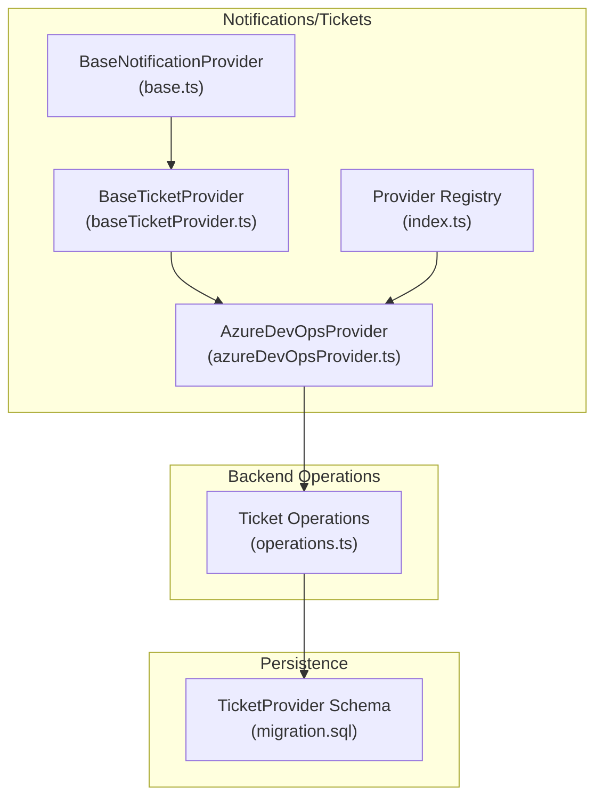
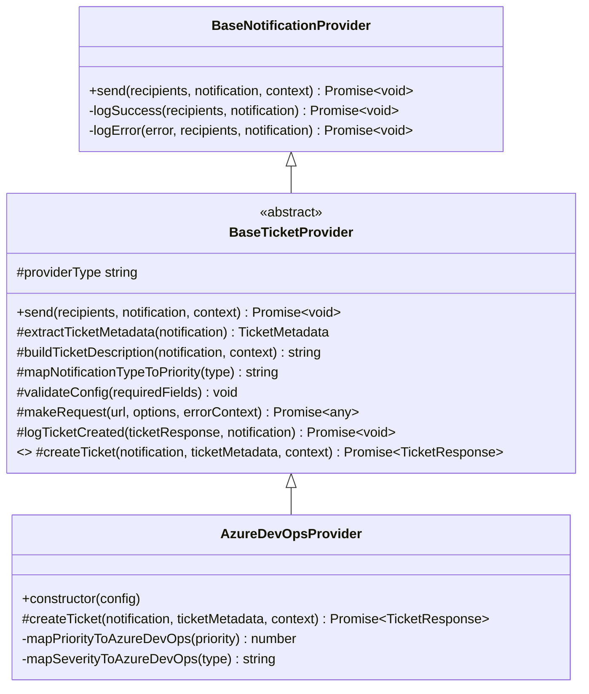
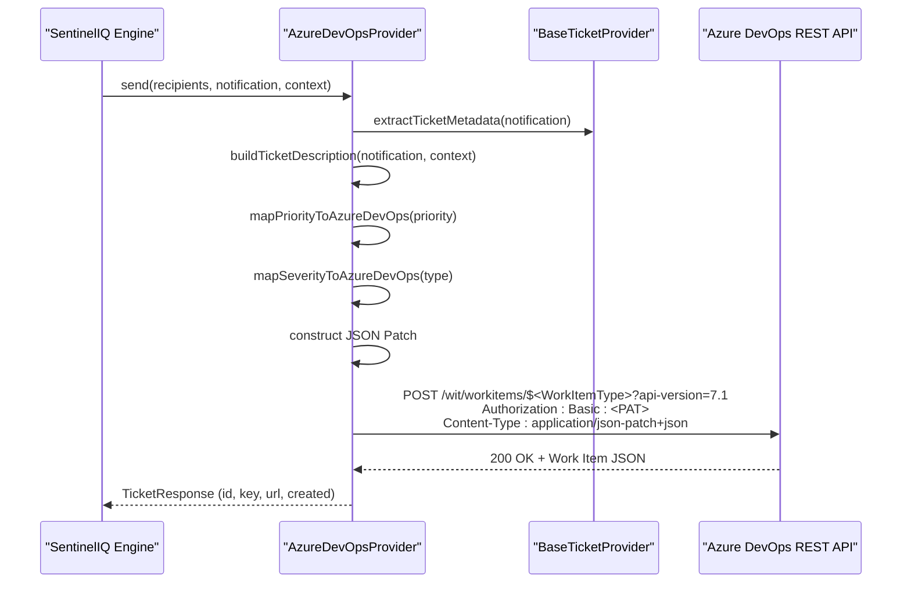
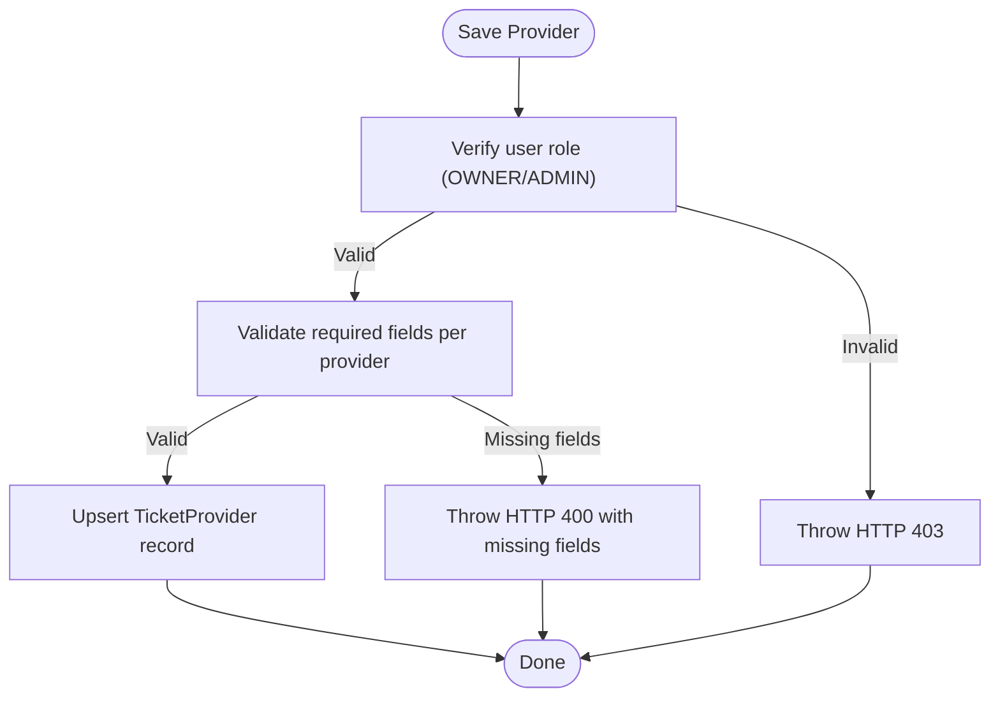
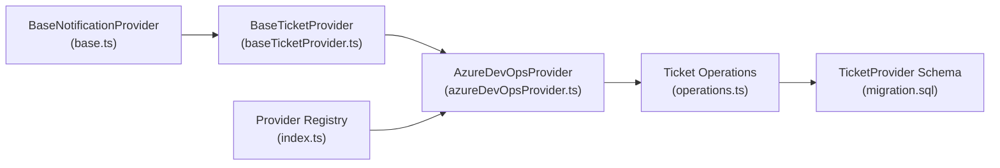

# Azure DevOps Integration

<cite>
**Referenced Files in This Document**
- [azureDevOpsProvider.ts](file://src/core/notifications/providers/tickets/azureDevOpsProvider.ts)
- [baseTicketProvider.ts](file://src/core/notifications/providers/tickets/baseTicketProvider.ts)
- [index.ts](file://src/core/notifications/providers/tickets/index.ts)
- [operations.ts](file://src/core/tickets/operations.ts)
- [migration.sql](file://migrations/20251117231659_add_ticket_providers/migration.sql)
- [base.ts](file://src/core/notifications/providers/base.ts)
</cite>

## Table of Contents
1. [Introduction](#introduction)
2. [Project Structure](#project-structure)
3. [Core Components](#core-components)
4. [Architecture Overview](#architecture-overview)
5. [Detailed Component Analysis](#detailed-component-analysis)
6. [Dependency Analysis](#dependency-analysis)
7. [Performance Considerations](#performance-considerations)
8. [Troubleshooting Guide](#troubleshooting-guide)
9. [Conclusion](#conclusion)
10. [Appendices](#appendices)

## Introduction
This document explains how SentinelIQ integrates with Azure DevOps to automatically create work items from security alerts. The AzureDevOpsProvider extends the BaseTicketProvider to implement Azure DevOps-specific logic for authentication, field mapping, and API calls. It supports configurable work item types, area and iteration paths, tags, and assignment, and builds rich Markdown descriptions that include investigation context, evidence links, and MITRE ATT&CK mappings.

## Project Structure
The Azure DevOps integration lives under the notification providers for tickets. The key files are:
- Provider implementation: AzureDevOpsProvider
- Base class for ticket providers: BaseTicketProvider
- Provider registry: index.ts
- Backend operations for saving/updating/deleting providers and validation: operations.ts
- Database schema for storing provider configs: migration.sql
- Base notification provider for logging and error handling: base.ts

**Diagram sources**
- [base.ts](file://src/core/notifications/providers/base.ts#L1-L38)
- [baseTicketProvider.ts](file://src/core/notifications/providers/tickets/baseTicketProvider.ts#L1-L202)
- [azureDevOpsProvider.ts](file://src/core/notifications/providers/tickets/azureDevOpsProvider.ts#L1-L159)
- [index.ts](file://src/core/notifications/providers/tickets/index.ts#L1-L26)
- [operations.ts](file://src/core/tickets/operations.ts#L1-L181)
- [migration.sql](file://migrations/20251117231659_add_ticket_providers/migration.sql#L1-L21)

**Section sources**
- [azureDevOpsProvider.ts](file://src/core/notifications/providers/tickets/azureDevOpsProvider.ts#L1-L159)
- [baseTicketProvider.ts](file://src/core/notifications/providers/tickets/baseTicketProvider.ts#L1-L202)
- [index.ts](file://src/core/notifications/providers/tickets/index.ts#L1-L26)
- [operations.ts](file://src/core/tickets/operations.ts#L1-L181)
- [migration.sql](file://migrations/20251117231659_add_ticket_providers/migration.sql#L1-L21)
- [base.ts](file://src/core/notifications/providers/base.ts#L1-L38)

## Core Components
- AzureDevOpsProvider: Implements Azure DevOps work item creation using Basic Authentication with a Personal Access Token (PAT). It constructs a JSON Patch document and posts to the Azure DevOps REST API.
- BaseTicketProvider: Provides shared logic for extracting ticket metadata, building descriptions, logging, and making HTTP requests with error handling.
- Provider Registry: Exposes AzureDevOpsProvider among other ticket providers.
- Backend Operations: Validates configuration, persists provider settings, and enforces access controls.
- Database Schema: Stores provider type, enablement flag, and JSON configuration per workspace.

Key responsibilities:
- Configuration validation for organization, project, PAT, and work item type.
- Mapping of SentinelIQ alert properties to Azure DevOps fields.
- Authentication via Basic Auth with PAT.
- Rich Markdown description construction with workspace context, links, and metadata.
- Logging and error propagation.

**Section sources**
- [azureDevOpsProvider.ts](file://src/core/notifications/providers/tickets/azureDevOpsProvider.ts#L1-L159)
- [baseTicketProvider.ts](file://src/core/notifications/providers/tickets/baseTicketProvider.ts#L1-L202)
- [index.ts](file://src/core/notifications/providers/tickets/index.ts#L1-L26)
- [operations.ts](file://src/core/tickets/operations.ts#L1-L181)
- [migration.sql](file://migrations/20251117231659_add_ticket_providers/migration.sql#L1-L21)

## Architecture Overview
The integration follows a provider pattern:
- A BaseNotificationProvider handles logging and error logging.
- A BaseTicketProvider adds ticket-specific logic (metadata extraction, description building, HTTP requests).
- AzureDevOpsProvider specializes for Azure DevOps: validates config, maps fields, authenticates with PAT, and posts JSON Patch.

**Diagram sources**
- [base.ts](file://src/core/notifications/providers/base.ts#L1-L38)
- [baseTicketProvider.ts](file://src/core/notifications/providers/tickets/baseTicketProvider.ts#L1-L202)
- [azureDevOpsProvider.ts](file://src/core/notifications/providers/tickets/azureDevOpsProvider.ts#L1-L159)

## Detailed Component Analysis

### AzureDevOpsProvider
- Extends BaseTicketProvider and sets providerType to AZURE_DEVOPS.
- Validates configuration for organization, project, and personalAccessToken.
- Builds a JSON Patch document with:
  - Title from notification title
  - Description from buildTicketDescription
  - Priority mapped from ticket metadata priority
  - Severity mapped from notification type
  - Optional Area Path and Iteration Path from config or custom fields
  - Optional Assigned To and Tags
- Authenticates using Basic Auth with empty username and PAT as password.
- Posts to Azure DevOps REST API endpoint for work items with JSON Patch content type.
- Returns a normalized TicketResponse with ticketId, ticketKey, ticketUrl, createdAt, and provider.

**Diagram sources**
- [azureDevOpsProvider.ts](file://src/core/notifications/providers/tickets/azureDevOpsProvider.ts#L1-L159)
- [baseTicketProvider.ts](file://src/core/notifications/providers/tickets/baseTicketProvider.ts#L1-L202)

**Section sources**
- [azureDevOpsProvider.ts](file://src/core/notifications/providers/tickets/azureDevOpsProvider.ts#L1-L159)

### BaseTicketProvider
- Provides shared functionality:
  - extractTicketMetadata: derives priority, status, assignedTo, labels/tags, dueDate, project, category, severity, source, and customFields from notification metadata and config defaults.
  - buildTicketDescription: constructs a Markdown description including title, message, workspace name, link, additional metadata, and a timestamp footer.
  - mapNotificationTypeToPriority: maps notification types to priority values.
  - validateConfig: throws if required fields are missing.
  - makeRequest: performs fetch with response validation and JSON parsing when applicable.
  - logTicketCreated: logs successful creation with provider, ticket identifiers, and notification details.

**Section sources**
- [baseTicketProvider.ts](file://src/core/notifications/providers/tickets/baseTicketProvider.ts#L1-L202)

### Provider Registry
- Exports BaseTicketProvider, individual providers (including AzureDevOpsProvider), and re-exports them for consumers.

**Section sources**
- [index.ts](file://src/core/notifications/providers/tickets/index.ts#L1-L26)

### Backend Operations and Persistence
- saveTicketProvider: validates provider config, checks admin/owner permissions, and upserts provider settings per workspace.
- toggleTicketProvider: enables/disables a provider for a workspace with role checks.
- deleteTicketProvider: removes a provider with role checks.
- validateTicketProviderConfig: enforces required fields per provider type, including AZURE_DEVOPS requiring organization, project, personalAccessToken, and workItemType.

**Diagram sources**
- [operations.ts](file://src/core/tickets/operations.ts#L1-L181)

**Section sources**
- [operations.ts](file://src/core/tickets/operations.ts#L1-L181)
- [migration.sql](file://migrations/20251117231659_add_ticket_providers/migration.sql#L1-L21)

## Dependency Analysis
- AzureDevOpsProvider depends on BaseTicketProvider for shared logic and on BaseNotificationProvider for logging/error handling.
- Backend operations depend on the database schema to persist provider configurations and enforce access control.
- The provider registry exposes AzureDevOpsProvider alongside other ticket providers.

**Diagram sources**
- [base.ts](file://src/core/notifications/providers/base.ts#L1-L38)
- [baseTicketProvider.ts](file://src/core/notifications/providers/tickets/baseTicketProvider.ts#L1-L202)
- [azureDevOpsProvider.ts](file://src/core/notifications/providers/tickets/azureDevOpsProvider.ts#L1-L159)
- [index.ts](file://src/core/notifications/providers/tickets/index.ts#L1-L26)
- [operations.ts](file://src/core/tickets/operations.ts#L1-L181)
- [migration.sql](file://migrations/20251117231659_add_ticket_providers/migration.sql#L1-L21)

**Section sources**
- [azureDevOpsProvider.ts](file://src/core/notifications/providers/tickets/azureDevOpsProvider.ts#L1-L159)
- [baseTicketProvider.ts](file://src/core/notifications/providers/tickets/baseTicketProvider.ts#L1-L202)
- [index.ts](file://src/core/notifications/providers/tickets/index.ts#L1-L26)
- [operations.ts](file://src/core/tickets/operations.ts#L1-L181)
- [migration.sql](file://migrations/20251117231659_add_ticket_providers/migration.sql#L1-L21)

## Performance Considerations
- Network latency and Azure DevOps API throughput: Each alert triggers a synchronous HTTP request. For high-volume environments, consider batching or asynchronous processing at the engine level.
- JSON Patch payload size: Large descriptions or many tags increase request size; keep descriptions concise while preserving context.
- PAT usage: Reuse PATs across work items; avoid frequent token rotation during alert bursts.
- Concurrency: If multiple alerts arrive rapidly, Azure DevOps may throttle; implement backpressure or retry with exponential backoff at the engine layer.

[No sources needed since this section provides general guidance]

## Troubleshooting Guide

Common issues and resolutions:
- Authentication failures (HTTP 401):
  - Ensure the PAT has the correct scopes for work item read/write.
  - Verify organization and project names are correct.
  - Confirm the PAT is stored securely and not expired.
- Permission issues:
  - The PAT must grant write access to the target project’s work items.
  - The Azure DevOps user associated with the PAT must have permissions to create work items in the specified project.
- Work item validation errors:
  - Missing required fields: Ensure workItemType is set and supported by the project.
  - Invalid area or iteration path: Confirm the paths exist in the project.
  - Invalid priority/severity mapping: The provider maps priorities and severities; verify the project supports the mapped values.
- Network errors:
  - The provider uses fetch with response validation; inspect error messages for HTTP status and response body.
- Configuration validation errors:
  - Missing required fields for AZURE_DEVOPS provider will cause a 400 error during save.

Where to look in code:
- Authentication and request construction: [azureDevOpsProvider.ts](file://src/core/notifications/providers/tickets/azureDevOpsProvider.ts#L90-L127)
- Field mapping: [azureDevOpsProvider.ts](file://src/core/notifications/providers/tickets/azureDevOpsProvider.ts#L129-L158)
- Metadata extraction and description building: [baseTicketProvider.ts](file://src/core/notifications/providers/tickets/baseTicketProvider.ts#L76-L144)
- HTTP request and error handling: [baseTicketProvider.ts](file://src/core/notifications/providers/tickets/baseTicketProvider.ts#L173-L201)
- Configuration validation: [operations.ts](file://src/core/tickets/operations.ts#L161-L181)

**Section sources**
- [azureDevOpsProvider.ts](file://src/core/notifications/providers/tickets/azureDevOpsProvider.ts#L90-L158)
- [baseTicketProvider.ts](file://src/core/notifications/providers/tickets/baseTicketProvider.ts#L76-L201)
- [operations.ts](file://src/core/tickets/operations.ts#L161-L181)

## Conclusion
The Azure DevOps integration in SentinelIQ provides a robust, extensible way to convert security alerts into Azure DevOps work items. It leverages a shared provider framework, strong configuration validation, and clear field mapping to ensure reliable synchronization with Azure DevOps workflows. Administrators can manage provider settings per workspace, and the system logs successes and failures consistently.

[No sources needed since this section summarizes without analyzing specific files]

## Appendices

### Configuration Requirements
- organization: Azure DevOps organization name
- project: Target project name
- personalAccessToken: PAT with work item read/write scope
- workItemType: Work item type (default: Bug; others supported include Task, Issue, User Story)
- areaPath: Optional area path
- iterationPath: Optional iteration path

Validation enforced by backend:
- AZURE_DEVOPS requires organization, project, personalAccessToken, and workItemType.

**Section sources**
- [azureDevOpsProvider.ts](file://src/core/notifications/providers/tickets/azureDevOpsProvider.ts#L1-L37)
- [operations.ts](file://src/core/tickets/operations.ts#L161-L181)

### Authentication Mechanism
- Uses Basic Authentication with an empty username and the PAT as the password.
- Authorization header is constructed accordingly before calling the Azure DevOps REST API.

**Section sources**
- [azureDevOpsProvider.ts](file://src/core/notifications/providers/tickets/azureDevOpsProvider.ts#L90-L127)

### Field Mapping Between SentinelIQ and Azure DevOps
- Title: notification.title
- Description: buildTicketDescription with workspace name, link, and metadata
- Priority: mapped from ticket metadata priority to Azure DevOps priority scale
- Severity: mapped from notification type to Azure DevOps severity
- Area Path: from config or customFields.areaPath
- Iteration Path: from config or customFields.iterationPath
- Assigned To: from ticketMetadata.assignedTo
- Tags: from ticketMetadata.tags

**Section sources**
- [azureDevOpsProvider.ts](file://src/core/notifications/providers/tickets/azureDevOpsProvider.ts#L39-L127)
- [baseTicketProvider.ts](file://src/core/notifications/providers/tickets/baseTicketProvider.ts#L112-L144)

### Triggering Work Item Creation from Security Events
- When an alert is processed, the provider extracts metadata, builds a Markdown description enriched with context, and posts a JSON Patch to Azure DevOps.
- The response returns identifiers and URLs for the created work item.

**Section sources**
- [baseTicketProvider.ts](file://src/core/notifications/providers/tickets/baseTicketProvider.ts#L53-L71)
- [azureDevOpsProvider.ts](file://src/core/notifications/providers/tickets/azureDevOpsProvider.ts#L25-L127)

### Setup Instructions (Admin Interface)
- Save provider configuration:
  - Provider type: AZURE_DEVOPS
  - Config fields: organization, project, personalAccessToken, workItemType, optional areaPath/iterationPath
  - Enable/disable toggles provider availability
- Access control:
  - Only workspace owners/admins can save/update/delete providers.
- Validation:
  - Backend validates required fields before persisting.

**Section sources**
- [operations.ts](file://src/core/tickets/operations.ts#L41-L86)
- [operations.ts](file://src/core/tickets/operations.ts#L88-L123)
- [operations.ts](file://src/core/tickets/operations.ts#L125-L159)
- [operations.ts](file://src/core/tickets/operations.ts#L161-L181)

### Best Practices Aligned with Azure DevOps Workflows
- Use areaPath and iterationPath to align with team and sprint structures.
- Assign work items to specific users when appropriate.
- Tag work items for filtering and reporting.
- Keep descriptions concise yet informative; include links to relevant investigations.
- Align work item types with your team’s process (Bug, Task, Issue, User Story).

[No sources needed since this section provides general guidance]

### Rate Limiting and Synchronization Delays
- Azure DevOps APIs may impose rate limits; implement backoff and retry strategies at the engine layer if needed.
- Synchronization delays can occur due to API throttling or network conditions; monitor logs and adjust alert volume or batching accordingly.

[No sources needed since this section provides general guidance]