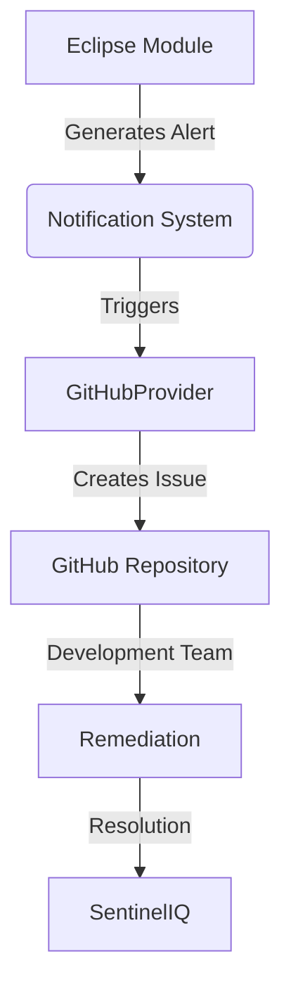
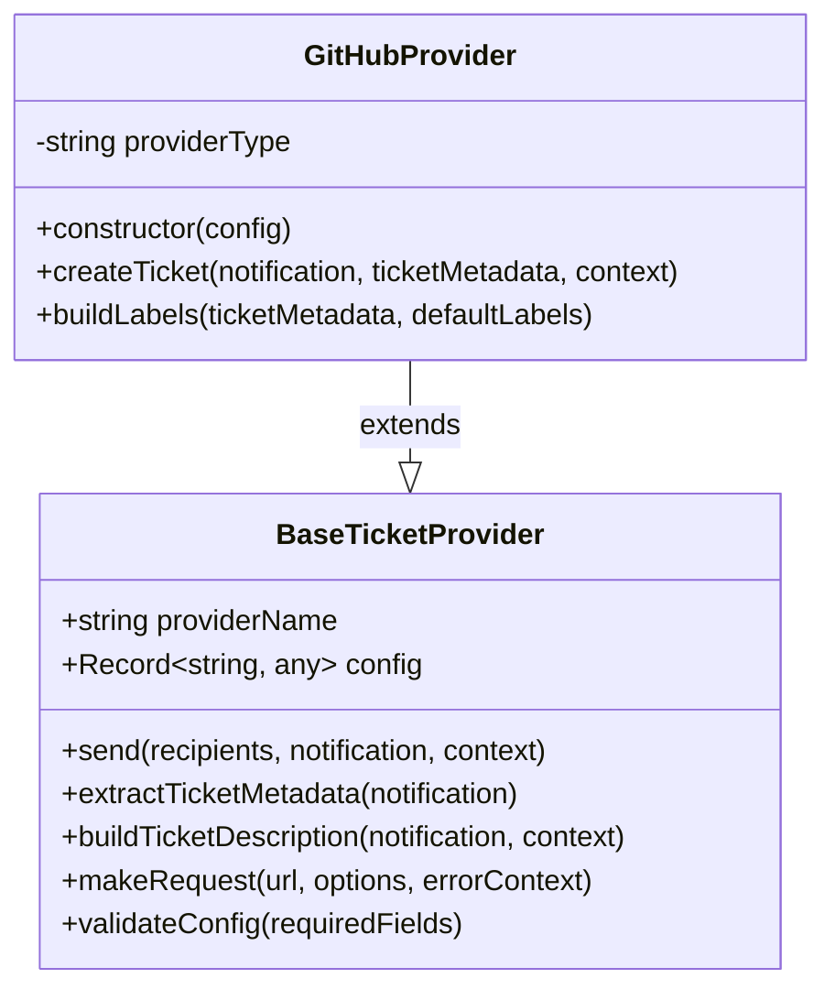
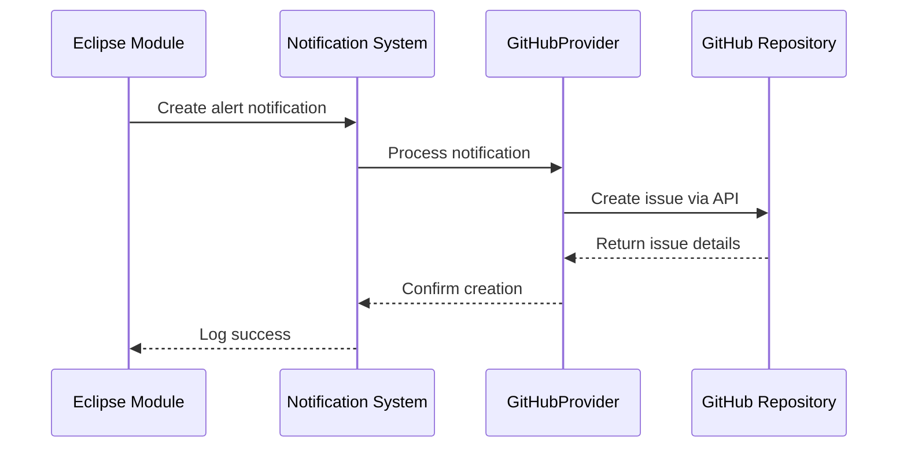
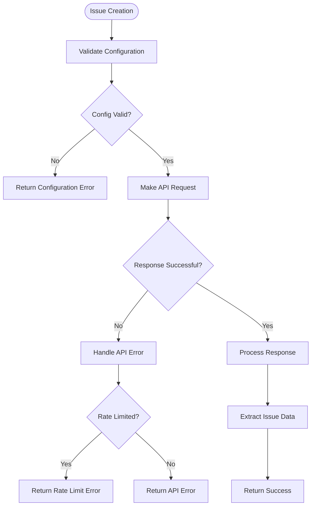

# GitHub Issues Integration

<cite>
**Referenced Files in This Document**   
- [githubProvider.ts](file://src/core/notifications/providers/tickets/githubProvider.ts)
- [baseTicketProvider.ts](file://src/core/notifications/providers/tickets/baseTicketProvider.ts)
- [types.ts](file://src/core/notifications/types.ts)
- [operations.ts](file://src/core/modules/eclipse/operations.ts)
- [notifications.ts](file://src/core/modules/eclipse/utils/notifications.ts)
- [tickets/operations.ts](file://src/core/tickets/operations.ts)
</cite>

## Table of Contents
1. [Introduction](#introduction)
2. [Architecture Overview](#architecture-overview)
3. [GitHubProvider Implementation](#githubprovider-implementation)
4. [Configuration Requirements](#configuration-requirements)
5. [Alert to Issue Mapping](#alert-to-issue-mapping)
6. [Eclipse Brand Infringement Integration](#eclipse-brand-infringement-integration)
7. [Error Handling](#error-handling)
8. [Setup Instructions](#setup-instructions)
9. [Best Practices](#best-practices)

## Introduction
The GitHub Issues integration in SentinelIQ enables security teams to automatically create GitHub issues from security alerts, specifically for brand protection monitoring through the Eclipse module. This integration bridges the gap between security detection and development remediation workflows by transforming security alerts into actionable development tasks. The integration uses the GitHub REST API to create issues with comprehensive context, enabling development teams to respond to brand infringement incidents efficiently.

## Architecture Overview
The GitHub Issues integration follows a provider-based architecture where the GitHubProvider extends a common BaseTicketProvider to implement GitHub-specific functionality. The integration is triggered when security alerts are generated in the Eclipse module, which then creates notifications that are processed by the notification system to create corresponding GitHub issues.

**Diagram sources**
- [githubProvider.ts](file://src/core/notifications/providers/tickets/githubProvider.ts)
- [operations.ts](file://src/core/modules/eclipse/operations.ts)

## GitHubProvider Implementation
The GitHubProvider class extends the BaseTicketProvider to implement GitHub-specific functionality for creating issues in repositories. The provider uses the GitHub REST API to create issues with comprehensive details from security alerts.

### Inheritance and Base Functionality
The GitHubProvider inherits from BaseTicketProvider, which provides common functionality for ticket system integrations. This inheritance pattern allows for consistent behavior across different ticket providers while enabling platform-specific implementations.

**Diagram sources**
- [githubProvider.ts](file://src/core/notifications/providers/tickets/githubProvider.ts)
- [baseTicketProvider.ts](file://src/core/notifications/providers/tickets/baseTicketProvider.ts)

### Issue Creation Process
The createTicket method in GitHubProvider handles the creation of GitHub issues by constructing the appropriate payload and making the API request. The process involves building the issue payload with title, body, labels, and other metadata, then making a POST request to the GitHub API.

**Section sources**
- [githubProvider.ts](file://src/core/notifications/providers/tickets/githubProvider.ts#L23-L70)

## Configuration Requirements
The GitHub Issues integration requires specific configuration parameters to authenticate and connect to GitHub repositories. These configurations are validated upon setup to ensure all required fields are present.

### Required Configuration Parameters
The integration requires the following configuration parameters:

| Parameter | Description | Required |
|---------|-----------|---------|
| token | GitHub Personal Access Token with 'repo' scope | Yes |
| owner | Repository owner (username or organization) | Yes |
| repo | Repository name | Yes |
| labels | Default labels to apply to created issues | No |

The configuration is validated in the constructor using the validateConfig method inherited from BaseTicketProvider, which checks for the presence of required fields.

**Section sources**
- [githubProvider.ts](file://src/core/notifications/providers/tickets/githubProvider.ts#L18-L21)

### Authentication Methods
The integration supports two authentication methods for accessing GitHub repositories:

1. **Personal Access Tokens (PAT)**: The recommended method where a GitHub Personal Access Token with 'repo' scope is used for authentication. This token must be generated from the user's GitHub account settings.

2. **GitHub Apps**: While not explicitly implemented in the current code, GitHub Apps could be used with appropriate permissions (issues:write) to provide more granular access control.

The authentication is implemented using Bearer token authentication in the API requests, with the token provided in the Authorization header.

**Section sources**
- [githubProvider.ts](file://src/core/notifications/providers/tickets/githubProvider.ts#L53-L56)

## Alert to Issue Mapping
The integration maps security alert properties from SentinelIQ to GitHub issue fields, ensuring that all relevant information is transferred to the development team.

### Field Mapping
The following table shows how SentinelIQ alert properties are mapped to GitHub issue fields:

| SentinelIQ Alert Property | GitHub Issue Field | Description |
|--------------------------|-------------------|-------------|
| notification.title | title | The title of the GitHub issue |
| notification.message | body | The main content of the issue |
| ticketMetadata.labels | labels | Labels applied to the issue |
| ticketMetadata.assignedTo | assignees | GitHub usernames assigned to the issue |
| ticketMetadata.customFields.milestone | milestone | Milestone to associate with the issue |

### Issue Description Generation
The integration generates comprehensive Markdown descriptions for GitHub issues using the buildTicketDescription method inherited from BaseTicketProvider. The description includes the alert title, message, workspace context, view details link, additional metadata, and a timestamp.

The description follows a structured format:
- Main alert title as H2
- Alert message as plain text
- Workspace context (if available)
- View details link
- Additional information section with metadata
- Creation timestamp

**Section sources**
- [baseTicketProvider.ts](file://src/core/notifications/providers/tickets/baseTicketProvider.ts#L112-L143)

### Label Management
The integration automatically generates labels based on alert metadata and configuration. The buildLabels method creates a comprehensive set of labels including:

- Default labels from configuration
- Priority labels (e.g., "priority: high")
- Severity labels (e.g., "severity: critical")
- Custom labels from metadata
- Tags as labels
- Source label ("source: sentineliq")

This labeling system helps development teams quickly identify and filter issues based on priority, severity, and other attributes.

**Section sources**
- [githubProvider.ts](file://src/core/notifications/providers/tickets/githubProvider.ts#L75-L102)

## Eclipse Brand Infringement Integration
The integration is specifically designed to handle Eclipse brand infringement alerts, transforming them into GitHub issues for remediation tracking.

### Alert Generation Process
When a brand infringement is detected by the Eclipse module, the following process occurs:

1. An alert is created in the Eclipse module
2. The alert triggers a notification with relevant metadata
3. The notification is processed by the GitHubProvider
4. A GitHub issue is created with the alert details

The notifyBrandAlert function in the Eclipse module creates notifications for workspace members when a new alert is detected, including relevant metadata such as alert ID, brand ID, brand name, severity, and URL.

**Diagram sources**
- [operations.ts](file://src/core/modules/eclipse/operations.ts#L690-L739)
- [notifications.ts](file://src/core/modules/eclipse/utils/notifications.ts#L1-L35)

### Example: Eclipse Brand Infringement Alert
When an Eclipse brand infringement alert is generated for a company like "Eclipse", the integration creates a GitHub issue with the following characteristics:

- **Title**: "New critical alert for Eclipse"
- **Body**: Includes the alert title, message, workspace context, view details link, and additional metadata
- **Labels**: Includes "priority: critical", "severity: critical", "source: sentineliq", and any custom labels
- **Assignees**: Assigned to the appropriate development team members if specified

The issue provides a direct link to the alert details in SentinelIQ, allowing developers to access the full investigation context, evidence links, and MITRE ATT&CK references.

**Section sources**
- [notifications.ts](file://src/core/modules/eclipse/utils/notifications.ts#L3-L35)

## Error Handling
The integration includes comprehensive error handling for various failure scenarios to ensure reliability and provide meaningful feedback.

### Repository Access Issues
When the integration cannot access the specified repository, it throws an error with details from the GitHub API response. This could occur due to:
- Invalid repository owner or name
- Insufficient permissions for the token
- Repository not existing
- Network connectivity issues

The error handling is implemented in the makeRequest method, which captures the HTTP status and response text to provide detailed error messages.

### Rate Limiting
GitHub API rate limiting is handled automatically by the integration. When rate limits are exceeded, the GitHub API returns a 403 status code with rate limit information. The integration captures this error and propagates it with context, allowing administrators to monitor and address rate limiting issues.

### Validation Errors
Configuration validation errors are handled in the constructor and createTicket method. The validateConfig method checks for required fields and throws descriptive errors when missing. This prevents the integration from attempting to create issues with incomplete configuration.

**Diagram sources**
- [baseTicketProvider.ts](file://src/core/notifications/providers/tickets/baseTicketProvider.ts#L176-L199)

**Section sources**
- [baseTicketProvider.ts](file://src/core/notifications/providers/tickets/baseTicketProvider.ts#L163-L171)

## Setup Instructions
Configuring the GitHub Issues integration in SentinelIQ involves several steps through the admin interface.

### Configuration in Admin Interface
1. Navigate to the workspace settings in the SentinelIQ admin interface
2. Select the "Integrations" or "Notification Providers" section
3. Choose "GitHub Issues" as the provider
4. Enter the required configuration:
   - GitHub Personal Access Token
   - Repository owner (organization or username)
   - Repository name
   - Optional default labels
5. Test the connection to verify configuration
6. Enable the integration

The configuration is stored securely and validated before being saved, ensuring all required fields are present and correct.

### Permission Requirements
For the integration to work properly, the GitHub token must have the following permissions:
- **repo**: Full control of private repositories (required for creating issues)
- Specifically, the "issues:write" scope is needed to create and modify issues

For organization repositories, ensure the token belongs to a user with appropriate access rights to the target repository.

**Section sources**
- [tickets/operations.ts](file://src/core/tickets/operations.ts#L44-L85)

## Best Practices
To maximize the effectiveness of the GitHub Issues integration, follow these best practices:

### Maintaining Traceability
Ensure traceability between security events and development tasks by:
- Using consistent labeling conventions
- Including direct links to SentinelIQ alerts in issue descriptions
- Maintaining bidirectional references between GitHub issues and SentinelIQ alerts
- Using the source: sentineliq label to identify issues created by the integration

### Public vs. Private Repositories
When using public repositories, be cautious about sensitive information in issue descriptions. Consider:
- Avoiding detailed technical information that could expose vulnerabilities
- Using private repositories for sensitive security issues
- Redacting sensitive data from issue descriptions
- Using GitHub's security advisories for vulnerability reporting

### Sensitive Information Handling
When creating issues from security alerts, follow these guidelines for handling sensitive information:
- Never include credentials, API keys, or other secrets in issue descriptions
- Use placeholder values for sensitive data
- Link to internal documentation instead of including sensitive details
- Use private repositories for issues containing sensitive information

### Integration Maintenance
Regularly maintain the integration by:
- Monitoring for rate limiting issues
- Rotating GitHub tokens periodically
- Reviewing and updating label configurations
- Ensuring repository access permissions remain valid
- Testing the integration after configuration changes

**Section sources**
- [githubProvider.ts](file://src/core/notifications/providers/tickets/githubProvider.ts)
- [baseTicketProvider.ts](file://src/core/notifications/providers/tickets/baseTicketProvider.ts)