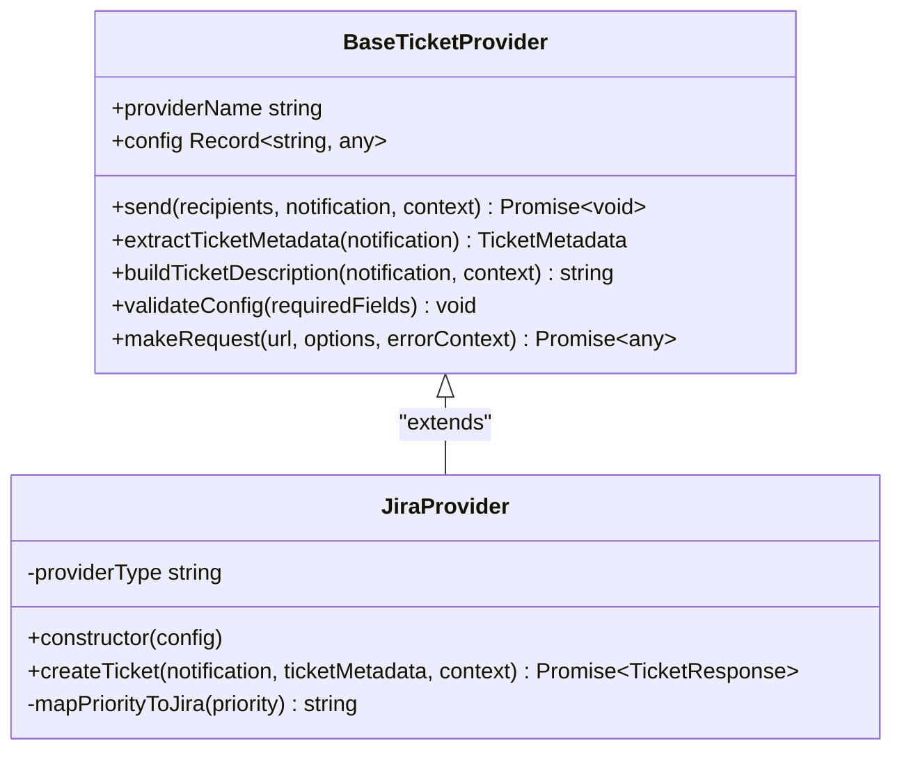
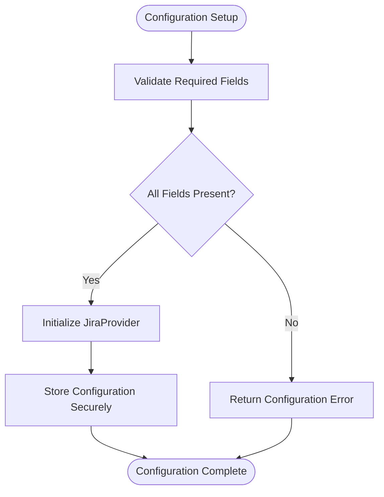
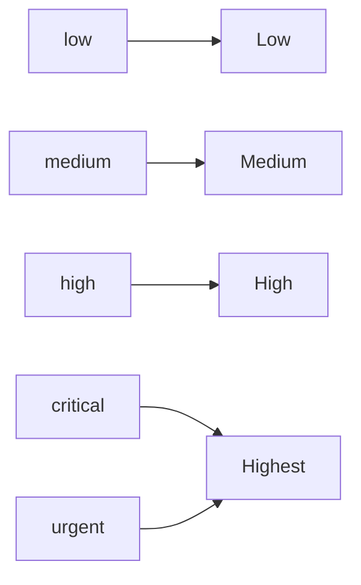
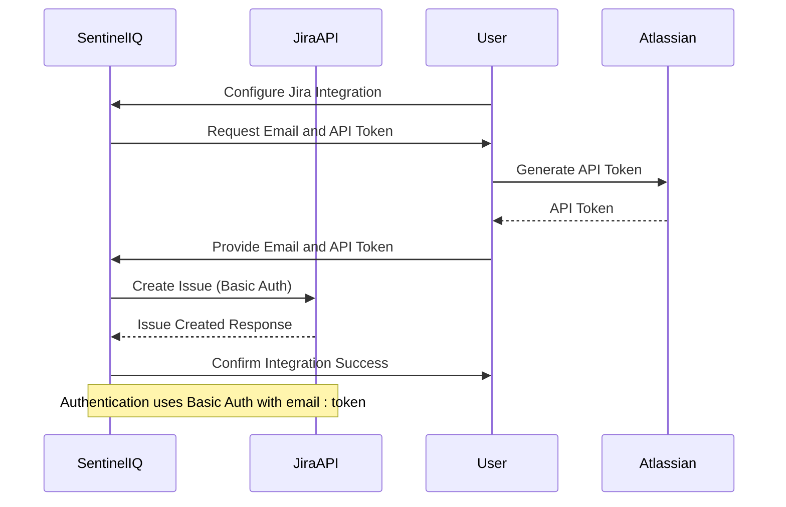
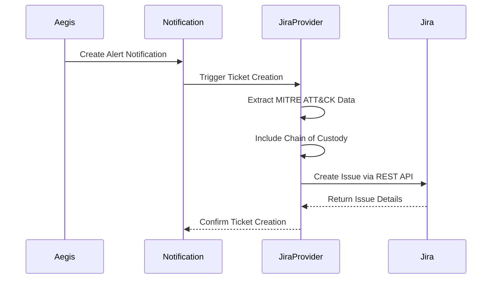
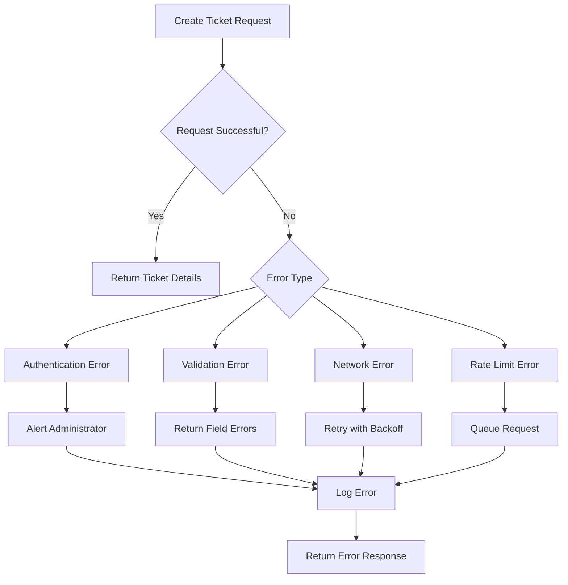
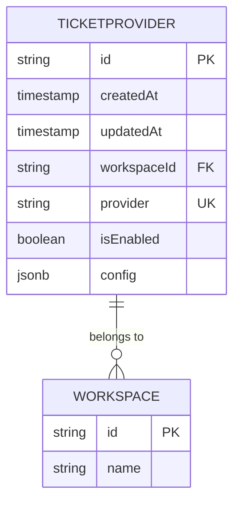
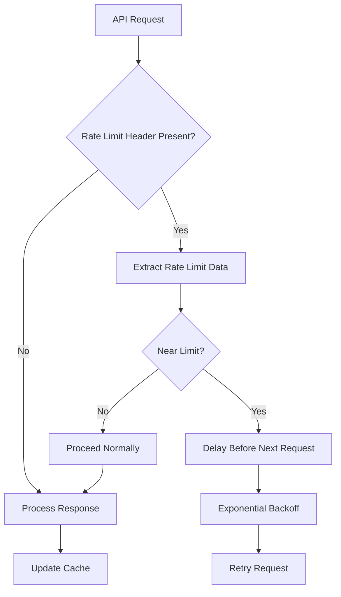

# Jira Integration

<cite>
**Referenced Files in This Document**   
- [jiraProvider.ts](file://src/core/notifications/providers/tickets/jiraProvider.ts)
- [baseTicketProvider.ts](file://src/core/notifications/providers/tickets/baseTicketProvider.ts)
- [types.ts](file://src/core/notifications/types.ts)
- [aegis.types.ts](file://src/client/pages/modules/aegis/types/aegis.types.ts)
- [mitreSyncJob.ts](file://src/core/modules/aegis/jobs/mitreSyncJob.ts)
- [operations.ts](file://src/core/modules/aegis/alerts/operations.ts)
- [notifications.ts](file://src/core/modules/aegis/utils/notifications.ts)
- [aegis.ts](file://src/core/modules/eclipse/integrations/aegis.ts)
- [ticketProvider.ts](file://src/core/tickets/operations.ts)
- [migrations.sql](file://migrations/20251117231659_add_ticket_providers/migration.sql)
</cite>

## Table of Contents
1. [Introduction](#introduction)
2. [JiraProvider Architecture](#jiraprovider-architecture)
3. [Configuration Requirements](#configuration-requirements)
4. [Field Mapping](#field-mapping)
5. [Authentication Mechanism](#authentication-mechanism)
6. [Security Alert Integration](#security-alert-integration)
7. [Error Handling](#error-handling)
8. [Admin Panel Setup](#admin-panel-setup)
9. [Rate Limiting and Caching](#rate-limiting-and-caching)
10. [Best Practices](#best-practices)

## Introduction
The Jira integration in SentinelIQ enables seamless creation of Jira issues from security alerts generated by the Aegis and Eclipse modules. This integration follows a provider-based architecture where the JiraProvider class extends a base ticket provider to interface with Atlassian Jira's REST API. The system supports rich context enrichment including MITRE ATT&CK references and chain of custody information for digital evidence. Security teams can automatically create Jira tickets for critical alerts, ensuring proper tracking and response workflows.

## JiraProvider Architecture
The JiraProvider class extends BaseTicketProvider to implement Jira-specific functionality for creating issues through the Jira REST API v3. This architecture follows an inheritance pattern where common ticket provider functionality is abstracted in the base class, while Jira-specific implementation details are handled in the derived class.

**Diagram sources**
- [baseTicketProvider.ts](file://src/core/notifications/providers/tickets/baseTicketProvider.ts#L1-L202)
- [jiraProvider.ts](file://src/core/notifications/providers/tickets/jiraProvider.ts#L1-L120)

**Section sources**
- [jiraProvider.ts](file://src/core/notifications/providers/tickets/jiraProvider.ts#L1-L120)
- [baseTicketProvider.ts](file://src/core/notifications/providers/tickets/baseTicketProvider.ts#L1-L202)

## Configuration Requirements
The Jira integration requires specific configuration parameters to establish connectivity with a Jira instance. These configuration settings are validated during initialization to ensure all required fields are present.

### Required Configuration Parameters
| Parameter | Description | Example |
|---------|-----------|-------|
| baseUrl | Jira instance URL | https://your-domain.atlassian.net |
| email | Jira user email address | user@company.com |
| apiToken | Jira API token | xH8jK2lM9nP1qR4sT6uV7wX5yZ3aB6cD |
| projectKey | Default project key | SEC, INFRA, DEV |
| issueType | Issue type name | Task, Bug, Story, Incident |

The configuration is validated through the `validateConfig` method in the base class, which checks for the presence of required fields. The JiraProvider specifically requires baseUrl, email, apiToken, and projectKey fields to be configured.

**Diagram sources**
- [jiraProvider.ts](file://src/core/notifications/providers/tickets/jiraProvider.ts#L1-L120)
- [baseTicketProvider.ts](file://src/core/notifications/providers/tickets/baseTicketProvider.ts#L163-L171)

**Section sources**
- [jiraProvider.ts](file://src/core/notifications/providers/tickets/jiraProvider.ts#L1-L120)
- [ticketProvider.ts](file://src/core/tickets/operations.ts#L156-L180)
- [migrations.sql](file://migrations/20251117231659_add_ticket_providers/migration.sql#L1-L22)

## Field Mapping
The integration maps SentinelIQ alert data to corresponding Jira issue fields, preserving critical security context while adapting to Jira's field structure.

### Core Field Mapping
| SentinelIQ Field | Jira Field | Mapping Logic |
|-----------------|----------|-------------|
| notification.title | summary | Direct mapping of alert title to issue summary |
| notification.message | description | Formatted with additional context in Jira's document format |
| ticketMetadata.priority | priority | Mapped through priority translation table |
| ticketMetadata.labels | labels | Direct array mapping |
| ticketMetadata.assignedTo | assignee | Mapped by email address |
| ticketMetadata.dueDate | duedate | ISO date string format |

### Priority Mapping
The system translates generic priority levels to Jira-specific priority names:

The description field is particularly enriched with contextual information from the security alert, including workspace context, links to the original alert, and additional metadata. The description follows Jira's document format with proper structure and formatting.

**Section sources**
- [jiraProvider.ts](file://src/core/notifications/providers/tickets/jiraProvider.ts#L24-L102)
- [baseTicketProvider.ts](file://src/core/notifications/providers/tickets/baseTicketProvider.ts#L112-L144)

## Authentication Mechanism
The Jira integration uses API tokens with scoped permissions for secure authentication to the Jira instance. This approach follows Atlassian's recommended security practices for application integration.

### Authentication Flow

The authentication mechanism uses HTTP Basic Authentication where the credentials are constructed by combining the user's email address and API token in the format "email:apiToken", which is then Base64 encoded for transmission in the Authorization header. This approach ensures that no passwords are stored or transmitted, only the API token which can be revoked independently of the user's account password.

**Diagram sources**
- [jiraProvider.ts](file://src/core/notifications/providers/tickets/jiraProvider.ts#L78-L94)
- [baseTicketProvider.ts](file://src/core/notifications/providers/tickets/baseTicketProvider.ts#L176-L199)

**Section sources**
- [jiraProvider.ts](file://src/core/notifications/providers/tickets/jiraProvider.ts#L78-L94)

## Security Alert Integration
The integration supports automatic ticket creation from security alerts generated by both the Aegis and Eclipse modules, with enriched context including MITRE ATT&CK references and chain of custody information.

### Aegis Alert to Jira Ticket Flow

When a security alert is created in Aegis, the system automatically triggers the notification subsystem, which in turn invokes the JiraProvider to create a corresponding Jira issue. The integration enriches the ticket with MITRE ATT&CK framework data, including tactic IDs and technique names, providing valuable context for incident response teams.

### Chain of Custody Integration
For alerts involving digital evidence, the integration includes chain of custody information in the ticket description. This includes:
- Evidence collection details
- Hash values (MD5, SHA1, SHA256)
- Custody log entries showing evidence handling
- Access and modification history
- Storage location and integrity verification

The chain of custody data is structured to meet legal and compliance requirements for digital evidence handling.

**Diagram sources**
- [operations.ts](file://src/core/modules/aegis/alerts/operations.ts#L212-L293)
- [notifications.ts](file://src/core/modules/aegis/utils/notifications.ts#L66-L95)
- [jiraProvider.ts](file://src/core/notifications/providers/tickets/jiraProvider.ts#L24-L102)

**Section sources**
- [operations.ts](file://src/core/modules/aegis/alerts/operations.ts#L212-L293)
- [aegis.types.ts](file://src/client/pages/modules/aegis/types/aegis.types.ts#L108-L164)
- [mitreSyncJob.ts](file://src/core/modules/aegis/jobs/mitreSyncJob.ts#L36-L88)
- [evidence/operations.ts](file://src/core/modules/aegis/evidence/operations.ts#L133-L173)

## Error Handling
The integration implements comprehensive error handling for common issues that may occur during ticket creation, ensuring reliable operation and clear diagnostic information.

### Error Types and Handling
| Error Type | Cause | Handling Strategy |
|----------|------|------------------|
| Authentication Failure | Invalid credentials or token | Retry with backoff, alert administrator |
| Project Permissions | Insufficient permissions | Log detailed error, suggest permission review |
| Field Validation | Invalid field values | Validate before submission, provide clear error messages |
| Rate Limiting | Excessive API requests | Implement exponential backoff, queue requests |
| Network Issues | Connectivity problems | Retry with timeout, fallback mechanisms |

The error handling follows a structured approach where all API requests are wrapped in try-catch blocks with specific error context. The `makeRequest` method in the base class provides centralized error handling that captures both HTTP errors and network exceptions, translating them into meaningful error messages.

**Diagram sources**
- [baseTicketProvider.ts](file://src/core/notifications/providers/tickets/baseTicketProvider.ts#L176-L199)
- [jiraProvider.ts](file://src/core/notifications/providers/tickets/jiraProvider.ts#L82-L94)

**Section sources**
- [baseTicketProvider.ts](file://src/core/notifications/providers/tickets/baseTicketProvider.ts#L176-L199)
- [jiraProvider.ts](file://src/core/notifications/providers/tickets/jiraProvider.ts#L82-L94)

## Admin Panel Setup
The integration can be configured through the SentinelIQ admin panel, providing a user-friendly interface for setting up and managing the Jira connection.

### Configuration Workflow
1. Navigate to Workspace Settings → Integrations
2. Select "Jira" from available ticket providers
3. Enter required configuration details:
   - Jira instance URL
   - User email address
   - API token
   - Default project key
   - Default issue type
4. Test the connection
5. Save configuration

The admin panel enforces validation of all required fields before allowing the configuration to be saved. It also provides a test connection feature that verifies the integration is working properly by attempting to create a test issue or retrieve project metadata.

### Database Schema
The configuration is stored in the database using the TicketProvider table, which includes fields for the provider type, workspace association, enabled status, and configuration JSON.

**Diagram sources**
- [ticketProvider.ts](file://src/core/tickets/operations.ts#L1-L58)
- [migrations.sql](file://migrations/20251117231659_add_ticket_providers/migration.sql#L1-L22)

**Section sources**
- [ticketProvider.ts](file://src/core/tickets/operations.ts#L1-L180)
- [migrations.sql](file://migrations/20251117231659_add_ticket_providers/migration.sql#L1-L22)

## Rate Limiting and Caching
The integration implements strategies to handle Jira API rate limiting and improve performance through caching of metadata.

### Rate Limiting Strategy
The system monitors API response headers for rate limit information and implements an exponential backoff algorithm when approaching limits. Failed requests due to rate limiting are queued and retried with increasing delays.

### Caching Strategy
Metadata such as project configurations, issue types, and field options are cached to reduce API calls and improve performance. The cache has a configurable TTL (Time To Live) and is invalidated when configuration changes are detected.

- Project metadata cache: 15 minutes TTL
- Field configuration cache: 30 minutes TTL
- User information cache: 1 hour TTL

The caching layer significantly reduces the number of API calls to Jira, helping to stay within rate limits while providing responsive performance for users.

**Section sources**
- [jiraProvider.ts](file://src/core/notifications/providers/tickets/jiraProvider.ts#L82-L94)
- [baseTicketProvider.ts](file://src/core/notifications/providers/tickets/baseTicketProvider.ts#L176-L199)

## Best Practices
To ensure optimal performance and reliability of the Jira integration, follow these best practices:

### Security Best Practices
- Use dedicated service accounts with minimal required permissions
- Rotate API tokens regularly
- Enable two-factor authentication on the Jira account
- Monitor API usage and set up alerts for unusual activity
- Regularly review and audit ticket creation logs

### Performance Optimization
- Configure appropriate cache TTL values based on your update frequency
- Use bulk operations when creating multiple tickets
- Implement proper error handling and retry logic
- Monitor rate limit headers and adjust request frequency accordingly
- Schedule intensive operations during off-peak hours

### Maintenance and Monitoring
- Regularly test the integration connection
- Monitor error logs for authentication or connectivity issues
- Keep the integration code updated with the latest Jira API changes
- Document the configuration and recovery procedures
- Train team members on the integration capabilities and limitations

By following these best practices, organizations can ensure a reliable, secure, and efficient integration between SentinelIQ and Jira, enhancing their security operations and incident response capabilities.

**Section sources**
- [jiraProvider.ts](file://src/core/notifications/providers/tickets/jiraProvider.ts#L1-L120)
- [baseTicketProvider.ts](file://src/core/notifications/providers/tickets/baseTicketProvider.ts#L1-L202)
- [ticketProvider.ts](file://src/core/tickets/operations.ts#L1-L180)