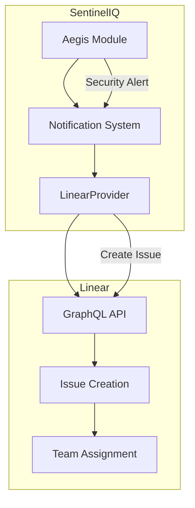
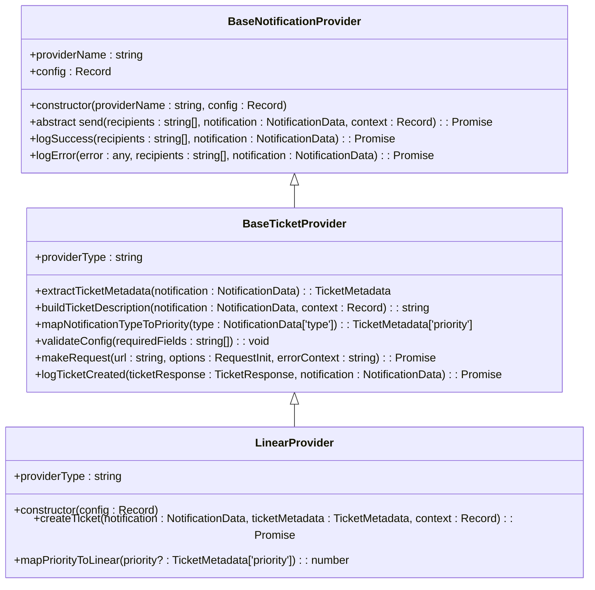
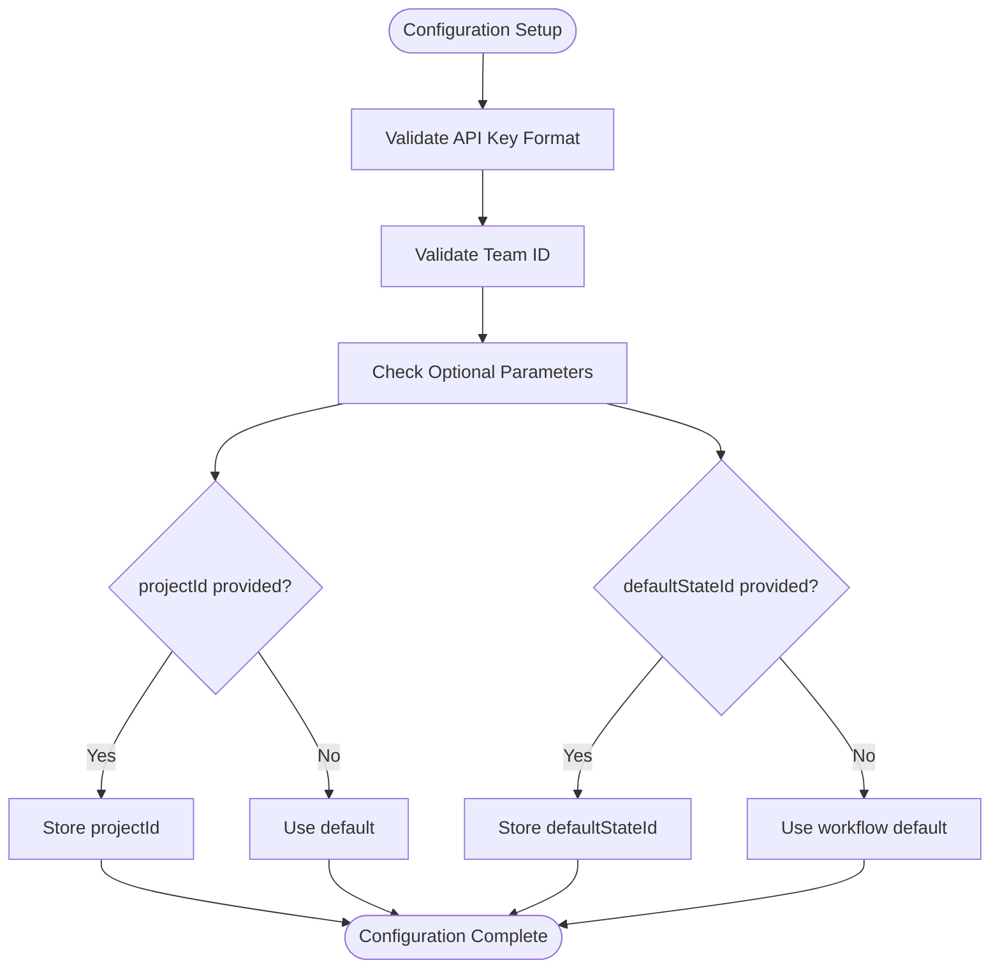
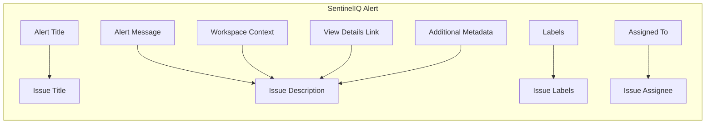
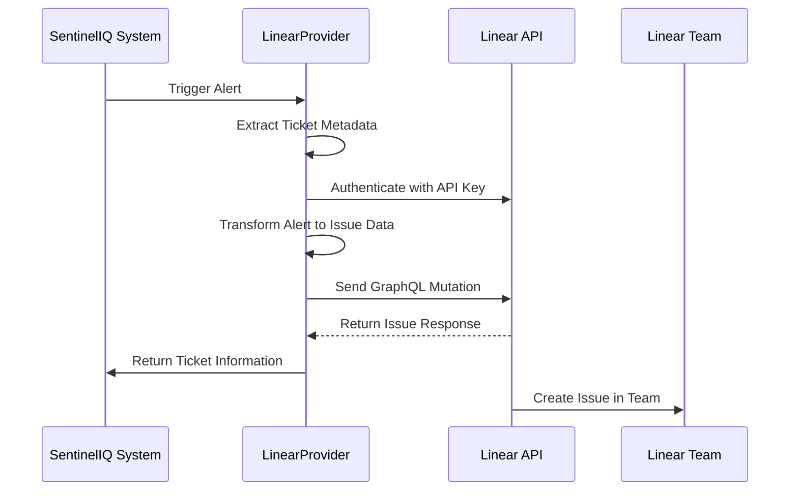
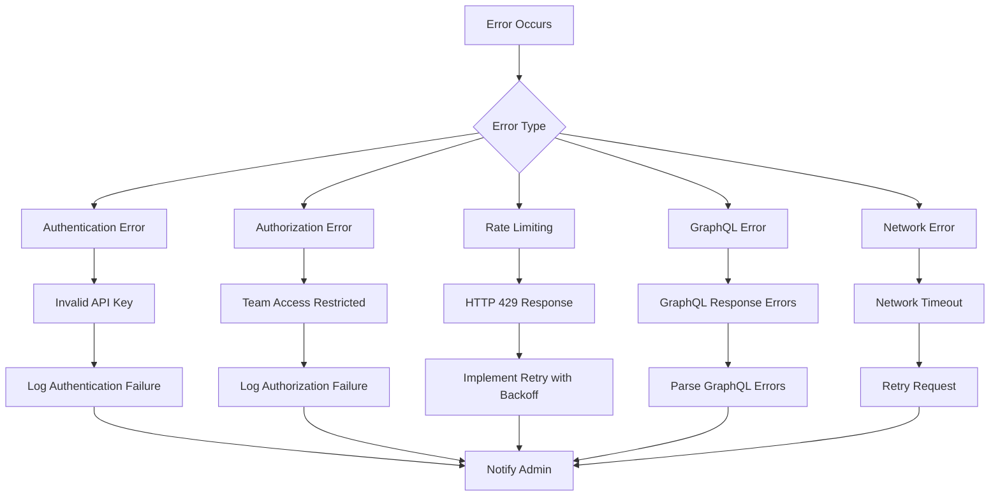
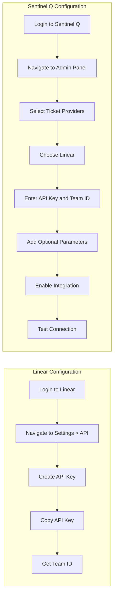

# Linear Integration

<cite>
**Referenced Files in This Document**   
- [linearProvider.ts](file://src/core/notifications/providers/tickets/linearProvider.ts)
- [baseTicketProvider.ts](file://src/core/notifications/providers/tickets/baseTicketProvider.ts)
- [types.ts](file://src/core/notifications/types.ts)
- [operations.ts](file://src/core/tickets/operations.ts)
- [aegis.types.ts](file://src/client/pages/modules/aegis/types/aegis.types.ts)
</cite>

## Table of Contents
1. [Introduction](#introduction)
2. [Architecture Overview](#architecture-overview)
3. [LinearProvider Implementation](#linearprovider-implementation)
4. [Configuration Requirements](#configuration-requirements)
5. [Alert to Issue Transformation](#alert-to-issue-transformation)
6. [Priority Mapping](#priority-mapping)
7. [Integration Workflow](#integration-workflow)
8. [Error Handling](#error-handling)
9. [Setup Instructions](#setup-instructions)
10. [Best Practices](#best-practices)

## Introduction
The Linear integration in SentinelIQ enables automated creation of issues in Linear's issue tracking system from security alerts. This integration connects SentinelIQ's Aegis incident management module with Linear's workflow management capabilities, allowing security teams to automatically generate high-priority issues for critical security alerts. The integration uses Linear's GraphQL API to create issues with enriched alert data, ensuring development teams receive comprehensive context about security incidents that require their attention.

**Section sources**
- [linearProvider.ts](file://src/core/notifications/providers/tickets/linearProvider.ts#L1-L129)

## Architecture Overview
The Linear integration follows a provider-based architecture where the LinearProvider class implements the BaseTicketProvider interface. When a security alert is triggered in SentinelIQ, the notification system processes the alert and routes it to the configured Linear provider. The provider then transforms the alert data into a Linear issue using GraphQL mutations.



**Diagram sources**
- [linearProvider.ts](file://src/core/notifications/providers/tickets/linearProvider.ts#L1-L129)
- [baseTicketProvider.ts](file://src/core/notifications/providers/tickets/baseTicketProvider.ts#L1-L202)

**Section sources**
- [linearProvider.ts](file://src/core/notifications/providers/tickets/linearProvider.ts#L1-L129)
- [baseTicketProvider.ts](file://src/core/notifications/providers/tickets/baseTicketProvider.ts#L1-L202)

## LinearProvider Implementation
The LinearProvider class extends the BaseTicketProvider abstract class and implements the createTicket method to interface with Linear's GraphQL API. The provider handles authentication using API keys, constructs GraphQL mutations for issue creation, and processes responses to return ticket information.

The implementation includes error handling for GraphQL errors and validation of API responses to ensure successful issue creation. The provider also inherits common functionality from the BaseTicketProvider, including configuration validation, logging, and error handling.



**Diagram sources**
- [linearProvider.ts](file://src/core/notifications/providers/tickets/linearProvider.ts#L1-L129)
- [baseTicketProvider.ts](file://src/core/notifications/providers/tickets/baseTicketProvider.ts#L1-L202)

**Section sources**
- [linearProvider.ts](file://src/core/notifications/providers/tickets/linearProvider.ts#L1-L129)
- [baseTicketProvider.ts](file://src/core/notifications/providers/tickets/baseTicketProvider.ts#L1-L202)

## Configuration Requirements
The Linear integration requires specific configuration parameters to establish connectivity with Linear's API and define default behavior for issue creation. The required configuration includes:

- **apiKey**: Linear API key obtained from Linear's settings page, used for authentication
- **teamId**: The ID of the Linear team where issues will be created
- **projectId** (optional): Default project ID for categorizing issues
- **defaultStateId** (optional): Default workflow state ID for new issues

The configuration is validated upon initialization to ensure all required fields are present. The integration uses these configuration values to authenticate requests and set default properties for created issues.



**Diagram sources**
- [linearProvider.ts](file://src/core/notifications/providers/tickets/linearProvider.ts#L8-L14)
- [linearProvider.ts](file://src/core/notifications/providers/tickets/linearProvider.ts#L20-L21)

**Section sources**
- [linearProvider.ts](file://src/core/notifications/providers/tickets/linearProvider.ts#L8-L14)

## Alert to Issue Transformation
The integration transforms SentinelIQ alert data into Linear issue fields through a structured mapping process. The transformation includes converting alert properties to corresponding Linear issue fields such as title, description, labels, and assignee.

The title of the Linear issue is set directly from the alert title. The description field is enriched with Markdown-formatted content that includes the original alert message, workspace context, view details link, and additional metadata. Labels from the alert are mapped to Linear labels, and the assignee is set based on the alert's assignedTo metadata.



**Diagram sources**
- [linearProvider.ts](file://src/core/notifications/providers/tickets/linearProvider.ts#L49-L72)
- [baseTicketProvider.ts](file://src/core/notifications/providers/tickets/baseTicketProvider.ts#L112-L143)

**Section sources**
- [linearProvider.ts](file://src/core/notifications/providers/tickets/linearProvider.ts#L49-L72)
- [baseTicketProvider.ts](file://src/core/notifications/providers/tickets/baseTicketProvider.ts#L112-L143)

## Priority Mapping
The integration maps SentinelIQ alert priorities to Linear's priority system using a predefined mapping. Linear uses a numeric priority system (0-4) where 1 represents Urgent, 2 represents High, 3 represents Medium, and 4 represents Low priority.

The mapping logic converts SentinelIQ's priority levels (critical, urgent, high, medium, low) to their corresponding Linear priority values. Critical and urgent alerts are mapped to Linear's Urgent priority (1), high alerts to High priority (2), medium alerts to Medium priority (3), and low alerts to Low priority (4).

```mermaid
flowchart LR
A[SentinelIQ Priority] --> B[Linear Priority]
C[critical] --> D[Urgent (1)]
E[urgent] --> D
F[high] --> G[High (2)]
H[medium] --> I[Medium (3)]
J[low] --> K[Low (4)]
```

**Diagram sources**
- [linearProvider.ts](file://src/core/notifications/providers/tickets/linearProvider.ts#L117-L126)

**Section sources**
- [linearProvider.ts](file://src/core/notifications/providers/tickets/linearProvider.ts#L117-L126)

## Integration Workflow
The integration workflow begins when a high-severity security alert is detected in SentinelIQ. The system automatically triggers the creation of a high-priority issue in the designated Linear team. The workflow includes authentication, data transformation, issue creation, and status reporting.

When an alert is generated, the notification system extracts ticket metadata and invokes the LinearProvider's send method. The provider authenticates with Linear's API using the configured API key, transforms the alert data into a GraphQL mutation, and sends the request to create an issue. Upon successful creation, the provider returns ticket information that is logged and made available in the system.



**Diagram sources**
- [linearProvider.ts](file://src/core/notifications/providers/tickets/linearProvider.ts#L23-L111)
- [baseTicketProvider.ts](file://src/core/notifications/providers/tickets/baseTicketProvider.ts#L53-L70)

**Section sources**
- [linearProvider.ts](file://src/core/notifications/providers/tickets/linearProvider.ts#L23-L111)

## Error Handling
The integration includes comprehensive error handling for various failure scenarios. Errors are categorized and handled appropriately to ensure reliable operation and provide meaningful feedback for troubleshooting.

Authentication errors occur when the API key is invalid or lacks sufficient permissions. These errors are identified by HTTP 401/403 responses from the Linear API. Team access restrictions result in authorization errors when the authenticated user cannot create issues in the specified team. Rate limiting is handled by catching HTTP 429 responses and implementing retry logic with exponential backoff.

GraphQL-specific errors are captured from the response payload and include detailed error messages from Linear's API. Network errors and timeouts are handled by the underlying HTTP client with appropriate retry mechanisms. All errors are logged with context to facilitate debugging and monitoring.



**Diagram sources**
- [linearProvider.ts](file://src/core/notifications/providers/tickets/linearProvider.ts#L93-L109)
- [baseTicketProvider.ts](file://src/core/notifications/providers/tickets/baseTicketProvider.ts#L176-L199)

**Section sources**
- [linearProvider.ts](file://src/core/notifications/providers/tickets/linearProvider.ts#L93-L109)
- [baseTicketProvider.ts](file://src/core/notifications/providers/tickets/baseTicketProvider.ts#L176-L199)

## Setup Instructions
Configuring the Linear integration in SentinelIQ requires administrative access to both systems. The setup process involves creating an API key in Linear, configuring the integration in SentinelIQ's admin panel, and testing the connection.

In Linear, navigate to Settings > API to create a new API key with appropriate permissions for issue creation. Copy the API key and obtain the team ID for the target team. In SentinelIQ's admin panel, navigate to the ticket providers configuration section and select Linear as the provider. Enter the API key, team ID, and any optional parameters such as project ID or default state ID. Enable the integration and test the connection by creating a sample issue.

The configuration is stored securely in SentinelIQ's database and can be updated or disabled as needed. Only workspace administrators and owners have permission to configure ticket providers, ensuring proper access control.



**Diagram sources**
- [linearProvider.ts](file://src/core/notifications/providers/tickets/linearProvider.ts#L8-L14)
- [operations.ts](file://src/core/tickets/operations.ts#L44-L85)

**Section sources**
- [linearProvider.ts](file://src/core/notifications/providers/tickets/linearProvider.ts#L8-L14)
- [operations.ts](file://src/core/tickets/operations.ts#L44-L85)

## Best Practices
To maintain visibility and effectiveness across security and development teams, several best practices should be followed when using the Linear integration. These practices ensure smooth collaboration, proper issue management, and optimal performance.

Establish clear naming conventions for issues created from security alerts to distinguish them from regular development tasks. Use consistent labeling to categorize issues by type, severity, and affected system components. Configure appropriate notification settings in Linear to ensure development teams are promptly alerted to new security issues without causing notification fatigue.

For bulk alert scenarios, implement rate limiting and batching to prevent overwhelming the Linear API. Monitor the integration's performance and error rates to identify and resolve issues proactively. Regularly review and update the integration configuration to align with evolving security requirements and team structures.

Ensure that API keys are rotated periodically and have the minimum required permissions to reduce security risks. Document the integration workflow and escalation procedures for both security and development teams to ensure everyone understands their roles and responsibilities.

**Section sources**
- [linearProvider.ts](file://src/core/notifications/providers/tickets/linearProvider.ts#L1-L129)
- [baseTicketProvider.ts](file://src/core/notifications/providers/tickets/baseTicketProvider.ts#L1-L202)