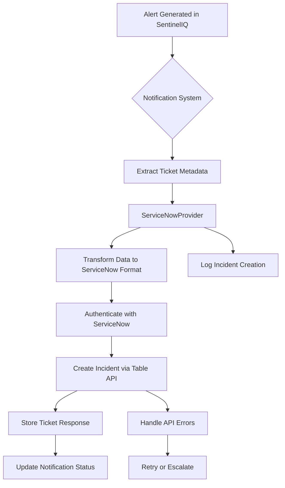
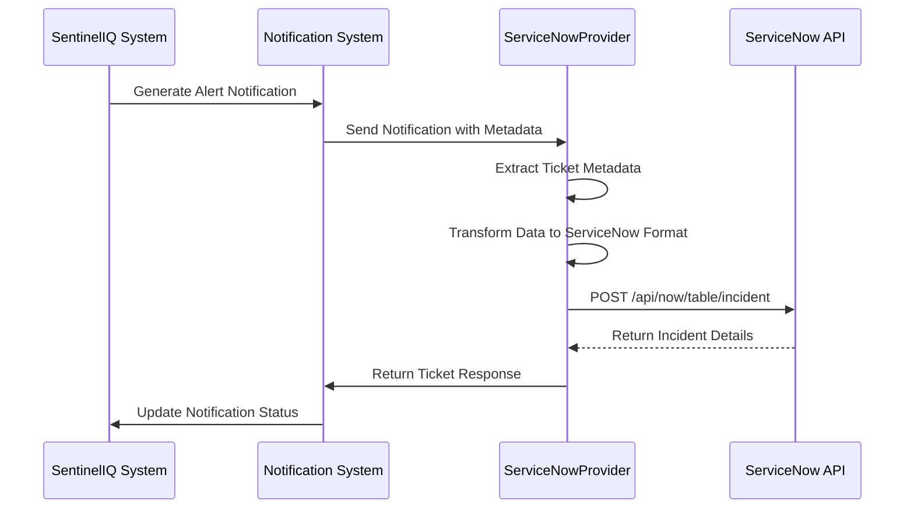

# ServiceNow Integration

<cite>
**Referenced Files in This Document**   
- [serviceNowProvider.ts](file://src/core/notifications/providers/tickets/serviceNowProvider.ts)
- [baseTicketProvider.ts](file://src/core/notifications/providers/tickets/baseTicketProvider.ts)
- [notifier.ts](file://src/core/notifications/notifier.ts)
- [operations.ts](file://src/core/notifications/operations.ts)
- [types.ts](file://src/core/notifications/types.ts)
</cite>

## Table of Contents
1. [Introduction](#introduction)
2. [Architecture Overview](#architecture-overview)
3. [Core Components](#core-components)
4. [Configuration Parameters](#configuration-parameters)
5. [Incident Creation Workflow](#incident-creation-workflow)
6. [Data Transformation and Field Mapping](#data-transformation-and-field-mapping)
7. [Authentication Methods](#authentication-methods)
8. [Error Handling](#error-handling)
9. [Setup Instructions](#setup-instructions)
10. [Best Practices](#best-practices)

## Introduction
The ServiceNow integration within SentinelIQ enables automated incident creation in ServiceNow's ITSM platform from security alerts and notifications. This integration follows the provider pattern implemented across SentinelIQ's notification system, allowing seamless connection between detection events and IT service management workflows. The integration is designed to support ITIL processes by ensuring proper categorization, prioritization, and tracking of security incidents through their lifecycle.

## Architecture Overview

**Diagram sources**
- [serviceNowProvider.ts](file://src/core/notifications/providers/tickets/serviceNowProvider.ts)
- [notifier.ts](file://src/core/notifications/notifier.ts)

## Core Components

The ServiceNow integration is implemented through several key components that work together to create incidents in ServiceNow. The `ServiceNowProvider` class extends the `BaseTicketProvider` abstract class, implementing the specific functionality required to interface with ServiceNow's Table API. This provider pattern ensures consistency across different ticketing systems while allowing for platform-specific implementations.

When a notification event occurs in SentinelIQ that requires ticket creation, the notification system routes the event to the configured ServiceNow provider. The provider extracts ticket metadata from the notification, transforms the data into the appropriate ServiceNow incident format, and makes an authenticated API call to create the incident.

**Section sources**
- [serviceNowProvider.ts](file://src/core/notifications/providers/tickets/serviceNowProvider.ts)
- [baseTicketProvider.ts](file://src/core/notifications/providers/tickets/baseTicketProvider.ts)

## Configuration Parameters

The ServiceNow integration requires specific configuration parameters to establish a secure connection and properly configure incident creation. These parameters are validated during provider initialization to ensure all required fields are present.

Required configuration parameters include:
- **instanceUrl**: The ServiceNow instance URL (e.g., "https://your-instance.service-now.com")
- **username**: ServiceNow username for authentication
- **password**: ServiceNow password or OAuth token
- **assignmentGroup**: Default assignment group for incidents (optional)
- **callerId**: Caller user ID for incident creation (optional)

Additional optional parameters can be configured to customize the integration behavior, including default assignment groups and caller IDs that are applied when not specified in individual notifications.

**Section sources**
- [serviceNowProvider.ts](file://src/core/notifications/providers/tickets/serviceNowProvider.ts#L7-L15)

## Incident Creation Workflow

The integration workflow from alert generation to incident creation follows a structured process that ensures reliable and consistent incident management. When a high-severity alert is generated in SentinelIQ, the system triggers a notification event that includes ticket metadata. The notification system identifies that ServiceNow integration is configured for the workspace and routes the event to the ServiceNow provider.

The provider extracts ticket metadata from the notification, including priority, category, and any custom fields. It then transforms the SentinelIQ notification data into a ServiceNow incident payload, mapping fields such as title to short_description and message to description. Contextual information from the investigation, including evidence links and timeline details, is enriched in the incident description and work notes.

The provider authenticates with ServiceNow using the configured credentials and makes a POST request to the Table API endpoint to create the incident. Upon successful creation, the provider returns the ticket ID, key, and URL, which are stored in SentinelIQ for reference and tracking.

**Diagram sources**
- [serviceNowProvider.ts](file://src/core/notifications/providers/tickets/serviceNowProvider.ts)
- [notifier.ts](file://src/core/notifications/notifier.ts)

## Data Transformation and Field Mapping

The ServiceNow provider transforms SentinelIQ notification data into appropriate ServiceNow incident fields through a structured mapping process. The transformation ensures that critical information is properly represented in the ServiceNow incident while maintaining context from the original alert.

Key field mappings include:
- **short_description**: Mapped from the notification title
- **description**: Built from the notification message with additional context such as workspace name, metadata, and links
- **urgency**: Mapped from the ticket priority using a priority-to-urgency conversion table
- **impact**: Mapped from the ticket priority using a priority-to-impact conversion table
- **priority**: Calculated based on the ticket priority following ServiceNow's priority matrix
- **category**: Set to "Security" by default or overridden by ticket metadata
- **subcategory**: Set to "Security Incident" by default
- **work_notes**: Contains additional context including workspace, notification type, source, and creation timestamp

For high-severity alerts, the integration automatically generates high-priority incidents by mapping SentinelIQ's CRITICAL or URGENT priority levels to ServiceNow's highest urgency and impact levels (1 - High), resulting in a priority level of 1 (Critical) in ServiceNow.

**Section sources**
- [serviceNowProvider.ts](file://src/core/notifications/providers/tickets/serviceNowProvider.ts#L33-L51)
- [baseTicketProvider.ts](file://src/core/notifications/providers/tickets/baseTicketProvider.ts#L112-L143)

## Authentication Methods

The ServiceNow integration supports basic authentication with encrypted storage of credentials. During configuration, the username and password are stored securely in the database, encrypted to protect sensitive authentication information.

When creating incidents, the provider uses HTTP Basic Authentication by encoding the username and password in Base64 format and including it in the Authorization header of API requests. The authentication credentials are validated during provider initialization to ensure they are present before any API calls are made.

While the current implementation uses basic authentication, the architecture supports potential future enhancements for OAuth 2.0 client credentials flow. The configuration interface is designed to accept either a password or OAuth token, allowing for seamless transition to token-based authentication when required.

The integration follows security best practices by ensuring credentials are never logged or exposed in error messages, and by using HTTPS for all API communications with the ServiceNow instance.

**Section sources**
- [serviceNowProvider.ts](file://src/core/notifications/providers/tickets/serviceNowProvider.ts#L53-L68)

## Error Handling

The ServiceNow integration implements comprehensive error handling to manage common scenarios that may occur during incident creation. The provider uses a standardized error handling approach inherited from the base ticket provider class, ensuring consistent error management across all ticketing integrations.

Common error scenarios and their handling include:
- **Schema changes**: If ServiceNow's API response structure changes, the provider catches parsing errors and returns descriptive error messages without exposing sensitive information
- **Access restrictions**: Authentication failures or insufficient permissions are handled by logging the error and notifying administrators without retrying failed requests
- **Rate limiting**: API rate limit responses from ServiceNow are detected and handled appropriately, with exponential backoff for retry attempts when applicable
- **Network issues**: Transient network errors are caught and may trigger retry logic, while permanent connection failures are logged and reported

Error handling follows a fail-safe approach, ensuring that failures in incident creation do not disrupt the core alerting functionality in SentinelIQ. All errors are logged with appropriate context for troubleshooting, and administrators are notified through alternative channels when incident creation fails.

**Section sources**
- [serviceNowProvider.ts](file://src/core/notifications/providers/tickets/serviceNowProvider.ts#L67-L70)
- [baseTicketProvider.ts](file://src/core/notifications/providers/tickets/baseTicketProvider.ts#L176-L199)

## Setup Instructions

To configure the ServiceNow integration in the admin portal, workspace administrators with OWNER or ADMIN role must follow these steps:

1. Navigate to the workspace settings in the admin portal
2. Access the notification providers configuration section
3. Select "Add ServiceNow Integration"
4. Enter the required configuration parameters:
   - ServiceNow instance URL
   - Username
   - Password
   - Optional: Default assignment group
   - Optional: Caller ID
5. Select the event types that should trigger incident creation
6. Enable the integration and save the configuration

The configuration is validated upon submission to ensure all required fields are present and properly formatted. Once configured, the integration is immediately available for use, and any subsequent alerts matching the configured event types will automatically create incidents in ServiceNow.

Administrators can toggle the integration on or off without losing configuration settings, allowing for temporary disablement during maintenance or testing periods.

**Section sources**
- [operations.ts](file://src/core/notifications/operations.ts)
- [types.ts](file://src/core/notifications/types.ts)

## Best Practices

To maintain compliance with ITIL processes and ensure effective incident management, the following best practices should be followed when using the ServiceNow integration:

1. **Categorization**: Ensure consistent categorization of incidents by configuring default categories and training security teams to use appropriate metadata in alerts
2. **Prioritization**: Align SentinelIQ alert priorities with ServiceNow incident priorities to ensure proper handling and response times
3. **Assignment**: Configure default assignment groups to ensure incidents are routed to the appropriate teams
4. **Audit trails**: Regularly review the audit logs for incident creation to verify integration reliability and identify any issues
5. **Testing**: Test the integration with non-production alerts before enabling it for critical alerts
6. **Monitoring**: Monitor the notification delivery logs to ensure incidents are being created successfully
7. **Credential management**: Regularly rotate ServiceNow credentials used for integration and update them in the configuration
8. **Rate limiting awareness**: Be aware of ServiceNow API rate limits and configure alert thresholds appropriately to avoid exceeding limits

By following these best practices, organizations can ensure that the ServiceNow integration enhances their security operations while maintaining compliance with ITIL frameworks and service management standards.