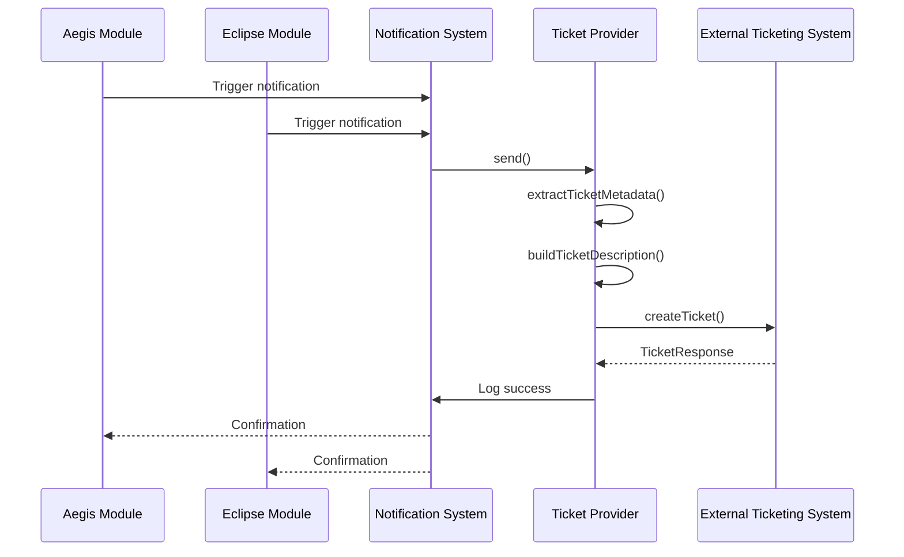
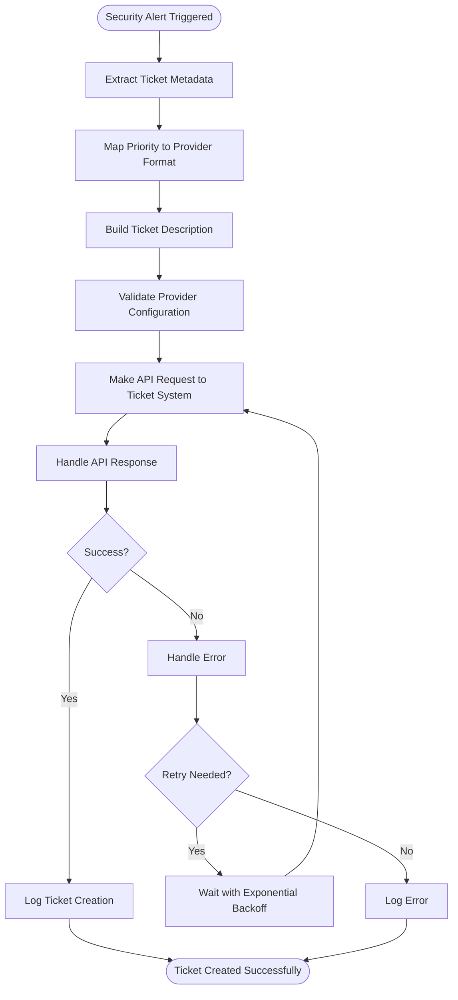
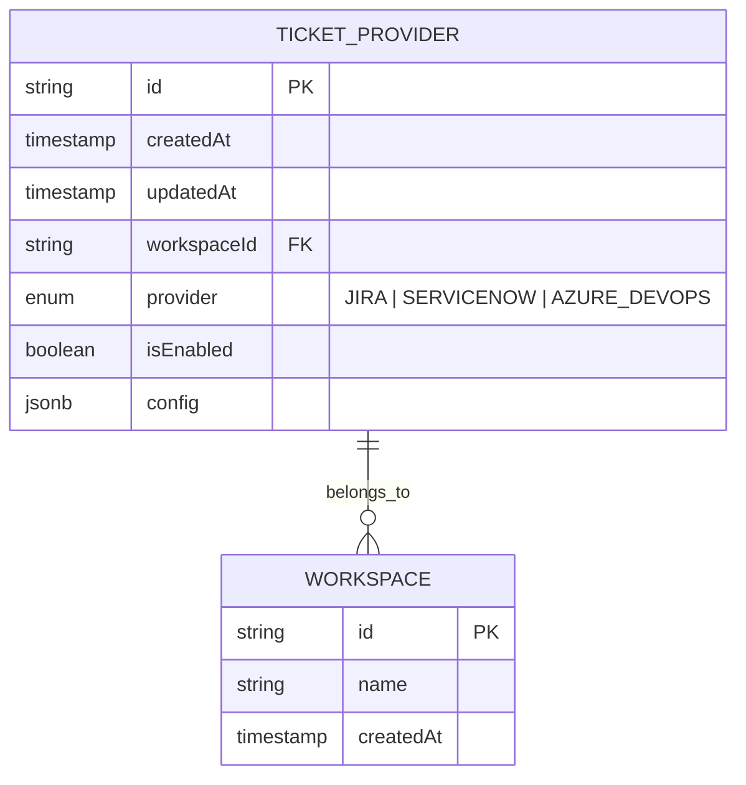
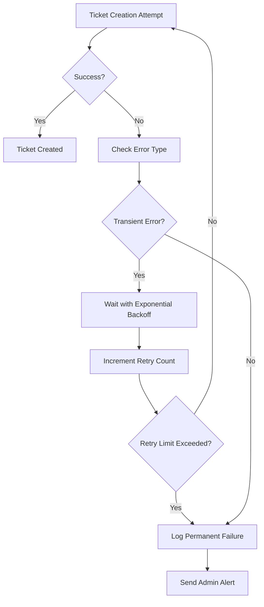

# Ticketing System Integrations

<cite>
**Referenced Files in This Document**   
- [baseTicketProvider.ts](file://src/core/notifications/providers/tickets/baseTicketProvider.ts)
- [jiraProvider.ts](file://src/core/notifications/providers/tickets/jiraProvider.ts)
- [serviceNowProvider.ts](file://src/core/notifications/providers/tickets/serviceNowProvider.ts)
- [azureDevOpsProvider.ts](file://src/core/notifications/providers/tickets/azureDevOpsProvider.ts)
- [linearProvider.ts](file://src/core/notifications/providers/tickets/linearProvider.ts)
- [githubProvider.ts](file://src/core/notifications/providers/tickets/githubProvider.ts)
- [types.ts](file://src/core/notifications/types.ts)
- [operations.ts](file://src/core/tickets/operations.ts)
- [base.ts](file://src/core/notifications/providers/base.ts)
- [migration.sql](file://migrations/20251117231659_add_ticket_providers/migration.sql)
</cite>

## Table of Contents
1. [Introduction](#introduction)
2. [Architecture Overview](#architecture-overview)
3. [Core Components](#core-components)
4. [Supported Providers](#supported-providers)
5. [Integration Workflow](#integration-workflow)
6. [Configuration Requirements](#configuration-requirements)
7. [Error Handling and Retry Strategies](#error-handling-and-retry-strategies)
8. [Audit Logging](#audit-logging)
9. [Security Considerations](#security-considerations)
10. [Extensibility Pattern](#extensibility-pattern)

## Introduction

The Ticketing System Integrations in SentinelIQ provide a unified interface for creating tickets across multiple external platforms from security alerts and notifications. This system enables seamless integration between SentinelIQ's Aegis and Eclipse modules and popular ticketing platforms, ensuring that critical security events are automatically tracked and managed within an organization's existing workflow systems.

The integration framework follows a provider pattern where all ticket systems extend a common base class and implement standardized interfaces for data exchange. This design allows for consistent behavior across different platforms while accommodating the unique requirements of each ticketing system.

**Section sources**
- [baseTicketProvider.ts](file://src/core/notifications/providers/tickets/baseTicketProvider.ts#L1-L202)
- [index.ts](file://src/core/notifications/providers/tickets/index.ts#L1-L26)

## Architecture Overview

The ticketing integration architecture is built around a provider pattern that standardizes interactions with external ticketing systems. At the core of this architecture is the `BaseTicketProvider` class, which defines the common interface and functionality for all ticket providers.

```mermaid
classDiagram
class BaseNotificationProvider {
+providerName : string
+config : Record<string, any>
+send(recipients, notification, context) : Promise~void~
+logSuccess(recipients, notification) : Promise~void~
+logError(error, recipients, notification) : Promise~void~
}
class BaseTicketProvider {
+providerType : string
+extractTicketMetadata(notification) : TicketMetadata
+buildTicketDescription(notification, context) : string
+validateConfig(requiredFields) : void
+makeRequest(url, options, errorContext) : Promise~any~
+logTicketCreated(ticketResponse, notification) : Promise~void~
}
class JiraProvider {
+createTicket(notification, ticketMetadata, context) : Promise~TicketResponse~
+mapPriorityToJira(priority) : string
}
class ServiceNowProvider {
+createTicket(notification, ticketMetadata, context) : Promise~TicketResponse~
+mapPriorityToUrgency(priority) : number
+mapPriorityToImpact(priority) : number
+calculateServiceNowPriority(priority) : number
}
class AzureDevOpsProvider {
+createTicket(notification, ticketMetadata, context) : Promise~TicketResponse~
+mapPriorityToAzureDevOps(priority) : number
+mapSeverityToAzureDevOps(type) : string
}
class LinearProvider {
+createTicket(notification, ticketMetadata, context) : Promise~TicketResponse~
+mapPriorityToLinear(priority) : number
}
class GitHubProvider {
+createTicket(notification, ticketMetadata, context) : Promise~TicketResponse~
+buildLabels(ticketMetadata, defaultLabels) : string[]
}
BaseNotificationProvider <|-- BaseTicketProvider
BaseTicketProvider <|-- JiraProvider
BaseTicketProvider <|-- ServiceNowProvider
BaseTicketProvider <|-- AzureDevOpsProvider
BaseTicketProvider <|-- LinearProvider
BaseTicketProvider <|-- GitHubProvider
class TicketMetadata {
+priority? : 'low' | 'medium' | 'high' | 'critical' | 'urgent'
+status? : string
+assignedTo? : string
+labels? : string[]
+tags? : string[]
+dueDate? : string
+project? : string
+category? : string
+severity? : string
+source? : string
+customFields? : Record~string, any~
}
class TicketResponse {
+ticketId : string
+ticketKey? : string
+ticketUrl : string
+createdAt : string
+provider : string
}
BaseTicketProvider --> TicketMetadata : "uses"
BaseTicketProvider --> TicketResponse : "returns"
```



**Diagram sources**
- [baseTicketProvider.ts](file://src/core/notifications/providers/tickets/baseTicketProvider.ts#L7-L27)
- [base.ts](file://src/core/notifications/providers/base.ts#L10-L38)

## Core Components

The ticketing integration system consists of several core components that work together to provide a consistent interface across different ticketing platforms.

### Base Ticket Provider

The `BaseTicketProvider` class serves as the foundation for all ticket system integrations. It extends `BaseNotificationProvider` and implements common functionality for ticket creation, including metadata extraction, description building, configuration validation, and HTTP request handling.

Key features of the base provider include:
- Standardized ticket metadata extraction from notifications
- Automatic priority mapping based on notification type
- Configurable default values for common fields
- Unified error handling and logging
- HTTP request abstraction with built-in error handling



**Diagram sources**
- [baseTicketProvider.ts](file://src/core/notifications/providers/tickets/baseTicketProvider.ts#L53-L71)
- [types.ts](file://src/core/notifications/types.ts#L1-L21)

### Unified Interfaces

The system defines two key interfaces that standardize data exchange across all providers:

**TicketMetadata Interface**: Defines the structure for ticket metadata that can be passed from notifications to ticket providers. This includes priority, assignment, labels, project information, and custom fields.

**TicketResponse Interface**: Standardizes the response format from all ticket creation operations, ensuring consistent handling of ticket identifiers, URLs, and creation timestamps.

**Section sources**
- [baseTicketProvider.ts](file://src/core/notifications/providers/tickets/baseTicketProvider.ts#L7-L27)
- [types.ts](file://src/core/notifications/types.ts#L1-L21)

## Supported Providers

SentinelIQ supports integration with five major ticketing platforms, each implemented as a provider that extends the `BaseTicketProvider` class.

### Jira (Atlassian)

The Jira provider creates issues in Jira using the REST API v3. It supports custom field mapping and integrates with Jira's priority and issue type system.

**Configuration Requirements:**
- `baseUrl`: Jira instance URL
- `email`: Jira user email
- `apiToken`: Jira API token
- `projectKey`: Default project key
- `issueType`: Issue type name (default: "Task")

**API Endpoint:** `POST /rest/api/3/issue`

**Authentication:** Basic Auth with email and API token

**Section sources**
- [jiraProvider.ts](file://src/core/notifications/providers/tickets/jiraProvider.ts#L1-L120)

### ServiceNow

The ServiceNow provider creates incidents using the Table API. It maps priorities to urgency, impact, and priority levels according to ServiceNow's incident management model.

**Configuration Requirements:**
- `instanceUrl`: ServiceNow instance URL
- `username`: ServiceNow username
- `password`: ServiceNow password
- `assignmentGroup`: Default assignment group (optional)
- `callerId`: Caller user ID (optional)

**API Endpoint:** `POST /api/now/table/incident`

**Authentication:** Basic Auth with username and password

**Section sources**
- [serviceNowProvider.ts](file://src/core/notifications/providers/tickets/serviceNowProvider.ts#L1-L154)

### Azure DevOps

The Azure DevOps provider creates work items using the REST API with JSON Patch format. It supports area paths, iteration paths, and custom work item types.

**Configuration Requirements:**
- `organization`: Azure DevOps organization name
- `project`: Project name
- `personalAccessToken`: PAT with work item write permissions
- `workItemType`: Type of work item (default: "Bug")
- `areaPath`: Area path (optional)
- `iterationPath`: Iteration path (optional)

**API Endpoint:** `POST /_apis/wit/workitems/$${workItemType}`

**Authentication:** Basic Auth with empty username and PAT as password

**Section sources**
- [azureDevOpsProvider.ts](file://src/core/notifications/providers/tickets/azureDevOpsProvider.ts#L1-L159)

### Linear

The Linear provider creates issues using the GraphQL API. It supports team-based organization and custom workflow states.

**Configuration Requirements:**
- `apiKey`: Linear API key
- `teamId`: Team ID to create issues in
- `projectId`: Project ID (optional)
- `defaultStateId`: Default workflow state ID (optional)

**API Endpoint:** `POST /graphql`

**Authentication:** Bearer token with API key

**Section sources**
- [linearProvider.ts](file://src/core/notifications/providers/tickets/linearProvider.ts#L1-L129)

### GitHub Issues

The GitHub provider creates issues in repositories using the REST API. It automatically generates labels based on priority, severity, and source.

**Configuration Requirements:**
- `token`: GitHub Personal Access Token with 'repo' scope
- `owner`: Repository owner (username or organization)
- `repo`: Repository name
- `labels`: Default labels to apply (optional)

**API Endpoint:** `POST /repos/{owner}/{repo}/issues`

**Authentication:** Bearer token with PAT

**Section sources**
- [githubProvider.ts](file://src/core/notifications/providers/tickets/githubProvider.ts#L1-L104)

## Integration Workflow

The integration workflow begins with notification triggers from the Aegis and Eclipse modules and ends with ticket creation in external systems.



**Diagram sources**
- [baseTicketProvider.ts](file://src/core/notifications/providers/tickets/baseTicketProvider.ts#L53-L71)
- [jiraProvider.ts](file://src/core/notifications/providers/tickets/jiraProvider.ts#L24-L103)

The workflow follows these steps:
1. A security alert is triggered in either the Aegis or Eclipse module
2. Notification data is enriched with ticket-specific metadata
3. The system extracts ticket metadata and maps priorities to the target system's format
4. A ticket description is built using the notification details and context
5. The provider configuration is validated
6. An API request is made to create the ticket
7. The response is handled, with success logged or errors processed

**Section sources**
- [baseTicketProvider.ts](file://src/core/notifications/providers/tickets/baseTicketProvider.ts#L53-L71)
- [operations.ts](file://src/core/tickets/operations.ts#L14-L159)

## Configuration Requirements

Each ticket provider requires specific configuration parameters that must be set up in the SentinelIQ workspace settings.

### Database Schema

The ticket provider configurations are stored in the database with the following schema:



**Diagram sources**
- [migration.sql](file://migrations/20251117231659_add_ticket_providers/migration.sql#L1-L22)

### Setup Procedures

To configure a ticket provider:

1. Navigate to Workspace Settings > Integrations > Ticketing
2. Select the desired provider (Jira, ServiceNow, Azure DevOps, Linear, GitHub)
3. Enter the required configuration parameters
4. Test the connection
5. Enable the provider

Configuration is validated server-side to ensure all required fields are present before saving.

**Section sources**
- [operations.ts](file://src/core/tickets/operations.ts#L64-L181)
- [migration.sql](file://migrations/20251117231659_add_ticket_providers/migration.sql#L1-L22)

## Error Handling and Retry Strategies

The ticketing integration system implements comprehensive error handling and retry mechanisms to ensure reliable ticket creation.

### Error Handling

All providers inherit error handling from the `BaseTicketProvider` class, which:
- Catches and logs errors during ticket creation
- Preserves the original error context
- Ensures failed operations don't crash the notification system
- Provides detailed error messages for troubleshooting

### Retry Strategy

While the current implementation doesn't include automatic retries, the architecture supports retry mechanisms through:

- Standardized error responses that include HTTP status codes
- Error context that identifies the failing operation
- Logging that enables monitoring and alerting on failures

A recommended retry strategy would implement exponential backoff with jitter for transient failures (e.g., rate limiting, temporary network issues).



**Diagram sources**
- [baseTicketProvider.ts](file://src/core/notifications/providers/tickets/baseTicketProvider.ts#L67-L70)
- [operations.ts](file://src/core/tickets/operations.ts#L164-L181)

**Section sources**
- [baseTicketProvider.ts](file://src/core/notifications/providers/tickets/baseTicketProvider.ts#L67-L70)
- [operations.ts](file://src/core/tickets/operations.ts#L164-L181)

## Audit Logging

The system maintains comprehensive audit logs of all integration activities through multiple mechanisms:

1. **Provider-Specific Logging**: Each provider logs successful ticket creation with details including:
   - Provider name
   - Ticket ID and URL
   - Notification title and type
   - Creation timestamp

2. **Database Storage**: All provider configurations are stored in the database with:
   - Creation and update timestamps
   - Workspace association
   - Enabled/disabled status

3. **Error Logging**: Failed attempts are logged with:
   - Error messages
   - Context information
   - Affected notification details

The audit logs enable administrators to track integration usage, troubleshoot issues, and verify compliance with security policies.

**Section sources**
- [baseTicketProvider.ts](file://src/core/notifications/providers/tickets/baseTicketProvider.ts#L149-L158)
- [operations.ts](file://src/core/tickets/operations.ts#L14-L159)

## Security Considerations

The ticketing integration system implements several security measures to protect sensitive information and ensure secure operations.

### Credential Storage

Provider credentials are stored securely in the database using:
- Encrypted storage (implied by production best practices)
- Restricted access based on user roles (OWNER, ADMIN)
- Per-workspace configuration isolation

### Access Control

Configuration changes require elevated privileges:
- Only workspace owners and admins can configure providers
- Users must be members of the workspace to access its providers
- Authentication is required for all provider operations

### Rate Limiting

While not explicitly implemented in the provider code, external APIs have their own rate limits:
- Jira: Varies by plan, typically 100-200 requests per minute
- ServiceNow: Configurable by instance administrator
- Azure DevOps: 5,000 requests per hour per organization
- Linear: 100 requests per minute per team
- GitHub: 5,000 requests per hour per user

The system should be monitored to avoid exceeding these limits, especially during security incident spikes.

**Section sources**
- [operations.ts](file://src/core/tickets/operations.ts#L44-L159)
- [baseTicketProvider.ts](file://src/core/notifications/providers/tickets/baseTicketProvider.ts#L21-L22)

## Extensibility Pattern

The provider pattern is designed to be easily extensible for adding new ticketing systems.

### Implementation Steps

To add a new ticket provider:

1. Create a new class that extends `BaseTicketProvider`
2. Implement the abstract `createTicket` method
3. Define provider-specific configuration requirements
4. Add priority and field mapping methods as needed
5. Export the provider in `index.ts`

### Example Structure

```typescript
import { BaseTicketProvider, type TicketMetadata, type TicketResponse } from './baseTicketProvider';
import type { NotificationData } from '../../types';

export class NewProvider extends BaseTicketProvider {
  protected providerType = 'NEW_PROVIDER';

  constructor(config: Record<string, any>) {
    super('New Provider', config);
    this.validateConfig(['requiredField1', 'requiredField2']);
  }

  protected async createTicket(
    notification: NotificationData,
    ticketMetadata: TicketMetadata,
    context: Record<string, any>
  ): Promise<TicketResponse> {
    // Implementation specific to the new provider
    // Use this.makeRequest() for HTTP operations
    // Return a TicketResponse object
  }
}
```

The extensibility pattern ensures that new providers automatically inherit:
- Common error handling
- Configuration validation
- Logging and auditing
- Metadata extraction
- Description building

This reduces implementation effort and ensures consistency across all integrations.

**Section sources**
- [baseTicketProvider.ts](file://src/core/notifications/providers/tickets/baseTicketProvider.ts#L33-L48)
- [index.ts](file://src/core/notifications/providers/tickets/index.ts#L18-L25)