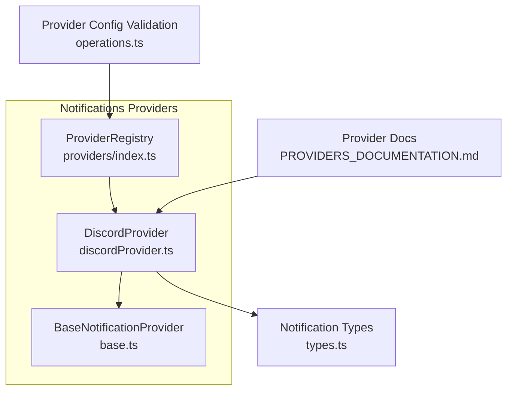
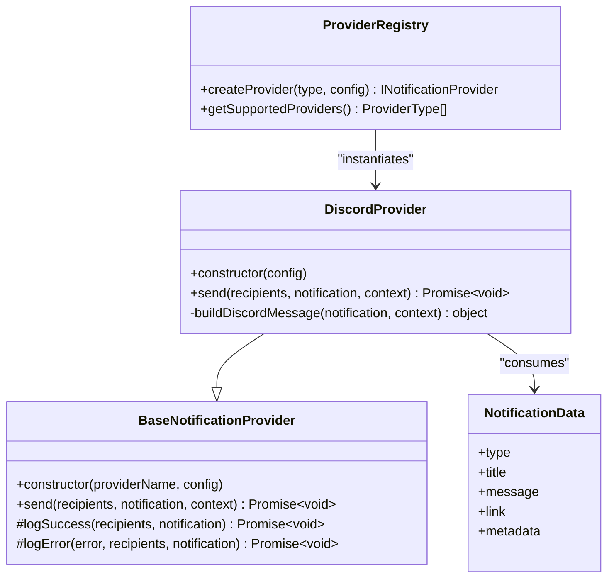
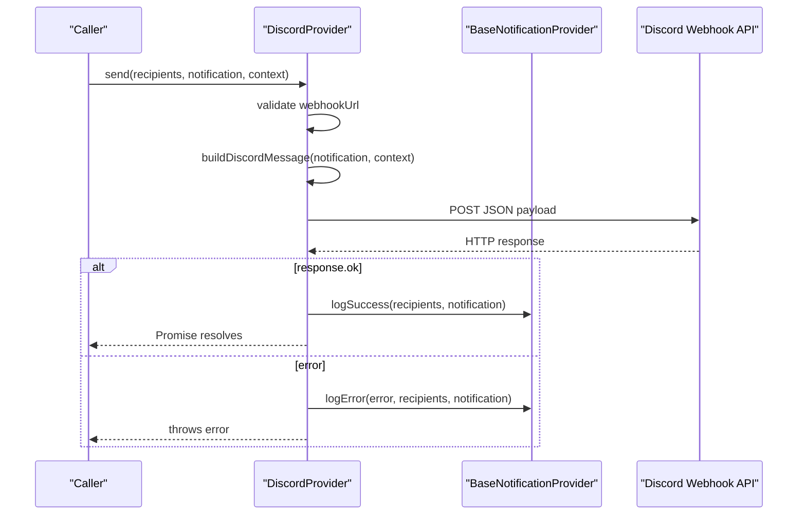
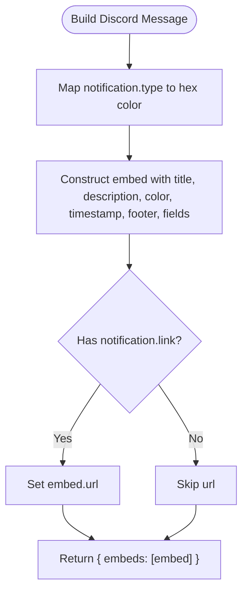
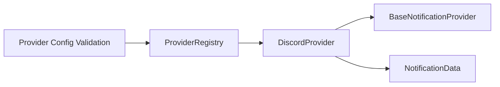

# Discord Provider

<cite>
**Referenced Files in This Document**
- [discordProvider.ts](file://src/core/notifications/providers/discordProvider.ts)
- [base.ts](file://src/core/notifications/providers/base.ts)
- [types.ts](file://src/core/notifications/types.ts)
- [operations.ts](file://src/core/notifications/operations.ts)
- [index.ts](file://src/core/notifications/providers/index.ts)
- [PROVIDERS_DOCUMENTATION.md](file://src/core/notifications/PROVIDERS_DOCUMENTATION.md)
</cite>

## Table of Contents
1. [Introduction](#introduction)
2. [Project Structure](#project-structure)
3. [Core Components](#core-components)
4. [Architecture Overview](#architecture-overview)
5. [Detailed Component Analysis](#detailed-component-analysis)
6. [Dependency Analysis](#dependency-analysis)
7. [Performance Considerations](#performance-considerations)
8. [Troubleshooting Guide](#troubleshooting-guide)
9. [Conclusion](#conclusion)

## Introduction
This document describes the DiscordProvider in SentinelIQ’s notification system. It covers configuration requirements, message building, HTTP delivery to Discord’s webhook API, and error handling. It also provides usage patterns, configuration examples, and troubleshooting guidance for common issues such as invalid webhooks and rate-limit scenarios.

## Project Structure
The DiscordProvider is part of the notification providers module and follows a consistent provider pattern with a base class, configuration validation, and a registry for provider instantiation.

**Diagram sources**
- [discordProvider.ts](file://src/core/notifications/providers/discordProvider.ts#L1-L75)
- [base.ts](file://src/core/notifications/providers/base.ts#L1-L38)
- [types.ts](file://src/core/notifications/types.ts#L1-L60)
- [operations.ts](file://src/core/notifications/operations.ts#L1-L95)
- [index.ts](file://src/core/notifications/providers/index.ts#L1-L47)
- [PROVIDERS_DOCUMENTATION.md](file://src/core/notifications/PROVIDERS_DOCUMENTATION.md#L58-L84)

**Section sources**
- [discordProvider.ts](file://src/core/notifications/providers/discordProvider.ts#L1-L75)
- [base.ts](file://src/core/notifications/providers/base.ts#L1-L38)
- [types.ts](file://src/core/notifications/types.ts#L1-L60)
- [operations.ts](file://src/core/notifications/operations.ts#L1-L95)
- [index.ts](file://src/core/notifications/providers/index.ts#L1-L47)
- [PROVIDERS_DOCUMENTATION.md](file://src/core/notifications/PROVIDERS_DOCUMENTATION.md#L58-L84)

## Core Components
- DiscordProvider: Implements the Discord webhook delivery logic and embed message construction.
- BaseNotificationProvider: Provides logging, success/error tracking, and the provider interface contract.
- NotificationData: Defines the shape of notification messages (type, title, message, optional link, metadata).
- ProviderRegistry: Registers and instantiates providers by type.
- Provider configuration validation: Validates provider configs (including Discord) before saving/upserting.

Key responsibilities:
- Validate presence of webhook URL.
- Build an embed-based message payload with color coding by notification type.
- Send HTTP POST to Discord’s webhook URL with JSON payload.
- Log success/failure and rethrow errors for upstream handling.

**Section sources**
- [discordProvider.ts](file://src/core/notifications/providers/discordProvider.ts#L1-L75)
- [base.ts](file://src/core/notifications/providers/base.ts#L1-L38)
- [types.ts](file://src/core/notifications/types.ts#L1-L21)
- [operations.ts](file://src/core/notifications/operations.ts#L35-L95)
- [index.ts](file://src/core/notifications/providers/index.ts#L1-L47)

## Architecture Overview
The provider architecture uses a registry to instantiate providers and a base class to standardize behavior. DiscordProvider extends the base class and implements the send method to deliver messages to Discord via webhooks.

**Diagram sources**
- [base.ts](file://src/core/notifications/providers/base.ts#L1-L38)
- [discordProvider.ts](file://src/core/notifications/providers/discordProvider.ts#L1-L75)
- [index.ts](file://src/core/notifications/providers/index.ts#L1-L47)
- [types.ts](file://src/core/notifications/types.ts#L1-L21)

## Detailed Component Analysis

### DiscordProvider Implementation
- Constructor: Initializes the provider with a name and configuration object.
- send method:
  - Reads the webhook URL from config.
  - Throws if the webhook URL is missing.
  - Builds the Discord embed payload.
  - Sends an HTTP POST to the webhook URL with JSON body.
  - Logs success or error and rethrows for upstream handling.
- buildDiscordMessage method:
  - Maps notification type to hex color values.
  - Creates an embed with title, description, color, timestamp, footer, and a field for type.
  - Adds an optional URL if a link is present.

**Diagram sources**
- [discordProvider.ts](file://src/core/notifications/providers/discordProvider.ts#L9-L36)
- [discordProvider.ts](file://src/core/notifications/providers/discordProvider.ts#L38-L74)
- [base.ts](file://src/core/notifications/providers/base.ts#L21-L36)

**Section sources**
- [discordProvider.ts](file://src/core/notifications/providers/discordProvider.ts#L1-L75)

### Message Builder and Embed Payload
- Notification type mapping to hex colors:
  - INFO: blue
  - SUCCESS: green
  - WARNING: yellow
  - ERROR: red-orange
  - CRITICAL: dark red
  - Unknown type: neutral gray
- Embed fields:
  - title: notification.title
  - description: notification.message
  - color: mapped hex color
  - timestamp: ISO string
  - footer: branded text including workspace name
  - fields: Type with inline display
  - url: optional notification.link

**Diagram sources**
- [discordProvider.ts](file://src/core/notifications/providers/discordProvider.ts#L38-L74)

**Section sources**
- [discordProvider.ts](file://src/core/notifications/providers/discordProvider.ts#L38-L74)

### Configuration Requirements
- Provider type: DISCORD
- Required configuration:
  - webhookUrl: A valid Discord webhook URL
- Optional configuration:
  - username: Can be included in provider config schema (not used by DiscordProvider implementation)
- Validation:
  - Provider configuration is validated before saving/upserting via a dedicated schema.

Environment example (from documentation):
- DISCORD_WEBHOOK_URL=https://discordapp.com/api/webhooks/YOUR/WEBHOOK

**Section sources**
- [operations.ts](file://src/core/notifications/operations.ts#L35-L95)
- [PROVIDERS_DOCUMENTATION.md](file://src/core/notifications/PROVIDERS_DOCUMENTATION.md#L61-L70)

### Usage Patterns and Examples
- Backend operation usage:
  - Use the notification operations to send a notification with provider set to DISCORD.
  - Recipients are not used for Discord webhooks (messages go to the webhook’s configured channel).
- Configuration in environment:
  - Set DISCORD_WEBHOOK_URL to your Discord webhook URL.

Note: The documentation provides a usage example and environment variables for various providers, including Discord.

**Section sources**
- [PROVIDERS_DOCUMENTATION.md](file://src/core/notifications/PROVIDERS_DOCUMENTATION.md#L154-L191)

## Dependency Analysis
- DiscordProvider depends on:
  - BaseNotificationProvider for logging and error handling.
  - NotificationData type for message structure.
  - ProviderRegistry for instantiation.
  - Provider configuration validation for schema enforcement.

**Diagram sources**
- [discordProvider.ts](file://src/core/notifications/providers/discordProvider.ts#L1-L75)
- [base.ts](file://src/core/notifications/providers/base.ts#L1-L38)
- [types.ts](file://src/core/notifications/types.ts#L1-L21)
- [index.ts](file://src/core/notifications/providers/index.ts#L1-L47)
- [operations.ts](file://src/core/notifications/operations.ts#L35-L95)

**Section sources**
- [discordProvider.ts](file://src/core/notifications/providers/discordProvider.ts#L1-L75)
- [base.ts](file://src/core/notifications/providers/base.ts#L1-L38)
- [types.ts](file://src/core/notifications/types.ts#L1-L21)
- [index.ts](file://src/core/notifications/providers/index.ts#L1-L47)
- [operations.ts](file://src/core/notifications/operations.ts#L35-L95)

## Performance Considerations
- Network latency: The send method performs a single HTTP POST to Discord’s webhook endpoint. Consider retry/backoff strategies at higher-level orchestration if needed.
- Payload size: Embeds are small and lightweight; keep message content concise to minimize payload size.
- Rate limits: Discord may rate-limit webhooks. Implement external retry logic and exponential backoff if you observe frequent rate-limit responses.

[No sources needed since this section provides general guidance]

## Troubleshooting Guide
Common issues and resolutions:
- Invalid webhook URL:
  - Symptom: Error indicating the webhook URL is not configured or invalid.
  - Resolution: Ensure DISCORD_WEBHOOK_URL is set and valid. Re-validate via provider configuration schema.
- API returned non-OK status:
  - Symptom: Error indicating a non-2xx response from Discord.
  - Resolution: Check webhook permissions, server settings, and rate limits. Verify the webhook is still active.
- Message formatting issues:
  - Symptom: Embed not appearing or fields missing.
  - Resolution: Confirm notification.title and notification.message are provided. Ensure notification.type is one of the supported types to get a color mapping.
- Webhook permission problems:
  - Symptom: Messages not delivered to channel.
  - Resolution: Verify the webhook is created in the correct Discord server and channel. Ensure the webhook is enabled and not revoked.

**Section sources**
- [discordProvider.ts](file://src/core/notifications/providers/discordProvider.ts#L11-L36)
- [discordProvider.ts](file://src/core/notifications/providers/discordProvider.ts#L38-L74)
- [operations.ts](file://src/core/notifications/operations.ts#L35-L95)
- [PROVIDERS_DOCUMENTATION.md](file://src/core/notifications/PROVIDERS_DOCUMENTATION.md#L258-L275)

## Conclusion
The DiscordProvider integrates seamlessly with SentinelIQ’s notification system. It validates configuration, builds color-coded embed messages, and posts them to Discord via webhooks. By following the configuration steps and using the documented troubleshooting guidance, you can reliably deliver notifications to Discord channels.

[No sources needed since this section summarizes without analyzing specific files]