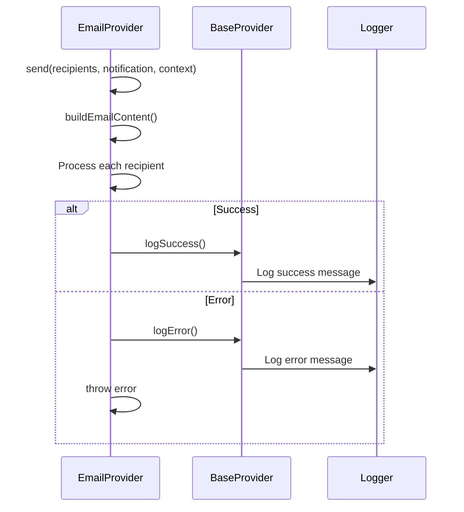
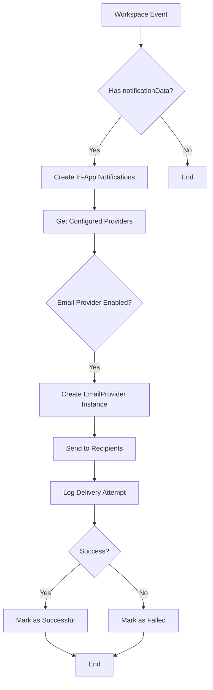
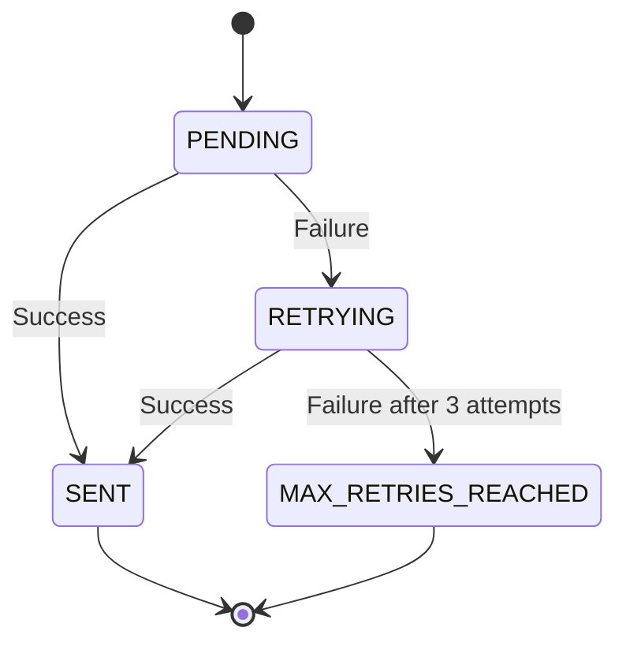

# Email Provider

<cite>
**Referenced Files in This Document**   
- [emailProvider.ts](file://src/core/notifications/providers/emailProvider.ts)
- [base.ts](file://src/core/notifications/providers/base.ts)
- [types.ts](file://src/core/notifications/types.ts)
- [notifier.ts](file://src/core/notifications/notifier.ts)
- [deliveryService.ts](file://src/core/notifications/deliveryService.ts)
- [operations.ts](file://src/core/notifications/operations.ts)
- [service.ts](file://src/core/email/service.ts)
- [renderer.ts](file://src/core/email/renderer.ts)
- [notification.ts](file://src/core/email/templates/notification.ts)
- [auth.ts](file://src/core/email/templates/auth.ts)
- [migration.sql](file://migrations/20251117150008_add_notification_preferences_and_delivery_log/migration.sql)
</cite>

## Table of Contents
1. [Introduction](#introduction)
2. [Configuration Schema](#configuration-schema)
3. [Message Formatting and Templates](#message-formatting-and-templates)
4. [Send Method Implementation](#send-method-implementation)
5. [Provider Initialization and Integration](#provider-initialization-and-integration)
6. [Security Considerations](#security-considerations)
7. [Rate Limiting and Delivery Management](#rate-limiting-and-delivery-management)
8. [Troubleshooting Common Issues](#troubleshooting-common-issues)
9. [Conclusion](#conclusion)

## Introduction

The EmailProvider in SentinelIQ is a notification system component responsible for delivering email notifications to users based on system events and user actions. It integrates with the broader notification ecosystem to provide reliable, styled email communications for various notification types including INFO, SUCCESS, WARNING, ERROR, and CRITICAL severity levels.

The EmailProvider operates as part of a multi-channel notification system, working alongside other providers like Slack, Discord, and various ticketing systems. It leverages a template-based system for consistent email formatting and supports integration with Wasp's email system for actual email delivery. The provider is designed to handle recipient processing, message formatting, error handling, and logging in a robust manner.

This documentation provides comprehensive details on the EmailProvider's configuration schema, message formatting options, implementation details, integration patterns, and operational considerations for secure and reliable email delivery.

**Section sources**
- [emailProvider.ts](file://src/core/notifications/providers/emailProvider.ts#L1-L84)
- [types.ts](file://src/core/notifications/types.ts#L1-L60)

## Configuration Schema

The EmailProvider configuration schema defines the structure for setting up email notifications within SentinelIQ. The configuration is validated through Zod schemas to ensure proper formatting and required fields.

### SMTP Settings and Authentication

The EmailProvider itself does not directly manage SMTP settings but relies on Wasp's email system configuration. The actual SMTP configuration is managed at the Wasp framework level, while the EmailProvider configuration focuses on notification-specific settings.

Email delivery is handled through Wasp's emailSender, which can be configured with either SMTP or SendGrid providers. The EmailProvider uses the WaspEmailSender class to interface with the underlying email delivery system, abstracting the specific SMTP configuration details.

### Sender/Receiver Options

The receiver configuration is defined through the notification provider settings in the database. The schema includes:

- **recipients**: Array of email addresses that will receive notifications
- **eventTypes**: Array of event types that trigger notifications
- **isEnabled**: Boolean flag to enable/disable the provider

```typescript
const emailConfigSchema = z.object({
  recipients: z.array(z.string().email('Invalid email address')).min(1, 'At least one recipient required'),
  subject: z.string().optional(),
});
```

The recipients are automatically determined based on workspace membership. When a notification is triggered, the system queries all members of the relevant workspace and extracts their email addresses for delivery.

### Notification Provider Configuration

The complete configuration for the EmailProvider is stored in the NotificationProvider database table with the following structure:

```sql
CREATE TABLE "NotificationProvider" (
    "id" TEXT NOT NULL,
    "createdAt" TIMESTAMP(3) NOT NULL DEFAULT CURRENT_TIMESTAMP,
    "updatedAt" TIMESTAMP(3) NOT NULL,
    "workspaceId" TEXT NOT NULL,
    "provider" "NotificationProviderType" NOT NULL,
    "isEnabled" BOOLEAN NOT NULL DEFAULT true,
    "config" JSONB NOT NULL,
    "eventTypes" TEXT[] DEFAULT ARRAY[]::TEXT[],
    CONSTRAINT "NotificationProvider_pkey" PRIMARY KEY ("id")
);
```

The `config` field stores provider-specific configuration as JSONB, allowing flexible storage of email configuration options including recipient lists and custom subjects.

**Section sources**
- [operations.ts](file://src/core/notifications/operations.ts#L18-L28)
- [migration.sql](file://migrations/20251117150008_add_notification_preferences_and_delivery_log/migration.sql#L32-L52)

## Message Formatting and Templates

The EmailProvider supports rich HTML templates with type-specific styling for different notification categories. The system uses a template registry to manage various email types with consistent branding and formatting.

### HTML Template System

The template system is built around a registry that maps template enums to render functions. This allows for consistent email formatting across different notification types:

```typescript
const templateRegistry: Record<EmailTemplate, (variables: any, branding?: EmailBranding) => string> = {
  [EmailTemplate.WELCOME]: authTemplates.welcome,
  [EmailTemplate.EMAIL_VERIFICATION]: authTemplates.emailVerification,
  [EmailTemplate.PASSWORD_RESET]: authTemplates.passwordReset,
  // ... other templates
};
```

Each template function returns a fully formatted HTML email with appropriate styling, headers, and content structure.

### Type-Specific Styling

The EmailProvider supports five severity levels with distinct styling:

- **INFO**: Blue color (#3b82f6) - Informational messages
- **SUCCESS**: Green color (#10b981) - Successful operations
- **WARNING**: Amber color (#f59e0b) - Warning messages
- **ERROR**: Red color (#ef4444) - Error conditions
- **CRITICAL**: Dark red color (#dc2626) - Critical incidents

The styling is applied through CSS classes in the email template, ensuring consistent visual representation across different email clients.

### Notification Templates

The system includes specialized templates for different notification categories:

#### Security and Incident Templates
- **INCIDENT_CRITICAL**: For critical security incidents with red alert styling
- **ALERT_HIGH_SEVERITY**: For high-severity alerts with amber warning styling
- **CASE_ASSIGNED**: For case assignment notifications
- **SLA_BREACH_WARNING**: For SLA breach warnings with countdown indicators

#### Authentication Templates
- **WELCOME**: Account creation welcome message
- **EMAIL_VERIFICATION**: Email verification with verification button
- **PASSWORD_RESET**: Password reset instructions
- **TWO_FACTOR_ENABLED/DISABLED**: 2FA status change notifications
- **ACCOUNT_LOCKED**: Account lockout notifications

Each template includes appropriate branding elements, buttons, and information boxes styled according to the notification type.

**Section sources**
- [renderer.ts](file://src/core/email/renderer.ts#L16-L57)
- [notification.ts](file://src/core/email/templates/notification.ts#L1-L208)
- [auth.ts](file://src/core/email/templates/auth.ts#L1-L200)

## Send Method Implementation

The send method implementation in the EmailProvider handles the complete process of delivering notifications to recipients, including error handling and logging mechanisms.

### Recipient Processing

The send method processes recipients by iterating through the provided email list and sending individual emails:

```typescript
for (const email of recipients) {
  console.log(`[EmailProvider] Would send email to ${email}:`, {
    subject: notification.title,
    preview: notification.message.substring(0, 100),
  });
}
```

In the current implementation, the actual email sending is commented out, with console logging used for demonstration purposes. The intended implementation would use Wasp's emailSender to deliver messages.

### Notification Data Processing

The EmailProvider processes notification data by extracting key information from the NotificationData interface:

```typescript
interface NotificationData {
  type: 'INFO' | 'SUCCESS' | 'WARNING' | 'ERROR' | 'CRITICAL';
  title: string;
  message: string;
  link?: string;
  metadata?: Record<string, any>;
  ticketMetadata?: {
    priority?: 'low' | 'medium' | 'high' | 'critical' | 'urgent';
    status?: string;
    assignedTo?: string;
    labels?: string[];
    tags?: string[];
    dueDate?: string;
    project?: string;
    category?: string;
    severity?: string;
    source?: string;
    customFields?: Record<string, any>;
  };
}
```

This data is used to populate the email template with relevant information, including links to related resources and metadata about the notification.

### Error Handling and Logging

The EmailProvider implements comprehensive error handling and logging through the base class methods:



**Diagram sources**
- [emailProvider.ts](file://src/core/notifications/providers/emailProvider.ts#L9-L37)
- [base.ts](file://src/core/notifications/providers/base.ts#L21-L37)

The error handling follows a try-catch pattern that ensures errors are properly logged before being re-thrown for upstream handling. The logging includes details about the provider, recipients, notification title, and error message for debugging purposes.

**Section sources**
- [emailProvider.ts](file://src/core/notifications/providers/emailProvider.ts#L9-L37)
- [base.ts](file://src/core/notifications/providers/base.ts#L21-L37)

## Provider Initialization and Integration

The EmailProvider integrates with Wasp's email system and is initialized through the notification framework in SentinelIQ.

### Provider Registry and Initialization

The EmailProvider is registered in the ProviderRegistry along with other notification providers:

```typescript
export class ProviderRegistry {
  private static providers: Map<ProviderType, new (config: any) => INotificationProvider> = new Map([
    ['EMAIL', EmailProvider],
    ['SLACK', SlackProvider],
    ['DISCORD', DiscordProvider],
    // ... other providers
  ]);
  
  static createProvider(type: ProviderType, config: Record<string, any>): INotificationProvider {
    const ProviderClass = this.providers.get(type);
    
    if (!ProviderClass) {
      throw new Error(`Provider ${type} not implemented`);
    }
    
    return new ProviderClass(config);
  }
}
```

This registry pattern allows for dynamic provider creation based on configuration, enabling flexible notification routing.

### Integration with Notification System

The EmailProvider is integrated into the notification workflow through the notifier system:



**Diagram sources**
- [notifier.ts](file://src/core/notifications/notifier.ts#L35-L111)
- [deliveryService.ts](file://src/core/notifications/deliveryService.ts#L14-L99)

The integration follows a standardized pattern where workspace events trigger notifications, and the system checks for enabled providers before sending messages.

### Usage in Notification Workflows

The EmailProvider is used in various notification workflows throughout the application:

1. **Security Alerts**: Critical incidents trigger email notifications to relevant team members
2. **Authentication Events**: Password changes, 2FA changes, and account lockouts generate emails
3. **System Notifications**: Maintenance windows, outages, and feature announcements
4. **Workflow Updates**: Case assignments, SLA warnings, and ticket updates

The provider is configured through the notification preferences system, allowing workspace administrators to control which events trigger email notifications.

**Section sources**
- [notifier.ts](file://src/core/notifications/notifier.ts#L35-L111)
- [index.ts](file://src/core/notifications/providers/index.ts#L18-L47)

## Security Considerations

The EmailProvider implementation includes several security considerations for credential management and secure email delivery.

### Credential Management

The EmailProvider does not directly handle email credentials but relies on Wasp's email system configuration. Credentials for SMTP or SendGrid are managed at the Wasp framework level, keeping them separate from the application code.

The system follows the principle of least privilege by:
- Storing credentials in environment variables or secure configuration stores
- Limiting access to credential configuration to system administrators
- Using provider-specific configuration validation to prevent malformed settings

### Secure Email Content

The email templates are designed with security in mind:
- All user-provided content is properly escaped to prevent XSS attacks
- Links are validated to prevent phishing attempts
- Sensitive information is minimized in email content
- Critical actions require additional authentication beyond email verification

The system also includes security alerts for suspicious activities:
- Password change notifications include IP address information
- Account lockout emails specify the number of failed attempts
- 2FA changes require verification and include backup code information

### Access Control

The EmailProvider enforces strict access controls:
- Only workspace owners and administrators can configure email providers
- Notification preferences are scoped to individual users
- Event type filtering prevents unauthorized notification access
- Do Not Disturb (DND) settings respect user privacy preferences

The access control is implemented through middleware that verifies user roles before allowing configuration changes:

```typescript
// Verify user is admin or owner of workspace
const membership = await context.entities.WorkspaceMember.findFirst({
  where: {
    userId: context.user.id,
    workspaceId: args.workspaceId,
    role: {
      in: ['OWNER', 'ADMIN'],
    },
  },
});
```

**Section sources**
- [operations.ts](file://src/core/notifications/operations.ts#L268-L281)
- [auth.ts](file://src/core/email/templates/auth.ts#L104-L137)

## Rate Limiting and Delivery Management

The EmailProvider includes mechanisms for rate limiting and delivery management to ensure reliable notification delivery.

### Delivery Retry Mechanism

The system implements a robust retry mechanism for failed email deliveries:



**Diagram sources**
- [deliveryService.ts](file://src/core/notifications/deliveryService.ts#L50-L99)
- [migration.sql](file://migrations/20251117150008_add_notification_preferences_and_delivery_log/migration.sql#L2-L5)

The retry logic follows an exponential backoff pattern with delays of 1 minute, 5 minutes, and 15 minutes between attempts. This prevents overwhelming email servers while ensuring delivery attempts continue for transient failures.

### Delivery Status Tracking

The system tracks delivery status through the NotificationDeliveryLog table:

```sql
CREATE TYPE "DeliveryStatus" AS ENUM ('PENDING', 'SENT', 'FAILED', 'RETRYING', 'MAX_RETRIES_REACHED');

CREATE TABLE "NotificationDeliveryLog" (
    "id" TEXT NOT NULL,
    "createdAt" TIMESTAMP(3) NOT NULL DEFAULT CURRENT_TIMESTAMP,
    "updatedAt" TIMESTAMP(3) NOT NULL,
    "notificationId" TEXT,
    "provider" "NotificationProviderType" NOT NULL,
    "eventType" TEXT NOT NULL,
    "workspaceId" TEXT NOT NULL,
    "userId" TEXT,
    "status" "DeliveryStatus" NOT NULL DEFAULT 'PENDING',
    "attempts" INTEGER NOT NULL DEFAULT 0,
    "maxAttempts" INTEGER NOT NULL DEFAULT 3,
    "lastError" TEXT,
    "lastAttemptAt" TIMESTAMP(3),
    "nextRetryAt" TIMESTAMP(3),
    "deliveredAt" TIMESTAMP(3),
    "payload" JSONB,
    CONSTRAINT "NotificationDeliveryLog_pkey" PRIMARY KEY ("id")
);
```

This comprehensive logging allows for monitoring delivery success rates and troubleshooting delivery issues.

### Rate Limiting Strategy

While the EmailProvider itself does not implement rate limiting, it integrates with the broader system's rate limiting strategies:

- **Provider-level throttling**: Limits on how frequently notifications can be sent through each provider
- **Workspace-level limits**: Quotas based on subscription plans
- **Event-type filtering**: Users can disable notifications for specific event types to reduce volume
- **Digest scheduling**: Consolidated notifications can be scheduled to reduce email frequency

The system also includes Do Not Disturb (DND) settings that respect user preferences for notification timing, preventing after-hours alerts when configured.

**Section sources**
- [deliveryService.ts](file://src/core/notifications/deliveryService.ts#L1-L99)
- [migration.sql](file://migrations/20251117150008_add_notification_preferences_and_delivery_log/migration.sql#L1-L71)

## Troubleshooting Common Issues

This section addresses common delivery issues and their troubleshooting approaches for the EmailProvider system.

### Spam Filtering Issues

Emails may be flagged as spam due to various factors. To mitigate this:

1. **Ensure proper email authentication**:
   - Configure SPF, DKIM, and DMARC records for your domain
   - Use a consistent "From" address that matches your domain
   - Verify domain ownership with email providers

2. **Improve email content quality**:
   - Avoid spam trigger words in subject lines
   - Maintain a balanced text-to-HTML ratio
   - Include clear unsubscribe links
   - Provide both HTML and plain text versions

3. **Monitor sender reputation**:
   - Use dedicated sending domains for transactional emails
   - Warm up new IP addresses gradually
   - Monitor bounce rates and complaint rates

### DNS Configuration Problems

Proper DNS configuration is critical for email deliverability:

1. **Verify domain records**:
   - Ensure MX records point to your email provider
   - Configure TXT records for SPF: `v=spf1 include:sendgrid.net ~all`
   - Set up DKIM records as provided by your email service
   - Add DMARC policy: `v=DMARC1; p=quarantine; rua=mailto:dmarc@yourdomain.com`

2. **Check domain reputation**:
   - Use tools like MXToolbox to verify DNS configuration
   - Monitor blacklists and delist if necessary
   - Ensure reverse DNS (PTR) records are properly configured

### Delivery Failure Troubleshooting

When emails fail to deliver, follow this diagnostic process:

1. **Check the delivery logs**:
   ```typescript
   const deliveryStats = await getDeliveryStats(workspaceId, 7);
   ```

2. **Verify provider configuration**:
   - Confirm SMTP/credentials are correctly configured in Wasp
   - Check that the EmailProvider is enabled for the workspace
   - Validate recipient lists and event type filters

3. **Test email functionality**:
   - Use the console email sender for development testing
   - Verify template variables are properly populated
   - Check for JavaScript errors in the notification system

4. **Monitor retry attempts**:
   - Review the NotificationDeliveryLog for retry patterns
   - Check if failures are consistent or intermittent
   - Examine error messages for specific failure reasons

### Common Error Scenarios

| Error Scenario | Diagnosis | Resolution |
|----------------|-----------|------------|
| Connection timeout | Network issues between server and email provider | Check firewall rules, verify provider status |
| Authentication failure | Invalid credentials or API keys | Verify credentials in Wasp configuration |
| Rate limiting exceeded | Too many emails sent in short period | Implement batching, adjust sending frequency |
| Invalid recipient | Malformed email address | Validate email format before sending |
| Content blocked | Spam filters or security policies | Review email content, improve authentication |

**Section sources**
- [deliveryService.ts](file://src/core/notifications/deliveryService.ts#L1-L243)
- [notifier.ts](file://src/core/notifications/notifier.ts#L1-L308)

## Conclusion

The EmailProvider in SentinelIQ provides a robust system for delivering email notifications across various use cases, from security alerts to workflow updates. The provider is designed with reliability, security, and maintainability in mind, leveraging a template-based system for consistent message formatting and integrating with Wasp's email infrastructure for actual delivery.

Key features of the EmailProvider include:
- Support for multiple notification types with severity-based styling
- Comprehensive error handling and delivery retry mechanisms
- Integration with the broader notification ecosystem
- Flexible configuration through workspace settings
- Detailed logging and delivery tracking

The system follows best practices for email delivery, including proper error handling, retry logic, and security considerations. By leveraging Wasp's email system, it abstracts the complexities of SMTP configuration while providing a clean interface for sending templated emails.

For optimal performance, administrators should ensure proper DNS configuration, monitor delivery statistics, and follow email deliverability best practices. The provider's integration with the notification framework allows for seamless addition of new notification types and templates as needed.

**Section sources**
- [emailProvider.ts](file://src/core/notifications/providers/emailProvider.ts#L1-L84)
- [service.ts](file://src/core/email/service.ts#L1-L244)
- [renderer.ts](file://src/core/email/renderer.ts#L1-L219)