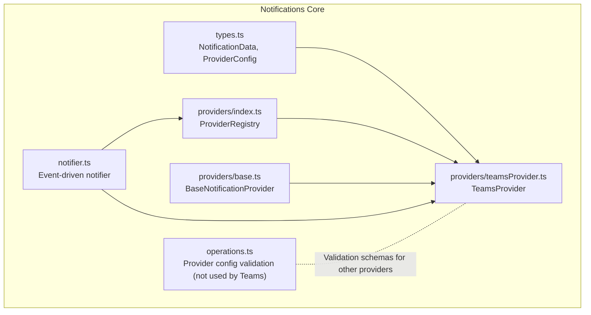
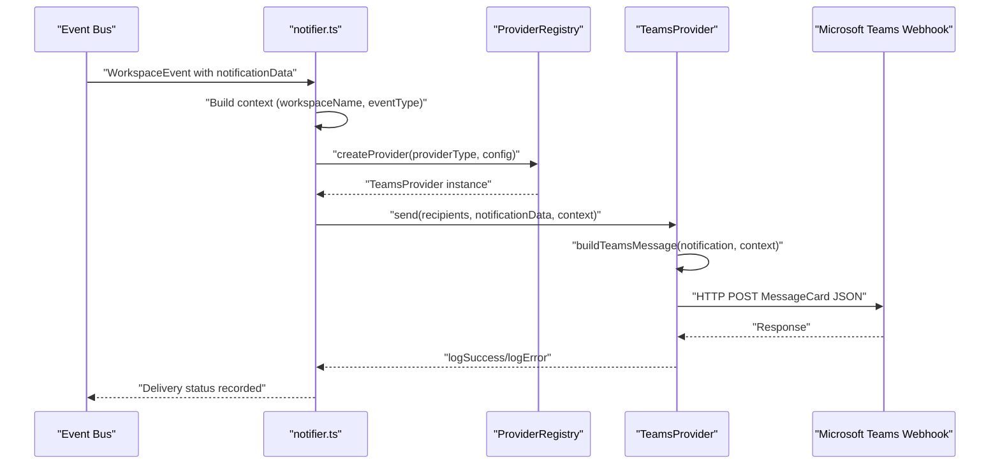
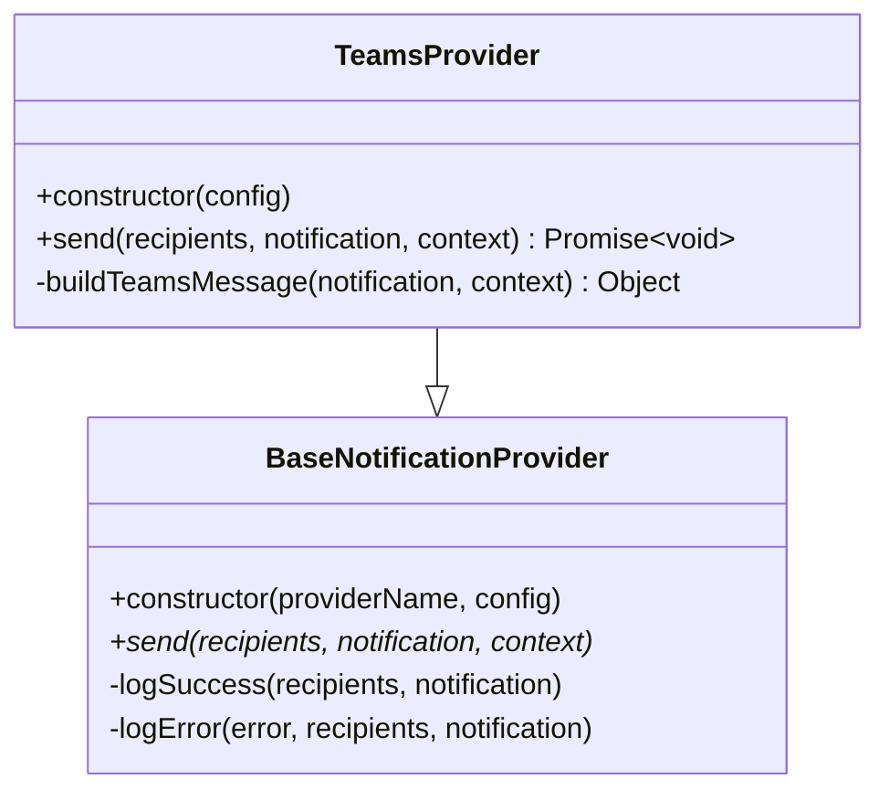
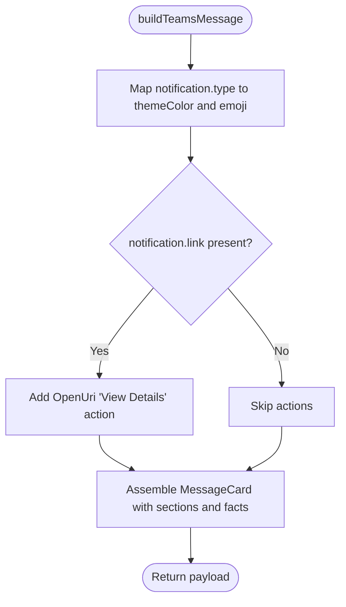
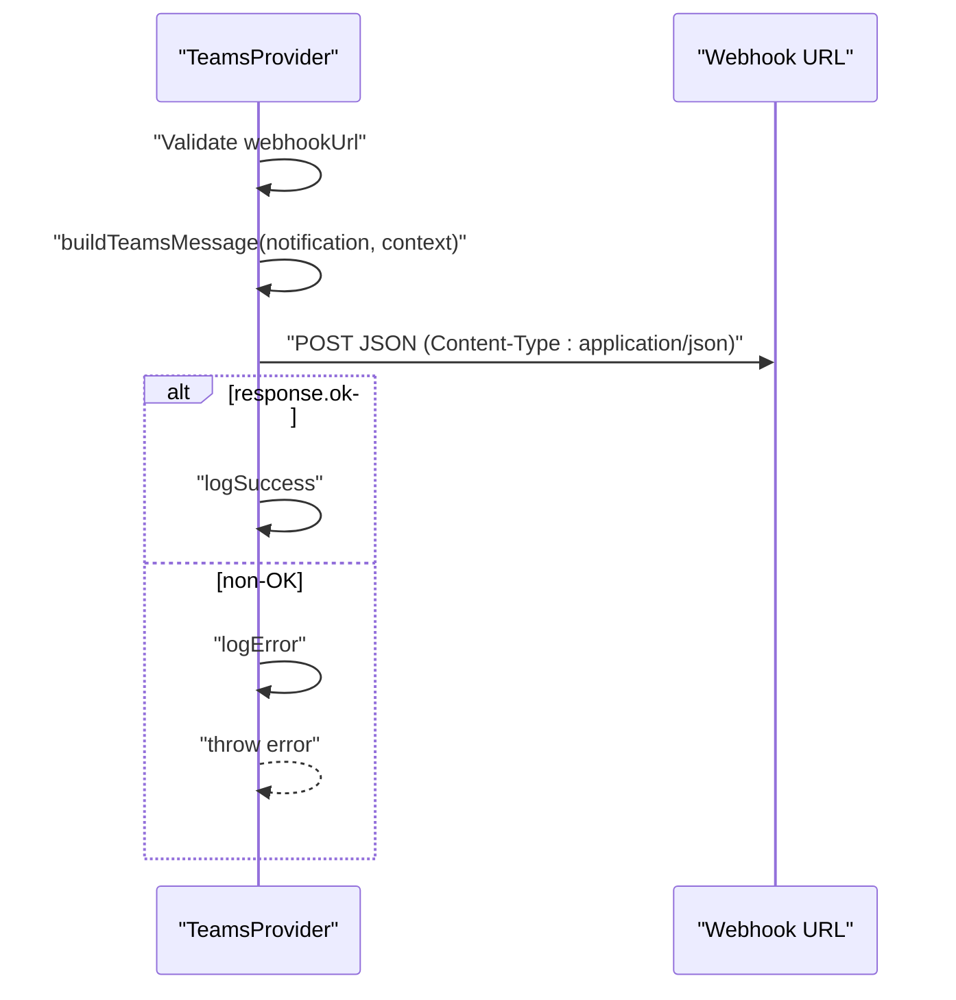
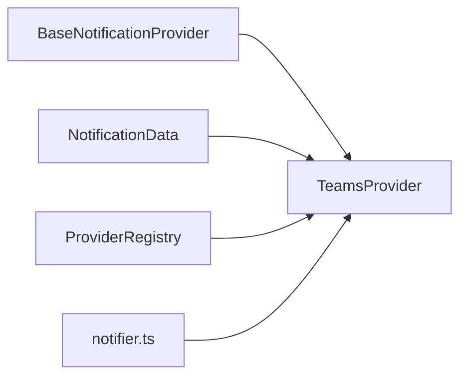

# Microsoft Teams Provider

<cite>
**Referenced Files in This Document**
- [teamsProvider.ts](file://src/core/notifications/providers/teamsProvider.ts)
- [base.ts](file://src/core/notifications/providers/base.ts)
- [types.ts](file://src/core/notifications/types.ts)
- [index.ts](file://src/core/notifications/providers/index.ts)
- [PROVIDERS_DOCUMENTATION.md](file://src/core/notifications/PROVIDERS_DOCUMENTATION.md)
- [notifier.ts](file://src/core/notifications/notifier.ts)
- [operations.ts](file://src/core/notifications/operations.ts)
</cite>

## Table of Contents
1. [Introduction](#introduction)
2. [Project Structure](#project-structure)
3. [Core Components](#core-components)
4. [Architecture Overview](#architecture-overview)
5. [Detailed Component Analysis](#detailed-component-analysis)
6. [Dependency Analysis](#dependency-analysis)
7. [Performance Considerations](#performance-considerations)
8. [Troubleshooting Guide](#troubleshooting-guide)
9. [Conclusion](#conclusion)
10. [Appendices](#appendices)

## Introduction
This document describes the Microsoft Teams Provider in SentinelIQ. It covers configuration requirements, message building with Adaptive Card-compatible JSON payloads using the MessageCard format, the send method’s HTTP POST behavior and error handling, and contextual information injection such as workspace name and timestamps. It also provides integration examples and troubleshooting guidance for common issues.

## Project Structure
The Teams Provider is part of the notification providers subsystem under the core notifications module. It extends the base provider abstraction and participates in the provider registry and notifier pipeline.

**Diagram sources**
- [teamsProvider.ts](file://src/core/notifications/providers/teamsProvider.ts#L1-L107)
- [base.ts](file://src/core/notifications/providers/base.ts#L1-L38)
- [types.ts](file://src/core/notifications/types.ts#L1-L60)
- [index.ts](file://src/core/notifications/providers/index.ts#L1-L46)
- [notifier.ts](file://src/core/notifications/notifier.ts#L1-L120)
- [operations.ts](file://src/core/notifications/operations.ts#L1-L120)

**Section sources**
- [teamsProvider.ts](file://src/core/notifications/providers/teamsProvider.ts#L1-L107)
- [base.ts](file://src/core/notifications/providers/base.ts#L1-L38)
- [types.ts](file://src/core/notifications/types.ts#L1-L60)
- [index.ts](file://src/core/notifications/providers/index.ts#L1-L46)
- [notifier.ts](file://src/core/notifications/notifier.ts#L1-L120)
- [operations.ts](file://src/core/notifications/operations.ts#L1-L120)

## Core Components
- TeamsProvider: Implements the Teams webhook integration, builds MessageCard payloads, and posts to the configured webhook URL.
- BaseNotificationProvider: Provides logging, success/error callbacks, and the provider interface contract.
- ProviderRegistry: Registers and instantiates providers by type.
- NotificationData: Defines the shape of notification payloads (type, title, message, link, metadata).
- Notifier: Orchestrates event-driven notification dispatch, collects context, and invokes providers.

Key responsibilities:
- Configuration: Requires a webhookUrl in provider config.
- Message building: Produces a MessageCard payload compatible with Microsoft Teams Incoming Webhooks.
- Delivery: Sends HTTP POST requests and logs outcomes.
- Context: Injects workspace name, timestamps, and optional action buttons.

**Section sources**
- [teamsProvider.ts](file://src/core/notifications/providers/teamsProvider.ts#L1-L107)
- [base.ts](file://src/core/notifications/providers/base.ts#L1-L38)
- [types.ts](file://src/core/notifications/types.ts#L1-L60)
- [index.ts](file://src/core/notifications/providers/index.ts#L1-L46)
- [notifier.ts](file://src/core/notifications/notifier.ts#L1-L120)

## Architecture Overview
TeamsProvider participates in the event-driven notification pipeline. Providers are selected based on workspace configuration and event types. The notifier constructs a context object containing workspace metadata and passes it to the provider’s send method.

**Diagram sources**
- [notifier.ts](file://src/core/notifications/notifier.ts#L1-L120)
- [index.ts](file://src/core/notifications/providers/index.ts#L18-L46)
- [teamsProvider.ts](file://src/core/notifications/providers/teamsProvider.ts#L1-L107)

## Detailed Component Analysis

### TeamsProvider Implementation
- Constructor: Initializes with provider name and config.
- send method:
  - Validates presence of webhookUrl.
  - Builds a MessageCard payload.
  - Posts JSON to the webhook URL with Content-Type application/json.
  - Logs success or error and rethrows for upstream handling.
- buildTeamsMessage:
  - Theme colors mapped by notification type (INFO, SUCCESS, WARNING, ERROR, CRITICAL).
  - Emojis per type for activityTitle.
  - Optional action button “View Details” using OpenUri when a link is present.
  - Sections include activityTitle, activitySubtitle, message text, and a facts array with Type, Time, and Workspace.
  - Uses context.workspaceName for subtitle and facts.

**Diagram sources**
- [base.ts](file://src/core/notifications/providers/base.ts#L1-L38)
- [teamsProvider.ts](file://src/core/notifications/providers/teamsProvider.ts#L1-L107)

**Section sources**
- [teamsProvider.ts](file://src/core/notifications/providers/teamsProvider.ts#L1-L107)
- [base.ts](file://src/core/notifications/providers/base.ts#L1-L38)

### Message Builder and Payload Structure
The Teams message builder produces a MessageCard payload with:
- @type: MessageCard
- @context: https://schema.org/extensions
- themeColor: Hex color based on notification type
- summary: notification.title
- sections: activityTitle (emoji + title), activitySubtitle (workspace name), text (message), markdown enabled, facts (type, time, workspace)
- potentialAction: OpenUri “View Details” when notification.link is provided

**Diagram sources**
- [teamsProvider.ts](file://src/core/notifications/providers/teamsProvider.ts#L38-L106)

**Section sources**
- [teamsProvider.ts](file://src/core/notifications/providers/teamsProvider.ts#L38-L106)

### Send Method and HTTP Behavior
- Validates webhookUrl presence.
- Posts JSON payload to the webhook URL.
- Treats non-OK responses as errors.
- Logs success or error via base provider helpers.

**Diagram sources**
- [teamsProvider.ts](file://src/core/notifications/providers/teamsProvider.ts#L9-L36)

**Section sources**
- [teamsProvider.ts](file://src/core/notifications/providers/teamsProvider.ts#L9-L36)

### Context and Inclusion of Information
- Context injected by notifier includes workspaceId, workspaceName, eventType, and eventData.
- Teams message includes:
  - activitySubtitle: workspaceName or default
  - facts: Type, Time, Workspace
  - Timestamp: localized string in the facts section

**Section sources**
- [notifier.ts](file://src/core/notifications/notifier.ts#L54-L85)
- [teamsProvider.ts](file://src/core/notifications/providers/teamsProvider.ts#L74-L106)

## Dependency Analysis
- TeamsProvider depends on:
  - BaseNotificationProvider for logging and interface.
  - NotificationData type for payload shape.
  - ProviderRegistry for instantiation.
  - Notifier for context construction and invocation.
- ProviderRegistry maps provider types to provider classes, enabling dynamic creation.

**Diagram sources**
- [base.ts](file://src/core/notifications/providers/base.ts#L1-L38)
- [types.ts](file://src/core/notifications/types.ts#L1-L60)
- [index.ts](file://src/core/notifications/providers/index.ts#L18-L46)
- [teamsProvider.ts](file://src/core/notifications/providers/teamsProvider.ts#L1-L107)
- [notifier.ts](file://src/core/notifications/notifier.ts#L1-L120)

**Section sources**
- [index.ts](file://src/core/notifications/providers/index.ts#L1-L46)
- [teamsProvider.ts](file://src/core/notifications/providers/teamsProvider.ts#L1-L107)
- [notifier.ts](file://src/core/notifications/notifier.ts#L1-L120)

## Performance Considerations
- The TeamsProvider performs a single HTTP POST per notification. Network latency and webhook availability are the primary bottlenecks.
- Consider external rate limits from Microsoft Teams webhooks; batching or throttling should be handled externally if needed.
- Logging overhead is minimal; ensure centralized logging is configured appropriately.

[No sources needed since this section provides general guidance]

## Troubleshooting Guide
Common issues and resolutions:
- Missing webhook URL:
  - Symptom: Error indicating Teams webhook URL not configured.
  - Resolution: Ensure provider config includes webhookUrl.
- Invalid webhook URL:
  - Symptom: Non-OK HTTP response from webhook endpoint.
  - Resolution: Verify the webhook URL is correct and the connector is enabled in Teams.
- Message formatting limitations:
  - Symptom: Unexpected rendering in Teams.
  - Resolution: MessageCard is supported; ensure facts and markdown are used as intended. Avoid unsupported fields.
- Adaptive card compatibility:
  - Symptom: Cards not rendering as expected.
  - Resolution: Teams Incoming Webhooks accept MessageCard; ensure @type and @context are set as required.
- Recipients format:
  - Note: Teams webhooks send to the configured channel; recipients are not used by TeamsProvider.

Configuration and setup references:
- Provider configuration requires webhookUrl.
- Webhook setup steps are documented in the providers documentation.

**Section sources**
- [teamsProvider.ts](file://src/core/notifications/providers/teamsProvider.ts#L9-L36)
- [PROVIDERS_DOCUMENTATION.md](file://src/core/notifications/PROVIDERS_DOCUMENTATION.md#L120-L155)
- [PROVIDERS_DOCUMENTATION.md](file://src/core/notifications/PROVIDERS_DOCUMENTATION.md#L170-L190)

## Conclusion
The Microsoft Teams Provider integrates seamlessly with SentinelIQ’s notification pipeline. It validates configuration, constructs a MessageCard-compliant payload with contextual information and actionable links, and posts to Microsoft Teams webhooks with robust error handling. Proper webhook setup and adherence to MessageCard format ensure reliable delivery.

[No sources needed since this section summarizes without analyzing specific files]

## Appendices

### Configuration Requirements
- Provider type: TEAMS
- Required config:
  - webhookUrl: Incoming Webhook URL from Microsoft Teams
- Environment example:
  - TEAMS_WEBHOOK_URL: Incoming Webhook endpoint

**Section sources**
- [PROVIDERS_DOCUMENTATION.md](file://src/core/notifications/PROVIDERS_DOCUMENTATION.md#L120-L155)
- [PROVIDERS_DOCUMENTATION.md](file://src/core/notifications/PROVIDERS_DOCUMENTATION.md#L170-L190)

### MessageCard Payload Highlights
- @type: MessageCard
- @context: https://schema.org/extensions
- themeColor: Derived from notification type
- summary: notification.title
- sections.activityTitle: emoji + notification.title
- sections.activitySubtitle: workspaceName
- sections.text: notification.message (markdown enabled)
- sections.facts: Type, Time, Workspace
- potentialAction: OpenUri “View Details” when link is present

**Section sources**
- [teamsProvider.ts](file://src/core/notifications/providers/teamsProvider.ts#L38-L106)

### Integration Examples
- Backend usage:
  - Use the notifier to trigger events; TeamsProvider will be invoked automatically if configured for the workspace and event type.
- Provider registration:
  - ProviderRegistry maps TEAMS to TeamsProvider.

**Section sources**
- [notifier.ts](file://src/core/notifications/notifier.ts#L1-L120)
- [index.ts](file://src/core/notifications/providers/index.ts#L18-L46)