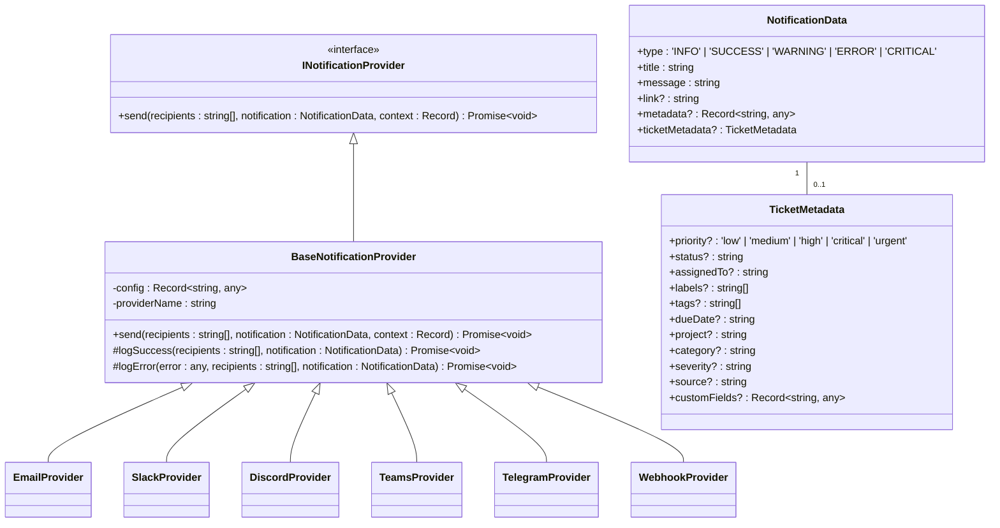
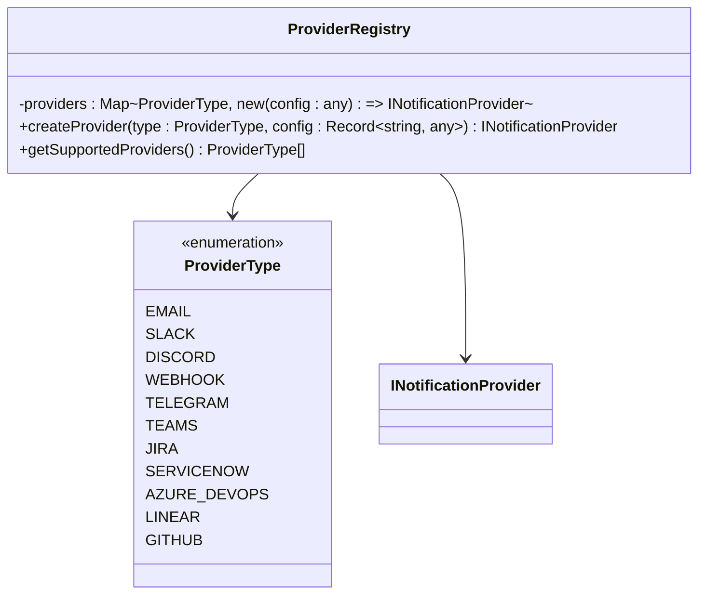
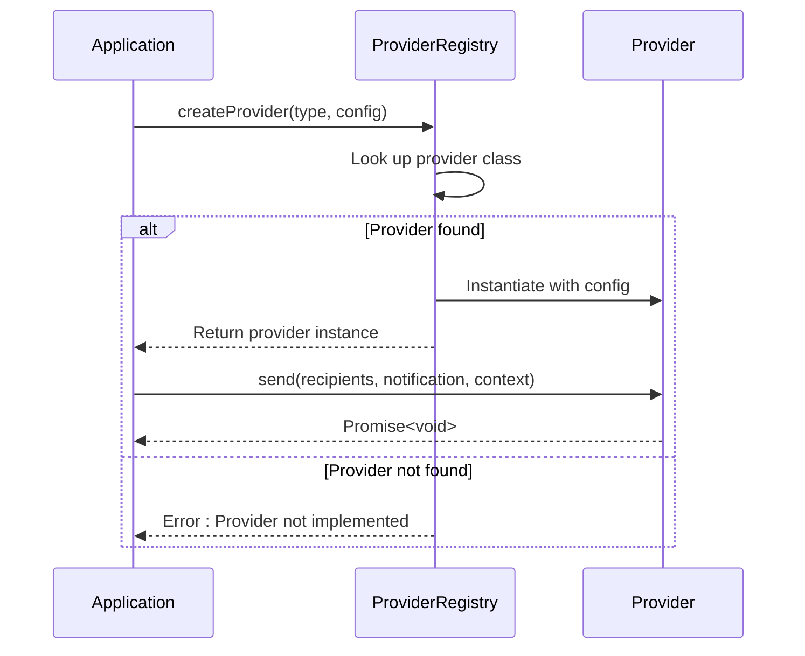
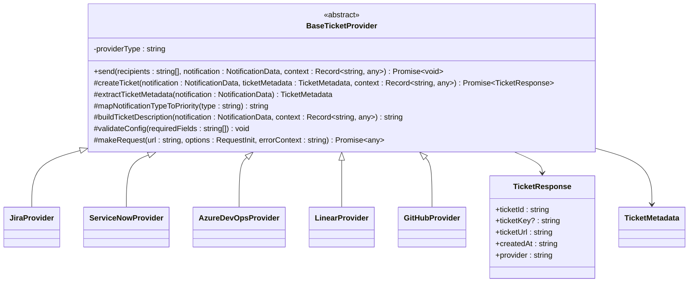
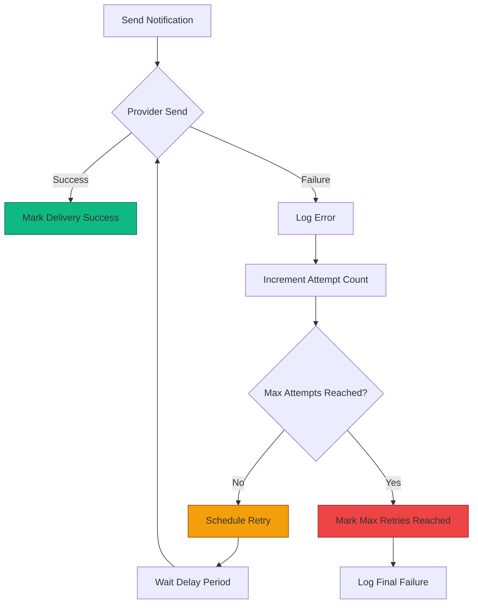

# Notification Providers

<cite>
**Referenced Files in This Document**   
- [types.ts](file://src/core/notifications/types.ts)
- [base.ts](file://src/core/notifications/providers/base.ts)
- [index.ts](file://src/core/notifications/providers/index.ts)
- [emailProvider.ts](file://src/core/notifications/providers/emailProvider.ts)
- [slackProvider.ts](file://src/core/notifications/providers/slackProvider.ts)
- [discordProvider.ts](file://src/core/notifications/providers/discordProvider.ts)
- [teamsProvider.ts](file://src/core/notifications/providers/teamsProvider.ts)
- [telegramProvider.ts](file://src/core/notifications/providers/telegramProvider.ts)
- [webhookProvider.ts](file://src/core/notifications/providers/webhookProvider.ts)
- [baseTicketProvider.ts](file://src/core/notifications/providers/tickets/baseTicketProvider.ts)
- [jiraProvider.ts](file://src/core/notifications/providers/tickets/jiraProvider.ts)
- [serviceNowProvider.ts](file://src/core/notifications/providers/tickets/serviceNowProvider.ts)
- [azureDevOpsProvider.ts](file://src/core/notifications/providers/tickets/azureDevOpsProvider.ts)
- [linearProvider.ts](file://src/core/notifications/providers/tickets/linearProvider.ts)
- [githubProvider.ts](file://src/core/notifications/providers/tickets/githubProvider.ts)
- [notifier.ts](file://src/core/notifications/notifier.ts)
- [deliveryService.ts](file://src/core/notifications/deliveryService.ts)
</cite>

## Table of Contents
1. [Introduction](#introduction)
2. [INotificationProvider Interface](#inotificationprovider-interface)
3. [Provider Registry Pattern](#provider-registry-pattern)
4. [Email Provider](#email-provider)
5. [Slack Provider](#slack-provider)
6. [Discord Provider](#discord-provider)
7. [Microsoft Teams Provider](#microsoft-teams-provider)
8. [Telegram Provider](#telegram-provider)
9. [Webhook Provider](#webhook-provider)
10. [Ticket Providers](#ticket-providers)
    - [Jira Provider](#jira-provider)
    - [ServiceNow Provider](#servicenow-provider)
    - [Azure DevOps Provider](#azure-devops-provider)
    - [Linear Provider](#linear-provider)
    - [GitHub Provider](#github-provider)
11. [Error Handling and Retry Mechanisms](#error-handling-and-retry-mechanisms)
12. [Rate Limiting and Delivery Considerations](#rate-limiting-and-delivery-considerations)
13. [Security Best Practices](#security-best-practices)
14. [Integration Scenarios](#integration-scenarios)
15. [Troubleshooting Guide](#troubleshooting-guide)

## Introduction
The SentinelIQ notification provider system enables integration with multiple external services for delivering alerts and notifications. The system follows a modular architecture that supports various notification channels including email, messaging platforms, webhooks, and ticketing systems. This documentation details the interface for all supported providers, configuration requirements, authentication methods, message formatting, and delivery mechanisms.

The notification system is designed to be extensible, allowing new providers to be registered through the ProviderRegistry pattern. Each provider implements a consistent interface while handling the specific requirements of its target platform. The system includes robust error handling, retry mechanisms, and delivery tracking to ensure reliable notification delivery.

**Section sources**
- [types.ts](file://src/core/notifications/types.ts#L1-L60)
- [notifier.ts](file://src/core/notifications/notifier.ts#L1-L308)

## INotificationProvider Interface
The INotificationProvider interface defines the contract that all notification providers must implement. This standardized interface ensures consistency across different notification channels while allowing each provider to handle platform-specific details.

**Diagram sources**
- [types.ts](file://src/core/notifications/types.ts#L1-L21)
- [base.ts](file://src/core/notifications/providers/base.ts#L6-L38)

**Section sources**
- [base.ts](file://src/core/notifications/providers/base.ts#L6-L38)
- [types.ts](file://src/core/notifications/types.ts#L1-L21)

## Provider Registry Pattern
The ProviderRegistry pattern implements a factory design pattern that allows for dynamic creation of notification providers based on type. This pattern enables the system to support multiple providers while maintaining a clean, extensible architecture.

The ProviderRegistry maintains a map of provider types to their corresponding classes, allowing for easy registration and instantiation of providers. When a notification needs to be sent, the registry creates an instance of the appropriate provider based on the configuration.

**Diagram sources**
- [index.ts](file://src/core/notifications/providers/index.ts#L18-L47)
- [base.ts](file://src/core/notifications/providers/base.ts#L6-L38)

**Section sources**
- [index.ts](file://src/core/notifications/providers/index.ts#L18-L47)

## Email Provider
The EmailProvider sends notifications via email using the configured email service. It formats messages with HTML templates that include branding, styling, and interactive elements.

### Configuration Schema
The EmailProvider requires the following configuration:
- No specific configuration properties are required at the provider level, as email delivery configuration is handled at the application level.

### Authentication Methods
Email authentication is managed externally through the application's email service configuration (e.g., SendGrid, AWS SES, or other SMTP providers).

### Message Formatting
The provider generates HTML emails with:
- Responsive design for various email clients
- Color-coded headers based on notification type
- Action buttons for linked content
- Branding and footer information

### Delivery Mechanism
Emails are sent to all workspace members who have email notifications enabled. The provider uses the application's email service to deliver messages.

**Section sources**
- [emailProvider.ts](file://src/core/notifications/providers/emailProvider.ts#L1-L84)

## Slack Provider
The SlackProvider delivers notifications to Slack channels via incoming webhooks.

### Configuration Schema
Required configuration properties:
- `webhookUrl`: The Slack incoming webhook URL for the target channel

### Authentication Methods
Authentication is handled through Slack's webhook token, which is included in the webhook URL.

### Message Formatting
Messages are formatted using Slack's Block Kit API with:
- Header blocks with notification title and type-specific emojis
- Section blocks for the message content
- Action blocks with buttons for linked content
- Context blocks showing workspace name and timestamp
- Color coding based on notification type

### Delivery Mechanism
The provider sends messages to the channel configured in the webhook URL. All recipients receive the same message as Slack channels are shared spaces.

**Section sources**
- [slackProvider.ts](file://src/core/notifications/providers/slackProvider.ts#L1-L102)

## Discord Provider
The DiscordProvider sends notifications to Discord channels using webhooks.

### Configuration Schema
Required configuration properties:
- `webhookUrl`: The Discord webhook URL for the target channel

### Authentication Methods
Authentication is handled through Discord's webhook token, which is included in the webhook URL.

### Message Formatting
Messages are formatted as Discord embeds with:
- Title and description from the notification
- Color coding based on notification type
- Footer showing the workspace name
- Fields for additional metadata
- Optional URL linking to details

### Delivery Mechanism
The provider sends embed messages to the channel configured in the webhook URL. All recipients in the channel receive the notification.

**Section sources**
- [discordProvider.ts](file://src/core/notifications/providers/discordProvider.ts#L1-L75)

## Microsoft Teams Provider
The TeamsProvider delivers notifications to Microsoft Teams channels via incoming webhooks.

### Configuration Schema
Required configuration properties:
- `webhookUrl`: The Microsoft Teams incoming webhook URL

### Authentication Methods
Authentication is handled through Teams' webhook token, which is included in the webhook URL.

### Message Formatting
Messages are formatted using Teams' Adaptive Cards with:
- Theme colors based on notification type
- Activity title with type-specific emojis
- Text content and facts (key-value pairs) for metadata
- Potential actions for linked content
- Markdown formatting support

### Delivery Mechanism
The provider sends Adaptive Card messages to the Teams channel configured in the webhook URL.

**Section sources**
- [teamsProvider.ts](file://src/core/notifications/providers/teamsProvider.ts#L1-L107)

## Telegram Provider
The TelegramProvider sends notifications to Telegram users or groups via bot API.

### Configuration Schema
Required configuration properties:
- `botToken`: The Telegram bot token for authentication
- Recipient identifiers (chat IDs) are provided as recipients in the send method

### Authentication Methods
Authentication is handled through the bot token, which is used in API requests to Telegram's servers.

### Message Formatting
Messages are formatted using HTML parsing with:
- Bold formatting for the title with type-specific emojis
- Plain text message content
- Inline keyboard buttons for linked content
- Italicized footer with workspace name and timestamp

### Delivery Mechanism
The provider sends individual messages to each recipient chat ID using Telegram's sendMessage API endpoint.

**Section sources**
- [telegramProvider.ts](file://src/core/notifications/providers/telegramProvider.ts#L1-L93)

## Webhook Provider
The WebhookProvider sends notifications to custom endpoints via HTTP requests.

### Configuration Schema
Required configuration properties:
- `url`: The target webhook URL
- `method`: HTTP method (default: POST)
- `headers`: Custom headers to include in the request

### Authentication Methods
Authentication is handled through custom headers, which can include API keys, tokens, or other credentials.

### Message Formatting
The provider sends a structured JSON payload containing:
- Timestamp of the notification
- Workspace information
- Notification details (type, title, message, link, metadata)
- Event type and data from the triggering event

### Delivery Mechanism
The provider makes HTTP requests to the configured URL with the notification payload. The response is validated to ensure successful delivery.

**Section sources**
- [webhookProvider.ts](file://src/core/notifications/providers/webhookProvider.ts#L1-L53)

## Ticket Providers
The ticket providers create issues or incidents in external ticketing systems. These providers extend the BaseTicketProvider class, which provides common functionality for ticket creation.

**Diagram sources**
- [baseTicketProvider.ts](file://src/core/notifications/providers/tickets/baseTicketProvider.ts#L33-L202)
- [types.ts](file://src/core/notifications/types.ts#L8-L20)

**Section sources**
- [baseTicketProvider.ts](file://src/core/notifications/providers/tickets/baseTicketProvider.ts#L7-L202)

### Jira Provider
The JiraProvider creates issues in Jira projects using the REST API.

#### Configuration Schema
Required configuration properties:
- `baseUrl`: Jira instance URL
- `email`: Jira user email
- `apiToken`: Jira API token
- `projectKey`: Default project key
- `issueType`: Issue type name (default: Task)

#### Authentication Methods
Authentication uses Basic Auth with email and API token.

#### Ticket Creation
The provider maps notification data to Jira issue fields:
- Summary from notification title
- Description with formatted content
- Priority mapped from notification type
- Labels and assignee from metadata
- Due date if specified

**Section sources**
- [jiraProvider.ts](file://src/core/notifications/providers/tickets/jiraProvider.ts#L1-L120)

### ServiceNow Provider
The ServiceNowProvider creates incidents in ServiceNow using the Table API.

#### Configuration Schema
Required configuration properties:
- `instanceUrl`: ServiceNow instance URL
- `username`: ServiceNow username
- `password`: ServiceNow password
- `assignmentGroup`: Default assignment group (optional)
- `callerId`: Caller user ID (optional)

#### Authentication Methods
Authentication uses Basic Auth with username and password.

#### Incident Creation
The provider maps notification data to incident fields:
- Short description from title
- Detailed description with context
- Urgency, impact, and priority based on notification type
- Category and subcategory for classification
- Work notes with additional metadata

**Section sources**
- [serviceNowProvider.ts](file://src/core/notifications/providers/tickets/serviceNowProvider.ts#L1-L154)

### Azure DevOps Provider
The Azure DevOps Provider creates work items in Azure DevOps projects.

#### Configuration Schema
Required configuration properties:
- `organizationUrl`: Azure DevOps organization URL
- `personalAccessToken`: PAT for authentication
- `projectName`: Target project name
- `workItemType`: Work item type (e.g., Bug, Task, Issue)

#### Authentication Methods
Authentication uses Basic Auth with personal access token.

#### Work Item Creation
The provider creates work items with:
- Title from notification title
- Description with formatted content
- Priority based on notification type
- Area and iteration path from configuration
- Links to related items if specified

**Section sources**
- [azureDevOpsProvider.ts](file://src/core/notifications/providers/tickets/azureDevOpsProvider.ts#L1-L105)

### Linear Provider
The LinearProvider creates issues in Linear workspaces.

#### Configuration Schema
Required configuration properties:
- `apiKey`: Linear API key
- `teamId`: Target team ID
- `priority`: Default priority level
- `stateId`: Default state for new issues

#### Authentication Methods
Authentication uses API key in the Authorization header.

#### Issue Creation
The provider creates issues with:
- Title from notification title
- Description with context and metadata
- Priority mapped from notification type
- Labels from metadata
- Assignee if specified in metadata

**Section sources**
- [linearProvider.ts](file://src/core/notifications/providers/tickets/linearProvider.ts#L1-L98)

### GitHub Provider
The GitHubProvider creates issues in GitHub repositories.

#### Configuration Schema
Required configuration properties:
- `token`: GitHub personal access token
- `owner`: Repository owner
- `repo`: Repository name
- `labels`: Default labels for created issues

#### Authentication Methods
Authentication uses the token in the Authorization header.

#### Issue Creation
The provider creates issues with:
- Title from notification title
- Body with formatted description and metadata
- Labels from configuration or metadata
- Assignee if specified
- Milestone if specified

**Section sources**
- [githubProvider.ts](file://src/core/notifications/providers/tickets/githubProvider.ts#L1-L92)

## Error Handling and Retry Mechanisms
The notification system implements comprehensive error handling and retry mechanisms to ensure reliable delivery.

The system uses a three-tiered retry strategy with increasing delays:
- First retry: 1 minute delay
- Second retry: 5 minutes delay
- Third retry: 15 minutes delay

After three failed attempts, the delivery is marked as permanently failed.

**Section sources**
- [deliveryService.ts](file://src/core/notifications/deliveryService.ts#L8-L94)
- [notifier.ts](file://src/core/notifications/notifier.ts#L86-L109)

## Rate Limiting and Delivery Considerations
The notification system handles delivery considerations through several mechanisms:

1. **Delivery Logging**: Every delivery attempt is logged with status, attempts, and timestamps
2. **Batch Processing**: Multiple notifications are processed efficiently
3. **Asynchronous Delivery**: Notifications are sent asynchronously to avoid blocking
4. **Resource Management**: Connection pooling and request throttling prevent overwhelming external services

The system also provides delivery statistics and monitoring through the `getDeliveryStats` function, which aggregates delivery success rates by provider.

**Section sources**
- [deliveryService.ts](file://src/core/notifications/deliveryService.ts#L176-L223)
- [notifier.ts](file://src/core/notifications/notifier.ts#L72-L83)

## Security Best Practices
The notification system follows security best practices for credential management:

1. **Credential Storage**: Provider credentials are stored securely in the database
2. **Environment Variables**: Sensitive credentials can be managed through environment variables
3. **Token-Based Authentication**: Most providers use token-based authentication rather than passwords
4. **Limited Scope Tokens**: API tokens should have the minimum required permissions
5. **Regular Rotation**: Credentials should be rotated periodically

For webhook providers, additional security measures include:
- Using HTTPS endpoints
- Implementing signature verification
- Setting up IP allowlisting
- Using short-lived tokens

**Section sources**
- [base.ts](file://src/core/notifications/providers/base.ts#L11-L12)
- [providers](file://src/core/notifications/providers/)

## Integration Scenarios
Common integration scenarios include:

1. **Alert Notifications**: Sending security alerts to Slack and creating Jira tickets
2. **Incident Response**: Notifying team members via email and Telegram while creating ServiceNow incidents
3. **Status Updates**: Broadcasting system status to multiple channels via webhooks
4. **Escalation Procedures**: Tiered notifications that escalate through multiple providers based on severity

Configuration examples:
- Critical alerts: Email + Slack + Jira + Telegram
- High severity: Slack + Jira
- Medium severity: Slack only
- Low severity: In-app notifications only

**Section sources**
- [notifier.ts](file://src/core/notifications/notifier.ts#L44-L52)
- [types.ts](file://src/core/notifications/types.ts#L53-L59)

## Troubleshooting Guide
Common issues and solutions for failed deliveries:

1. **Invalid Credentials**
   - Verify provider configuration
   - Regenerate API tokens if expired
   - Check username/email for accuracy

2. **Network Connectivity**
   - Verify webhook URLs are accessible
   - Check firewall rules for outbound connections
   - Test connectivity to provider endpoints

3. **Rate Limiting**
   - Implement request throttling
   - Check provider rate limits
   - Add exponential backoff for retries

4. **Configuration Errors**
   - Validate required configuration fields
   - Check for typos in URLs and keys
   - Verify project keys and identifiers

5. **Permission Issues**
   - Ensure tokens have required scopes
   - Verify user permissions in target systems
   - Check assignment group access

Use the delivery logs to diagnose specific issues, including error messages and response codes from provider APIs.

**Section sources**
- [deliveryService.ts](file://src/core/notifications/deliveryService.ts#L50-L94)
- [notifier.ts](file://src/core/notifications/notifier.ts#L101-L108)