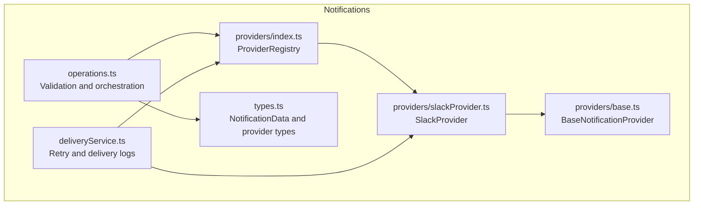
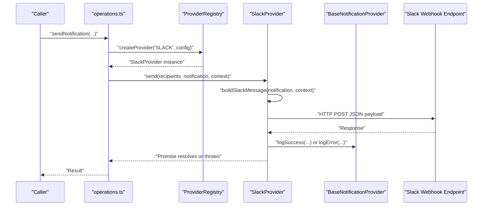
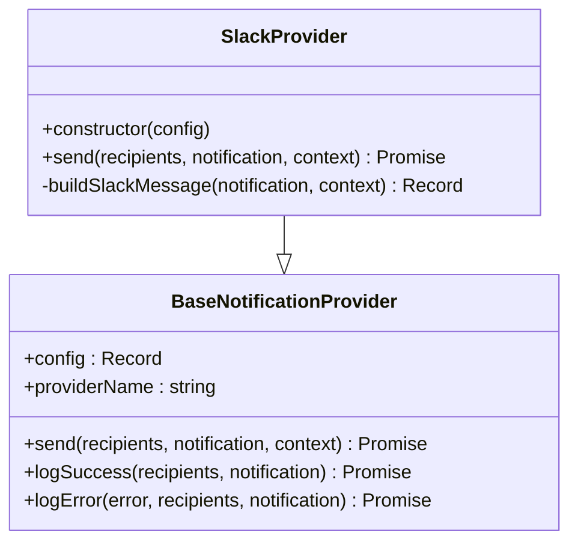
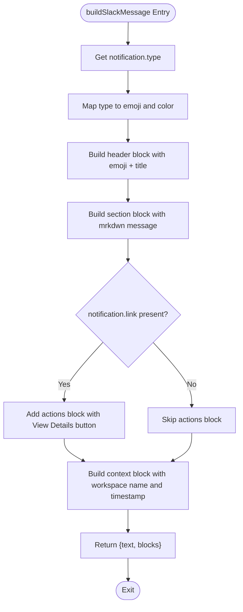
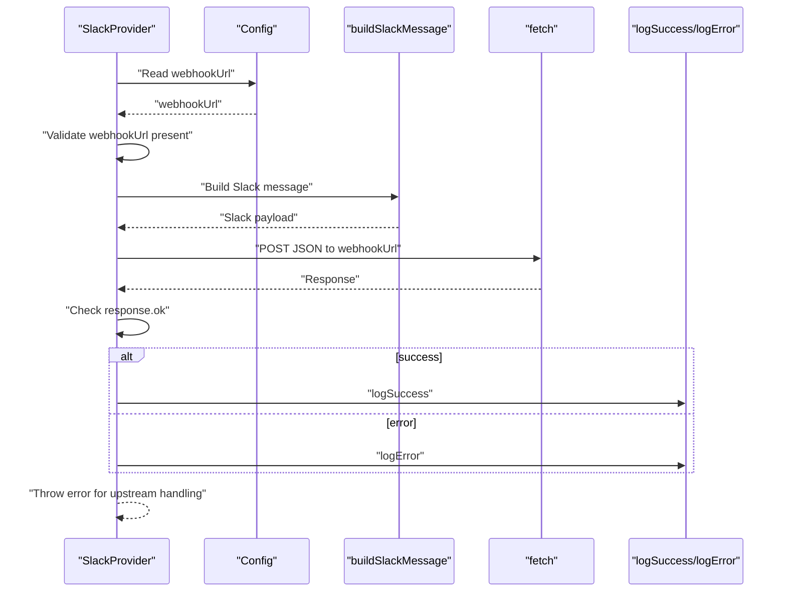
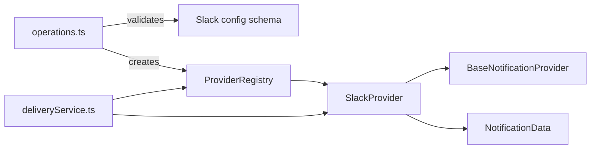

# Slack Provider

<cite>
**Referenced Files in This Document**
- [slackProvider.ts](file://src/core/notifications/providers/slackProvider.ts)
- [base.ts](file://src/core/notifications/providers/base.ts)
- [types.ts](file://src/core/notifications/types.ts)
- [operations.ts](file://src/core/notifications/operations.ts)
- [index.ts](file://src/core/notifications/providers/index.ts)
- [PROVIDERS_DOCUMENTATION.md](file://src/core/notifications/PROVIDERS_DOCUMENTATION.md)
- [deliveryService.ts](file://src/core/notifications/deliveryService.ts)
</cite>

## Table of Contents
1. [Introduction](#introduction)
2. [Project Structure](#project-structure)
3. [Core Components](#core-components)
4. [Architecture Overview](#architecture-overview)
5. [Detailed Component Analysis](#detailed-component-analysis)
6. [Dependency Analysis](#dependency-analysis)
7. [Performance Considerations](#performance-considerations)
8. [Troubleshooting Guide](#troubleshooting-guide)
9. [Conclusion](#conclusion)
10. [Appendices](#appendices)

## Introduction
This document provides API documentation for the SlackProvider in SentinelIQ. It covers configuration requirements, message building, HTTP transport, error handling, type-specific formatting, and integration examples. It also includes troubleshooting guidance for common issues such as webhook expiration, rate limiting, and message formatting errors.

## Project Structure
The SlackProvider is part of the notification system and follows a provider registry pattern. The provider extends a base class that centralizes logging and error handling. Configuration validation is performed by the operations module, and delivery retries are managed by the delivery service.

**Diagram sources**
- [operations.ts](file://src/core/notifications/operations.ts#L1-L95)
- [types.ts](file://src/core/notifications/types.ts#L1-L60)
- [index.ts](file://src/core/notifications/providers/index.ts#L1-L46)
- [base.ts](file://src/core/notifications/providers/base.ts#L1-L38)
- [slackProvider.ts](file://src/core/notifications/providers/slackProvider.ts#L1-L102)
- [deliveryService.ts](file://src/core/notifications/deliveryService.ts#L1-L120)

**Section sources**
- [slackProvider.ts](file://src/core/notifications/providers/slackProvider.ts#L1-L102)
- [base.ts](file://src/core/notifications/providers/base.ts#L1-L38)
- [types.ts](file://src/core/notifications/types.ts#L1-L60)
- [operations.ts](file://src/core/notifications/operations.ts#L1-L95)
- [index.ts](file://src/core/notifications/providers/index.ts#L1-L46)
- [PROVIDERS_DOCUMENTATION.md](file://src/core/notifications/PROVIDERS_DOCUMENTATION.md#L1-L88)

## Core Components
- SlackProvider: Implements the Slack webhook integration, builds a Slack-compatible JSON payload, and sends it via HTTP POST.
- BaseNotificationProvider: Provides shared logging and error handling for all providers.
- Provider Registry: Creates provider instances based on configuration.
- Validation: Ensures provider configuration conforms to expected schemas.
- Delivery Service: Manages retries and delivery logs.

Key responsibilities:
- Configuration: Requires a Slack webhook URL; optional channel field is supported by validation schema.
- Message Building: Produces a blocks-based JSON payload with header, section, optional actions, and context.
- Transport: Sends HTTP POST to the Slack webhook endpoint with JSON content.
- Error Handling: Logs success and errors, rethrows exceptions for upstream handling.

**Section sources**
- [slackProvider.ts](file://src/core/notifications/providers/slackProvider.ts#L1-L102)
- [base.ts](file://src/core/notifications/providers/base.ts#L1-L38)
- [operations.ts](file://src/core/notifications/operations.ts#L1-L95)
- [index.ts](file://src/core/notifications/providers/index.ts#L1-L46)
- [deliveryService.ts](file://src/core/notifications/deliveryService.ts#L1-L120)

## Architecture Overview
The SlackProvider participates in the notification pipeline:
- Validation ensures the provider configuration is correct.
- The provider registry instantiates the SlackProvider with configuration.
- The provider builds a Slack message and posts it to the webhook URL.
- Delivery logs track attempts and retries.

**Diagram sources**
- [operations.ts](file://src/core/notifications/operations.ts#L1-L95)
- [index.ts](file://src/core/notifications/providers/index.ts#L1-L46)
- [slackProvider.ts](file://src/core/notifications/providers/slackProvider.ts#L1-L102)
- [base.ts](file://src/core/notifications/providers/base.ts#L1-L38)

## Detailed Component Analysis

### SlackProvider Implementation
The SlackProvider extends the base provider and implements the send method and a private message builder.

- Constructor: Initializes with provider name and configuration.
- send:
  - Validates presence of webhook URL.
  - Builds a Slack message payload.
  - Posts JSON to the webhook URL.
  - Logs success or error and rethrows for upstream handling.
- buildSlackMessage:
  - Maps notification type to emojis and colors.
  - Constructs a blocks array with:
    - Header block with title and emoji.
    - Section block with message text.
    - Optional actions block with a View Details button linking to notification.link.
    - Context block with workspace name and timestamp.

**Diagram sources**
- [base.ts](file://src/core/notifications/providers/base.ts#L1-L38)
- [slackProvider.ts](file://src/core/notifications/providers/slackProvider.ts#L1-L102)

**Section sources**
- [slackProvider.ts](file://src/core/notifications/providers/slackProvider.ts#L1-L102)
- [base.ts](file://src/core/notifications/providers/base.ts#L1-L38)

### Message Builder Logic
The message builder constructs a Slack-compatible payload with:
- Emojis and colors mapped to notification types.
- Header block with plain text title including emoji.
- Section block with mrkdwn-formatted message.
- Optional actions block with a primary button linking to notification.link.
- Context block with workspace name and local timestamp.

**Diagram sources**
- [slackProvider.ts](file://src/core/notifications/providers/slackProvider.ts#L38-L100)

**Section sources**
- [slackProvider.ts](file://src/core/notifications/providers/slackProvider.ts#L38-L100)

### Send Method Flow
The send method performs:
- Configuration validation for webhook URL.
- Message construction.
- HTTP POST with JSON body.
- Response validation and logging.

**Diagram sources**
- [slackProvider.ts](file://src/core/notifications/providers/slackProvider.ts#L9-L36)

**Section sources**
- [slackProvider.ts](file://src/core/notifications/providers/slackProvider.ts#L9-L36)

## Dependency Analysis
- SlackProvider depends on:
  - BaseNotificationProvider for logging and error handling.
  - NotificationData type for payload structure.
  - ProviderRegistry to instantiate the provider.
  - Validation schemas in operations.ts for configuration correctness.
  - DeliveryService for retry and logging.

**Diagram sources**
- [operations.ts](file://src/core/notifications/operations.ts#L1-L95)
- [index.ts](file://src/core/notifications/providers/index.ts#L1-L46)
- [slackProvider.ts](file://src/core/notifications/providers/slackProvider.ts#L1-L102)
- [base.ts](file://src/core/notifications/providers/base.ts#L1-L38)
- [deliveryService.ts](file://src/core/notifications/deliveryService.ts#L1-L120)

**Section sources**
- [operations.ts](file://src/core/notifications/operations.ts#L1-L95)
- [index.ts](file://src/core/notifications/providers/index.ts#L1-L46)
- [slackProvider.ts](file://src/core/notifications/providers/slackProvider.ts#L1-L102)
- [base.ts](file://src/core/notifications/providers/base.ts#L1-L38)
- [deliveryService.ts](file://src/core/notifications/deliveryService.ts#L1-L120)

## Performance Considerations
- Network latency: The provider performs a single HTTP POST per notification. Consider batching or rate limiting at the webhook level if sending many notifications concurrently.
- Payload size: Slack blocks are straightforward; keep message content concise to minimize payload size.
- Retries: The delivery service schedules retries with increasing delays. Ensure webhook endpoints can handle bursts and backoffs.

[No sources needed since this section provides general guidance]

## Troubleshooting Guide
Common issues and resolutions:

- Webhook URL not configured
  - Symptom: Error indicating missing Slack webhook URL.
  - Resolution: Ensure the configuration includes a valid webhook URL.

- API returned non-OK status
  - Symptom: Error mentioning Slack API returned a non-OK status.
  - Resolution: Check webhook URL validity and endpoint availability. Verify the Slack app’s incoming webhook settings.

- Rate limiting
  - Symptom: Frequent failures or throttled responses.
  - Resolution: Implement backoff and retry using the built-in delivery service. Reduce burst frequency or adjust Slack workspace rate limits.

- Message formatting errors
  - Symptom: Slack rejects malformed blocks or invalid fields.
  - Resolution: Ensure notification.title and notification.message are present. Avoid overly long text. The builder adds a header, section, optional actions, and context; verify these align with Slack’s block constraints.

- Contextual information
  - The context object is used to include workspace name and timestamp in the message. Ensure context.workspaceName is populated when invoking the provider.

- Logging and diagnostics
  - The provider logs success and error events with provider name, recipients count, and title. Review logs for detailed error messages.

**Section sources**
- [slackProvider.ts](file://src/core/notifications/providers/slackProvider.ts#L9-L36)
- [base.ts](file://src/core/notifications/providers/base.ts#L19-L38)
- [deliveryService.ts](file://src/core/notifications/deliveryService.ts#L1-L120)

## Conclusion
The SlackProvider integrates seamlessly with SentinelIQ’s notification system. It validates configuration, constructs a rich Slack message payload, and posts it to the configured webhook endpoint. Robust logging and retry mechanisms ensure reliable delivery. Proper configuration and adherence to Slack’s API specifications will yield consistent and informative notifications.

[No sources needed since this section summarizes without analyzing specific files]

## Appendices

### Configuration Requirements
- Provider type: SLACK
- Required configuration:
  - webhookUrl: A valid Slack Incoming Webhook URL.
  - Optional: channel (supported by validation schema).
- Environment example:
  - SLACK_WEBHOOK_URL=https://hooks.slack.com/services/YOUR/WEBHOOK/URL

**Section sources**
- [operations.ts](file://src/core/notifications/operations.ts#L18-L23)
- [PROVIDERS_DOCUMENTATION.md](file://src/core/notifications/PROVIDERS_DOCUMENTATION.md#L32-L40)
- [PROVIDERS_DOCUMENTATION.md](file://src/core/notifications/PROVIDERS_DOCUMENTATION.md#L170-L190)

### Type-Specific Formatting
- Notification types and associated emojis/colors:
  - INFO: Blue
  - SUCCESS: Green
  - WARNING: Yellow/Gold
  - ERROR: Red-Orange
  - CRITICAL: Dark Red
- The builder applies emojis and colors based on notification.type.

**Section sources**
- [slackProvider.ts](file://src/core/notifications/providers/slackProvider.ts#L38-L53)

### Message Payload Structure
- Root fields:
  - text: Concatenation of emoji and title.
  - blocks: Array containing:
    - Header block with plain_text title.
    - Section block with mrkdwn message.
    - Optional actions block with a primary button linking to notification.link.
    - Context block with workspace name and timestamp.

**Section sources**
- [slackProvider.ts](file://src/core/notifications/providers/slackProvider.ts#L58-L99)

### Integration Examples
- Backend usage example:
  - Use the operations module to send notifications with provider set to SLACK.
- Environment configuration example:
  - Set SLACK_WEBHOOK_URL to your Slack Incoming Webhook URL.

**Section sources**
- [PROVIDERS_DOCUMENTATION.md](file://src/core/notifications/PROVIDERS_DOCUMENTATION.md#L154-L169)
- [PROVIDERS_DOCUMENTATION.md](file://src/core/notifications/PROVIDERS_DOCUMENTATION.md#L170-L190)