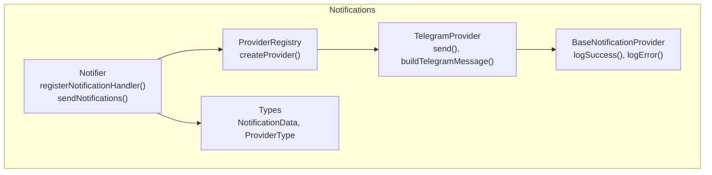
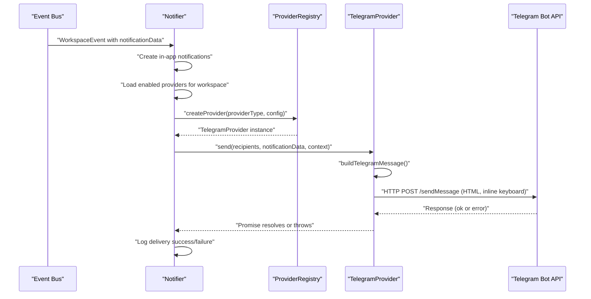
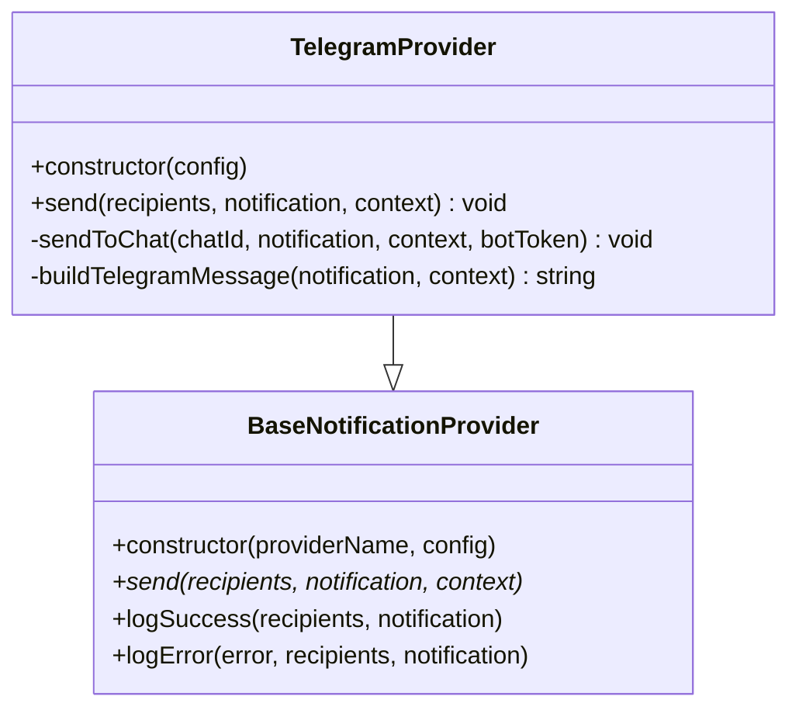
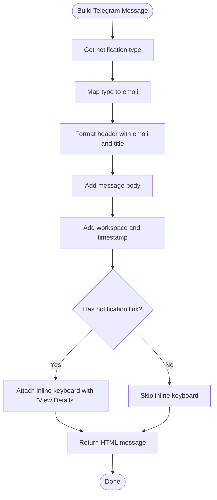
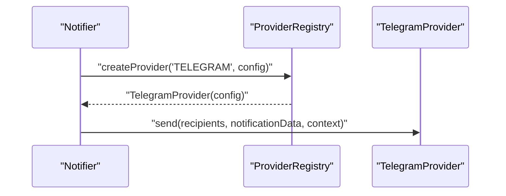
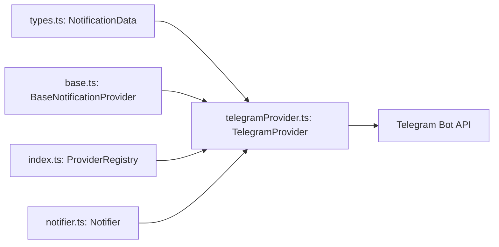

# Telegram Provider

<cite>
**Referenced Files in This Document**
- [telegramProvider.ts](file://src/core/notifications/providers/telegramProvider.ts)
- [base.ts](file://src/core/notifications/providers/base.ts)
- [index.ts](file://src/core/notifications/providers/index.ts)
- [types.ts](file://src/core/notifications/types.ts)
- [notifier.ts](file://src/core/notifications/notifier.ts)
- [PROVIDERS_DOCUMENTATION.md](file://src/core/notifications/PROVIDERS_DOCUMENTATION.md)
</cite>

## Table of Contents
1. [Introduction](#introduction)
2. [Project Structure](#project-structure)
3. [Core Components](#core-components)
4. [Architecture Overview](#architecture-overview)
5. [Detailed Component Analysis](#detailed-component-analysis)
6. [Dependency Analysis](#dependency-analysis)
7. [Performance Considerations](#performance-considerations)
8. [Troubleshooting Guide](#troubleshooting-guide)
9. [Conclusion](#conclusion)
10. [Appendices](#appendices)

## Introduction
This document provides API documentation for the TelegramProvider in SentinelIQ. It covers configuration requirements, authentication, the send method implementation for multiple recipients, the message builder that formats HTML messages with type-specific emojis, inline keyboard buttons for link navigation, error handling for Telegram API responses, and practical usage patterns within the notification workflow. It also includes troubleshooting guidance for common issues such as invalid bot tokens, chat permissions, message length limits, and API rate limiting.

## Project Structure
The TelegramProvider is part of the notification system and follows a provider registry pattern. Providers implement a common interface and extend a base class that handles logging and error reporting. The notifier orchestrates sending notifications based on workspace configuration and event types.

**Diagram sources**
- [telegramProvider.ts](file://src/core/notifications/providers/telegramProvider.ts#L1-L93)
- [base.ts](file://src/core/notifications/providers/base.ts#L1-L38)
- [index.ts](file://src/core/notifications/providers/index.ts#L1-L47)
- [notifier.ts](file://src/core/notifications/notifier.ts#L1-L111)
- [types.ts](file://src/core/notifications/types.ts#L1-L60)

**Section sources**
- [telegramProvider.ts](file://src/core/notifications/providers/telegramProvider.ts#L1-L93)
- [base.ts](file://src/core/notifications/providers/base.ts#L1-L38)
- [index.ts](file://src/core/notifications/providers/index.ts#L1-L47)
- [notifier.ts](file://src/core/notifications/notifier.ts#L1-L111)
- [types.ts](file://src/core/notifications/types.ts#L1-L60)

## Core Components
- TelegramProvider: Implements the Telegram delivery mechanism, validates configuration, sends messages to multiple recipients, builds HTML-formatted messages, and attaches inline keyboard buttons when a link is present.
- BaseNotificationProvider: Provides logging helpers and defines the provider interface contract.
- ProviderRegistry: Registers supported providers and instantiates the appropriate provider based on configuration.
- Notifier: Coordinates notification dispatch, retrieves recipients, and invokes provider.send with context and notification data.
- Types: Defines NotificationData and provider configuration types used across the system.

Key responsibilities:
- Configuration validation: Ensures botToken is present before sending.
- Parallel delivery: Sends to all recipients concurrently.
- Message formatting: Uses HTML parse mode and type-specific emojis.
- Inline keyboard: Adds a “View Details” button linking to the provided URL.
- Error handling: Logs failures and propagates errors for upstream retry logic.

**Section sources**
- [telegramProvider.ts](file://src/core/notifications/providers/telegramProvider.ts#L1-L93)
- [base.ts](file://src/core/notifications/providers/base.ts#L1-L38)
- [index.ts](file://src/core/notifications/providers/index.ts#L1-L47)
- [notifier.ts](file://src/core/notifications/notifier.ts#L1-L111)
- [types.ts](file://src/core/notifications/types.ts#L1-L60)

## Architecture Overview
The TelegramProvider participates in the notification pipeline orchestrated by the Notifier. Providers are created dynamically via the ProviderRegistry based on workspace configuration. Recipients are derived from workspace members, and each provider’s send method is invoked with the same NotificationData and context.

**Diagram sources**
- [notifier.ts](file://src/core/notifications/notifier.ts#L1-L111)
- [index.ts](file://src/core/notifications/providers/index.ts#L1-L47)
- [telegramProvider.ts](file://src/core/notifications/providers/telegramProvider.ts#L1-L93)

## Detailed Component Analysis

### TelegramProvider
Implements the Telegram delivery logic:
- Constructor: Initializes provider name and stores configuration.
- send(recipients, notification, context): Validates botToken, maps recipients to individual send operations, runs them concurrently, logs success, and rethrows errors for upstream handling.
- sendToChat(chatId, notification, context, botToken): Builds the HTML message, constructs the Telegram Bot API URL, and performs an HTTP POST with JSON payload including parse_mode and optional inline keyboard.
- buildTelegramMessage(notification, context): Creates an HTML-formatted message with type-specific emojis and contextual metadata.

**Diagram sources**
- [telegramProvider.ts](file://src/core/notifications/providers/telegramProvider.ts#L1-L93)
- [base.ts](file://src/core/notifications/providers/base.ts#L1-L38)

**Section sources**
- [telegramProvider.ts](file://src/core/notifications/providers/telegramProvider.ts#L1-L93)

### Message Builder and Formatting
- Type-specific emojis: INFO, SUCCESS, WARNING, ERROR, CRITICAL map to distinct emojis; unknown types fall back to a bell emoji.
- HTML formatting: Uses bold and italic tags to structure title, message, and contextual footer.
- Inline keyboard: When a link is present, adds a single inline button labeled “View Details” pointing to the URL.

**Diagram sources**
- [telegramProvider.ts](file://src/core/notifications/providers/telegramProvider.ts#L70-L91)

**Section sources**
- [telegramProvider.ts](file://src/core/notifications/providers/telegramProvider.ts#L70-L91)

### Provider Registry and Initialization
- ProviderRegistry: Maintains a map of provider types to provider constructors and instantiates the correct provider based on configuration.
- Notifier: Loads enabled providers for a workspace, prepares context, and invokes provider.send for each provider.

**Diagram sources**
- [index.ts](file://src/core/notifications/providers/index.ts#L1-L47)
- [notifier.ts](file://src/core/notifications/notifier.ts#L67-L91)

**Section sources**
- [index.ts](file://src/core/notifications/providers/index.ts#L1-L47)
- [notifier.ts](file://src/core/notifications/notifier.ts#L67-L91)

## Dependency Analysis
- TelegramProvider depends on:
  - BaseNotificationProvider for logging and interface compliance.
  - NotificationData type for message structure.
  - ProviderRegistry for instantiation.
  - Notifier for orchestration and context.
- External dependency:
  - Telegram Bot API endpoint for delivering messages.

**Diagram sources**
- [types.ts](file://src/core/notifications/types.ts#L1-L60)
- [telegramProvider.ts](file://src/core/notifications/providers/telegramProvider.ts#L1-L93)
- [base.ts](file://src/core/notifications/providers/base.ts#L1-L38)
- [index.ts](file://src/core/notifications/providers/index.ts#L1-L47)
- [notifier.ts](file://src/core/notifications/notifier.ts#L1-L111)

**Section sources**
- [types.ts](file://src/core/notifications/types.ts#L1-L60)
- [telegramProvider.ts](file://src/core/notifications/providers/telegramProvider.ts#L1-L93)
- [base.ts](file://src/core/notifications/providers/base.ts#L1-L38)
- [index.ts](file://src/core/notifications/providers/index.ts#L1-L47)
- [notifier.ts](file://src/core/notifications/notifier.ts#L1-L111)

## Performance Considerations
- Concurrency: The provider sends to all recipients concurrently using Promise.all, which improves throughput under normal network conditions.
- Rate limiting: Telegram API may throttle requests. Consider adding retry logic with backoff at the notifier level if rate limiting occurs.
- Message size: Telegram’s sendMessage endpoint has limits; keep messages concise to avoid truncation or rejection.
- Logging overhead: Logging success and error events is handled centrally by the base provider; ensure logging systems are not overwhelmed during high-volume events.

[No sources needed since this section provides general guidance]

## Troubleshooting Guide
Common issues and resolutions:
- Invalid bot token:
  - Symptom: Error indicating missing or invalid configuration.
  - Resolution: Ensure TELEGRAM_BOT_TOKEN is set and valid. Re-create the bot via BotFather if necessary.
- Chat permissions:
  - Symptom: API returns permission-related errors.
  - Resolution: Add the bot to the chat/group and ensure it has permission to send messages.
- Message length limits:
  - Symptom: Telegram API rejects messages exceeding character limits.
  - Resolution: Shorten titles or messages; split long content across multiple notifications.
- API rate limiting:
  - Symptom: Frequent 429 or throttling responses.
  - Resolution: Implement retry with exponential backoff at the notifier level; reduce concurrent sends if needed.
- Inline keyboard not appearing:
  - Symptom: Button does not render.
  - Resolution: Ensure notification.link is provided; verify the URL is valid.

Operational tips:
- Use the Telegram Bot API getUpdates endpoint to discover chat IDs for your bot.
- Validate HTML formatting; Telegram’s parse_mode requires valid HTML tags.

**Section sources**
- [telegramProvider.ts](file://src/core/notifications/providers/telegramProvider.ts#L1-L93)
- [PROVIDERS_DOCUMENTATION.md](file://src/core/notifications/PROVIDERS_DOCUMENTATION.md#L90-L155)

## Conclusion
The TelegramProvider integrates seamlessly into SentinelIQ’s notification system. It validates configuration, formats rich HTML messages with type-specific emojis, supports inline navigation buttons, and delivers notifications to multiple recipients concurrently. Robust error handling and logging enable reliable operation, while the provider registry and notifier orchestrate delivery based on workspace configuration and event-driven triggers.

[No sources needed since this section summarizes without analyzing specific files]

## Appendices

### Configuration Requirements
- Provider type: TELEGRAM
- Configuration field:
  - botToken: Your Telegram bot token (obtained via BotFather)
- Environment example:
  - TELEGRAM_BOT_TOKEN=<your-bot-token>

Recipient format:
- Telegram chat IDs (numeric IDs)

**Section sources**
- [PROVIDERS_DOCUMENTATION.md](file://src/core/notifications/PROVIDERS_DOCUMENTATION.md#L90-L119)

### Usage in Notification Workflows
- Backend operation:
  - Use the notification operations interface to send notifications with provider set to TELEGRAM.
- Provider initialization:
  - The ProviderRegistry creates a TelegramProvider instance from workspace configuration.
- Context:
  - The notifier supplies workspace name and event context to the provider.

**Section sources**
- [PROVIDERS_DOCUMENTATION.md](file://src/core/notifications/PROVIDERS_DOCUMENTATION.md#L155-L172)
- [index.ts](file://src/core/notifications/providers/index.ts#L1-L47)
- [notifier.ts](file://src/core/notifications/notifier.ts#L60-L111)