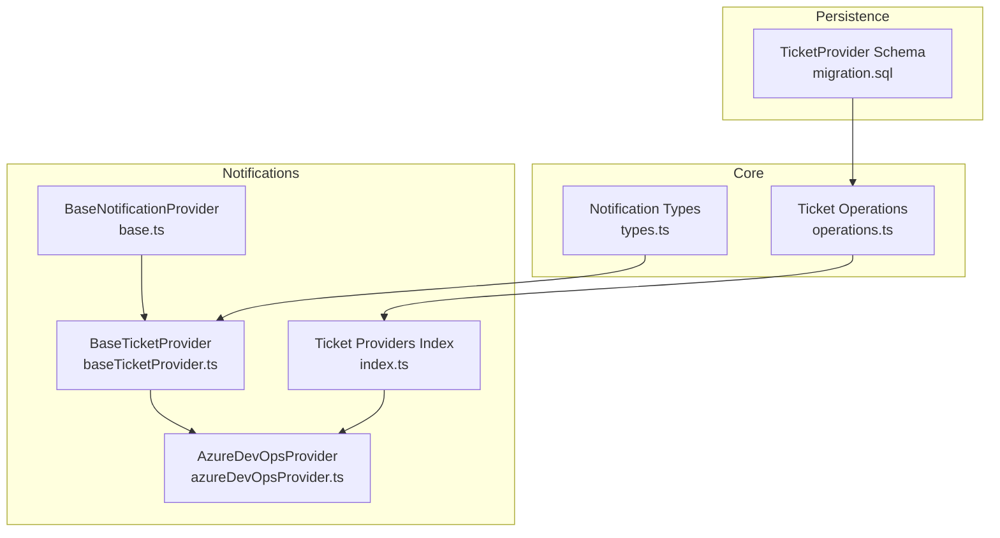
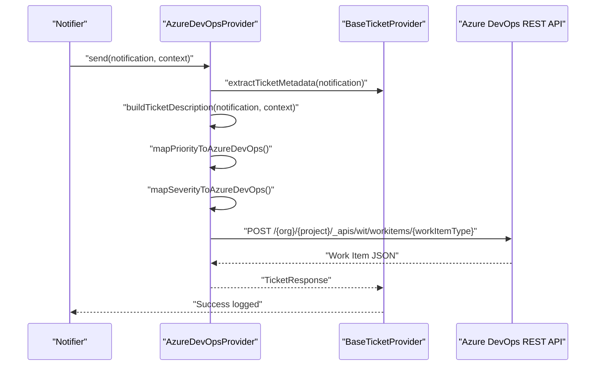
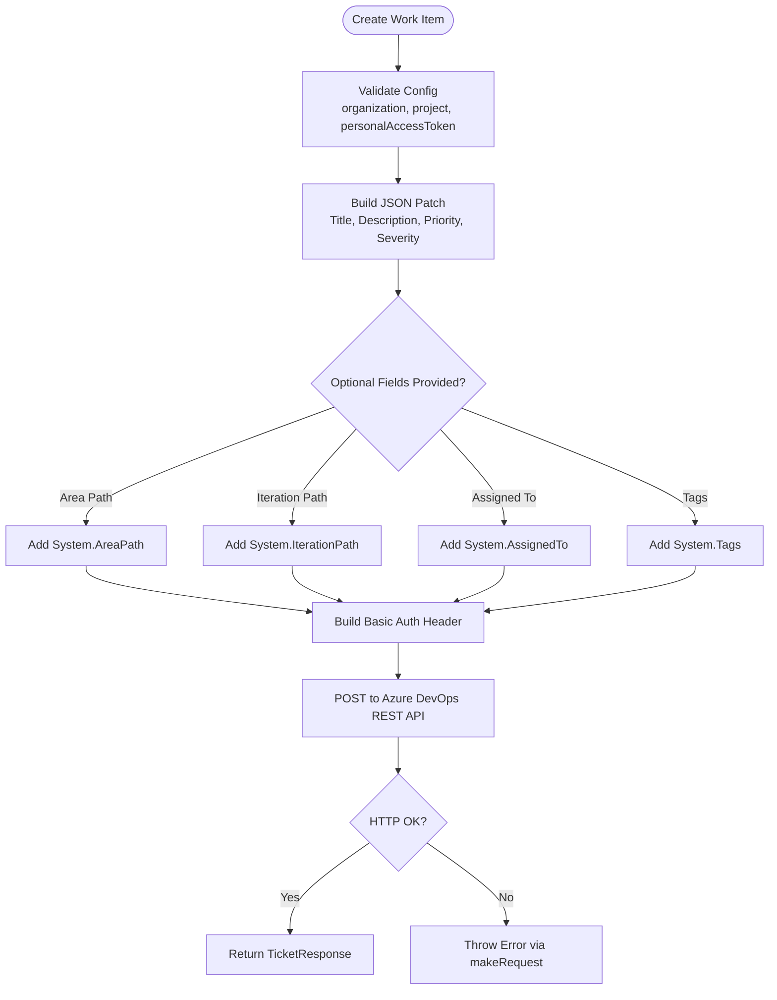
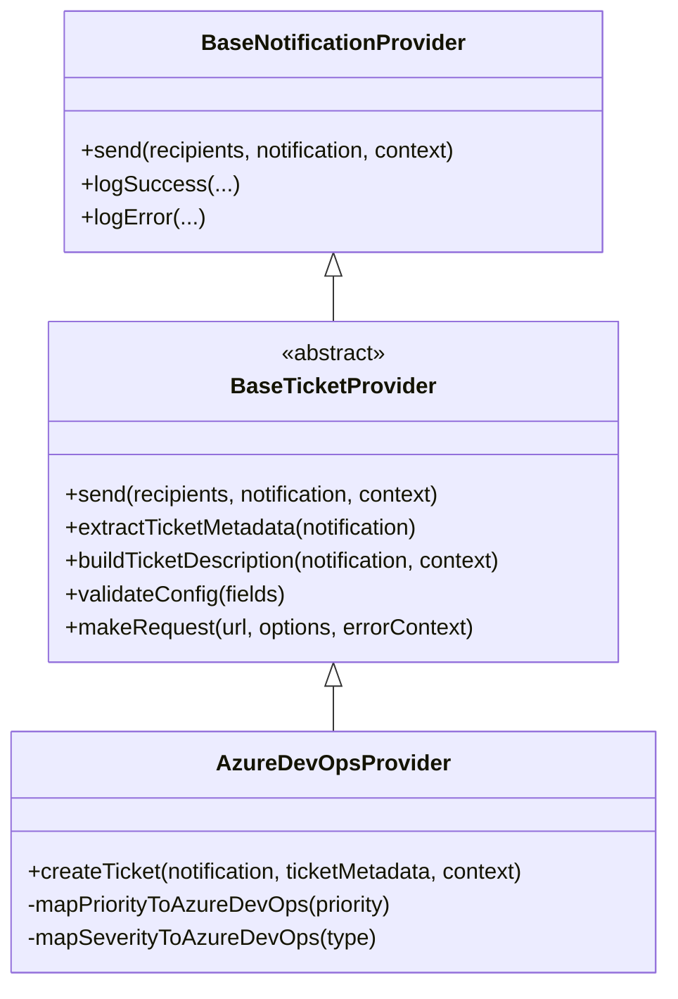

# Azure DevOps Provider

<cite>
**Referenced Files in This Document**
- [azureDevOpsProvider.ts](file://src/core/notifications/providers/tickets/azureDevOpsProvider.ts)
- [baseTicketProvider.ts](file://src/core/notifications/providers/tickets/baseTicketProvider.ts)
- [index.ts](file://src/core/notifications/providers/tickets/index.ts)
- [types.ts](file://src/core/notifications/types.ts)
- [operations.ts](file://src/core/tickets/operations.ts)
- [migration.sql](file://migrations/20251117231659_add_ticket_providers/migration.sql)
- [base.ts](file://src/core/notifications/providers/base.ts)
</cite>

## Table of Contents
1. [Introduction](#introduction)
2. [Project Structure](#project-structure)
3. [Core Components](#core-components)
4. [Architecture Overview](#architecture-overview)
5. [Detailed Component Analysis](#detailed-component-analysis)
6. [Dependency Analysis](#dependency-analysis)
7. [Performance Considerations](#performance-considerations)
8. [Troubleshooting Guide](#troubleshooting-guide)
9. [Security Best Practices](#security-best-practices)
10. [Conclusion](#conclusion)

## Introduction
This document describes the Azure DevOps ticketing provider integration in SentinelIQ. It explains how to configure the provider, how authentication works using Personal Access Tokens (PATs), which REST API endpoints are used, and how notification data is transformed into Azure DevOps work item fields. It also covers custom field mapping, tag application, error handling, and troubleshooting steps for common issues.

## Project Structure
The Azure DevOps provider is implemented as part of the notification ticket providers. The provider extends a base ticket provider class and integrates with Azure DevOps REST APIs to create work items.

**Diagram sources**
- [base.ts](file://src/core/notifications/providers/base.ts#L1-L38)
- [baseTicketProvider.ts](file://src/core/notifications/providers/tickets/baseTicketProvider.ts#L1-L202)
- [azureDevOpsProvider.ts](file://src/core/notifications/providers/tickets/azureDevOpsProvider.ts#L1-L159)
- [index.ts](file://src/core/notifications/providers/tickets/index.ts#L1-L26)
- [types.ts](file://src/core/notifications/types.ts#L1-L60)
- [operations.ts](file://src/core/tickets/operations.ts#L1-L180)
- [migration.sql](file://migrations/20251117231659_add_ticket_providers/migration.sql#L1-L21)

**Section sources**
- [index.ts](file://src/core/notifications/providers/tickets/index.ts#L1-L26)
- [base.ts](file://src/core/notifications/providers/base.ts#L1-L38)
- [baseTicketProvider.ts](file://src/core/notifications/providers/tickets/baseTicketProvider.ts#L1-L202)
- [azureDevOpsProvider.ts](file://src/core/notifications/providers/tickets/azureDevOpsProvider.ts#L1-L159)
- [types.ts](file://src/core/notifications/types.ts#L1-L60)
- [operations.ts](file://src/core/tickets/operations.ts#L1-L180)
- [migration.sql](file://migrations/20251117231659_add_ticket_providers/migration.sql#L1-L21)

## Core Components
- AzureDevOpsProvider: Implements Azure DevOps work item creation using the Azure DevOps REST API. It validates configuration, builds a JSON Patch document, sets Basic Authentication with a PAT, and posts to the work items endpoint.
- BaseTicketProvider: Provides shared functionality for extracting ticket metadata, building descriptions, logging, and making HTTP requests with error handling.
- NotificationData and TicketMetadata: Define the structure of notification data and how ticket-related metadata is passed from notifications to providers.
- Ticket Operations: Handles saving/updating/deleting ticket provider configurations and validating required fields per provider.
- TicketProvider Schema: Defines the persistence model for storing provider configurations per workspace.

**Section sources**
- [azureDevOpsProvider.ts](file://src/core/notifications/providers/tickets/azureDevOpsProvider.ts#L1-L159)
- [baseTicketProvider.ts](file://src/core/notifications/providers/tickets/baseTicketProvider.ts#L1-L202)
- [types.ts](file://src/core/notifications/types.ts#L1-L60)
- [operations.ts](file://src/core/tickets/operations.ts#L1-L180)
- [migration.sql](file://migrations/20251117231659_add_ticket_providers/migration.sql#L1-L21)

## Architecture Overview
The Azure DevOps provider participates in the notification pipeline. When a notification is processed, the system extracts ticket metadata, constructs a JSON Patch payload, and invokes the Azure DevOps REST API to create a work item.

**Diagram sources**
- [azureDevOpsProvider.ts](file://src/core/notifications/providers/tickets/azureDevOpsProvider.ts#L25-L127)
- [baseTicketProvider.ts](file://src/core/notifications/providers/tickets/baseTicketProvider.ts#L53-L118)
- [types.ts](file://src/core/notifications/types.ts#L1-L21)

## Detailed Component Analysis

### AzureDevOpsProvider
- Responsibilities:
  - Validates configuration fields: organization, project, personalAccessToken.
  - Builds a JSON Patch document for work item creation.
  - Applies area path, iteration path, assigned-to, and tags from either provider config or ticket metadata.
  - Maps priority and severity to Azure DevOps field values.
  - Uses Basic Authentication with PAT.
  - Posts to the Azure DevOps REST API and returns a standardized ticket response.

- Configuration requirements:
  - organization: Azure DevOps organization name.
  - project: Project name within the organization.
  - personalAccessToken: PAT with work item write permissions.
  - workItemType: Work item type (default: Bug; supported values include Task, Issue, User Story).
  - areaPath: Optional area path override.
  - iterationPath: Optional iteration path override.

- Authentication:
  - Uses Basic Authentication with an empty username and the PAT as the password. The Authorization header is constructed accordingly.

- REST API endpoint:
  - Endpoint: POST https://dev.azure.com/{organization}/{project}/_apis/wit/workitems/{workItemType}?api-version=7.1
  - Content-Type: application/json-patch+json
  - Accept: application/json

- Field mapping:
  - System.Title: notification.title
  - System.Description: generated by buildTicketDescription
  - Microsoft.VSTS.Common.Priority: mapped from priority
  - Microsoft.VSTS.Common.Severity: mapped from notification type
  - System.AreaPath: from customFields.areaPath or provider config areaPath
  - System.IterationPath: from customFields.iterationPath or provider config iterationPath
  - System.AssignedTo: from ticketMetadata.assignedTo
  - System.Tags: joined from ticketMetadata.tags

- Custom field mapping and tags:
  - Custom fields can be supplied via ticketMetadata.customFields and are applied to System.AreaPath and System.IterationPath when present.
  - Tags are joined with semicolon separators and set to System.Tags.

- Error handling:
  - makeRequest throws on non-OK responses with HTTP status and body text included in the error message.
  - BaseTicketProvider.send catches errors, logs them, and rethrows.

**Diagram sources**
- [azureDevOpsProvider.ts](file://src/core/notifications/providers/tickets/azureDevOpsProvider.ts#L25-L127)
- [baseTicketProvider.ts](file://src/core/notifications/providers/tickets/baseTicketProvider.ts#L173-L201)

**Section sources**
- [azureDevOpsProvider.ts](file://src/core/notifications/providers/tickets/azureDevOpsProvider.ts#L1-L159)
- [baseTicketProvider.ts](file://src/core/notifications/providers/tickets/baseTicketProvider.ts#L1-L202)

### BaseTicketProvider
- Provides:
  - extractTicketMetadata: derives priority, status, assignedTo, labels/tags, dueDate, project, category, severity, source, and customFields from notification metadata.
  - buildTicketDescription: constructs a Markdown description including workspace context, link, and additional metadata.
  - validateConfig: checks for required fields.
  - makeRequest: performs HTTP requests with robust error handling and JSON parsing when applicable.
  - Logging: logs successful creations and errors.

- Error handling:
  - Non-OK HTTP responses cause an error with status and body text.
  - Exceptions are caught and logged, then rethrown.

**Section sources**
- [baseTicketProvider.ts](file://src/core/notifications/providers/tickets/baseTicketProvider.ts#L53-L201)
- [base.ts](file://src/core/notifications/providers/base.ts#L1-L38)

### NotificationData and TicketMetadata
- NotificationData defines the shape of incoming notifications, including optional ticketMetadata.
- TicketMetadata is extracted from NotificationData and passed to the provider’s createTicket method.

**Section sources**
- [types.ts](file://src/core/notifications/types.ts#L1-L60)

### Ticket Operations and Persistence
- saveTicketProvider validates required fields per provider and persists the configuration per workspace.
- The TicketProvider entity stores provider type, enabled flag, and JSON config.

**Section sources**
- [operations.ts](file://src/core/tickets/operations.ts#L1-L180)
- [migration.sql](file://migrations/20251117231659_add_ticket_providers/migration.sql#L1-L21)

## Dependency Analysis

**Diagram sources**
- [base.ts](file://src/core/notifications/providers/base.ts#L1-L38)
- [baseTicketProvider.ts](file://src/core/notifications/providers/tickets/baseTicketProvider.ts#L1-L202)
- [azureDevOpsProvider.ts](file://src/core/notifications/providers/tickets/azureDevOpsProvider.ts#L1-L159)

**Section sources**
- [base.ts](file://src/core/notifications/providers/base.ts#L1-L38)
- [baseTicketProvider.ts](file://src/core/notifications/providers/tickets/baseTicketProvider.ts#L1-L202)
- [azureDevOpsProvider.ts](file://src/core/notifications/providers/tickets/azureDevOpsProvider.ts#L1-L159)

## Performance Considerations
- Network latency dominates work item creation time; minimize unnecessary fields to reduce payload size.
- Batch notifications when feasible to reduce overhead.
- Avoid excessive retries without backoff; rely on built-in error handling.

[No sources needed since this section provides general guidance]

## Troubleshooting Guide

### Authentication Failures
- Symptom: 401 Unauthorized or generic authentication errors.
- Causes:
  - Missing or invalid personalAccessToken.
  - PAT lacks work item write permissions.
  - Incorrect organization or project name.
- Resolution:
  - Verify PAT scope includes work item write permissions.
  - Confirm organization and project names match Azure DevOps configuration.
  - Re-save provider configuration with correct values.

**Section sources**
- [azureDevOpsProvider.ts](file://src/core/notifications/providers/tickets/azureDevOpsProvider.ts#L20-L23)
- [operations.ts](file://src/core/tickets/operations.ts#L60-L117)

### Rate Limiting (429 Responses)
- Symptom: 429 Too Many Requests.
- Causes: Azure DevOps API rate limits.
- Resolution:
  - Retry with exponential backoff.
  - Reduce request frequency.
  - Consider batching notifications.

[No sources needed since this section provides general guidance]

### Validation Errors
- Symptom: Missing required fields or invalid provider type.
- Causes:
  - Missing organization, project, personalAccessToken, or workItemType.
  - Unknown provider type.
- Resolution:
  - Ensure all required fields are present for AZURE_DEVOPS.
  - Use supported work item types.

**Section sources**
- [azureDevOpsProvider.ts](file://src/core/notifications/providers/tickets/azureDevOpsProvider.ts#L20-L23)
- [operations.ts](file://src/core/tickets/operations.ts#L156-L180)

### Permission Errors
- Symptom: 403 Forbidden when creating work items.
- Causes:
  - PAT does not have access to the target project or work item type.
  - Insufficient rights to set Area Path or Iteration Path.
- Resolution:
  - Grant PAT project-level permissions for work item creation.
  - Ensure Area Path and Iteration Path exist and are accessible.

**Section sources**
- [azureDevOpsProvider.ts](file://src/core/notifications/providers/tickets/azureDevOpsProvider.ts#L103-L118)

### Invalid Project Configurations
- Symptom: 404 Not Found or project not found.
- Causes:
  - Incorrect project name or organization.
- Resolution:
  - Verify organization and project names exactly match Azure DevOps settings.

**Section sources**
- [azureDevOpsProvider.ts](file://src/core/notifications/providers/tickets/azureDevOpsProvider.ts#L103-L104)

### Field Constraint Violations
- Symptom: 400 Bad Request due to invalid field values.
- Causes:
  - Priority or severity values outside accepted ranges.
  - Area Path or Iteration Path not found.
  - Assigned To user not found or not accessible.
- Resolution:
  - Use supported priority values (mapped internally).
  - Use supported severity mapping.
  - Ensure Area Path and Iteration Path exist and are accessible.
  - Ensure Assigned To user exists and is accessible.

**Section sources**
- [azureDevOpsProvider.ts](file://src/core/notifications/providers/tickets/azureDevOpsProvider.ts#L129-L158)
- [baseTicketProvider.ts](file://src/core/notifications/providers/tickets/baseTicketProvider.ts#L173-L201)

### Logging and Diagnostics
- Successful creation logs include provider, ticketId, ticketKey, ticketUrl, title, and type.
- Errors are logged with provider name, recipients count, title, and error message.

**Section sources**
- [baseTicketProvider.ts](file://src/core/notifications/providers/tickets/baseTicketProvider.ts#L146-L172)
- [base.ts](file://src/core/notifications/providers/base.ts#L21-L36)

## Security Best Practices
- PAT Management:
  - Use least privilege PATs scoped to work item creation only.
  - Rotate PATs regularly and revoke unused tokens.
  - Store PATs securely; avoid embedding in logs or UI.
- Compliance:
  - Follow organizational policies for secrets management.
  - Restrict access to workspace administrators who configure providers.
- Network Security:
  - Ensure outbound HTTPS connectivity to Azure DevOps endpoints.
  - Monitor for unauthorized access attempts.

[No sources needed since this section provides general guidance]

## Conclusion
The Azure DevOps provider integrates seamlessly with SentinelIQ’s notification pipeline. It transforms notification data into Azure DevOps work items using a validated configuration, PAT-based authentication, and a standardized JSON Patch payload. Proper configuration, attention to field constraints, and adherence to security best practices ensure reliable and secure work item creation.