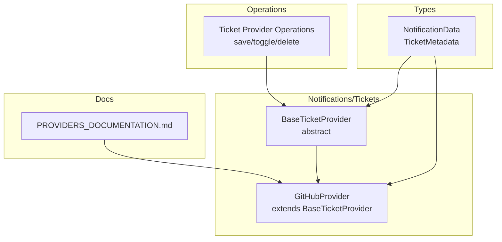
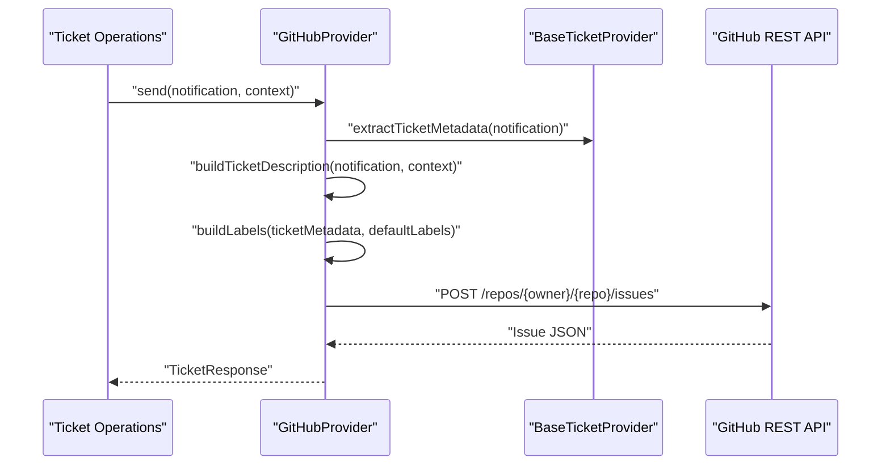
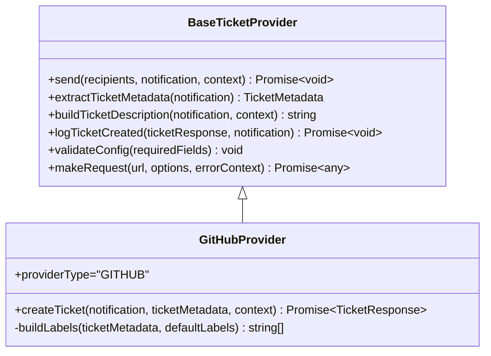
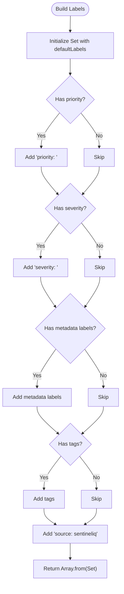
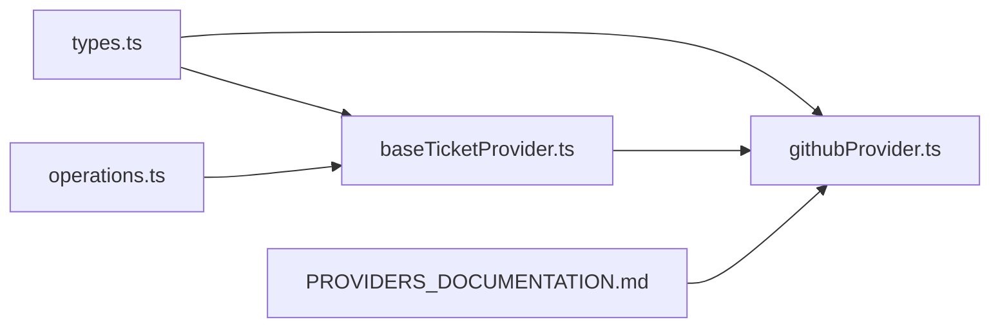

# GitHub Provider

<cite>
**Referenced Files in This Document**
- [githubProvider.ts](file://src/core/notifications/providers/tickets/githubProvider.ts)
- [baseTicketProvider.ts](file://src/core/notifications/providers/tickets/baseTicketProvider.ts)
- [types.ts](file://src/core/notifications/types.ts)
- [index.ts](file://src/core/notifications/providers/tickets/index.ts)
- [operations.ts](file://src/core/tickets/operations.ts)
- [PROVIDERS_DOCUMENTATION.md](file://src/core/notifications/PROVIDERS_DOCUMENTATION.md)
</cite>

## Table of Contents
1. [Introduction](#introduction)
2. [Project Structure](#project-structure)
3. [Core Components](#core-components)
4. [Architecture Overview](#architecture-overview)
5. [Detailed Component Analysis](#detailed-component-analysis)
6. [Dependency Analysis](#dependency-analysis)
7. [Performance Considerations](#performance-considerations)
8. [Troubleshooting Guide](#troubleshooting-guide)
9. [Conclusion](#conclusion)
10. [Appendices](#appendices)

## Introduction
This document describes the GitHub ticketing provider integration in SentinelIQ. It explains configuration requirements, authentication mechanisms, REST API endpoints used for issue creation, and how notification data is transformed into GitHub issue fields. It also covers label generation, markdown-formatted descriptions, error handling, troubleshooting, and security best practices for token management.

## Project Structure
The GitHub provider is part of the notification providers under the tickets module. It extends a base ticket provider class and implements GitHub-specific logic for creating issues.

**Diagram sources**
- [githubProvider.ts](file://src/core/notifications/providers/tickets/githubProvider.ts#L1-L104)
- [baseTicketProvider.ts](file://src/core/notifications/providers/tickets/baseTicketProvider.ts#L1-L202)
- [types.ts](file://src/core/notifications/types.ts#L1-L60)
- [operations.ts](file://src/core/tickets/operations.ts#L1-L159)
- [PROVIDERS_DOCUMENTATION.md](file://src/core/notifications/PROVIDERS_DOCUMENTATION.md#L1-L292)

**Section sources**
- [githubProvider.ts](file://src/core/notifications/providers/tickets/githubProvider.ts#L1-L104)
- [baseTicketProvider.ts](file://src/core/notifications/providers/tickets/baseTicketProvider.ts#L1-L202)
- [types.ts](file://src/core/notifications/types.ts#L1-L60)
- [operations.ts](file://src/core/tickets/operations.ts#L1-L159)
- [PROVIDERS_DOCUMENTATION.md](file://src/core/notifications/PROVIDERS_DOCUMENTATION.md#L1-L292)

## Core Components
- GitHubProvider: Implements GitHub Issues creation via REST API. Validates configuration, builds the issue payload, and returns a normalized ticket response.
- BaseTicketProvider: Shared logic for extracting ticket metadata, building descriptions, logging, and making HTTP requests.
- NotificationData and TicketMetadata: Typed interfaces describing notification and ticket metadata structures.
- Ticket Provider Operations: Backend operations to manage provider configuration and validation.

**Section sources**
- [githubProvider.ts](file://src/core/notifications/providers/tickets/githubProvider.ts#L1-L104)
- [baseTicketProvider.ts](file://src/core/notifications/providers/tickets/baseTicketProvider.ts#L1-L202)
- [types.ts](file://src/core/notifications/types.ts#L1-L60)
- [operations.ts](file://src/core/tickets/operations.ts#L1-L159)

## Architecture Overview
The GitHub provider participates in the notification system’s ticket provider pattern. It receives a notification, extracts ticket metadata, constructs a GitHub issue payload, and posts to the GitHub REST API. Responses are normalized into a standard ticket response shape.

**Diagram sources**
- [githubProvider.ts](file://src/core/notifications/providers/tickets/githubProvider.ts#L23-L104)
- [baseTicketProvider.ts](file://src/core/notifications/providers/tickets/baseTicketProvider.ts#L50-L144)

## Detailed Component Analysis

### GitHubProvider
- Responsibilities:
  - Validates configuration fields: token, owner, repo.
  - Builds the GitHub issue payload from notification and metadata.
  - Sends a POST request to the GitHub Issues REST endpoint.
  - Normalizes the response into a standard ticket response.

- Configuration requirements:
  - token: GitHub Personal Access Token scoped for repository access.
  - owner: Repository owner (username or organization).
  - repo: Repository name.
  - labels: Optional default labels array.

- Authentication:
  - Uses Bearer token in Authorization header.
  - GitHub API version header is included.

- REST API endpoint used:
  - POST https://api.github.com/repos/{owner}/{repo}/issues

- Payload construction:
  - title: notification.title
  - body: markdown-formatted description built from notification and context
  - labels: merged defaults, priority, severity, metadata labels/tags, and source label
  - assignees: optional username list
  - milestone: optional milestone field

- Response normalization:
  - ticketId: GitHub issue id
  - ticketKey: GitHub issue number prefixed with “#”
  - ticketUrl: GitHub issue html_url
  - createdAt: GitHub issue created_at
  - provider: literal “github”

**Diagram sources**
- [baseTicketProvider.ts](file://src/core/notifications/providers/tickets/baseTicketProvider.ts#L1-L202)
- [githubProvider.ts](file://src/core/notifications/providers/tickets/githubProvider.ts#L1-L104)

**Section sources**
- [githubProvider.ts](file://src/core/notifications/providers/tickets/githubProvider.ts#L1-L104)

### BaseTicketProvider
- Shared logic:
  - extractTicketMetadata: maps notification type to priority, sets default status, assigns default project/category/source, and merges labels/tags.
  - buildTicketDescription: constructs a markdown body with title, message, workspace context, link, metadata, and timestamp.
  - makeRequest: performs fetch, checks response.ok, parses JSON when content-type indicates JSON, and throws descriptive errors.
  - validateConfig: ensures required fields are present.

**Diagram sources**
- [githubProvider.ts](file://src/core/notifications/providers/tickets/githubProvider.ts#L72-L104)
- [baseTicketProvider.ts](file://src/core/notifications/providers/tickets/baseTicketProvider.ts#L73-L107)

**Section sources**
- [baseTicketProvider.ts](file://src/core/notifications/providers/tickets/baseTicketProvider.ts#L1-L202)
- [githubProvider.ts](file://src/core/notifications/providers/tickets/githubProvider.ts#L72-L104)

### NotificationData and TicketMetadata
- NotificationData: includes type, title, message, optional link, and optional metadata.
- TicketMetadata: includes priority, status, assignedTo, labels, tags, dueDate, project, category, severity, source, and customFields.

These types drive how the GitHub provider transforms incoming alert data into GitHub issue fields.

**Section sources**
- [types.ts](file://src/core/notifications/types.ts#L1-L60)

### Ticket Provider Operations
- Provider registration and validation:
  - saveTicketProvider validates required fields per provider type and upserts configuration.
  - validateTicketProviderConfig defines required fields for each provider (e.g., JIRA, ServiceNow, Azure DevOps).
- Access control:
  - Requires authentication and workspace membership/role checks for CRUD operations.

Note: GitHub provider configuration follows the same validation and access control patterns as other providers.

**Section sources**
- [operations.ts](file://src/core/tickets/operations.ts#L1-L159)

## Dependency Analysis
- GitHubProvider depends on BaseTicketProvider for shared functionality.
- BaseTicketProvider depends on NotificationData and TicketMetadata types.
- Ticket operations depend on provider registry and validation logic.

**Diagram sources**
- [types.ts](file://src/core/notifications/types.ts#L1-L60)
- [baseTicketProvider.ts](file://src/core/notifications/providers/tickets/baseTicketProvider.ts#L1-L202)
- [githubProvider.ts](file://src/core/notifications/providers/tickets/githubProvider.ts#L1-L104)
- [operations.ts](file://src/core/tickets/operations.ts#L1-L159)
- [PROVIDERS_DOCUMENTATION.md](file://src/core/notifications/PROVIDERS_DOCUMENTATION.md#L1-L292)

**Section sources**
- [index.ts](file://src/core/notifications/providers/tickets/index.ts#L1-L25)
- [types.ts](file://src/core/notifications/types.ts#L1-L60)
- [baseTicketProvider.ts](file://src/core/notifications/providers/tickets/baseTicketProvider.ts#L1-L202)
- [githubProvider.ts](file://src/core/notifications/providers/tickets/githubProvider.ts#L1-L104)
- [operations.ts](file://src/core/tickets/operations.ts#L1-L159)
- [PROVIDERS_DOCUMENTATION.md](file://src/core/notifications/PROVIDERS_DOCUMENTATION.md#L1-L292)

## Performance Considerations
- Network latency and rate limits: The provider uses a simple fetch call and does not implement retry/backoff logic. Consider adding retry with exponential backoff and jitter for transient network errors.
- Payload size: Large metadata can increase request size; keep labels and description concise.
- Concurrency: Avoid flooding the GitHub API with simultaneous requests; batch or throttle as needed.

[No sources needed since this section provides general guidance]

## Troubleshooting Guide

Common issues and resolutions:
- Insufficient permissions
  - Symptom: 403 or 401 responses when creating issues.
  - Resolution: Ensure the token has the correct scopes and the user/team has write access to the repository.
- Invalid repository configuration
  - Symptom: 404 when posting to the Issues endpoint.
  - Resolution: Verify owner and repo values match the target repository.
- Rate limit exhaustion
  - Symptom: 403 responses indicating rate limit or secondary rate limit.
  - Resolution: Reduce request frequency, implement client-side throttling, or upgrade token privileges.
- Authentication failures
  - Symptom: 401 Unauthorized.
  - Resolution: Verify token validity and expiration; regenerate token if necessary.
- Repository access issues
  - Symptom: 403 Forbidden when accessing repository.
  - Resolution: Confirm repository visibility and access permissions for the token owner.

Error handling behavior:
- makeRequest throws descriptive errors on non-OK responses and on network failures.
- BaseTicketProvider logs success and error events with contextual information.

**Section sources**
- [baseTicketProvider.ts](file://src/core/notifications/providers/tickets/baseTicketProvider.ts#L173-L201)
- [githubProvider.ts](file://src/core/notifications/providers/tickets/githubProvider.ts#L47-L69)

## Conclusion
The GitHub provider integrates seamlessly with SentinelIQ’s notification system. It transforms alert metadata into GitHub issues, applies labels and assignees, and returns a normalized ticket response. Proper configuration, secure token management, and awareness of GitHub rate limits are essential for reliable operation.

[No sources needed since this section summarizes without analyzing specific files]

## Appendices

### Configuration Requirements
- Required fields:
  - token: GitHub Personal Access Token with repository access scope.
  - owner: Repository owner (username or organization).
  - repo: Repository name.
  - labels: Optional default labels array.

- Optional fields:
  - assignees: Username(s) to assign the issue.
  - milestone: Milestone identifier or object.

**Section sources**
- [githubProvider.ts](file://src/core/notifications/providers/tickets/githubProvider.ts#L1-L21)
- [githubProvider.ts](file://src/core/notifications/providers/tickets/githubProvider.ts#L23-L69)

### Authentication Mechanism
- Personal Access Tokens (PATs) are supported. The provider uses Bearer authentication with the Authorization header and includes the GitHub API version header.

**Section sources**
- [githubProvider.ts](file://src/core/notifications/providers/tickets/githubProvider.ts#L47-L69)

### REST API Endpoints Used
- Issue creation:
  - POST https://api.github.com/repos/{owner}/{repo}/issues

**Section sources**
- [githubProvider.ts](file://src/core/notifications/providers/tickets/githubProvider.ts#L47-L69)

### Notification Data Transformation to GitHub Fields
- Title: notification.title
- Body: Markdown-formatted description built from notification.title, notification.message, optional link, workspace context, and metadata.
- Labels: defaults + priority + severity + metadata labels + tags + source label.
- Assignees: optional username list.
- Milestone: optional custom field.

**Section sources**
- [githubProvider.ts](file://src/core/notifications/providers/tickets/githubProvider.ts#L23-L69)
- [baseTicketProvider.ts](file://src/core/notifications/providers/tickets/baseTicketProvider.ts#L112-L144)
- [baseTicketProvider.ts](file://src/core/notifications/providers/tickets/baseTicketProvider.ts#L73-L107)

### Example: Alert Metadata to Labels and Description
- Labels:
  - Defaults from provider config
  - Priority label derived from notification type mapping
  - Severity label from notification type
  - Metadata labels and tags
  - Source label “source: sentineliq”
- Description:
  - Title and message
  - Optional workspace name and link
  - Additional metadata entries
  - Timestamp footer

**Section sources**
- [githubProvider.ts](file://src/core/notifications/providers/tickets/githubProvider.ts#L72-L104)
- [baseTicketProvider.ts](file://src/core/notifications/providers/tickets/baseTicketProvider.ts#L112-L144)
- [baseTicketProvider.ts](file://src/core/notifications/providers/tickets/baseTicketProvider.ts#L73-L107)

### Error Handling
- Non-OK HTTP responses: makeRequest throws an error with HTTP status and body text.
- Network errors: makeRequest wraps underlying error with context.
- Logging: success and error events are logged with provider name, recipients, title, and error details.

**Section sources**
- [baseTicketProvider.ts](file://src/core/notifications/providers/tickets/baseTicketProvider.ts#L173-L201)

### Security Best Practices for Token Management
- Scope minimization: Use least-privilege tokens for repository access.
- Rotation: Regularly rotate tokens and revoke compromised ones.
- Secrets management: Store tokens in environment variables or secret managers.
- Auditing: Monitor token usage and access logs.
- Compliance: Follow GitHub’s security guidelines for token lifecycle and access control.

[No sources needed since this section provides general guidance]