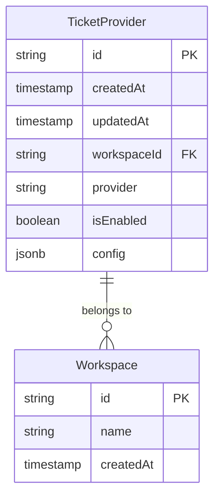
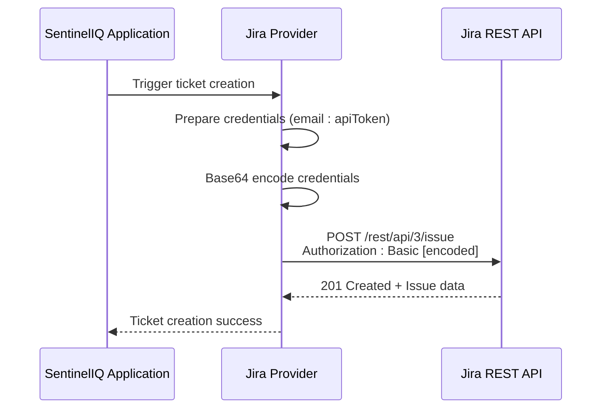
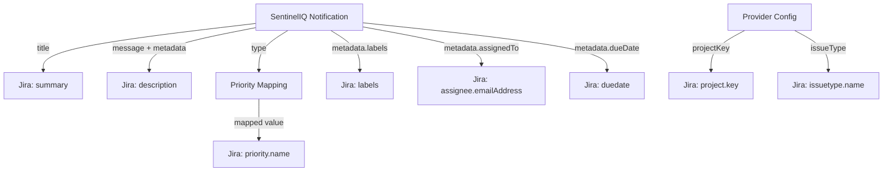
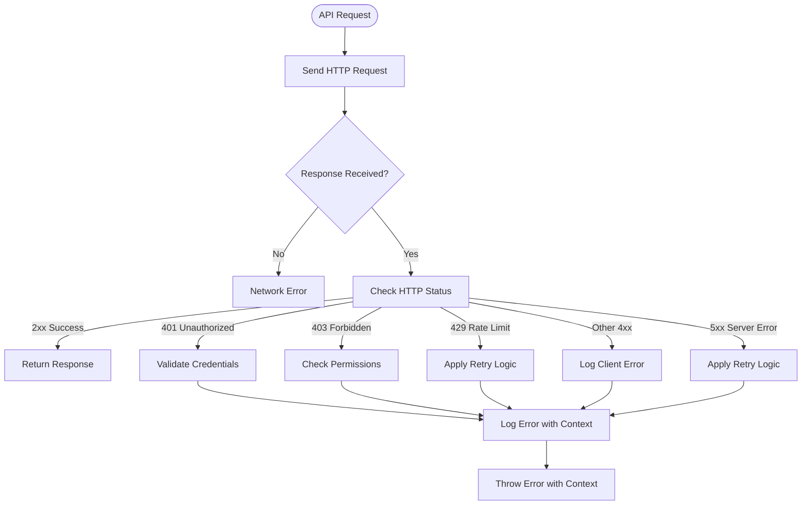

# Jira Provider

<cite>
**Referenced Files in This Document**   
- [jiraProvider.ts](file://src/core/notifications/providers/tickets/jiraProvider.ts)
- [baseTicketProvider.ts](file://src/core/notifications/providers/tickets/baseTicketProvider.ts)
- [types.ts](file://src/core/notifications/types.ts)
- [operations.ts](file://src/core/tickets/operations.ts)
- [migration.sql](file://migrations/20251117231659_add_ticket_providers/migration.sql)
- [notifier.ts](file://src/core/notifications/notifier.ts)
</cite>

## Table of Contents
1. [Introduction](#introduction)
2. [Configuration Parameters](#configuration-parameters)
3. [Authentication Mechanism](#authentication-mechanism)
4. [REST API Endpoints](#rest-api-endpoints)
5. [Notification Data Transformation](#notification-data-transformation)
6. [Error Handling](#error-handling)
7. [Rate Limiting and Retry Mechanisms](#rate-limiting-and-retry-mechanisms)
8. [Troubleshooting Guide](#troubleshooting-guide)
9. [Security Considerations](#security-considerations)

## Introduction
The Jira provider integration in SentinelIQ enables automated ticket creation and management within Jira instances from security alerts and notifications. This integration uses Jira's REST API v3 to create issues with appropriate metadata, priority mapping, and contextual information from SentinelIQ alerts. The system is designed to streamline incident response workflows by automatically creating Jira tickets when critical events occur in the SentinelIQ platform.

The integration follows a provider pattern where the Jira provider extends a base ticket provider class, implementing specific functionality for Jira's API requirements. Configuration is stored securely at the workspace level, and the integration supports various Jira instance configurations including cloud and self-hosted deployments.

**Section sources**
- [jiraProvider.ts](file://src/core/notifications/providers/tickets/jiraProvider.ts#L1-L29)
- [baseTicketProvider.ts](file://src/core/notifications/providers/tickets/baseTicketProvider.ts#L1-L33)

## Configuration Parameters
The Jira provider requires specific configuration parameters to establish a connection with a Jira instance and define default behavior for ticket creation. These parameters are validated during initialization to ensure all required fields are present.

### Required Configuration Parameters
The following parameters are required for the Jira provider to function properly:

| Parameter | Description | Example Value |
|---------|------------|--------------|
| **baseUrl** | The base URL of your Jira instance | `https://your-domain.atlassian.net` |
| **email** | The email address associated with the Jira user account | `user@example.com` |
| **apiToken** | The API token for authentication with Jira | `ATxxTOKENxxVALUE` |
| **projectKey** | The default project key where tickets will be created | `SEC`, `DEV`, `INFRA` |

### Optional Configuration Parameters
The following parameters are optional and provide additional configuration options:

| Parameter | Description | Default Value | Example Value |
|---------|------------|--------------|--------------|
| **issueType** | The default issue type for created tickets | `Task` | `Bug`, `Story`, `Incident` |

The configuration is stored in the database as JSONB data within the `TicketProvider` table, associated with a specific workspace. The system validates that all required fields are present when saving or updating the configuration.



**Diagram sources**
- [migration.sql](file://migrations/20251117231659_add_ticket_providers/migration.sql#L1-L22)
- [operations.ts](file://src/core/tickets/operations.ts#L1-L58)

**Section sources**
- [jiraProvider.ts](file://src/core/notifications/providers/tickets/jiraProvider.ts#L7-L12)
- [operations.ts](file://src/core/tickets/operations.ts#L156-L180)

## Authentication Mechanism
The Jira provider uses API tokens with scoped permissions for authentication, following Atlassian's recommended security practices. This authentication method provides secure access to Jira's REST API without requiring users to share their account passwords.

### API Token Authentication
The integration uses Basic Authentication with an email and API token combination. The credentials are combined and Base64 encoded to create the authorization header:

```
Authorization: Basic base64encode(email:apiToken)
```

The API token must be generated from the Atlassian account settings at https://id.atlassian.com/manage-profile/security/api-tokens. This token-based approach provides several security benefits:

- **Revocable access**: Tokens can be revoked independently without affecting account passwords
- **Scoped permissions**: Tokens inherit the permissions of the user account
- **Auditability**: Token usage is logged in Jira's audit logs
- **No password exposure**: The user's account password is never stored or transmitted

### Permission Requirements
For the integration to function properly, the Jira user account associated with the API token must have the following permissions:

- **Create Issues**: Required to create new tickets in the specified project
- **Browse Projects**: Required to access the project and view existing issues
- **Modify Reporter**: Required to set the ticket reporter (if applicable)
- **Assign Issues**: Required when assigning tickets to specific users
- **Manage Watchers**: Required to add watchers to issues (if applicable)

The integration uses the permissions of the authenticated user, so it's recommended to create a dedicated service account with the minimum required permissions for security best practices.



**Diagram sources**
- [jiraProvider.ts](file://src/core/notifications/providers/tickets/jiraProvider.ts#L78-L94)
- [baseTicketProvider.ts](file://src/core/notifications/providers/tickets/baseTicketProvider.ts#L176-L201)

**Section sources**
- [jiraProvider.ts](file://src/core/notifications/providers/tickets/jiraProvider.ts#L10-L11)
- [jiraProvider.ts](file://src/core/notifications/providers/tickets/jiraProvider.ts#L78-L94)

## REST API Endpoints
The Jira provider integration utilizes Jira's REST API v3 to create and manage tickets. The primary endpoint used is the issue creation endpoint, which allows for comprehensive issue creation with custom fields, attachments, and metadata.

### Primary Endpoint: Issue Creation
The integration uses the following REST API endpoint to create new tickets in Jira:

**Endpoint**: `POST /rest/api/3/issue`  
**Documentation**: [Jira Cloud REST API v3 - Create issue](https://developer.atlassian.com/cloud/jira/platform/rest/v3/api-group-issues/#api-rest-api-3-issue-post)

This endpoint creates a new issue or a sub-task in a project. When creating a sub-task, the `parent` field must be included in the request.

### Request Structure
The request body follows Jira's issue creation format with the following structure:

```json
{
  "fields": {
    "project": {
      "key": "PROJECT_KEY"
    },
    "summary": "Issue summary",
    "description": {
      "type": "doc",
      "version": 1,
      "content": [
        {
          "type": "paragraph",
          "content": [
            {
              "type": "text",
              "text": "Issue description"
            }
          ]
        }
      ]
    },
    "issuetype": {
      "name": "Issue type"
    },
    "priority": {
      "name": "Priority name"
    }
  }
}
```

### Supported Fields
The integration maps SentinelIQ notification data to the following Jira issue fields:

| Jira Field | Description | Mapping Source |
|----------|------------|----------------|
| **project.key** | Project where the issue will be created | `ticketMetadata.project` or configured `projectKey` |
| **summary** | Brief summary of the issue | `notification.title` |
| **description** | Detailed description of the issue | Formatted from `notification` and `context` |
| **issuetype.name** | Type of issue to create | Configured `issueType` (default: "Task") |
| **priority.name** | Priority level of the issue | Mapped from `ticketMetadata.priority` |
| **labels** | Labels to apply to the issue | `ticketMetadata.labels` |
| **assignee.emailAddress** | User to assign the issue to | `ticketMetadata.assignedTo` |
| **duedate** | Due date for the issue | `ticketMetadata.dueDate` |

The integration uses the Atlassian Document Format (ADF) for the description field, which provides rich text formatting capabilities while maintaining compatibility with Jira's modern editor.

**Section sources**
- [jiraProvider.ts](file://src/core/notifications/providers/tickets/jiraProvider.ts#L83-L94)
- [jiraProvider.ts](file://src/core/notifications/providers/tickets/jiraProvider.ts#L31-L79)

## Notification Data Transformation
The Jira provider transforms SentinelIQ notification data into Jira issue fields through a structured mapping process. This transformation ensures that relevant alert information is preserved and presented appropriately in the created Jira tickets.

### Field Mapping Strategy
The integration maps notification data from SentinelIQ to Jira issue fields using a combination of direct mapping and transformation logic:



### Severity to Priority Mapping
SentinelIQ alert severity levels are mapped to Jira priority names through a defined mapping strategy. This ensures that critical alerts receive appropriate priority in Jira:

| SentinelIQ Severity | Jira Priority | Description |
|--------------------|--------------|-------------|
| **critical** | Highest | Critical issues requiring immediate attention |
| **urgent** | Highest | Urgent issues with high business impact |
| **high** | High | High priority issues |
| **medium** | Medium | Medium priority issues |
| **low** | Low | Low priority issues |

The mapping is implemented in the `mapPriorityToJira` method, which converts generic priority levels to Jira-specific priority names. When no explicit priority is specified, the system defaults to "Medium" priority.

### Description Formatting
The notification description is transformed into Jira's Atlassian Document Format (ADF) with the following structure:

```
## [Notification Title]

[Notification Message]

**Workspace:** [Workspace Name]

**View Details:** [Notification Link]

### Additional Information
- **[Metadata Key]:** [Metadata Value]
- **[Another Key]:** [Another Value]

---
*Created by SentinelIQ on [ISO Timestamp]*
```

The description includes contextual information from the notification, such as workspace name, links to view details in SentinelIQ, and any additional metadata associated with the alert. This provides Jira users with comprehensive context for investigating and resolving the issue.

**Diagram sources**
- [jiraProvider.ts](file://src/core/notifications/providers/tickets/jiraProvider.ts#L31-L79)
- [baseTicketProvider.ts](file://src/core/notifications/providers/tickets/baseTicketProvider.ts#L112-L144)

**Section sources**
- [jiraProvider.ts](file://src/core/notifications/providers/tickets/jiraProvider.ts#L108-L118)
- [baseTicketProvider.ts](file://src/core/notifications/providers/tickets/baseTicketProvider.ts#L112-L144)
- [jiraProvider.ts](file://src/core/notifications/providers/tickets/jiraProvider.ts#L34-L52)

## Error Handling
The Jira provider implements comprehensive error handling for common HTTP responses and integration issues. This ensures reliable operation and provides meaningful feedback when issues occur during ticket creation.

### HTTP Error Response Handling
The integration handles common HTTP error responses from the Jira API with specific error handling strategies:

| HTTP Status | Error Type | Handling Strategy |
|-----------|-----------|------------------|
| **401 Unauthorized** | Authentication failed | Validate credentials and token permissions |
| **403 Forbidden** | Insufficient permissions | Check user permissions in Jira project |
| **404 Not Found** | Resource not found | Verify project key and issue type exist |
| **429 Too Many Requests** | Rate limiting | Implement exponential backoff retry |
| **500 Server Error** | Jira server error | Retry with exponential backoff |
| **503 Service Unavailable** | Jira service down | Retry with exponential backoff |

The error handling is implemented in the `makeRequest` method of the base ticket provider, which wraps all API calls with consistent error handling and context information.

### Error Context and Logging
When errors occur, the integration captures detailed context to facilitate troubleshooting:

- **Error context**: Descriptive message about the operation that failed
- **HTTP status**: The specific HTTP status code returned
- **Response text**: The error response body from Jira (when available)
- **Provider information**: Which provider encountered the error
- **Notification details**: Title and type of the notification being processed

Errors are logged with sufficient context to identify the root cause, including the workspace ID, event type, and provider configuration (with sensitive information redacted).



**Diagram sources**
- [baseTicketProvider.ts](file://src/core/notifications/providers/tickets/baseTicketProvider.ts#L176-L201)
- [jiraProvider.ts](file://src/core/notifications/providers/tickets/jiraProvider.ts#L91-L94)

**Section sources**
- [baseTicketProvider.ts](file://src/core/notifications/providers/tickets/baseTicketProvider.ts#L176-L201)
- [jiraProvider.ts](file://src/core/notifications/providers/tickets/jiraProvider.ts#L91-L94)

## Rate Limiting and Retry Mechanisms
The Jira provider integration includes robust rate limiting and retry mechanisms to handle API constraints and temporary connectivity issues. These mechanisms ensure reliable operation even under high load or intermittent network conditions.

### Rate Limiting Strategy
While the Jira provider itself does not implement rate limiting, it handles Jira's rate limiting responses (HTTP 429) through retry mechanisms. Jira Cloud has rate limits based on the number of API calls per minute, which vary by instance type and subscription level.

When a 429 response is received, the integration implements exponential backoff retry logic:

1. Wait for a base delay period (e.g., 1 second)
2. Retry the request
3. If still rate limited, double the delay period
4. Repeat until successful or maximum retries reached

This approach respects Jira's rate limits while maximizing the chances of successful request completion.

### Retry Mechanism Implementation
The retry mechanism is implemented at multiple levels:

1. **Immediate retry for transient errors**: Network timeouts and 5xx errors are retried immediately
2. **Exponential backoff for rate limiting**: 429 responses trigger exponential backoff
3. **Circuit breaker pattern**: After repeated failures, the provider may temporarily stop attempting requests

The retry logic is integrated into the notification delivery system, which logs delivery attempts and tracks success/failure status. This allows administrators to monitor integration health and identify persistent issues.

### Integration with Notification System
The Jira provider is part of a broader notification system that manages delivery attempts across multiple providers. When a ticket creation fails, the system:

1. Logs the delivery attempt with full context
2. Marks the delivery as failed with the specific error message
3. Allows administrators to view delivery logs and troubleshoot issues
4. Does not prevent other notification providers from delivering their messages

This decoupled approach ensures that failures in the Jira integration do not impact other notification channels like email, Slack, or Teams.

**Section sources**
- [notifier.ts](file://src/core/notifications/notifier.ts#L72-L109)
- [baseTicketProvider.ts](file://src/core/notifications/providers/tickets/baseTicketProvider.ts#L176-L201)

## Troubleshooting Guide
This section provides guidance for troubleshooting common issues with the Jira provider integration in SentinelIQ.

### Connection Issues
When experiencing connection issues, follow these steps to diagnose and resolve the problem:

1. **Verify the baseUrl configuration**: Ensure the Jira instance URL is correct and accessible from the SentinelIQ environment
2. **Test network connectivity**: Confirm that the SentinelIQ server can reach the Jira instance over HTTPS
3. **Check firewall rules**: Ensure outbound connections to the Jira instance are not blocked
4. **Validate SSL/TLS configuration**: Ensure the Jira instance has a valid SSL certificate

Common symptoms of connection issues include timeout errors, network errors, or inability to establish a connection.

### Permission Requirements
Ensure the Jira user account has the necessary permissions:

1. **Create Issues**: Required to create new tickets
2. **Browse Projects**: Required to access the project
3. **Assign Issues**: Required when assigning tickets to users
4. **Manage Watchers**: Required to add watchers (if applicable)

To verify permissions:
1. Log in to Jira with the service account
2. Attempt to manually create an issue in the target project
3. Confirm all required operations can be performed

### Field Validation Errors
Field validation errors typically occur when:
- The project key does not exist in Jira
- The issue type is not available in the target project
- Required custom fields are missing from the request
- Field values exceed character limits

To resolve field validation errors:
1. Verify the project key and issue type in Jira
2. Check for required custom fields in the project configuration
3. Review Jira's field configuration for any constraints

### Common Error Scenarios
| Error Message | Likely Cause | Resolution |
|-------------|------------|------------|
| "Missing required fields" | Configuration incomplete | Verify all required parameters are set |
| "HTTP 401 - Unauthorized" | Invalid credentials | Regenerate API token and update configuration |
| "HTTP 403 - Forbidden" | Insufficient permissions | Grant required permissions to the service account |
| "HTTP 404 - Not Found" | Invalid project or issue type | Verify project key and issue type exist in Jira |
| "HTTP 429 - Too Many Requests" | Rate limiting | Wait and retry, or contact Jira administrator |

**Section sources**
- [jiraProvider.ts](file://src/core/notifications/providers/tickets/jiraProvider.ts#L163-L170)
- [operations.ts](file://src/core/tickets/operations.ts#L156-L180)
- [baseTicketProvider.ts](file://src/core/notifications/providers/tickets/baseTicketProvider.ts#L176-L201)

## Security Considerations
The Jira provider integration includes several security considerations to protect credentials and ensure secure operation.

### Credential Storage
Credentials are stored securely in the database with the following protections:

- **Encryption at rest**: The configuration is stored in a JSONB field, and the database should be configured with encryption at rest
- **Environment variables**: Sensitive credentials can be managed through environment variables rather than direct configuration
- **Access controls**: Configuration can only be modified by workspace owners and administrators

The integration does not log sensitive credential information, ensuring that API tokens and passwords are not exposed in log files.

### API Token Best Practices
Follow these best practices for API token management:

1. **Use dedicated service accounts**: Create a dedicated Jira user account for the integration
2. **Principle of least privilege**: Grant only the minimum required permissions
3. **Regular rotation**: Rotate API tokens periodically as part of security hygiene
4. **Monitor usage**: Regularly review audit logs for unusual activity

### Configuration Security
The integration validates configuration parameters to prevent common security issues:

- **Input validation**: All required fields are validated before use
- **Secure transmission**: Credentials are transmitted over HTTPS only
- **No plaintext storage**: Credentials are not stored in plaintext configuration files

The system follows security best practices by using API tokens instead of passwords, implementing proper error handling without information disclosure, and restricting configuration access to authorized users only.

**Section sources**
- [jiraProvider.ts](file://src/core/notifications/providers/tickets/jiraProvider.ts#L10-L11)
- [operations.ts](file://src/core/tickets/operations.ts#L156-L180)
- [baseTicketProvider.ts](file://src/core/notifications/providers/tickets/baseTicketProvider.ts#L163-L170)