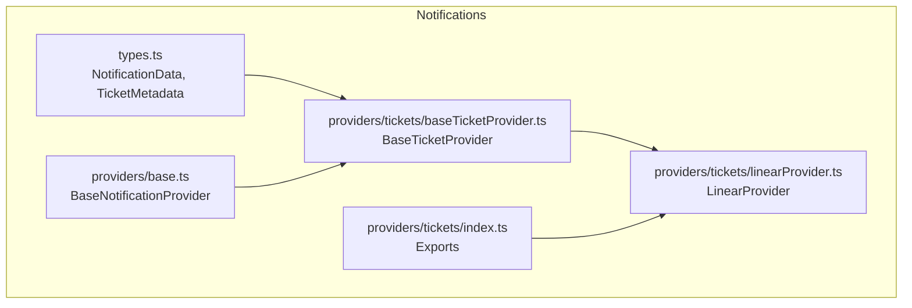
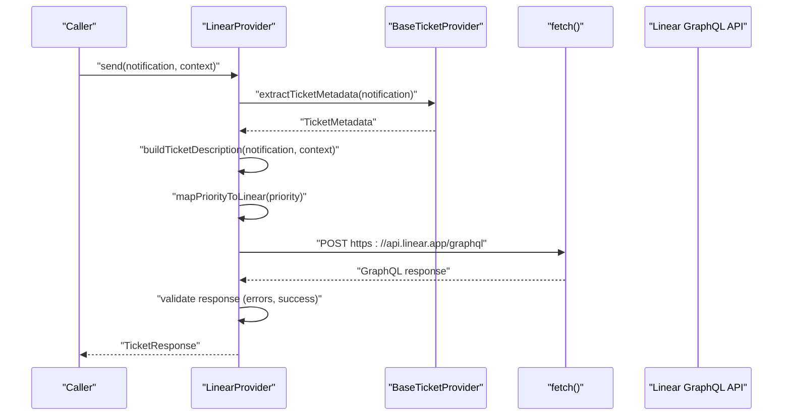
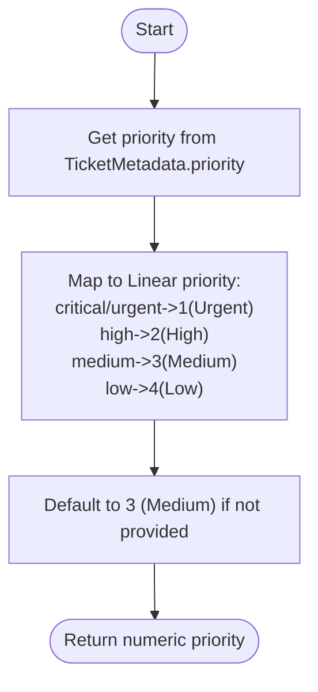
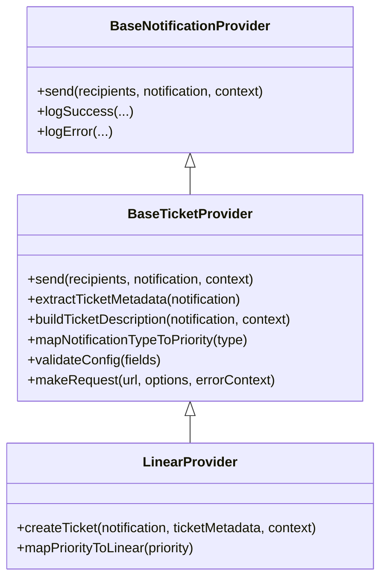

# Linear Provider

<cite>
**Referenced Files in This Document**
- [linearProvider.ts](file://src/core/notifications/providers/tickets/linearProvider.ts)
- [baseTicketProvider.ts](file://src/core/notifications/providers/tickets/baseTicketProvider.ts)
- [base.ts](file://src/core/notifications/providers/base.ts)
- [types.ts](file://src/core/notifications/types.ts)
- [index.ts](file://src/core/notifications/providers/tickets/index.ts)
- [PROVIDERS_DOCUMENTATION.md](file://src/core/notifications/PROVIDERS_DOCUMENTATION.md)
</cite>

## Table of Contents
1. [Introduction](#introduction)
2. [Project Structure](#project-structure)
3. [Core Components](#core-components)
4. [Architecture Overview](#architecture-overview)
5. [Detailed Component Analysis](#detailed-component-analysis)
6. [Dependency Analysis](#dependency-analysis)
7. [Performance Considerations](#performance-considerations)
8. [Troubleshooting Guide](#troubleshooting-guide)
9. [Security Considerations](#security-considerations)
10. [Conclusion](#conclusion)

## Introduction
This document describes the Linear ticketing provider integration in SentinelIQ. It covers configuration parameters, authentication, GraphQL API usage, field mapping from notification data to Linear issue fields, priority translation, error handling, troubleshooting, and security considerations.

## Project Structure
The Linear provider is part of the notification system’s ticket provider module. It extends the base ticket provider and implements Linear-specific logic for creating issues via the Linear GraphQL API.

**Diagram sources**
- [types.ts](file://src/core/notifications/types.ts#L1-L60)
- [base.ts](file://src/core/notifications/providers/base.ts#L1-L38)
- [baseTicketProvider.ts](file://src/core/notifications/providers/tickets/baseTicketProvider.ts#L1-L202)
- [linearProvider.ts](file://src/core/notifications/providers/tickets/linearProvider.ts#L1-L129)
- [index.ts](file://src/core/notifications/providers/tickets/index.ts#L1-L26)

**Section sources**
- [index.ts](file://src/core/notifications/providers/tickets/index.ts#L1-L26)
- [linearProvider.ts](file://src/core/notifications/providers/tickets/linearProvider.ts#L1-L129)
- [baseTicketProvider.ts](file://src/core/notifications/providers/tickets/baseTicketProvider.ts#L1-L202)
- [types.ts](file://src/core/notifications/types.ts#L1-L60)

## Core Components
- LinearProvider: Implements Linear GraphQL integration to create issues.
- BaseTicketProvider: Shared logic for extracting ticket metadata, building descriptions, and common HTTP request handling.
- BaseNotificationProvider: Shared logging and error handling for all providers.
- NotificationData and TicketMetadata: Typed interfaces for notification and ticket creation metadata.

Key responsibilities:
- Validate configuration (apiKey, teamId).
- Build GraphQL mutation variables from notification and metadata.
- Map priority to Linear’s numeric priority scale.
- Handle GraphQL errors and success responses.
- Log successful and failed outcomes.

**Section sources**
- [linearProvider.ts](file://src/core/notifications/providers/tickets/linearProvider.ts#L1-L129)
- [baseTicketProvider.ts](file://src/core/notifications/providers/tickets/baseTicketProvider.ts#L1-L202)
- [base.ts](file://src/core/notifications/providers/base.ts#L1-L38)
- [types.ts](file://src/core/notifications/types.ts#L1-L60)

## Architecture Overview
LinearProvider participates in the notification system’s provider registry and follows a consistent pattern for sending notifications and creating tickets.

**Diagram sources**
- [linearProvider.ts](file://src/core/notifications/providers/tickets/linearProvider.ts#L23-L129)
- [baseTicketProvider.ts](file://src/core/notifications/providers/tickets/baseTicketProvider.ts#L53-L144)

## Detailed Component Analysis

### LinearProvider
- Extends BaseTicketProvider and sets providerType to LINEAR.
- Validates configuration for apiKey and teamId.
- Builds a GraphQL mutation to create an issue with fields:
  - teamId
  - title
  - description
  - priority
  - projectId (optional)
  - stateId (optional)
  - assigneeId (optional)
  - labelIds (optional)
- Sends request to Linear GraphQL endpoint with Authorization header set to the API key.
- Parses response and throws explicit errors for GraphQL errors or unsuccessful creation.
- Returns a normalized TicketResponse with ticketId, ticketKey, ticketUrl, createdAt, and provider.

Priority mapping:
- critical and urgent -> Urgent (1)
- high -> High (2)
- medium -> Medium (3)
- low -> Low (4)

**Section sources**
- [linearProvider.ts](file://src/core/notifications/providers/tickets/linearProvider.ts#L1-L129)

### BaseTicketProvider
- Defines TicketMetadata and TicketResponse interfaces.
- Provides:
  - extractTicketMetadata: builds metadata from notification and config defaults.
  - buildTicketDescription: constructs Markdown-formatted description with workspace, link, and metadata.
  - mapNotificationTypeToPriority: maps notification types to priority levels.
  - validateConfig: checks required fields.
  - makeRequest: HTTP request wrapper with error handling.
  - Logging helpers for success and error.

**Section sources**
- [baseTicketProvider.ts](file://src/core/notifications/providers/tickets/baseTicketProvider.ts#L1-L202)

### BaseNotificationProvider
- Shared logging and error handling for all providers.
- Ensures consistent error logging and propagation.

**Section sources**
- [base.ts](file://src/core/notifications/providers/base.ts#L1-L38)

### NotificationData and TicketMetadata
- NotificationData: includes type, title, message, link, metadata, and optional ticketMetadata.
- TicketMetadata: includes priority, status, assignedTo, labels/tags, dueDate, project, category, severity, source, and customFields.

**Section sources**
- [types.ts](file://src/core/notifications/types.ts#L1-L60)

### Priority Mapping Flow

**Diagram sources**
- [linearProvider.ts](file://src/core/notifications/providers/tickets/linearProvider.ts#L113-L128)

## Dependency Analysis
- LinearProvider depends on:
  - BaseTicketProvider for shared logic.
  - BaseNotificationProvider for logging and error handling.
  - NotificationData and TicketMetadata types for input/output contracts.
- Provider registration:
  - The tickets module exports LinearProvider alongside others.
  - The provider registry maps provider types to their constructors.

**Diagram sources**
- [base.ts](file://src/core/notifications/providers/base.ts#L1-L38)
- [baseTicketProvider.ts](file://src/core/notifications/providers/tickets/baseTicketProvider.ts#L1-L202)
- [linearProvider.ts](file://src/core/notifications/providers/tickets/linearProvider.ts#L1-L129)

**Section sources**
- [index.ts](file://src/core/notifications/providers/tickets/index.ts#L1-L26)
- [linearProvider.ts](file://src/core/notifications/providers/tickets/linearProvider.ts#L1-L129)
- [baseTicketProvider.ts](file://src/core/notifications/providers/tickets/baseTicketProvider.ts#L1-L202)
- [base.ts](file://src/core/notifications/providers/base.ts#L1-L38)

## Performance Considerations
- Network latency: Linear GraphQL requests occur synchronously during notification processing. Consider batching or asynchronous queuing if high throughput is required.
- Rate limiting: The Linear provider does not implement internal rate limiting. If encountering rate limits from Linear, implement upstream throttling or retries with backoff.
- Payload size: Description building appends metadata and context; keep metadata concise to reduce payload size.

[No sources needed since this section provides general guidance]

## Troubleshooting Guide

Common issues and resolutions:
- Authentication failures
  - Symptoms: HTTP 401 or GraphQL errors indicating invalid credentials.
  - Resolution: Verify apiKey is correct and has appropriate permissions in Linear. Reconfigure provider settings.
- Invalid team or project configuration
  - Symptoms: GraphQL errors indicating invalid team or project IDs.
  - Resolution: Confirm teamId and projectId exist in Linear. Ensure the API key has access to the specified team and project.
- Missing required fields
  - Symptoms: Validation errors indicating missing apiKey or teamId.
  - Resolution: Ensure configuration includes apiKey and teamId. The provider validates these fields.
- GraphQL errors
  - Symptoms: Errors returned in the GraphQL response.
  - Resolution: Inspect the error details and adjust input fields accordingly.
- Unsuccessful creation
  - Symptoms: Response indicates success=false.
  - Resolution: Review input variables and Linear API behavior. Validate that required fields are present.

Operational tips:
- Check logs for detailed error messages emitted by the provider.
- Validate that notification metadata contains expected fields (title, message, and optional ticketMetadata).
- Confirm that the Linear API endpoint is reachable from the runtime environment.

**Section sources**
- [linearProvider.ts](file://src/core/notifications/providers/tickets/linearProvider.ts#L23-L129)
- [baseTicketProvider.ts](file://src/core/notifications/providers/tickets/baseTicketProvider.ts#L160-L201)
- [PROVIDERS_DOCUMENTATION.md](file://src/core/notifications/PROVIDERS_DOCUMENTATION.md#L258-L275)

## Security Considerations
- API key storage
  - Store apiKey securely in environment variables or secrets management. Do not hardcode in source files.
  - Restrict access to environments containing sensitive configuration.
- Least privilege
  - Use an API key scoped to minimal required permissions in Linear (only issue creation in target team/project).
- Access control
  - Ensure only authorized administrators can modify provider configuration.
- Transport security
  - Use HTTPS for all API communications (endpoint is HTTPS).
- Audit and logging
  - Review logs for provider activity and errors. Avoid logging sensitive data.

[No sources needed since this section provides general guidance]

## Conclusion
The Linear provider integrates seamlessly with SentinelIQ’s notification system. It validates configuration, maps notification data to Linear issue fields, translates priorities, and handles errors consistently. By following the configuration and troubleshooting guidance here, you can reliably synchronize alerts into Linear issues.