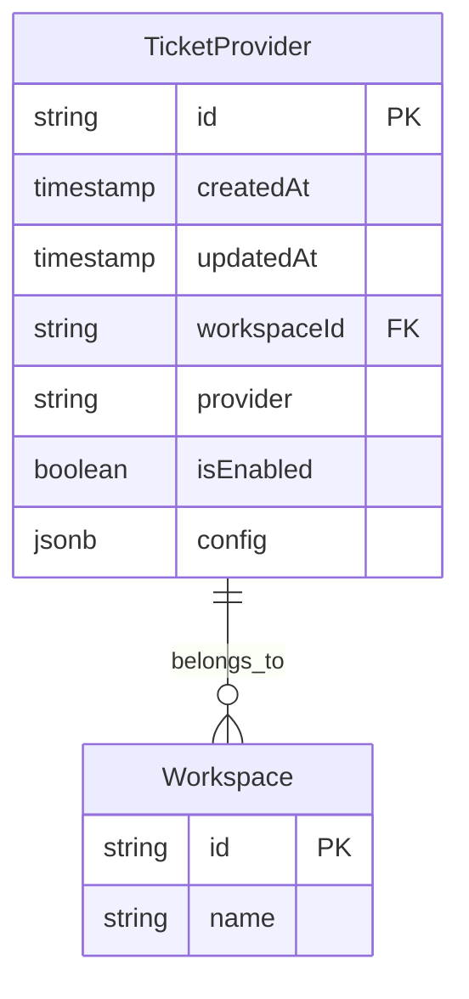
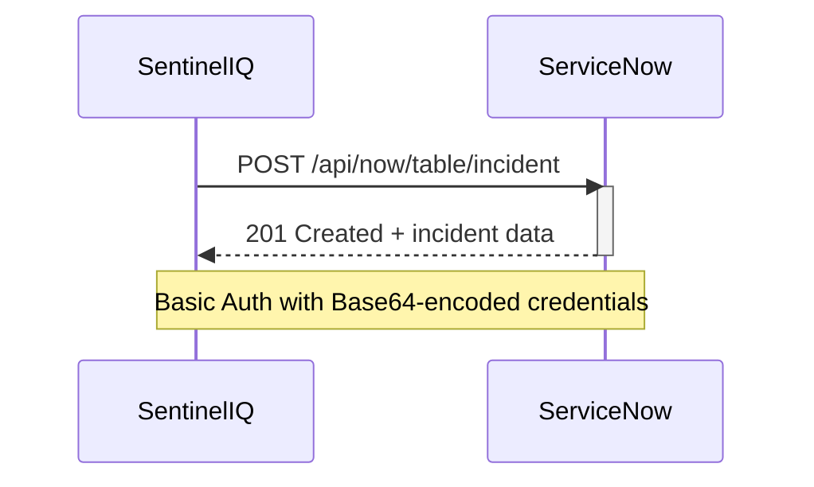
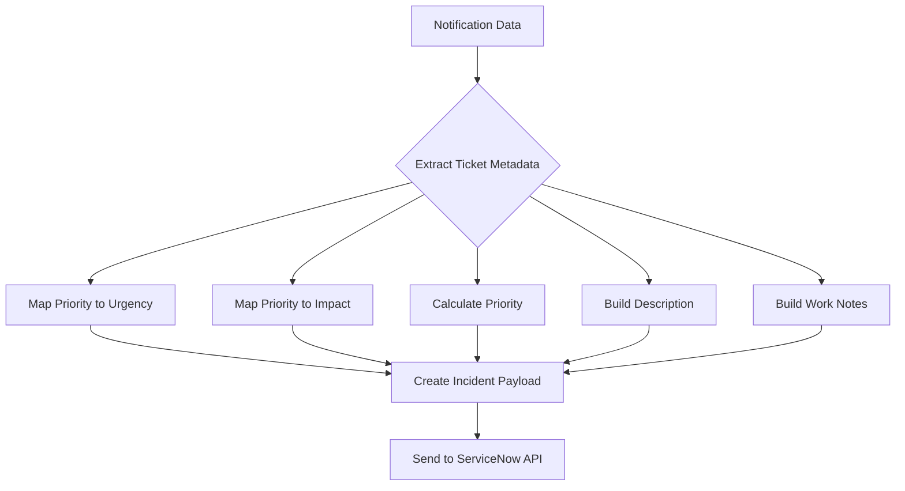
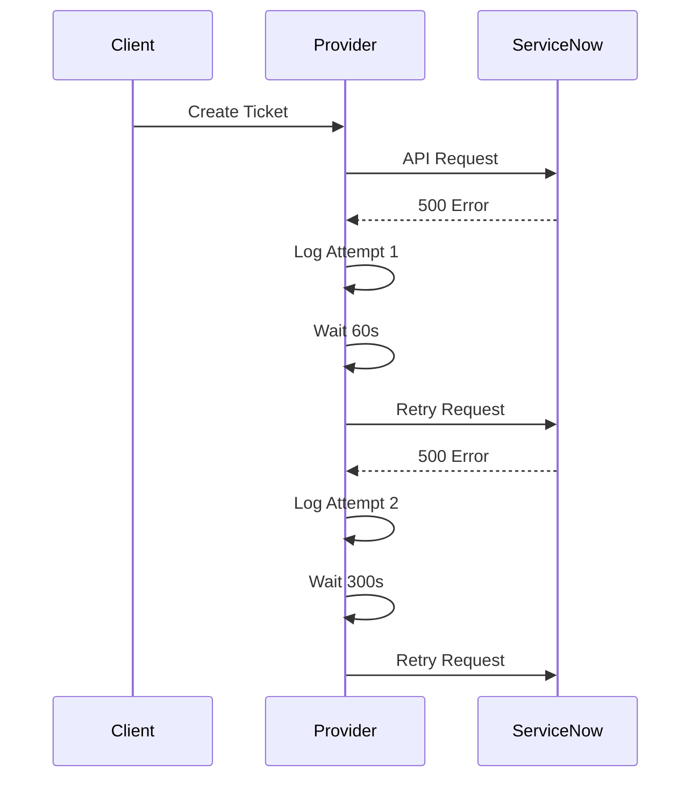

# ServiceNow Provider

<cite>
**Referenced Files in This Document**   
- [serviceNowProvider.ts](file://src/core/notifications/providers/tickets/serviceNowProvider.ts)
- [baseTicketProvider.ts](file://src/core/notifications/providers/tickets/baseTicketProvider.ts)
- [operations.ts](file://src/core/tickets/operations.ts)
- [migration.sql](file://migrations/20251117231659_add_ticket_providers/migration.sql)
- [types.ts](file://src/core/notifications/types.ts)
- [deliveryService.ts](file://src/core/notifications/deliveryService.ts)
</cite>

## Table of Contents
1. [Introduction](#introduction)
2. [Configuration Requirements](#configuration-requirements)
3. [Authentication Flow](#authentication-flow)
4. [Field Mapping and Payload Transformation](#field-mapping-and-payload-transformation)
5. [Error Handling and Rate Limiting](#error-handling-and-rate-limiting)
6. [Troubleshooting Guide](#troubleshooting-guide)
7. [Security Practices](#security-practices)

## Introduction
The ServiceNow provider integration in SentinelIQ enables automated creation and management of incidents in ServiceNow from security alerts and notifications. This integration uses ServiceNow's Table API to create incident records with appropriate metadata, priority, and assignment information. The system is designed to streamline incident response workflows by automatically synchronizing alert data from SentinelIQ to ServiceNow's incident management system.

The integration follows a provider pattern where ServiceNow is implemented as a ticket provider that extends the base ticket provider functionality. It handles the complete lifecycle of ticket creation, including authentication, payload transformation, field mapping, and error handling.

**Section sources**
- [serviceNowProvider.ts](file://src/core/notifications/providers/tickets/serviceNowProvider.ts#L1-L29)
- [baseTicketProvider.ts](file://src/core/notifications/providers/tickets/baseTicketProvider.ts#L1-L33)

## Configuration Requirements
To configure the ServiceNow provider, the following parameters must be provided:

- **instanceUrl**: The ServiceNow instance URL (e.g., "https://your-instance.service-now.com")
- **username**: ServiceNow username for authentication
- **password**: ServiceNow password or OAuth token
- **tableName**: The table name in ServiceNow (defaults to 'incident')
- **assignmentGroup**: Default assignment group (optional)
- **callerId**: Caller user ID (optional)

The configuration is validated during initialization to ensure all required fields are present. The provider configuration is stored in the database as JSONB data within the TicketProvider table, which supports multiple ticket providers per workspace.

**Diagram sources**
- [migration.sql](file://migrations/20251117231659_add_ticket_providers/migration.sql#L4-L22)
- [operations.ts](file://src/core/tickets/operations.ts#L156-L180)

**Section sources**
- [serviceNowProvider.ts](file://src/core/notifications/providers/tickets/serviceNowProvider.ts#L7-L13)
- [operations.ts](file://src/core/tickets/operations.ts#L156-L180)

## Authentication Flow
The ServiceNow provider uses Basic Authentication to authenticate with the ServiceNow API. The authentication flow works as follows:

1. The provider constructor receives the configuration containing username and password
2. During ticket creation, the credentials are combined in the format "username:password"
3. The combined string is Base64 encoded to create the authorization header
4. The encoded credentials are included in the Authorization header of API requests

The integration makes POST requests to the ServiceNow Table API endpoint (`/api/now/table/incident`) with the appropriate headers and JSON payload. The API response is parsed to extract the created incident's system ID, number, and other metadata.

**Diagram sources**
- [serviceNowProvider.ts](file://src/core/notifications/providers/tickets/serviceNowProvider.ts#L53-L69)
- [serviceNowProvider.ts](file://src/core/notifications/providers/tickets/serviceNowProvider.ts#L57-L58)

**Section sources**
- [serviceNowProvider.ts](file://src/core/notifications/providers/tickets/serviceNowProvider.ts#L53-L69)
- [baseTicketProvider.ts](file://src/core/notifications/providers/tickets/baseTicketProvider.ts#L176-L201)

## Field Mapping and Payload Transformation
The ServiceNow provider maps SentinelIQ notification data to ServiceNow incident fields through a structured transformation process. The payload transformation logic converts alert context into ServiceNow-compatible formats.

### Field Mapping
| SentinelIQ Field | ServiceNow Field | Transformation Logic |
|------------------|------------------|---------------------|
| notification.title | short_description | Direct mapping |
| notification.message + metadata | description | Formatted with markdown sections |
| ticketMetadata.priority | urgency, impact, priority | Mapped through priority calculation |
| ticketMetadata.category | category | Defaulted to 'Security' if not provided |
| assignmentGroup | assignment_group | Optional field mapping |
| callerId | caller_id | Optional field mapping |

### Priority Mapping
The provider implements a three-tier mapping system for priority fields:

1. **Urgency Mapping**: Converts priority to ServiceNow urgency (1-3 scale)
   - low → 3 (Low)
   - medium/high → 2 (Medium)
   - critical/urgent → 1 (High)

2. **Impact Mapping**: Converts priority to ServiceNow impact (1-3 scale)
   - Same mapping as urgency

3. **Priority Calculation**: Direct priority mapping
   - critical/urgent → 1 (Critical)
   - high → 2 (High)
   - medium → 3 (Moderate)
   - low → 4 (Low)

The description field is built using the base ticket provider's `buildTicketDescription` method, which formats the notification with workspace context, metadata, and timestamps. Work notes include incident details such as workspace name, notification type, source, and creation timestamp.

**Diagram sources**
- [serviceNowProvider.ts](file://src/core/notifications/providers/tickets/serviceNowProvider.ts#L31-L54)
- [serviceNowProvider.ts](file://src/core/notifications/providers/tickets/serviceNowProvider.ts#L85-L153)
- [baseTicketProvider.ts](file://src/core/notifications/providers/tickets/baseTicketProvider.ts#L112-L144)

**Section sources**
- [serviceNowProvider.ts](file://src/core/notifications/providers/tickets/serviceNowProvider.ts#L31-L54)
- [serviceNowProvider.ts](file://src/core/notifications/providers/tickets/serviceNowProvider.ts#L85-L153)
- [baseTicketProvider.ts](file://src/core/notifications/providers/tickets/baseTicketProvider.ts#L112-L144)

## Error Handling and Rate Limiting
The ServiceNow provider implements comprehensive error handling and retry mechanisms to ensure reliable operation.

### Error Handling
The integration uses a standardized error handling approach:

1. **Configuration Validation**: Validates required fields during initialization
2. **HTTP Error Handling**: Catches non-200 responses and extracts error details
3. **Retry Mechanism**: Implements exponential backoff retry strategy through the delivery service
4. **Detailed Logging**: Logs both successful and failed operations with context

Common API responses and their handling:
- **401 Unauthorized**: Indicates invalid credentials; requires credential validation
- **403 Forbidden**: Suggests insufficient permissions; requires role verification
- **404 Not Found**: Indicates incorrect endpoint or table name
- **429 Too Many Requests**: Triggers rate limiting response
- **5xx Server Errors**: Handled with retry logic

### Rate Limiting Considerations
While the ServiceNow provider itself doesn't implement rate limiting, the broader notification system includes retry mechanisms with exponential backoff:

- First retry: 1 minute delay
- Second retry: 5 minutes delay
- Third retry: 15 minutes delay

After three failed attempts, the system stops retrying and logs the failure. This prevents overwhelming the ServiceNow API during outages or connectivity issues.

**Diagram sources**
- [baseTicketProvider.ts](file://src/core/notifications/providers/tickets/baseTicketProvider.ts#L176-L201)
- [deliveryService.ts](file://src/core/notifications/deliveryService.ts#L8-L11)
- [deliveryService.ts](file://src/core/notifications/deliveryService.ts#L104-L132)

**Section sources**
- [baseTicketProvider.ts](file://src/core/notifications/providers/tickets/baseTicketProvider.ts#L176-L201)
- [deliveryService.ts](file://src/core/notifications/deliveryService.ts#L8-L11)
- [deliveryService.ts](file://src/core/notifications/deliveryService.ts#L104-L132)

## Troubleshooting Guide
This section addresses common issues and their resolution strategies for the ServiceNow integration.

### Connectivity Issues
**Symptoms**: Timeout errors, network connection failures
**Solutions**:
- Verify the instanceUrl is correct and accessible
- Check firewall rules and network connectivity
- Test connectivity using curl or Postman
- Validate DNS resolution for the ServiceNow instance

### Credential Validation
**Symptoms**: 401 Unauthorized errors
**Solutions**:
- Verify username and password are correct
- Ensure the user has appropriate permissions in ServiceNow
- Test credentials using ServiceNow's API explorer
- Check for account lockout or password expiration

### Field Mapping Conflicts
**Symptoms**: 400 Bad Request, field validation errors
**Solutions**:
- Verify the tableName configuration matches the actual table
- Check custom field requirements in ServiceNow
- Validate assignment group exists in ServiceNow
- Confirm caller_id refers to an existing user
- Review ServiceNow's schema for required fields

### Debugging Steps
1. Enable verbose logging for the ticket provider
2. Check the notification delivery logs in the database
3. Test the integration with a simple payload
4. Verify the ServiceNow API endpoint is accessible
5. Check for schema differences between expected and actual fields

**Section sources**
- [serviceNowProvider.ts](file://src/core/notifications/providers/tickets/serviceNowProvider.ts#L163-L171)
- [baseTicketProvider.ts](file://src/core/notifications/providers/tickets/baseTicketProvider.ts#L163-L171)
- [deliveryService.ts](file://src/core/notifications/deliveryService.ts#L53-L99)

## Security Practices
The ServiceNow integration follows security best practices to protect credentials and ensure compliance.

### Credential Protection
- Credentials are stored encrypted in the database
- Configuration uses environment variables where possible
- Passwords are never logged or exposed in error messages
- The config field in the TicketProvider table uses JSONB format for secure storage

### Compliance with ServiceNow Requirements
- Uses HTTPS for all API communications
- Implements proper authentication with minimal required permissions
- Follows ServiceNow's API rate limiting guidelines
- Includes proper error handling without exposing sensitive information
- Maintains audit logs of all ticket creation activities

The integration is designed to work with ServiceNow's security model, where users should have the minimum necessary permissions to create incidents. The system supports both basic authentication and can be extended to support OAuth tokens for enhanced security.

**Section sources**
- [serviceNowProvider.ts](file://src/core/notifications/providers/tickets/serviceNowProvider.ts#L53-L54)
- [serviceNowProvider.ts](file://src/core/notifications/providers/tickets/serviceNowProvider.ts#L10-L11)
- [migration.sql](file://migrations/20251117231659_add_ticket_providers/migration.sql#L12)