# Ticketing Providers

<cite>
**Referenced Files in This Document**   
- [baseTicketProvider.ts](file://src/core/notifications/providers/tickets/baseTicketProvider.ts)
- [jiraProvider.ts](file://src/core/notifications/providers/tickets/jiraProvider.ts)
- [serviceNowProvider.ts](file://src/core/notifications/providers/tickets/serviceNowProvider.ts)
- [azureDevOpsProvider.ts](file://src/core/notifications/providers/tickets/azureDevOpsProvider.ts)
- [linearProvider.ts](file://src/core/notifications/providers/tickets/linearProvider.ts)
- [githubProvider.ts](file://src/core/notifications/providers/tickets/githubProvider.ts)
- [types.ts](file://src/core/notifications/types.ts)
- [base.ts](file://src/core/notifications/providers/base.ts)
- [index.ts](file://src/core/notifications/providers/tickets/index.ts)
</cite>

## Table of Contents
1. [Introduction](#introduction)
2. [Architecture Overview](#architecture-overview)
3. [Common Interface Implementation](#common-interface-implementation)
4. [Provider-Specific Implementations](#provider-specific-implementations)
   - [Jira Provider](#jira-provider)
   - [ServiceNow Provider](#servicenow-provider)
   - [Azure DevOps Provider](#azure-devops-provider)
   - [Linear Provider](#linear-provider)
   - [GitHub Provider](#github-provider)
5. [Payload Transformation Logic](#payload-transformation-logic)
6. [Cross-System Integration Patterns](#cross-system-integration-patterns)
7. [Error Handling and API Limitations](#error-handling-and-api-limitations)
8. [Troubleshooting Guidance](#troubleshooting-guidance)
9. [Security Considerations](#security-considerations)
10. [Rate Limiting Strategies](#rate-limiting-strategies)

## Introduction

The ticketing provider system in SentinelIQ enables seamless integration with external ticketing platforms as part of notification workflows. This system allows automated creation and management of tickets in Jira, ServiceNow, Azure DevOps, Linear, and GitHub when security incidents, alerts, or other events occur within the platform. The implementation follows a provider pattern that standardizes interactions across different ticketing systems while accommodating their unique API requirements and data models.

The system is designed to convert generic notification data into provider-specific ticket formats, handling authentication, payload transformation, error handling, and response processing. Each provider implements a common interface while adapting to the specific requirements of its target platform, ensuring consistent behavior across different ticketing systems.

**Section sources**
- [baseTicketProvider.ts](file://src/core/notifications/providers/tickets/baseTicketProvider.ts#L1-L202)
- [index.ts](file://src/core/notifications/providers/tickets/index.ts#L1-L26)

## Architecture Overview

The ticketing provider system follows a hierarchical architecture with a base class that defines common functionality and abstract methods that must be implemented by each provider. All providers inherit from the `BaseTicketProvider` class, which itself extends the `BaseNotificationProvider` interface. This design enables code reuse while allowing for provider-specific implementations.

```mermaid
classDiagram
class BaseNotificationProvider {
+config : Record<string, any>
+providerName : string
+constructor(providerName : string, config : Record<string, any>)
+abstract send(recipients : string[], notification : NotificationData, context : Record<string, any>) : Promise<void>
+logSuccess(recipients : string[], notification : NotificationData) : Promise<void>
+logError(error : any, recipients : string[], notification : NotificationData) : Promise<void>
}
class BaseTicketProvider {
+providerType : string
+constructor(providerName : string, config : Record<string, any>)
+send(recipients : string[], notification : NotificationData, context : Record<string, any>) : Promise<void>
+extractTicketMetadata(notification : NotificationData) : TicketMetadata
+mapNotificationTypeToPriority(type : NotificationData['type']) : TicketMetadata['priority']
+buildTicketDescription(notification : NotificationData, context : Record<string, any>) : string
+logTicketCreated(ticketResponse : TicketResponse, notification : NotificationData) : Promise<void>
+validateConfig(requiredFields : string[]) : void
+makeRequest(url : string, options : RequestInit, errorContext : string) : Promise<any>
-createTicket(notification : NotificationData, ticketMetadata : TicketMetadata, context : Record<string, any>) : Promise<TicketResponse>
}
class JiraProvider {
+createTicket(notification : NotificationData, ticketMetadata : TicketMetadata, context : Record<string, any>) : Promise<TicketResponse>
-mapPriorityToJira(priority? : TicketMetadata['priority']) : string
}
class ServiceNowProvider {
+createTicket(notification : NotificationData, ticketMetadata : TicketMetadata, context : Record<string, any>) : Promise<TicketResponse>
-mapPriorityToUrgency(priority? : TicketMetadata['priority']) : number
-mapPriorityToImpact(priority? : TicketMetadata['priority']) : number
-calculateServiceNowPriority(priority? : TicketMetadata['priority']) : number
-buildWorkNotes(notification : NotificationData, ticketMetadata : TicketMetadata, context : Record<string, any>) : string
}
class AzureDevOpsProvider {
+createTicket(notification : NotificationData, ticketMetadata : TicketMetadata, context : Record<string, any>) : Promise<TicketResponse>
-mapPriorityToAzureDevOps(priority? : TicketMetadata['priority']) : number
-mapSeverityToAzureDevOps(type : NotificationData['type']) : string
}
class LinearProvider {
+createTicket(notification : NotificationData, ticketMetadata : TicketMetadata, context : Record<string, any>) : Promise<TicketResponse>
-mapPriorityToLinear(priority? : TicketMetadata['priority']) : number
}
class GitHubProvider {
+createTicket(notification : NotificationData, ticketMetadata : TicketMetadata, context : Record<string, any>) : Promise<TicketResponse>
-buildLabels(ticketMetadata : TicketMetadata, defaultLabels : string[]) : string[]
}
BaseNotificationProvider <|-- BaseTicketProvider
BaseTicketProvider <|-- JiraProvider
BaseTicketProvider <|-- ServiceNowProvider
BaseTicketProvider <|-- AzureDevOpsProvider
BaseTicketProvider <|-- LinearProvider
BaseTicketProvider <|-- GitHubProvider
```



**Diagram sources**
- [baseTicketProvider.ts](file://src/core/notifications/providers/tickets/baseTicketProvider.ts#L1-L202)
- [base.ts](file://src/core/notifications/providers/base.ts#L1-L38)

**Section sources**
- [baseTicketProvider.ts](file://src/core/notifications/providers/tickets/baseTicketProvider.ts#L1-L202)
- [base.ts](file://src/core/notifications/providers/base.ts#L1-L38)

## Common Interface Implementation

The ticketing provider system implements a common interface for creating tickets across different platforms. This interface standardizes the creation process while allowing for provider-specific adaptations. The core components of this interface include ticket metadata definition, priority mapping, description building, and response handling.

### Ticket Metadata Structure

All providers support a common set of metadata fields that can be used to populate ticket properties:

```typescript
interface TicketMetadata {
  priority?: 'low' | 'medium' | 'high' | 'critical' | 'urgent';
  status?: string;
  assignedTo?: string;
  labels?: string[];
  tags?: string[];
  dueDate?: string;
  project?: string;
  category?: string;
  severity?: string;
  source?: string;
  customFields?: Record<string, any>;
}
```

### Priority Mapping

The system automatically maps notification types to ticket priorities using a standardized mapping:

| Notification Type | Default Priority |
|------------------|------------------|
| INFO | low |
| SUCCESS | low |
| WARNING | medium |
| ERROR | high |
| CRITICAL | critical |

This mapping can be overridden by specifying a priority in the notification metadata.

### Ticket Description Building

All providers use a common method to build ticket descriptions from notification data. The description includes:
- Notification title as a heading
- Main message content
- Workspace context (if available)
- Link to view details (if provided)
- Additional metadata fields
- Creation timestamp and source information

**Section sources**
- [baseTicketProvider.ts](file://src/core/notifications/providers/tickets/baseTicketProvider.ts#L7-L144)
- [types.ts](file://src/core/notifications/types.ts#L1-L60)

## Provider-Specific Implementations

### Jira Provider

The Jira provider creates issues in Jira using the REST API v3. It supports both cloud and self-hosted Jira instances.

**Configuration Requirements**
- `baseUrl`: Jira instance URL (e.g., "https://your-domain.atlassian.net")
- `email`: Jira user email
- `apiToken`: Jira API token
- `projectKey`: Default project key
- `issueType`: Issue type name (default: "Task")

**Authentication Method**
Uses basic authentication with email and API token.

**Integration Endpoints**
- Issue creation: `{baseUrl}/rest/api/3/issue`

**Priority Mapping**
| Generic Priority | Jira Priority |
|------------------|---------------|
| low | Low |
| medium | Medium |
| high | High |
| critical | Highest |
| urgent | Highest |

**Section sources**
- [jiraProvider.ts](file://src/core/notifications/providers/tickets/jiraProvider.ts#L1-L120)

### ServiceNow Provider

The ServiceNow provider creates incidents in ServiceNow using the Table API.

**Configuration Requirements**
- `instanceUrl`: ServiceNow instance URL
- `username`: ServiceNow username
- `password`: ServiceNow password
- `assignmentGroup`: Default assignment group (optional)
- `callerId`: Caller user ID (optional)

**Authentication Method**
Uses basic authentication with username and password.

**Integration Endpoints**
- Incident creation: `{instanceUrl}/api/now/table/incident`

**Priority Calculation**
ServiceNow uses a combination of urgency, impact, and priority fields. The provider calculates these values based on the generic priority:

| Generic Priority | Urgency | Impact | Priority |
|------------------|--------|--------|----------|
| low | 3 (Low) | 3 (Low) | 4 (Low) |
| medium | 2 (Medium) | 2 (Medium) | 3 (Moderate) |
| high | 2 (Medium) | 2 (Medium) | 2 (High) |
| critical | 1 (High) | 1 (High) | 1 (Critical) |
| urgent | 1 (High) | 1 (High) | 1 (Critical) |

**Section sources**
- [serviceNowProvider.ts](file://src/core/notifications/providers/tickets/serviceNowProvider.ts#L1-L154)

### Azure DevOps Provider

The Azure DevOps provider creates work items in Azure DevOps using the REST API.

**Configuration Requirements**
- `organization`: Azure DevOps organization name
- `project`: Project name
- `personalAccessToken`: PAT with work item write permissions
- `workItemType`: Type of work item (default: "Bug")
- `areaPath`: Area path (optional)
- `iterationPath`: Iteration path (optional)

**Authentication Method**
Uses basic authentication with empty username and personal access token as password.

**Integration Endpoints**
- Work item creation: `https://dev.azure.com/{organization}/{project}/_apis/wit/workitems/${workItemType}?api-version=7.1`

**Priority Mapping**
| Generic Priority | Azure DevOps Priority |
|------------------|-----------------------|
| low | 4 (Low) |
| medium | 3 (Medium) |
| high | 2 (High) |
| critical | 1 (Critical) |
| urgent | 1 (Critical) |

**Section sources**
- [azureDevOpsProvider.ts](file://src/core/notifications/providers/tickets/azureDevOpsProvider.ts#L1-L159)

### Linear Provider

The Linear provider creates issues in Linear using the GraphQL API.

**Configuration Requirements**
- `apiKey`: Linear API key
- `teamId`: Team ID to create issues in
- `projectId`: Project ID (optional)
- `defaultStateId`: Default workflow state ID (optional)

**Authentication Method**
Uses bearer token authentication with API key.

**Integration Endpoints**
- GraphQL API: `https://api.linear.app/graphql`

**Priority Mapping**
| Generic Priority | Linear Priority (Number) | Linear Priority (Label) |
|------------------|--------------------------|-------------------------|
| low | 4 | Low |
| medium | 3 | Medium |
| high | 2 | High |
| critical | 1 | Urgent |
| urgent | 1 | Urgent |

**Section sources**
- [linearProvider.ts](file://src/core/notifications/providers/tickets/linearProvider.ts#L1-L129)

### GitHub Provider

The GitHub provider creates issues in GitHub repositories using the REST API.

**Configuration Requirements**
- `token`: GitHub Personal Access Token with 'repo' scope
- `owner`: Repository owner (username or organization)
- `repo`: Repository name
- `labels`: Default labels to apply (optional)

**Authentication Method**
Uses bearer token authentication with personal access token.

**Integration Endpoints**
- Issue creation: `https://api.github.com/repos/{owner}/{repo}/issues`

**Label Generation**
The provider automatically generates labels based on ticket metadata:
- Priority: `priority: {priority}`
- Severity: `severity: {severity}`
- Source: `source: sentineliq`
- Custom labels and tags from metadata

**Section sources**
- [githubProvider.ts](file://src/core/notifications/providers/tickets/githubProvider.ts#L1-L104)

## Payload Transformation Logic

The system implements a consistent payload transformation logic that converts generic notification data into provider-specific ticket formats. This process involves several steps:

1. **Metadata Extraction**: Extract ticket metadata from the notification object, using default values from configuration when necessary.
2. **Priority Mapping**: Convert the generic priority level to the provider-specific priority system.
3. **Description Building**: Create a formatted description using the common `buildTicketDescription` method.
4. **Payload Construction**: Build the provider-specific payload structure according to the API requirements.
5. **Authentication Header**: Create the appropriate authentication header based on the provider's requirements.
6. **API Request**: Make the HTTP request to create the ticket.
7. **Response Processing**: Parse the response and return a standardized `TicketResponse` object.

The transformation process ensures that all providers return a consistent response format regardless of their underlying API differences:

```typescript
interface TicketResponse {
  ticketId: string;
  ticketKey?: string;
  ticketUrl: string;
  createdAt: string;
  provider: string;
}
```

**Section sources**
- [baseTicketProvider.ts](file://src/core/notifications/providers/tickets/baseTicketProvider.ts#L53-L71)
- [jiraProvider.ts](file://src/core/notifications/providers/tickets/jiraProvider.ts#L24-L103)

## Cross-System Integration Patterns

The ticketing provider system supports several cross-system integration patterns that enable seamless workflow automation:

### Notification-Driven Ticket Creation
When a notification is triggered in SentinelIQ (e.g., security alert, system event), the system can automatically create a ticket in the configured provider. This pattern ensures that important events are tracked in the organization's primary ticketing system.

### Bidirectional Synchronization
While the current implementation focuses on outbound ticket creation, the system is designed to support bidirectional synchronization. Future enhancements could include:
- Syncing ticket status changes back to SentinelIQ
- Updating notification status based on ticket resolution
- Creating follow-up notifications when tickets are updated

### Multi-Provider Workflows
Organizations can configure multiple ticket providers for different use cases:
- Security incidents → Jira
- IT service requests → ServiceNow
- Development tasks → Azure DevOps
- Feature requests → Linear
- Bug reports → GitHub

### Context Preservation
The system preserves context across systems by:
- Including links back to the original notification
- Adding workspace and user context to ticket descriptions
- Maintaining correlation between SentinelIQ events and external tickets

**Section sources**
- [baseTicketProvider.ts](file://src/core/notifications/providers/tickets/baseTicketProvider.ts#L53-L71)
- [types.ts](file://src/core/notifications/types.ts#L1-L60)

## Error Handling and API Limitations

The system implements robust error handling to manage API limitations and connectivity issues:

### Common Error Scenarios
- **Authentication failures**: Invalid credentials or expired tokens
- **Rate limiting**: Exceeding API request limits
- **Validation errors**: Invalid payload data
- **Network issues**: Connectivity problems or timeouts
- **Service outages**: Provider API unavailability

### Error Handling Strategy
1. **Graceful Degradation**: When a provider fails, the system logs the error but continues processing other providers.
2. **Retry Mechanism**: Failed requests are automatically retried with exponential backoff.
3. **Detailed Logging**: All errors are logged with context for troubleshooting.
4. **User Notifications**: Administrators are notified of persistent failures.

### API Limitations
Each provider has specific limitations that the system accounts for:
- **Jira**: Rate limits based on instance type (cloud vs. server)
- **ServiceNow**: Concurrency limits and session timeouts
- **Azure DevOps**: Request size limits and pagination requirements
- **Linear**: GraphQL query complexity limits
- **GitHub**: Rate limits based on authentication method

**Section sources**
- [baseTicketProvider.ts](file://src/core/notifications/providers/tickets/baseTicketProvider.ts#L176-L199)
- [base.ts](file://src/core/notifications/providers/base.ts#L29-L36)

## Troubleshooting Guidance

### Common Issues and Solutions

#### Authentication Failures
**Symptoms**: "Authentication failed" or "Invalid credentials" errors
**Solutions**:
- Verify credentials in provider configuration
- For Jira, ensure API token has correct permissions
- For GitHub, ensure PAT has 'repo' scope
- For Azure DevOps, verify PAT has work item permissions

#### Ticket Creation Failures
**Symptoms**: Tickets not created, API errors
**Solutions**:
- Check provider-specific configuration requirements
- Verify project keys, team IDs, or repository names
- Ensure required fields are populated
- Check for API rate limiting

#### Formatting Issues
**Symptoms**: Incorrect priority, missing fields, malformed descriptions
**Solutions**:
- Verify priority mapping configuration
- Check custom field names and formats
- Validate payload structure against provider API documentation

### Diagnostic Tools
- **Delivery Logs**: Check notification delivery logs for error details
- **Provider Logs**: Review provider-specific logs for API responses
- **Configuration Validation**: Use the configuration validation method to check required fields

**Section sources**
- [baseTicketProvider.ts](file://src/core/notifications/providers/tickets/baseTicketProvider.ts#L163-L171)
- [base.ts](file://src/core/notifications/providers/base.ts#L29-L36)

## Security Considerations

### Credential Management
- **Secure Storage**: Provider credentials are stored encrypted in the database
- **Environment Variables**: Sensitive credentials can be provided via environment variables
- **Access Control**: Only workspace administrators can configure ticket providers
- **Audit Logging**: Changes to provider configurations are logged for audit purposes

### Authentication Methods
Each provider uses the most secure authentication method available:
- **Jira**: API tokens (preferred over passwords)
- **ServiceNow**: Basic auth with password or OAuth
- **Azure DevOps**: Personal Access Tokens with scoped permissions
- **Linear**: API keys with limited permissions
- **GitHub**: Personal Access Tokens with minimal required scopes

### Data Protection
- **Encryption**: Credentials are encrypted at rest
- **Transmission Security**: All API calls use HTTPS
- **Minimal Permissions**: Tokens should have only the permissions necessary for ticket creation
- **Regular Rotation**: Credentials should be rotated periodically

**Section sources**
- [baseTicketProvider.ts](file://src/core/notifications/providers/tickets/baseTicketProvider.ts#L21-L22)
- [jiraProvider.ts](file://src/core/notifications/providers/tickets/jiraProvider.ts#L21-L22)

## Rate Limiting Strategies

The system implements several strategies to handle API rate limiting:

### Provider-Specific Rate Limits
| Provider | Rate Limit | Strategy |
|---------|------------|----------|
| Jira | Varies by instance | Exponential backoff with jitter |
| ServiceNow | 50 requests/second | Queue with delay |
| Azure DevOps | 5,000 requests/hour | Batch processing |
| Linear | 100 requests/minute | Throttling |
| GitHub | 5,000 requests/hour (authenticated) | Queue with delay |

### Implementation Strategies
1. **Exponential Backoff**: Failed requests due to rate limiting are retried with increasing delays.
2. **Request Queuing**: High-volume requests are queued and processed at a sustainable rate.
3. **Batch Processing**: Where supported by the API, multiple operations are batched into single requests.
4. **Caching**: Frequently accessed data is cached to reduce API calls.
5. **Monitoring**: Rate limit headers are monitored to proactively adjust request rates.

### Configuration Options
- **Retry Attempts**: Configurable number of retry attempts
- **Base Delay**: Base delay for exponential backoff
- **Maximum Delay**: Upper limit for retry delays
- **Concurrency Limits**: Maximum number of concurrent requests

**Section sources**
- [baseTicketProvider.ts](file://src/core/notifications/providers/tickets/baseTicketProvider.ts#L176-L199)
- [makeRequest method](file://src/core/notifications/providers/tickets/baseTicketProvider.ts#L176-L199)