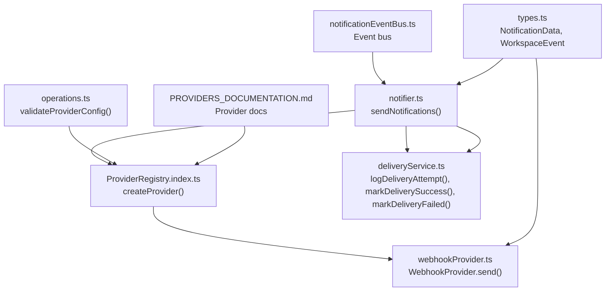
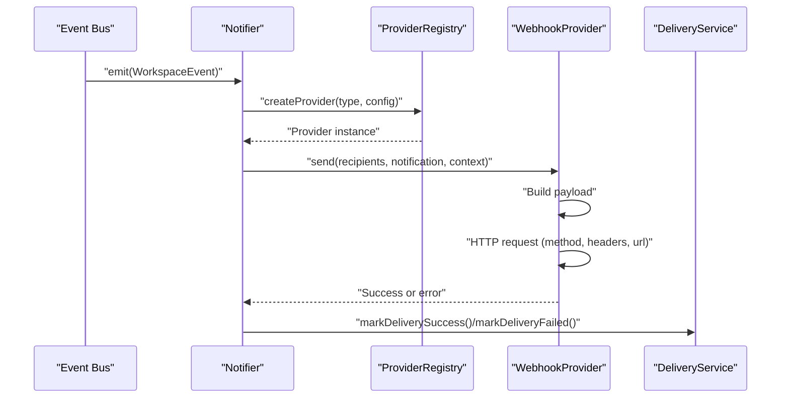
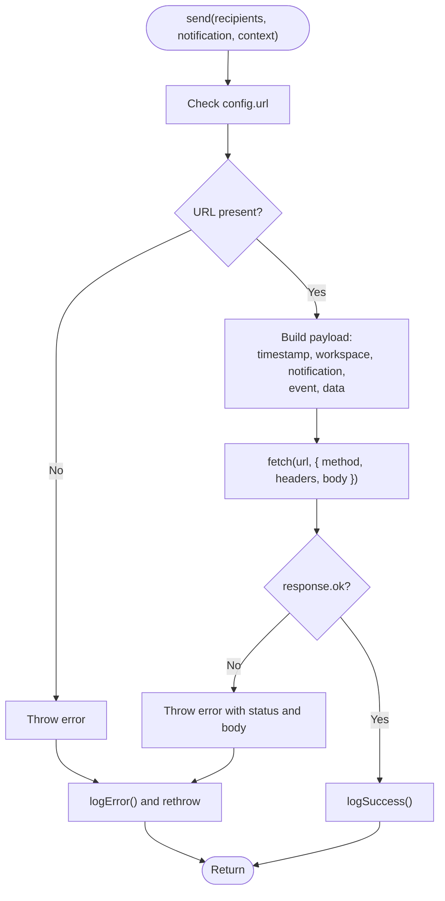
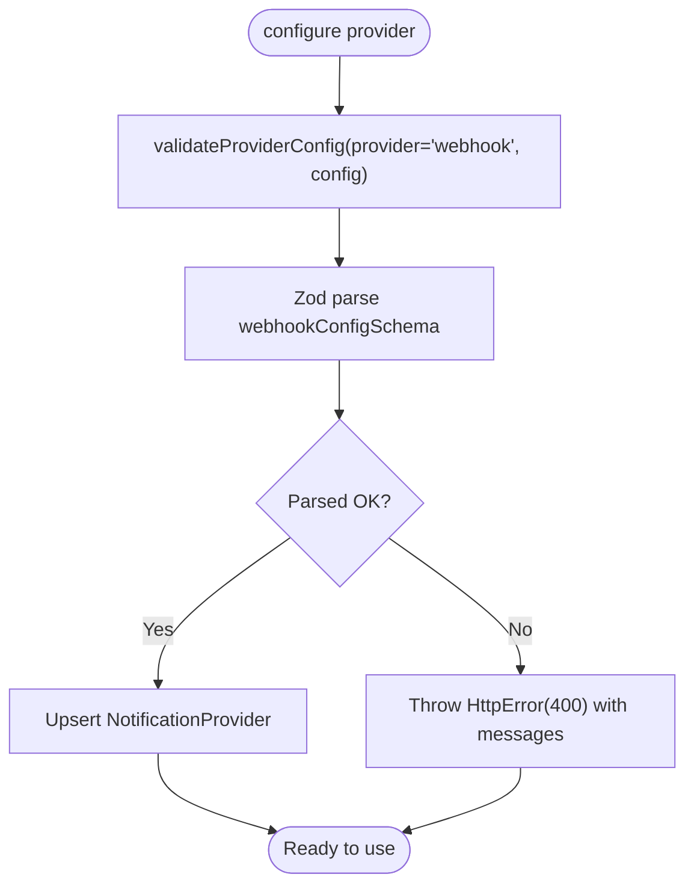
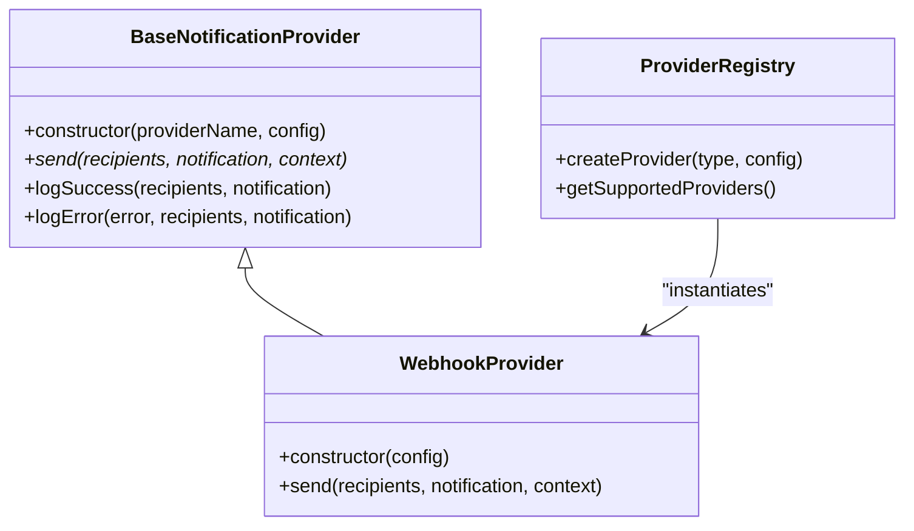
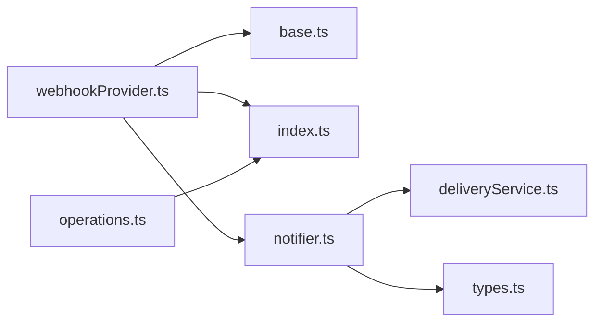

# Webhook Provider

<cite>
**Referenced Files in This Document**
- [webhookProvider.ts](file://src/core/notifications/providers/webhookProvider.ts)
- [base.ts](file://src/core/notifications/providers/base.ts)
- [index.ts](file://src/core/notifications/providers/index.ts)
- [types.ts](file://src/core/notifications/types.ts)
- [notifier.ts](file://src/core/notifications/notifier.ts)
- [deliveryService.ts](file://src/core/notifications/deliveryService.ts)
- [eventBus.ts](file://src/core/notifications/eventBus.ts)
- [operations.ts](file://src/core/notifications/operations.ts)
- [PROVIDERS_DOCUMENTATION.md](file://src/core/notifications/PROVIDERS_DOCUMENTATION.md)
</cite>

## Table of Contents
1. [Introduction](#introduction)
2. [Project Structure](#project-structure)
3. [Core Components](#core-components)
4. [Architecture Overview](#architecture-overview)
5. [Detailed Component Analysis](#detailed-component-analysis)
6. [Dependency Analysis](#dependency-analysis)
7. [Performance Considerations](#performance-considerations)
8. [Troubleshooting Guide](#troubleshooting-guide)
9. [Conclusion](#conclusion)
10. [Appendices](#appendices)

## Introduction
This document provides API documentation for the WebhookProvider in SentinelIQ. It explains the flexible configuration schema, payload structure, send method implementation, error handling, and extensibility features. It also covers integration patterns, security considerations, and troubleshooting guidance.

## Project Structure
The WebhookProvider is part of the notification subsystem and integrates with the event bus, provider registry, and delivery service. The provider’s configuration is validated during provider setup, and it participates in the notification lifecycle triggered by workspace events.

**Diagram sources**
- [eventBus.ts](file://src/core/notifications/eventBus.ts#L1-L74)
- [notifier.ts](file://src/core/notifications/notifier.ts#L1-L111)
- [index.ts](file://src/core/notifications/providers/index.ts#L1-L47)
- [webhookProvider.ts](file://src/core/notifications/providers/webhookProvider.ts#L1-L53)
- [deliveryService.ts](file://src/core/notifications/deliveryService.ts#L1-L171)
- [operations.ts](file://src/core/notifications/operations.ts#L1-L95)
- [types.ts](file://src/core/notifications/types.ts#L1-L60)
- [PROVIDERS_DOCUMENTATION.md](file://src/core/notifications/PROVIDERS_DOCUMENTATION.md#L1-L292)

**Section sources**
- [webhookProvider.ts](file://src/core/notifications/providers/webhookProvider.ts#L1-L53)
- [index.ts](file://src/core/notifications/providers/index.ts#L1-L47)
- [types.ts](file://src/core/notifications/types.ts#L1-L60)
- [notifier.ts](file://src/core/notifications/notifier.ts#L1-L111)
- [deliveryService.ts](file://src/core/notifications/deliveryService.ts#L1-L171)
- [eventBus.ts](file://src/core/notifications/eventBus.ts#L1-L74)
- [operations.ts](file://src/core/notifications/operations.ts#L1-L95)
- [PROVIDERS_DOCUMENTATION.md](file://src/core/notifications/PROVIDERS_DOCUMENTATION.md#L1-L292)

## Core Components
- WebhookProvider: Implements the send method to deliver notifications to a configurable HTTP endpoint.
- BaseNotificationProvider: Provides logging and error handling scaffolding used by all providers.
- ProviderRegistry: Factory for creating provider instances by type.
- Notifier: Orchestrates notification creation, provider selection, and delivery.
- DeliveryService: Manages delivery attempts, retries, and status tracking.
- Event Bus: Emits workspace events that trigger notifications.
- Operations: Validates provider configuration and exposes administrative operations.

**Section sources**
- [webhookProvider.ts](file://src/core/notifications/providers/webhookProvider.ts#L1-L53)
- [base.ts](file://src/core/notifications/providers/base.ts#L1-L38)
- [index.ts](file://src/core/notifications/providers/index.ts#L1-L47)
- [notifier.ts](file://src/core/notifications/notifier.ts#L1-L111)
- [deliveryService.ts](file://src/core/notifications/deliveryService.ts#L1-L171)
- [eventBus.ts](file://src/core/notifications/eventBus.ts#L1-L74)
- [operations.ts](file://src/core/notifications/operations.ts#L1-L95)

## Architecture Overview
The WebhookProvider participates in a publish-subscribe architecture:
- An event is emitted by the event bus.
- The notifier selects enabled providers for the event type, builds context, and invokes each provider.
- The provider constructs a standardized payload and performs an HTTP request.
- DeliveryService records attempts, success/failure, and schedules retries.

**Diagram sources**
- [eventBus.ts](file://src/core/notifications/eventBus.ts#L1-L74)
- [notifier.ts](file://src/core/notifications/notifier.ts#L1-L111)
- [index.ts](file://src/core/notifications/providers/index.ts#L1-L47)
- [webhookProvider.ts](file://src/core/notifications/providers/webhookProvider.ts#L1-L53)
- [deliveryService.ts](file://src/core/notifications/deliveryService.ts#L1-L171)

## Detailed Component Analysis

### WebhookProvider.send Implementation
The send method:
- Reads configuration for URL, HTTP method, and headers.
- Validates presence of URL.
- Builds a standardized payload containing timestamp, workspace context, notification data, event type, and event data.
- Sends an HTTP request using fetch with the configured method and headers.
- Logs success or error and rethrows for upstream handling.

**Diagram sources**
- [webhookProvider.ts](file://src/core/notifications/providers/webhookProvider.ts#L1-L53)

**Section sources**
- [webhookProvider.ts](file://src/core/notifications/providers/webhookProvider.ts#L1-L53)

### Configuration Schema and Validation
Provider configuration is validated before being stored and used:
- Webhook configuration schema accepts:
  - url: a valid URL string.
  - headers: optional record of string keys/values.
  - method: optional enum restricted to POST and PUT; defaults to POST.
- Validation occurs in the operations layer and throws HTTP errors on invalid configuration.

**Diagram sources**
- [operations.ts](file://src/core/notifications/operations.ts#L1-L95)

**Section sources**
- [operations.ts](file://src/core/notifications/operations.ts#L1-L95)

### Payload Structure
The WebhookProvider constructs a standardized JSON payload with the following fields:
- timestamp: ISO 8601 string indicating when the notification was generated.
- workspace: object containing id and name of the workspace.
- notification: object containing type, title, message, optional link, and optional metadata.
- event: string representing the event type.
- data: object containing event-specific data.

This structure is derived from the context and notification data passed by the notifier.

**Section sources**
- [webhookProvider.ts](file://src/core/notifications/providers/webhookProvider.ts#L1-L53)
- [types.ts](file://src/core/notifications/types.ts#L1-L60)
- [notifier.ts](file://src/core/notifications/notifier.ts#L40-L89)

### Authentication Mechanisms
- The WebhookProvider does not implement built-in authentication (e.g., basic auth, bearer tokens) in its send method.
- Authentication can be implemented by setting appropriate headers in the provider configuration (e.g., Authorization header).
- The configuration schema allows custom headers to be supplied.

**Section sources**
- [webhookProvider.ts](file://src/core/notifications/providers/webhookProvider.ts#L1-L53)
- [operations.ts](file://src/core/notifications/operations.ts#L1-L95)

### Extensibility and Third-Party Integrations
- The ProviderRegistry supports pluggable providers. Adding a new provider involves registering it in the registry and implementing the provider interface.
- The WebhookProvider demonstrates a minimal, flexible approach suitable for integrating with arbitrary third-party services by configuring URL, method, and headers.

**Diagram sources**
- [base.ts](file://src/core/notifications/providers/base.ts#L1-L38)
- [webhookProvider.ts](file://src/core/notifications/providers/webhookProvider.ts#L1-L53)
- [index.ts](file://src/core/notifications/providers/index.ts#L1-L47)

**Section sources**
- [index.ts](file://src/core/notifications/providers/index.ts#L1-L47)
- [base.ts](file://src/core/notifications/providers/base.ts#L1-L38)

### Integration Patterns
Common integration patterns supported by the WebhookProvider:
- Generic HTTP endpoints: Configure url, method, and headers to match target API requirements.
- Signature verification: Set Authorization headers in headers to authenticate with external systems.
- Custom payloads: Adjust headers and method to align with third-party expectations.

These patterns are demonstrated conceptually by the provider’s flexible configuration and the ability to pass custom headers.

**Section sources**
- [webhookProvider.ts](file://src/core/notifications/providers/webhookProvider.ts#L1-L53)
- [operations.ts](file://src/core/notifications/operations.ts#L1-L95)
- [PROVIDERS_DOCUMENTATION.md](file://src/core/notifications/PROVIDERS_DOCUMENTATION.md#L1-L292)

## Dependency Analysis
The WebhookProvider depends on:
- BaseNotificationProvider for logging and error handling.
- ProviderRegistry for instantiation.
- Notifier for context and recipients.
- DeliveryService for delivery logs and retry scheduling.

**Diagram sources**
- [webhookProvider.ts](file://src/core/notifications/providers/webhookProvider.ts#L1-L53)
- [base.ts](file://src/core/notifications/providers/base.ts#L1-L38)
- [index.ts](file://src/core/notifications/providers/index.ts#L1-L47)
- [notifier.ts](file://src/core/notifications/notifier.ts#L1-L111)
- [deliveryService.ts](file://src/core/notifications/deliveryService.ts#L1-L171)
- [types.ts](file://src/core/notifications/types.ts#L1-L60)
- [operations.ts](file://src/core/notifications/operations.ts#L1-L95)

**Section sources**
- [webhookProvider.ts](file://src/core/notifications/providers/webhookProvider.ts#L1-L53)
- [index.ts](file://src/core/notifications/providers/index.ts#L1-L47)
- [notifier.ts](file://src/core/notifications/notifier.ts#L1-L111)
- [deliveryService.ts](file://src/core/notifications/deliveryService.ts#L1-L171)
- [types.ts](file://src/core/notifications/types.ts#L1-L60)
- [operations.ts](file://src/core/notifications/operations.ts#L1-L95)

## Performance Considerations
- The notifier sends provider invocations concurrently via Promise.allSettled, which improves throughput when multiple providers are involved.
- DeliveryService implements retry scheduling with bounded attempts and delays to reduce load spikes.
- The WebhookProvider uses fetch for outbound HTTP requests; ensure target endpoints are highly available and responsive.

[No sources needed since this section provides general guidance]

## Troubleshooting Guide
Common issues and resolutions:
- Connectivity problems:
  - Verify URL correctness and network reachability.
  - Check firewall and proxy settings.
- Payload format errors:
  - Ensure headers are set appropriately (e.g., Content-Type).
  - Validate method compatibility with the target endpoint.
- Rate limiting:
  - Reduce frequency or implement backoff on the receiver.
  - Use DeliveryService’s retry mechanism to handle transient failures.
- Authentication failures:
  - Confirm Authorization headers are correctly set in the provider configuration.
- Logging and diagnostics:
  - Review delivery logs and error messages recorded by the provider and DeliveryService.

**Section sources**
- [webhookProvider.ts](file://src/core/notifications/providers/webhookProvider.ts#L1-L53)
- [deliveryService.ts](file://src/core/notifications/deliveryService.ts#L1-L171)
- [notifier.ts](file://src/core/notifications/notifier.ts#L1-L111)

## Conclusion
The WebhookProvider offers a flexible, extensible mechanism for delivering SentinelIQ notifications to arbitrary HTTP endpoints. Its configuration schema supports custom URLs, HTTP methods, headers, and authentication via headers. The standardized payload structure ensures consistent consumption across diverse integrations. Robust error handling, logging, and retry scheduling are integrated through the notifier and delivery service.

[No sources needed since this section summarizes without analyzing specific files]

## Appendices

### API Reference: WebhookProvider.send
- Inputs:
  - recipients: string[]
  - notification: NotificationData
  - context: Record<string, any> (includes workspaceId, workspaceName, eventType, eventData)
- Behavior:
  - Constructs payload with timestamp, workspace, notification, event, and data.
  - Sends HTTP request to configured URL with method and headers.
  - Throws on missing URL or non-OK response.
- Outputs:
  - Success logs via logSuccess.
  - Errors logged via logError and rethrown.

**Section sources**
- [webhookProvider.ts](file://src/core/notifications/providers/webhookProvider.ts#L1-L53)
- [types.ts](file://src/core/notifications/types.ts#L1-L60)

### Configuration Reference: Webhook Provider
- url: string (required)
- headers: Record<string, string> (optional)
- method: "POST" | "PUT" (optional, defaults to "POST")

Validation occurs in the operations layer.

**Section sources**
- [operations.ts](file://src/core/notifications/operations.ts#L1-L95)

### Security Considerations
- Transport security:
  - Use HTTPS endpoints to protect payloads in transit.
- Authentication:
  - Supply Authorization headers via the headers configuration field.
- Integrity:
  - Consider adding signatures or HMAC headers on the client side and verifying on the receiver.
- Rate limiting:
  - Implement server-side rate limits on the receiving endpoint.
- Secrets management:
  - Store sensitive configuration values in environment variables or secure secret stores.

[No sources needed since this section provides general guidance]