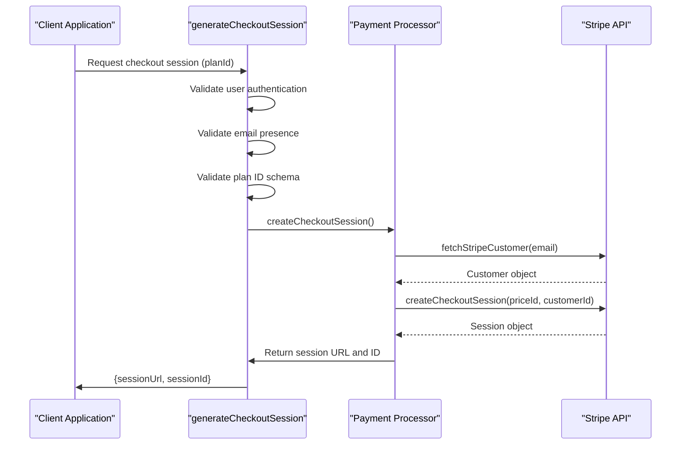
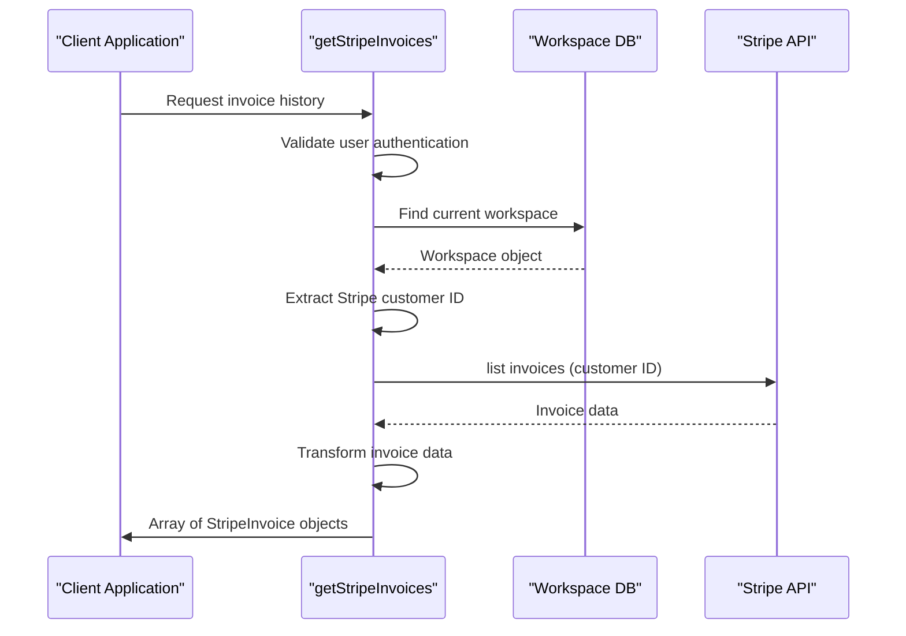
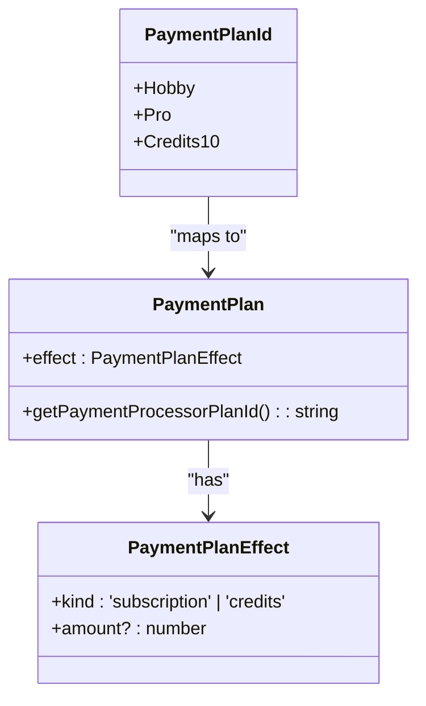
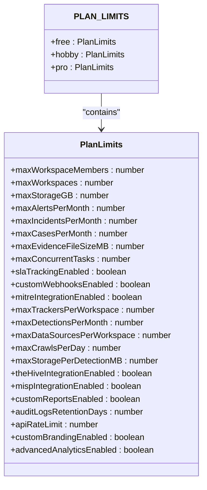
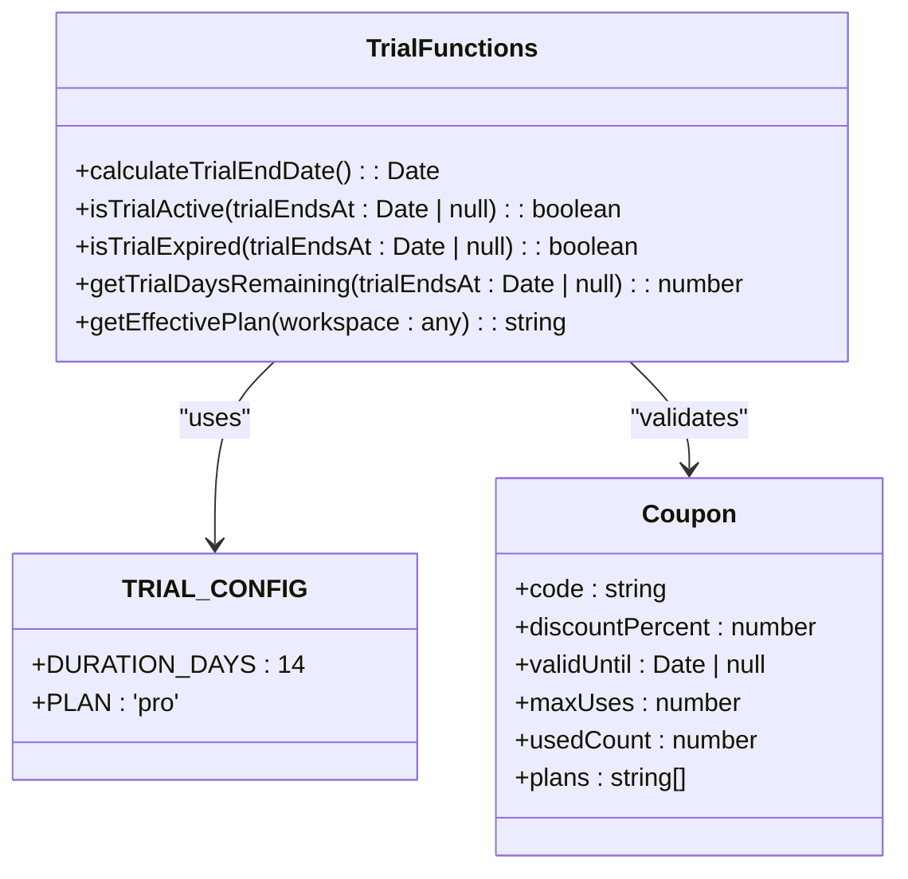
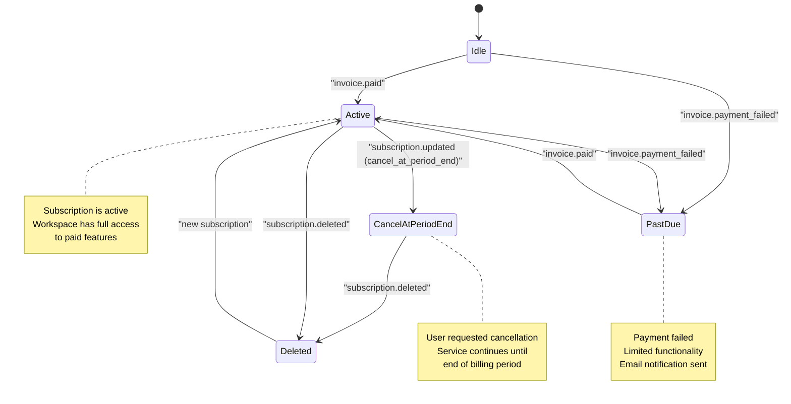
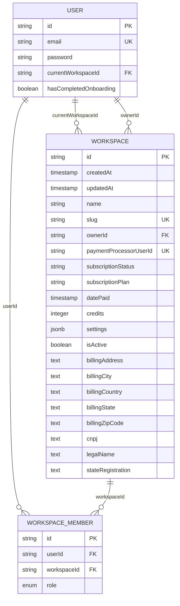
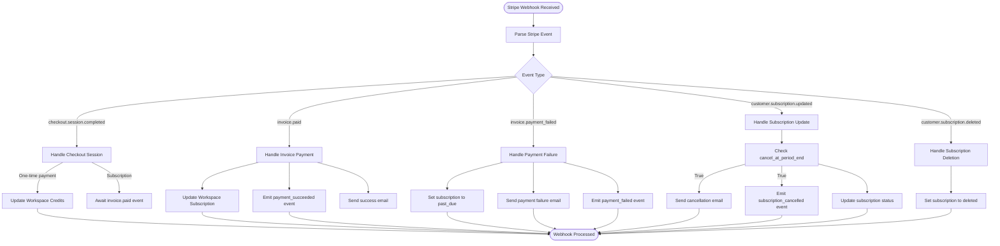

# Core Payment Operations

<cite>
**Referenced Files in This Document**   
- [operations.ts](file://src/core/payment/operations.ts)
- [paymentProcessor.ts](file://src/core/payment/paymentProcessor.ts)
- [stripe/paymentProcessor.ts](file://src/core/payment/stripe/paymentProcessor.ts)
- [plans.ts](file://src/core/payment/plans.ts)
- [planLimits.ts](file://src/core/payment/planLimits.ts)
- [trial.ts](file://src/core/payment/trial.ts)
- [stripe/checkoutUtils.ts](file://src/core/payment/stripe/checkoutUtils.ts)
- [stripe/webhook.ts](file://src/core/payment/stripe/webhook.ts)
- [stripe/stripeClient.ts](file://src/core/payment/stripe/stripeClient.ts)
- [stripe/paymentDetails.ts](file://src/core/payment/stripe/paymentDetails.ts)
- [workspace_payment_migration/migration.sql](file://migrations/20251117002945_workspace_payment_migration/migration.sql)
- [billingg/migration.sql](file://migrations/20251117101503_billingg/migration.sql)
</cite>

## Table of Contents
1. [Introduction](#introduction)
2. [Core Payment Operations](#core-payment-operations)
3. [Payment Processor Interface](#payment-processor-interface)
4. [Payment Plan Management](#payment-plan-management)
5. [Subscription Lifecycle Management](#subscription-lifecycle-management)
6. [Workspace-Based Billing Context](#workspace-based-billing-context)
7. [Stripe Integration and Webhook Handling](#stripe-integration-and-webhook-handling)
8. [Common Issues and Error Handling](#common-issues-and-error-handling)
9. [Conclusion](#conclusion)

## Introduction
The core payment operations system in Sentineliq provides a robust framework for managing subscription billing, one-time payments, and workspace-based financial operations. Built on Stripe as the primary payment processor, the system handles checkout sessions, customer portal access, and invoice retrieval while maintaining tight integration with the application's workspace model. The architecture separates concerns through a payment processor interface, allowing for potential future expansion to other payment providers. This document details the implementation of key operations including generateCheckoutSession, getCustomerPortalUrl, and getStripeInvoices, along with the payment plan management system, trial period handling, and subscription lifecycle management.

## Core Payment Operations

The core payment operations are implemented as server operations that handle user interactions with the payment system. These operations validate user authentication, process payment requests, and interface with the Stripe payment processor.

### generateCheckoutSession Operation
The generateCheckoutSession operation initiates a payment flow by creating a Stripe Checkout session for a specified payment plan. The operation first validates user authentication and email presence, then creates a checkout session through the payment processor interface.



**Diagram sources**
- [operations.ts](file://src/core/payment/operations.ts#L18-L46)
- [stripe/paymentProcessor.ts](file://src/core/payment/stripe/paymentProcessor.ts#L10-L41)
- [stripe/checkoutUtils.ts](file://src/core/payment/stripe/checkoutUtils.ts#L9-L65)

**Section sources**
- [operations.ts](file://src/core/payment/operations.ts#L18-L46)

### getCustomerPortalUrl Operation
The getCustomerPortalUrl operation provides authenticated users with access to their Stripe customer portal, where they can manage their subscription, update payment methods, and view billing history. The implementation is currently configured through an environment variable.

**Section sources**
- [operations.ts](file://src/core/payment/operations.ts#L48-L57)

### getStripeInvoices Operation
The getStripeInvoices operation retrieves invoice history for the user's current workspace from Stripe. It first identifies the workspace context, validates the presence of a Stripe customer ID, and then fetches invoices from the Stripe API.



**Diagram sources**
- [operations.ts](file://src/core/payment/operations.ts#L74-L119)

**Section sources**
- [operations.ts](file://src/core/payment/operations.ts#L74-L119)

## Payment Processor Interface

The payment processor interface provides an abstraction layer between the application and the payment service provider. This interface defines the contract for payment operations and allows for potential future expansion to support multiple payment processors.

```mermaid
classDiagram
class PaymentProcessor {
+id : string
+createCheckoutSession(args : CreateCheckoutSessionArgs) : Promise~{session : {id : string, url : string}}~
+fetchCustomerPortalUrl(args : FetchCustomerPortalUrlArgs) : Promise~string | null~
+webhook : PaymentsWebhook
+webhookMiddlewareConfigFn : MiddlewareConfigFn
}
class StripePaymentProcessor {
+id : 'stripe'
+createCheckoutSession()
+fetchCustomerPortalUrl()
+webhook
+webhookMiddlewareConfigFn
}
PaymentProcessor <|-- StripePaymentProcessor
class CreateCheckoutSessionArgs {
+userId : string
+userEmail : string
+paymentPlan : PaymentPlan
+prismaUserDelegate : PrismaClient['user']
}
class FetchCustomerPortalUrlArgs {
+userId : string
+prismaUserDelegate : PrismaClient['user']
}
class PaymentPlan {
+getPaymentProcessorPlanId() : string
+effect : PaymentPlanEffect
}
```

**Diagram sources**
- [paymentProcessor.ts](file://src/core/payment/paymentProcessor.ts#L7-L30)
- [stripe/paymentProcessor.ts](file://src/core/payment/stripe/paymentProcessor.ts#L10-L46)

**Section sources**
- [paymentProcessor.ts](file://src/core/payment/paymentProcessor.ts#L7-L30)

## Payment Plan Management

The payment plan management system defines available subscription tiers, pricing structures, and feature limits. It supports both subscription-based plans and one-time credit purchases, with configuration driven by environment variables.

### Payment Plan Definitions
The system defines three primary payment plans: Hobby, Pro, and a 10-credit package. Each plan is configured with a Stripe price ID and specifies whether it represents a subscription or credit purchase.



**Diagram sources**
- [plans.ts](file://src/core/payment/plans.ts#L10-L38)

**Section sources**
- [plans.ts](file://src/core/payment/plans.ts#L10-L60)

### Plan Limits and Feature Tiers
The planLimits module defines feature limits for each subscription tier, including workspace members, storage capacity, and module-specific constraints for Aegis and Eclipse. The system supports unlimited resources (indicated by -1) for higher-tier plans.



**Diagram sources**
- [planLimits.ts](file://src/core/payment/planLimits.ts#L10-L142)

**Section sources**
- [planLimits.ts](file://src/core/payment/planLimits.ts#L10-L317)

### Trial Period Handling
The trial system provides temporary access to Pro features for a defined period. The trial configuration is centralized, with functions to calculate trial end dates, check trial status, and determine remaining days.



**Diagram sources**
- [trial.ts](file://src/core/payment/trial.ts#L6-L125)

**Section sources**
- [trial.ts](file://src/core/payment/trial.ts#L6-L125)

## Subscription Lifecycle Management

The subscription lifecycle is managed through Stripe webhooks that update the application's state in response to payment events. The system handles successful payments, failed attempts, subscription updates, and cancellations.



**Diagram sources**
- [stripe/webhook.ts](file://src/core/payment/stripe/webhook.ts#L23-L348)

**Section sources**
- [stripe/webhook.ts](file://src/core/payment/stripe/webhook.ts#L23-L348)

## Workspace-Based Billing Context

The billing system is organized around the workspace model, with payment details and subscription status stored at the workspace level rather than the user level. This allows for team-based billing and shared resource management.

### Database Schema
The workspace payment migration moved billing fields from the User table to the Workspace table, establishing the workspace as the primary billing entity.



**Diagram sources**
- [workspace_payment_migration/migration.sql](file://migrations/20251117002945_workspace_payment_migration/migration.sql#L29-L47)
- [billingg/migration.sql](file://migrations/20251117101503_billingg/migration.sql#L1-L10)

**Section sources**
- [workspace_payment_migration/migration.sql](file://migrations/20251117002945_workspace_payment_migration/migration.sql#L1-L83)

### Payment Details Management
The updateWorkspaceStripePaymentDetails function handles updates to workspace billing information, including subscription status, plan type, and credit balances.

**Section sources**
- [stripe/paymentDetails.ts](file://src/core/payment/stripe/paymentDetails.ts#L5-L28)

## Stripe Integration and Webhook Handling

The Stripe integration is implemented through a dedicated client and webhook handler that processes payment events and updates the application state accordingly.

### Stripe Client Configuration
The Stripe client is configured with API key from environment variables and a specific API version.

**Section sources**
- [stripe/stripeClient.ts](file://src/core/payment/stripe/stripeClient.ts#L1-L13)

### Webhook Processing
The webhook handler processes various Stripe events including checkout completion, invoice payments, and subscription updates. Each event triggers appropriate actions such as updating workspace status and sending notifications.



**Diagram sources**
- [stripe/webhook.ts](file://src/core/payment/stripe/webhook.ts#L23-L348)

**Section sources**
- [stripe/webhook.ts](file://src/core/payment/stripe/webhook.ts#L23-L348)

## Common Issues and Error Handling

The payment system includes comprehensive error handling for common issues such as authentication requirements and missing Stripe customer IDs.

### Authentication Requirements
All payment operations require user authentication, with explicit error handling for unauthenticated requests.

**Section sources**
- [operations.ts](file://src/core/payment/operations.ts#L22-L24)
- [operations.ts](file://src/core/payment/operations.ts#L49-L51)
- [operations.ts](file://src/core/payment/operations.ts#L75-L77)

### Missing Stripe Customer IDs
The getStripeInvoices operation gracefully handles cases where a workspace lacks a Stripe customer ID by returning an empty array rather than throwing an error.

**Section sources**
- [operations.ts](file://src/core/payment/operations.ts#L90-L92)

### Error Types
The system defines specific error types for webhook handling, including UnhandledWebhookEventError for unexpected event types.

**Section sources**
- [errors.ts](file://src/core/payment/errors.ts#L1-L7)

## Conclusion
The core payment operations system in Sentineliq provides a comprehensive solution for managing subscriptions, one-time payments, and workspace-based billing. By leveraging Stripe as the payment processor and organizing billing around the workspace model, the system supports team-based usage while maintaining robust security and error handling. The abstraction through the payment processor interface allows for potential future expansion to additional payment providers, while the comprehensive webhook handling ensures reliable synchronization between Stripe and application state. The integration with workspace context enables features like shared resource limits and team billing, making it well-suited for collaborative environments.