# Payment Processing

<cite>
**Referenced Files in This Document**   
- [stripeClient.ts](file://src/core/payment/stripe/stripeClient.ts)
- [paymentProcessor.ts](file://src/core/payment/stripe/paymentProcessor.ts)
- [webhook.ts](file://src/core/payment/stripe/webhook.ts)
- [checkoutUtils.ts](file://src/core/payment/stripe/checkoutUtils.ts)
- [paymentDetails.ts](file://src/core/payment/stripe/paymentDetails.ts)
- [webhookPayload.ts](file://src/core/payment/stripe/webhookPayload.ts)
- [paymentProcessor.ts](file://src/core/payment/paymentProcessor.ts)
- [plans.ts](file://src/core/payment/plans.ts)
- [trial.ts](file://src/core/payment/trial.ts)
- [operations.ts](file://src/core/payment/operations.ts)
- [errors.ts](file://src/core/payment/errors.ts)
- [PricingPage.tsx](file://src/client/pages/payment/PricingPage.tsx)
- [CheckoutPage.tsx](file://src/client/pages/payment/CheckoutPage.tsx)
- [middlewareConfig.ts](file://src/server/middlewareConfig.ts)
</cite>

## Table of Contents
1. [Introduction](#introduction)
2. [Stripe Integration](#stripe-integration)
3. [Payment Processor Interface](#payment-processor-interface)
4. [Plan Management System](#plan-management-system)
5. [Trial Period Handling](#trial-period-handling)
6. [Subscription Lifecycle Management](#subscription-lifecycle-management)
7. [Webhook Handling](#webhook-handling)
8. [Error Handling](#error-handling)
9. [Security Considerations](#security-considerations)
10. [Best Practices](#best-practices)
11. [Common Issues](#common-issues)

## Introduction
The SentinelIQ payment processing system provides a robust integration with Stripe for handling subscriptions, one-time payments, and credit purchases. The system is designed to support multiple payment plans, trial periods, and comprehensive webhook handling for payment events. This documentation covers the architecture, implementation details, and best practices for working with the payment system.

**Section sources**
- [stripeClient.ts](file://src/core/payment/stripe/stripeClient.ts#L1-L13)
- [paymentProcessor.ts](file://src/core/payment/stripe/paymentProcessor.ts#L1-L55)

## Stripe Integration

### Client Initialization and API Versioning
The Stripe client is initialized with the API key from environment variables and configured with a specific API version to ensure compatibility with the Stripe dashboard configuration. The API version is set to '2025-04-30.basil' to match the dashboard settings.

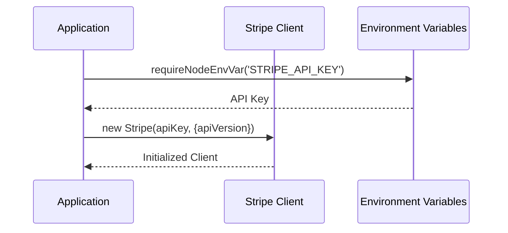

**Diagram sources**
- [stripeClient.ts](file://src/core/payment/stripe/stripeClient.ts#L4-L11)

**Section sources**
- [stripeClient.ts](file://src/core/payment/stripe/stripeClient.ts#L1-L13)

### Checkout Session Creation
The system creates Stripe checkout sessions for both subscription and one-time payment modes. The checkout session includes automatic tax calculation, promotion code support, and customer address updates.

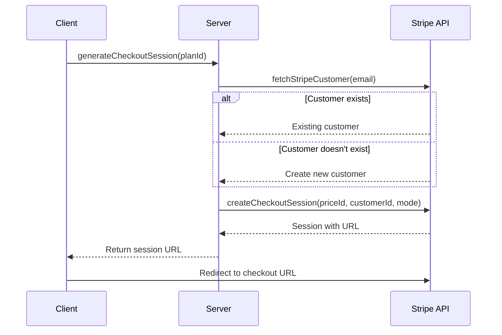

**Diagram sources**
- [paymentProcessor.ts](file://src/core/payment/stripe/paymentProcessor.ts#L10-L41)
- [checkoutUtils.ts](file://src/core/payment/stripe/checkoutUtils.ts#L37-L64)

**Section sources**
- [paymentProcessor.ts](file://src/core/payment/stripe/paymentProcessor.ts#L10-L41)
- [checkoutUtils.ts](file://src/core/payment/stripe/checkoutUtils.ts#L37-L64)

## Payment Processor Interface

### Interface Definition
The payment processor interface defines a contract for payment operations including checkout session creation, customer portal URL retrieval, webhook handling, and middleware configuration.

```mermaid
classDiagram
class PaymentProcessor {
+id : 'stripe'
+createCheckoutSession(args : CreateCheckoutSessionArgs) : Promise<{session : {id : string, url : string}}>
+fetchCustomerPortalUrl(args : FetchCustomerPortalUrlArgs) : Promise<string | null>
+webhook : PaymentsWebhook
+webhookMiddlewareConfigFn : MiddlewareConfigFn
}
class CreateCheckoutSessionArgs {
+userId : string
+userEmail : string
+paymentPlan : PaymentPlan
+prismaUserDelegate : PrismaClient['user']
}
class FetchCustomerPortalUrlArgs {
+userId : string
+prismaUserDelegate : PrismaClient['user']
}
PaymentProcessor <|-- StripePaymentProcessor
```

**Diagram sources**
- [paymentProcessor.ts](file://src/core/payment/paymentProcessor.ts#L18-L24)

**Section sources**
- [paymentProcessor.ts](file://src/core/payment/paymentProcessor.ts#L7-L30)

### Implementation
The Stripe payment processor implementation handles the creation of checkout sessions, updates workspace payment details, and manages customer portal access.

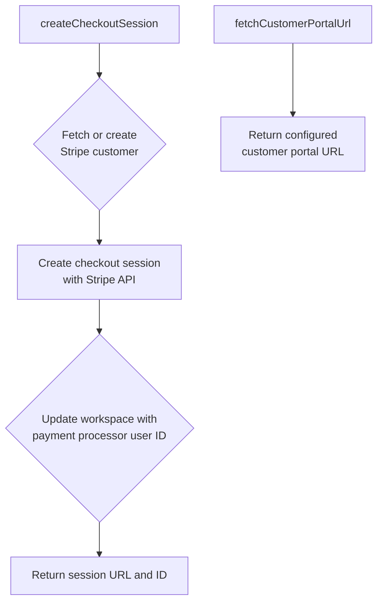

**Diagram sources**
- [paymentProcessor.ts](file://src/core/payment/stripe/paymentProcessor.ts#L10-L43)

**Section sources**
- [paymentProcessor.ts](file://src/core/payment/stripe/paymentProcessor.ts#L10-L43)

## Plan Management System

### Payment Plans Configuration
The system supports multiple payment plans including subscription-based plans (Hobby, Pro) and one-time credit purchases. Each plan is configured with a corresponding Stripe price ID from environment variables.

```mermaid
erDiagram
PLAN {
string id PK
string name
string priceId
string effectType
number creditsAmount
}
PLAN ||--o{ WORKSPACE : "has active"
class PLAN {
Hobby: priceId from PAYMENTS_HOBBY_SUBSCRIPTION_PLAN_ID
Pro: priceId from PAYMENTS_PRO_SUBSCRIPTION_PLAN_ID
Credits10: priceId from PAYMENTS_CREDITS_10_PLAN_ID
}
```

**Diagram sources**
- [plans.ts](file://src/core/payment/plans.ts#L10-L38)

**Section sources**
- [plans.ts](file://src/core/payment/plans.ts#L1-L60)

### Plan Effects
Payment plans have different effects on the system: subscription plans grant ongoing access to features, while credit plans provide a fixed number of credits for usage.

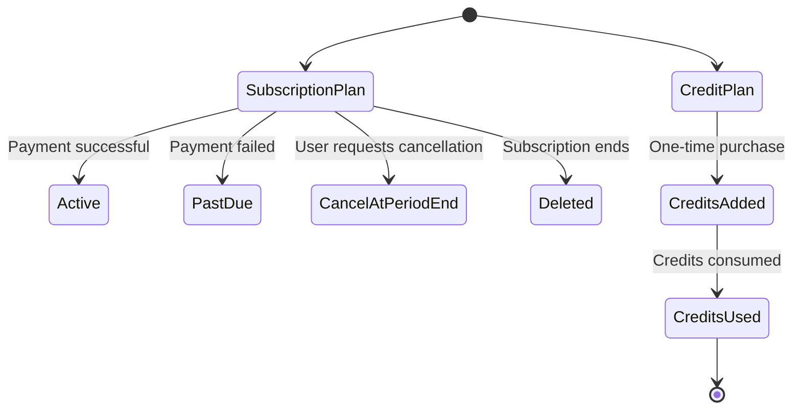

**Diagram sources**
- [plans.ts](file://src/core/payment/plans.ts#L23-L38)

**Section sources**
- [plans.ts](file://src/core/payment/plans.ts#L23-L60)

## Trial Period Handling

### Trial Configuration
The system provides a 14-day trial period for the Pro plan, allowing users to experience premium features before committing to a subscription.

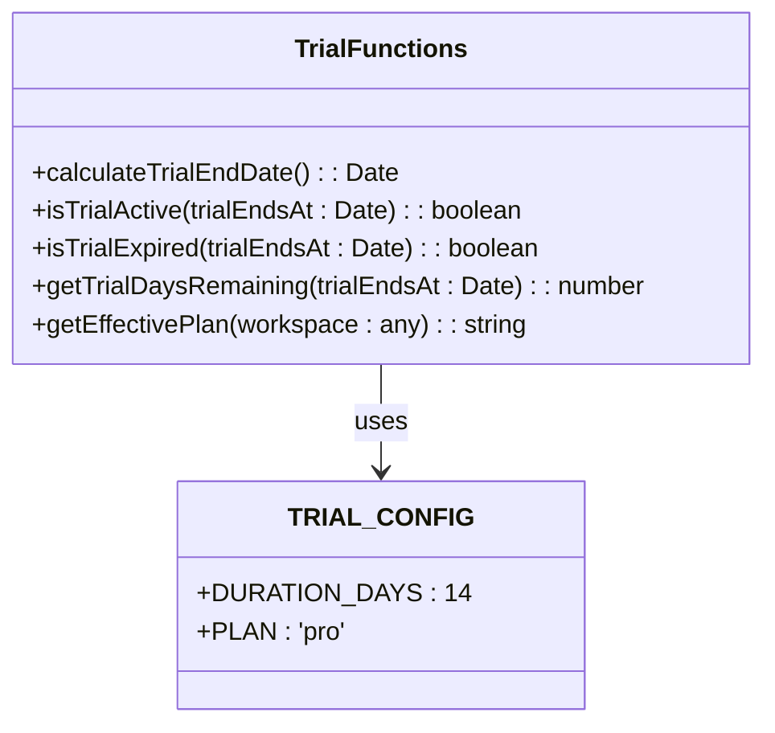

**Diagram sources**
- [trial.ts](file://src/core/payment/trial.ts#L6-L18)
- [trial.ts](file://src/core/payment/trial.ts#L14-L125)

**Section sources**
- [trial.ts](file://src/core/payment/trial.ts#L1-L125)

### Trial State Management
The trial system calculates trial end dates, checks trial status, and determines the effective plan for workspaces considering both trial status and subscription status.

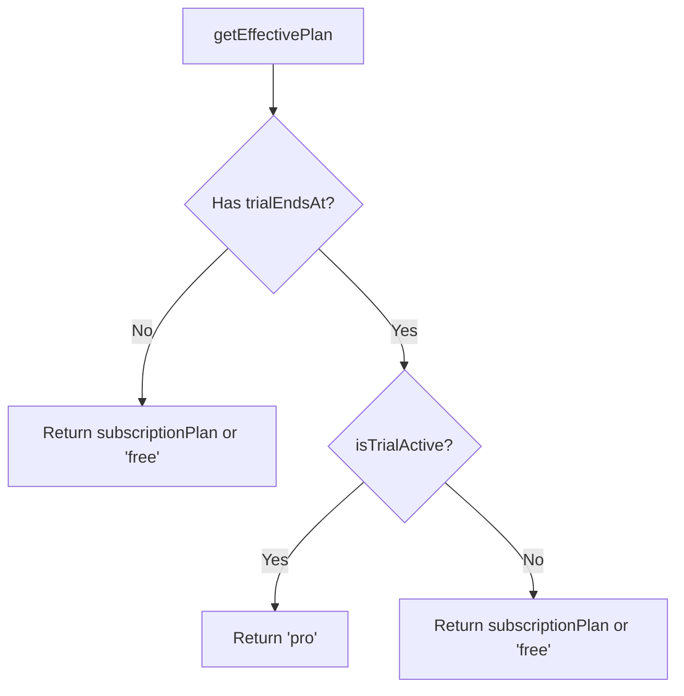

**Diagram sources**
- [trial.ts](file://src/core/payment/trial.ts#L116-L124)

**Section sources**
- [trial.ts](file://src/core/payment/trial.ts#L116-L125)

## Subscription Lifecycle Management

### Subscription Status
The system tracks subscription status through multiple states including active, past due, canceled at period end, and deleted.

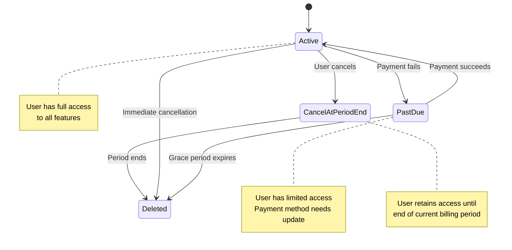

**Diagram sources**
- [plans.ts](file://src/core/payment/plans.ts#L3-L8)

**Section sources**
- [plans.ts](file://src/core/payment/plans.ts#L3-L8)
- [webhook.ts](file://src/core/payment/stripe/webhook.ts#L248-L337)

### Subscription Updates
The system handles subscription updates including plan changes, cancellations, and renewals through Stripe webhook events.

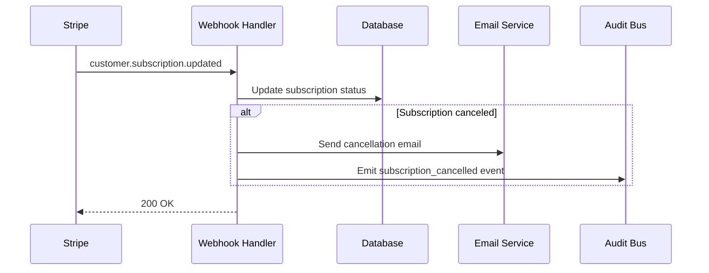

**Diagram sources**
- [webhook.ts](file://src/core/payment/stripe/webhook.ts#L248-L337)

**Section sources**
- [webhook.ts](file://src/core/payment/stripe/webhook.ts#L248-L337)

## Webhook Handling

### Webhook Processing Pipeline
The system implements a comprehensive webhook handling pipeline that processes various Stripe events including checkout completions, invoice payments, and subscription updates.

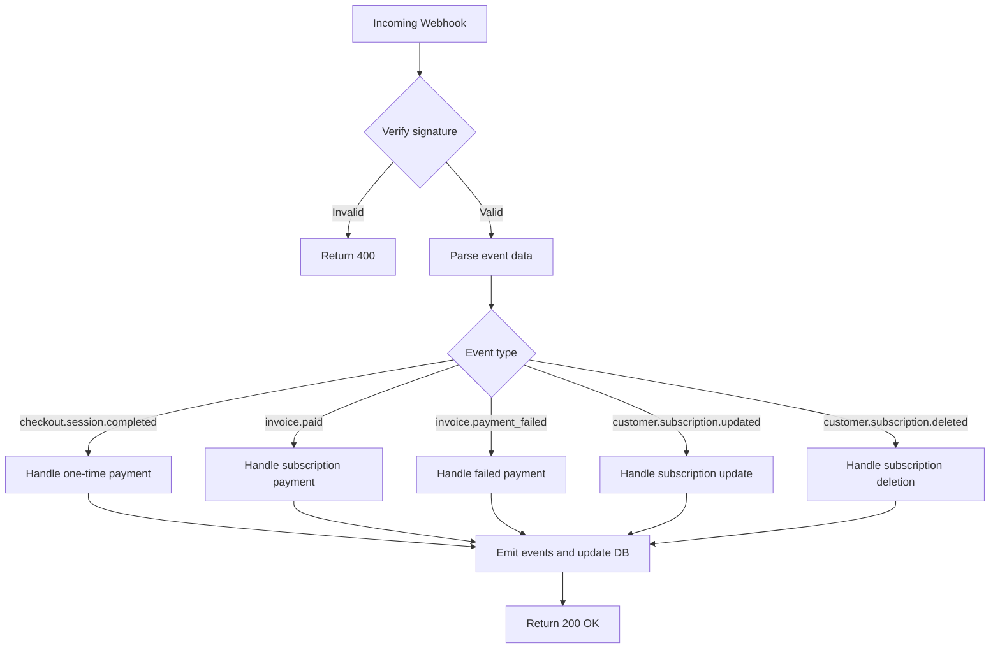

**Diagram sources**
- [webhook.ts](file://src/core/payment/stripe/webhook.ts#L23-L52)

**Section sources**
- [webhook.ts](file://src/core/payment/stripe/webhook.ts#L23-L65)

### Webhook Security
The webhook handler verifies the authenticity of incoming requests using Stripe's signature verification mechanism and configures middleware to handle raw JSON payloads.

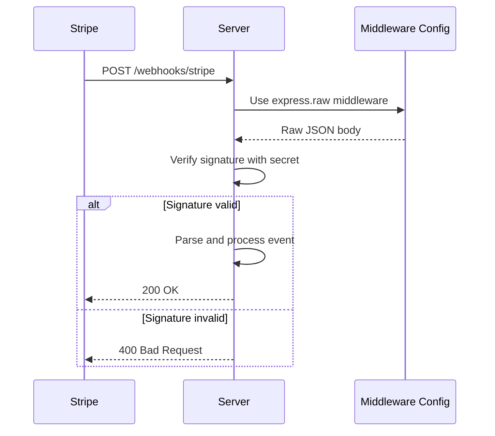

**Diagram sources**
- [webhook.ts](file://src/core/payment/stripe/webhook.ts#L67-L86)
- [middlewareConfig.ts](file://src/server/middlewareConfig.ts#L36-L41)

**Section sources**
- [webhook.ts](file://src/core/payment/stripe/webhook.ts#L67-L86)
- [middlewareConfig.ts](file://src/server/middlewareConfig.ts#L36-L41)

## Error Handling

### Payment Failure Handling
The system handles payment failures by updating the subscription status to past_due and sending notification emails to workspace owners.

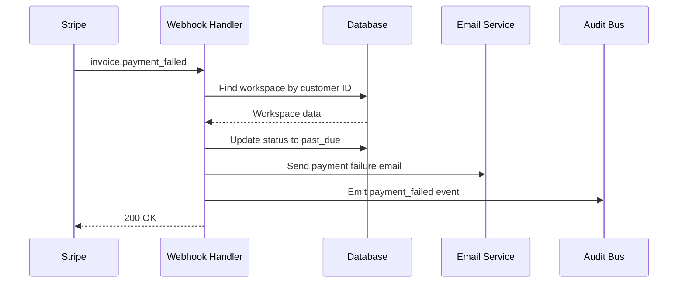

**Diagram sources**
- [webhook.ts](file://src/core/payment/stripe/webhook.ts#L169-L246)

**Section sources**
- [webhook.ts](file://src/core/payment/stripe/webhook.ts#L169-L246)

### Error Types
The system defines specific error types for different payment processing scenarios, including unhandled webhook events.

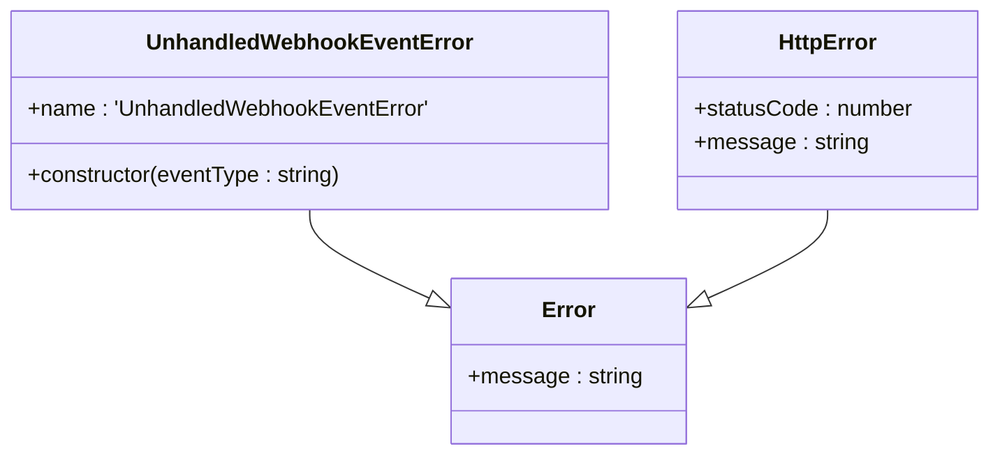

**Diagram sources**
- [errors.ts](file://src/core/payment/errors.ts#L1-L6)

**Section sources**
- [errors.ts](file://src/core/payment/errors.ts#L1-L7)
- [webhook.ts](file://src/core/payment/stripe/webhook.ts#L53-L63)

## Security Considerations

### PCI Compliance
The system follows PCI compliance best practices by not storing sensitive payment information and using Stripe's secure checkout process.

```mermaid
flowchart TD
A[Client] --> |Payment details| B(Stripe Checkout)
B --> |Token| C[Server]
C --> |Token only| D[Stripe API]
D --> |Confirmation| C
C --> |Success/Failure| A
style B fill:#f9f,stroke:#333
note right of B
PCI-compliant payment
processing environment
end note
```

**Section sources**
- [checkoutUtils.ts](file://src/core/payment/stripe/checkoutUtils.ts#L43-L59)

### Environment Variable Security
Payment processor credentials are securely managed through environment variables, preventing hardcoded secrets in the codebase.

```mermaid
flowchart LR
A[Environment] --> |STRIPE_API_KEY| B[stripeClient.ts]
A --> |STRIPE_WEBHOOK_SECRET| C[webhook.ts]
A --> |PAYMENTS_*_PLAN_ID| D[plans.ts]
style A fill:#eef,stroke:#333
note right of A
Secure environment
variable storage
end note
```

**Section sources**
- [stripeClient.ts](file://src/core/payment/stripe/stripeClient.ts#L4-L5)
- [webhook.ts](file://src/core/payment/stripe/webhook.ts#L69-L74)
- [plans.ts](file://src/core/payment/plans.ts#L27-L36)

## Best Practices

### Webhook Verification
Always verify webhook signatures to ensure requests originate from Stripe and not malicious actors.

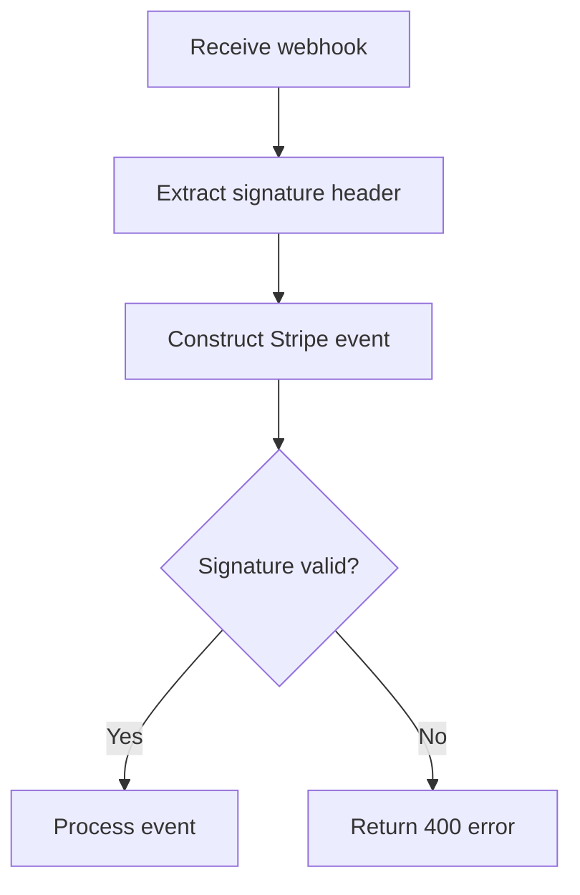

**Section sources**
- [webhook.ts](file://src/core/payment/stripe/webhook.ts#L67-L77)

### Idempotency
Handle webhook events idempotently to prevent duplicate processing in case of retries or duplicate deliveries.

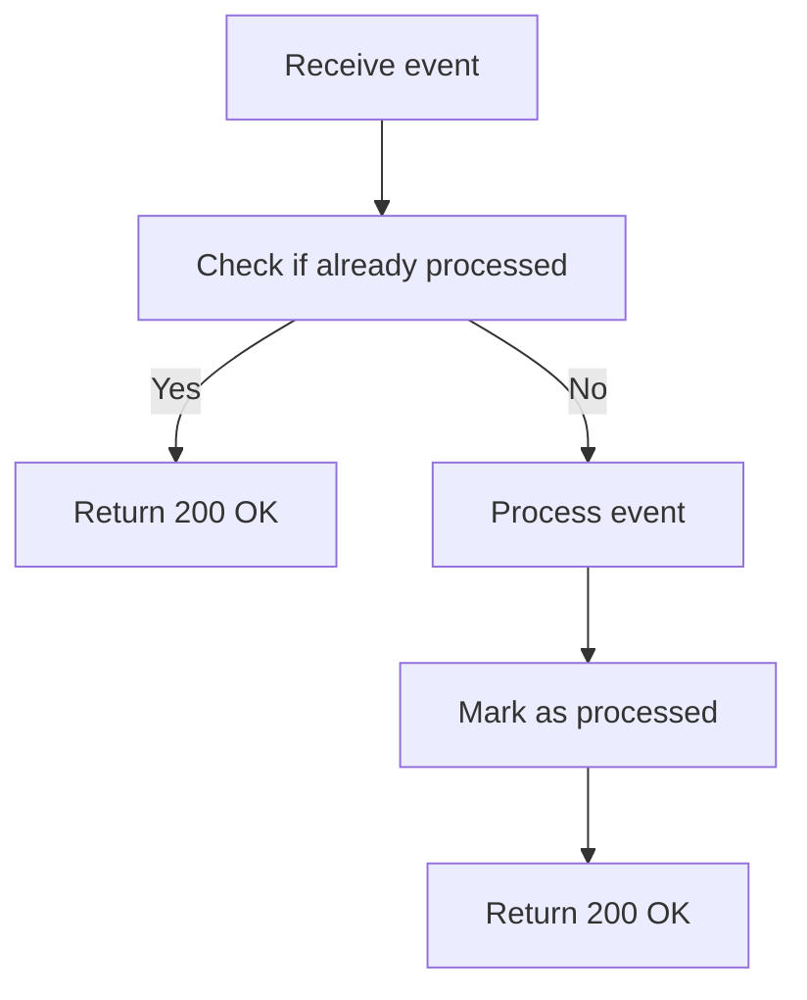

**Section sources**
- [webhook.ts](file://src/core/payment/stripe/webhook.ts#L23-L52)

## Common Issues

### Webhook Delivery Failures
Address webhook delivery failures by ensuring the endpoint is publicly accessible and properly configured in the Stripe dashboard.

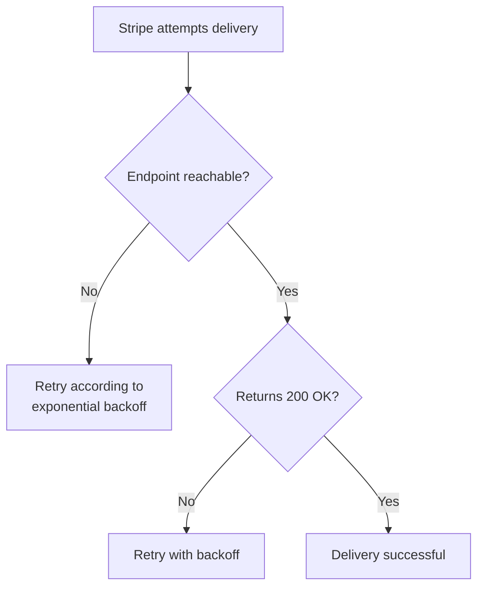

**Section sources**
- [webhook.ts](file://src/core/payment/stripe/webhook.ts#L51-L52)

### Subscription Synchronization
Maintain synchronization between Stripe subscription status and internal database records through reliable webhook processing.

```mermaid
flowchart TD
A[Stripe event] --> B[Webhook handler]
B --> C[Update database]
C --> D[Emit audit event]
D --> E[Send notifications]
E --> F[Return 200 OK]
style B fill:#ff9,stroke:#333
note right of B
Critical: Must update
database before returning 200
end note
```

**Section sources**
- [webhook.ts](file://src/core/payment/stripe/webhook.ts#L23-L52)
- [paymentDetails.ts](file://src/core/payment/stripe/paymentDetails.ts#L5-L27)