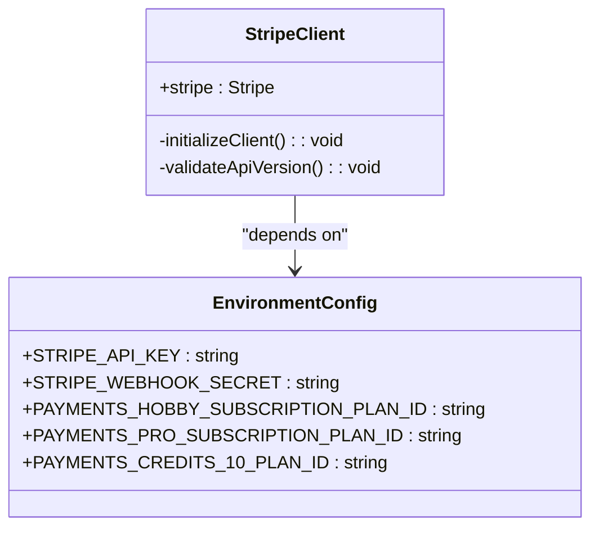
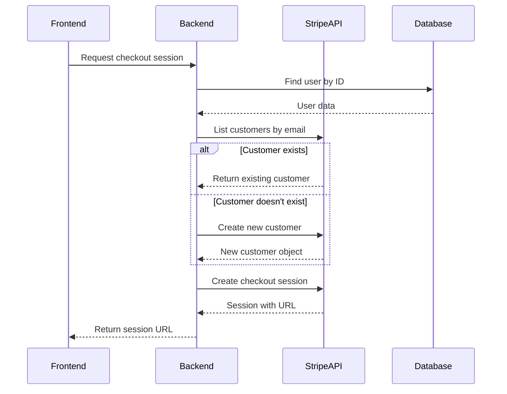
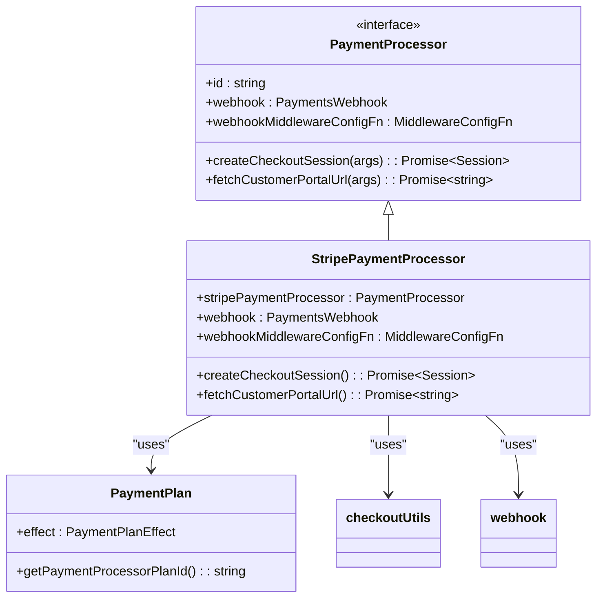
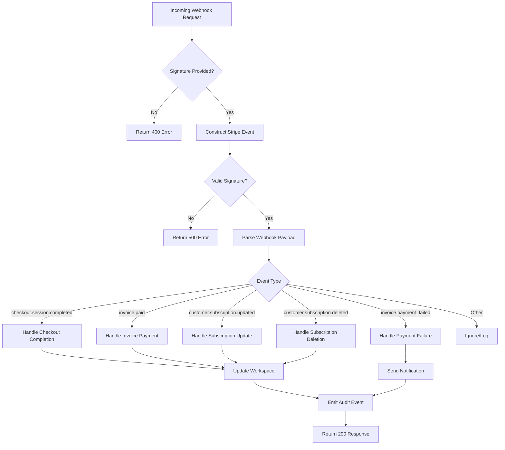
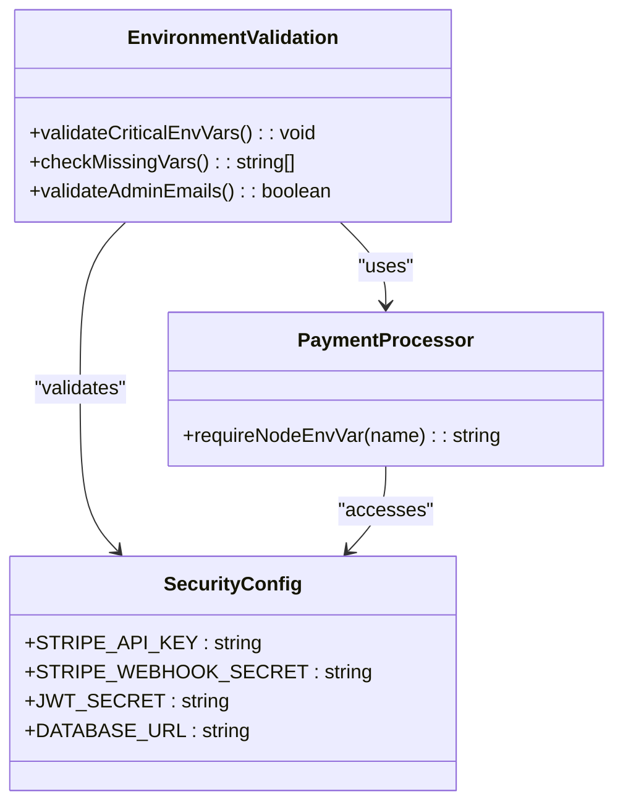
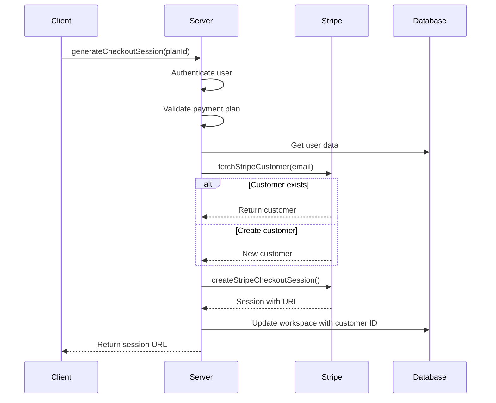
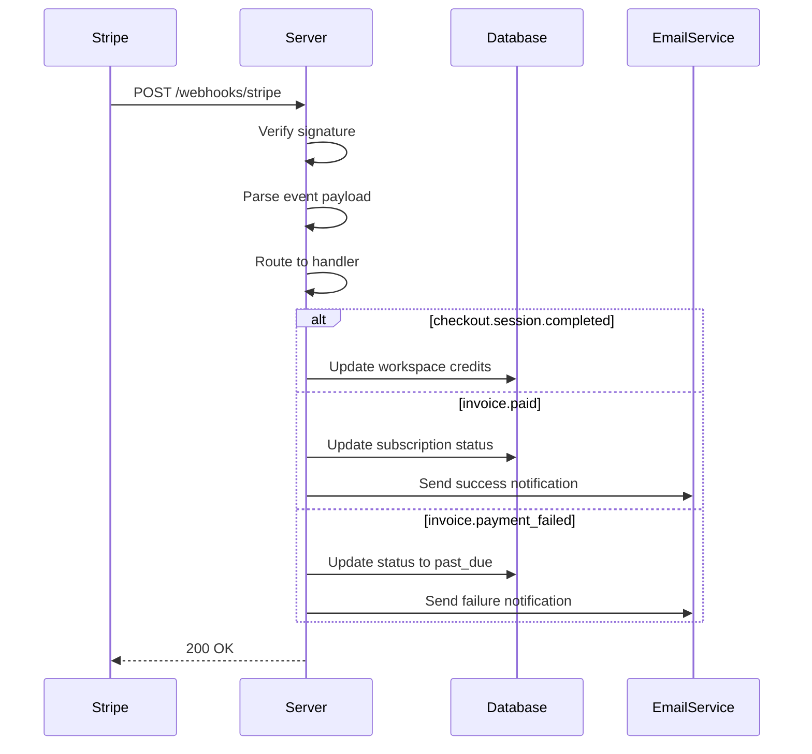
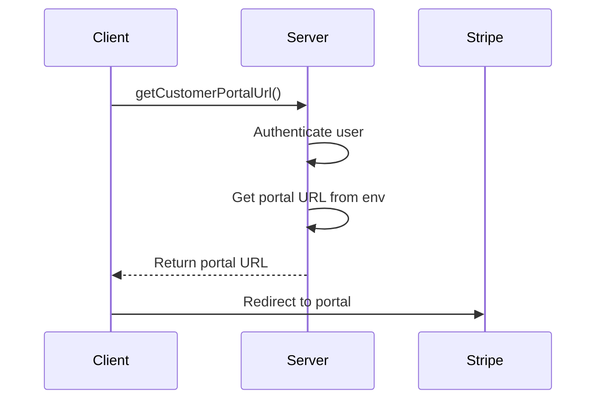

# Stripe Integration

<cite>
**Referenced Files in This Document**   
- [stripeClient.ts](file://src/core/payment/stripe/stripeClient.ts)
- [checkoutUtils.ts](file://src/core/payment/stripe/checkoutUtils.ts)
- [paymentProcessor.ts](file://src/core/payment/stripe/paymentProcessor.ts)
- [webhook.ts](file://src/core/payment/stripe/webhook.ts)
- [webhookPayload.ts](file://src/core/payment/stripe/webhookPayload.ts)
- [paymentDetails.ts](file://src/core/payment/stripe/paymentDetails.ts)
- [plans.ts](file://src/core/payment/plans.ts)
- [paymentProcessor.ts](file://src/core/payment/paymentProcessor.ts)
- [operations.ts](file://src/core/payment/operations.ts)
- [errors.ts](file://src/core/payment/errors.ts)
- [utils.ts](file://src/server/utils.ts)
</cite>

## Table of Contents
1. [Introduction](#introduction)
2. [Stripe Client Initialization](#stripe-client-initialization)
3. [Checkout Session Creation](#checkout-session-creation)
4. [Payment Processor Interface](#payment-processor-interface)
5. [Webhook Event Handling](#webhook-event-handling)
6. [API Key Management and Security](#api-key-management-and-security)
7. [Example Implementations](#example-implementations)
8. [Common Issues and Troubleshooting](#common-issues-and-troubleshooting)
9. [Conclusion](#conclusion)

## Introduction
This document provides comprehensive API documentation for the Stripe integration in SentinelIQ. The integration handles payment processing, subscription management, and webhook event handling for the platform's billing system. The implementation follows a modular architecture with clear separation of concerns between client initialization, checkout session creation, payment processing, and webhook handling.

The Stripe integration supports both subscription-based and one-time payment models, with proper handling of customer lifecycle events including successful payments, failed payments, subscription updates, and cancellations. The system is designed with security, reliability, and auditability in mind, with comprehensive error handling and event logging.

**Section sources**
- [stripeClient.ts](file://src/core/payment/stripe/stripeClient.ts)
- [paymentProcessor.ts](file://src/core/payment/stripe/paymentProcessor.ts)

## Stripe Client Initialization

The Stripe client is initialized with specific API versioning requirements to ensure compatibility with the Stripe dashboard configuration. The client is configured as a singleton instance to maintain consistent settings across the application.

**Diagram sources**
- [stripeClient.ts](file://src/core/payment/stripe/stripeClient.ts)
- [utils.ts](file://src/server/utils.ts)

The Stripe client is initialized in `stripeClient.ts` with the following key configuration:

- **API Key**: Retrieved from the `STRIPE_API_KEY` environment variable using the `requireNodeEnvVar` utility function
- **API Version**: Set to '2025-04-30.basil', which should match the API version configured in the Stripe dashboard
- **Singleton Pattern**: The client is exported as a single instance to ensure consistent configuration

The API version should ideally match the version in your Stripe dashboard. If there's a mismatch, you may need to upgrade or downgrade the Stripe npm package to align with your dashboard's API version. This ensures that the features and behaviors you expect from the Stripe API are consistent between your code and the Stripe dashboard.

**Section sources**
- [stripeClient.ts](file://src/core/payment/stripe/stripeClient.ts)
- [utils.ts](file://src/server/utils.ts)

## Checkout Session Creation

Checkout session creation is handled through the `checkoutUtils` module, which provides functions for managing Stripe customers and creating checkout sessions. The process involves customer lookup or creation, followed by session initialization with appropriate parameters.

**Diagram sources**
- [checkoutUtils.ts](file://src/core/payment/stripe/checkoutUtils.ts)
- [paymentProcessor.ts](file://src/core/payment/stripe/paymentProcessor.ts)

The checkout session creation process involves several key steps:

1. **Customer Management**: The `fetchStripeCustomer` function checks if a customer already exists with the provided email. If not, it creates a new customer in Stripe.
2. **Session Configuration**: The `createStripeCheckoutSession` function creates a checkout session with the specified price ID, customer ID, and mode (subscription or payment).
3. **Domain Configuration**: The DOMAIN constant is set from the WASP_WEB_CLIENT_URL environment variable, defaulting to localhost for development.
4. **Session Parameters**: The checkout session includes automatic tax calculation, promotion code support, and address updates.

The checkout session is configured with success and cancel URLs that redirect back to the application, allowing for proper user flow after payment completion or cancellation.

**Section sources**
- [checkoutUtils.ts](file://src/core/payment/stripe/checkoutUtils.ts)
- [paymentProcessor.ts](file://src/core/payment/stripe/paymentProcessor.ts)

## Payment Processor Interface

The payment processor interface provides a standardized way to interact with the Stripe payment system. It implements the `PaymentProcessor` interface with methods for creating checkout sessions, fetching customer portal URLs, and handling webhooks.

**Diagram sources**
- [paymentProcessor.ts](file://src/core/payment/stripe/paymentProcessor.ts)
- [paymentProcessor.ts](file://src/core/payment/paymentProcessor.ts)
- [plans.ts](file://src/core/payment/plans.ts)

The `stripePaymentProcessor` implementation includes:

- **ID**: Set to 'stripe' to identify the payment processor
- **createCheckoutSession**: Creates a checkout session and updates the workspace with the Stripe customer ID
- **fetchCustomerPortalUrl**: Returns the customer portal URL from environment variables
- **webhook**: References the webhook handler function
- **webhookMiddlewareConfigFn**: Configures middleware for webhook handling

The processor also includes a utility function `paymentPlanEffectToStripeMode` that maps payment plan effects to Stripe modes ('subscription' or 'payment'), ensuring proper checkout session configuration based on the plan type.

**Section sources**
- [paymentProcessor.ts](file://src/core/payment/stripe/paymentProcessor.ts)
- [paymentProcessor.ts](file://src/core/payment/paymentProcessor.ts)

## Webhook Event Handling

Webhook event handling is a critical component of the Stripe integration, responsible for processing payment events and updating the application state accordingly. The webhook system includes signature verification, event parsing, and specific handlers for different event types.

**Diagram sources**
- [webhook.ts](file://src/core/payment/stripe/webhook.ts)
- [webhookPayload.ts](file://src/core/payment/stripe/webhookPayload.ts)

The webhook handling process includes:

1. **Signature Verification**: The `constructStripeEvent` function verifies the webhook signature using the `STRIPE_WEBHOOK_SECRET` environment variable.
2. **Event Parsing**: The `parseWebhookPayload` function validates and parses the webhook payload using Zod schemas.
3. **Event Handling**: Specific handlers process different event types:
   - `checkout.session.completed`: Handles successful one-time payments
   - `invoice.paid`: Handles subscription payments and renewals
   - `invoice.payment_failed`: Handles failed payment attempts
   - `customer.subscription.updated`: Handles subscription status changes
   - `customer.subscription.deleted`: Handles subscription cancellations

Each handler updates the workspace payment details in the database and emits events for audit logging and notifications. The system also sends email notifications to workspace owners for important events like payment failures and subscription cancellations.

**Section sources**
- [webhook.ts](file://src/core/payment/stripe/webhook.ts)
- [webhookPayload.ts](file://src/core/payment/stripe/webhookPayload.ts)
- [paymentDetails.ts](file://src/core/payment/stripe/paymentDetails.ts)

## API Key Management and Security

API key management and security are critical aspects of the Stripe integration. The system uses environment variables to store sensitive credentials and includes validation to ensure required variables are present.

**Diagram sources**
- [utils.ts](file://src/server/utils.ts)
- [stripeClient.ts](file://src/core/payment/stripe/stripeClient.ts)

Key security considerations include:

- **Environment Variables**: All sensitive credentials are stored in environment variables, never in code
- **Validation**: The `validateCriticalEnvVars` function checks for required environment variables at startup
- **Error Handling**: Missing environment variables throw descriptive errors to aid in configuration
- **Webhook Security**: Webhook signatures are verified using the secret key to prevent unauthorized requests
- **Middleware Configuration**: The webhook middleware is configured to parse raw JSON, which is required for signature verification

The system requires the following environment variables for Stripe integration:
- `STRIPE_API_KEY`: Secret key for API authentication
- `STRIPE_WEBHOOK_SECRET`: Secret for webhook signature verification
- `STRIPE_CUSTOMER_PORTAL_URL`: URL for the customer portal
- Payment plan IDs (e.g., `PAYMENTS_HOBBY_SUBSCRIPTION_PLAN_ID`)

**Section sources**
- [utils.ts](file://src/server/utils.ts)
- [stripeClient.ts](file://src/core/payment/stripe/stripeClient.ts)

## Example Implementations

### Creating a Checkout Session
To create a checkout session, use the `generateCheckoutSession` operation which handles the complete flow:

**Diagram sources**
- [operations.ts](file://src/core/payment/operations.ts)
- [checkoutUtils.ts](file://src/core/payment/stripe/checkoutUtils.ts)

### Handling Webhook Events
Webhook events are automatically handled by the configured endpoint:

**Diagram sources**
- [webhook.ts](file://src/core/payment/stripe/webhook.ts)
- [paymentDetails.ts](file://src/core/payment/stripe/paymentDetails.ts)

### Managing Customer Portal Access
The customer portal allows users to manage their subscription:

**Diagram sources**
- [paymentProcessor.ts](file://src/core/payment/stripe/paymentProcessor.ts)
- [operations.ts](file://src/core/payment/operations.ts)

**Section sources**
- [operations.ts](file://src/core/payment/operations.ts)
- [paymentProcessor.ts](file://src/core/payment/stripe/paymentProcessor.ts)

## Common Issues and Troubleshooting

### Webhook Signature Validation Failures
Webhook signature validation failures are typically caused by:
- Incorrect `STRIPE_WEBHOOK_SECRET` environment variable
- Network issues causing payload corruption
- Using the wrong webhook endpoint URL

To troubleshoot:
1. Verify the webhook secret matches the one in the Stripe dashboard
2. Check that the webhook endpoint URL is correctly configured in Stripe
3. Ensure the middleware is configured to parse raw JSON (not regular JSON)

### API Version Mismatches
API version mismatches can cause unexpected behavior or errors. To resolve:
1. Check the API version in `stripeClient.ts` matches the version in your Stripe dashboard
2. Update the Stripe npm package if needed to support your desired API version
3. Test thoroughly after any version changes

### Payment Plan ID Issues
If payment plans are not working:
1. Verify all payment plan ID environment variables are set
2. Check that the plan IDs in Stripe match those expected by the application
3. Ensure the `getPlanIdByPriceId` function can map price IDs to plan IDs correctly

### Customer Creation Issues
Problems with customer creation may indicate:
1. Missing user email (required for Stripe customer creation)
2. API key permissions issues
3. Network connectivity problems with Stripe

**Section sources**
- [webhook.ts](file://src/core/payment/stripe/webhook.ts)
- [stripeClient.ts](file://src/core/payment/stripe/stripeClient.ts)
- [plans.ts](file://src/core/payment/plans.ts)

## Conclusion
The Stripe integration in SentinelIQ provides a robust and secure payment processing system with comprehensive features for subscription management, one-time payments, and webhook event handling. The modular architecture separates concerns between client initialization, checkout session creation, payment processing, and webhook handling, making the system maintainable and extensible.

Key strengths of the implementation include:
- Proper API version management to ensure compatibility
- Comprehensive webhook handling with signature verification
- Clear separation of concerns through well-defined interfaces
- Robust error handling and logging
- Integration with audit logging and notification systems

The system is designed to be secure, with sensitive credentials stored in environment variables and proper validation of webhook signatures. It also provides a good user experience with proper redirection after checkout and customer portal access for subscription management.

For optimal operation, ensure that environment variables are properly configured, API versions are aligned between code and dashboard, and webhook endpoints are correctly set up in the Stripe dashboard.

**Section sources**
- [stripeClient.ts](file://src/core/payment/stripe/stripeClient.ts)
- [paymentProcessor.ts](file://src/core/payment/stripe/paymentProcessor.ts)
- [webhook.ts](file://src/core/payment/stripe/webhook.ts)