# Aegis Module (Incident Response)

<cite>
**Referenced Files in This Document**   
- [aegis.types.ts](file://src/client/pages/modules/aegis/types/aegis.types.ts)
- [types.ts](file://src/core/modules/aegis/models/types.ts)
- [alerts/operations.ts](file://src/core/modules/aegis/alerts/operations.ts)
- [cases/operations.ts](file://src/core/modules/aegis/cases/operations.ts)
- [incidents/operations.ts](file://src/core/modules/aegis/incidents/operations.ts)
- [evidence/operations.ts](file://src/core/modules/aegis/evidence/operations.ts)
- [observables/operations.ts](file://src/core/modules/aegis/observables/operations.ts)
- [timeline/operations.ts](file://src/core/modules/aegis/timeline/operations.ts)
- [EnhancedAlertForm.tsx](file://src/client/pages/modules/aegis/components/forms/EnhancedAlertForm.tsx)
- [CreateCaseFromAlert.tsx](file://src/client/pages/modules/aegis/components/CreateCaseFromAlert.tsx)
- [ChainOfCustody.tsx](file://src/client/pages/modules/aegis/components/ChainOfCustody.tsx)
- [Timeline.tsx](file://src/client/pages/modules/aegis/components/Timeline.tsx)
</cite>

## Table of Contents
1. [Introduction](#introduction)
2. [Domain Model](#domain-model)
3. [Alert Handling](#alert-handling)
4. [Case Management](#case-management)
5. [Chain of Custody Tracking](#chain-of-custody-tracking)
6. [Timeline Visualization](#timeline-visualization)
7. [Bulk Operations](#bulk-operations)
8. [Common Issues and Solutions](#common-issues-and-solutions)

## Introduction
The Aegis module provides a comprehensive incident response and case management system for security operations. It enables security teams to manage alerts, create investigation cases, track evidence with chain of custody, and visualize incident timelines. The system supports integration with threat intelligence, MITRE ATT&CK framework, and various notification channels.

**Section sources**
- [aegis.types.ts](file://src/client/pages/modules/aegis/types/aegis.types.ts)
- [types.ts](file://src/core/modules/aegis/models/types.ts)

## Domain Model
The Aegis module implements a rich domain model for incident response, consisting of interconnected entities that represent the security investigation lifecycle.

### Core Entities
The system revolves around five primary entities that form the foundation of incident response:

- **Alerts**: Security events detected by monitoring systems, representing potential threats
- **Incidents**: Confirmed security events that require investigation and response
- **Cases**: Formal investigations that may encompass multiple related incidents
- **Observables**: Indicators of Compromise (IOCs) such as IPs, domains, hashes, and URLs
- **Evidence**: Digital artifacts collected during investigations, with integrity verification

### Entity Relationships
These entities are interconnected through a well-defined relationship model:

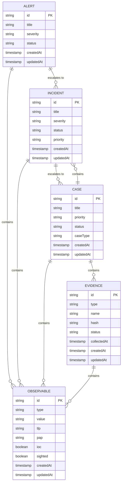

**Diagram sources**
- [types.ts](file://src/core/modules/aegis/models/types.ts)
- [aegis.types.ts](file://src/client/pages/modules/aegis/types/aegis.types.ts)

**Section sources**
- [types.ts](file://src/core/modules/aegis/models/types.ts)
- [aegis.types.ts](file://src/client/pages/modules/aegis/types/aegis.types.ts)

## Alert Handling
The alert handling system provides comprehensive functionality for managing security alerts from detection to resolution.

### Alert Lifecycle
Alerts progress through a defined lifecycle with specific status transitions:

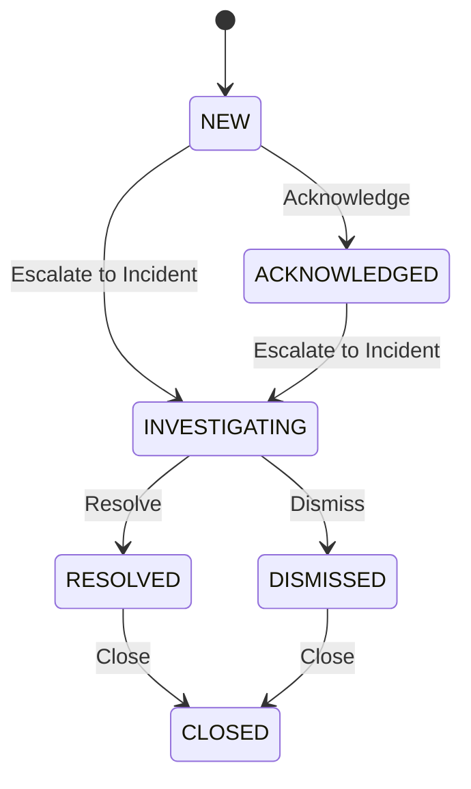

**Diagram sources**
- [alerts/operations.ts](file://src/core/modules/aegis/alerts/operations.ts)

### Alert Creation and Management
The system provides robust APIs for creating and managing alerts:

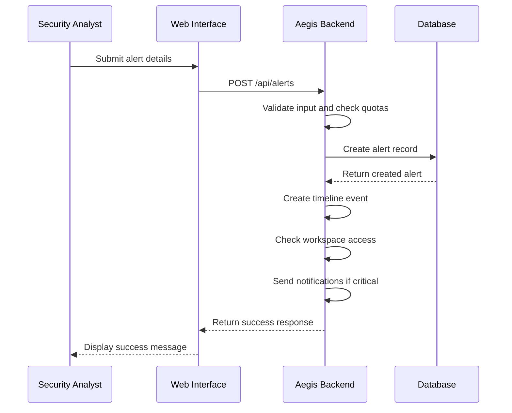

**Diagram sources**
- [alerts/operations.ts](file://src/core/modules/aegis/alerts/operations.ts)
- [EnhancedAlertForm.tsx](file://src/client/pages/modules/aegis/components/forms/EnhancedAlertForm.tsx)

### Alert Status Transitions
The system supports various status transitions through dedicated operations:

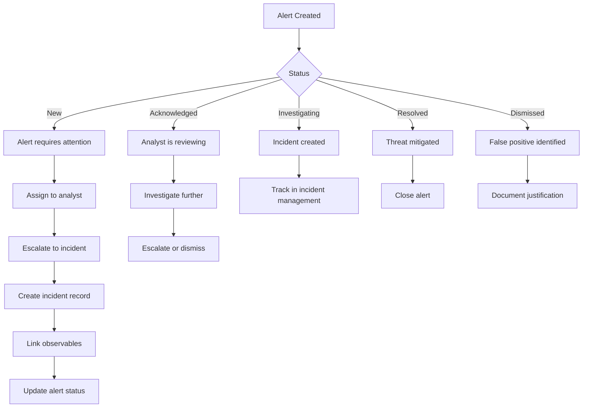

**Diagram sources**
- [alerts/operations.ts](file://src/core/modules/aegis/alerts/operations.ts)

**Section sources**
- [alerts/operations.ts](file://src/core/modules/aegis/alerts/operations.ts)
- [EnhancedAlertForm.tsx](file://src/client/pages/modules/aegis/components/forms/EnhancedAlertForm.tsx)

## Case Management
The case management system provides comprehensive functionality for creating and managing investigation cases.

### Case Creation from Alerts
The system supports creating cases directly from alerts, with options to inherit observables and close the source alert:

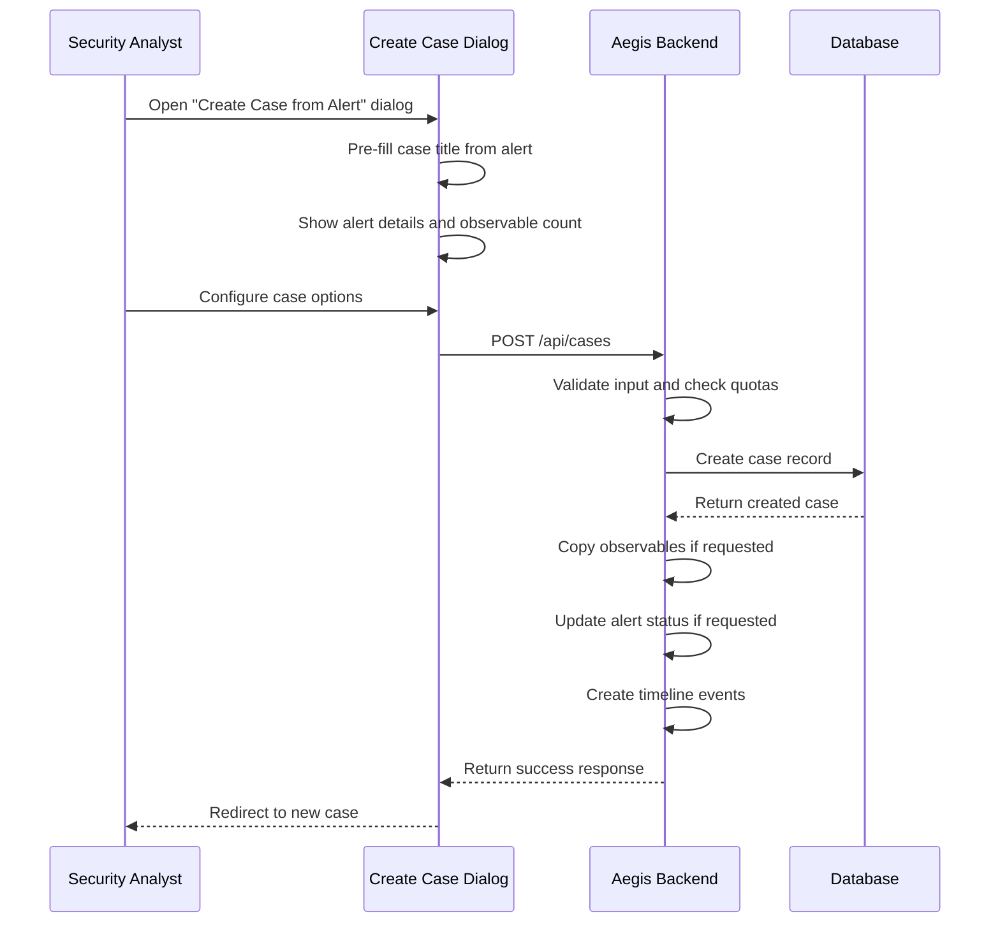

**Diagram sources**
- [cases/operations.ts](file://src/core/modules/aegis/cases/operations.ts)
- [CreateCaseFromAlert.tsx](file://src/client/pages/modules/aegis/components/CreateCaseFromAlert.tsx)

### Case Lifecycle
Cases follow a structured lifecycle from creation to closure:

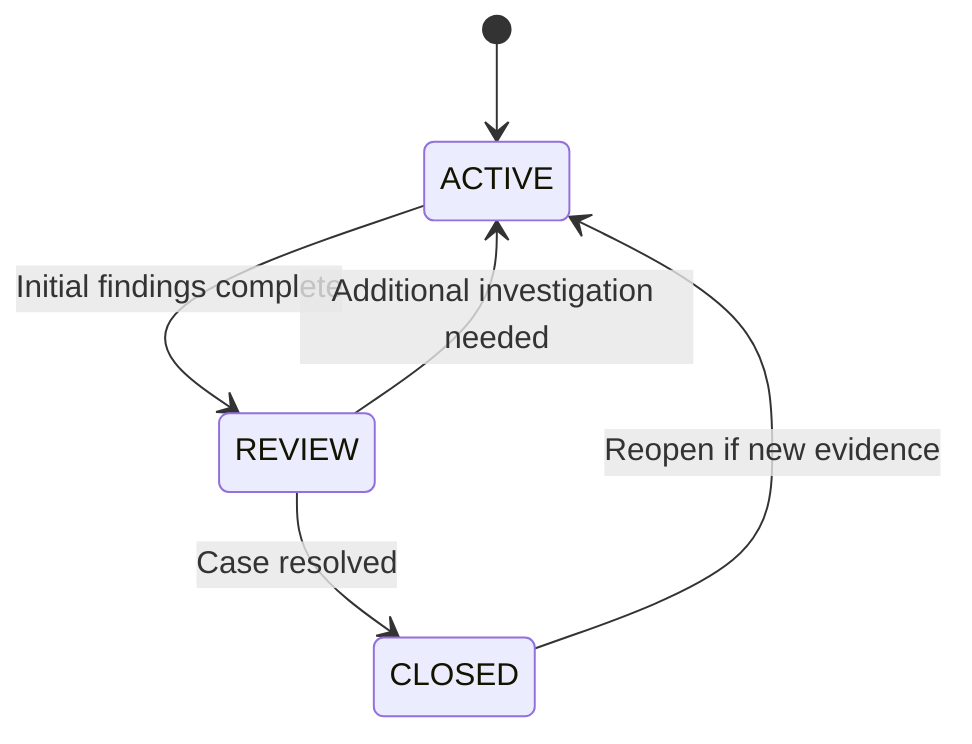

**Diagram sources**
- [cases/operations.ts](file://src/core/modules/aegis/cases/operations.ts)

### Case Operations
The system provides comprehensive operations for managing cases:

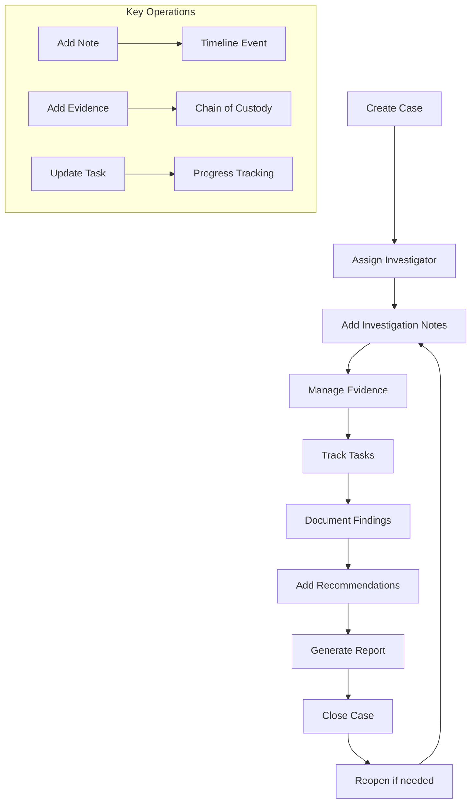

**Diagram sources**
- [cases/operations.ts](file://src/core/modules/aegis/cases/operations.ts)

**Section sources**
- [cases/operations.ts](file://src/core/modules/aegis/cases/operations.ts)
- [CreateCaseFromAlert.tsx](file://src/client/pages/modules/aegis/components/CreateCaseFromAlert.tsx)

## Chain of Custody Tracking
The system implements a robust chain of custody mechanism to ensure evidence integrity throughout the investigation process.

### Custody Actions
The system tracks various custody actions that can be performed on evidence:

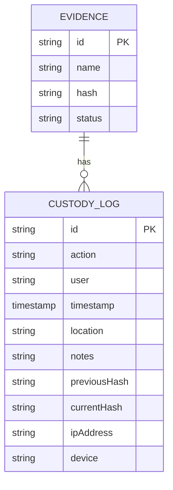

**Diagram sources**
- [evidence/operations.ts](file://src/core/modules/aegis/evidence/operations.ts)

### Custody Workflow
The chain of custody follows a strict workflow to maintain evidence integrity:

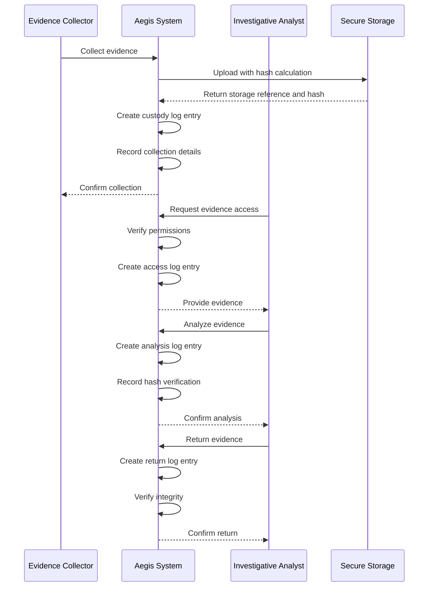

**Diagram sources**
- [evidence/operations.ts](file://src/core/modules/aegis/evidence/operations.ts)

### Integrity Verification
The system implements cryptographic hash verification to ensure evidence integrity:

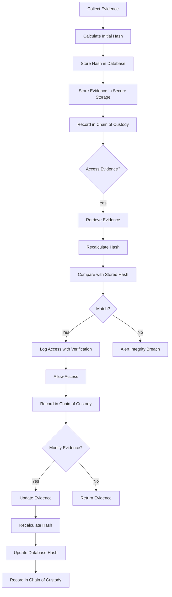

**Diagram sources**
- [evidence/operations.ts](file://src/core/modules/aegis/evidence/operations.ts)
- [ChainOfCustody.tsx](file://src/client/pages/modules/aegis/components/ChainOfCustody.tsx)

**Section sources**
- [evidence/operations.ts](file://src/core/modules/aegis/evidence/operations.ts)
- [ChainOfCustody.tsx](file://src/client/pages/modules/aegis/components/ChainOfCustody.tsx)

## Timeline Visualization
The system provides comprehensive timeline visualization for tracking incident response activities.

### Timeline Components
The timeline displays various event types with distinct visual indicators:

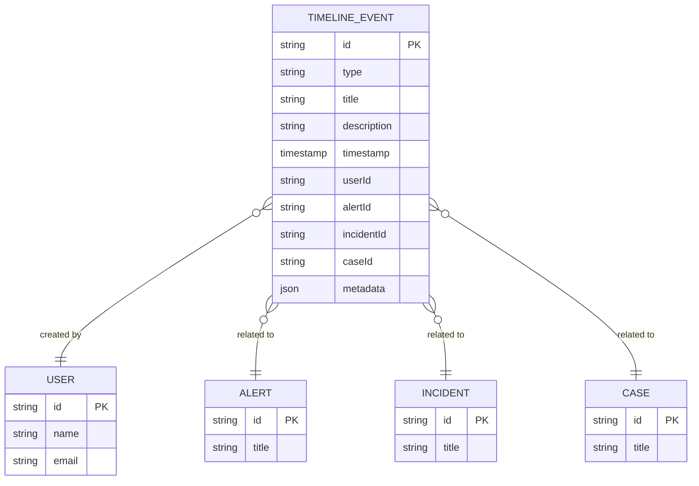

**Diagram sources**
- [timeline/operations.ts](file://src/core/modules/aegis/timeline/operations.ts)

### Event Types and Visualization
The system supports different event types with appropriate visual representation:

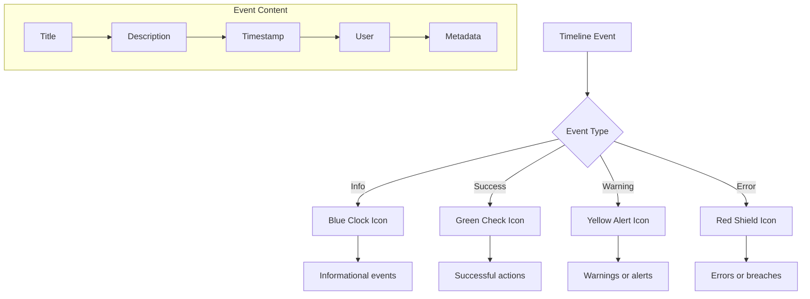

**Diagram sources**
- [timeline/operations.ts](file://src/core/modules/aegis/timeline/operations.ts)
- [Timeline.tsx](file://src/client/pages/modules/aegis/components/Timeline.tsx)

### Timeline Generation
The system automatically generates timeline events for key actions:

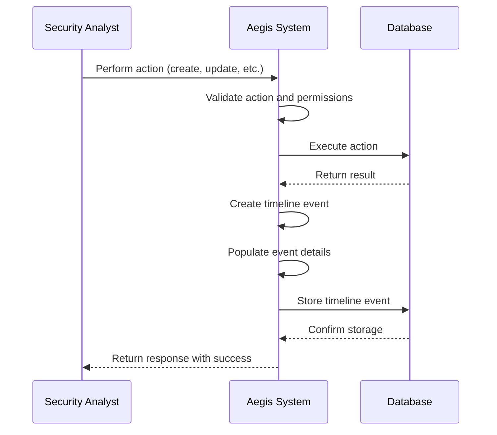

**Diagram sources**
- [timeline/operations.ts](file://src/core/modules/aegis/timeline/operations.ts)

**Section sources**
- [timeline/operations.ts](file://src/core/modules/aegis/timeline/operations.ts)
- [Timeline.tsx](file://src/client/pages/modules/aegis/components/Timeline.tsx)

## Bulk Operations
The system supports various bulk operations to improve efficiency in incident response.

### Bulk Operation Types
The system supports several types of bulk operations:

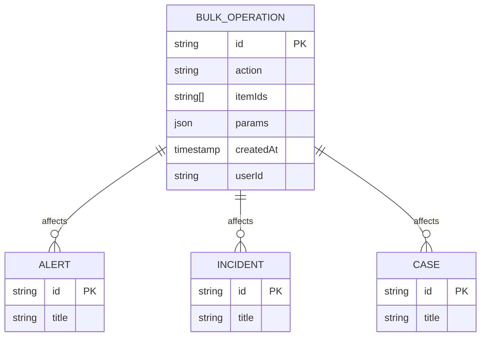

**Diagram sources**
- [alerts/operations.ts](file://src/core/modules/aegis/alerts/operations.ts)
- [cases/operations.ts](file://src/core/modules/aegis/cases/operations.ts)

### Bulk Update Workflow
The system processes bulk updates with error handling and reporting:

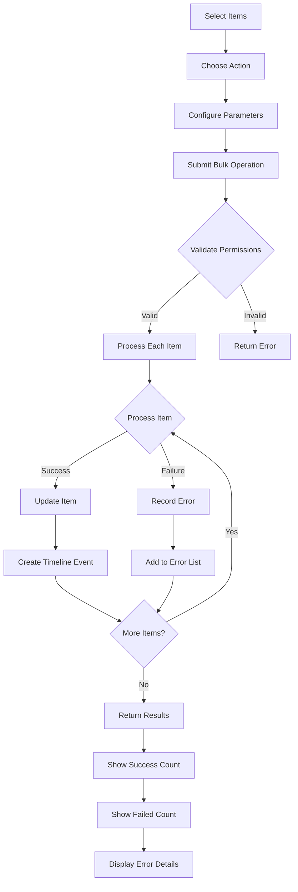

**Diagram sources**
- [alerts/operations.ts](file://src/core/modules/aegis/alerts/operations.ts)
- [cases/operations.ts](file://src/core/modules/aegis/cases/operations.ts)

**Section sources**
- [alerts/operations.ts](file://src/core/modules/aegis/alerts/operations.ts)
- [cases/operations.ts](file://src/core/modules/aegis/cases/operations.ts)

## Common Issues and Solutions
This section addresses common issues encountered in incident response workflows and their solutions.

### Alert Overload
**Issue**: Security teams receive too many alerts, leading to alert fatigue and missed critical threats.

**Solution**: Implement alert prioritization and filtering:
- Use severity levels (Critical, High, Medium, Low) to prioritize response
- Apply automated filtering based on known false positives
- Implement alert deduplication to reduce noise
- Use machine learning to identify patterns and reduce false positives

### Evidence Integrity Concerns
**Issue**: Concerns about evidence tampering or integrity loss during investigations.

**Solution**: Implement robust chain of custody:
- Use cryptographic hashing (MD5, SHA-1, SHA-256) to verify integrity
- Maintain detailed custody logs with timestamps and user information
- Implement role-based access control for evidence access
- Use digital signatures for critical evidence

### Investigation Delays
**Issue**: Investigations take too long to complete, allowing threats to persist.

**Solution**: Streamline investigation processes:
- Create standardized investigation templates for common threat types
- Automate evidence collection and enrichment
- Implement SLA tracking for critical incidents
- Use task management to track investigation progress

### Communication Gaps
**Issue**: Poor communication between team members during investigations.

**Solution**: Enhance collaboration features:
- Implement real-time notifications for case updates
- Use @mentions in investigation notes to notify team members
- Integrate with external communication tools (Slack, Teams)
- Provide comprehensive case reports for stakeholders

### Data Silos
**Issue**: Investigation data is scattered across multiple systems.

**Solution**: Centralize incident data:
- Integrate with SIEM, EDR, and other security tools
- Correlate alerts from different sources into unified incidents
- Provide a single interface for all investigation activities
- Enable cross-referencing of observables across cases

**Section sources**
- [alerts/operations.ts](file://src/core/modules/aegis/alerts/operations.ts)
- [cases/operations.ts](file://src/core/modules/aegis/cases/operations.ts)
- [evidence/operations.ts](file://src/core/modules/aegis/evidence/operations.ts)
- [timeline/operations.ts](file://src/core/modules/aegis/timeline/operations.ts)