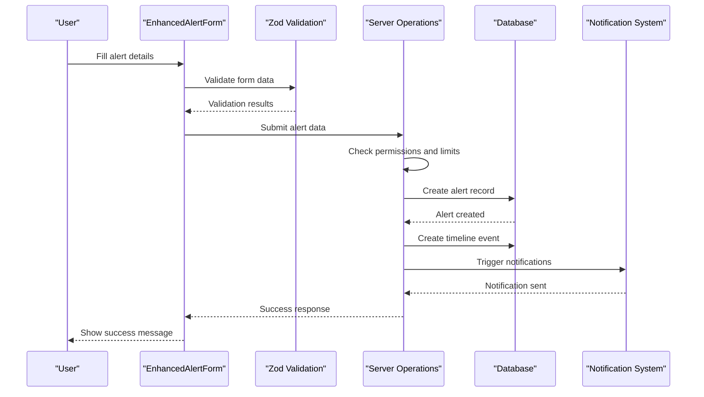
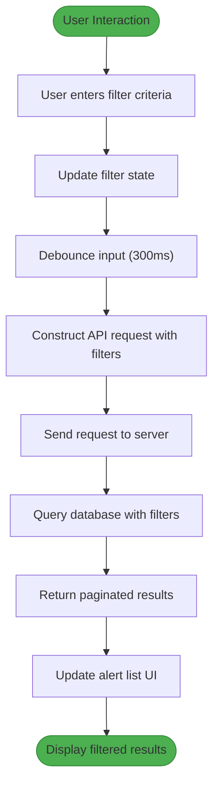
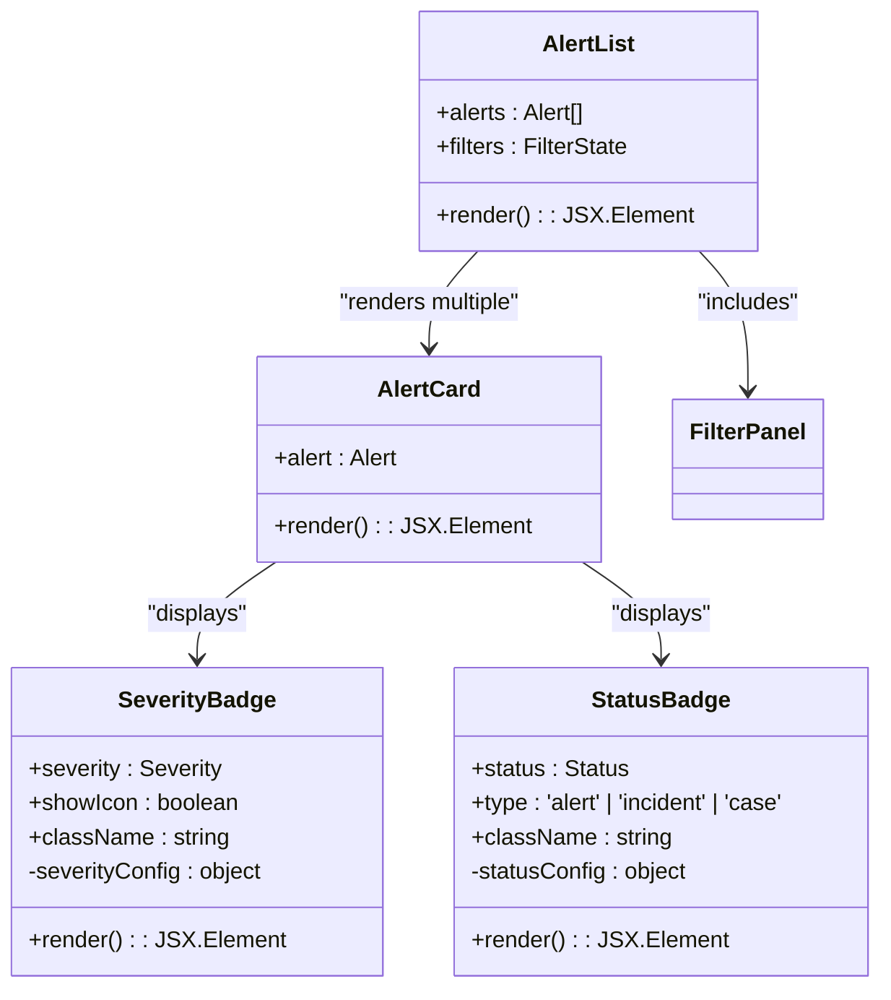
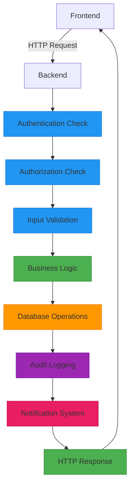

# Alert Management

<cite>
**Referenced Files in This Document**   
- [EnhancedAlertForm.tsx](file://src/client/pages/modules/aegis/components/forms/EnhancedAlertForm.tsx)
- [FilterPanel.tsx](file://src/client/pages/modules/aegis/components/FilterPanel.tsx)
- [aegis.types.ts](file://src/client/pages/modules/aegis/types/aegis.types.ts)
- [ValidationSchemas.ts](file://src/client/pages/modules/aegis/components/validation/ValidationSchemas.ts)
- [ErrorHandling.tsx](file://src/client/pages/modules/aegis/components/error/ErrorHandling.tsx)
- [SeverityBadge.tsx](file://src/client/pages/modules/aegis/components/SeverityBadge.tsx)
- [StatusBadge.tsx](file://src/client/pages/modules/aegis/components/StatusBadge.tsx)
- [TTPsList.tsx](file://src/client/pages/modules/aegis/components/TTPsList.tsx)
- [operations.ts](file://src/core/modules/aegis/alerts/operations.ts)
- [types.ts](file://src/core/modules/aegis/models/types.ts)
</cite>

## Table of Contents
1. [Introduction](#introduction)
2. [Alert Domain Model](#alert-domain-model)
3. [Alert Creation Workflow](#alert-creation-workflow)
4. [EnhancedAlertForm Component](#enhancedalertform-component)
5. [Filtering and Real-time Search](#filtering-and-real-time-search)
6. [FilterPanel Component](#filterpanel-component)
7. [UI Display and Status Indicators](#ui-display-and-status-indicators)
8. [Backend Operations](#backend-operations)
9. [Common Issues and Optimization](#common-issues-and-optimization)
10. [Conclusion](#conclusion)

## Introduction
The Alert Management feature in the Aegis module provides a comprehensive system for creating, filtering, and managing security alerts. This documentation details the implementation of key components including the EnhancedAlertForm and FilterPanel, explains the alert domain model with severity and status indicators, and describes the integration between frontend components and backend operations. The system supports real-time filtering, form validation, and efficient handling of large alert sets while addressing common issues like duplicate alerts and false positives.

## Alert Domain Model
The alert domain model in the Aegis module is designed to capture comprehensive security incident data with standardized fields for severity, status, observables, and MITRE ATT&CK TTPs (Tactics, Techniques, and Procedures). The model follows a structured approach to ensure consistency across the security operations workflow.

The core alert entity contains essential fields including title, description, severity, status, source, category, and metadata. Severity levels are defined as critical, high, medium, and low, providing a standardized way to prioritize alerts based on potential impact. Status values include new, acknowledged, investigating, resolved, and dismissed, representing the lifecycle of an alert from detection to closure.

Alerts are enriched with observables such as IP addresses, domains, URLs, file hashes, and email addresses, each with associated threat intelligence data including TLP (Traffic Light Protocol) and PAP (Permissible Actions Protocol) markings. The integration with MITRE ATT&CK framework allows analysts to map detected activities to specific tactics and techniques, providing context for the nature of the threat.

Each alert maintains a timeline of events, tracking all modifications and investigative actions taken. The model also supports custom fields, tags, and metadata to accommodate organization-specific requirements and facilitate advanced filtering and reporting capabilities.

**Section sources**
- [aegis.types.ts](file://src/client/pages/modules/aegis/types/aegis.types.ts#L3-L272)
- [types.ts](file://src/core/modules/aegis/models/types.ts#L201-L230)

## Alert Creation Workflow
The alert creation workflow in the Aegis module follows a structured process from form submission to backend persistence and notification. When a user creates a new alert through the EnhancedAlertForm component, the data undergoes client-side validation before being transmitted to the server.

The workflow begins with the user filling out the alert form with required information including title, description, severity, and source. As the user interacts with the form, real-time validation ensures data quality by checking field requirements, format constraints, and business rules. The validation system uses Zod schemas to define field requirements and generate appropriate error messages.

Upon submission, the form data is processed through a submission handler that manages the asynchronous operation with loading states and error handling. The validated data is sent to the backend via the createAlert operation, which performs additional server-side validation and business logic checks. The backend verifies workspace access permissions, enforces plan limits on alert creation, and ensures data integrity before persisting the alert to the database.

After successful creation, the system generates a timeline event recording the alert creation, updates relevant statistics, and triggers notifications to appropriate stakeholders based on alert severity. Critical alerts automatically notify workspace owners and administrators through configured notification channels. The entire workflow is designed to be resilient, with proper error handling and user feedback at each stage.

**Diagram sources **
- [EnhancedAlertForm.tsx](file://src/client/pages/modules/aegis/components/forms/EnhancedAlertForm.tsx#L130-L169)
- [operations.ts](file://src/core/modules/aegis/alerts/operations.ts#L212-L293)
- [ErrorHandling.tsx](file://src/client/pages/modules/aegis/components/error/ErrorHandling.tsx#L334-L370)

**Section sources**
- [EnhancedAlertForm.tsx](file://src/client/pages/modules/aegis/components/forms/EnhancedAlertForm.tsx#L130-L169)
- [operations.ts](file://src/core/modules/aegis/alerts/operations.ts#L212-L293)
- [ErrorHandling.tsx](file://src/client/pages/modules/aegis/components/error/ErrorHandling.tsx#L334-L370)

## EnhancedAlertForm Component
The EnhancedAlertForm component provides a user-friendly interface for creating and editing security alerts with comprehensive validation and error handling. Implemented as a React component using the react-hook-form library, it offers both full and quick variants to accommodate different user needs and workflows.

The component accepts several props including initialData for editing existing alerts, onSuccess and onCancel callbacks for handling form completion, and a variant parameter to specify whether to display the full form or a simplified quick form. The form manages its state using react-hook-form's useForm hook, which handles form data, validation, and submission state.

Key features of the EnhancedAlertForm include:
- Client-side validation using Zod schemas for data integrity
- Real-time error feedback with descriptive messages
- Support for both full and quick alert creation modes
- Integration with error boundaries for robust error handling
- Loading states during submission to prevent duplicate submissions
- Confirmation dialog for unsaved changes when canceling

The form structure is organized into logical sections, with basic fields (title, description, severity, status) always visible, while additional fields (category, subcategory, due date) are conditionally displayed based on the variant. The component uses custom form field components (InputField, TextareaField, SelectField) to ensure consistency in styling and behavior across the application.

Form validation is implemented through Zod schemas defined in a separate ValidationSchemas module, allowing for centralized validation logic that can be reused across different forms. The validation rules enforce minimum and maximum lengths, required fields, and specific format requirements for different data types.

**Section sources**
- [EnhancedAlertForm.tsx](file://src/client/pages/modules/aegis/components/forms/EnhancedAlertForm.tsx#L48-L322)
- [ValidationSchemas.ts](file://src/client/pages/modules/aegis/components/validation/ValidationSchemas.ts#L94-L146)

## Filtering and Real-time Search
The Aegis module provides robust filtering and real-time search capabilities to help security analysts efficiently navigate large volumes of alerts. The filtering system supports multiple criteria including severity, status, date ranges, assignees, and custom tags, allowing users to quickly narrow down alerts to those requiring immediate attention.

The real-time search functionality is implemented through a combination of client-side state management and server-side querying. As users interact with the FilterPanel component, filter values are maintained in component state and passed to the parent component via callback functions. These filter values are then used to construct API requests to the backend, which returns paginated results matching the specified criteria.

The filtering system supports both exact matches and partial text searches, with the search field enabling fuzzy matching across alert titles, descriptions, and other text fields. Date filtering allows users to specify custom date ranges to focus on recent alerts or investigate historical incidents. The system also supports multi-select filtering for fields like severity and status, enabling complex queries that combine multiple criteria.

Performance optimization is achieved through server-side pagination, with results returned in manageable chunks to prevent overwhelming the client. The backend implements efficient database queries with appropriate indexing to ensure fast response times even with large datasets. Additionally, the system includes debouncing for search input to reduce unnecessary API calls during active typing.

**Diagram sources **
- [FilterPanel.tsx](file://src/client/pages/modules/aegis/components/FilterPanel.tsx#L40-L42)
- [operations.ts](file://src/core/modules/aegis/alerts/operations.ts#L55-L160)

## FilterPanel Component
The FilterPanel component provides a flexible and intuitive interface for filtering alerts based on various criteria. Implemented as a reusable React component, it accepts filter values and change handlers as props, making it easy to integrate into different views and contexts.

The component's props include:
- filters: An object containing current filter values for search, severity, status, date ranges, and assignee
- onFiltersChange: A callback function invoked when filter values change
- severityOptions: Optional array of severity options for the dropdown
- statusOptions: Optional array of status options for the dropdown
- assigneeOptions: Optional array of assignee options for the dropdown
- showAssignee: Boolean flag to control visibility of the assignee filter

The FilterPanel features a collapsible design, with basic search functionality always visible and advanced filters hidden behind a toggle button. This approach keeps the interface clean while providing access to comprehensive filtering options when needed. The component includes a clear filters button that resets all filter values to their defaults, making it easy to start a new search.

The implementation uses controlled components for all filter inputs, ensuring that the component's state is managed by the parent component. This pattern promotes better state management and enables features like URL-based filtering persistence. The search input includes a magnifying glass icon for visual clarity, and the filter dropdowns use the application's standard Select component for consistency.

When filters are applied, the component calls the onFiltersChange callback with the updated filter object, allowing the parent component to handle the filtering logic. This separation of concerns makes the FilterPanel highly reusable across different contexts within the application.

**Section sources**
- [FilterPanel.tsx](file://src/client/pages/modules/aegis/components/FilterPanel.tsx#L10-L198)

## UI Display and Status Indicators
The Aegis module employs a comprehensive system of visual indicators to communicate alert severity and status at a glance. These indicators are implemented as reusable badge components that provide immediate visual feedback about the priority and lifecycle stage of each alert.

The SeverityBadge component displays alert severity using a color-coded system:
- Critical alerts are shown in red, indicating the highest priority
- High severity alerts use orange, representing significant threats
- Medium severity alerts appear in yellow, denoting moderate concerns
- Low severity alerts are displayed in gray, indicating minimal risk

Each severity level has an associated icon (AlertTriangle) that can be optionally displayed alongside the text label. The component uses Tailwind CSS classes to ensure consistent styling across the application and supports internationalization through the translation system.

The StatusBadge component similarly provides visual indication of an alert's current status:
- New alerts are highlighted in red to draw immediate attention
- Acknowledged alerts use a default styling to indicate they have been seen
- Investigating alerts are shown in blue, representing active analysis
- Resolved alerts appear in green, indicating closure
- Dismissed alerts use an outline style to distinguish them from active alerts

Both badge components are designed to be accessible, with sufficient color contrast and clear text labels. They support customization through className props, allowing for integration into different layouts and designs. The components are used throughout the application in alert lists, detail views, and summary dashboards to maintain visual consistency.

**Diagram sources **
- [SeverityBadge.tsx](file://src/client/pages/modules/aegis/components/SeverityBadge.tsx#L1-L47)
- [StatusBadge.tsx](file://src/client/pages/modules/aegis/components/StatusBadge.tsx#L1-L62)
- [FilterPanel.tsx](file://src/client/pages/modules/aegis/components/FilterPanel.tsx#L1-L198)

## Backend Operations
The backend operations for alert management are implemented in the Aegis module's operations layer, providing a comprehensive API for CRUD operations, filtering, and business logic. These operations are exposed to the frontend through Wasp's operation system, ensuring type safety and seamless integration between client and server.

The core operations include:
- getAlerts: Retrieves alerts with filtering, pagination, and sorting
- getAlertById: Fetches a specific alert with all related data
- createAlert: Creates a new alert with validation and business logic
- updateAlert: Updates an existing alert with audit logging
- acknowledgeAlert: Changes alert status to acknowledged
- assignAlert: Assigns an alert to a specific user
- dismissAlert: Marks an alert as dismissed with justification
- escalateToIncident: Converts an alert into a full incident
- bulkUpdateAegisAlerts: Updates multiple alerts in a single operation
- getAlertStats: Retrieves statistical data for dashboards

Each operation follows a consistent pattern of authentication, authorization, validation, business logic execution, and response generation. The system implements role-based access control, ensuring that users can only access alerts within their authorized workspaces and perform actions according to their permissions.

The operations layer also handles important cross-cutting concerns such as audit logging, notification triggering, and plan limit enforcement. For example, the createAlert operation checks the workspace's alert quota before allowing creation, preventing users from exceeding their plan limits. Similarly, the updateAlert operation creates timeline events for all modifications, providing a complete audit trail of alert changes.

**Diagram sources **
- [operations.ts](file://src/core/modules/aegis/alerts/operations.ts#L55-L700)

## Common Issues and Optimization
The Alert Management system addresses several common challenges in security operations, including duplicate alerts, false positives, and performance with large alert sets. The implementation includes specific features and optimizations to mitigate these issues and improve analyst efficiency.

Duplicate alerts are prevented through a combination of backend validation and frontend guidance. The system encourages the use of correlation rules and deduplication logic in the alert ingestion pipeline, while the UI provides clear indicators when similar alerts exist. Analysts can merge related alerts into a single incident to maintain a clean and organized workflow.

False positives are managed through a structured review process. The dismissAlert operation requires a justification comment, ensuring that dismissed alerts are properly documented. The system also tracks dismissal patterns and can identify sources or rules that generate excessive false positives, enabling security teams to refine their detection logic.

Performance optimization for large alert sets is achieved through several strategies:
- Server-side pagination to limit result sets
- Efficient database indexing on commonly filtered fields
- Debounced search input to reduce API load
- Selective data loading with GraphQL-like field selection
- Caching of frequently accessed data and statistics

The system also implements bulk operations to improve efficiency when handling multiple alerts. Analysts can select multiple alerts and perform actions like assignment, status updates, or tagging in a single operation, reducing repetitive tasks and improving response times.

For high-volume environments, the system supports real-time updates through WebSocket connections, ensuring that analysts see the latest alert status without manual refreshing. The backend also implements rate limiting and request queuing to maintain stability during peak loads.

**Section sources**
- [operations.ts](file://src/core/modules/aegis/alerts/operations.ts#L597-L628)
- [EnhancedAlertForm.tsx](file://src/client/pages/modules/aegis/components/forms/EnhancedAlertForm.tsx#L174-L179)

## Conclusion
The Alert Management feature in the Aegis module provides a comprehensive solution for handling security alerts from creation to resolution. The system combines an intuitive user interface with robust backend operations to support efficient security operations workflows. Key components like the EnhancedAlertForm and FilterPanel offer flexible and powerful tools for managing alerts, while the integration of severity and status indicators ensures clear communication of alert priority and lifecycle stage.

The implementation demonstrates best practices in software design, including separation of concerns, reusable components, comprehensive validation, and proper error handling. The system effectively addresses common challenges in security operations, such as duplicate alerts and false positives, while providing performance optimizations for handling large alert volumes.

By following established patterns for state management, form handling, and API integration, the Alert Management feature provides a solid foundation for security operations that can be extended and customized to meet evolving requirements. The combination of client-side interactivity and server-side reliability creates a seamless experience for security analysts, enabling them to respond to threats more effectively.