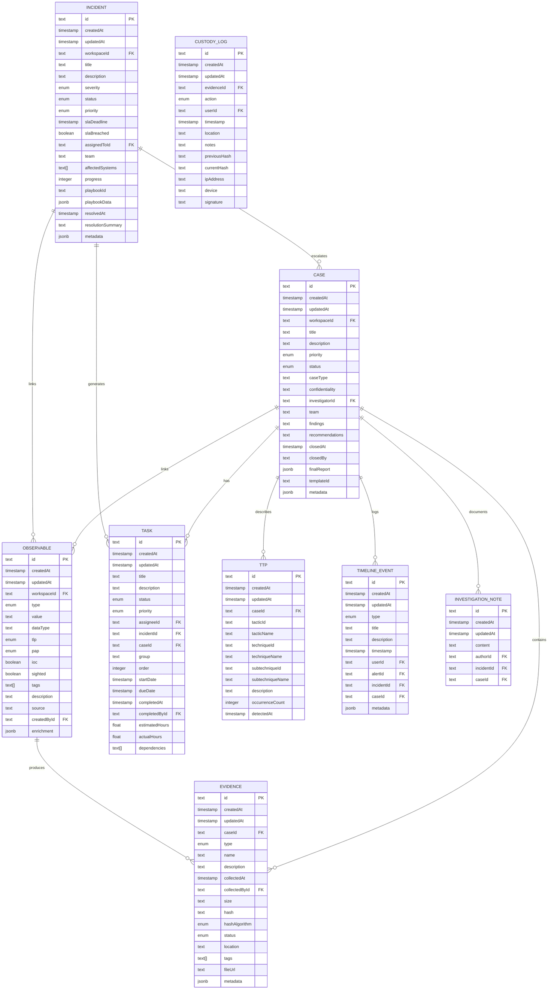

# Case Management

<cite>
**Referenced Files in This Document**
- [CreateCaseFromAlert.tsx](file://src/client/pages/modules/aegis/components/CreateCaseFromAlert.tsx)
- [cases/operations.ts](file://src/core/modules/aegis/cases/operations.ts)
- [incidents/operations.ts](file://src/core/modules/aegis/incidents/operations.ts)
- [tasks/operations.ts](file://src/core/modules/aegis/tasks/operations.ts)
- [permissions.ts](file://src/core/modules/aegis/utils/permissions.ts)
- [audit.ts](file://src/core/modules/aegis/utils/audit.ts)
- [notifications.ts](file://src/core/modules/aegis/utils/notifications.ts)
- [types.ts](file://src/core/modules/aegis/models/types.ts)
- [aegis.types.ts](file://src/client/pages/modules/aegis/types/aegis.types.ts)
- [20251118005713_add_aegis_module/migration.sql](file://migrations/20251118005713_add_aegis_module/migration.sql)
</cite>

## Table of Contents
1. [Introduction](#introduction)
2. [Project Structure](#project-structure)
3. [Core Components](#core-components)
4. [Architecture Overview](#architecture-overview)
5. [Detailed Component Analysis](#detailed-component-analysis)
6. [Dependency Analysis](#dependency-analysis)
7. [Performance Considerations](#performance-considerations)
8. [Troubleshooting Guide](#troubleshooting-guide)
9. [Conclusion](#conclusion)
10. [Appendices](#appendices)

## Introduction
This document explains the Case Management feature in the Aegis module. It covers how security incidents are escalated into formal cases, how cases are created from alerts, how tasks are assigned and tracked, and how the case domain model is structured. It also documents lifecycle transitions, audit logging, and common operational issues such as ownership conflicts, task prioritization, and integration with external ticketing systems.

## Project Structure
The Case Management feature spans client UI components, server-side operations, and shared type definitions. The backend operations orchestrate persistence, permissions, notifications, and audit logging. The frontend provides a guided flow to create cases from alerts and manage case metadata.

**Diagram sources**
- [CreateCaseFromAlert.tsx](file://src/client/pages/modules/aegis/components/CreateCaseFromAlert.tsx#L1-L240)
- [cases/operations.ts](file://src/core/modules/aegis/cases/operations.ts#L1-L911)
- [incidents/operations.ts](file://src/core/modules/aegis/incidents/operations.ts#L756-L957)
- [tasks/operations.ts](file://src/core/modules/aegis/tasks/operations.ts#L1-L150)
- [permissions.ts](file://src/core/modules/aegis/utils/permissions.ts#L1-L189)
- [audit.ts](file://src/core/modules/aegis/utils/audit.ts#L1-L318)
- [notifications.ts](file://src/core/modules/aegis/utils/notifications.ts#L1-L450)
- [types.ts](file://src/core/modules/aegis/models/types.ts#L1-L672)
- [aegis.types.ts](file://src/client/pages/modules/aegis/types/aegis.types.ts#L1-L272)
- [20251118005713_add_aegis_module/migration.sql](file://migrations/20251118005713_add_aegis_module/migration.sql#L1-L528)

**Section sources**
- [CreateCaseFromAlert.tsx](file://src/client/pages/modules/aegis/components/CreateCaseFromAlert.tsx#L1-L240)
- [cases/operations.ts](file://src/core/modules/aegis/cases/operations.ts#L1-L911)
- [incidents/operations.ts](file://src/core/modules/aegis/incidents/operations.ts#L756-L957)
- [tasks/operations.ts](file://src/core/modules/aegis/tasks/operations.ts#L1-L150)
- [permissions.ts](file://src/core/modules/aegis/utils/permissions.ts#L1-L189)
- [audit.ts](file://src/core/modules/aegis/utils/audit.ts#L1-L318)
- [notifications.ts](file://src/core/modules/aegis/utils/notifications.ts#L1-L450)
- [types.ts](file://src/core/modules/aegis/models/types.ts#L1-L672)
- [aegis.types.ts](file://src/client/pages/modules/aegis/types/aegis.types.ts#L1-L272)
- [20251118005713_add_aegis_module/migration.sql](file://migrations/20251118005713_add_aegis_module/migration.sql#L1-L528)

## Core Components
- CreateCaseFromAlert component: Provides a guided UI to create a case from an alert, including title, description, priority, assignee, and options to inherit observables and mark the alert resolved.
- Case operations: Manage case lifecycle (create, update, assign, add notes/findings/recommendations, close/reopen, generate report, export data, apply template).
- Incident-to-case escalation: Converts an incident into a case, copying observables and linking records while recording timeline events.
- Task operations: Retrieve tasks by incident or case, create/update tasks, complete tasks, and resolve dependencies.
- Permissions and notifications: Enforce workspace access and role-based permissions; broadcast notifications and audit logs.
- Shared types: Define domain enums, relations, filters, input/output shapes, and report structures.

**Section sources**
- [CreateCaseFromAlert.tsx](file://src/client/pages/modules/aegis/components/CreateCaseFromAlert.tsx#L1-L240)
- [cases/operations.ts](file://src/core/modules/aegis/cases/operations.ts#L1-L911)
- [incidents/operations.ts](file://src/core/modules/aegis/incidents/operations.ts#L756-L957)
- [tasks/operations.ts](file://src/core/modules/aegis/tasks/operations.ts#L1-L150)
- [permissions.ts](file://src/core/modules/aegis/utils/permissions.ts#L1-L189)
- [audit.ts](file://src/core/modules/aegis/utils/audit.ts#L1-L318)
- [notifications.ts](file://src/core/modules/aegis/utils/notifications.ts#L1-L450)
- [types.ts](file://src/core/modules/aegis/models/types.ts#L1-L672)
- [aegis.types.ts](file://src/client/pages/modules/aegis/types/aegis.types.ts#L1-L272)

## Architecture Overview
The Case Management feature follows a layered architecture:
- UI layer: React component for creating cases from alerts.
- Operation layer: Server-side functions orchestrating persistence, permissions, notifications, and audit logging.
- Domain layer: Entities and relations defined in the database schema and typed interfaces.
- Integration layer: Notifications and audit logging integrate with the platform’s existing systems.

**Diagram sources**
- [CreateCaseFromAlert.tsx](file://src/client/pages/modules/aegis/components/CreateCaseFromAlert.tsx#L1-L240)
- [cases/operations.ts](file://src/core/modules/aegis/cases/operations.ts#L257-L349)
- [tasks/operations.ts](file://src/core/modules/aegis/tasks/operations.ts#L44-L67)
- [permissions.ts](file://src/core/modules/aegis/utils/permissions.ts#L14-L37)
- [audit.ts](file://src/core/modules/aegis/utils/audit.ts#L204-L227)
- [notifications.ts](file://src/core/modules/aegis/utils/notifications.ts#L246-L271)

## Detailed Component Analysis

### Case Domain Model
The case domain model includes entities and relationships defined in the database schema and extended with typed relations and filters.

**Diagram sources**
- [20251118005713_add_aegis_module/migration.sql](file://migrations/20251118005713_add_aegis_module/migration.sql#L112-L272)
- [20251118005713_add_aegis_module/migration.sql](file://migrations/20251118005713_add_aegis_module/migration.sql#L273-L309)
- [20251118005713_add_aegis_module/migration.sql](file://migrations/20251118005713_add_aegis_module/migration.sql#L310-L387)
- [20251118005713_add_aegis_module/migration.sql](file://migrations/20251118005713_add_aegis_module/migration.sql#L424-L528)

**Section sources**
- [types.ts](file://src/core/modules/aegis/models/types.ts#L43-L101)
- [20251118005713_add_aegis_module/migration.sql](file://migrations/20251118005713_add_aegis_module/migration.sql#L112-L272)
- [20251118005713_add_aegis_module/migration.sql](file://migrations/20251118005713_add_aegis_module/migration.sql#L273-L309)
- [20251118005713_add_aegis_module/migration.sql](file://migrations/20251118005713_add_aegis_module/migration.sql#L310-L387)
- [20251118005713_add_aegis_module/migration.sql](file://migrations/20251118005713_add_aegis_module/migration.sql#L424-L528)

### Create Case from Alert (Client)
The CreateCaseFromAlert component collects user inputs for creating a case from an alert, including title, description, priority, assignee, and options to inherit observables and mark the alert resolved. It simulates an API call and navigates to the newly created case.

Key behaviors:
- Pre-populates title from the alert.
- Uses priority from the alert.
- Allows selecting an assignee from a predefined list.
- Offers checkboxes to inherit observables and mark alert resolved.
- Validates presence of title before enabling creation.

**Section sources**
- [CreateCaseFromAlert.tsx](file://src/client/pages/modules/aegis/components/CreateCaseFromAlert.tsx#L1-L240)

### Case Lifecycle and Business Logic
Case lifecycle operations include creation, updates, assignment, adding notes/findings/recommendations, closing/reopening, reporting, exporting, and applying templates.

**Diagram sources**
- [cases/operations.ts](file://src/core/modules/aegis/cases/operations.ts#L257-L349)
- [audit.ts](file://src/core/modules/aegis/utils/audit.ts#L204-L227)
- [notifications.ts](file://src/core/modules/aegis/utils/notifications.ts#L246-L271)

Additional lifecycle operations:
- Update case metadata and status.
- Assign case to an investigator (owner/admin only).
- Add investigation notes.
- Add findings and recommendations.
- Close case with final report and audit log.
- Reopen case and clear closure metadata.
- Generate comprehensive case report and export data.

**Section sources**
- [cases/operations.ts](file://src/core/modules/aegis/cases/operations.ts#L351-L911)

### Escalation from Incident to Case
Escalation converts an incident into a case, copying observables and linking records while recording timeline events.

**Diagram sources**
- [incidents/operations.ts](file://src/core/modules/aegis/incidents/operations.ts#L756-L852)
- [audit.ts](file://src/core/modules/aegis/utils/audit.ts#L204-L227)

**Section sources**
- [incidents/operations.ts](file://src/core/modules/aegis/incidents/operations.ts#L756-L852)

### Task Assignment and Tracking
Task operations support retrieving tasks by incident or case, creating/updating tasks, completing tasks, and resolving dependencies.

**Diagram sources**
- [tasks/operations.ts](file://src/core/modules/aegis/tasks/operations.ts#L1-L150)
- [notifications.ts](file://src/core/modules/aegis/utils/notifications.ts#L352-L422)

**Section sources**
- [tasks/operations.ts](file://src/core/modules/aegis/tasks/operations.ts#L1-L150)
- [notifications.ts](file://src/core/modules/aegis/utils/notifications.ts#L352-L422)

### Permissions and Ownership
Permissions enforce workspace access and role-based capabilities:
- Workspace access checks.
- Admin/Owner vs Member permissions for managing alerts/incidents/cases.
- Assignment capability restricted to admins/owners.
- Evidence access depends on investigator role.

**Diagram sources**
- [permissions.ts](file://src/core/modules/aegis/utils/permissions.ts#L14-L37)
- [permissions.ts](file://src/core/modules/aegis/utils/permissions.ts#L91-L117)

**Section sources**
- [permissions.ts](file://src/core/modules/aegis/utils/permissions.ts#L1-L189)

### Audit Logging and Notifications
Audit logging captures significant actions (creation, updates, closures) with metadata. Notifications are sent for case creation, assignment, closure, and task-related events.

**Diagram sources**
- [cases/operations.ts](file://src/core/modules/aegis/cases/operations.ts#L310-L349)
- [audit.ts](file://src/core/modules/aegis/utils/audit.ts#L204-L269)
- [notifications.ts](file://src/core/modules/aegis/utils/notifications.ts#L246-L323)

**Section sources**
- [audit.ts](file://src/core/modules/aegis/utils/audit.ts#L1-L318)
- [notifications.ts](file://src/core/modules/aegis/utils/notifications.ts#L1-L450)

## Dependency Analysis
The following diagram shows key dependencies among components involved in case management.

**Diagram sources**
- [CreateCaseFromAlert.tsx](file://src/client/pages/modules/aegis/components/CreateCaseFromAlert.tsx#L1-L240)
- [cases/operations.ts](file://src/core/modules/aegis/cases/operations.ts#L1-L911)
- [incidents/operations.ts](file://src/core/modules/aegis/incidents/operations.ts#L756-L957)
- [tasks/operations.ts](file://src/core/modules/aegis/tasks/operations.ts#L1-L150)
- [permissions.ts](file://src/core/modules/aegis/utils/permissions.ts#L1-L189)
- [audit.ts](file://src/core/modules/aegis/utils/audit.ts#L1-L318)
- [notifications.ts](file://src/core/modules/aegis/utils/notifications.ts#L1-L450)
- [types.ts](file://src/core/modules/aegis/models/types.ts#L1-L672)
- [aegis.types.ts](file://src/client/pages/modules/aegis/types/aegis.types.ts#L1-L272)
- [20251118005713_add_aegis_module/migration.sql](file://migrations/20251118005713_add_aegis_module/migration.sql#L1-L528)

**Section sources**
- [cases/operations.ts](file://src/core/modules/aegis/cases/operations.ts#L1-L911)
- [incidents/operations.ts](file://src/core/modules/aegis/incidents/operations.ts#L756-L957)
- [tasks/operations.ts](file://src/core/modules/aegis/tasks/operations.ts#L1-L150)
- [permissions.ts](file://src/core/modules/aegis/utils/permissions.ts#L1-L189)
- [audit.ts](file://src/core/modules/aegis/utils/audit.ts#L1-L318)
- [notifications.ts](file://src/core/modules/aegis/utils/notifications.ts#L1-L450)
- [types.ts](file://src/core/modules/aegis/models/types.ts#L1-L672)
- [aegis.types.ts](file://src/client/pages/modules/aegis/types/aegis.types.ts#L1-L272)
- [20251118005713_add_aegis_module/migration.sql](file://migrations/20251118005713_add_aegis_module/migration.sql#L1-L528)

## Performance Considerations
- Pagination and sorting: Case retrieval supports pagination and sorting to prevent heavy loads.
- Filtering: Efficient filtering by priority, status, team, and date ranges reduces unnecessary scans.
- Indexes: Database indexes on frequently queried fields (workspaceId, status, createdAt, priority, assigneeId) improve query performance.
- Batch operations: Applying templates creates tasks in parallel; consider batching for large templates.
- Notifications and audit logs: Non-blocking writes ensure operations remain responsive.

[No sources needed since this section provides general guidance]

## Troubleshooting Guide
Common issues and resolutions:
- Case ownership conflicts
  - Symptom: Attempting to update a case without proper permissions.
  - Resolution: Ensure the user has OWNER/ADMIN role or is the assigned investigator; use permission helpers to verify access.
  - Section sources
    - [permissions.ts](file://src/core/modules/aegis/utils/permissions.ts#L91-L117)
    - [cases/operations.ts](file://src/core/modules/aegis/cases/operations.ts#L351-L423)

- Task prioritization
  - Symptom: Tasks appear out of order.
  - Resolution: Use the order field and group to organize tasks; ensure dependencies are set correctly.
  - Section sources
    - [tasks/operations.ts](file://src/core/modules/aegis/tasks/operations.ts#L1-L150)
    - [types.ts](file://src/core/modules/aegis/models/types.ts#L333-L362)

- Integration with external ticketing systems
  - Symptom: External system not receiving updates.
  - Resolution: Use the notification bus and provider integrations; ensure event types and metadata are correctly populated.
  - Section sources
    - [notifications.ts](file://src/core/modules/aegis/utils/notifications.ts#L1-L450)

- Escalation failures
  - Symptom: Incident not escalating to case.
  - Resolution: Verify workspace access, ensure observables exist, and confirm timeline events are recorded.
  - Section sources
    - [incidents/operations.ts](file://src/core/modules/aegis/incidents/operations.ts#L756-L852)

- Audit logging gaps
  - Symptom: Missing audit entries.
  - Resolution: Confirm audit log creation and mapping of actions to the AuditAction enum.
  - Section sources
    - [audit.ts](file://src/core/modules/aegis/utils/audit.ts#L1-L318)

**Section sources**
- [permissions.ts](file://src/core/modules/aegis/utils/permissions.ts#L1-L189)
- [tasks/operations.ts](file://src/core/modules/aegis/tasks/operations.ts#L1-L150)
- [notifications.ts](file://src/core/modules/aegis/utils/notifications.ts#L1-L450)
- [incidents/operations.ts](file://src/core/modules/aegis/incidents/operations.ts#L756-L852)
- [audit.ts](file://src/core/modules/aegis/utils/audit.ts#L1-L318)

## Conclusion
The Case Management feature in Aegis provides a robust framework for transforming security alerts and incidents into formal cases, with strong permissions, comprehensive task tracking, and integrated notifications and audit logging. The domain model supports rich metadata, timelines, and evidence management, while the escalation path ensures continuity from alert to case and from incident to case.

[No sources needed since this section summarizes without analyzing specific files]

## Appendices

### Appendix A: Case Status Transitions
- ACTIVE → REVIEW → CLOSED
- CLOSED → ACTIVE (reopen)

**Section sources**
- [types.ts](file://src/core/modules/aegis/models/types.ts#L1-L672)

### Appendix B: Example Paths to Key Implementations
- Create case from alert UI: [CreateCaseFromAlert.tsx](file://src/client/pages/modules/aegis/components/CreateCaseFromAlert.tsx#L1-L240)
- Case creation and updates: [cases/operations.ts](file://src/core/modules/aegis/cases/operations.ts#L257-L423)
- Escalation from incident to case: [incidents/operations.ts](file://src/core/modules/aegis/incidents/operations.ts#L756-L852)
- Task operations: [tasks/operations.ts](file://src/core/modules/aegis/tasks/operations.ts#L1-L150)
- Permissions: [permissions.ts](file://src/core/modules/aegis/utils/permissions.ts#L1-L189)
- Audit logging: [audit.ts](file://src/core/modules/aegis/utils/audit.ts#L1-L318)
- Notifications: [notifications.ts](file://src/core/modules/aegis/utils/notifications.ts#L1-L450)
- Shared types: [types.ts](file://src/core/modules/aegis/models/types.ts#L1-L672), [aegis.types.ts](file://src/client/pages/modules/aegis/types/aegis.types.ts#L1-L272)
- Database schema: [20251118005713_add_aegis_module/migration.sql](file://migrations/20251118005713_add_aegis_module/migration.sql#L1-L528)