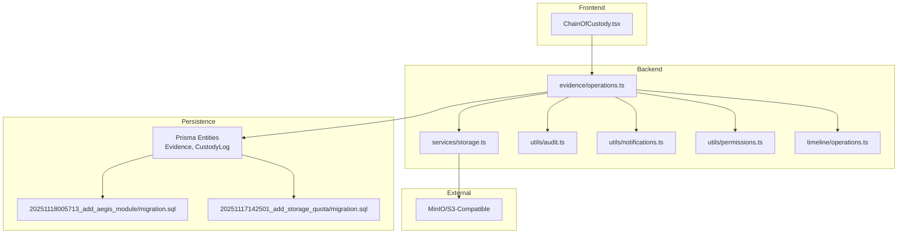
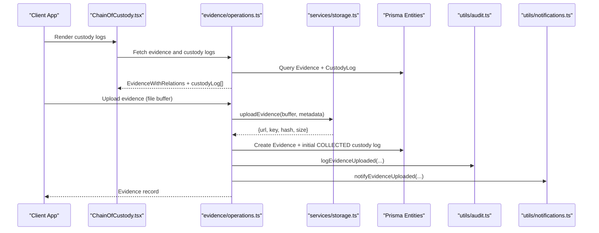
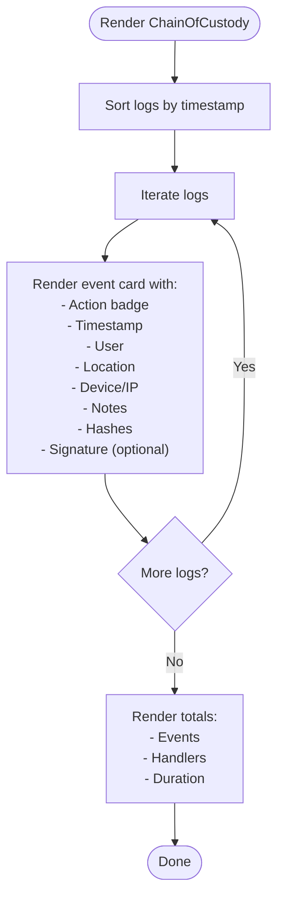
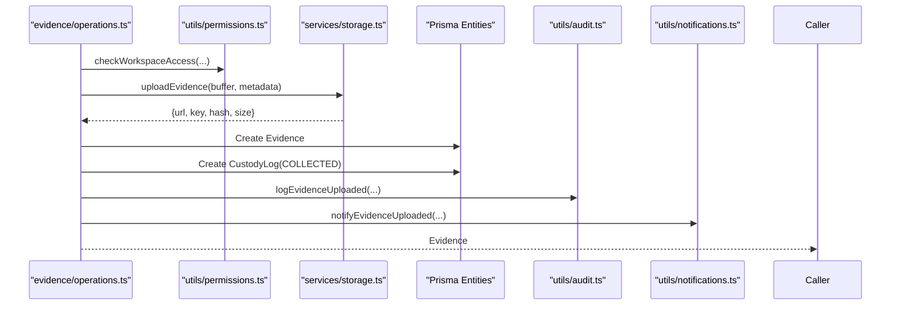
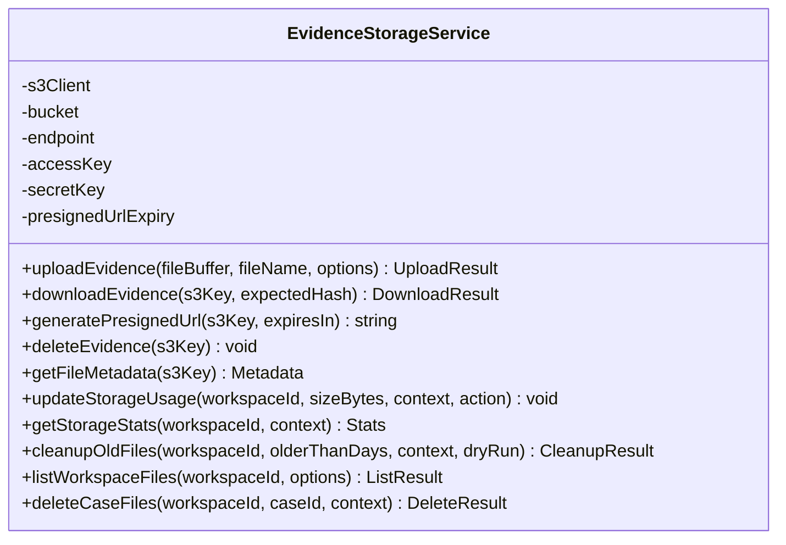
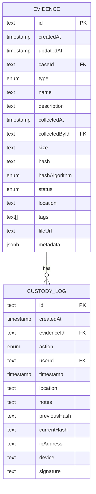
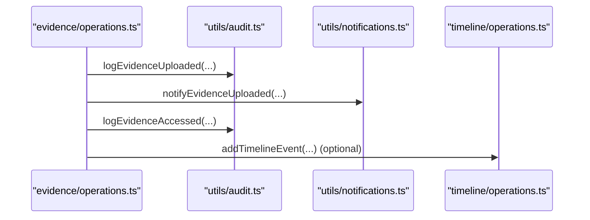
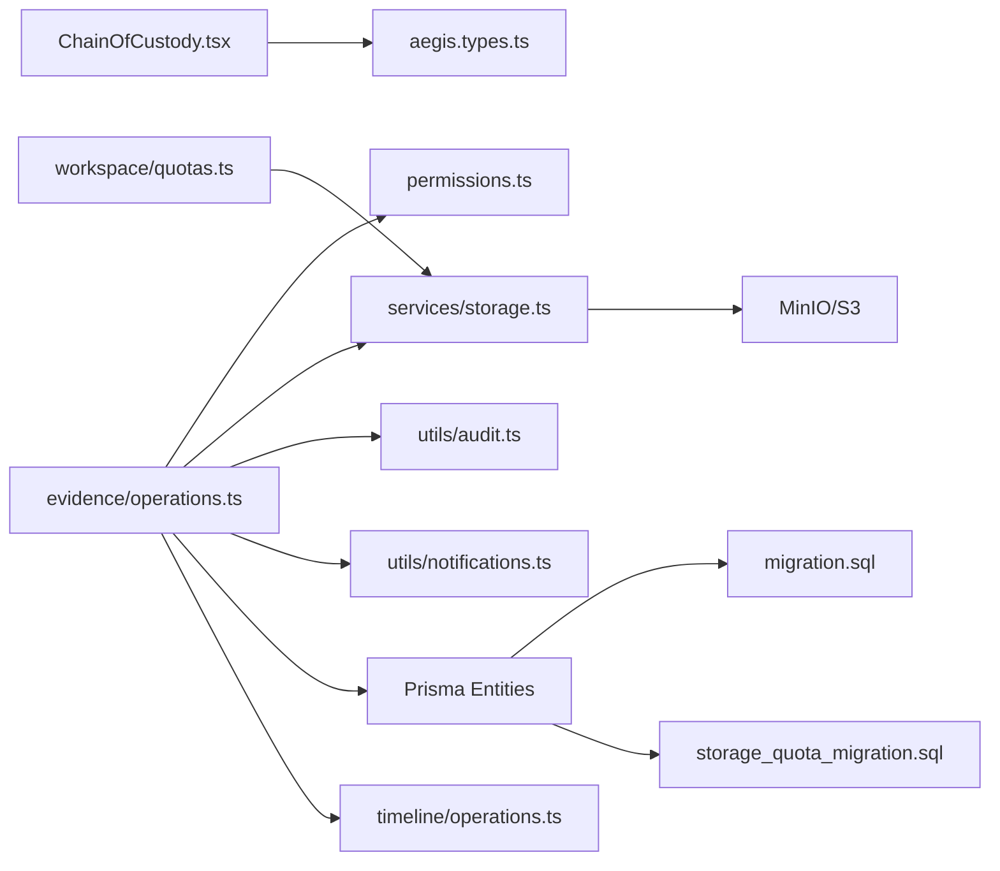

# Chain of Custody

<cite>
**Referenced Files in This Document**
- [ChainOfCustody.tsx](file://src/client/pages/modules/aegis/components/ChainOfCustody.tsx)
- [operations.ts](file://src/core/modules/aegis/evidence/operations.ts)
- [storage.ts](file://src/core/modules/aegis/services/storage.ts)
- [aegis.types.ts](file://src/client/pages/modules/aegis/types/aegis.types.ts)
- [types.ts](file://src/core/modules/aegis/models/types.ts)
- [audit.ts](file://src/core/modules/aegis/utils/audit.ts)
- [notifications.ts](file://src/core/modules/aegis/utils/notifications.ts)
- [permissions.ts](file://src/core/modules/aegis/utils/permissions.ts)
- [migration.sql](file://migrations/20251118005713_add_aegis_module/migration.sql)
- [storage_quota_migration.sql](file://migrations/20251117142501_add_storage_quota/migration.sql)
- [timeline_operations.ts](file://src/core/modules/aegis/timeline/operations.ts)
- [quotas.ts](file://src/core/workspace/quotas.ts)
</cite>

## Table of Contents
1. [Introduction](#introduction)
2. [Project Structure](#project-structure)
3. [Core Components](#core-components)
4. [Architecture Overview](#architecture-overview)
5. [Detailed Component Analysis](#detailed-component-analysis)
6. [Dependency Analysis](#dependency-analysis)
7. [Performance Considerations](#performance-considerations)
8. [Troubleshooting Guide](#troubleshooting-guide)
9. [Conclusion](#conclusion)
10. [Appendices](#appendices)

## Introduction
This document explains the Chain of Custody feature in the Aegis module. It covers how digital evidence is collected, stored, and tracked throughout an investigation to maintain forensic integrity. The implementation integrates MinIO/S3-compatible storage, cryptographic hashing for integrity verification, access logging, and audit trails. It also documents the integration between the ChainOfCustody component and backend services for evidence preservation, including metadata capture, audit trail generation, and secure storage operations. Finally, it addresses common issues such as preventing tampering, managing storage quotas, and meeting legal/compliance expectations.

## Project Structure
The Chain of Custody feature spans the frontend UI component, backend operations, storage service, and persistence model definitions. Evidence and custody logs are persisted in the database, while files are stored in MinIO/S3. Audit and notifications are integrated into the broader platform.

**Diagram sources**
- [ChainOfCustody.tsx](file://src/client/pages/modules/aegis/components/ChainOfCustody.tsx#L1-L210)
- [operations.ts](file://src/core/modules/aegis/evidence/operations.ts#L1-L188)
- [storage.ts](file://src/core/modules/aegis/services/storage.ts#L1-L531)
- [audit.ts](file://src/core/modules/aegis/utils/audit.ts#L1-L318)
- [notifications.ts](file://src/core/modules/aegis/utils/notifications.ts#L1-L450)
- [permissions.ts](file://src/core/modules/aegis/utils/permissions.ts#L1-L189)
- [timeline_operations.ts](file://src/core/modules/aegis/timeline/operations.ts#L49-L97)
- [migration.sql](file://migrations/20251118005713_add_aegis_module/migration.sql#L156-L199)
- [storage_quota_migration.sql](file://migrations/20251117142501_add_storage_quota/migration.sql#L1-L3)

**Section sources**
- [ChainOfCustody.tsx](file://src/client/pages/modules/aegis/components/ChainOfCustody.tsx#L1-L210)
- [operations.ts](file://src/core/modules/aegis/evidence/operations.ts#L1-L188)
- [storage.ts](file://src/core/modules/aegis/services/storage.ts#L1-L531)
- [audit.ts](file://src/core/modules/aegis/utils/audit.ts#L1-L318)
- [notifications.ts](file://src/core/modules/aegis/utils/notifications.ts#L1-L450)
- [permissions.ts](file://src/core/modules/aegis/utils/permissions.ts#L1-L189)
- [timeline_operations.ts](file://src/core/modules/aegis/timeline/operations.ts#L49-L97)
- [migration.sql](file://migrations/20251118005713_add_aegis_module/migration.sql#L156-L199)
- [storage_quota_migration.sql](file://migrations/20251117142501_add_storage_quota/migration.sql#L1-L3)

## Core Components
- Frontend Chain of Custody UI: Renders custody events with user, location, device, IP, timestamps, hashes, and optional digital signatures.
- Backend Evidence Operations: Upload, access, custody log creation, integrity verification, and deletion.
- Storage Service: MinIO/S3 integration with upload/download, signed URLs, metadata, and quota enforcement.
- Persistence: Evidence and CustodyLog entities with indexes and foreign keys.
- Auditing and Notifications: Centralized audit logging and notification broadcasting for evidence events.
- Permissions: Workspace-level access checks and role-based controls for evidence operations.

**Section sources**
- [ChainOfCustody.tsx](file://src/client/pages/modules/aegis/components/ChainOfCustody.tsx#L1-L210)
- [operations.ts](file://src/core/modules/aegis/evidence/operations.ts#L1-L188)
- [storage.ts](file://src/core/modules/aegis/services/storage.ts#L1-L531)
- [audit.ts](file://src/core/modules/aegis/utils/audit.ts#L1-L318)
- [notifications.ts](file://src/core/modules/aegis/utils/notifications.ts#L1-L450)
- [permissions.ts](file://src/core/modules/aegis/utils/permissions.ts#L1-L189)
- [migration.sql](file://migrations/20251118005713_add_aegis_module/migration.sql#L156-L199)

## Architecture Overview
The Chain of Custody feature follows a layered architecture:
- UI renders custody logs and integrity indicators.
- Backend operations orchestrate evidence lifecycle and enforce permissions.
- Storage service handles secure file operations and integrity checks.
- Persistence stores evidence records and custody logs with audit-friendly fields.
- Audit and notifications integrate with the platform’s central systems.

**Diagram sources**
- [ChainOfCustody.tsx](file://src/client/pages/modules/aegis/components/ChainOfCustody.tsx#L1-L210)
- [operations.ts](file://src/core/modules/aegis/evidence/operations.ts#L58-L134)
- [storage.ts](file://src/core/modules/aegis/services/storage.ts#L47-L108)
- [audit.ts](file://src/core/modules/aegis/utils/audit.ts#L272-L295)
- [notifications.ts](file://src/core/modules/aegis/utils/notifications.ts#L325-L350)

## Detailed Component Analysis

### Frontend: ChainOfCustody Component
- Displays custody events in chronological order with color-coded actions.
- Shows user, location, device, IP, timestamp, and integrity verification (previous/current hashes).
- Optionally displays digital signature when present.
- Provides summary metrics: total events, handlers, and duration.

**Diagram sources**
- [ChainOfCustody.tsx](file://src/client/pages/modules/aegis/components/ChainOfCustody.tsx#L1-L210)

**Section sources**
- [ChainOfCustody.tsx](file://src/client/pages/modules/aegis/components/ChainOfCustody.tsx#L1-L210)
- [aegis.types.ts](file://src/client/pages/modules/aegis/types/aegis.types.ts#L108-L164)

### Backend: Evidence Operations
- Upload evidence: calculates SHA-256, stores file in MinIO, updates workspace storage usage, persists Evidence record, creates initial COLLECTED custody log, emits audit and notifications.
- Access evidence: checks workspace access and role, logs accessed event.
- Add custody log: records action with previous/current hashes, IP, device, notes, and location.
- Integrity verification: returns stored hash comparison (placeholder for re-hashing).
- Delete evidence: admin-only; records DELETED custody log and deletes record.

**Diagram sources**
- [operations.ts](file://src/core/modules/aegis/evidence/operations.ts#L58-L134)
- [permissions.ts](file://src/core/modules/aegis/utils/permissions.ts#L14-L37)
- [storage.ts](file://src/core/modules/aegis/services/storage.ts#L47-L108)
- [audit.ts](file://src/core/modules/aegis/utils/audit.ts#L272-L295)
- [notifications.ts](file://src/core/modules/aegis/utils/notifications.ts#L325-L350)

**Section sources**
- [operations.ts](file://src/core/modules/aegis/evidence/operations.ts#L1-L188)
- [permissions.ts](file://src/core/modules/aegis/utils/permissions.ts#L1-L189)
- [audit.ts](file://src/core/modules/aegis/utils/audit.ts#L272-L318)
- [notifications.ts](file://src/core/modules/aegis/utils/notifications.ts#L325-L350)

### Storage Service: MinIO/S3 Integration
- Upload: computes SHA-256, constructs workspace/case/evidence key, stores metadata (uploadedBy, workspaceId, caseId, hash, originalFileName, uploadedAt), generates signed URL.
- Download: retrieves stream, recomputes SHA-256, verifies against expected hash.
- Signed URL generation: configurable expiry.
- Deletion and metadata: head object for size/content-type.
- Storage usage: tracks workspace usage and enforces quotas; supports cleanup and listing.
- Case/workspace cleanup helpers: bulk delete by prefix and update usage accordingly.

**Diagram sources**
- [storage.ts](file://src/core/modules/aegis/services/storage.ts#L1-L531)

**Section sources**
- [storage.ts](file://src/core/modules/aegis/services/storage.ts#L1-L531)
- [storage_quota_migration.sql](file://migrations/20251117142501_add_storage_quota/migration.sql#L1-L3)

### Persistence Model: Evidence and CustodyLog
- Evidence entity includes identifiers, type/status, collection metadata, size/hash/hashAlgorithm, location/tags, fileUrl, and optional metadata.
- CustodyLog entity captures action, user, timestamp, location, notes, previous/current hashes, IP/device, and optional signature.
- Indexes support efficient queries by evidenceId and timestamps.
- Foreign keys connect custody logs to evidence and users.

**Diagram sources**
- [migration.sql](file://migrations/20251118005713_add_aegis_module/migration.sql#L156-L199)
- [migration.sql](file://migrations/20251118005713_add_aegis_module/migration.sql#L349-L392)

**Section sources**
- [migration.sql](file://migrations/20251118005713_add_aegis_module/migration.sql#L156-L199)
- [migration.sql](file://migrations/20251118005713_add_aegis_module/migration.sql#L349-L392)

### Audit Trail and Notifications
- Evidence upload and access are audited centrally with IP/user agent captured.
- Notifications are sent to investigators and broadcasted to the workspace.
- Timeline events can be used to complement custody logs for broader case timelines.

**Diagram sources**
- [audit.ts](file://src/core/modules/aegis/utils/audit.ts#L272-L318)
- [notifications.ts](file://src/core/modules/aegis/utils/notifications.ts#L325-L350)
- [timeline_operations.ts](file://src/core/modules/aegis/timeline/operations.ts#L49-L97)

**Section sources**
- [audit.ts](file://src/core/modules/aegis/utils/audit.ts#L1-L318)
- [notifications.ts](file://src/core/modules/aegis/utils/notifications.ts#L1-L450)
- [timeline_operations.ts](file://src/core/modules/aegis/timeline/operations.ts#L49-L97)

## Dependency Analysis
- UI depends on types for custody logs and evidence.
- Operations depend on permissions, storage service, audit, notifications, and Prisma entities.
- Storage service depends on AWS SDK S3 client and environment variables for MinIO configuration.
- Persistence relies on migrations for enums, tables, indexes, and foreign keys.
- Workspace quotas and plan limits inform storage policy.

**Diagram sources**
- [ChainOfCustody.tsx](file://src/client/pages/modules/aegis/components/ChainOfCustody.tsx#L1-L210)
- [aegis.types.ts](file://src/client/pages/modules/aegis/types/aegis.types.ts#L108-L164)
- [operations.ts](file://src/core/modules/aegis/evidence/operations.ts#L1-L188)
- [permissions.ts](file://src/core/modules/aegis/utils/permissions.ts#L1-L189)
- [storage.ts](file://src/core/modules/aegis/services/storage.ts#L1-L531)
- [audit.ts](file://src/core/modules/aegis/utils/audit.ts#L1-L318)
- [notifications.ts](file://src/core/modules/aegis/utils/notifications.ts#L1-L450)
- [timeline_operations.ts](file://src/core/modules/aegis/timeline/operations.ts#L49-L97)
- [migration.sql](file://migrations/20251118005713_add_aegis_module/migration.sql#L156-L199)
- [storage_quota_migration.sql](file://migrations/20251117142501_add_storage_quota/migration.sql#L1-L3)
- [quotas.ts](file://src/core/workspace/quotas.ts#L1-L236)

**Section sources**
- [operations.ts](file://src/core/modules/aegis/evidence/operations.ts#L1-L188)
- [storage.ts](file://src/core/modules/aegis/services/storage.ts#L1-L531)
- [migration.sql](file://migrations/20251118005713_add_aegis_module/migration.sql#L156-L199)
- [storage_quota_migration.sql](file://migrations/20251117142501_add_storage_quota/migration.sql#L1-L3)
- [quotas.ts](file://src/core/workspace/quotas.ts#L1-L236)

## Performance Considerations
- MinIO streaming: Downloads read streams into buffers; for large files, consider chunked processing and streaming consumers to reduce memory overhead.
- Hash computation: SHA-256 is computed during upload and download; ensure buffers are handled efficiently to avoid excessive memory usage.
- Indexes: Database indexes on Evidence and CustodyLog improve query performance for case-scoped lists and chronological ordering.
- Signed URLs: Expiration is configurable; set appropriate TTLs to balance convenience and security.
- Storage usage updates: Batch updates or periodic aggregation could reduce write contention under high throughput.

[No sources needed since this section provides general guidance]

## Troubleshooting Guide
- Upload failures: Check MinIO endpoint/credentials and bucket availability; verify file size limits and quota thresholds.
- Integrity mismatch: Recompute hash locally and compare with stored hash; confirm download verification logic.
- Access denied: Verify workspace membership and role; ensure case investigator permissions are correct.
- Quota exceeded: Review plan limits and workspace storageUsed vs storageQuota; consider cleanup or upgrade.
- Missing audit entries: Confirm audit logging is enabled and that the mapped actions exist in the audit system.

**Section sources**
- [storage.ts](file://src/core/modules/aegis/services/storage.ts#L97-L151)
- [operations.ts](file://src/core/modules/aegis/evidence/operations.ts#L133-L173)
- [permissions.ts](file://src/core/modules/aegis/utils/permissions.ts#L14-L37)
- [audit.ts](file://src/core/modules/aegis/utils/audit.ts#L272-L318)

## Conclusion
The Chain of Custody feature in Aegis ensures forensic-grade handling of digital evidence by combining secure storage, cryptographic integrity checks, comprehensive audit trails, and robust access controls. The frontend presents a clear, chronological custody timeline with integrity indicators, while the backend enforces permissions, records custody events, and integrates with MinIO/S3 for reliable, tamper-evident storage. Together with workspace quotas and notifications, the system supports compliance and operational excellence throughout investigations.

[No sources needed since this section summarizes without analyzing specific files]

## Appendices

### Compliance and Legal Standards
- Digital signatures: The custody log schema includes a signature field for optional digital signatures; implement signing workflows according to organizational policies.
- Tamper prevention: Cryptographic hashing and immutable custody logs help prevent tampering; maintain signed URLs and access logs for admissibility.
- Retention and deletion: Use storage cleanup utilities to remove outdated files; ensure deletions are logged and justified for legal defensibility.
- Auditability: Centralized audit logs capture user, IP, device, and metadata; retain logs per policy and ensure non-repudiation.

**Section sources**
- [ChainOfCustody.tsx](file://src/client/pages/modules/aegis/components/ChainOfCustody.tsx#L160-L180)
- [storage.ts](file://src/core/modules/aegis/services/storage.ts#L292-L387)
- [audit.ts](file://src/core/modules/aegis/utils/audit.ts#L272-L318)

### Storage Quota Management
- Workspace storageUsed and storageQuota are persisted and enforced during uploads.
- Plan-based quotas are defined centrally; storage usage is updated atomically and checked before writes.
- Cleanup utilities assist with automated removal of old files and updating usage counters.

**Section sources**
- [storage_quota_migration.sql](file://migrations/20251117142501_add_storage_quota/migration.sql#L1-L3)
- [storage.ts](file://src/core/modules/aegis/services/storage.ts#L216-L290)
- [quotas.ts](file://src/core/workspace/quotas.ts#L1-L236)