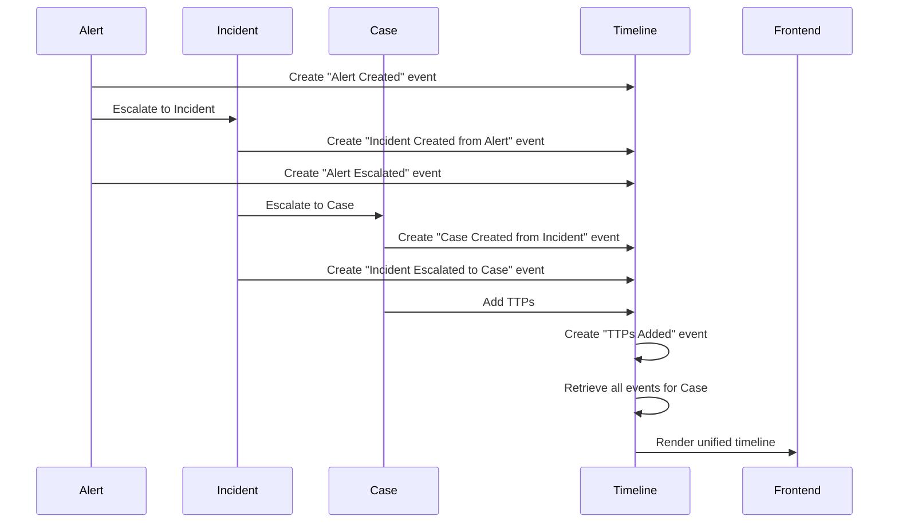
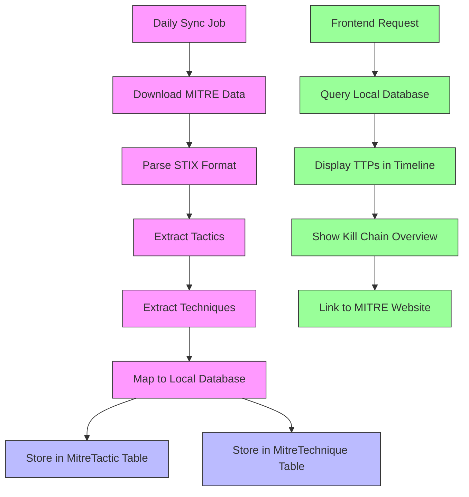
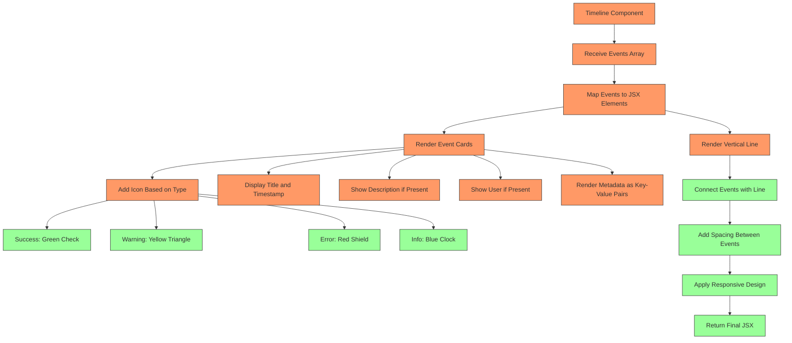

# Timeline Tracking

<cite>
**Referenced Files in This Document**   
- [Timeline.tsx](file://src/client/pages/modules/aegis/components/Timeline.tsx)
- [operations.ts](file://src/core/modules/aegis/timeline/operations.ts)
- [mitreSyncJob.ts](file://src/core/modules/aegis/jobs/mitreSyncJob.ts)
- [aegis.types.ts](file://src/client/pages/modules/aegis/types/aegis.types.ts)
- [types.ts](file://src/core/modules/aegis/models/types.ts)
- [alerts/operations.ts](file://src/core/modules/aegis/alerts/operations.ts)
- [incidents/operations.ts](file://src/core/modules/aegis/incidents/operations.ts)
- [cases/operations.ts](file://src/core/modules/aegis/cases/operations.ts)
- [ttps/operations.ts](file://src/core/modules/aegis/ttps/operations.ts)
- [TTPsList.tsx](file://src/client/pages/modules/aegis/components/TTPsList.tsx)
- [20251118_add_mitre_and_s3_key.sql](file://migrations/20251118_add_mitre_and_s3_key.sql)
</cite>

## Table of Contents
1. [Introduction](#introduction)
2. [Timeline Data Structure](#timeline-data-structure)
3. [Event Correlation Across Entities](#event-correlation-across-entities)
4. [MITRE ATT&CK Framework Integration](#mitre-attck-framework-integration)
5. [Timeline Component Implementation](#timeline-component-implementation)
6. [Backend Operations](#backend-operations)
7. [Performance Considerations](#performance-considerations)
8. [Common Issues and Solutions](#common-issues-and-solutions)

## Introduction
The Timeline Tracking feature in the Aegis module provides a comprehensive chronological view of security incidents by correlating alerts, cases, and Tactics, Techniques, and Procedures (TTPs) from the MITRE ATT&CK framework. This feature enables security teams to visualize the complete lifecycle of an incident, from initial detection through investigation and resolution. The timeline serves as a central hub for understanding the sequence of events, identifying patterns, and making informed decisions during incident response.

The implementation combines frontend visualization components with robust backend operations that retrieve and correlate data from multiple sources. The system is designed to handle large datasets efficiently while maintaining accurate time correlation across distributed systems. Integration with the MITRE ATT&CK framework provides contextual intelligence about adversary behavior, enhancing the investigative capabilities of security analysts.

## Timeline Data Structure
The timeline data structure is designed to capture events from multiple entities within the Aegis module, including alerts, incidents, and cases. The core data model is defined in the `TimelineEvent` interface, which includes essential properties for event representation.

The `TimelineEvent` interface contains the following key properties:
- `id`: Unique identifier for the event
- `type`: Categorization of the event (success, warning, error, info)
- `title`: Descriptive title of the event
- `description`: Detailed description of the event
- `timestamp`: When the event occurred
- `user`: User associated with the event
- `metadata`: Additional contextual information stored as key-value pairs

The backend implementation extends this interface with relations to other entities through the `TimelineEventWithRelations` interface, which includes optional relationships to User, Alert, Incident, and Case entities. This allows for rich contextual information to be retrieved alongside timeline events.

```mermaid
erDiagram
TimelineEvent {
string id PK
timestamp createdAt
"TimelineEventType" type
string title
string description
timestamp timestamp
string userId FK
string alertId FK
string incidentId FK
string caseId FK
json metadata
}
User {
string id PK
string email
string username
}
Alert {
string id PK
string title
"Severity" severity
"AlertStatus" status
}
Incident {
string id PK
string title
"Severity" severity
"IncidentStatus" status
}
Case {
string id PK
string title
"Priority" priority
"CaseStatus" status
}
TimelineEvent ||--o{ User : "created by"
TimelineEvent }o--|| Alert : "related to"
TimelineEvent }o--|| Incident : "related to"
TimelineEvent }o--|| Case : "related to"
```

**Diagram sources**
- [types.ts](file://src/core/modules/aegis/models/types.ts#L4-L672)
- [20251118_add_mitre_and_s3_key.sql](file://migrations/20251118_add_mitre_and_s3_key.sql#L241-L308)

**Section sources**
- [aegis.types.ts](file://src/client/pages/modules/aegis/types/aegis.types.ts#L208-L218)
- [types.ts](file://src/core/modules/aegis/models/types.ts#L12-L18)

## Event Correlation Across Entities
The timeline tracking system correlates events across multiple security entities, creating a unified chronological view of incident progression. This correlation is achieved through the `getTimeline` function in the timeline operations module, which retrieves events associated with specific alerts, incidents, or cases.

When an alert is escalated to an incident, or an incident is escalated to a case, timeline events are created to document these transitions. For example, when an alert is escalated to an incident, two timeline events are created: one on the alert with the title "Alert Escalated" and another on the incident with the title "Incident Created from Alert". This bidirectional linking ensures that the complete history is preserved regardless of which entity is being viewed.

The system handles event grouping by retrieving all timeline events for a given entity and ordering them by timestamp in descending order. The frontend component then renders these events in reverse chronological order, with the most recent events appearing at the top. Each event includes metadata that provides context about the action that occurred, such as the user who performed the action and any relevant entity IDs.

The correlation extends to other entities as well. When a case is created from an incident, timeline events are created on both entities. Similarly, when TTPs (Tactics, Techniques, and Procedures) are added to a case, corresponding timeline events document these additions. This creates a comprehensive audit trail that spans the entire incident response lifecycle.



**Diagram sources**
- [operations.ts](file://src/core/modules/aegis/timeline/operations.ts#L20-L67)
- [alerts/operations.ts](file://src/core/modules/aegis/alerts/operations.ts#L496-L592)
- [incidents/operations.ts](file://src/core/modules/aegis/incidents/operations.ts#L759-L800)

**Section sources**
- [operations.ts](file://src/core/modules/aegis/timeline/operations.ts#L20-L67)
- [alerts/operations.ts](file://src/core/modules/aegis/alerts/operations.ts#L496-L592)

## MITRE ATT&CK Framework Integration
The Aegis module integrates with the MITRE ATT&CK framework through a comprehensive synchronization system that maintains an up-to-date local database of tactics, techniques, and sub-techniques. This integration enables the timeline to display contextual information about adversary behavior patterns and provides analysts with immediate access to relevant MITRE documentation.

The synchronization process is handled by the `syncMitreAttackJob`, which runs daily at 3 AM to minimize impact on system performance. The job downloads the latest MITRE ATT&CK data from the official GitHub repository in STIX format and processes it to extract tactics and techniques. The data is then stored in local database tables (`MitreTactic` and `MitreTechnique`) for fast querying.

The integration supports the full hierarchy of the MITRE ATT&CK framework, including:
- 14 primary tactics (e.g., Initial Access, Execution, Persistence)
- Over 200 techniques organized under these tactics
- Sub-techniques that provide more granular details
- Relationships between techniques and their parent tactics

When TTPs are added to a case, the system checks if the TTP already exists. If it does, the occurrence count is incremented; otherwise, a new TTP record is created. This deduplication mechanism prevents redundant entries while maintaining a count of how many times each TTP has been observed.

The frontend TTPsList component visualizes the MITRE ATT&CK kill chain, grouping techniques by tactic and displaying them with color-coding based on the tactic ID. Each technique entry includes a link to the official MITRE ATT&CK website for additional information. The component also provides summary statistics, including the total number of techniques, tactics covered, and total occurrences.



**Diagram sources**
- [mitreSyncJob.ts](file://src/core/modules/aegis/jobs/mitreSyncJob.ts#L86-L292)
- [ttps/operations.ts](file://src/core/modules/aegis/ttps/operations.ts#L29-L82)
- [TTPsList.tsx](file://src/client/pages/modules/aegis/components/TTPsList.tsx#L1-L187)

**Section sources**
- [mitreSyncJob.ts](file://src/core/modules/aegis/jobs/mitreSyncJob.ts#L86-L292)
- [ttps/operations.ts](file://src/core/modules/aegis/ttps/operations.ts#L29-L82)

## Timeline Component Implementation
The Timeline component is implemented as a React functional component that renders a vertical timeline of events. The component accepts an array of timeline events and displays them in chronological order with visual indicators for different event types.

The component uses a clean, vertical design with a central line connecting events. Each event is represented by a card-like structure with the following elements:
- A colored icon indicating the event type (success, warning, error, info)
- The event title in bold text
- A timestamp displayed in a smaller font
- An optional description
- An optional user attribution
- Metadata displayed as key-value pairs in a collapsible section

The visual design uses different colors to distinguish between event types:
- Success events: Green icon and accent
- Warning events: Yellow icon and accent
- Error events: Red icon and accent
- Info events: Blue icon and accent

The component is responsive and adapts to different screen sizes. On smaller screens, the layout adjusts to ensure readability. The component also supports custom styling through the className prop, allowing it to be integrated into different parts of the application with consistent theming.

Interaction patterns include:
- Hover effects on event cards to indicate interactivity
- Clickable elements for expandable metadata
- Proper spacing and visual hierarchy to improve readability
- Support for localization through the use of the pt-BR locale for date formatting

The component is designed to be reusable across different parts of the application, including alert details, incident views, and case management interfaces. It can be easily extended to support additional event types or metadata formats as needed.



**Diagram sources**
- [Timeline.tsx](file://src/client/pages/modules/aegis/components/Timeline.tsx#L1-L104)

**Section sources**
- [Timeline.tsx](file://src/client/pages/modules/aegis/components/Timeline.tsx#L1-L104)

## Backend Operations
The backend operations for timeline data retrieval are implemented in the `timeline/operations.ts` file, which provides three main functions: `getTimeline`, `addTimelineEvent`, and `exportTimeline`. These functions handle the core operations for managing timeline events across the Aegis module.

The `getTimeline` function retrieves timeline events for a specific workspace, optionally filtered by alert, incident, or case ID. The function first validates workspace access, then constructs a query based on the provided parameters. It retrieves events with their associated relations (user, alert, incident, case) and orders them by timestamp in descending order. The function includes comprehensive error handling, returning appropriate HTTP errors when resources are not found or access is denied.

The `addTimelineEvent` function creates new timeline events and is used throughout the system to document significant actions. When an event is created, it automatically captures the current timestamp and the ID of the authenticated user. The function supports optional metadata that can include additional context about the event, such as changes made or related entities.

The `exportTimeline` function provides the ability to export timeline data in different formats (JSON or CSV). For JSON format, it returns the raw timeline data. For CSV format, it transforms the data into a flat structure suitable for spreadsheet applications, including fields for timestamp, type, title, description, and user information.

All backend operations include proper authentication and authorization checks through the `checkWorkspaceAccess` function, ensuring that users can only access timeline data for workspaces they have permission to view. The operations are designed to be efficient, using database indexing on key fields like `alertId`, `incidentId`, and `caseId` combined with `timestamp` to optimize query performance.

```mermaid
classDiagram
class TimelineOperations {
+getTimeline(args, context) Promise~TimelineEventWithRelations[]~
+addTimelineEvent(args, context) Promise~TimelineEvent~
+exportTimeline(args, context) Promise~any~
}
class Context {
+entities
+user
}
class TimelineEvent {
+id : string
+type : TimelineEventType
+title : string
+description : string
+timestamp : Date
+userId : string
+alertId : string
+incidentId : string
+caseId : string
+metadata : Record~string, any~
}
TimelineOperations --> Context : "uses"
TimelineOperations --> TimelineEvent : "manages"
TimelineOperations --> "Prisma Client" : "database access"
note right of TimelineOperations
Core operations for timeline management
- getTimeline : Retrieve events with filtering
- addTimelineEvent : Create new events
- exportTimeline : Export in JSON/CSV
end note
```

**Diagram sources**
- [operations.ts](file://src/core/modules/aegis/timeline/operations.ts#L20-L137)

**Section sources**
- [operations.ts](file://src/core/modules/aegis/timeline/operations.ts#L20-L137)

## Performance Considerations
The timeline tracking system is designed with performance in mind, particularly when handling large datasets. Several optimization strategies are implemented to ensure responsive user experiences even with extensive historical data.

For database queries, the system uses indexed fields to accelerate lookups. Composite indexes are created on `(alertId, timestamp)`, `(incidentId, timestamp)`, and `(caseId, timestamp)` to optimize the retrieval of timeline events for specific entities. This allows the database to quickly locate relevant events without scanning the entire timeline table.

On the frontend, the Timeline component is optimized to handle large numbers of events efficiently. The component uses React's built-in optimization techniques, such as key-based reconciliation, to minimize re-renders. Events are rendered as a simple list with minimal conditional logic, reducing the computational overhead of the rendering process.

For very large timelines, the system could implement pagination or virtualization to load only the visible portion of the timeline. While not currently implemented, the architecture supports this enhancement through the existing pagination parameters in other operations modules.

The MITRE ATT&CK synchronization job is scheduled during low-usage periods (3 AM) to minimize impact on system performance. The job includes timeout handling and error recovery mechanisms to prevent it from consuming excessive resources. The local caching of MITRE data ensures that subsequent queries are fast and do not require external API calls.

Event deduplication is handled at the application level, particularly for TTPs. When a TTP is added to a case, the system checks for existing entries and increments the occurrence count rather than creating duplicate records. This reduces database bloat and improves query performance.

Time correlation across distributed systems is maintained through the use of UTC timestamps with millisecond precision. All events are stored with timestamps in UTC to avoid timezone-related inconsistencies. The frontend displays timestamps in the user's local timezone (using pt-BR locale formatting), but the underlying data remains consistent across all systems.

## Common Issues and Solutions
The timeline tracking system addresses several common issues encountered in security incident management:

**Event Deduplication**: The system prevents duplicate entries by checking for existing TTPs before creating new ones. When a TTP is added that already exists for a case, the occurrence count is incremented instead of creating a new record. This maintains data integrity while preserving the frequency of observations.

**Time Correlation**: To ensure accurate time correlation across distributed systems, all timestamps are stored in UTC with millisecond precision. The system uses the database server's clock for timestamp generation, ensuring consistency across all events. Frontend displays convert these UTC timestamps to the user's local timezone for better readability.

**Large Dataset Performance**: For environments with high volumes of security events, the system could implement additional performance optimizations such as:
- Client-side pagination of timeline events
- Virtualized rendering for very long timelines
- Server-side filtering to reduce payload size
- Caching of frequently accessed timeline data

**Data Consistency**: The system maintains referential integrity through database foreign key constraints. When an alert, incident, or case is deleted, associated timeline events are automatically removed due to cascade delete rules. This prevents orphaned records and maintains data consistency.

**User Experience**: The timeline component is designed to be intuitive and accessible. Visual indicators (icons and colors) help users quickly identify the nature of events. Metadata is displayed in a structured format that is easy to scan. The component is responsive and works well on different screen sizes.

**Integration Challenges**: The MITRE ATT&CK synchronization job includes robust error handling to manage potential issues with the external data source. If the GitHub API is unavailable, the job logs the error and continues, preserving the existing local data. The system also validates the integrity of downloaded data before processing it.

**Section sources**
- [operations.ts](file://src/core/modules/aegis/timeline/operations.ts#L20-L137)
- [ttps/operations.ts](file://src/core/modules/aegis/ttps/operations.ts#L50-L66)
- [mitreSyncJob.ts](file://src/core/modules/aegis/jobs/mitreSyncJob.ts#L86-L292)