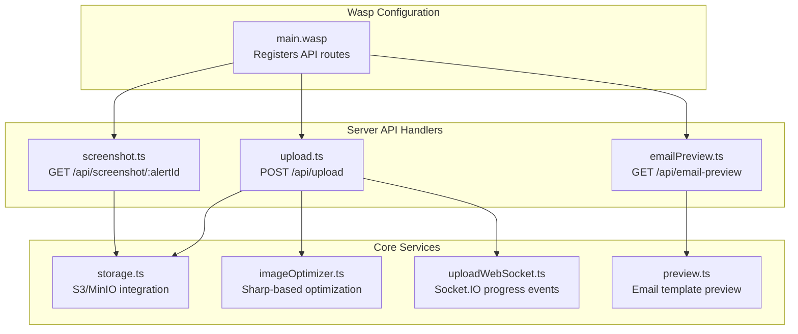
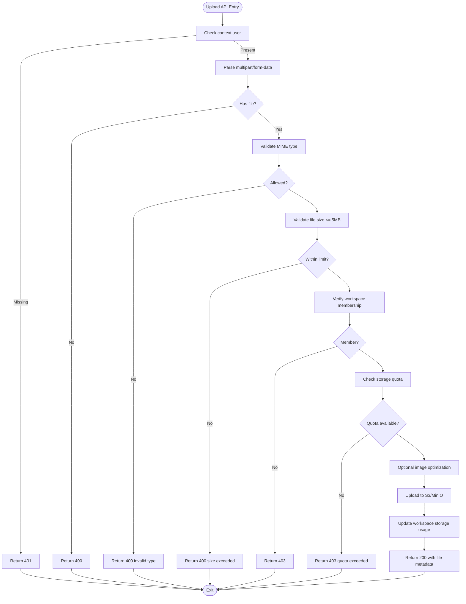
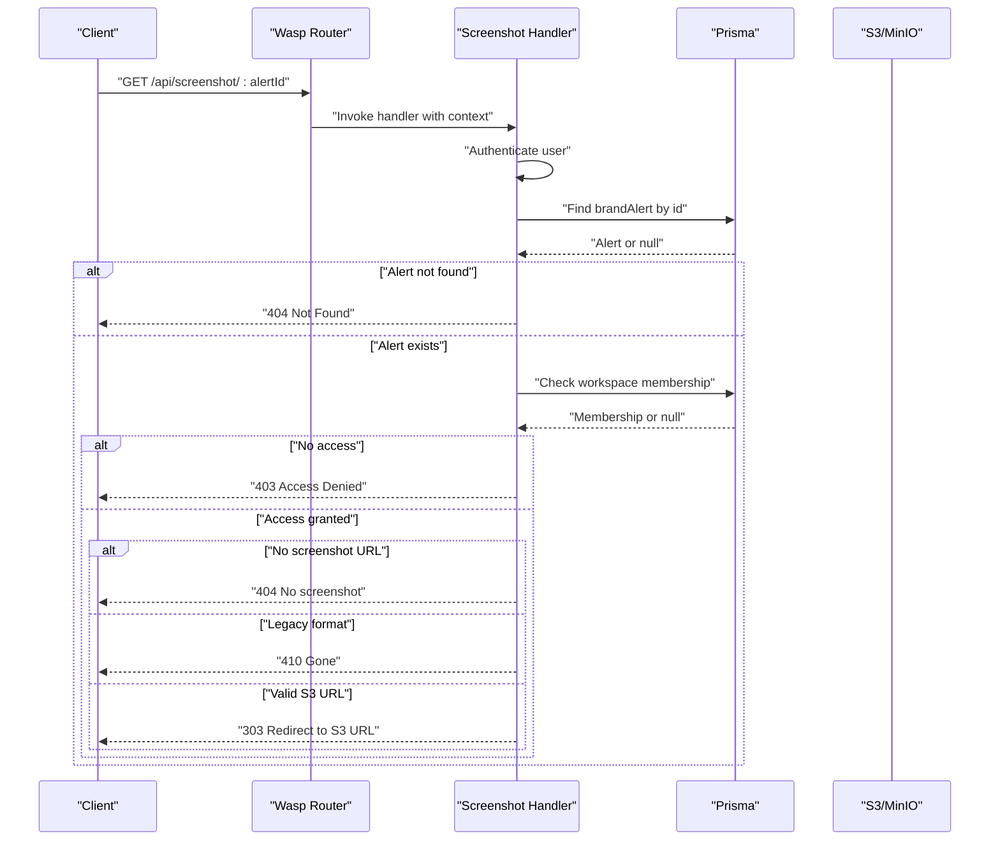
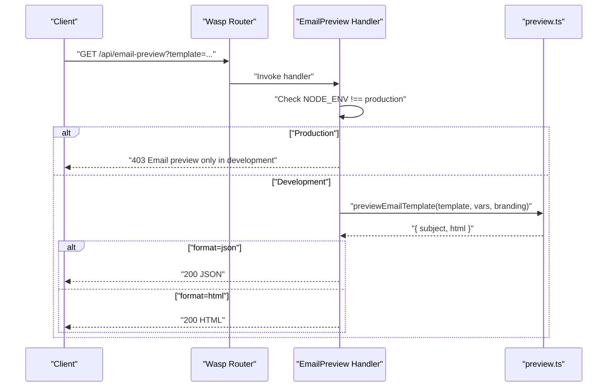
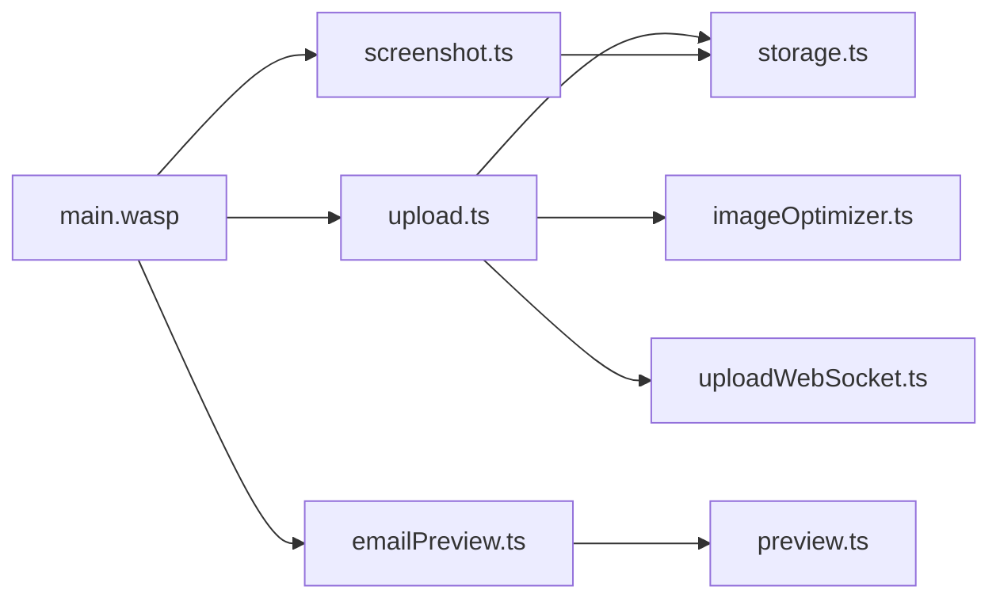

# API Endpoints

<cite>
**Referenced Files in This Document**
- [main.wasp](file://main.wasp)
- [upload.ts](file://src/server/api/upload.ts)
- [screenshot.ts](file://src/server/api/screenshot.ts)
- [emailPreview.ts](file://src/server/api/emailPreview.ts)
- [validation.ts](file://src/server/validation.ts)
- [middlewareConfig.ts](file://src/server/middlewareConfig.ts)
- [storage.ts](file://src/server/storage.ts)
- [imageOptimizer.ts](file://src/server/imageOptimizer.ts)
- [uploadWebSocket.ts](file://src/server/uploadWebSocket.ts)
- [useUploadProgress.ts](file://src/client/hooks/useUploadProgress.ts)
- [preview.ts](file://src/core/email/preview.ts)
</cite>

## Table of Contents
1. [Introduction](#introduction)
2. [Project Structure](#project-structure)
3. [Core Components](#core-components)
4. [Architecture Overview](#architecture-overview)
5. [Detailed Component Analysis](#detailed-component-analysis)
6. [Dependency Analysis](#dependency-analysis)
7. [Performance Considerations](#performance-considerations)
8. [Troubleshooting Guide](#troubleshooting-guide)
9. [Conclusion](#conclusion)

## Introduction
This document provides comprehensive API documentation for all Wasp-exposed endpoints in the backend. It covers:
- Endpoint HTTP methods, URL patterns, request/response schemas
- Authentication and authorization requirements
- Validation rules using Zod and ensureArgsSchemaOrThrowHttpError
- Integration with Express middleware for payload size limits
- Interaction with core services (storage and email rendering)
- Client-side patterns for upload progress and error handling
- Practical examples for multipart/form-data uploads, screenshot retrieval, and email preview rendering

## Project Structure
The API endpoints are declared in the Wasp configuration and implemented in dedicated server modules. The main Wasp file registers:
- Health check endpoint
- Email preview endpoint
- File upload endpoint
- Screenshot retrieval endpoint



**Diagram sources**
- [main.wasp](file://main.wasp#L208-L231)
- [upload.ts](file://src/server/api/upload.ts#L1-L229)
- [screenshot.ts](file://src/server/api/screenshot.ts#L1-L127)
- [emailPreview.ts](file://src/server/api/emailPreview.ts#L1-L76)
- [storage.ts](file://src/server/storage.ts#L1-L600)
- [imageOptimizer.ts](file://src/server/imageOptimizer.ts#L1-L290)
- [uploadWebSocket.ts](file://src/server/uploadWebSocket.ts#L1-L219)
- [preview.ts](file://src/core/email/preview.ts#L1-L401)

**Section sources**
- [main.wasp](file://main.wasp#L208-L231)

## Core Components
- Upload API: Handles multipart/form-data uploads, validates file type and size, checks workspace access and storage quota, optimizes images, emits progress events, and returns public URLs.
- Screenshot API: Redirects authenticated users to S3/MinIO public URLs for Eclipse alerts, enforcing workspace membership and rejecting legacy formats.
- Email Preview API: Development-only endpoint to preview email templates with optional custom variables and branding, returning either HTML or JSON.

**Section sources**
- [upload.ts](file://src/server/api/upload.ts#L1-L229)
- [screenshot.ts](file://src/server/api/screenshot.ts#L1-L127)
- [emailPreview.ts](file://src/server/api/emailPreview.ts#L1-L76)

## Architecture Overview
The API layer integrates with Express middleware for payload limits, Wasp’s context for authentication and entity access, and core services for storage and image optimization. WebSocket is used for real-time upload progress.

```mermaid
sequenceDiagram
    participant Client as "Client"
    participant Wasp as "Wasp Router"
    participant Handler as "API Handler"
    participant Storage as "StorageService"
    participant Opt as "ImageOptimizer"
    participant WS as "UploadWebSocket"
    Client->>Wasp: "HTTP Request"
    Wasp->>Handler: "Invoke handler with context"
    Handler->>Handler: "Authenticate user"
    Handler->>Handler: "Parse multipart/form-data"
    Handler->>Handler: "Validate type/size and workspace access"
    Handler->>Storage: "Check storage quota"
    alt "Quota OK"
        Handler->>WS: "emitUploadStart()"
        Handler->>Opt: "Optional image optimization"
        Handler->>Storage: "Upload to S3/MinIO"
        Storage-->>Handler: "UploadResult"
        Handler->>Storage: "Update storage usage"
        Handler->>WS: "emitUploadComplete()"
        Handler-->>Client: "200 JSON with file metadata"
    else "Quota exceeded"
        Handler->>WS: "emitUploadError()"
        Handler-->>Client: "403 JSON"
    end
```

**Diagram sources**
- [upload.ts](file://src/server/api/upload.ts#L44-L204)
- [storage.ts](file://src/server/storage.ts#L102-L216)
- [imageOptimizer.ts](file://src/server/imageOptimizer.ts#L61-L149)
- [uploadWebSocket.ts](file://src/server/uploadWebSocket.ts#L131-L194)

## Detailed Component Analysis

### Upload API
- Method: POST
- URL: /api/upload
- Authentication: Required (context.user must be present)
- Authorization: Must have membership in the workspace identified by workspaceId
- Request: multipart/form-data with fields:
  - file: File buffer (required)
  - workspaceId: Workspace identifier (required)
  - folder: Target folder (optional, default: uploads or logos when type is logo)
  - type: Upload type (e.g., logo, avatar, document)
- Response:
  - Success: 200 JSON with success flag and file metadata (key, url, size, contentType)
  - Errors: 400 (invalid input), 401 (unauthorized), 403 (access denied or quota exceeded), 500 (internal error)
- Validation:
  - File type validated against allowed image types
  - File size validated against 5MB limit
  - Workspace access checked via membership lookup
  - Storage quota checked before upload
- Processing:
  - Emits upload progress events via WebSocket
  - Auto-optimizes images when applicable (WebP, inside-fit resizing)
  - Stores files under workspaces/{workspaceId}/{folder}/{timestamp-filename}
  - Updates workspace storage usage
- Notes:
  - Multer memory storage with 1 file limit and 5MB file size limit
  - Express raw limit set to 50MB for raw payloads



**Diagram sources**
- [upload.ts](file://src/server/api/upload.ts#L44-L204)
- [storage.ts](file://src/server/storage.ts#L102-L216)
- [imageOptimizer.ts](file://src/server/imageOptimizer.ts#L61-L149)

**Section sources**
- [upload.ts](file://src/server/api/upload.ts#L1-L229)
- [storage.ts](file://src/server/storage.ts#L1-L600)
- [imageOptimizer.ts](file://src/server/imageOptimizer.ts#L1-L290)
- [uploadWebSocket.ts](file://src/server/uploadWebSocket.ts#L131-L194)

### Screenshot API
- Method: GET
- URL: /api/screenshot/:alertId
- Authentication: Required (context.user)
- Authorization: Must be a member of the workspace owning the alert
- Request: Path parameter alertId
- Response:
  - 303 See Other: Redirect to S3/MinIO public URL
  - 400: Missing alertId
  - 401: Unauthorized
  - 403: Access denied to alert
  - 404: Alert not found or no screenshot available
  - 410: Old screenshot format not supported
  - 500: Internal error
- Validation:
  - Requires alert existence and workspace membership
  - Rejects non-S3 URLs in development
- Notes:
  - Enforces S3 URL requirement for screenshots



**Diagram sources**
- [screenshot.ts](file://src/server/api/screenshot.ts#L25-L114)

**Section sources**
- [screenshot.ts](file://src/server/api/screenshot.ts#L1-L127)

### Email Preview API
- Method: GET
- URL: /api/email-preview
- Authentication: Not required (raw Express handler)
- Environment: Development only; throws 403 in production
- Query parameters:
  - template: Email template name (optional; lists available templates if omitted)
  - format: json or html (default html)
  - branding: JSON string of custom branding (optional)
  - Additional custom variables: passed as query params
- Response:
  - If template omitted: JSON listing available templates and usage hints
  - If template provided:
    - format=json: JSON with subject, html, variables, and branding
    - format=html: HTML response rendered by the email renderer
- Validation:
  - Throws structured error on preview failure
- Notes:
  - Uses preview.ts to render templates with sample data and optional custom branding



**Diagram sources**
- [emailPreview.ts](file://src/server/api/emailPreview.ts#L23-L75)
- [preview.ts](file://src/core/email/preview.ts#L12-L26)

**Section sources**
- [emailPreview.ts](file://src/server/api/emailPreview.ts#L1-L76)
- [preview.ts](file://src/core/email/preview.ts#L1-L401)

## Dependency Analysis
- Wasp configuration registers each API with HTTP route and middleware configuration.
- Upload API depends on:
  - StorageService for S3/MinIO operations and quota checks
  - ImageOptimizer for image optimization
  - UploadWebSocket for progress events
- Screenshot API depends on:
  - Prisma for workspace membership checks
  - StorageService URL extraction helpers
- Email Preview API depends on:
  - preview.ts for rendering and sample data



**Diagram sources**
- [main.wasp](file://main.wasp#L208-L231)
- [upload.ts](file://src/server/api/upload.ts#L1-L229)
- [screenshot.ts](file://src/server/api/screenshot.ts#L1-L127)
- [emailPreview.ts](file://src/server/api/emailPreview.ts#L1-L76)
- [storage.ts](file://src/server/storage.ts#L1-L600)
- [imageOptimizer.ts](file://src/server/imageOptimizer.ts#L1-L290)
- [uploadWebSocket.ts](file://src/server/uploadWebSocket.ts#L1-L219)
- [preview.ts](file://src/core/email/preview.ts#L1-L401)

**Section sources**
- [main.wasp](file://main.wasp#L208-L231)

## Performance Considerations
- Payload size limits:
  - JSON/URL-encoded/text: 10MB
  - Raw/Files: 50MB
- Image optimization:
  - Images are resized and compressed to WebP when eligible
  - Logo optimization uses specific dimensions
- Storage:
  - Files stored under workspaces/{workspaceId}/{folder}/{timestamp-filename}
  - Public ACL enabled for uploaded files
- WebSocket progress:
  - Real-time upload progress via Socket.IO rooms per workspace

[No sources needed since this section provides general guidance]

## Troubleshooting Guide
- Upload API
  - 401 Unauthorized: Ensure user is authenticated
  - 400 Invalid file type or size: Confirm MIME type and ≤5MB limit
  - 403 Access denied or quota exceeded: Verify workspace membership and storage quota
  - 500 Internal error: Check logs and S3 connectivity
- Screenshot API
  - 404 Alert not found or no screenshot: Re-run monitor to generate screenshot
  - 410 Legacy format: Regenerate alert to produce S3 URL
- Email Preview API
  - 403 Production mode: Use development environment
  - 400 Template preview failed: Validate template name and custom variables

**Section sources**
- [upload.ts](file://src/server/api/upload.ts#L44-L228)
- [screenshot.ts](file://src/server/api/screenshot.ts#L25-L126)
- [emailPreview.ts](file://src/server/api/emailPreview.ts#L23-L75)

## Conclusion
The backend exposes three key API endpoints:
- POST /api/upload for branded and general file uploads with robust validation, quota enforcement, and real-time progress
- GET /api/screenshot/:alertId for secure redirection to S3/MinIO screenshots with workspace access checks
- GET /api/email-preview for development-only email template previews

These endpoints integrate tightly with Express middleware for payload limits, Wasp’s context for authentication, and core services for storage and image optimization. Client-side hooks provide seamless upload progress tracking via WebSocket.