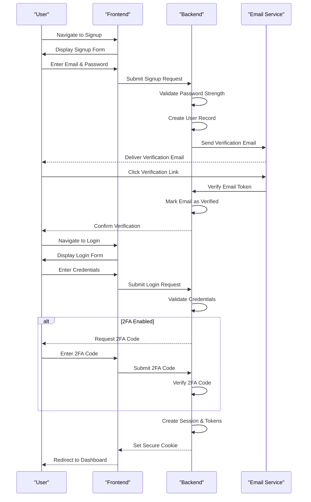
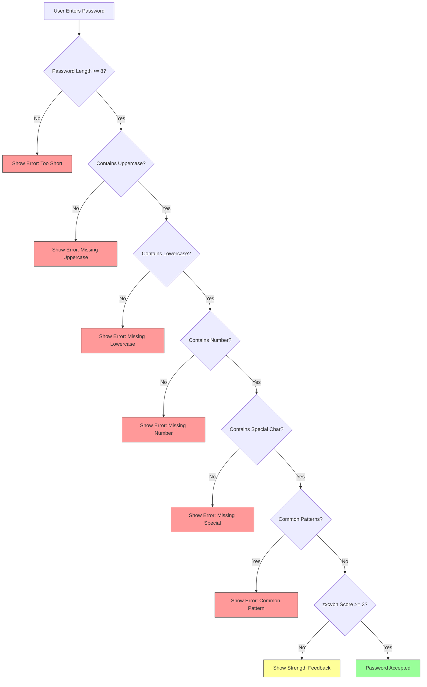
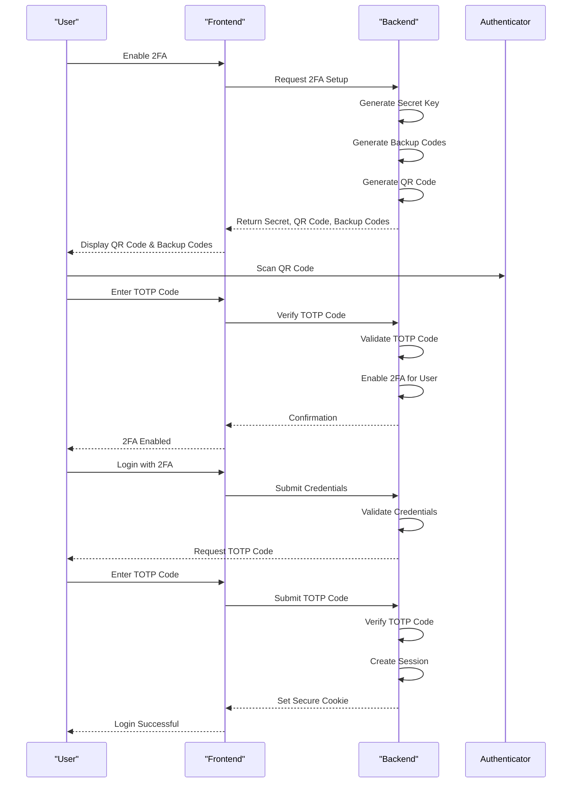
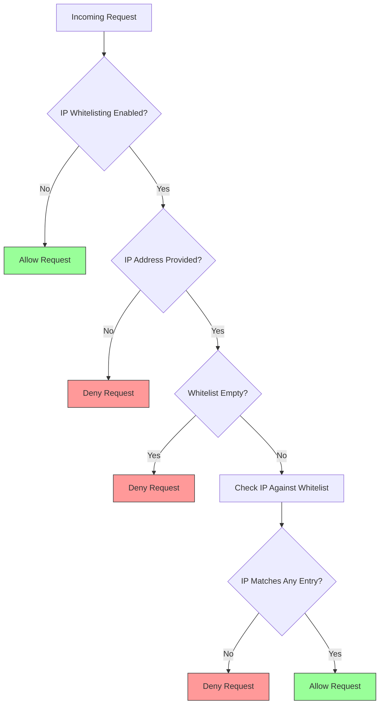
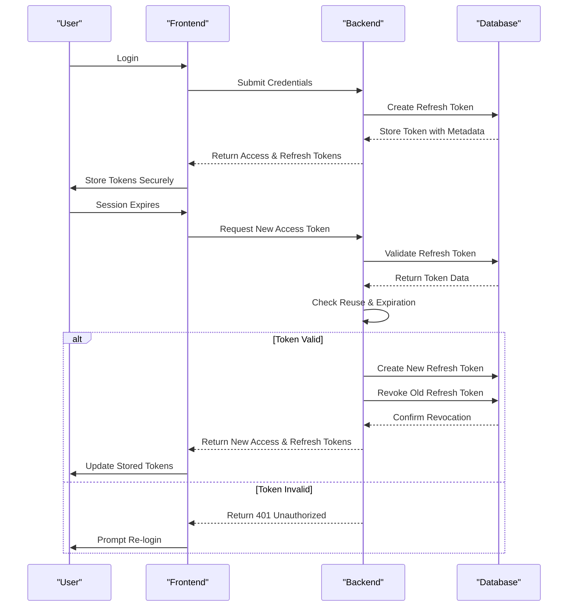
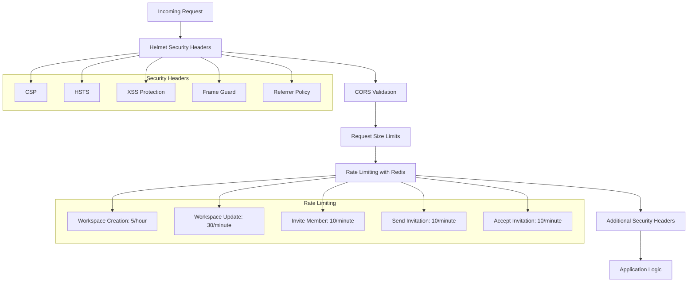
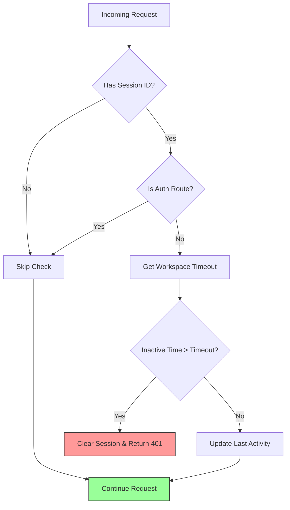
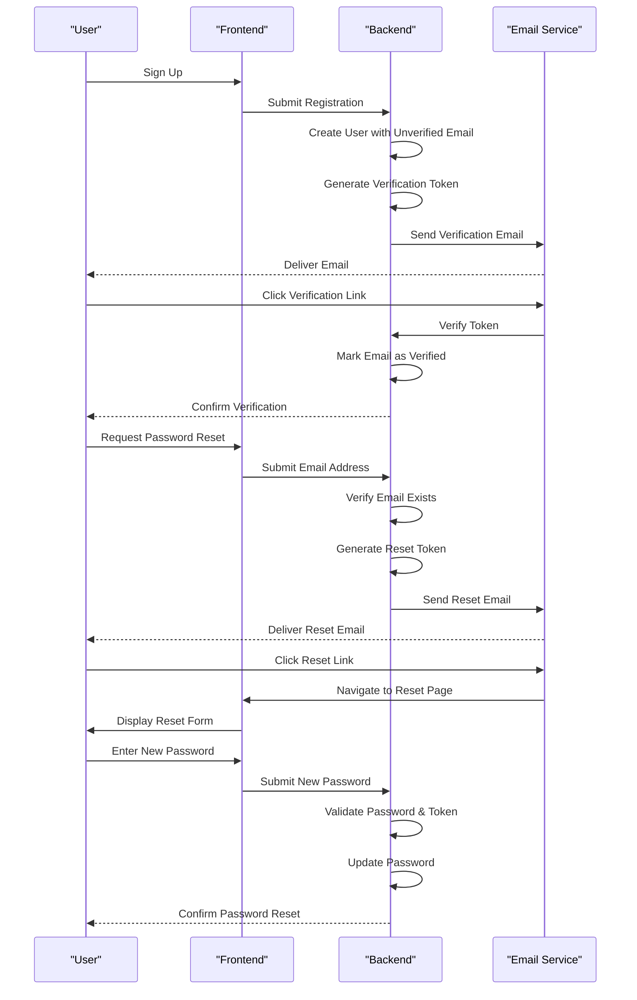
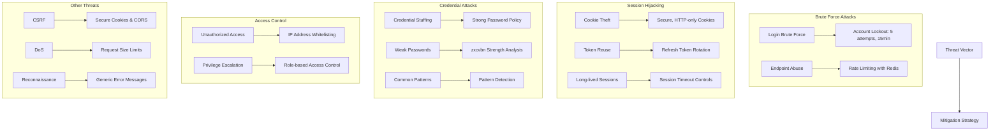

# Authentication Flow

<cite>
**Referenced Files in This Document**   
- [security.ts](file://src/server/security.ts)
- [rateLimit.ts](file://src/server/rateLimit.ts)
- [sessionTimeout.ts](file://src/server/sessionTimeout.ts)
- [passwordPolicy.ts](file://src/core/auth/passwordPolicy.ts)
- [twoFactor.ts](file://src/core/auth/twoFactor.ts)
- [twoFactorOperations.ts](file://src/core/auth/twoFactorOperations.ts)
- [ipWhitelist.ts](file://src/core/auth/ipWhitelist.ts)
- [ipWhitelistOperations.ts](file://src/core/auth/ipWhitelistOperations.ts)
- [refreshToken.ts](file://src/core/auth/refreshToken.ts)
- [emails.ts](file://src/core/auth/emails.ts)
- [middlewareConfig.ts](file://src/server/middlewareConfig.ts)
- [LoginPage.tsx](file://src/client/pages/auth/LoginPage.tsx)
- [SignupPage.tsx](file://src/client/pages/auth/SignupPage.tsx)
- [EmailVerificationPage.tsx](file://src/client/pages/auth/EmailVerificationPage.tsx)
- [PasswordResetPage.tsx](file://src/client/pages/auth/PasswordResetPage.tsx)
- [RequestPasswordResetPage.tsx](file://src/client/pages/auth/RequestPasswordResetPage.tsx)
</cite>

## Table of Contents
1. [Introduction](#introduction)
2. [Authentication Architecture Overview](#authentication-architecture-overview)
3. [User Authentication Flow](#user-authentication-flow)
4. [Password Policy Enforcement](#password-policy-enforcement)
5. [Two-Factor Authentication with TOTP](#two-factor-authentication-with-totp)
6. [IP Address Whitelisting](#ip-address-whitelisting)
7. [Refresh Token Management](#refresh-token-management)
8. [Security Middleware and Session Management](#security-middleware-and-session-management)
9. [Session Timeout Controls and Secure Cookie Handling](#session-timeout-controls-and-secure-cookie-handling)
10. [Frontend-Backend Authentication Integration](#frontend-backend-authentication-integration)
11. [Email Verification and Password Reset Workflows](#email-verification-and-password-reset-workflows)
12. [Threat Models and Mitigation Strategies](#threat-models-and-mitigation-strategies)
13. [Security Policy Configuration](#security-policy-configuration)

## Introduction
This document provides comprehensive architectural documentation for the multi-layered authentication system implemented in the SentinelIQ application. The system incorporates multiple security layers including password policy enforcement, two-factor authentication (2FA) with Time-based One-Time Password (TOTP), IP address whitelisting, and refresh token management. The authentication architecture is designed to provide robust security while maintaining usability, with security middleware that integrates with session management to enforce rate limiting and session timeout controls. This documentation details the complete authentication flow, implementation details, and security considerations for the system.

## Authentication Architecture Overview
The authentication system in SentinelIQ is a multi-layered architecture that combines frontend components with backend services to provide comprehensive security. The system is built on a client-server model with React-based frontend components interacting with a Node.js/Express backend through Wasp framework operations. The architecture incorporates several key security components: password policy enforcement using zxcvbn for password strength analysis, TOTP-based two-factor authentication using speakeasy, IP address whitelisting with CIDR notation support, and refresh token management with token rotation. Security middleware enforces rate limiting using Redis, implements session timeout controls based on workspace configuration, and applies secure cookie handling. The system also includes email verification and password reset workflows with professionally designed email templates.

```mermaid
graph TD
subgraph "Frontend"
A[LoginPage] --> B[SignupPage]
C[EmailVerificationPage] --> D[PasswordResetPage]
E[RequestPasswordResetPage] --> F[AuthPageLayout]
end
subgraph "Backend"
G[security.ts] --> H[rateLimit.ts]
I[sessionTimeout.ts] --> J[passwordPolicy.ts]
K[twoFactor.ts] --> L[ipWhitelist.ts]
M[refreshToken.ts] --> N[emails.ts]
end
Frontend < --> Backend
H --> O[Redis]
L --> P[Prisma DB]
M --> P
style A fill:#f9f,stroke:#333
style B fill:#f9f,stroke:#333
style C fill:#f9f,stroke:#333
style D fill:#f9f,stroke:#333
style E fill:#f9f,stroke:#333
style F fill:#f9f,stroke:#333
style G fill:#bbf,stroke:#333
style H fill:#bbf,stroke:#333
style I fill:#bbf,stroke:#333
style J fill:#bbf,stroke:#333
style K fill:#bbf,stroke:#333
style L fill:#bbf,stroke:#333
style M fill:#bbf,stroke:#333
style N fill:#bbf,stroke:#333
style O fill:#9f9,stroke:#333
style P fill:#9f9,stroke:#333
```

**Diagram sources**
- [security.ts](file://src/server/security.ts)
- [rateLimit.ts](file://src/server/rateLimit.ts)
- [sessionTimeout.ts](file://src/server/sessionTimeout.ts)
- [passwordPolicy.ts](file://src/core/auth/passwordPolicy.ts)
- [twoFactor.ts](file://src/core/auth/twoFactor.ts)
- [ipWhitelist.ts](file://src/core/auth/ipWhitelist.ts)
- [refreshToken.ts](file://src/core/auth/refreshToken.ts)
- [emails.ts](file://src/core/auth/emails.ts)
- [LoginPage.tsx](file://src/client/pages/auth/LoginPage.tsx)
- [SignupPage.tsx](file://src/client/pages/auth/SignupPage.tsx)
- [EmailVerificationPage.tsx](file://src/client/pages/auth/EmailVerificationPage.tsx)
- [PasswordResetPage.tsx](file://src/client/pages/auth/PasswordResetPage.tsx)
- [RequestPasswordResetPage.tsx](file://src/client/pages/auth/RequestPasswordResetPage.tsx)

**Section sources**
- [security.ts](file://src/server/security.ts)
- [rateLimit.ts](file://src/server/rateLimit.ts)
- [sessionTimeout.ts](file://src/server/sessionTimeout.ts)
- [passwordPolicy.ts](file://src/core/auth/passwordPolicy.ts)
- [twoFactor.ts](file://src/core/auth/twoFactor.ts)
- [ipWhitelist.ts](file://src/core/auth/ipWhitelist.ts)
- [refreshToken.ts](file://src/core/auth/refreshToken.ts)
- [emails.ts](file://src/core/auth/emails.ts)
- [LoginPage.tsx](file://src/client/pages/auth/LoginPage.tsx)
- [SignupPage.tsx](file://src/client/pages/auth/SignupPage.tsx)
- [EmailVerificationPage.tsx](file://src/client/pages/auth/EmailVerificationPage.tsx)
- [PasswordResetPage.tsx](file://src/client/pages/auth/PasswordResetPage.tsx)
- [RequestPasswordResetPage.tsx](file://src/client/pages/auth/RequestPasswordResetPage.tsx)

## User Authentication Flow
The user authentication flow in SentinelIQ follows a multi-step process that begins with user registration and continues through login, two-factor authentication (if enabled), and session management. When a new user signs up, they provide their email and password, which is validated against the password policy requirements. The system then sends a verification email with a unique link that the user must click to verify their email address. Once verified, the user can log in with their credentials. If two-factor authentication is enabled for the user or workspace, they are prompted to enter a TOTP code from their authenticator app or a backup code. The system validates the credentials and 2FA code, creates a session with a secure cookie, and issues an access token and refresh token. The refresh token is stored in the database with IP address and user agent information for security tracking. Subsequent requests use the session cookie for authentication, with periodic refresh token rotation to enhance security.



**Diagram sources**
- [security.ts](file://src/server/security.ts)
- [passwordPolicy.ts](file://src/core/auth/passwordPolicy.ts)
- [twoFactor.ts](file://src/core/auth/twoFactor.ts)
- [refreshToken.ts](file://src/core/auth/refreshToken.ts)
- [emails.ts](file://src/core/auth/emails.ts)
- [LoginPage.tsx](file://src/client/pages/auth/LoginPage.tsx)
- [SignupPage.tsx](file://src/client/pages/auth/SignupPage.tsx)
- [EmailVerificationPage.tsx](file://src/client/pages/auth/EmailVerificationPage.tsx)

**Section sources**
- [security.ts](file://src/server/security.ts)
- [passwordPolicy.ts](file://src/core/auth/passwordPolicy.ts)
- [twoFactor.ts](file://src/core/auth/twoFactor.ts)
- [refreshToken.ts](file://src/core/auth/refreshToken.ts)
- [emails.ts](file://src/core/auth/emails.ts)
- [LoginPage.tsx](file://src/client/pages/auth/LoginPage.tsx)
- [SignupPage.tsx](file://src/client/pages/auth/SignupPage.tsx)
- [EmailVerificationPage.tsx](file://src/client/pages/auth/EmailVerificationPage.tsx)

## Password Policy Enforcement
The password policy enforcement system in SentinelIQ implements multiple layers of validation to ensure strong password security. The system uses the zxcvbn library to analyze password strength, requiring a minimum score of 3 (strong) on a 0-4 scale. Passwords must be at least 8 characters long and contain uppercase letters, lowercase letters, numbers, and special characters. The system checks for common patterns such as "123", "password", "qwerty", "admin", "letmein", and "welcome" to prevent users from selecting easily guessable passwords. During registration and password changes, the frontend displays a password strength meter that provides real-time feedback on the password's strength, helping users create more secure passwords. The backend performs the same validation to ensure security even if the frontend validation is bypassed. Passwords are hashed using secure algorithms before storage, and the system prevents password reuse by maintaining a history of previous passwords.



**Diagram sources**
- [passwordPolicy.ts](file://src/core/auth/passwordPolicy.ts)
- [SignupPage.tsx](file://src/client/pages/auth/SignupPage.tsx)

**Section sources**
- [passwordPolicy.ts](file://src/core/auth/passwordPolicy.ts)
- [SignupPage.tsx](file://src/client/pages/auth/SignupPage.tsx)

## Two-Factor Authentication with TOTP
The two-factor authentication (2FA) system in SentinelIQ implements Time-based One-Time Password (TOTP) algorithm using the speakeasy library. Users can enable 2FA for their accounts through a secure process that generates a secret key and QR code for scanning with authenticator apps like Google Authenticator or Authy. The system generates eight 8-character backup codes that users can use if they lose access to their authenticator app. When logging in, users with 2FA enabled must provide both their password and a 6-digit TOTP code generated by their authenticator app. The system validates the code with a 60-second grace period (allowing for 2 time steps before and after the current time) to account for clock drift. The implementation includes account lockout after 5 failed attempts, with a 15-minute lockout period to prevent brute force attacks. Users can disable 2FA by providing a valid TOTP code or backup code, and can regenerate new backup codes when needed.



**Diagram sources**
- [twoFactor.ts](file://src/core/auth/twoFactor.ts)
- [twoFactorOperations.ts](file://src/core/auth/twoFactorOperations.ts)

**Section sources**
- [twoFactor.ts](file://src/core/auth/twoFactor.ts)
- [twoFactorOperations.ts](file://src/core/auth/twoFactorOperations.ts)

## IP Address Whitelisting
The IP address whitelisting feature in SentinelIQ provides an additional layer of security by restricting access to workspaces based on IP addresses. This enterprise-level feature allows workspace owners to specify a list of allowed IP addresses, CIDR ranges, or wildcard patterns. The system validates IP addresses using multiple formats: individual IP addresses (e.g., 192.168.1.100), CIDR notation (e.g., 192.168.1.0/24), and wildcard patterns (e.g., 192.168.1.*). The middleware extracts the client IP from various headers including X-Forwarded-For, X-Real-IP, and X-Client-IP, with support for IPv4-mapped IPv6 addresses. When a request is received, the system checks if the client IP matches any entry in the whitelist. If IP whitelisting is enabled for the workspace and the IP is not in the whitelist, the request is denied with a 403 Forbidden response. The feature is only available to enterprise plan subscribers and requires owner-level permissions to configure.



**Diagram sources**
- [ipWhitelist.ts](file://src/core/auth/ipWhitelist.ts)
- [ipWhitelistOperations.ts](file://src/core/auth/ipWhitelistOperations.ts)

**Section sources**
- [ipWhitelist.ts](file://src/core/auth/ipWhitelist.ts)
- [ipWhitelistOperations.ts](file://src/core/auth/ipWhitelistOperations.ts)

## Refresh Token Management
The refresh token management system in SentinelIQ implements secure token-based authentication with token rotation and revocation. When a user successfully authenticates, the system generates a cryptographically secure 64-byte refresh token using randomBytes from the crypto library. Each refresh token is stored in the database with metadata including the user ID, expiration date (30 days from creation), IP address, and user agent. The system limits each user to a maximum of 5 active refresh tokens, automatically revoking the oldest tokens when this limit is exceeded. When a refresh token is used to obtain a new access token, the system implements token rotation by creating a new refresh token and immediately revoking the old one. This prevents token reuse and detects potential security breaches. The system also detects and responds to refresh token reuse by revoking all refresh tokens for the user's account. A scheduled job periodically cleans up expired and revoked tokens to maintain database efficiency.



**Diagram sources**
- [refreshToken.ts](file://src/core/auth/refreshToken.ts)

**Section sources**
- [refreshToken.ts](file://src/core/auth/refreshToken.ts)

## Security Middleware and Session Management
The security middleware in SentinelIQ implements multiple layers of protection through the security.ts module. The system uses Helmet to set security headers including Content Security Policy (CSP), HTTP Strict Transport Security (HSTS), and XSS protection. The CSP configuration restricts content sources to trusted domains while allowing necessary third-party services like Stripe and Cloudflare. CORS is configured with environment-specific allowed origins, including production domains, development environments, and preview deployments. The middleware enforces request size limits of 10MB for JSON, URL-encoded, and text payloads, and 50MB for raw file uploads to prevent DoS attacks. Rate limiting is implemented using Redis with predefined limits for various actions such as workspace creation (5 per hour) and invitations (10 per minute). The system fails open if Redis is unavailable, logging the error but not blocking requests to maintain availability.



**Diagram sources**
- [security.ts](file://src/server/security.ts)
- [rateLimit.ts](file://src/server/rateLimit.ts)
- [middlewareConfig.ts](file://src/server/middlewareConfig.ts)

**Section sources**
- [security.ts](file://src/server/security.ts)
- [rateLimit.ts](file://src/server/rateLimit.ts)
- [middlewareConfig.ts](file://src/server/middlewareConfig.ts)

## Session Timeout Controls and Secure Cookie Handling
The session management system in SentinelIQ implements workspace-specific session timeout controls and secure cookie handling. The sessionTimeout.ts module tracks user activity and invalidates sessions after a configurable period of inactivity, with a default of 30 minutes. Workspace owners can configure custom session timeout values to meet their security requirements. The system maintains an in-memory session store with the last activity timestamp and workspace ID for each session, with periodic cleanup of expired sessions. When a request is received, the middleware checks the session's last activity against the workspace's timeout setting and returns a 401 Unauthorized response if the session has expired. Secure cookie handling is implemented with the sessionId cookie marked as HTTP-only and Secure, preventing access via JavaScript and ensuring transmission only over HTTPS. The system clears sessions from the store on logout and logs session creation and cleanup events for audit purposes.



**Diagram sources**
- [sessionTimeout.ts](file://src/server/sessionTimeout.ts)

**Section sources**
- [sessionTimeout.ts](file://src/server/sessionTimeout.ts)

## Frontend-Backend Authentication Integration
The frontend and backend authentication components in SentinelIQ are tightly integrated through Wasp framework operations and React components. The frontend uses Wasp's built-in authentication forms (LoginForm, SignupForm, etc.) that handle the UI and form validation, while custom components like PasswordStrengthMeter provide enhanced user experience. The AuthPageLayout component provides a consistent layout for all authentication pages. When users interact with these forms, they trigger Wasp operations that execute on the backend, such as enabling 2FA or verifying email addresses. The system uses React hooks and Wasp's router for navigation between authentication states. Error handling is implemented consistently across the frontend, with user-friendly messages for common issues like invalid credentials or expired sessions. The integration ensures that security policies enforced on the backend are reflected in the frontend user experience, such as displaying password strength feedback during registration.

```mermaid
graph TD
subgraph "Frontend Components"
A[LoginPage] --> B[LoginForm]
C[SignupPage] --> D[SignupForm]
E[EmailVerificationPage] --> F[VerifyEmailForm]
G[PasswordResetPage] --> H[ResetPasswordForm]
I[RequestPasswordResetPage] --> J[ForgotPasswordForm]
K[AuthPageLayout] --> L[PasswordStrengthMeter]
end
subgraph "Backend Operations"
M[enable2FA] --> N[verify2FA]
O[disable2FA] --> P[generateNew2FABackupCodes]
Q[getWorkspaceIpWhitelist] --> R[updateWorkspaceIpWhitelist]
S[addIpToWhitelist] --> T[removeIpFromWhitelist]
U[toggleIpWhitelist] --> V[createRefreshToken]
W[validateAndRotateRefreshToken] --> X[revokeRefreshToken]
end
Frontend Components < --> Backend Operations
style A fill:#f9f,stroke:#333
style B fill:#f9f,stroke:#333
style C fill:#f9f,stroke:#333
style D fill:#f9f,stroke:#333
style E fill:#f9f,stroke:#333
style F fill:#f9f,stroke:#333
style G fill:#f9f,stroke:#333
style H fill:#f9f,stroke:#333
style I fill:#f9f,stroke:#333
style J fill:#f9f,stroke:#333
style K fill:#f9f,stroke:#333
style L fill:#f9f,stroke:#333
style M fill:#bbf,stroke:#333
style N fill:#bbf,stroke:#333
style O fill:#bbf,stroke:#333
style P fill:#bbf,stroke:#333
style Q fill:#bbf,stroke:#333
style R fill:#bbf,stroke:#333
style S fill:#bbf,stroke:#333
style T fill:#bbf,stroke:#333
style U fill:#bbf,stroke:#333
style V fill:#bbf,stroke:#333
style W fill:#bbf,stroke:#333
style X fill:#bbf,stroke:#333
```

**Diagram sources**
- [LoginPage.tsx](file://src/client/pages/auth/LoginPage.tsx)
- [SignupPage.tsx](file://src/client/pages/auth/SignupPage.tsx)
- [EmailVerificationPage.tsx](file://src/client/pages/auth/EmailVerificationPage.tsx)
- [PasswordResetPage.tsx](file://src/client/pages/auth/PasswordResetPage.tsx)
- [RequestPasswordResetPage.tsx](file://src/client/pages/auth/RequestPasswordResetPage.tsx)
- [twoFactorOperations.ts](file://src/core/auth/twoFactorOperations.ts)
- [ipWhitelistOperations.ts](file://src/core/auth/ipWhitelistOperations.ts)
- [refreshToken.ts](file://src/core/auth/refreshToken.ts)

**Section sources**
- [LoginPage.tsx](file://src/client/pages/auth/LoginPage.tsx)
- [SignupPage.tsx](file://src/client/pages/auth/SignupPage.tsx)
- [EmailVerificationPage.tsx](file://src/client/pages/auth/EmailVerificationPage.tsx)
- [PasswordResetPage.tsx](file://src/client/pages/auth/PasswordResetPage.tsx)
- [RequestPasswordResetPage.tsx](file://src/client/pages/auth/RequestPasswordResetPage.tsx)
- [twoFactorOperations.ts](file://src/core/auth/twoFactorOperations.ts)
- [ipWhitelistOperations.ts](file://src/core/auth/ipWhitelistOperations.ts)
- [refreshToken.ts](file://src/core/auth/refreshToken.ts)

## Email Verification and Password Reset Workflows
The email verification and password reset workflows in SentinelIQ provide secure account management features with professionally designed email templates. When a new user signs up, the system generates a unique verification token and sends an email with a verification link using the getVerificationEmailContent function. The email includes the user's name (when available) and the verification URL, with a subject line in Portuguese: "Verifique seu email - SentinelIQ". Clicking the link verifies the email address and activates the account. For password resets, users can request a reset link via the RequestPasswordResetPage, which triggers the getPasswordResetEmailContent function to send an email with a reset URL. The password reset email has the subject "Redefinir senha - SentinelIQ" and includes instructions in Portuguese. Both workflows use Wasp's built-in form components and follow a secure process that prevents enumeration attacks by providing generic success messages regardless of whether the email exists in the system.



**Diagram sources**
- [emails.ts](file://src/core/auth/emails.ts)
- [EmailVerificationPage.tsx](file://src/client/pages/auth/EmailVerificationPage.tsx)
- [PasswordResetPage.tsx](file://src/client/pages/auth/PasswordResetPage.tsx)
- [RequestPasswordResetPage.tsx](file://src/client/pages/auth/RequestPasswordResetPage.tsx)

**Section sources**
- [emails.ts](file://src/core/auth/emails.ts)
- [EmailVerificationPage.tsx](file://src/client/pages/auth/EmailVerificationPage.tsx)
- [PasswordResetPage.tsx](file://src/client/pages/auth/PasswordResetPage.tsx)
- [RequestPasswordResetPage.tsx](file://src/client/pages/auth/RequestPasswordResetPage.tsx)

## Threat Models and Mitigation Strategies
The authentication system in SentinelIQ addresses several common attack vectors through comprehensive threat modeling and mitigation strategies. For brute force attacks, the system implements account lockout after 5 failed login attempts with a 15-minute lockout period, combined with rate limiting on authentication endpoints. To prevent session hijacking, the system uses secure, HTTP-only cookies for session management, implements session timeout controls, and rotates refresh tokens with each use. The refresh token reuse detection mechanism revokes all tokens for an account if reuse is detected, indicating a potential security breach. For credential stuffing attacks, the system enforces strong password policies using zxcvbn to prevent weak passwords and checks for common patterns. IP address whitelisting provides defense against unauthorized access from unknown locations. The system also mitigates CSRF attacks through the use of secure cookies and proper CORS configuration. All sensitive operations are logged in the audit log for monitoring and incident response.



**Diagram sources**
- [security.ts](file://src/server/security.ts)
- [rateLimit.ts](file://src/server/rateLimit.ts)
- [sessionTimeout.ts](file://src/server/sessionTimeout.ts)
- [passwordPolicy.ts](file://src/core/auth/passwordPolicy.ts)
- [twoFactor.ts](file://src/core/auth/twoFactor.ts)
- [ipWhitelist.ts](file://src/core/auth/ipWhitelist.ts)
- [refreshToken.ts](file://src/core/auth/refreshToken.ts)

**Section sources**
- [security.ts](file://src/server/security.ts)
- [rateLimit.ts](file://src/server/rateLimit.ts)
- [sessionTimeout.ts](file://src/server/sessionTimeout.ts)
- [passwordPolicy.ts](file://src/core/auth/passwordPolicy.ts)
- [twoFactor.ts](file://src/core/auth/twoFactor.ts)
- [ipWhitelist.ts](file://src/core/auth/ipWhitelist.ts)
- [refreshToken.ts](file://src/core/auth/refreshToken.ts)

## Security Policy Configuration
The authentication system in SentinelIQ provides configurable security policies that can be tailored to meet organizational requirements and compliance standards. Workspace owners can configure session timeout values to balance security and usability, with shorter timeouts providing better protection against unauthorized access. The IP address whitelisting feature allows organizations to restrict access to trusted networks, supporting compliance with regulations that require network-based access controls. Password policies are enforced globally with a minimum length of 8 characters and a minimum strength score of 3, meeting common regulatory requirements for password complexity. Two-factor authentication can be mandated for all users within a workspace to meet compliance requirements for multi-factor authentication. The system logs all authentication-related events, including login attempts, 2FA changes, and IP whitelist modifications, providing an audit trail for compliance reporting. Enterprise plan subscribers have access to advanced security features like IP whitelisting, while all users benefit from the core security protections.

```mermaid
erDiagram
WORKSPACE ||--o{ SECURITY_POLICY : has
USER ||--o{ SECURITY_POLICY : subject
SECURITY_POLICY }|--|| SESSION_TIMEOUT : includes
SECURITY_POLICY }|--|| PASSWORD_POLICY : includes
SECURITY_POLICY }|--|| TWO_FACTOR_POLICY : includes
SECURITY_POLICY }|--|| IP_WHITELIST_POLICY : includes
SECURITY_POLICY }|--|| AUDIT_LOGGING_POLICY : includes
class SECURITY_POLICY {
+string id
+datetime createdAt
+datetime updatedAt
+boolean enabled
}
class SESSION_TIMEOUT {
+integer timeoutMinutes
+boolean enforcePerWorkspace
}
class PASSWORD_POLICY {
+integer minLength
+integer minStrengthScore
+boolean requireUppercase
+boolean requireLowercase
+boolean requireNumber
+boolean requireSpecialChar
+boolean preventCommonPatterns
}
class TWO_FACTOR_POLICY {
+boolean mandatory
+integer backupCodeCount
+boolean allowBackupCodes
}
class IP_WHITELIST_POLICY {
+boolean enabled
+string[] allowedIPs
+boolean allowWildcard
+boolean allowCIDR
}
class AUDIT_LOGGING_POLICY {
+boolean logFailedLogins
+boolean logSuccessfulLogins
+boolean logPolicyChanges
+boolean logTokenRotations
+integer retentionDays
}
```

**Diagram sources**
- [sessionTimeout.ts](file://src/server/sessionTimeout.ts)
- [passwordPolicy.ts](file://src/core/auth/passwordPolicy.ts)
- [twoFactor.ts](file://src/core/auth/twoFactor.ts)
- [ipWhitelist.ts](file://src/core/auth/ipWhitelist.ts)
- [refreshToken.ts](file://src/core/auth/refreshToken.ts)

**Section sources**
- [sessionTimeout.ts](file://src/server/sessionTimeout.ts)
- [passwordPolicy.ts](file://src/core/auth/passwordPolicy.ts)
- [twoFactor.ts](file://src/core/auth/twoFactor.ts)
- [ipWhitelist.ts](file://src/core/auth/ipWhitelist.ts)
- [refreshToken.ts](file://src/core/auth/refreshToken.ts)