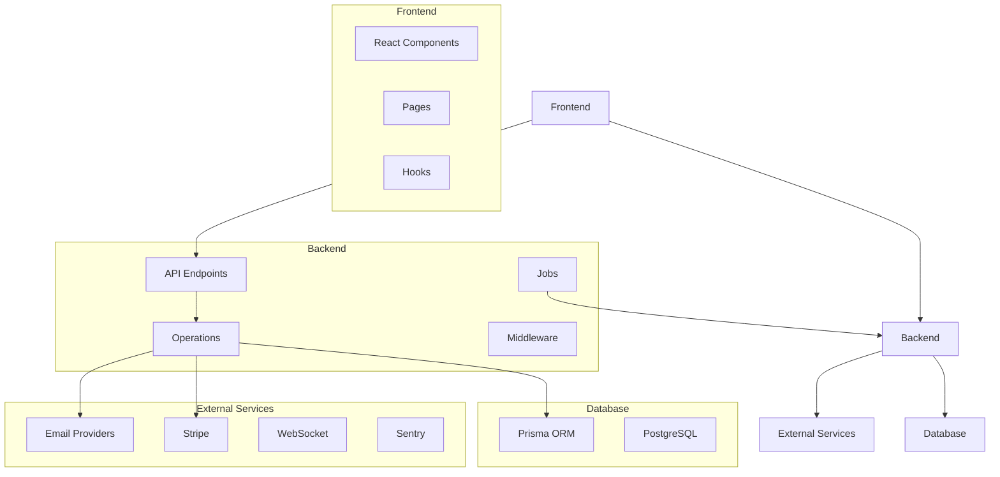
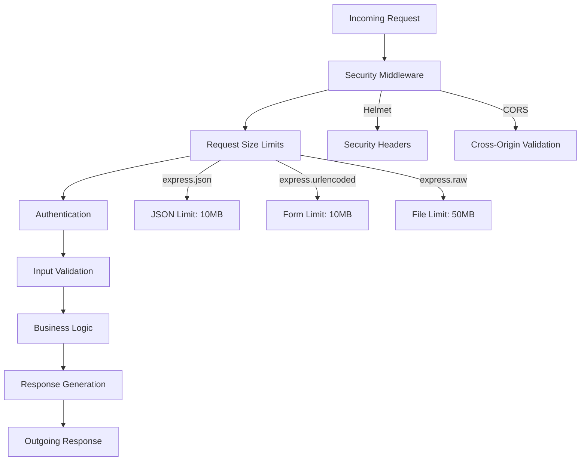
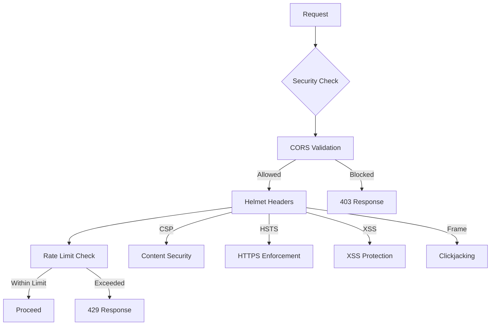
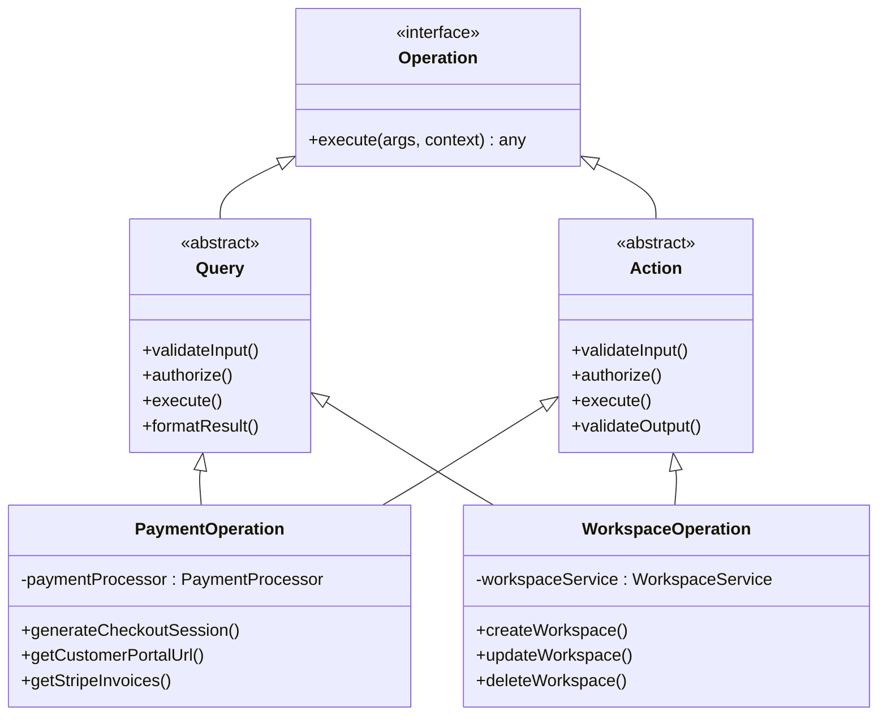
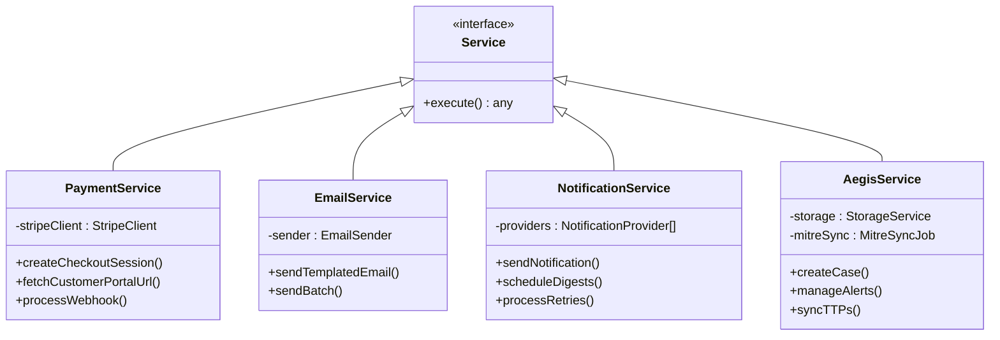

# Backend Architecture

<cite>
**Referenced Files in This Document**   
- [main.wasp](file://main.wasp)
- [middlewareConfig.ts](file://src/server/middlewareConfig.ts)
- [security.ts](file://src/server/security.ts)
- [rateLimit.ts](file://src/server/rateLimit.ts)
- [sentry.ts](file://src/server/sentry.ts)
- [requestContext.ts](file://src/server/requestContext.ts)
- [validation.ts](file://src/server/validation.ts)
- [websocketSetup.ts](file://src/server/websocketSetup.ts)
- [notificationWebSocket.ts](file://src/server/notificationWebSocket.ts)
- [uploadWebSocket.ts](file://src/server/uploadWebSocket.ts)
- [operations.ts](file://src/core/modules/aegis/operations.ts)
- [operations.ts](file://src/core/modules/eclipse/operations.ts)
- [paymentProcessor.ts](file://src/core/payment/paymentProcessor.ts)
- [stripeClient.ts](file://src/core/payment/stripe/stripeClient.ts)
- [service.ts](file://src/core/email/service.ts)
</cite>

## Table of Contents
1. [Introduction](#introduction)
2. [Project Structure](#project-structure)
3. [API Endpoint Structure](#api-endpoint-structure)
4. [Request Lifecycle and Middleware Configuration](#request-lifecycle-and-middleware-configuration)
5. [Security and Rate Limiting](#security-and-rate-limiting)
6. [Session Management](#session-management)
7. [Prisma ORM Integration](#prisma-orm-integration)
8. [Operations Pattern and Business Logic Separation](#operations-pattern-and-business-logic-separation)
9. [Error Handling with Sentry](#error-handling-with-sentry)
10. [Input Validation and Request Context Propagation](#input-validation-and-request-context-propagation)
11. [WebSocket Setup for Real-Time Updates](#websocket-setup-for-real-time-updates)
12. [Background Job Processing](#background-job-processing)
13. [Service Layer Organization](#service-layer-organization)
14. [External System Integrations](#external-system-integrations)

## Introduction
The SentinelIQ backend is a Node.js application built with the Wasp framework, designed as a unified SaaS platform for incident management, risk assessment, compliance, and cybersecurity. The architecture follows a modular design with clear separation of concerns, leveraging modern technologies for security, real-time communication, and scalable operations. This document provides a comprehensive overview of the backend architecture, focusing on API design, middleware configuration, data access patterns, and integration with external services.

## Project Structure
The project follows a feature-based organization with clear separation between client, server, and shared components. The core business logic is organized in the `src/core` directory, while server-specific configurations and middleware are located in `src/server`. The Wasp configuration file (`main.wasp`) defines the application structure, routes, authentication, and job scheduling.



**Diagram sources**
- [main.wasp](file://main.wasp#L1-L1645)
- [package.json](file://package.json#L1-L117)

**Section sources**
- [main.wasp](file://main.wasp#L1-L1645)
- [package.json](file://package.json#L1-L117)

## API Endpoint Structure
The API endpoints are defined in the Wasp configuration file (`main.wasp`) using the `api` keyword. Each endpoint maps to a server-side function and specifies its HTTP method and route. The architecture follows RESTful principles with clear separation between queries (read operations) and actions (write operations). API endpoints are organized by functional domains such as authentication, payment processing, workspace management, and module-specific operations.

Key API endpoints include:
- Health check: `GET /api/health`
- Email preview: `GET /api/email-preview`
- File upload: `POST /api/upload`
- Screenshot generation: `GET /api/screenshot/:alertId`
- Payment webhook: `POST /payments-webhook`

The endpoint configuration includes middleware configuration functions that apply specific security and validation rules to each endpoint.

**Section sources**
- [main.wasp](file://main.wasp#L208-L231)
- [api/emailPreview.ts](file://src/server/api/emailPreview.ts)
- [api/upload.ts](file://src/server/api/upload.ts)
- [api/screenshot.ts](file://src/server/api/screenshot.ts)

## Request Lifecycle and Middleware Configuration
The request lifecycle begins with the Wasp framework routing incoming HTTP requests to the appropriate endpoint handlers. The middleware configuration is applied in a specific order to ensure security, validation, and proper request processing. The `middlewareConfig.ts` file configures request size limits for different content types, preventing denial-of-service attacks from large payloads.

The request processing pipeline includes:
1. Security headers and CORS validation
2. Request size limit enforcement
3. Authentication and authorization
4. Input validation
5. Business logic execution
6. Response formatting and error handling

Each API endpoint can have custom middleware configuration through the `middlewareConfigFn` parameter, allowing fine-grained control over request processing for specific endpoints.



**Diagram sources**
- [middlewareConfig.ts](file://src/server/middlewareConfig.ts#L1-L49)
- [security.ts](file://src/server/security.ts#L1-L268)

**Section sources**
- [middlewareConfig.ts](file://src/server/middlewareConfig.ts#L1-L49)
- [security.ts](file://src/server/security.ts#L1-L268)

## Security and Rate Limiting
The security configuration is implemented through multiple layers of protection. The `security.ts` file configures Helmet middleware to set security headers including Content Security Policy (CSP), HTTP Strict Transport Security (HSTS), and XSS protection. CORS is configured with environment-specific allowed origins, supporting both production and development environments.

Rate limiting is implemented using Redis for distributed rate limiting across multiple server instances. The `rateLimit.ts` module provides a flexible rate limiting system with predefined configurations for different operations such as workspace creation, updates, and member invitations. The rate limiting system follows a fail-open approach, meaning that if Redis is unavailable, requests are not blocked, ensuring system availability at the cost of temporary rate limiting disablement.

Security features include:
- CSP with strict source policies
- HSTS with 1-year max age
- X-Frame-Options to prevent clickjacking
- X-XSS-Protection enabled
- Referrer policy set to strict-origin-when-cross-origin
- Permissions-Policy to disable unnecessary browser features



**Diagram sources**
- [security.ts](file://src/server/security.ts#L1-L268)
- [rateLimit.ts](file://src/server/rateLimit.ts#L1-L85)

**Section sources**
- [security.ts](file://src/server/security.ts#L1-L268)
- [rateLimit.ts](file://src/server/rateLimit.ts#L1-L85)

## Session Management
Session management is integrated with the Wasp framework's authentication system, which supports multiple authentication methods including email/password and social login (Google). The framework handles session creation, storage, and validation automatically. The configuration in `main.wasp` specifies the user entity, authentication methods, and redirect behavior for authentication success and failure.

Additional security features include:
- IP whitelisting for workspace access
- Two-factor authentication (2FA) with TOTP and backup codes
- Refresh token management with expiration and revocation
- Password policy enforcement
- Session timeout configuration at the workspace level

The session management system is designed to be secure by default while providing flexibility for different security requirements across workspaces.

**Section sources**
- [main.wasp](file://main.wasp#L30-L69)
- [auth/](file://src/core/auth/)

## Prisma ORM Integration
The application uses Prisma ORM as the database access layer, providing type-safe database operations and schema management. The Prisma schema is managed through migration files in the `migrations/` directory, with each migration representing a specific database schema change. The Wasp framework integrates Prisma seamlessly, allowing direct access to Prisma client instances within operations and queries.

Key features of the Prisma integration:
- Type-safe database operations
- Automatic connection pooling
- Transaction support
- Relation loading with fine-grained control
- Migration management through Wasp CLI

The Prisma client is accessed through the context parameter in operations, ensuring proper dependency injection and connection management.

**Section sources**
- [migrations/](file://migrations/)
- [main.wasp](file://main.wasp#L71-L79)

## Operations Pattern and Business Logic Separation
The business logic is organized using the operations pattern, where each operation represents a specific business action or query. Operations are defined in the `src/core` directory, grouped by functional domain (e.g., `auth`, `payment`, `workspace`). Each operation is a standalone function that receives arguments and context, performs validation, executes business logic, and returns a result.

The operations pattern provides several benefits:
- Clear separation of concerns
- Testability through isolated functions
- Reusability across different endpoints
- Type safety through Wasp's operation typing
- Automatic integration with the Wasp framework

Operations are registered in the `main.wasp` file, where they are associated with specific entities for access control and data loading. This pattern ensures that business logic is centralized and consistent across the application.



**Diagram sources**
- [main.wasp](file://main.wasp#L161-L799)
- [core/](file://src/core/)

**Section sources**
- [main.wasp](file://main.wasp#L161-L799)
- [core/](file://src/core/)

## Error Handling with Sentry
Error handling is centralized through Sentry for comprehensive error monitoring and reporting. The `sentry.ts` file configures the Sentry SDK with environment-specific settings, including sampling rates for performance monitoring and filtering of sensitive information. The initialization sequence ensures that Sentry is set up early in the server lifecycle to capture all errors.

Key error handling features:
- Automatic error capture for unhandled exceptions
- Performance monitoring with distributed tracing
- Context enrichment with user information
- Sensitive data filtering (authorization headers, cookies)
- Environment-specific configuration

The error handling system provides both automatic and manual error reporting. Developers can use the `captureException` and `captureMessage` functions to report specific errors or informational messages with additional context. User context is set using `setSentryUser` and cleared with `clearSentryUser` to maintain privacy.

```mermaid
flowchart TD
A[Error Occurs] --> B{Error Type}
B --> |Unhandled| C[Sentry Auto-Capture]
B --> |Handled| D[Manual Capture]
D --> E[captureException()]
D --> F[captureMessage()]
C --> G[Add Context]
E --> G
F --> G
G --> H[Filter Sensitive Data]
H --> I[Send to Sentry]
I --> J[Sentry Dashboard]
J --> K[Alerting]
J --> L[Analysis]
G --> |User| M[setSentryUser()]
G --> |Additional| N[setContext()]
```

**Diagram sources**
- [sentry.ts](file://src/server/sentry.ts#L1-L114)

**Section sources**
- [sentry.ts](file://src/server/sentry.ts#L1-L114)

## Input Validation and Request Context Propagation
Input validation is implemented using Zod for schema definition and validation. The validation process occurs early in the request lifecycle, ensuring that invalid input is rejected before business logic execution. The `validation.ts` file provides utility functions for schema validation with proper error handling.

Request context propagation ensures that relevant information is available throughout the request lifecycle. The context object contains:
- User information (when authenticated)
- Prisma client instances for each entity
- Request metadata
- Custom properties added by middleware

The context is passed to all operations and queries, providing a consistent interface for accessing data and services. This pattern enables dependency injection and makes testing easier by allowing mock contexts to be passed during unit tests.

**Section sources**
- [server/validation.ts](file://src/server/validation.ts)
- [server/requestContext.ts](file://src/server/requestContext.ts)

## WebSocket Setup for Real-Time Updates
The WebSocket infrastructure is designed to support multiple real-time communication patterns using different protocols. The `websocketSetup.ts` file initializes all WebSocket servers, ensuring proper integration with the HTTP server. Two WebSocket implementations are used:

1. **Notification WebSocket**: Uses the native `ws` library for real-time notification delivery. This lightweight implementation is optimized for high-frequency, low-latency message delivery.

2. **Upload WebSocket**: Uses Socket.IO for file upload progress tracking. Socket.IO provides additional features like automatic reconnection and fallback mechanisms, which are valuable for potentially unstable upload connections.

The WebSocket servers are initialized during server startup and attached to the main HTTP server, allowing them to share the same port. This setup simplifies deployment and firewall configuration while maintaining separation of concerns between different real-time communication channels.

```mermaid
flowchart TD
A[HTTP Server] --> B[WebSocket Setup]
B --> C[Notification Server]
B --> D[Upload Server]
C --> |ws| E[/ws/notifications]
D --> |Socket.IO| F[/socket.io/upload]
G[Client] --> |Subscribe| C
H[Server] --> |Push| C
C --> |Message| G
I[Upload Client] --> |Connect| D
I --> |Upload Progress| D
D --> |Update| I
class C,D WebSocketServer;
class E,F Endpoint;
```

**Diagram sources**
- [websocketSetup.ts](file://src/server/websocketSetup.ts#L1-L31)
- [notificationWebSocket.ts](file://src/server/notificationWebSocket.ts)
- [uploadWebSocket.ts](file://src/server/uploadWebSocket.ts)

**Section sources**
- [websocketSetup.ts](file://src/server/websocketSetup.ts#L1-L31)
- [notificationWebSocket.ts](file://src/server/notificationWebSocket.ts)
- [uploadWebSocket.ts](file://src/server/uploadWebSocket.ts)

## Background Job Processing
Background job processing is implemented using PgBoss, a PostgreSQL-based job queue that provides reliable and persistent job scheduling. Jobs are defined in the `main.wasp` file with specific schedules using cron syntax. The job system is used for various background tasks including:

- Daily statistics calculation
- Log retention and cleanup
- Backup operations
- Notification processing
- Third-party data synchronization (MITRE ATT&CK)

Each job has a specific executor (PgBoss), a perform function that contains the job logic, and a schedule configuration. The jobs have access to Prisma client instances for database operations, allowing them to perform complex data processing and updates.

The job system ensures that background tasks are executed reliably even in distributed environments, with PostgreSQL providing durability and consistency guarantees.

**Section sources**
- [main.wasp](file://main.wasp#L301-L421)
- [jobs/](file://src/core/jobs/)

## Service Layer Organization
The service layer is organized around functional domains, with each service responsible for a specific aspect of the application. Services are located in the `src/core` directory and follow a consistent pattern of operations, utilities, and integrations.

Key service categories include:
- **Payment Service**: Handles all payment-related operations, including Stripe integration, checkout sessions, and customer portal access.
- **Email Service**: Manages email delivery using templates and multiple provider options (SMTP, SendGrid, console).
- **Notification Service**: Processes and delivers notifications through various channels (email, push, webhooks).
- **Module Services**: Domain-specific services for Aegis (incident management) and Eclipse (brand protection).

The service layer abstracts external system integrations and complex business logic, providing a clean interface for operations to use. This separation allows for easier testing, maintenance, and potential replacement of service implementations.



**Diagram sources**
- [paymentProcessor.ts](file://src/core/payment/paymentProcessor.ts)
- [service.ts](file://src/core/email/service.ts)
- [operations.ts](file://src/core/notifications/operations.ts)
- [operations.ts](file://src/core/modules/aegis/operations.ts)

**Section sources**
- [paymentProcessor.ts](file://src/core/payment/paymentProcessor.ts)
- [service.ts](file://src/core/email/service.ts)
- [operations.ts](file://src/core/notifications/operations.ts)
- [operations.ts](file://src/core/modules/aegis/operations.ts)

## External System Integrations
The application integrates with several external systems to provide enhanced functionality:

**Stripe Integration**: The payment system is built on Stripe, with the `stripeClient.ts` file configuring the Stripe SDK and handling API interactions. The integration supports checkout sessions, customer portals, invoice management, and webhook processing for payment events.

**Email Providers**: The email system supports multiple providers through an abstraction layer. The default configuration uses SMTP, but SendGrid is also supported. A console provider is available for development and testing.

**Real-Time Communication**: WebSocket connections enable real-time updates for notifications and upload progress. The system uses both native WebSocket protocol and Socket.IO to meet different requirements.

**Monitoring and Analytics**: External services include Sentry for error monitoring, Plausible for web analytics, and ELK stack for log management.

**Third-Party Data**: The system integrates with MITRE ATT&CK framework for cybersecurity threat intelligence, synchronizing data through scheduled jobs.

These integrations are designed with abstraction layers to minimize coupling and allow for easier maintenance and potential replacement of external services.

**Section sources**
- [stripeClient.ts](file://src/core/payment/stripe/stripeClient.ts)
- [service.ts](file://src/core/email/service.ts)
- [websocketSetup.ts](file://src/server/websocketSetup.ts)
- [sentry.ts](file://src/server/sentry.ts)
- [elkLogger.ts](file://src/server/elkLogger.ts)