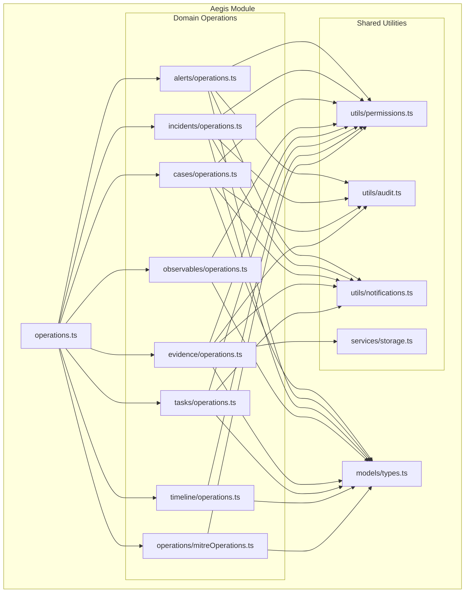
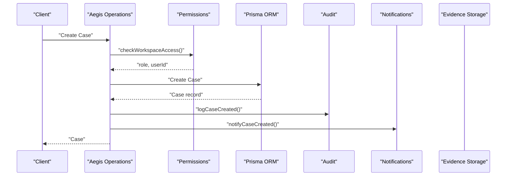
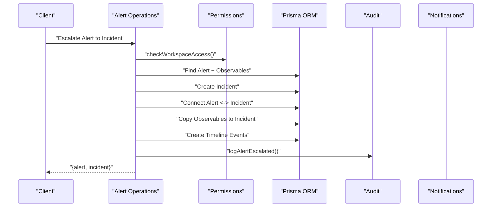
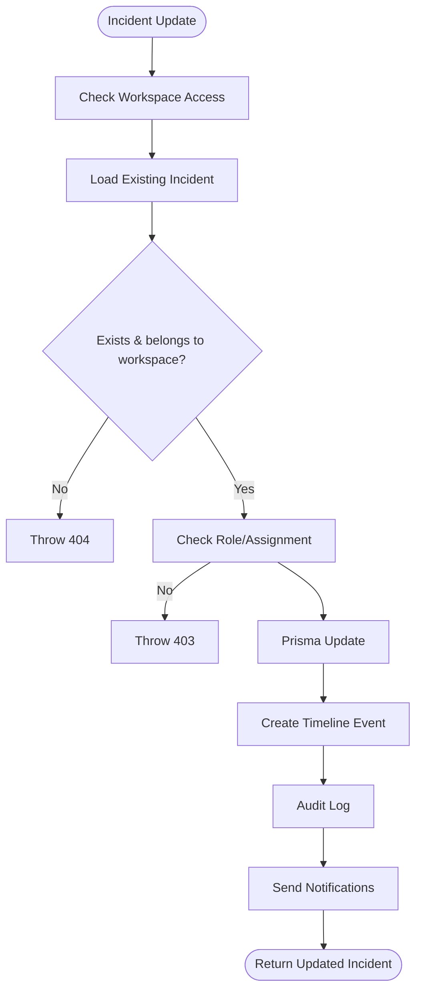
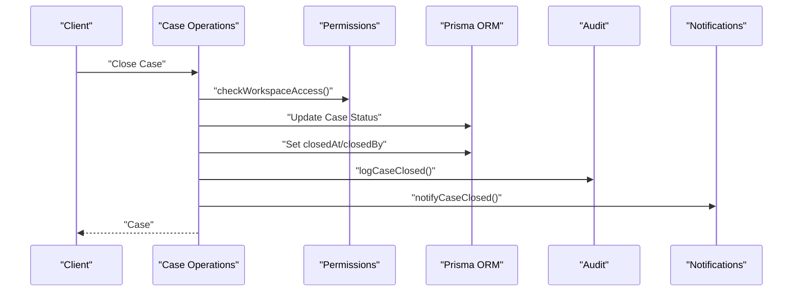
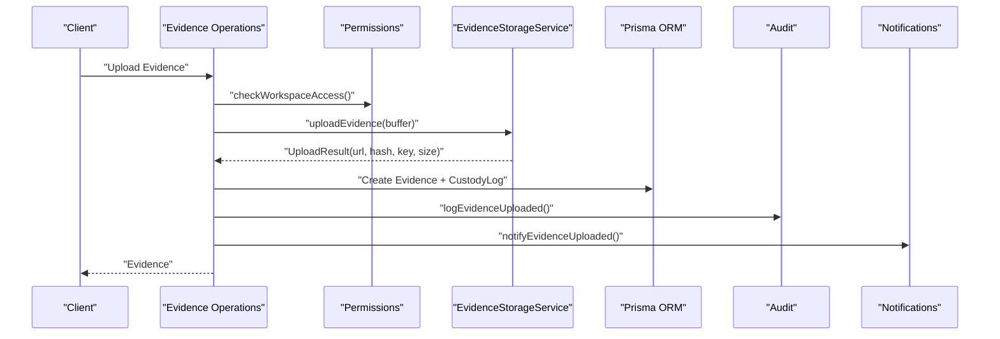
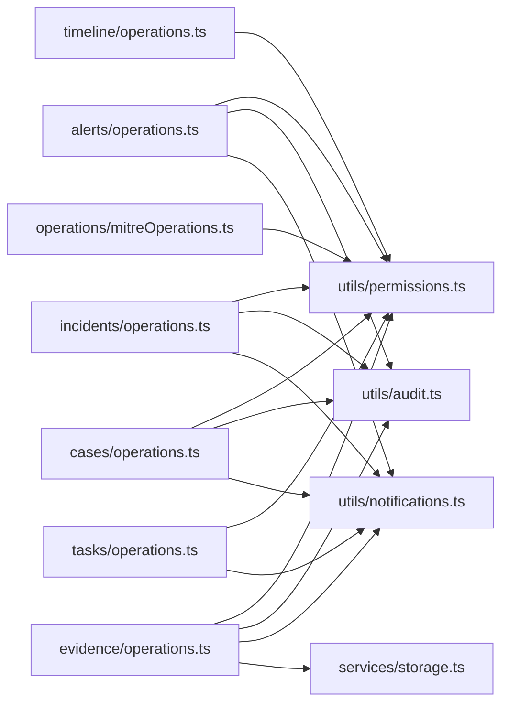

# Aegis Module Operations

<cite>
**Referenced Files in This Document**
- [operations.ts](file://src/core/modules/aegis/operations.ts)
- [types.ts](file://src/core/modules/aegis/models/types.ts)
- [alerts/operations.ts](file://src/core/modules/aegis/alerts/operations.ts)
- [incidents/operations.ts](file://src/core/modules/aegis/incidents/operations.ts)
- [cases/operations.ts](file://src/core/modules/aegis/cases/operations.ts)
- [evidence/operations.ts](file://src/core/modules/aegis/evidence/operations.ts)
- [observables/operations.ts](file://src/core/modules/aegis/observables/operations.ts)
- [tasks/operations.ts](file://src/core/modules/aegis/tasks/operations.ts)
- [timeline/operations.ts](file://src/core/modules/aegis/timeline/operations.ts)
- [mitreOperations.ts](file://src/core/modules/aegis/operations/mitreOperations.ts)
- [permissions.ts](file://src/core/modules/aegis/utils/permissions.ts)
- [audit.ts](file://src/core/modules/aegis/utils/audit.ts)
- [notifications.ts](file://src/core/modules/aegis/utils/notifications.ts)
- [storage.ts](file://src/core/modules/aegis/services/storage.ts)
</cite>

## Table of Contents
1. [Introduction](#introduction)
2. [Project Structure](#project-structure)
3. [Core Components](#core-components)
4. [Architecture Overview](#architecture-overview)
5. [Detailed Component Analysis](#detailed-component-analysis)
6. [Dependency Analysis](#dependency-analysis)
7. [Performance Considerations](#performance-considerations)
8. [Troubleshooting Guide](#troubleshooting-guide)
9. [Conclusion](#conclusion)
10. [Appendices](#appendices)

## Introduction
This document explains the Aegis module’s business logic operations that power incident response workflows. It covers how alert management, case creation, evidence handling, and timeline tracking are implemented, how each operations.ts file encapsulates domain logic with validation, workspace authorization, and transaction-like consistency, and how higher-level operations interact with Prisma ORM and maintain data integrity. It also details the relationship between high-level operations and lower-level service functions, security enforcement via context.user verification and workspace membership checks, and strategies for concurrency, audit trails, and error handling. Finally, it provides guidelines for extending existing operations or creating new ones following established patterns.

## Project Structure
The Aegis module is organized around domain-centric operation files under src/core/modules/aegis. Each domain (alerts, incidents, cases, observables, evidence, tasks, timeline, MITRE) exposes a dedicated operations.ts file that implements CRUD and business logic. Shared utilities for permissions, audit logging, notifications, and storage are located under utils and services respectively. A central operations.ts re-exports all domain operations for registration.

**Diagram sources**
- [operations.ts](file://src/core/modules/aegis/operations.ts#L1-L30)
- [alerts/operations.ts](file://src/core/modules/aegis/alerts/operations.ts#L1-L700)
- [incidents/operations.ts](file://src/core/modules/aegis/incidents/operations.ts#L1-L957)
- [cases/operations.ts](file://src/core/modules/aegis/cases/operations.ts#L1-L911)
- [observables/operations.ts](file://src/core/modules/aegis/observables/operations.ts#L1-L811)
- [evidence/operations.ts](file://src/core/modules/aegis/evidence/operations.ts#L1-L188)
- [tasks/operations.ts](file://src/core/modules/aegis/tasks/operations.ts#L1-L150)
- [timeline/operations.ts](file://src/core/modules/aegis/timeline/operations.ts#L1-L137)
- [mitreOperations.ts](file://src/core/modules/aegis/operations/mitreOperations.ts#L1-L231)
- [permissions.ts](file://src/core/modules/aegis/utils/permissions.ts#L1-L189)
- [audit.ts](file://src/core/modules/aegis/utils/audit.ts#L1-L318)
- [notifications.ts](file://src/core/modules/aegis/utils/notifications.ts#L1-L450)
- [storage.ts](file://src/core/modules/aegis/services/storage.ts#L1-L531)
- [types.ts](file://src/core/modules/aegis/models/types.ts#L1-L672)

**Section sources**
- [operations.ts](file://src/core/modules/aegis/operations.ts#L1-L30)
- [types.ts](file://src/core/modules/aegis/models/types.ts#L1-L672)

## Core Components
- Domain operations: Each domain operation file encapsulates:
  - Input validation and filtering/pagination/sorting
  - Workspace authorization and role-based access checks
  - Business logic (e.g., escalation, progress updates, SLA checks)
  - Audit logging and timeline events
  - Notifications to workspace members
  - Integration with Prisma ORM and external services (e.g., storage)
- Shared utilities:
  - Permissions: workspace membership checks, role-based capabilities, and access helpers
  - Audit: centralized audit log creation mapped to Aegis actions
  - Notifications: in-app, WebSocket, and provider integrations
  - Storage: MinIO/S3 integration for evidence uploads, integrity verification, and quota management

**Section sources**
- [permissions.ts](file://src/core/modules/aegis/utils/permissions.ts#L1-L189)
- [audit.ts](file://src/core/modules/aegis/utils/audit.ts#L1-L318)
- [notifications.ts](file://src/core/modules/aegis/utils/notifications.ts#L1-L450)
- [storage.ts](file://src/core/modules/aegis/services/storage.ts#L1-L531)

## Architecture Overview
The Aegis operations follow a layered architecture:
- Operation layer: domain-specific functions that orchestrate Prisma queries and side effects
- Utility layer: permissions, audit, notifications, and storage services
- Data model layer: Prisma entities and Aegis-specific types

**Diagram sources**
- [cases/operations.ts](file://src/core/modules/aegis/cases/operations.ts#L257-L349)
- [permissions.ts](file://src/core/modules/aegis/utils/permissions.ts#L14-L37)
- [audit.ts](file://src/core/modules/aegis/utils/audit.ts#L204-L227)
- [notifications.ts](file://src/core/modules/aegis/utils/notifications.ts#L246-L310)

## Detailed Component Analysis

### Alert Operations
- Responsibilities:
  - Filtering, pagination, sorting, and statistics
  - Creation, updates, acknowledgments, assignments, dismissals
  - Escalation to incidents with observable propagation
  - Bulk updates and timeline/event logging
- Security:
  - Workspace membership enforced via context.user and WorkspaceMember
  - Role-based permissions for management and assignment
- Data consistency:
  - Updates use atomic Prisma updates; timeline events and audit logs are created after state changes
- Error handling:
  - Throws HttpError for not found, forbidden, invalid inputs, and plan/quota limits

**Diagram sources**
- [alerts/operations.ts](file://src/core/modules/aegis/alerts/operations.ts#L493-L592)
- [permissions.ts](file://src/core/modules/aegis/utils/permissions.ts#L14-L37)
- [audit.ts](file://src/core/modules/aegis/utils/audit.ts#L113-L133)
- [timeline/operations.ts](file://src/core/modules/aegis/timeline/operations.ts#L1-L137)

**Section sources**
- [alerts/operations.ts](file://src/core/modules/aegis/alerts/operations.ts#L1-L700)
- [permissions.ts](file://src/core/modules/aegis/utils/permissions.ts#L1-L189)
- [audit.ts](file://src/core/modules/aegis/utils/audit.ts#L1-L318)
- [timeline/operations.ts](file://src/core/modules/aegis/timeline/operations.ts#L1-L137)

### Incident Operations
- Responsibilities:
  - CRUD, assignment, progress updates, SLA breach detection
  - Playbook application and task creation
  - Investigation notes and timeline
  - Resolution and closure
- Security:
  - Workspace access and role checks; only assigners can assign
- Data consistency:
  - Atomic updates; timeline and audit logs created per change
- Error handling:
  - HttpError for missing entities, invalid SLA deadlines, and quota limits

**Diagram sources**
- [incidents/operations.ts](file://src/core/modules/aegis/incidents/operations.ts#L343-L431)
- [permissions.ts](file://src/core/modules/aegis/utils/permissions.ts#L14-L37)
- [audit.ts](file://src/core/modules/aegis/utils/audit.ts#L135-L202)
- [notifications.ts](file://src/core/modules/aegis/utils/notifications.ts#L124-L244)

**Section sources**
- [incidents/operations.ts](file://src/core/modules/aegis/incidents/operations.ts#L1-L957)
- [permissions.ts](file://src/core/modules/aegis/utils/permissions.ts#L1-L189)
- [audit.ts](file://src/core/modules/aegis/utils/audit.ts#L1-L318)
- [notifications.ts](file://src/core/modules/aegis/utils/notifications.ts#L1-L450)

### Case Operations
- Responsibilities:
  - CRUD, assignment, investigation notes, findings, recommendations
  - Case templates and playbook application
  - Reports and exports
  - Closure/reopen with audit trail
- Security:
  - Workspace access and role checks; only assigners can assign investigators
- Data consistency:
  - Updates with timeline and audit logs; closure metadata maintained
- Error handling:
  - HttpError for missing entities and unauthorized actions

**Diagram sources**
- [cases/operations.ts](file://src/core/modules/aegis/cases/operations.ts#L583-L631)
- [audit.ts](file://src/core/modules/aegis/utils/audit.ts#L251-L269)
- [notifications.ts](file://src/core/modules/aegis/utils/notifications.ts#L300-L323)

**Section sources**
- [cases/operations.ts](file://src/core/modules/aegis/cases/operations.ts#L1-L911)
- [audit.ts](file://src/core/modules/aegis/utils/audit.ts#L1-L318)
- [notifications.ts](file://src/core/modules/aegis/utils/notifications.ts#L1-L450)

### Evidence Operations
- Responsibilities:
  - Evidence listing, retrieval, upload, integrity verification, custody logs
  - Storage integration with MinIO/S3, signed URLs, and quota management
- Security:
  - Workspace access checks and role-based access to evidence
- Data consistency:
  - Integrity verification via hashes; custody logs track actions
- Error handling:
  - HttpError for missing entities and unauthorized deletion

**Diagram sources**
- [evidence/operations.ts](file://src/core/modules/aegis/evidence/operations.ts#L58-L134)
- [storage.ts](file://src/core/modules/aegis/services/storage.ts#L47-L107)
- [audit.ts](file://src/core/modules/aegis/utils/audit.ts#L272-L295)
- [notifications.ts](file://src/core/modules/aegis/utils/notifications.ts#L325-L350)

**Section sources**
- [evidence/operations.ts](file://src/core/modules/aegis/evidence/operations.ts#L1-L188)
- [storage.ts](file://src/core/modules/aegis/services/storage.ts#L1-L531)
- [audit.ts](file://src/core/modules/aegis/utils/audit.ts#L1-L318)
- [notifications.ts](file://src/core/modules/aegis/utils/notifications.ts#L1-L450)

### Observable Operations
- Responsibilities:
  - CRUD, enrichment, bulk import/export, linking to alerts/incidents/cases/evidence
  - Search and statistics
- Security:
  - Workspace access checks; deletions restricted to admins/owners
- Data consistency:
  - Duplicate prevention on create; atomic updates
- Error handling:
  - HttpError for invalid inputs and duplicates

**Section sources**
- [observables/operations.ts](file://src/core/modules/aegis/observables/operations.ts#L1-L811)
- [permissions.ts](file://src/core/modules/aegis/utils/permissions.ts#L1-L189)

### Task Operations
- Responsibilities:
  - Task CRUD, dependency resolution, completion tracking
  - Assignment notifications
- Security:
  - Workspace access checks; assignment validation against incident/case workspace
- Data consistency:
  - Ordered groups and dependency lists maintained
- Error handling:
  - HttpError for missing tasks and access violations

**Section sources**
- [tasks/operations.ts](file://src/core/modules/aegis/tasks/operations.ts#L1-L150)
- [permissions.ts](file://src/core/modules/aegis/utils/permissions.ts#L1-L189)
- [notifications.ts](file://src/core/modules/aegis/utils/notifications.ts#L352-L422)

### Timeline Operations
- Responsibilities:
  - Timeline retrieval across alerts, incidents, and cases
  - Adding timeline events and exporting timelines
- Security:
  - Workspace access checks; entity existence validation
- Data consistency:
  - Includes relations for user and linked entities
- Error handling:
  - HttpError for missing entities

**Section sources**
- [timeline/operations.ts](file://src/core/modules/aegis/timeline/operations.ts#L1-L137)
- [permissions.ts](file://src/core/modules/aegis/utils/permissions.ts#L1-L37)

### MITRE Operations
- Responsibilities:
  - Query MITRE ATT&CK tactics, techniques, subtechniques
  - Search and statistics
- Security:
  - Authentication required
- Data consistency:
  - Hierarchical queries with included relations

**Section sources**
- [mitreOperations.ts](file://src/core/modules/aegis/operations/mitreOperations.ts#L1-L231)

## Dependency Analysis
- Coupling:
  - Domain operations depend on permissions, audit, notifications, and storage utilities
  - All operations use Prisma via context.entities
- Cohesion:
  - Each operations.ts file encapsulates a single domain’s logic and side effects
- External dependencies:
  - MinIO/S3 client for evidence storage
  - Notification bus and WebSocket server for real-time updates
- Potential circular dependencies:
  - None observed; utilities are imported by domain operations, not vice versa

**Diagram sources**
- [alerts/operations.ts](file://src/core/modules/aegis/alerts/operations.ts#L1-L700)
- [incidents/operations.ts](file://src/core/modules/aegis/incidents/operations.ts#L1-L957)
- [cases/operations.ts](file://src/core/modules/aegis/cases/operations.ts#L1-L911)
- [evidence/operations.ts](file://src/core/modules/aegis/evidence/operations.ts#L1-L188)
- [tasks/operations.ts](file://src/core/modules/aegis/tasks/operations.ts#L1-L150)
- [timeline/operations.ts](file://src/core/modules/aegis/timeline/operations.ts#L1-L137)
- [mitreOperations.ts](file://src/core/modules/aegis/operations/mitreOperations.ts#L1-L231)
- [permissions.ts](file://src/core/modules/aegis/utils/permissions.ts#L1-L189)
- [audit.ts](file://src/core/modules/aegis/utils/audit.ts#L1-L318)
- [notifications.ts](file://src/core/modules/aegis/utils/notifications.ts#L1-L450)
- [storage.ts](file://src/core/modules/aegis/services/storage.ts#L1-L531)

**Section sources**
- [permissions.ts](file://src/core/modules/aegis/utils/permissions.ts#L1-L189)
- [audit.ts](file://src/core/modules/aegis/utils/audit.ts#L1-L318)
- [notifications.ts](file://src/core/modules/aegis/utils/notifications.ts#L1-L450)
- [storage.ts](file://src/core/modules/aegis/services/storage.ts#L1-L531)

## Performance Considerations
- Pagination and limits:
  - Queries enforce page size caps and reasonable limits to prevent heavy loads
- Parallelization:
  - Batch operations (e.g., bulk alert updates) use sequential loops; consider batching with transactions for improved throughput
- Indexing:
  - Filters leverage Prisma where clauses; ensure database indexes exist for frequently filtered fields (workspaceId, status, severity, timestamps)
- Storage:
  - Signed URLs reduce server bandwidth; integrity verification avoids repeated downloads
- Notifications:
  - Non-blocking; failures logged without affecting primary operation

[No sources needed since this section provides general guidance]

## Troubleshooting Guide
- Concurrent case updates:
  - Use optimistic locking via updatedAt fields and compare-and-swap patterns; consider wrapping critical updates in transactions to ensure consistency
- Audit trail maintenance:
  - Ensure audit log creation occurs after state changes; verify IP and user agent capture
- Error handling strategies:
  - Prefer HttpError with appropriate status codes; avoid leaking sensitive details
  - Validate inputs early; throw descriptive errors for missing entities or access violations
- Workspace authorization:
  - Always call checkWorkspaceAccess before Prisma operations; verify workspaceId matches the entity’s workspace
- Notifications:
  - Broadcast failures are logged; confirm notification provider availability and retry mechanisms

**Section sources**
- [incidents/operations.ts](file://src/core/modules/aegis/incidents/operations.ts#L343-L431)
- [audit.ts](file://src/core/modules/aegis/utils/audit.ts#L1-L64)
- [permissions.ts](file://src/core/modules/aegis/utils/permissions.ts#L14-L37)

## Conclusion
The Aegis module’s operations provide a robust, secure, and extensible foundation for incident response workflows. Each domain operation encapsulates validation, authorization, business logic, and side effects consistently. By leveraging shared utilities for permissions, audit, notifications, and storage, the system maintains data integrity and multi-tenant isolation. Following the established patterns—workspace access checks, role-based permissions, timeline and audit logs, and non-blocking notifications—developers can extend existing operations or introduce new ones reliably.

[No sources needed since this section summarizes without analyzing specific files]

## Appendices

### Guidelines for Extending Operations
- Input validation:
  - Validate and sanitize inputs; throw HttpError for invalid or missing data
- Authorization:
  - Always verify workspace membership and role; restrict destructive actions (assign/delete)
- Transactions and consistency:
  - Wrap multi-step operations in transactions where possible; ensure audit and timeline events are created after state changes
- Notifications:
  - Emit notifications and broadcast WebSocket updates for critical lifecycle events
- Storage:
  - For uploads, calculate hashes, generate signed URLs, and update usage quotas
- Error handling:
  - Use HttpError with appropriate status codes; log failures without exposing internal details

**Section sources**
- [permissions.ts](file://src/core/modules/aegis/utils/permissions.ts#L1-L189)
- [audit.ts](file://src/core/modules/aegis/utils/audit.ts#L1-L318)
- [notifications.ts](file://src/core/modules/aegis/utils/notifications.ts#L1-L450)
- [storage.ts](file://src/core/modules/aegis/services/storage.ts#L1-L531)