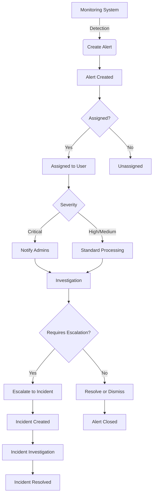
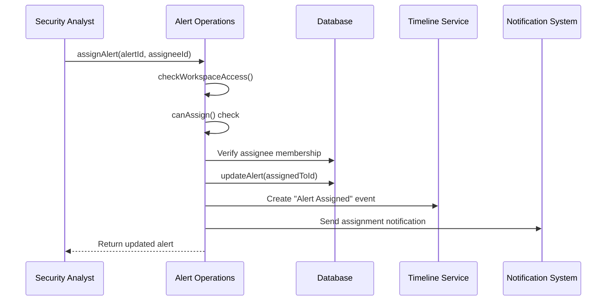
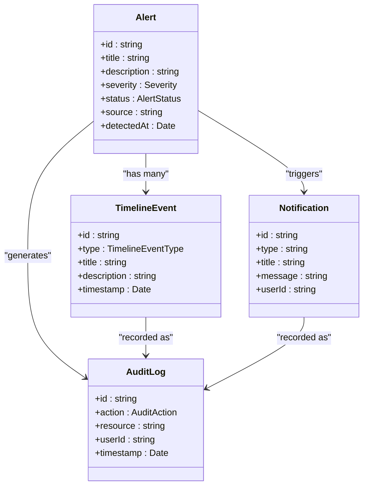

# Alert Management

<cite>
**Referenced Files in This Document**   
- [operations.ts](file://src/core/modules/aegis/alerts/operations.ts)
- [types.ts](file://src/core/modules/aegis/models/types.ts)
- [permissions.ts](file://src/core/modules/aegis/utils/permissions.ts)
- [audit.ts](file://src/core/modules/aegis/utils/audit.ts)
- [notifications.ts](file://src/core/modules/aegis/utils/notifications.ts)
- [timeline/operations.ts](file://src/core/modules/aegis/timeline/operations.ts)
- [incidents/operations.ts](file://src/core/modules/aegis/incidents/operations.ts)
- [planLimits.ts](file://src/core/payment/planLimits.ts)
</cite>

## Table of Contents
1. [Introduction](#introduction)
2. [Core Operations](#core-operations)
3. [Alert Lifecycle](#alert-lifecycle)
4. [Filtering and Querying](#filtering-and-querying)
5. [Assignment and Escalation](#assignment-and-escalation)
6. [Bulk Operations](#bulk-operations)
7. [Integration with Other Components](#integration-with-other-components)
8. [Error Handling and Plan Quotas](#error-handling-and-plan-quotas)
9. [Extension Guidelines](#extension-guidelines)

## Introduction
The Aegis module provides a comprehensive alert management system for security operations. This document details the implementation of alert creation, filtering, assignment, escalation, and bulk operations. The system is built on a robust foundation of CRUD operations with proper validation, workspace authorization, and transaction handling. Alerts are central to the security incident response workflow, serving as the initial detection point that can be investigated, assigned, escalated to incidents, and ultimately resolved or dismissed.

**Section sources**
- [operations.ts](file://src/core/modules/aegis/alerts/operations.ts#L1-L700)

## Core Operations
The alert management system implements standard CRUD operations with additional business logic for security workflows. All operations are implemented in the `operations.ts` file and follow a consistent pattern of workspace access validation, permission checking, data manipulation, and side-effect management.

The system uses Zod for input validation, ensuring that all alert data conforms to expected schemas before processing. Each operation begins with workspace access validation through the `checkWorkspaceAccess` function, which verifies that the requesting user has appropriate permissions within the target workspace.

Transaction handling is managed through the underlying Prisma ORM, with each operation executed as a single atomic transaction. This ensures data consistency, particularly important when operations involve multiple related entities such as alerts, timeline events, and notifications.

**Section sources**
- [operations.ts](file://src/core/modules/aegis/alerts/operations.ts#L1-L700)
- [types.ts](file://src/core/modules/aegis/models/types.ts#L201-L230)

## Alert Lifecycle
The alert lifecycle begins with creation from monitoring systems and progresses through various states until resolution. When an alert is created via the `createAlert` function, it initializes with a "NEW" status and triggers several automated processes.

The creation process includes validation of input data, plan quota enforcement, database persistence, timeline event creation, audit logging, and notification dispatch. Critical alerts automatically notify workspace owners and administrators through multiple channels.

Alerts can transition through several states: NEW, ACKNOWLEDGED, INVESTIGATING, RESOLVED, and DISMISSED. Each state transition is recorded as a timeline event and triggers appropriate notifications. The `updateAlert` function handles state changes with proper permission checks, ensuring that only authorized users can modify alert status.

When an alert is escalated to an incident via `escalateToIncident`, the system creates a new incident record, links it to the original alert, copies relevant observables, and generates timeline events in both the alert and incident timelines. This creates a complete audit trail of the escalation process.

**Diagram sources**
- [operations.ts](file://src/core/modules/aegis/alerts/operations.ts#L212-L293)
- [incidents/operations.ts](file://src/core/modules/aegis/incidents/operations.ts#L249-L341)

**Section sources**
- [operations.ts](file://src/core/modules/aegis/alerts/operations.ts#L212-L293)
- [incidents/operations.ts](file://src/core/modules/aegis/incidents/operations.ts#L249-L341)

## Filtering and Querying
The alert system provides comprehensive filtering capabilities through the `getAlerts` function. Users can filter alerts by severity, status, source, assigned user, category, tags, date range, and threat score. The filtering system supports both single values and arrays, enabling complex queries.

The implementation builds a dynamic WHERE clause based on the provided filters, translating them into Prisma query conditions. For example, array-based filters use the `in` operator, while range filters use `gte` and `lte` operators. The system also supports pagination and sorting, with default sorting by creation date in descending order.

The `getAlertStats` function provides aggregated data for dashboard displays, including counts by severity, status, source, and temporal trends. This enables users to quickly assess the security posture of their environment and identify patterns in alert generation.

**Section sources**
- [operations.ts](file://src/core/modules/aegis/alerts/operations.ts#L55-L160)
- [types.ts](file://src/core/modules/aegis/models/types.ts#L106-L120)

## Assignment and Escalation
Alert assignment is handled through the `assignAlert` function, which updates the alert's assigned user and automatically changes the status from "NEW" to "ACKNOWLEDGED" if appropriate. The system verifies that the assignee is a valid member of the workspace before proceeding.

Only workspace owners and administrators can assign alerts to other users, as enforced by the `canAssign` permission check. When an alert is assigned, the system sends a notification to the assignee, ensuring they are aware of their new responsibility.

The escalation process from alert to incident is a critical workflow in the security response process. The `escalateToIncident` function creates a new incident with relevant details from the alert, establishes the relationship between the two entities, and initiates the incident investigation workflow. This process maintains the chain of custody and ensures that all relevant context is preserved.

**Diagram sources**
- [operations.ts](file://src/core/modules/aegis/alerts/operations.ts#L389-L449)
- [timeline/operations.ts](file://src/core/modules/aegis/timeline/operations.ts#L69-L97)

**Section sources**
- [operations.ts](file://src/core/modules/aegis/alerts/operations.ts#L389-L449)
- [permissions.ts](file://src/core/modules/aegis/utils/permissions.ts#L115-L117)

## Bulk Operations
The system supports bulk operations through the `bulkUpdateAegisAlerts` function, enabling users to update multiple alerts simultaneously. This is particularly useful for triaging large volumes of alerts or applying consistent changes across related alerts.

Bulk operations are implemented as a series of individual updates wrapped in a single response object that reports success and failure counts. The system processes each alert update independently, allowing some operations to succeed even if others fail. This approach prevents a single problematic alert from blocking the entire bulk operation.

The implementation includes proper permission checks at the workspace level, ensuring that only users with appropriate privileges (owners and administrators) can perform bulk updates. Each individual alert update still respects the standard permission model, preventing users from modifying alerts they don't have access to.

**Section sources**
- [operations.ts](file://src/core/modules/aegis/alerts/operations.ts#L597-L628)

## Integration with Other Components
The alert management system is tightly integrated with several other components to provide a comprehensive security operations platform. The timeline system records all significant events related to alerts, providing an audit trail of actions taken. Each alert operation that modifies state creates a corresponding timeline event with details about the change.

The notification system ensures that relevant stakeholders are informed of important events. Critical alerts trigger immediate notifications to administrators, while assignment changes notify the affected users. Notifications are delivered through multiple channels including in-app alerts, email, and WebSocket broadcasts for real-time updates.

Audit logging is implemented through the `audit.ts` utilities, which create detailed records of all significant operations. These logs include information about the user, timestamp, action performed, and relevant metadata. This provides accountability and supports compliance requirements.

**Diagram sources**
- [operations.ts](file://src/core/modules/aegis/alerts/operations.ts#L251-L265)
- [notifications.ts](file://src/core/modules/aegis/utils/notifications.ts#L66-L95)
- [audit.ts](file://src/core/modules/aegis/utils/audit.ts#L69-L88)

**Section sources**
- [operations.ts](file://src/core/modules/aegis/alerts/operations.ts#L251-L265)
- [notifications.ts](file://src/core/modules/aegis/utils/notifications.ts#L66-L95)
- [audit.ts](file://src/core/modules/aegis/utils/audit.ts#L69-L88)

## Error Handling and Plan Quotas
The system implements comprehensive error handling using the `HttpError` class to provide meaningful feedback to clients. Validation errors, permission violations, and business rule violations all result in appropriate HTTP status codes and descriptive error messages.

Plan quota enforcement is a critical aspect of the multi-tenancy model. The system integrates with the payment module to enforce limits based on the workspace's subscription plan. Before creating a new alert, the `createAlert` function checks the current month's alert count against the plan limit using the `enforcePlanLimit` function.

The quota system is designed to be extensible, with the `getWorkspaceUsage` function providing current usage statistics across multiple dimensions. This allows for consistent quota enforcement not just for alerts but for other resources as well. When a quota is exceeded, the system returns a 403 Forbidden error with a clear message instructing the user to upgrade their plan.

Concurrent updates are handled gracefully through the database's locking mechanisms. While the application doesn't implement explicit optimistic or pessimistic locking, the underlying Prisma client handles race conditions at the database level, ensuring data integrity.

**Section sources**
- [operations.ts](file://src/core/modules/aegis/alerts/operations.ts#L221-L229)
- [planLimits.ts](file://src/core/payment/planLimits.ts#L214-L228)

## Extension Guidelines
When extending the alert functionality, developers should follow the established patterns for input validation, error handling, and permission enforcement. New operations should use Zod schemas for input validation, ensuring type safety and consistent error messages.

All operations must include workspace authorization checks using the `checkWorkspaceAccess` function. Business logic should respect the role-based access control model, using the permission utilities to determine what actions users can perform.

New features should integrate with the existing audit and notification systems to maintain consistency across the platform. Any state changes should generate appropriate timeline events, audit logs, and notifications to keep users informed and provide a complete audit trail.

When implementing new operations, consider the impact on plan quotas and ensure that appropriate limits are enforced. The system should fail gracefully when limits are reached, providing clear error messages that guide users toward resolution.

**Section sources**
- [operations.ts](file://src/core/modules/aegis/alerts/operations.ts#L8-L17)
- [types.ts](file://src/core/modules/aegis/models/types.ts#L201-L230)
- [permissions.ts](file://src/core/modules/aegis/utils/permissions.ts#L14-L37)