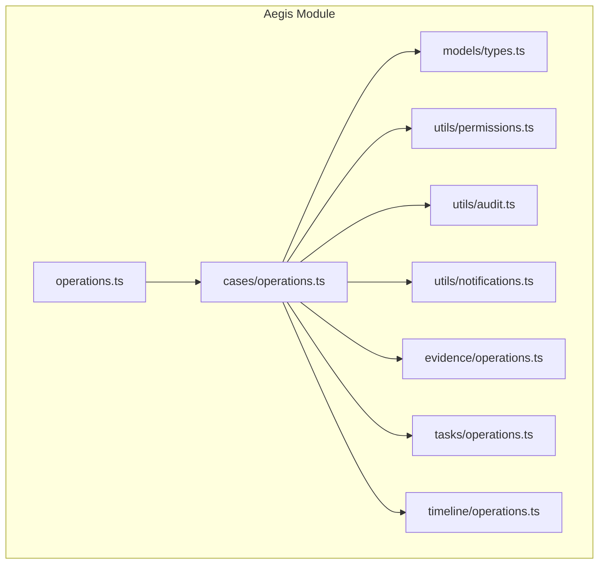
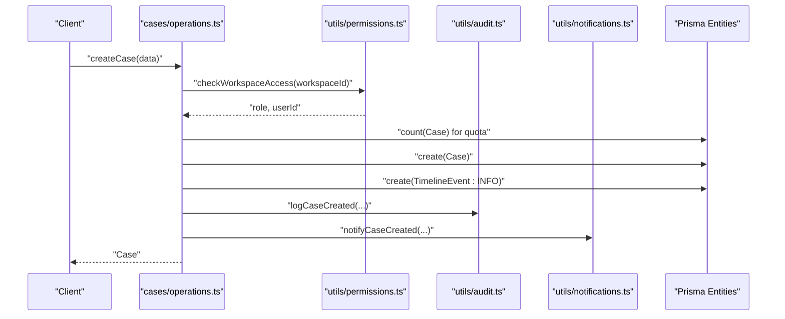
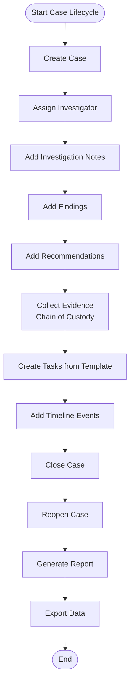
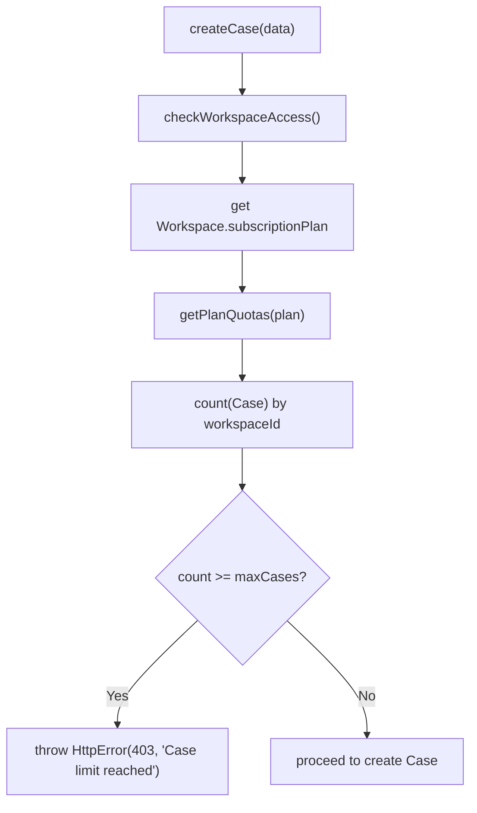
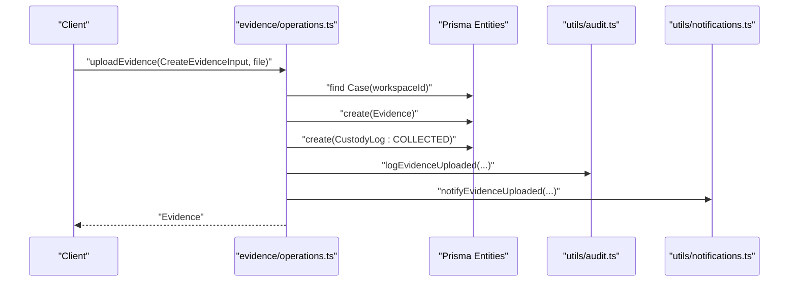
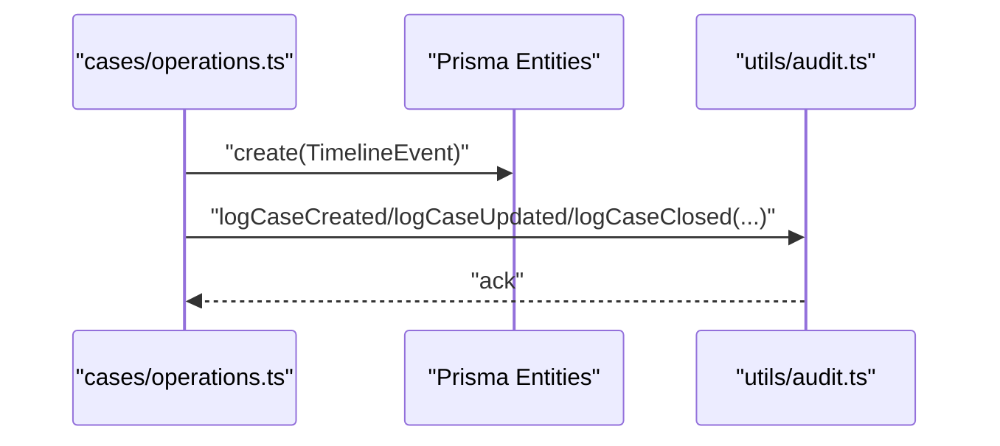
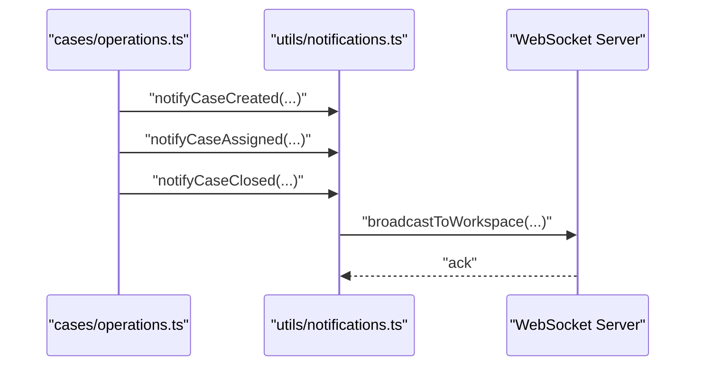
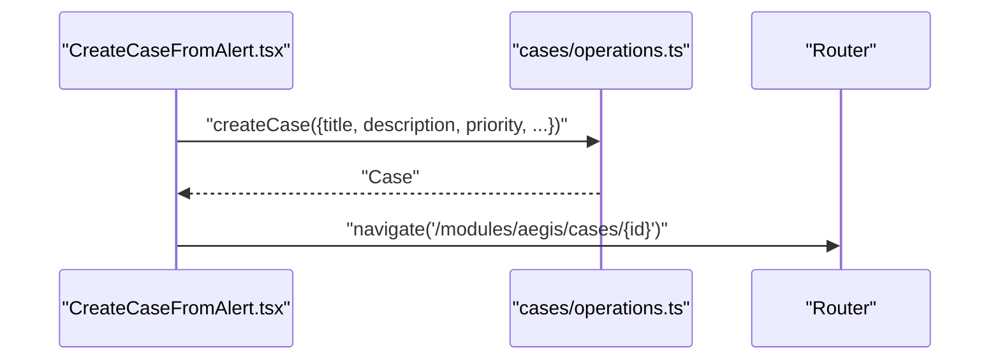
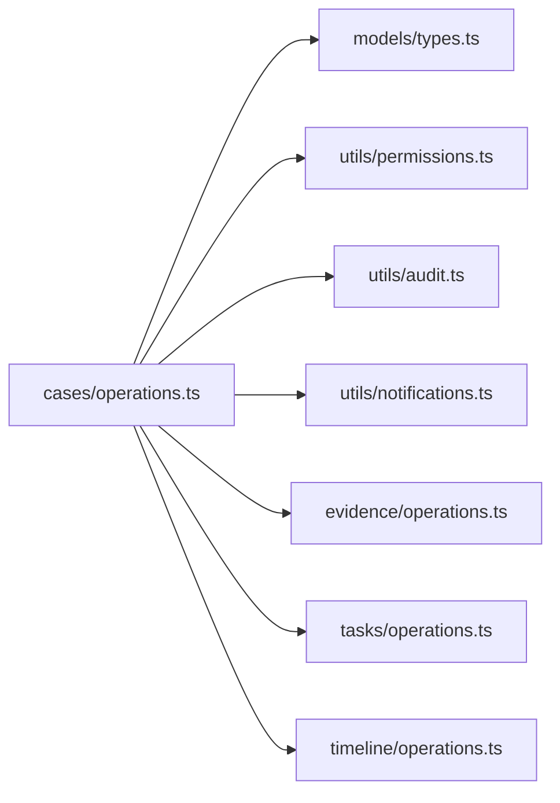

# Case Management

<cite>
**Referenced Files in This Document**
- [operations.ts](file://src/core/modules/aegis/cases/operations.ts)
- [types.ts](file://src/core/modules/aegis/models/types.ts)
- [permissions.ts](file://src/core/modules/aegis/utils/permissions.ts)
- [audit.ts](file://src/core/modules/aegis/utils/audit.ts)
- [notifications.ts](file://src/core/modules/aegis/utils/notifications.ts)
- [evidence.operations.ts](file://src/core/modules/aegis/evidence/operations.ts)
- [timeline.operations.ts](file://src/core/modules/aegis/timeline/operations.ts)
- [tasks.operations.ts](file://src/core/modules/aegis/tasks/operations.ts)
- [operations.ts](file://src/core/modules/aegis/operations.ts)
- [CreateCaseFromAlert.tsx](file://src/client/pages/modules/aegis/components/CreateCaseFromAlert.tsx)
- [aegis.types.ts](file://src/client/pages/modules/aegis/types/aegis.types.ts)
</cite>

## Table of Contents
1. [Introduction](#introduction)
2. [Project Structure](#project-structure)
3. [Core Components](#core-components)
4. [Architecture Overview](#architecture-overview)
5. [Detailed Component Analysis](#detailed-component-analysis)
6. [Dependency Analysis](#dependency-analysis)
7. [Performance Considerations](#performance-considerations)
8. [Troubleshooting Guide](#troubleshooting-guide)
9. [Conclusion](#conclusion)
10. [Appendices](#appendices)

## Introduction
This document explains the Aegis module’s case management system. It covers how investigation cases are created, assigned, enriched with findings and recommendations, documented with notes, and closed with comprehensive reports. It also details how the cases operations encapsulate business logic with validation, workspace authorization, and audit/logging, and how they integrate with evidence management, task tracking, timeline events, and notifications. Common operational concerns such as plan quota enforcement, chain of custody maintenance, and error handling are addressed, along with guidelines for extending functionality following established patterns.

## Project Structure
The Aegis module organizes case-related logic under a dedicated cases operations file, supported by shared types, permissions, audit, and notifications utilities. Evidence, tasks, and timeline operations complement case workflows. The central operations aggregator exports all Aegis operations for use in the application.

**Diagram sources**
- [operations.ts](file://src/core/modules/aegis/operations.ts#L1-L30)
- [operations.ts](file://src/core/modules/aegis/cases/operations.ts#L1-L120)
- [types.ts](file://src/core/modules/aegis/models/types.ts#L1-L120)
- [permissions.ts](file://src/core/modules/aegis/utils/permissions.ts#L1-L60)
- [audit.ts](file://src/core/modules/aegis/utils/audit.ts#L1-L60)
- [notifications.ts](file://src/core/modules/aegis/utils/notifications.ts#L1-L60)
- [evidence.operations.ts](file://src/core/modules/aegis/evidence/operations.ts#L1-L60)
- [tasks.operations.ts](file://src/core/modules/aegis/tasks/operations.ts#L1-L40)
- [timeline.operations.ts](file://src/core/modules/aegis/timeline/operations.ts#L1-L40)

**Section sources**
- [operations.ts](file://src/core/modules/aegis/operations.ts#L1-L30)
- [operations.ts](file://src/core/modules/aegis/cases/operations.ts#L1-L120)

## Core Components
- Case operations: CRUD and lifecycle management (creation, assignment, updates, notes, findings, recommendations, closure, reopening, reporting, export, template application, statistics).
- Shared types: Strongly typed inputs, outputs, filters, pagination, and report structures.
- Permissions utilities: Workspace access checks, role-based authorization, and capability checks.
- Audit utilities: Centralized audit logging for case lifecycle events.
- Notifications utilities: In-app and broadcast notifications for case events.
- Supporting operations: Evidence (chain of custody, integrity, uploads), Tasks (playbook-driven), Timeline (cross-resource events).

**Section sources**
- [operations.ts](file://src/core/modules/aegis/cases/operations.ts#L257-L911)
- [types.ts](file://src/core/modules/aegis/models/types.ts#L138-L210)
- [permissions.ts](file://src/core/modules/aegis/utils/permissions.ts#L1-L118)
- [audit.ts](file://src/core/modules/aegis/utils/audit.ts#L204-L270)
- [notifications.ts](file://src/core/modules/aegis/utils/notifications.ts#L246-L323)
- [evidence.operations.ts](file://src/core/modules/aegis/evidence/operations.ts#L1-L188)
- [tasks.operations.ts](file://src/core/modules/aegis/tasks/operations.ts#L1-L150)
- [timeline.operations.ts](file://src/core/modules/aegis/timeline/operations.ts#L1-L137)

## Architecture Overview
The case lifecycle is orchestrated by the cases operations module. It validates inputs via shared types, enforces workspace authorization, performs business validations (e.g., plan quotas), executes database updates, and emits timeline events, audit logs, and notifications. Evidence, tasks, and timeline operations are invoked to enrich the case with artifacts, actionable items, and chronological context.

**Diagram sources**
- [operations.ts](file://src/core/modules/aegis/cases/operations.ts#L257-L349)
- [permissions.ts](file://src/core/modules/aegis/utils/permissions.ts#L14-L37)
- [audit.ts](file://src/core/modules/aegis/utils/audit.ts#L204-L227)
- [notifications.ts](file://src/core/modules/aegis/utils/notifications.ts#L246-L271)

## Detailed Component Analysis

### Case Lifecycle Workflows
- Creation: Validates workspace access, enforces plan quotas, persists case, records timeline, logs audit, and notifies workspace admins.
- Assignment: Verifies permissions, ensures assignee is a workspace member, updates case, and notifies the assigned investigator.
- Notes: Adds investigation notes with authorship and timeline entries.
- Findings and Recommendations: Updates case fields for findings and recommendations.
- Closure: Sets status to closed, records closure metadata, logs audit, and notifies the assigned investigator.
- Reopening: Resets closure metadata and creates a warning timeline event.
- Reporting and Export: Generates comprehensive reports and supports JSON export; CSV export is available conceptually.
- Template Application: Applies a template to pre-populate case fields and create tasks.
- Statistics: Computes totals, statuses, priorities, types, investigators, and trends.

**Diagram sources**
- [operations.ts](file://src/core/modules/aegis/cases/operations.ts#L257-L911)
- [evidence.operations.ts](file://src/core/modules/aegis/evidence/operations.ts#L58-L134)
- [tasks.operations.ts](file://src/core/modules/aegis/tasks/operations.ts#L44-L100)
- [timeline.operations.ts](file://src/core/modules/aegis/timeline/operations.ts#L69-L97)

**Section sources**
- [operations.ts](file://src/core/modules/aegis/cases/operations.ts#L257-L911)
- [evidence.operations.ts](file://src/core/modules/aegis/evidence/operations.ts#L58-L134)
- [tasks.operations.ts](file://src/core/modules/aegis/tasks/operations.ts#L44-L100)
- [timeline.operations.ts](file://src/core/modules/aegis/timeline/operations.ts#L69-L97)

### Plan Quota Enforcement
- Quotas are derived from the workspace subscription plan and enforced during case creation.
- The system counts existing cases per workspace and compares against configured limits, blocking creation when exceeded.

**Diagram sources**
- [operations.ts](file://src/core/modules/aegis/cases/operations.ts#L257-L349)
- [permissions.ts](file://src/core/modules/aegis/utils/permissions.ts#L14-L37)

**Section sources**
- [operations.ts](file://src/core/modules/aegis/cases/operations.ts#L257-L349)

### Chain of Custody Maintenance
- Evidence uploads record initial custody log entries and update storage usage.
- Additional custody actions (transfer, analyze, store, accessed, modified, deleted) are logged with hashes, IP/device metadata, and notes.
- Integrity verification is available to compare stored and computed hashes.

**Diagram sources**
- [evidence.operations.ts](file://src/core/modules/aegis/evidence/operations.ts#L58-L134)
- [audit.ts](file://src/core/modules/aegis/utils/audit.ts#L272-L295)
- [notifications.ts](file://src/core/modules/aegis/utils/notifications.ts#L325-L349)

**Section sources**
- [evidence.operations.ts](file://src/core/modules/aegis/evidence/operations.ts#L58-L134)
- [audit.ts](file://src/core/modules/aegis/utils/audit.ts#L272-L295)
- [notifications.ts](file://src/core/modules/aegis/utils/notifications.ts#L325-L349)

### Timeline Events and Audit Logging
- Timeline events are created for major lifecycle actions (created, updated, reopened, assigned, closed).
- Audit logs capture actions with resource identifiers, descriptions, and metadata for compliance and traceability.

**Diagram sources**
- [operations.ts](file://src/core/modules/aegis/cases/operations.ts#L309-L348)
- [operations.ts](file://src/core/modules/aegis/cases/operations.ts#L405-L422)
- [operations.ts](file://src/core/modules/aegis/cases/operations.ts#L619-L630)
- [audit.ts](file://src/core/modules/aegis/utils/audit.ts#L204-L270)

**Section sources**
- [operations.ts](file://src/core/modules/aegis/cases/operations.ts#L309-L348)
- [operations.ts](file://src/core/modules/aegis/cases/operations.ts#L405-L422)
- [operations.ts](file://src/core/modules/aegis/cases/operations.ts#L619-L630)
- [audit.ts](file://src/core/modules/aegis/utils/audit.ts#L204-L270)

### Notifications and Real-time Updates
- Notifications are sent for case creation, assignment, and closure.
- WebSockets can broadcast workspace-wide updates for critical events.

**Diagram sources**
- [operations.ts](file://src/core/modules/aegis/cases/operations.ts#L332-L348)
- [operations.ts](file://src/core/modules/aegis/cases/operations.ts#L467-L483)
- [operations.ts](file://src/core/modules/aegis/cases/operations.ts#L622-L630)
- [notifications.ts](file://src/core/modules/aegis/utils/notifications.ts#L246-L323)

**Section sources**
- [operations.ts](file://src/core/modules/aegis/cases/operations.ts#L332-L348)
- [operations.ts](file://src/core/modules/aegis/cases/operations.ts#L467-L483)
- [operations.ts](file://src/core/modules/aegis/cases/operations.ts#L622-L630)
- [notifications.ts](file://src/core/modules/aegis/utils/notifications.ts#L246-L323)

### Frontend Integration Examples
- The Create Case from Alert modal demonstrates how UI captures case metadata and options (assignee, priority, inherit observables, close alert) and navigates to the newly created case.

**Diagram sources**
- [CreateCaseFromAlert.tsx](file://src/client/pages/modules/aegis/components/CreateCaseFromAlert.tsx#L52-L74)
- [operations.ts](file://src/core/modules/aegis/cases/operations.ts#L257-L349)

**Section sources**
- [CreateCaseFromAlert.tsx](file://src/client/pages/modules/aegis/components/CreateCaseFromAlert.tsx#L52-L74)
- [aegis.types.ts](file://src/client/pages/modules/aegis/types/aegis.types.ts#L1-L120)

## Dependency Analysis
- Cohesion: Cases operations encapsulate all case business logic and delegate cross-cutting concerns to utilities.
- Coupling: Low coupling to permissions, audit, and notifications via small, focused helpers.
- External dependencies: Prisma entities, HttpError for controlled failures, and WebSocket server for real-time updates.
- No circular dependencies observed among cases, evidence, tasks, timeline, and utilities.

**Diagram sources**
- [operations.ts](file://src/core/modules/aegis/cases/operations.ts#L1-L120)
- [types.ts](file://src/core/modules/aegis/models/types.ts#L138-L210)
- [permissions.ts](file://src/core/modules/aegis/utils/permissions.ts#L1-L60)
- [audit.ts](file://src/core/modules/aegis/utils/audit.ts#L1-L60)
- [notifications.ts](file://src/core/modules/aegis/utils/notifications.ts#L1-L60)
- [evidence.operations.ts](file://src/core/modules/aegis/evidence/operations.ts#L1-L60)
- [tasks.operations.ts](file://src/core/modules/aegis/tasks/operations.ts#L1-L40)
- [timeline.operations.ts](file://src/core/modules/aegis/timeline/operations.ts#L1-L40)

**Section sources**
- [operations.ts](file://src/core/modules/aegis/cases/operations.ts#L1-L120)
- [types.ts](file://src/core/modules/aegis/models/types.ts#L138-L210)
- [permissions.ts](file://src/core/modules/aegis/utils/permissions.ts#L1-L60)
- [audit.ts](file://src/core/modules/aegis/utils/audit.ts#L1-L60)
- [notifications.ts](file://src/core/modules/aegis/utils/notifications.ts#L1-L60)
- [evidence.operations.ts](file://src/core/modules/aegis/evidence/operations.ts#L1-L60)
- [tasks.operations.ts](file://src/core/modules/aegis/tasks/operations.ts#L1-L40)
- [timeline.operations.ts](file://src/core/modules/aegis/timeline/operations.ts#L1-L40)

## Performance Considerations
- Pagination and sorting: Case listing uses pagination and capped page sizes to control payload sizes.
- Lazy loading relations: Includes are scoped to reduce N+1 and oversized queries.
- Batch notifications: Bulk notification sending uses Promise.all to minimize latency.
- Audit and notifications are non-blocking to avoid slowing down primary operations.

[No sources needed since this section provides general guidance]

## Troubleshooting Guide
Common issues and strategies:
- Authentication/Authorization failures: Ensure the user belongs to the target workspace and holds appropriate role; HttpError is thrown with explicit messages.
- Access denied to resources: Cross-check workspaceId and resource ownership; permissions utilities enforce strict checks.
- Quota exceeded: Verify workspace plan limits and adjust accordingly; creation is blocked when limits are reached.
- Evidence integrity: Use integrity verification to detect tampering; custody logs provide audit trails.
- Error handling patterns: Prefer HttpError for controlled failures; keep audit and notifications non-fatal to preserve system stability.

**Section sources**
- [permissions.ts](file://src/core/modules/aegis/utils/permissions.ts#L14-L37)
- [operations.ts](file://src/core/modules/aegis/cases/operations.ts#L274-L291)
- [evidence.operations.ts](file://src/core/modules/aegis/evidence/operations.ts#L163-L173)
- [audit.ts](file://src/core/modules/aegis/utils/audit.ts#L25-L64)
- [notifications.ts](file://src/core/modules/aegis/utils/notifications.ts#L24-L43)

## Conclusion
The Aegis case management system provides a robust, secure, and auditable framework for investigation lifecycle management. It enforces multi-tenant authorization, maintains chain of custody, integrates with tasks and timelines, and emits comprehensive audit and notifications. The modular design and clear separation of concerns enable safe extension and maintenance.

[No sources needed since this section summarizes without analyzing specific files]

## Appendices

### Concrete Examples from the Case Lifecycle
- From incident to case: Create a case from an alert, optionally inheriting observables and closing the alert upon creation.
- Assignment: Workspace admins or owners assign investigators; notifications are sent to the assignee.
- Enrichment: Add findings and recommendations; evidence uploads record custody logs; tasks are created from templates.
- Closure: Close the case with a final report; closure metadata is recorded and notifications are sent.

**Section sources**
- [CreateCaseFromAlert.tsx](file://src/client/pages/modules/aegis/components/CreateCaseFromAlert.tsx#L52-L74)
- [operations.ts](file://src/core/modules/aegis/cases/operations.ts#L425-L484)
- [operations.ts](file://src/core/modules/aegis/cases/operations.ts#L541-L581)
- [operations.ts](file://src/core/modules/aegis/cases/operations.ts#L583-L631)
- [evidence.operations.ts](file://src/core/modules/aegis/evidence/operations.ts#L58-L134)
- [tasks.operations.ts](file://src/core/modules/aegis/tasks/operations.ts#L44-L100)

### Guidelines for Extending Case Functionality
- Validation: Use shared input types to define Create/Update shapes and ensure consistency across modules.
- Authorization: Always call workspace access checks before mutating resources.
- Error handling: Throw HttpError with precise status codes and messages for predictable client handling.
- Multi-tenancy: Enforce workspace scoping on all queries and mutations.
- Audit and notifications: Emit timeline events, audit logs, and notifications for significant actions.
- Transactions: Wrap multi-entity updates in transactions to maintain consistency; ensure rollback on failure.

**Section sources**
- [types.ts](file://src/core/modules/aegis/models/types.ts#L262-L286)
- [permissions.ts](file://src/core/modules/aegis/utils/permissions.ts#L14-L37)
- [audit.ts](file://src/core/modules/aegis/utils/audit.ts#L204-L270)
- [notifications.ts](file://src/core/modules/aegis/utils/notifications.ts#L246-L323)