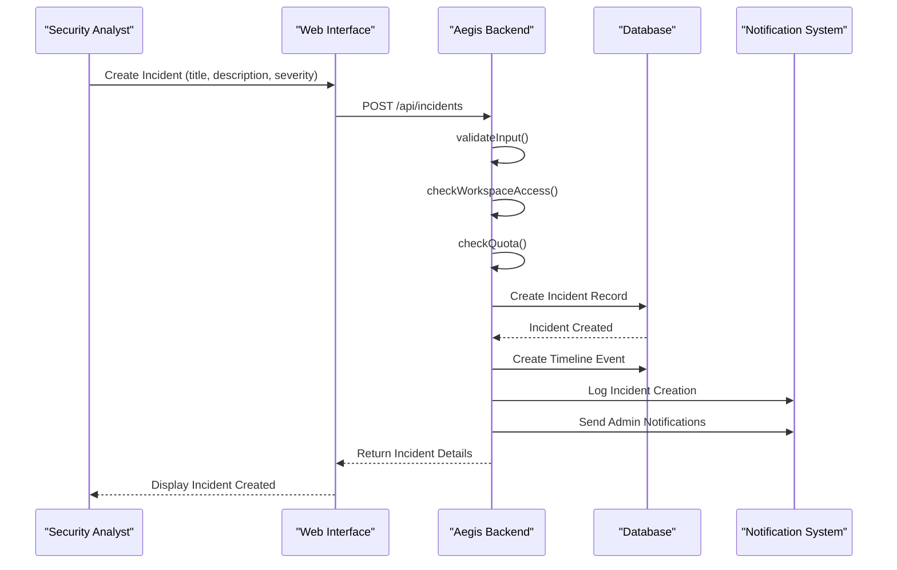
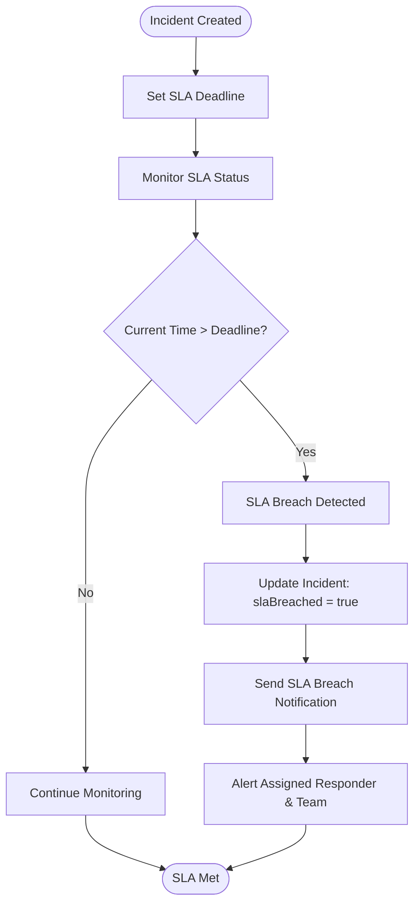
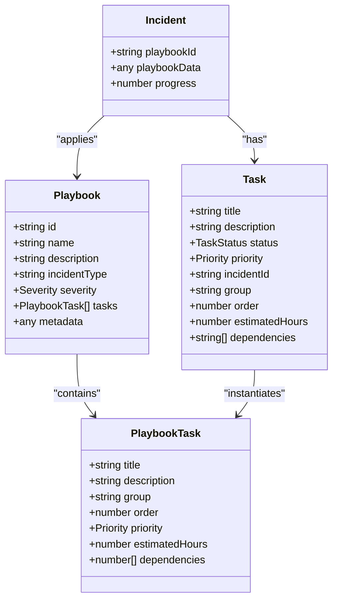
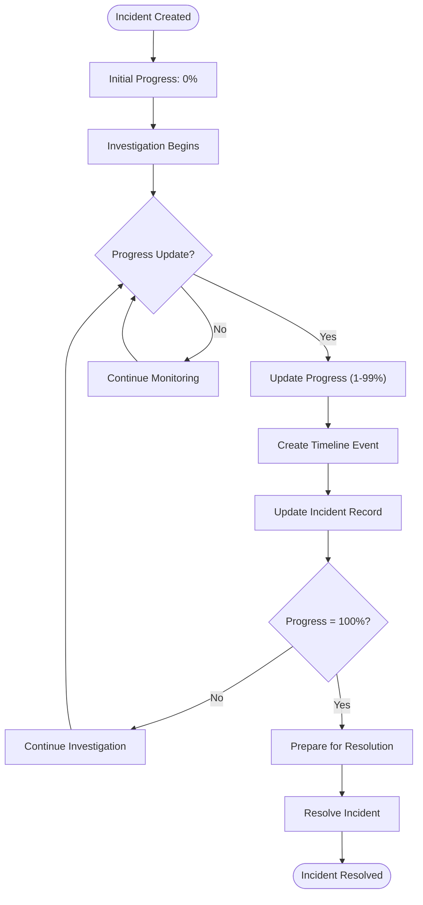
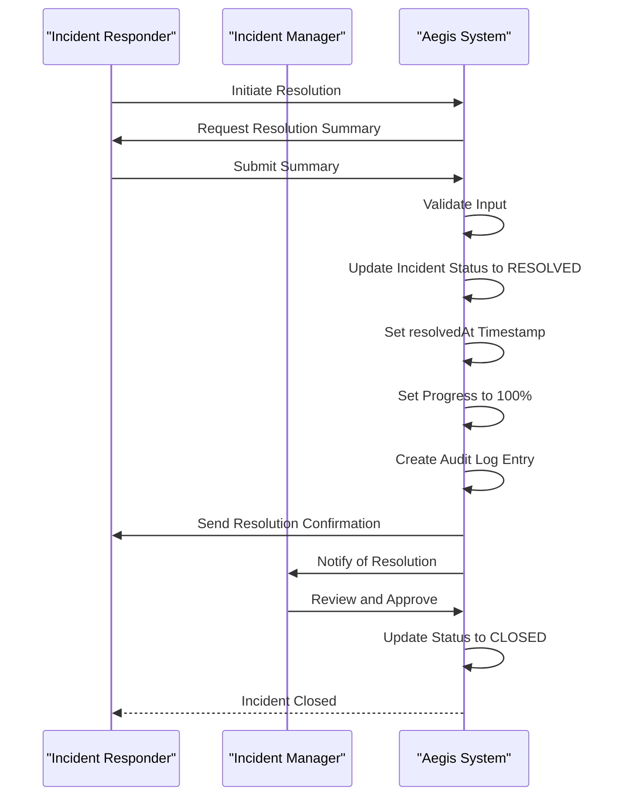
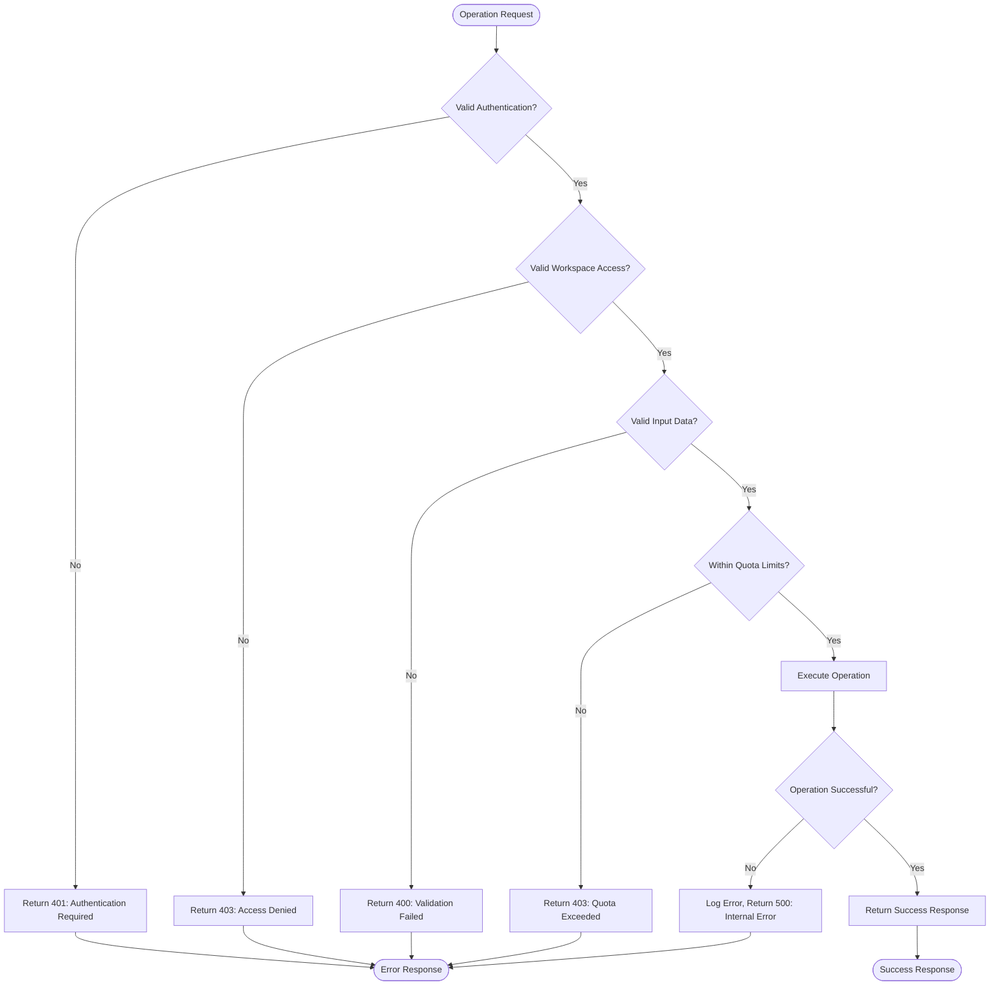

# Incident Response

<cite>
**Referenced Files in This Document**   
- [operations.ts](file://src/core/modules/aegis/incidents/operations.ts)
- [types.ts](file://src/core/modules/aegis/models/types.ts)
- [permissions.ts](file://src/core/modules/aegis/utils/permissions.ts)
- [notifications.ts](file://src/core/modules/aegis/utils/notifications.ts)
- [audit.ts](file://src/core/modules/aegis/utils/audit.ts)
- [timeline/operations.ts](file://src/core/modules/aegis/timeline/operations.ts)
- [tasks/operations.ts](file://src/core/modules/aegis/tasks/operations.ts)
- [alerts/operations.ts](file://src/core/modules/aegis/alerts/operations.ts)
- [validation.ts](file://src/server/validation.ts)
- [aegis.types.ts](file://src/client/pages/modules/aegis/types/aegis.types.ts)
</cite>

## Table of Contents
1. [Introduction](#introduction)
2. [Incident Creation Workflow](#incident-creation-workflow)
3. [SLA Management](#sla-management)
4. [Playbook Application](#playbook-application)
5. [Progress Tracking](#progress-tracking)
6. [Incident Resolution](#incident-resolution)
7. [Relationship with Other Components](#relationship-with-other-components)
8. [Error Handling and Common Issues](#error-handling-and-common-issues)
9. [Extension Guidelines](#extension-guidelines)
10. [Conclusion](#conclusion)

## Introduction

The Aegis module's incident response system provides a comprehensive framework for managing security incidents from detection to resolution. The system is built around the `incidents/operations.ts` file which contains all business logic for incident management, including creation, SLA tracking, playbook application, progress monitoring, and resolution workflows. The implementation follows a modular architecture with clear separation of concerns between business logic, permissions, notifications, and audit logging.

The incident response system is designed to handle the full lifecycle of security incidents, starting from alert escalation, through investigation and containment, to final resolution and reporting. It integrates with multiple components including task management, timeline events, notifications, and audit logging to provide a complete incident management solution.

**Section sources**
- [operations.ts](file://src/core/modules/aegis/incidents/operations.ts#L1-L957)
- [types.ts](file://src/core/modules/aegis/models/types.ts#L1-L672)

## Incident Creation Workflow

The incident creation process begins with the `createIncident` function in the operations module, which handles all aspects of incident creation including validation, quota checking, and initial setup. When an incident is created, the system performs several critical operations:

1. **Workspace Access Verification**: The `checkWorkspaceAccess` function validates that the user has access to the specified workspace, enforcing multi-tenancy and preventing cross-workspace access.

2. **Quota Enforcement**: The system checks the workspace's subscription plan against the `getPlanQuotas` function to ensure the incident limit has not been reached. Different plans have different limits (free: 5, hobby: 50, pro: unlimited).

3. **Incident Creation**: The incident is created with default values including status (ACTIVE), progress (0), and SLA breach status (false). The system captures all relevant details such as title, description, severity, priority, affected systems, and metadata.

4. **Timeline Event Creation**: A timeline event is automatically created to document the incident creation, including the user who created it and the initial severity and priority.

5. **Audit Logging**: The `logIncidentCreated` function records the creation event in the audit log for compliance and tracking purposes.

6. **Notification Distribution**: Workspace admins and owners receive notifications about the new incident, ensuring proper visibility and response coordination.

Incidents can be created directly or escalated from alerts using the `escalateToIncident` function in the alerts module. When escalating from an alert, the system automatically copies relevant information such as title, description, severity, and associated observables to the new incident, maintaining context and reducing manual data entry.



**Diagram sources **
- [operations.ts](file://src/core/modules/aegis/incidents/operations.ts#L249-L341)
- [alerts/operations.ts](file://src/core/modules/aegis/alerts/operations.ts#L496-L592)

**Section sources**
- [operations.ts](file://src/core/modules/aegis/incidents/operations.ts#L249-L341)
- [alerts/operations.ts](file://src/core/modules/aegis/alerts/operations.ts#L496-L592)
- [types.ts](file://src/core/modules/aegis/models/types.ts#L232-L242)

## SLA Management

The incident response system includes comprehensive SLA (Service Level Agreement) management capabilities to ensure timely response and resolution of security incidents. The SLA functionality is implemented through several key components:

1. **SLA Deadline Tracking**: Incidents can have an optional `slaDeadline` field that specifies the deadline by which the incident should be resolved. This deadline is stored as a timestamp in the database.

2. **SLA Breach Detection**: The `checkSLA` function evaluates whether an incident has breached its SLA deadline by comparing the current time with the deadline. If the current time exceeds the deadline, the incident is marked as breached.

3. **Automatic Breach Updates**: When a SLA breach is detected, the system automatically updates the incident's `slaBreached` field to true and triggers appropriate notifications to ensure prompt attention.

4. **SLA Breach Notifications**: The `notifySLABreach` function sends critical notifications to the assigned responder and broadcasts a WebSocket message to the workspace, ensuring immediate visibility of the breach.

5. **SLA Status in Statistics**: The `getIncidentStats` function includes SLA-related metrics such as the number of incidents in SLA and out of SLA, providing visibility into team performance.

The SLA management system is designed to be proactive rather than reactive. It continuously monitors incident deadlines and automatically escalates attention when deadlines are approaching or have been breached. This ensures that critical incidents receive appropriate attention and helps organizations meet their compliance requirements.



**Diagram sources **
- [operations.ts](file://src/core/modules/aegis/incidents/operations.ts#L656-L705)
- [notifications.ts](file://src/core/modules/aegis/utils/notifications.ts#L188-L219)

**Section sources**
- [operations.ts](file://src/core/modules/aegis/incidents/operations.ts#L656-L705)
- [types.ts](file://src/core/modules/aegis/models/types.ts#L618-L631)
- [notifications.ts](file://src/core/modules/aegis/utils/notifications.ts#L188-L219)

## Playbook Application

The incident response system supports playbook application to standardize response procedures and ensure consistent handling of similar incidents. Playbooks are applied using the `applyPlaybook` function, which performs the following operations:

1. **Playbook Validation**: The system verifies that the user has access to the specified incident and that the playbook exists and is valid.

2. **Incident Update**: The incident record is updated to reference the applied playbook through the `playbookId` and `playbookData` fields.

3. **Task Generation**: The system creates individual tasks from the playbook's task list, preserving the order, priority, estimated hours, and dependencies defined in the playbook.

4. **Timeline Documentation**: A timeline event is created to document the playbook application, including the playbook name and the number of tasks generated.

5. **Notification**: The system can notify relevant team members that a playbook has been applied to an incident.

Playbooks are defined as structured data with a name, description, incident type, severity level, and a list of tasks. Each task includes a title, description, group (for categorization), order, priority, estimated hours, and dependencies on other tasks. This structure allows for complex workflows with proper sequencing and resource allocation.

The playbook system enables organizations to codify their incident response procedures and ensure that best practices are consistently applied across all incidents. It also provides a foundation for continuous improvement by allowing teams to refine their playbooks based on lessons learned from previous incidents.



**Diagram sources **
- [operations.ts](file://src/core/modules/aegis/incidents/operations.ts#L582-L651)
- [types.ts](file://src/core/modules/aegis/models/types.ts#L478-L497)

**Section sources**
- [operations.ts](file://src/core/modules/aegis/incidents/operations.ts#L582-L651)
- [types.ts](file://src/core/modules/aegis/models/types.ts#L478-L497)
- [tasks/operations.ts](file://src/core/modules/aegis/tasks/operations.ts#L44-L67)

## Progress Tracking

The incident response system provides robust progress tracking capabilities to monitor the status of incident resolution. Progress is represented as a percentage value (0-100) and can be updated through the `updateIncidentProgress` function.

Key aspects of progress tracking include:

1. **Progress Validation**: The system validates that progress values are within the valid range (0-100) before updating the incident record.

2. **Automatic Status Updates**: When progress reaches 100%, the system can automatically update the incident status to RESOLVED, although this typically requires explicit resolution through the `resolveIncident` function.

3. **Timeline Integration**: Each progress update creates a timeline event that documents the change, including the user who made the update and the previous and new progress values.

4. **Statistics Calculation**: The `getIncidentStats` function uses progress data to calculate metrics such as average resolution time and mean time to resolve (MTTR).

5. **Visual Indicators**: The frontend components use progress values to display visual indicators such as progress bars, helping teams quickly assess the status of multiple incidents.

Progress tracking is designed to be flexible and can be updated by authorized users at any point during the incident lifecycle. This allows teams to accurately reflect the current state of investigation and response activities, providing transparency to stakeholders and enabling better resource allocation.



**Diagram sources **
- [operations.ts](file://src/core/modules/aegis/incidents/operations.ts#L499-L522)
- [types.ts](file://src/core/modules/aegis/models/types.ts#L255)

**Section sources**
- [operations.ts](file://src/core/modules/aegis/incidents/operations.ts#L499-L522)
- [types.ts](file://src/core/modules/aegis/models/types.ts#L255)
- [timeline/operations.ts](file://src/core/modules/aegis/timeline/operations.ts#L69-L97)

## Incident Resolution

The incident resolution process is a formal workflow that marks the completion of incident response activities. The system provides two primary functions for incident resolution: `resolveIncident` and `closeIncident`.

The resolution process involves the following steps:

1. **Resolution Summary**: The `resolveIncident` function requires a resolution summary that documents the outcome of the incident, including root cause, impact assessment, and remediation actions taken.

2. **Status Update**: The incident status is updated from its current state to RESOLVED, and the `resolvedAt` timestamp is set to the current time.

3. **Progress Update**: The progress is automatically set to 100% to reflect complete resolution.

4. **Audit Logging**: The `logIncidentResolved` function records the resolution in the audit log, capturing the resolution summary for compliance and review purposes.

5. **Notification**: The assigned responder receives a notification that the incident has been resolved, providing closure and recognition.

6. **Final Closure**: After resolution, the incident can be formally closed using the `closeIncident` function, which updates the status to CLOSED. This final state indicates that all activities are complete and the incident is archived.

The resolution workflow ensures that incidents are not simply marked as complete without proper documentation and review. The requirement for a resolution summary promotes accountability and provides valuable information for post-incident reviews and organizational learning.



**Diagram sources **
- [operations.ts](file://src/core/modules/aegis/incidents/operations.ts#L710-L754)
- [audit.ts](file://src/core/modules/aegis/utils/audit.ts#L185-L202)

**Section sources**
- [operations.ts](file://src/core/modules/aegis/incidents/operations.ts#L710-L754)
- [types.ts](file://src/core/modules/aegis/models/types.ts#L258)
- [audit.ts](file://src/core/modules/aegis/utils/audit.ts#L185-L202)

## Relationship with Other Components

The incident response system is tightly integrated with several other components to provide a comprehensive security operations platform. These relationships enable a cohesive workflow from detection to resolution and reporting.

### Task Management Integration
Incidents are linked to tasks through the task management system. When a playbook is applied to an incident, individual tasks are created and associated with the incident. The `getTasksByIncident` function allows retrieval of all tasks related to a specific incident, enabling responders to manage their workload effectively. Task completion automatically updates the incident's progress, creating a direct link between task execution and incident resolution.

### Timeline Events
Every significant action on an incident creates a timeline event, providing a chronological record of the incident's lifecycle. The timeline includes events for creation, updates, playbook application, SLA breaches, progress updates, and resolution. This historical record is invaluable for post-incident reviews, compliance audits, and training purposes.

### Notifications System
The incident response system integrates with the notification system to ensure proper communication throughout the incident lifecycle. Key events trigger notifications to relevant stakeholders, including incident creation (to admins), assignment (to responders), SLA breaches (to assigned personnel), and resolution (to the team). Notifications are delivered through multiple channels including in-app alerts, email, and WebSocket broadcasts.

### Audit Logging
All incident operations are recorded in the audit log for compliance and security purposes. The audit system captures who performed each action, when it occurred, and what changes were made. This provides a complete audit trail for regulatory requirements and internal reviews.

### Alert Integration
Incidents are often created by escalating alerts, creating a direct link between detection and response. When an alert is escalated to an incident, the system maintains the relationship between the two records, allowing responders to easily access the original alert details and associated data.

### Case Management
For more complex investigations, incidents can be escalated to formal cases using the `escalateToCase` function. This creates a case record and links it to the incident, enabling more comprehensive investigation management with additional features like evidence collection and chain of custody tracking.

```mermaid
graph TB
subgraph "Incident Core"
Incident[Incident]
end
subgraph "Supporting Components"
Tasks[Task Management]
Timeline[Timeline Events]
Notifications[Notifications]
Audit[Audit Logging]
Alerts[Alerts]
Cases[Cases]
end
Incident --> Tasks: "Generates tasks from playbooks"
Incident --> Timeline: "Creates timeline events for all actions"
Incident --> Notifications: "Triggers notifications for key events"
Incident --> Audit: "Records all operations in audit log"
Incident --> Alerts: "Can be created from alerts"
Incident --> Cases: "Can be escalated to cases"
style Incident fill:#4CAF50,stroke:#388E3C,color:white
style Tasks fill:#2196F3,stroke:#1976D2,color:white
style Timeline fill:#9C27B0,stroke:#7B1FA2,color:white
style Notifications fill:#FF9800,stroke:#F57C00,color:white
style Audit fill:#607D8B,stroke:#455A64,color:white
style Alerts fill:#E91E63,stroke:#C2185B,color:white
style Cases fill:#00BCD4,stroke:#0097A7,color:white
```

**Diagram sources **
- [operations.ts](file://src/core/modules/aegis/incidents/operations.ts)
- [tasks/operations.ts](file://src/core/modules/aegis/tasks/operations.ts)
- [timeline/operations.ts](file://src/core/modules/aegis/timeline/operations.ts)
- [notifications.ts](file://src/core/modules/aegis/utils/notifications.ts)
- [audit.ts](file://src/core/modules/aegis/utils/audit.ts)
- [alerts/operations.ts](file://src/core/modules/aegis/alerts/operations.ts)
- [cases/operations.ts](file://src/core/modules/aegis/cases/operations.ts)

**Section sources**
- [operations.ts](file://src/core/modules/aegis/incidents/operations.ts)
- [tasks/operations.ts](file://src/core/modules/aegis/tasks/operations.ts)
- [timeline/operations.ts](file://src/core/modules/aegis/timeline/operations.ts)
- [notifications.ts](file://src/core/modules/aegis/utils/notifications.ts)
- [audit.ts](file://src/core/modules/aegis/utils/audit.ts)

## Error Handling and Common Issues

The incident response system implements comprehensive error handling strategies to ensure reliability and provide meaningful feedback to users. The system uses the `HttpError` class to throw standardized error responses with appropriate status codes and messages.

### Common Error Scenarios and Handling

1. **Authentication and Authorization Errors**: The system validates user authentication and workspace access for all operations. Unauthorized access attempts result in 401 (unauthenticated) or 403 (forbidden) errors with clear messages.

2. **Resource Not Found**: When attempting to access an incident that doesn't exist or belongs to a different workspace, the system returns a 404 error. This prevents information disclosure about resources that exist but are not accessible.

3. **Validation Errors**: Input validation is performed using Zod schemas (via the server validation utility). Invalid input results in 400 errors with detailed error messages that help users correct their input.

4. **Quota Exceeded**: When a workspace has reached its incident limit based on the subscription plan, the system returns a 403 error with a message explaining the limit and suggesting plan upgrades.

5. **SLA Breach Detection**: The system proactively detects SLA breaches and updates the incident status accordingly, while also notifying the assigned responder to prevent missed deadlines.

6. **Concurrent Update Handling**: The system uses database transactions and proper locking mechanisms to handle concurrent updates to incident records, preventing race conditions and data corruption.

### Error Handling Best Practices

The implementation follows several best practices for error handling:

- **Specific Error Messages**: Errors provide specific information about what went wrong, helping users understand and resolve issues.
- **Appropriate Status Codes**: The system uses standard HTTP status codes that accurately reflect the nature of the error.
- **No Sensitive Information**: Error messages do not disclose sensitive system information that could be exploited.
- **Consistent Format**: All errors follow a consistent format with error codes, messages, and optional details.
- **Logging**: Errors are logged for monitoring and troubleshooting, but sensitive information is redacted.

### Common Issues and Solutions

1. **SLA Breach Detection**: The system addresses this by implementing proactive monitoring and automatic status updates when deadlines are exceeded.

2. **Concurrent Progress Updates**: Multiple users updating incident progress simultaneously is handled through database transactions and proper concurrency control.

3. **Permission Management**: Complex permission scenarios are addressed through the RBAC system with clear roles (OWNER, ADMIN, MEMBER) and permission checking functions.

4. **Data Consistency**: The system maintains data consistency through foreign key constraints, transactional operations, and referential integrity.



**Diagram sources **
- [operations.ts](file://src/core/modules/aegis/incidents/operations.ts)
- [permissions.ts](file://src/core/modules/aegis/utils/permissions.ts)
- [validation.ts](file://src/server/validation.ts)

**Section sources**
- [operations.ts](file://src/core/modules/aegis/incidents/operations.ts)
- [permissions.ts](file://src/core/modules/aegis/utils/permissions.ts)
- [validation.ts](file://src/server/validation.ts)
- [types.ts](file://src/core/modules/aegis/models/types.ts)

## Extension Guidelines

When extending the incident response functionality, developers should follow the established patterns and best practices to ensure consistency and maintainability.

### Input Validation with Zod
All new operations should implement input validation using Zod schemas. The server validation utility `ensureArgsSchemaOrThrowHttpError` should be used to validate input parameters and throw appropriate HTTP errors for invalid data. This ensures consistent error handling and prevents invalid data from entering the system.

### Proper Error Throwing with HttpError
All errors should be thrown using the `HttpError` class with appropriate status codes (400 for client errors, 401 for authentication, 403 for authorization, 404 for not found, 500 for server errors). Error messages should be clear and helpful without disclosing sensitive system information.

### Multi-tenancy Enforcement
All operations must enforce multi-tenancy by verifying workspace access using the `checkWorkspaceAccess` function. This prevents cross-workspace data access and ensures data isolation between different workspaces.

### Transaction Handling
Operations that modify multiple records should use database transactions to ensure data consistency. The Prisma client provides transaction support that should be used for complex operations that involve multiple database writes.

### Permission Checking
All operations should implement appropriate permission checks using the RBAC functions in the permissions utility. The system distinguishes between different roles (OWNER, ADMIN, MEMBER) and their respective capabilities, and new operations should respect these distinctions.

### Audit Logging
Any operation that modifies data should include appropriate audit logging using the audit utility functions. This ensures compliance with regulatory requirements and provides a complete history of changes.

### Notification Integration
Operations that represent significant state changes should trigger appropriate notifications using the notification utility functions. This keeps stakeholders informed and promotes collaboration.

### Code Organization
New functionality should be organized in the appropriate module directory following the existing structure. Related operations should be grouped together, and utility functions should be placed in the appropriate utils directory.

### Testing
All new functionality should be accompanied by comprehensive tests that cover both success and error scenarios. Tests should verify input validation, permission checks, data consistency, and integration with other components.

## Conclusion

The Aegis module's incident response system provides a comprehensive and well-structured framework for managing security incidents throughout their lifecycle. The system is built on solid architectural principles including proper separation of concerns, comprehensive error handling, and strict enforcement of security and multi-tenancy requirements.

Key strengths of the implementation include:

- **Comprehensive Workflow Support**: The system supports the complete incident lifecycle from creation through resolution and closure.
- **SLA Management**: Proactive SLA monitoring and breach detection ensure timely response to security incidents.
- **Playbook Integration**: Standardized response procedures through playbook application promote consistency and efficiency.
- **Robust Tracking**: Progress tracking and timeline events provide visibility into incident status and history.
- **Strong Security**: Multi-tenancy enforcement, role-based access control, and audit logging ensure data security and compliance.
- **Extensibility**: Clear patterns for validation, error handling, and integration make the system easy to extend with new functionality.

The incident response system is designed to be both powerful and user-friendly, providing security teams with the tools they need to effectively manage security incidents while maintaining compliance with organizational and regulatory requirements.