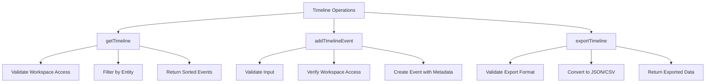
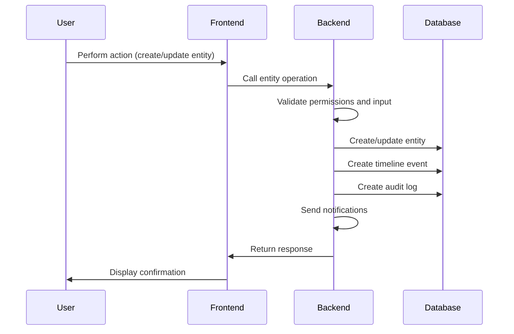
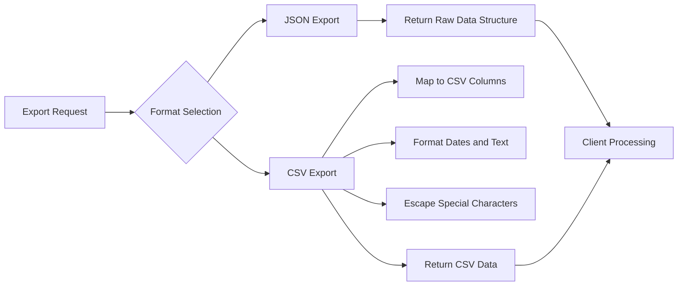
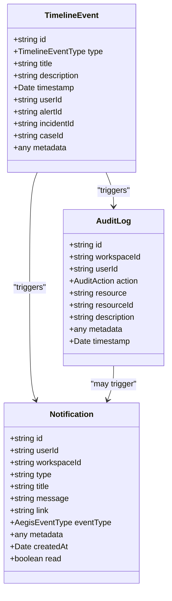
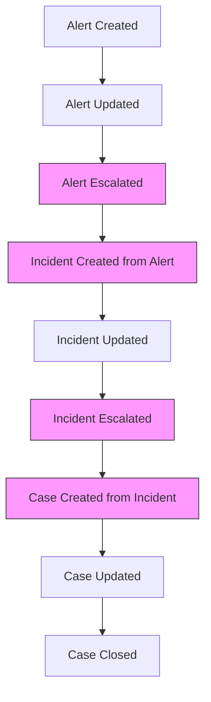
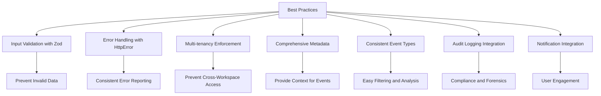

# Timeline Tracking

<cite>
**Referenced Files in This Document**   
- [operations.ts](file://src/core/modules/aegis/timeline/operations.ts)
- [types.ts](file://src/core/modules/aegis/models/types.ts)
- [permissions.ts](file://src/core/modules/aegis/utils/permissions.ts)
- [audit.ts](file://src/core/modules/aegis/utils/audit.ts)
- [notifications.ts](file://src/core/modules/aegis/utils/notifications.ts)
- [alerts/operations.ts](file://src/core/modules/aegis/alerts/operations.ts)
- [incidents/operations.ts](file://src/core/modules/aegis/incidents/operations.ts)
- [cases/operations.ts](file://src/core/modules/aegis/cases/operations.ts)
- [Timeline.tsx](file://src/client/pages/modules/aegis/components/Timeline.tsx)
</cite>

## Table of Contents
1. [Introduction](#introduction)
2. [Core Timeline Operations](#core-timeline-operations)
3. [Timeline Event Creation Lifecycle](#timeline-event-creation-lifecycle)
4. [Data Retrieval and Export](#data-retrieval-and-export)
5. [Integration with Audit and Notifications](#integration-with-audit-and-notifications)
6. [Cross-Entity Timeline Correlation](#cross-entity-timeline-correlation)
7. [Common Issues and Best Practices](#common-issues-and-best-practices)

## Introduction
The Aegis module's timeline tracking system provides a comprehensive audit trail for security incidents, alerts, and cases. This system enables security teams to maintain a chronological record of all actions taken during incident response and investigation. The timeline functionality is implemented across multiple entities (alerts, incidents, and cases) with consistent patterns for event creation, retrieval, and export. The system ensures data integrity through proper validation, workspace authorization, and transaction handling, while also integrating with audit logging and notification systems to provide comprehensive security monitoring.

**Section sources**
- [operations.ts](file://src/core/modules/aegis/timeline/operations.ts#L1-L137)
- [types.ts](file://src/core/modules/aegis/models/types.ts#L1-L672)

## Core Timeline Operations
The timeline operations are centralized in the `operations.ts` file within the Aegis module's timeline directory. This implementation provides three primary functions: retrieving timeline events, adding new events, and exporting timeline data in various formats.

The `getTimeline` function retrieves events for a specific workspace and optionally filters by alert, incident, or case ID. It performs workspace access validation and ensures that only events belonging to the specified workspace are returned. The function returns events with related entities (user, alert, incident, case) and orders them by timestamp in descending order.

The `addTimelineEvent` function creates new timeline events with proper validation and authorization. It requires workspace access verification and captures the user ID of the person creating the event. Each event includes metadata about the action, timestamp, and references to the associated entities.

The `exportTimeline` function supports multiple export formats (JSON and CSV), allowing users to extract timeline data for reporting or analysis purposes. The CSV format includes standardized fields for timestamp, event type, title, description, and user information.

**Diagram sources**
- [operations.ts](file://src/core/modules/aegis/timeline/operations.ts#L20-L137)

**Section sources**
- [operations.ts](file://src/core/modules/aegis/timeline/operations.ts#L20-L137)
- [types.ts](file://src/core/modules/aegis/models/types.ts#L36-L37)

## Timeline Event Creation Lifecycle
Timeline events are automatically generated during key operations across alerts, incidents, and cases, creating a comprehensive audit trail of the security response lifecycle. These events are also created when users manually add investigation notes or perform other actions.

For alerts, timeline events are created when:
- An alert is created (type: INFO, title: "Alert Created")
- An alert is updated (type: INFO, title: "Alert Updated")
- An alert is dismissed (type: WARNING, title: "Alert Dismissed")
- An alert is escalated to an incident (type: WARNING, title: "Alert Escalated")

For incidents, timeline events are created when:
- An incident is created (type: WARNING, title: "Incident Created")
- An incident is updated (type: INFO, title: "Incident Updated")
- A playbook is applied (type: INFO, title: "Playbook Applied")
- An incident is resolved (type: SUCCESS, title: "Incident Resolved")
- An incident is escalated to a case (type: WARNING, title: "Incident Escalated")

For cases, timeline events are created when:
- A case is created (type: INFO, title: "Case Created")
- A case is updated (type: INFO, title: "Case Updated")
- A template is applied (type: INFO, title: "Template Applied")
- A case is closed (type: SUCCESS, title: "Case Closed")
- A case is reopened (type: WARNING, title: "Case Reopened")

Manual timeline events are created when users add investigation notes through the `addIncidentNote` or `addCaseNote` functions, which create events with the type INFO and title "Note Added".

**Diagram sources**
- [alerts/operations.ts](file://src/core/modules/aegis/alerts/operations.ts#L212-L700)
- [incidents/operations.ts](file://src/core/modules/aegis/incidents/operations.ts#L249-L957)
- [cases/operations.ts](file://src/core/modules/aegis/cases/operations.ts#L260-L911)

**Section sources**
- [alerts/operations.ts](file://src/core/modules/aegis/alerts/operations.ts#L251-L265)
- [incidents/operations.ts](file://src/core/modules/aegis/incidents/operations.ts#L300-L314)
- [cases/operations.ts](file://src/core/modules/aegis/cases/operations.ts#L309-L323)
- [incidents/operations.ts](file://src/core/modules/aegis/incidents/operations.ts#L562-L585)
- [cases/operations.ts](file://src/core/modules/aegis/cases/operations.ts#L803-L814)

## Data Retrieval and Export
The timeline system provides flexible data retrieval and export capabilities to support various use cases, from real-time monitoring to compliance reporting. The retrieval system is designed to efficiently handle large volumes of timeline data while maintaining data consistency and security.

The `getTimeline` function supports filtering by workspace, alert, incident, or case, allowing users to retrieve timeline events for specific contexts. The function includes proper error handling for cases where the specified entity does not exist or the user does not have access to it. Results are ordered by timestamp in descending order to show the most recent events first.

The export functionality supports multiple formats to accommodate different requirements:
- JSON format returns the raw timeline data structure, preserving all metadata and relationships
- CSV format provides a simplified, tabular representation suitable for spreadsheet analysis

The export system handles data transformation appropriately for each format, ensuring that dates are properly formatted and special characters are escaped. For CSV exports, the system maps timeline event properties to standardized column names (timestamp, type, title, description, user).

**Diagram sources**
- [operations.ts](file://src/core/modules/aegis/timeline/operations.ts#L99-L136)
- [types.ts](file://src/core/modules/aegis/models/types.ts#L568-L575)

**Section sources**
- [operations.ts](file://src/core/modules/aegis/timeline/operations.ts#L99-L136)
- [cases/operations.ts](file://src/core/modules/aegis/cases/operations.ts#L719-L742)

## Integration with Audit and Notifications
The timeline system is tightly integrated with the audit logging and notification systems to provide comprehensive security monitoring and user engagement. These integrations ensure that all significant actions are properly recorded and communicated to relevant stakeholders.

The audit logging integration uses the `audit.ts` utility functions to create audit log entries for key operations. When an alert is created, the `logAlertCreated` function is called to record the action in the audit log. Similarly, incident and case operations trigger their respective audit logging functions (`logIncidentCreated`, `logCaseCreated`, etc.). This creates a redundant audit trail that can be used for compliance and forensic analysis.

The notification system integration uses the `notifications.ts` utility functions to send alerts to users when important events occur. For example, when a critical alert is created, the `notifyAlertCreated` function sends notifications to workspace admins and owners. When an incident is assigned to a user, the `notifyIncidentAssigned` function sends a notification to the assignee. These notifications are delivered through multiple channels including in-app notifications, email, and WebSocket broadcasts.

The integration between these systems ensures that timeline events, audit logs, and notifications are created consistently and atomically within the same transaction when possible, maintaining data integrity across the system.

**Diagram sources**
- [audit.ts](file://src/core/modules/aegis/utils/audit.ts#L14-L64)
- [notifications.ts](file://src/core/modules/aegis/utils/notifications.ts#L14-L65)
- [operations.ts](file://src/core/modules/aegis/timeline/operations.ts#L69-L97)

**Section sources**
- [audit.ts](file://src/core/modules/aegis/utils/audit.ts#L14-L64)
- [notifications.ts](file://src/core/modules/aegis/utils/notifications.ts#L14-L65)
- [alerts/operations.ts](file://src/core/modules/aegis/alerts/operations.ts#L267-L292)
- [incidents/operations.ts](file://src/core/modules/aegis/incidents/operations.ts#L316-L339)
- [cases/operations.ts](file://src/core/modules/aegis/cases/operations.ts#L325-L347)

## Cross-Entity Timeline Correlation
The timeline system supports cross-entity correlation by linking events across alerts, incidents, and cases through shared identifiers and metadata. This capability enables security teams to trace the complete lifecycle of a security event from initial detection through investigation and resolution.

When an alert is escalated to an incident, the system creates two linked timeline events: one on the alert with type "Alert Escalated" and metadata containing the incident ID, and another on the incident with type "Incident Created from Alert" and metadata containing the alert ID. This bidirectional linking allows users to navigate between related entities and understand the context of each action.

Similarly, when an incident is escalated to a case, the system creates correlated timeline events on both entities with references to each other. This pattern ensures that the complete chain of escalation is preserved in the timeline, providing a comprehensive view of the incident response process.

The system also supports manual correlation through the metadata field, which can store references to related entities or external systems. This flexibility allows users to create custom links between timeline events and other data sources as needed.

**Diagram sources**
- [alerts/operations.ts](file://src/core/modules/aegis/alerts/operations.ts#L562-L585)
- [incidents/operations.ts](file://src/core/modules/aegis/incidents/operations.ts#L825-L849)
- [cases/operations.ts](file://src/core/modules/aegis/cases/operations.ts#L803-L814)

**Section sources**
- [alerts/operations.ts](file://src/core/modules/aegis/alerts/operations.ts#L562-L585)
- [incidents/operations.ts](file://src/core/modules/aegis/incidents/operations.ts#L825-L849)
- [cases/operations.ts](file://src/core/modules/aegis/cases/operations.ts#L803-L814)

## Common Issues and Best Practices
The timeline tracking system addresses several common issues in security incident management, including data consistency, export format handling, and multi-tenancy enforcement. Understanding these issues and following established best practices is essential for maintaining a reliable and effective timeline system.

Data consistency issues are addressed through the use of database transactions and proper error handling. The system ensures that timeline events are created atomically with the associated entity operations, preventing orphaned events or missing audit trails. The `HttpError` class is used consistently for error reporting, providing clear feedback to clients about the nature of any failures.

Export format handling is managed through the `exportTimeline` function, which validates the requested format and transforms the data appropriately. For CSV exports, special attention is paid to date formatting, text escaping, and column mapping to ensure compatibility with spreadsheet applications.

When extending the timeline functionality, developers should follow these established patterns:
- Use Zod for input validation to ensure data integrity
- Throw `HttpError` instances for consistent error handling
- Enforce multi-tenancy by validating workspace access for all operations
- Include comprehensive metadata in timeline events to provide context
- Maintain consistent event types and titles across the system
- Integrate with audit logging and notifications for comprehensive monitoring

The frontend `Timeline` component demonstrates best practices for displaying timeline data, using consistent icons and colors for different event types, formatting timestamps appropriately, and displaying metadata in a structured manner.

**Diagram sources**
- [operations.ts](file://src/core/modules/aegis/timeline/operations.ts#L70-L79)
- [permissions.ts](file://src/core/modules/aegis/utils/permissions.ts#L14-L37)
- [Timeline.tsx](file://src/client/pages/modules/aegis/components/Timeline.tsx#L1-L104)

**Section sources**
- [operations.ts](file://src/core/modules/aegis/timeline/operations.ts#L70-L79)
- [permissions.ts](file://src/core/modules/aegis/utils/permissions.ts#L14-L37)
- [Timeline.tsx](file://src/client/pages/modules/aegis/components/Timeline.tsx#L1-L104)
- [types.ts](file://src/core/modules/aegis/models/types.ts#L36-L37)
- [audit.ts](file://src/core/modules/aegis/utils/audit.ts#L14-L64)
- [notifications.ts](file://src/core/modules/aegis/utils/notifications.ts#L14-L65)