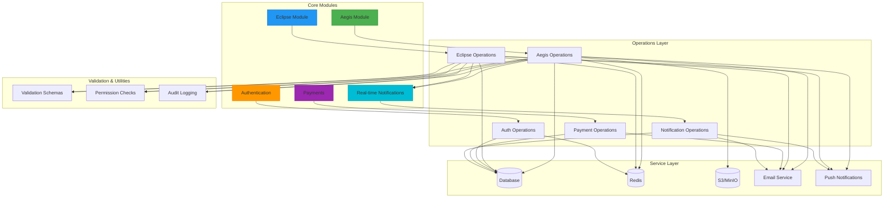
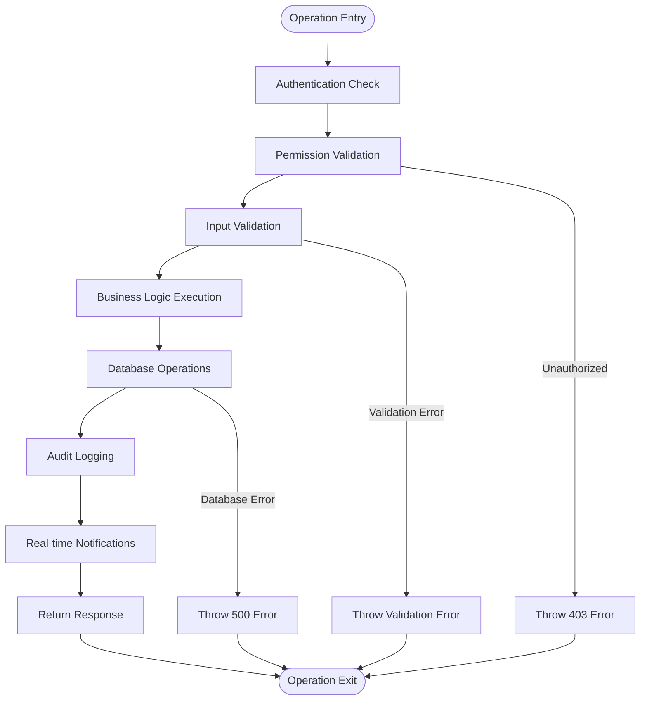
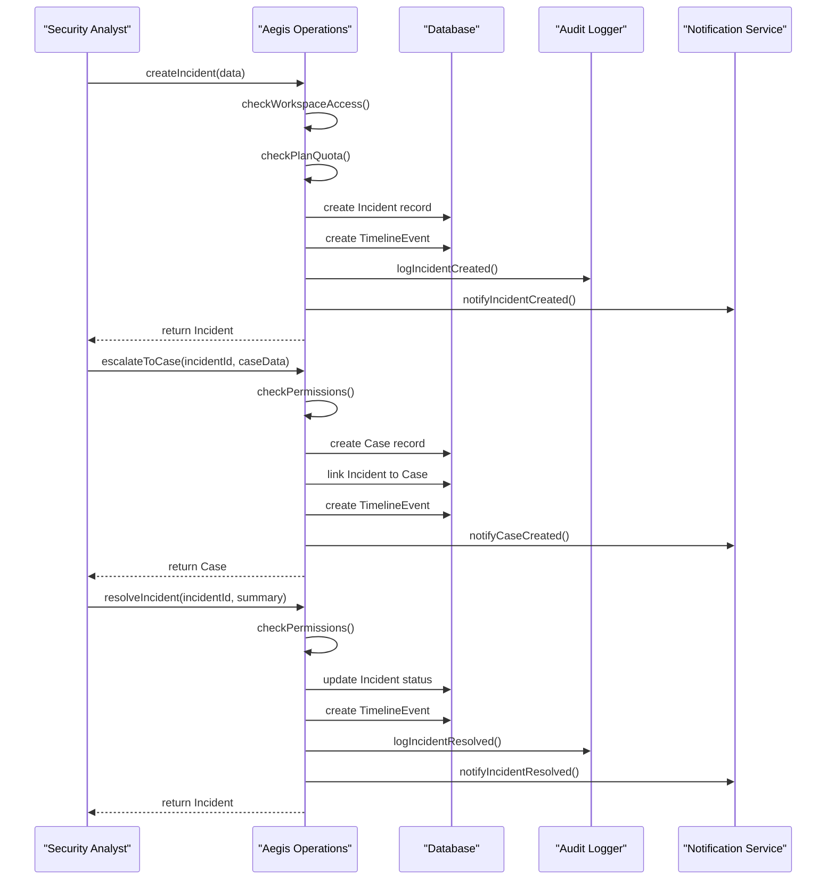
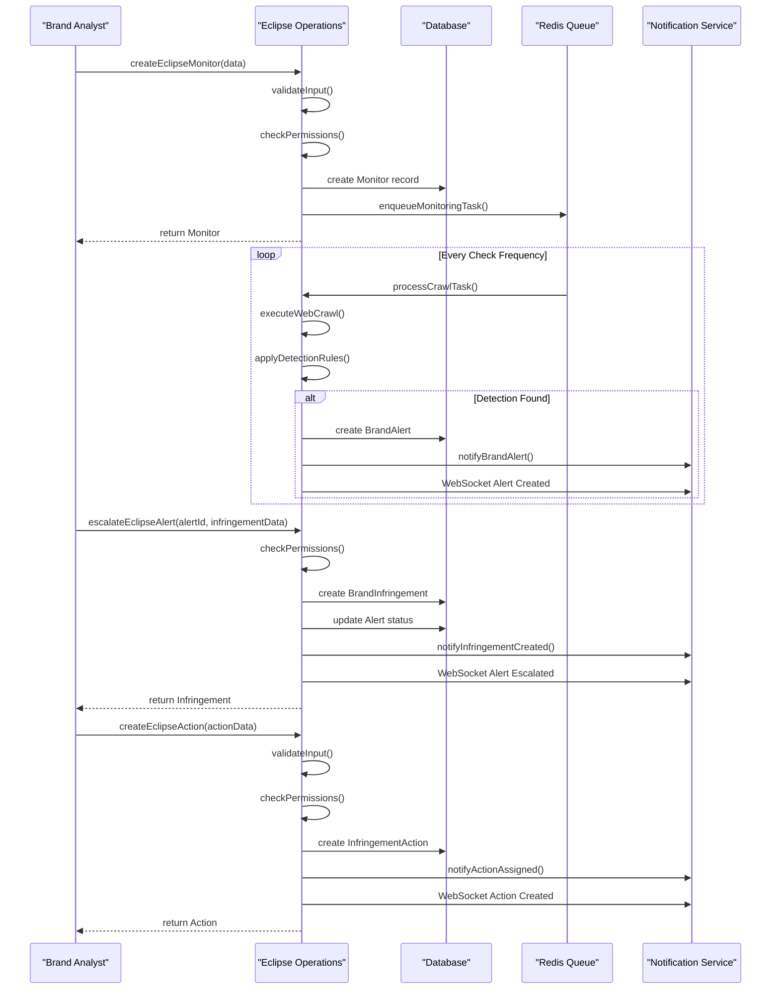
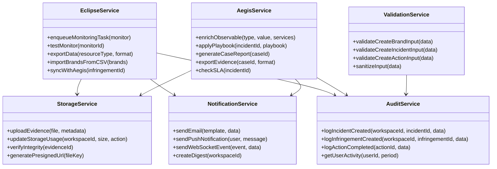
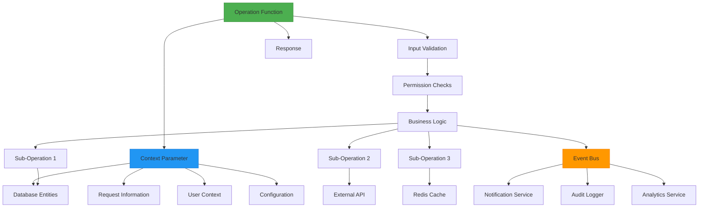
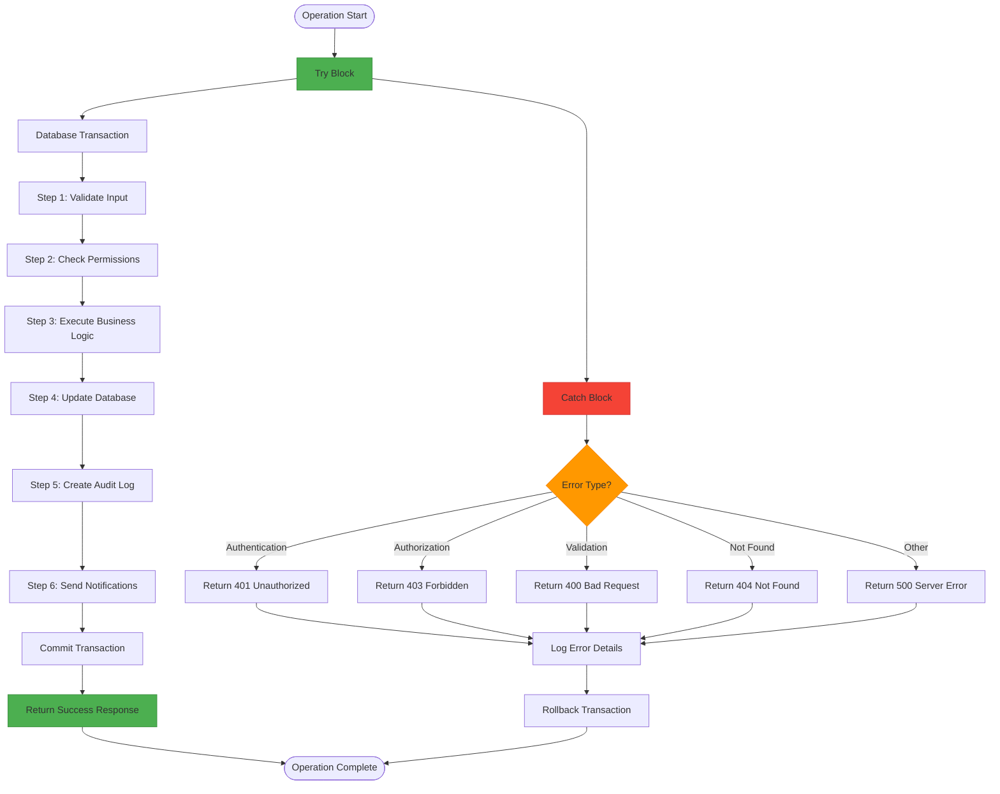
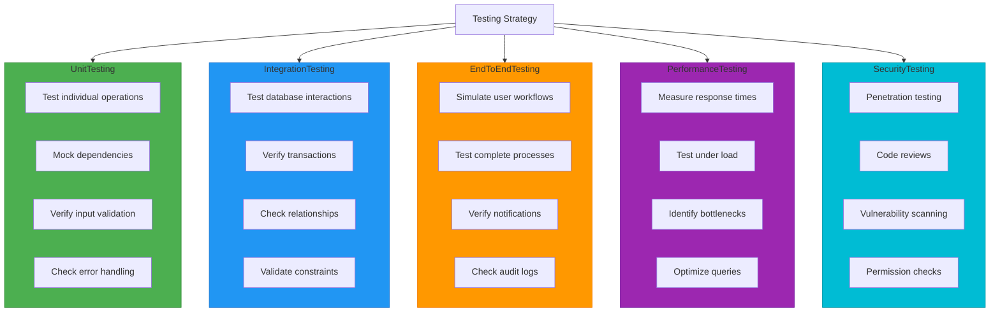

# Business Logic Modules

<cite>
**Referenced Files in This Document**   
- [aegis/operations.ts](file://src/core/modules/aegis/operations.ts)
- [eclipse/operations.ts](file://src/core/modules/eclipse/operations.ts)
- [aegis/incidents/operations.ts](file://src/core/modules/aegis/incidents/operations.ts)
- [eclipse/detections/operations.ts](file://src/core/modules/eclipse/detections/operations.ts)
- [aegis/alerts/operations.ts](file://src/core/modules/aegis/alerts/operations.ts)
- [aegis/cases/operations.ts](file://src/core/modules/aegis/cases/operations.ts)
- [aegis/tasks/operations.ts](file://src/core/modules/aegis/tasks/operations.ts)
- [aegis/timeline/operations.ts](file://src/core/modules/aegis/timeline/operations.ts)
- [aegis/observables/operations.ts](file://src/core/modules/aegis/observables/operations.ts)
- [aegis/evidence/operations.ts](file://src/core/modules/aegis/evidence/operations.ts)
- [aegis/models/types.ts](file://src/core/modules/aegis/models/types.ts)
- [eclipse/types.ts](file://src/core/modules/eclipse/types.ts)
</cite>

## Table of Contents
1. [Introduction](#introduction)
2. [Core Architecture](#core-architecture)
3. [Business Logic Operations Pattern](#business-logic-operations-pattern)
4. [Aegis Incident Management Workflow](#aegis-incident-management-workflow)
5. [Eclipse Detection and Infringement Workflow](#eclipse-detection-and-infringement-workflow)
6. [Service Layer Organization](#service-layer-organization)
7. [Dependency Injection and Orchestration](#dependency-injection-and-orchestration)
8. [Transactional Integrity and Error Handling](#transactional-integrity-and-error-handling)
9. [Common Issues and Testing Strategies](#common-issues-and-testing-strategies)
10. [Module Extension Guidelines](#module-extension-guidelines)

## Introduction
The application implements a modular business logic architecture centered around the `operations.ts` pattern in the `src/core/` directory. This design separates concerns across authentication, payments, notifications, and domain-specific modules like Aegis (security incident management) and Eclipse (brand protection). Each module encapsulates database interactions, validation, service orchestration, and business rules within its operations layer, providing a clean interface for the rest of the application. This documentation details the implementation patterns, workflows, and best practices for extending this architecture.

## Core Architecture
The business logic architecture follows a modular pattern with clear separation of concerns. The core modules reside in `src/core/modules/` and include Aegis for security incident management and Eclipse for brand protection monitoring. Each module exposes its functionality through an `operations.ts` file that serves as the primary interface for business logic. These operations encapsulate database interactions using Prisma, implement validation through Zod schemas, and orchestrate services while maintaining transactional integrity. The architecture supports dependency injection and provides comprehensive error handling and logging mechanisms.

**Diagram sources**
- [aegis/operations.ts](file://src/core/modules/aegis/operations.ts)
- [eclipse/operations.ts](file://src/core/modules/eclipse/operations.ts)

**Section sources**
- [aegis/operations.ts](file://src/core/modules/aegis/operations.ts#L1-L30)
- [eclipse/operations.ts](file://src/core/modules/eclipse/operations.ts#L1-L2403)

## Business Logic Operations Pattern
The business logic operations pattern is implemented through dedicated `operations.ts` files in each module, serving as the primary interface for business logic. These operations encapsulate database interactions, validation, service orchestration, and business rules while maintaining transactional integrity. The pattern follows a consistent structure across modules, with operations organized by entity and functionality.

Each operation function follows a standardized pattern: authentication and authorization checks, input validation, business logic execution, database operations, audit logging, and real-time notifications. The operations leverage TypeScript interfaces for type safety and use Prisma for database interactions. Validation is implemented using Zod schemas, and permission checks are centralized in utility functions.

The operations pattern supports dependency injection through the context parameter, which provides access to database entities, request information, and user context. This allows operations to be easily tested and reused across different parts of the application. The pattern also includes comprehensive error handling with appropriate HTTP status codes and error messages.

**Diagram sources**
- [aegis/operations.ts](file://src/core/modules/aegis/operations.ts#L1-L30)
- [eclipse/operations.ts](file://src/core/modules/eclipse/operations.ts#L1-L2403)

**Section sources**
- [aegis/operations.ts](file://src/core/modules/aegis/operations.ts#L1-L30)
- [eclipse/operations.ts](file://src/core/modules/eclipse/operations.ts#L1-L2403)

## Aegis Incident Management Workflow
The Aegis module implements a comprehensive security incident management workflow through its operations layer. The incident management process begins with alert creation, which triggers validation, quota checks, and automatic notifications for critical alerts. When an alert requires investigation, it can be escalated to an incident, creating a formal investigation record with associated timelines and tasks.

Incident operations include full CRUD functionality with filtering, pagination, and sorting capabilities. Each operation enforces workspace access controls and role-based permissions. When creating an incident, the system checks subscription plan quotas to ensure compliance with service limits. The workflow supports SLA management, with automatic breach detection and notifications when deadlines are approaching or exceeded.

The incident management workflow integrates with other Aegis components, including cases, observables, evidence, and tasks. When an incident is resolved, the system updates the timeline, sends notifications to assigned personnel, and logs the resolution for audit purposes. The operations maintain transactional integrity by ensuring all related updates are completed successfully or rolled back in case of errors.

**Diagram sources**
- [aegis/incidents/operations.ts](file://src/core/modules/aegis/incidents/operations.ts#L249-L754)
- [aegis/cases/operations.ts](file://src/core/modules/aegis/cases/operations.ts#L260-L649)
- [aegis/alerts/operations.ts](file://src/core/modules/aegis/alerts/operations.ts#L496-L592)

**Section sources**
- [aegis/incidents/operations.ts](file://src/core/modules/aegis/incidents/operations.ts#L249-L754)
- [aegis/cases/operations.ts](file://src/core/modules/aegis/cases/operations.ts#L260-L649)
- [aegis/alerts/operations.ts](file://src/core/modules/aegis/alerts/operations.ts#L496-L592)

## Eclipse Detection and Infringement Workflow
The Eclipse module implements a brand protection workflow that begins with brand monitoring configuration and detection of potential infringements. The workflow starts with creating a brand and its associated monitors, which define the search parameters for detecting brand violations. When a potential infringement is detected, the system creates an alert that can be reviewed and escalated to a formal infringement record.

The detection workflow includes automated monitoring through scheduled tasks that crawl specified sources and apply detection rules. When a detection occurs, the system creates an alert with confidence scoring and severity assessment. Analysts can acknowledge, dismiss, or escalate alerts to formal infringements. When escalating an alert, the system automatically creates an infringement record and links it to the original alert.

The infringement management workflow supports full lifecycle management, including assignment to team members, tracking of remediation actions, and integration with the Aegis incident management system for serious violations. The operations maintain detailed audit logs of all actions and provide real-time notifications through WebSocket connections. The workflow also includes bulk operations for managing multiple alerts or infringements simultaneously.

**Diagram sources**
- [eclipse/operations.ts](file://src/core/modules/eclipse/operations.ts#L198-L1201)
- [eclipse/detections/operations.ts](file://src/core/modules/eclipse/detections/operations.ts#L7-L183)

**Section sources**
- [eclipse/operations.ts](file://src/core/modules/eclipse/operations.ts#L198-L1201)
- [eclipse/detections/operations.ts](file://src/core/modules/eclipse/detections/operations.ts#L7-L183)

## Service Layer Organization
The service layer is organized to provide reusable functionality across modules while maintaining separation of concerns. Each module has its own service utilities that handle specific domain logic, such as threat intelligence enrichment in Aegis and monitoring task queuing in Eclipse. The service layer follows a consistent pattern of dependency injection through the context parameter, allowing services to access database entities, configuration, and external service clients.

The organization separates core services from utility functions, with services handling business-critical operations and utilities providing helper functionality. Services are designed to be stateless and idempotent where possible, making them easier to test and maintain. The layer includes specialized services for different concerns, such as storage operations for handling file uploads and downloads, audit logging for tracking user actions, and notification services for sending alerts through multiple channels.

The service layer also includes integration points with external systems, such as payment processing with Stripe, email delivery through various providers, and real-time communication via WebSocket connections. These integrations are abstracted behind consistent interfaces, allowing for easy replacement or extension of functionality without affecting the core business logic.

**Diagram sources**
- [eclipse/operations.ts](file://src/core/modules/eclipse/operations.ts#L61-L2399)
- [aegis/operations.ts](file://src/core/modules/aegis/operations.ts#L1-L30)
- [aegis/services/storage.ts](file://src/core/modules/aegis/services/storage.ts)
- [core/notifications/operations.ts](file://src/core/notifications/operations.ts)
- [core/audit/operations.ts](file://src/core/audit/operations.ts)

**Section sources**
- [eclipse/operations.ts](file://src/core/modules/eclipse/operations.ts#L61-L2399)
- [aegis/operations.ts](file://src/core/modules/aegis/operations.ts#L1-L30)

## Dependency Injection and Orchestration
The operations layer implements a dependency injection pattern through the context parameter, which provides access to database entities, request information, and user context. This approach allows operations to be easily tested and reused across different parts of the application while maintaining loose coupling between components. The context object is automatically populated by the framework and passed to all operation functions.

Service orchestration is achieved through composition of smaller, focused operations that can be combined to implement complex business workflows. For example, escalating an alert to an incident involves multiple operations: creating the incident record, linking it to the alert, copying related observables, creating timeline events, and sending notifications. Each of these steps is implemented as a separate operation that can be reused in other contexts.

The orchestration pattern includes error handling and transaction management, ensuring that operations either complete successfully or roll back to a consistent state. When multiple database operations are required, they are grouped to maintain data integrity. The pattern also supports event-driven architecture through the event bus, allowing operations to publish events that trigger other actions without creating tight coupling.

The dependency injection system also supports configuration injection, allowing operations to access environment-specific settings such as API keys, service endpoints, and feature flags. This makes the operations more flexible and easier to configure for different deployment environments.

**Diagram sources**
- [aegis/incidents/operations.ts](file://src/core/modules/aegis/incidents/operations.ts#L249-L754)
- [eclipse/operations.ts](file://src/core/modules/eclipse/operations.ts#L198-L1201)
- [aegis/alerts/operations.ts](file://src/core/modules/aegis/alerts/operations.ts#L213-L293)

**Section sources**
- [aegis/incidents/operations.ts](file://src/core/modules/aegis/incidents/operations.ts#L249-L754)
- [eclipse/operations.ts](file://src/core/modules/eclipse/operations.ts#L198-L1201)

## Transactional Integrity and Error Handling
The operations layer ensures transactional integrity through careful management of database operations and error handling. When multiple related updates are required, they are grouped within a single database transaction to maintain data consistency. If any part of the operation fails, the entire transaction is rolled back, preventing partial updates that could leave the system in an inconsistent state.

Error handling follows a consistent pattern across all operations, with specific HTTP error codes for different types of failures. Authentication failures return 401, authorization failures return 403, not found errors return 404, and validation errors return 400. Server errors are caught and return 500 with appropriate logging for debugging. The error messages are designed to be informative for developers while not exposing sensitive system information to end users.

The operations include comprehensive logging for audit and debugging purposes. Every operation logs key events, including creation, updates, and deletions, with details about the user, timestamp, and affected entities. This audit trail is crucial for security investigations and compliance requirements. The logging system also captures error details for troubleshooting while maintaining appropriate security boundaries.

The error handling strategy includes both synchronous and asynchronous error management. For immediate operations, errors are handled within the request-response cycle. For background operations, such as monitoring tasks or report generation, errors are captured and stored for later review, with notifications sent to administrators when critical failures occur.

**Diagram sources**
- [aegis/incidents/operations.ts](file://src/core/modules/aegis/incidents/operations.ts#L249-L754)
- [eclipse/operations.ts](file://src/core/modules/eclipse/operations.ts#L198-L1201)
- [aegis/alerts/operations.ts](file://src/core/modules/aegis/alerts/operations.ts#L213-L293)

**Section sources**
- [aegis/incidents/operations.ts](file://src/core/modules/aegis/incidents/operations.ts#L249-L754)
- [eclipse/operations.ts](file://src/core/modules/eclipse/operations.ts#L198-L1201)

## Common Issues and Testing Strategies
Common issues in the operations layer include race conditions, permission escalation vulnerabilities, and data consistency problems. Race conditions can occur when multiple users attempt to modify the same resource simultaneously, potentially leading to inconsistent states. The system mitigates this through database-level locking and optimistic concurrency control, using version numbers or timestamps to detect conflicts.

Permission escalation vulnerabilities are prevented through comprehensive permission checks at the beginning of each operation. The system verifies both workspace access and role-based permissions before proceeding with any business logic. This defense-in-depth approach ensures that users cannot access resources outside their authorized scope, even if they attempt to manipulate request parameters.

Testing strategies for the operations layer include unit testing, integration testing, and end-to-end testing. Unit tests focus on individual operations, mocking dependencies to isolate functionality. Integration tests verify the interaction between operations and the database, ensuring that transactions and relationships work correctly. End-to-end tests simulate real user workflows, validating the complete business process from start to finish.

The testing framework includes test coverage requirements, with a minimum threshold for all new code. Tests are organized by module and operation type, making it easy to identify gaps in coverage. The system also includes performance testing for critical operations, ensuring that response times remain acceptable under load. Security testing is performed regularly, including penetration testing and code reviews to identify potential vulnerabilities.

**Diagram sources**
- [aegis/incidents/operations.ts](file://src/core/modules/aegis/incidents/operations.ts#L249-L754)
- [eclipse/operations.ts](file://src/core/modules/eclipse/operations.ts#L198-L1201)
- [aegis/alerts/operations.ts](file://src/core/modules/aegis/alerts/operations.ts#L213-L293)

**Section sources**
- [aegis/incidents/operations.ts](file://src/core/modules/aegis/incidents/operations.ts#L249-L754)
- [eclipse/operations.ts](file://src/core/modules/eclipse/operations.ts#L198-L1201)

## Module Extension Guidelines
When extending existing modules or creating new ones, follow the established patterns to maintain consistency across the codebase. New modules should be added to the `src/core/modules/` directory with a dedicated subdirectory for the module. The module should include an `operations.ts` file as the primary interface, following the same structure as existing modules.

New operations should implement the standard pattern: authentication and authorization checks, input validation, business logic execution, database operations, audit logging, and real-time notifications. Use TypeScript interfaces to define input and output types, and create corresponding types in a `models/types.ts` file if the module requires complex data structures.

When creating new database entities, update the Prisma schema and generate the corresponding types. Ensure that all operations properly handle the new entities, including appropriate filtering, pagination, and sorting capabilities. Implement comprehensive error handling with appropriate HTTP status codes and error messages.

For validation, create Zod schemas in a dedicated `validation.ts` file and use them consistently across all operations that accept user input. Implement permission checks using the existing utilities, extending them only when necessary for new role requirements. Add audit logging for all significant operations, following the established format and including relevant context.

Finally, add comprehensive tests for all new functionality, including unit tests, integration tests, and end-to-end tests. Ensure that test coverage meets the project requirements and that performance and security implications have been considered. Document the new module and its operations following the existing documentation patterns.

**Section sources**
- [aegis/operations.ts](file://src/core/modules/aegis/operations.ts#L1-L30)
- [eclipse/operations.ts](file://src/core/modules/eclipse/operations.ts#L1-L2403)
- [aegis/models/types.ts](file://src/core/modules/aegis/models/types.ts#L1-L672)
- [eclipse/types.ts](file://src/core/modules/eclipse/types.ts#L1-L395)