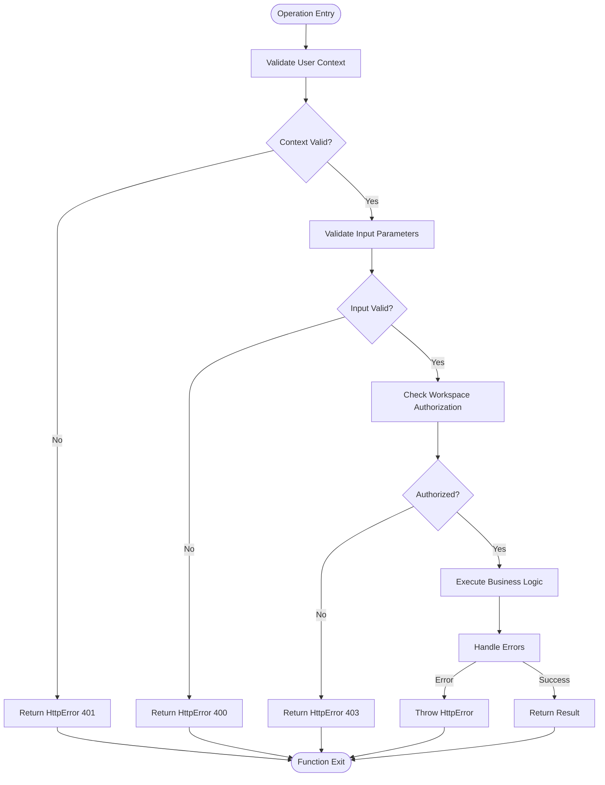
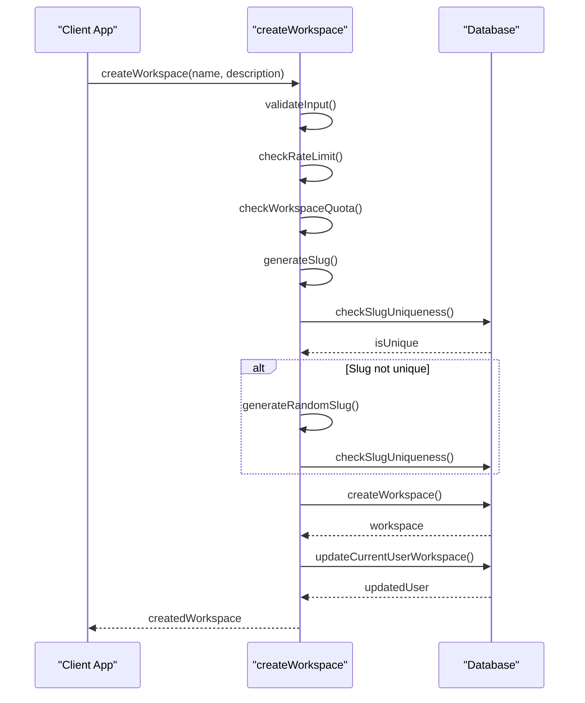
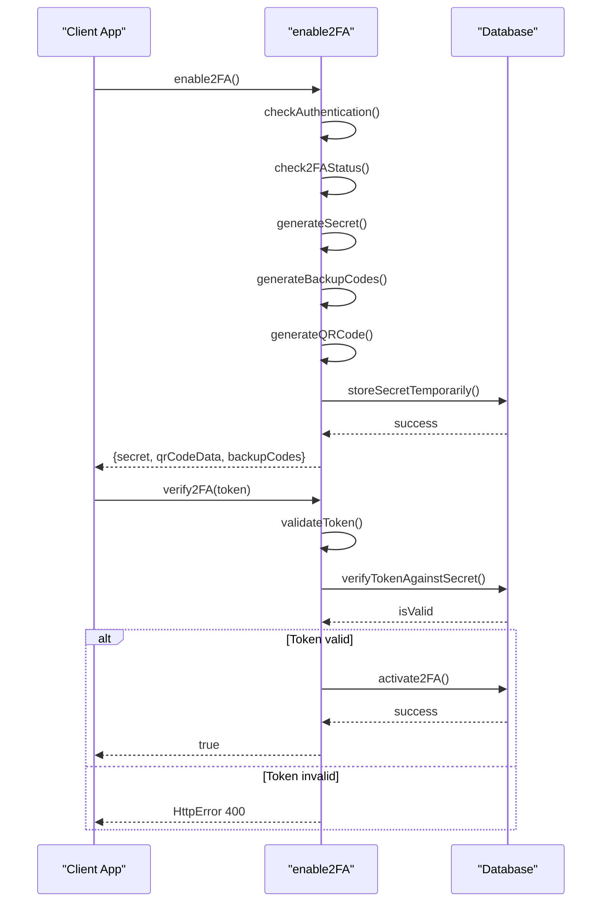
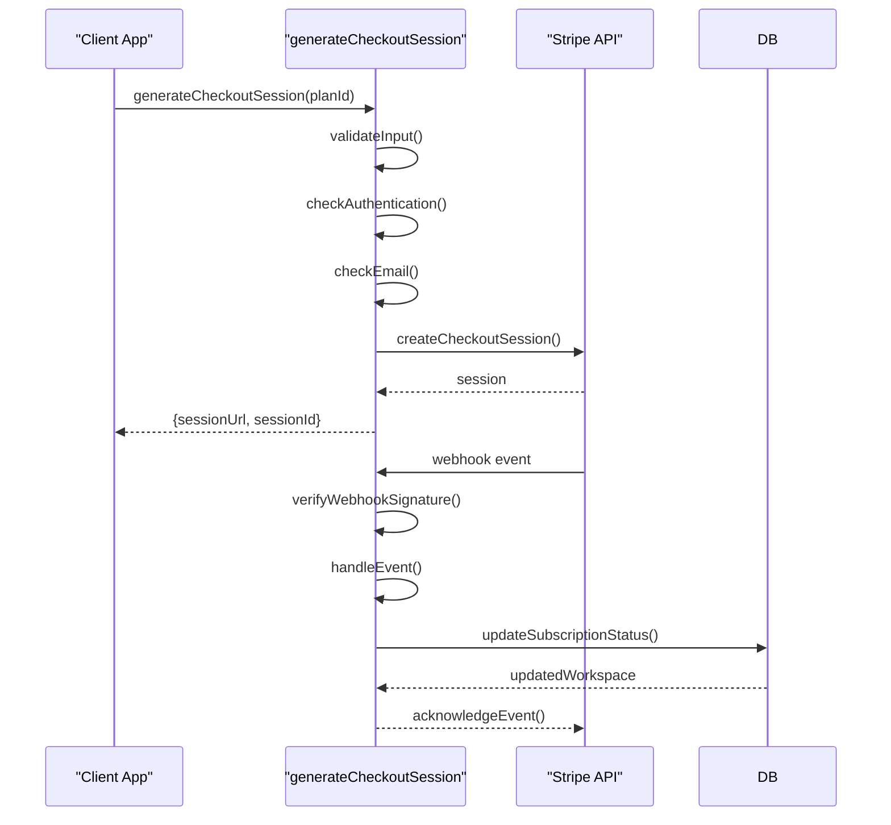
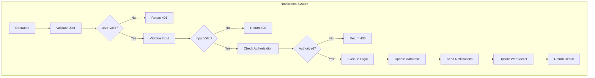

# Cross-Cutting Operations

<cite>
**Referenced Files in This Document**   
- [workspace/operations.ts](file://src/core/workspace/operations.ts)
- [workspace/services.ts](file://src/core/workspace/services.ts)
- [payment/operations.ts](file://src/core/payment/operations.ts)
- [payment/stripe/paymentDetails.ts](file://src/core/payment/stripe/paymentDetails.ts)
- [user/operations.ts](file://src/core/user/operations.ts)
- [auth/twoFactorOperations.ts](file://src/core/auth/twoFactorOperations.ts)
- [audit/operations.ts](file://src/core/audit/operations.ts)
- [notifications/operations.ts](file://src/core/notifications/operations.ts)
- [jobs/operations.ts](file://src/core/jobs/operations.ts)
- [server/validation.ts](file://src/server/validation.ts)
- [server/requestContext.ts](file://src/server/requestContext.ts)
- [shared/validation/workspace.ts](file://src/shared/validation/workspace.ts)
- [email/service.ts](file://src/core/email/service.ts)
</cite>

## Table of Contents
1. [Introduction](#introduction)
2. [Core Cross-Cutting Operations](#core-cross-cutting-operations)
3. [Common Implementation Patterns](#common-implementation-patterns)
4. [User Management Operations](#user-management-operations)
5. [Workspace Operations](#workspace-operations)
6. [Authentication Workflows](#authentication-workflows)
7. [Payment Processing](#payment-processing)
8. [Audit and Notification Systems](#audit-and-notification-systems)
9. [Error Handling and Validation](#error-handling-and-validation)
10. [Guidelines for New Cross-Cutting Features](#guidelines-for-new-cross-cutting-features)

## Introduction
This document provides comprehensive documentation for the cross-cutting business logic operations in the SentinelIQ application. These operations span multiple domains and provide shared functionality across the system, including user management, workspace operations, authentication workflows, and payment processing. The document explains how these operations maintain consistency across the application while adhering to established architectural patterns, with concrete examples from user onboarding, workspace creation, and subscription management workflows.

**Section sources**
- [workspace/operations.ts](file://src/core/workspace/operations.ts#L1-L1484)
- [payment/operations.ts](file://src/core/payment/operations.ts#L1-L120)

## Core Cross-Cutting Operations
The application implements a comprehensive set of cross-cutting operations that provide shared functionality across multiple domains. These operations follow consistent patterns for authentication, authorization, validation, and error handling. The core cross-cutting operations include user management, workspace operations, authentication workflows, payment processing, audit logging, and notification systems. Each operation is designed to maintain data consistency, handle multi-tenancy, and integrate with external services while following the same architectural patterns as domain-specific modules.

The operations are organized in the `src/core` directory, with each major functionality area having its own subdirectory containing operations, services, and types. This structure promotes separation of concerns and makes it easier to maintain and extend the cross-cutting functionality. The operations are accessible through Wasp's query and action system, providing a consistent API for both server-side and client-side code.

**Section sources**
- [workspace/operations.ts](file://src/core/workspace/operations.ts#L1-L1484)
- [user/operations.ts](file://src/core/user/operations.ts#L1-L104)
- [payment/operations.ts](file://src/core/payment/operations.ts#L1-L120)

## Common Implementation Patterns
The cross-cutting operations follow several common patterns that ensure consistency, security, and maintainability across the application. These patterns include context validation, error handling with HttpError, transaction management, input validation with Zod, and multi-tenancy support.

### Context Validation
All operations begin with context validation to ensure the user is authenticated and authorized to perform the requested action. This pattern is consistently applied across all operations, with unauthorized users receiving a 401 status code and unauthorized users receiving a 403 status code.

### Error Handling with HttpError
The application uses a consistent error handling pattern with HttpError, which provides standardized error responses with appropriate status codes and messages. This ensures that clients receive consistent error information regardless of which operation fails.

### Input Validation
Input validation is performed using Zod schemas, which are defined for each operation's input parameters. The `ensureArgsSchemaOrThrowHttpError` helper function is used to validate inputs and throw appropriate HttpError instances when validation fails.

**Diagram sources**
- [server/validation.ts](file://src/server/validation.ts#L1-L16)
- [workspace/operations.ts](file://src/core/workspace/operations.ts#L1-L1484)

**Section sources**
- [server/validation.ts](file://src/server/validation.ts#L1-L16)
- [workspace/operations.ts](file://src/core/workspace/operations.ts#L1-L1484)

## User Management Operations
The user management operations provide functionality for managing users across the application, including creating, updating, and retrieving user information. These operations follow the common patterns for authentication, authorization, and validation described earlier.

The user management operations are located in `src/core/user/operations.ts` and include functions for updating user admin status and retrieving paginated lists of users. These operations require administrative privileges, ensuring that only authorized users can modify user roles or view user lists.

The operations include comprehensive validation of input parameters using Zod schemas, with appropriate error messages returned when validation fails. The operations also check the authentication status of the requesting user and verify that they have the necessary administrative privileges before proceeding.

**Section sources**
- [user/operations.ts](file://src/core/user/operations.ts#L1-L104)

## Workspace Operations
The workspace operations provide comprehensive functionality for managing workspaces, including creating, updating, deleting, and transferring ownership of workspaces. These operations are central to the multi-tenancy model of the application and ensure that users can only access workspaces they are authorized to use.

The workspace operations are located in `src/core/workspace/operations.ts` and `src/core/workspace/services.ts`. The operations include functions for creating workspaces, updating workspace details, inviting members, removing members, transferring ownership, and managing workspace quotas.

### Workspace Creation
The workspace creation process includes several important steps to ensure data integrity and prevent race conditions. When a user creates a workspace, the operation generates a unique slug based on the workspace name, checks for uniqueness, and falls back to a UUID if necessary. The operation also checks rate limits and workspace quotas before creating the workspace.

**Diagram sources**
- [workspace/operations.ts](file://src/core/workspace/operations.ts#L232-L311)
- [workspace/services.ts](file://src/core/workspace/services.ts#L1-L42)

### Workspace Ownership Transfer
The workspace ownership transfer operation includes a confirmation step to prevent accidental transfers. When a user initiates a transfer, the system creates a confirmation token with a 24-hour expiration and sends a confirmation email to the new owner. The transfer is only completed when the new owner confirms it using the token.

This process prevents race conditions and ensures that ownership transfers are intentional. The operation also includes rate limiting to prevent abuse and comprehensive logging to track ownership changes for audit purposes.

**Section sources**
- [workspace/operations.ts](file://src/core/workspace/operations.ts#L232-L800)
- [workspace/services.ts](file://src/core/workspace/services.ts#L1-L42)

## Authentication Workflows
The authentication workflows in the application provide secure user authentication with support for two-factor authentication (2FA) and refresh tokens. These workflows follow the common patterns for validation and error handling while providing additional security features.

The authentication operations are located in `src/core/auth/twoFactorOperations.ts` and include functions for enabling and disabling 2FA, verifying 2FA tokens, and generating backup codes. These operations require the user to be authenticated and include additional validation steps to ensure the security of the authentication process.

The 2FA implementation uses time-based one-time passwords (TOTP) and provides backup codes for recovery. When a user enables 2FA, the system generates a secret key and QR code for use with authenticator apps, along with backup codes that can be used if the user loses access to their authenticator.

**Diagram sources**
- [auth/twoFactorOperations.ts](file://src/core/auth/twoFactorOperations.ts#L25-L101)
- [auth/twoFactorOperations.ts](file://src/core/auth/twoFactorOperations.ts#L66-L101)

**Section sources**
- [auth/twoFactorOperations.ts](file://src/core/auth/twoFactorOperations.ts#L1-L186)

## Payment Processing
The payment processing operations provide integration with Stripe for handling subscriptions, payments, and billing. These operations follow the common patterns for validation and error handling while managing the complexities of payment processing and subscription management.

The payment operations are located in `src/core/payment/operations.ts` and `src/core/payment/stripe/paymentDetails.ts`. The operations include functions for generating checkout sessions, retrieving customer portal URLs, and fetching invoice history from Stripe.

### Subscription Management
The subscription management workflow integrates with Stripe to handle subscription creation, updates, and cancellations. When a user selects a payment plan, the system creates a Stripe checkout session and redirects the user to Stripe's payment page. After payment, Stripe sends a webhook notification to update the user's subscription status in the application.

The operations include comprehensive error handling for payment failures and network issues, with appropriate error messages returned to the user. The system also maintains synchronization between the application's subscription state and Stripe's subscription state to prevent inconsistencies.

**Diagram sources**
- [payment/operations.ts](file://src/core/payment/operations.ts#L18-L46)
- [payment/stripe/paymentDetails.ts](file://src/core/payment/stripe/paymentDetails.ts#L1-L27)

**Section sources**
- [payment/operations.ts](file://src/core/payment/operations.ts#L1-L120)
- [payment/stripe/paymentDetails.ts](file://src/core/payment/stripe/paymentDetails.ts#L1-L27)

## Audit and Notification Systems
The audit and notification systems provide comprehensive logging and notification functionality across the application. These systems follow the common patterns for validation and error handling while providing additional features for monitoring and alerting.

### Audit Logging
The audit logging operations are located in `src/core/audit/operations.ts` and provide functionality for retrieving and exporting audit logs. These operations require appropriate permissions, with only workspace owners and administrators able to export logs.

The audit system uses an event bus pattern to emit audit events from various operations throughout the application. These events are then stored in the database and can be queried or exported as needed. The system includes comprehensive metadata with each audit log entry, including the user, workspace, action, resource, and request context.

### Notification System
The notification system is located in `src/core/notifications/operations.ts` and provides functionality for managing notifications, notification preferences, and notification providers. The system supports multiple notification channels, including email, Slack, Discord, and webhooks.

The notification operations include functions for retrieving notifications, marking notifications as read, managing notification providers, and updating notification preferences. The system also supports push notifications through service workers and WebSocket connections for real-time updates.

**Diagram sources**
- [audit/operations.ts](file://src/core/audit/operations.ts#L7-L215)
- [notifications/operations.ts](file://src/core/notifications/operations.ts#L74-L132)

**Section sources**
- [audit/operations.ts](file://src/core/audit/operations.ts#L7-L215)
- [notifications/operations.ts](file://src/core/notifications/operations.ts#L1-L753)

## Error Handling and Validation
The application implements a comprehensive error handling and validation system that ensures consistent behavior across all operations. This system is built on several key components that work together to provide robust error handling and input validation.

### HttpError Usage
The application uses HttpError consistently across all operations to provide standardized error responses. Each HttpError includes a status code, message, and optional data. The common status codes used are:
- 400: Bad Request (validation errors)
- 401: Unauthorized (authentication required)
- 403: Forbidden (insufficient permissions)
- 404: Not Found (resource not found)
- 500: Internal Server Error (unexpected errors)

### Input Validation with Zod
Input validation is performed using Zod schemas, which are defined for each operation's input parameters. The `ensureArgsSchemaOrThrowHttpError` function is used to validate inputs and automatically throw appropriate HttpError instances when validation fails.

The validation schemas are defined in both the operations files and shared validation files, allowing for reuse between server and client code. This ensures that validation rules are consistent across the application and reduces the risk of validation-related bugs.

### Request Context
The application extracts request context, including IP address and user agent, for use in audit logging and security monitoring. This context is extracted using the `extractRequestContext` function from `src/server/requestContext.ts`, which handles various proxy headers to ensure accurate IP address detection.

**Section sources**
- [server/validation.ts](file://src/server/validation.ts#L1-L16)
- [server/requestContext.ts](file://src/server/requestContext.ts#L1-L56)
- [shared/validation/workspace.ts](file://src/shared/validation/workspace.ts#L1-L50)

## Guidelines for New Cross-Cutting Features
When implementing new cross-cutting features, follow these guidelines to ensure consistency with the existing patterns and architecture:

### Separation of Concerns
Maintain clear separation between operations, services, and types. Operations should handle authentication, authorization, and input validation, while services should contain pure business logic. Types should be defined in separate files for reuse across the application.

### Consistent Error Handling
Use HttpError consistently for all error conditions, with appropriate status codes and messages. Never throw raw exceptions or return error objects directly. Always provide meaningful error messages that can help users understand and resolve issues.

### Comprehensive Validation
Validate all input parameters using Zod schemas, and use the `ensureArgsSchemaOrThrowHttpError` helper function to perform validation. Define validation schemas in shared files when possible to enable reuse between server and client code.

### Multi-Tenancy Support
Ensure all operations support multi-tenancy by verifying workspace membership before accessing data. Use the workspace ID as a parameter to all operations that access workspace-specific data, and include workspace filters in all database queries.

### Audit Logging
Include audit logging for all significant operations, especially those that modify data or change system state. Use the audit event bus pattern to emit events that can be stored and queried later.

### Testing
Write comprehensive tests for all new operations, including positive and negative test cases. Test authentication, authorization, validation, and error handling scenarios to ensure robustness.

**Section sources**
- [workspace/operations.ts](file://src/core/workspace/operations.ts#L1-L1484)
- [server/validation.ts](file://src/server/validation.ts#L1-L16)
- [shared/validation/workspace.ts](file://src/shared/validation/workspace.ts#L1-L50)
- [email/service.ts](file://src/core/email/service.ts#L1-L265)