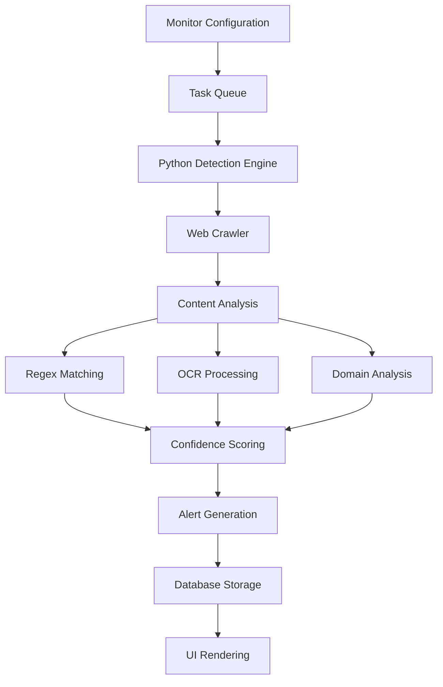
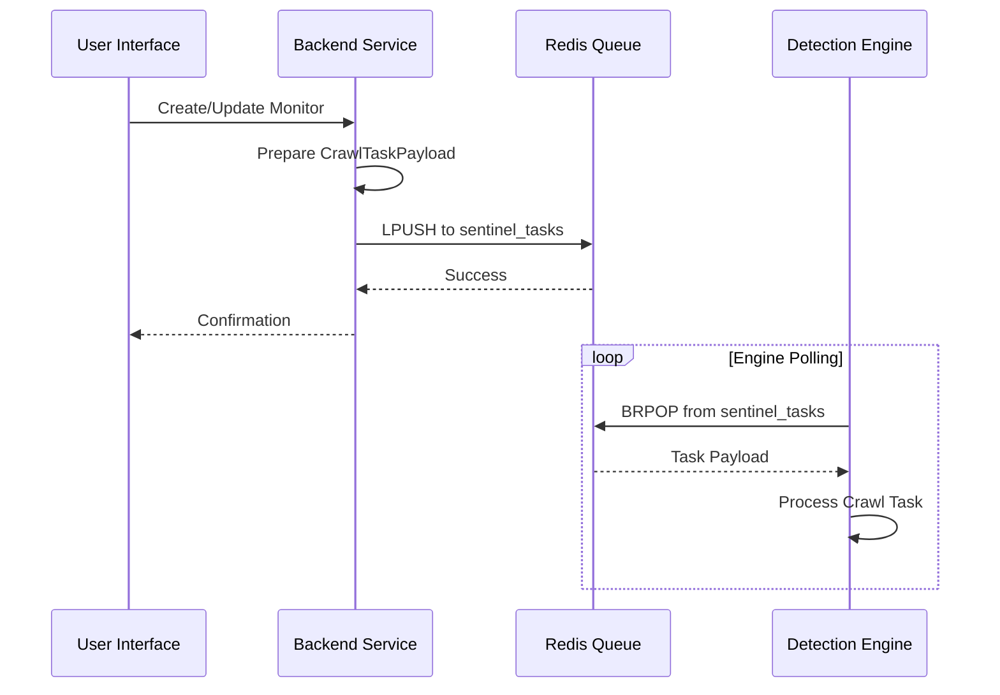
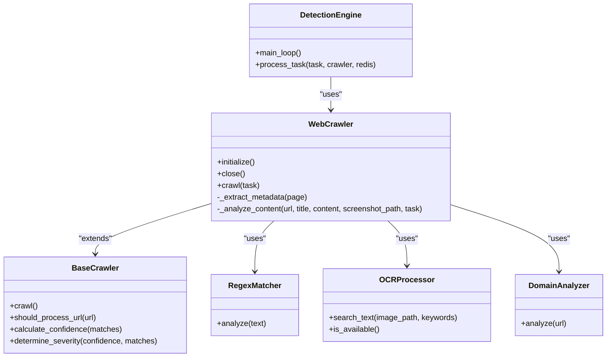
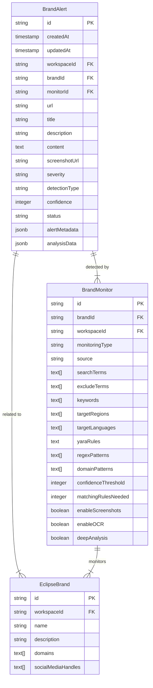

# Detections Operations

<cite>
**Referenced Files in This Document**   
- [DetectionsListPage.tsx](file://src/client/pages/modules/eclipse/detections/DetectionsListPage.tsx)
- [operations.ts](file://src/core/modules/eclipse/detections/operations.ts)
- [types.ts](file://src/core/modules/eclipse/types.ts)
- [main.py](file://services/engine/main.py)
- [config.py](file://services/engine/config.py)
- [base_crawler.py](file://services/engine/crawlers/base_crawler.py)
- [web_crawler.py](file://services/engine/crawlers/web_crawler.py)
- [regex_matcher.py](file://services/engine/analyzers/regex_matcher.py)
- [ocr_processor.py](file://services/engine/analyzers/ocr_processor.py)
- [yara_analyzer.py](file://services/engine/analyzers/yara_analyzer.py)
- [producer.ts](file://src/core/modules/eclipse/queue/producer.ts)
- [migration.sql](file://migrations/20251118015752_add_eclipse_module/migration.sql)
- [migration.sql](file://migrations/20251120025530_add_eclipse_complete/migration.sql)
</cite>

## Table of Contents
1. [Introduction](#introduction)
2. [Detection Workflow Overview](#detection-workflow-overview)
3. [Data Ingestion and Task Queuing](#data-ingestion-and-task-queuing)
4. [Detection Analysis Engine](#detection-analysis-engine)
5. [Detection Scoring and Severity Classification](#detection-scoring-and-severity-classification)
6. [Alert Generation and Storage](#alert-generation-and-storage)
7. [UI Integration and Data Rendering](#ui-integration-and-data-rendering)
8. [Performance Considerations](#performance-considerations)
9. [Extensibility and Rule Management](#extensibility-and-rule-management)
10. [Conclusion](#conclusion)

## Introduction

The Detections sub-module within the Eclipse module is responsible for identifying potential brand infringements by analyzing digital asset data across various sources. This system processes data through a sophisticated pipeline that combines multiple detection techniques including OCR, regex matching, and YARA rule evaluation to identify potential threats. The detection system is designed to handle both batch and real-time processing of high-volume data while maintaining accuracy and performance.

The core objective of this documentation is to provide a comprehensive understanding of how detection operations process and analyze digital asset data to identify brand infringements. This includes the complete workflow from data ingestion through analysis to alert generation, integration with the Python-based engine for various detection methods, storage mechanisms, and UI rendering components.

**Section sources**
- [DetectionsListPage.tsx](file://src/client/pages/modules/eclipse/detections/DetectionsListPage.tsx)
- [operations.ts](file://src/core/modules/eclipse/detections/operations.ts)

## Detection Workflow Overview

The detection workflow follows a structured process that begins with task creation and ends with alert visualization in the user interface. The system operates on a producer-consumer architecture where monitoring tasks are created and queued for processing by the Python-based detection engine.

The workflow consists of several key stages:
1. **Task Creation**: Brand monitoring configurations are converted into crawl tasks
2. **Queue Processing**: Tasks are consumed from Redis by the Python engine
3. **Content Crawling**: Web pages are crawled and captured using Playwright
4. **Multi-Modal Analysis**: Content is analyzed using regex, OCR, and domain analysis
5. **Confidence Scoring**: Detection confidence is calculated based on multiple factors
6. **Alert Generation**: Valid detections are stored as alerts in the database
7. **UI Rendering**: Alerts are retrieved and displayed in the DetectionsListPage

This workflow enables the system to systematically identify potential brand infringements across various digital channels while minimizing false positives through multi-factor validation.

**Diagram sources**
- [main.py](file://services/engine/main.py)
- [web_crawler.py](file://services/engine/crawlers/web_crawler.py)
- [producer.ts](file://src/core/modules/eclipse/queue/producer.ts)

## Data Ingestion and Task Queuing

The detection process begins with data ingestion through the task queuing system, which uses Redis as a message broker to manage monitoring tasks. The system supports both individual and bulk task enqueueing through the queue producer component.

When a brand monitoring configuration is created or updated, it is converted into a structured payload containing all necessary parameters for detection. This payload includes search terms, exclusion criteria, geographic targeting, detection rules (regex patterns, YARA rules, domain patterns), and execution options such as screenshot capture and OCR processing.

The task queuing system is implemented in the producer.ts file, which provides methods for enqueuing single or multiple monitoring tasks. Each task is serialized as JSON and pushed to the Redis queue named 'sentinel_tasks'. The system also provides utility functions for monitoring queue statistics, clearing the queue, and checking Redis connection health.

For batch processing, the system can enqueue multiple monitoring tasks simultaneously using Redis pipelining, which improves performance by reducing network round-trips. Real-time processing is supported by immediately enqueuing tasks when monitoring configurations are updated, ensuring timely detection of potential infringements.

**Diagram sources**
- [producer.ts](file://src/core/modules/eclipse/queue/producer.ts)
- [main.py](file://services/engine/main.py)

## Detection Analysis Engine

The detection analysis engine is implemented in Python and runs as a separate service from the main application. This engine is responsible for executing the actual detection operations and is designed to handle computationally intensive tasks such as web crawling, screenshot capture, and OCR processing.

The engine architecture follows a modular design with specialized components for different aspects of the detection process. The main.py file contains the core consumer loop that continuously polls the Redis queue for new tasks. When a task is received, it is processed by the WebCrawler component, which uses Playwright to navigate to the target URL, capture content, and take screenshots.

The analysis engine integrates multiple detection techniques:
- **Web Crawling**: Using Playwright for browser automation and content extraction
- **Regex Matching**: Pattern matching against page content and metadata
- **OCR Processing**: Text extraction from screenshots to detect visual brand representations
- **Domain Analysis**: Evaluation of domain characteristics for potential infringement

The engine is configured through environment variables defined in config.py, allowing for flexible deployment across different environments. Configuration options include Redis connection details, database URLs, crawler timeouts, maximum concurrent crawls, and OCR language settings. The system also integrates with Sentry for error monitoring and ELK stack for centralized logging.

**Diagram sources**
- [main.py](file://services/engine/main.py)
- [web_crawler.py](file://services/engine/crawlers/web_crawler.py)
- [base_crawler.py](file://services/engine/crawlers/base_crawler.py)
- [regex_matcher.py](file://services/engine/analyzers/regex_matcher.py)
- [ocr_processor.py](file://services/engine/analyzers/ocr_processor.py)
- [domain_analyzer.py](file://services/engine/analyzers/domain_analyzer.py)

## Detection Scoring and Severity Classification

The detection system employs a sophisticated scoring mechanism to evaluate the confidence level of potential brand infringements and classify their severity. This multi-factor scoring approach helps minimize false positives while ensuring critical threats are properly prioritized.

The confidence scoring algorithm, implemented in the calculate_confidence method of the BaseCrawler class, evaluates multiple detection signals and assigns weighted scores based on their reliability. The scoring system considers four primary factors:

1. **Regex Matches**: +40 points for any regex pattern matches in content or title
2. **YARA Matches**: +15 points for YARA rule matches (bonus detection)
3. **Domain Pattern Matches**: +10 points for domain pattern matches
4. **OCR Confirmation**: +40 points for OCR-confirmed keyword matches

A critical feature of the scoring system is the perfect match bonus (+20 points) awarded when both regex and OCR confirm the same detection. This cross-validation mechanism significantly reduces false positives by requiring multiple independent detection methods to agree on a potential infringement.

Severity classification is determined based on the final confidence score and the combination of detection methods:
- **Critical**: Confidence ≥ 90 with YARA matches
- **High**: Confidence ≥ 75 with multiple match types
- **Medium**: Confidence ≥ 50
- **Low**: Below confidence threshold

The system also considers the matching rules needed parameter from the monitor configuration, which specifies how many detection rules must be satisfied for a valid alert. This allows organizations to configure their sensitivity levels based on their risk tolerance.

**Section sources**
- [base_crawler.py](file://services/engine/crawlers/base_crawler.py)
- [web_crawler.py](file://services/engine/crawlers/web_crawler.py)

## Alert Generation and Storage

When a detection meets the configured confidence threshold, an alert is generated and stored in the database for further analysis and action. The alert generation process occurs in the main.py file within the process_task function, where successful crawl results are evaluated against the monitor's confidence threshold.

The system creates BrandAlert records in the database with comprehensive information about the detection, including:
- URL and title of the detected content
- Screenshot (stored in S3/MinIO with local fallback)
- Detection confidence score (0-100)
- Severity classification
- Detailed analysis data with specific matches
- Metadata about the detection context

Screenshots are uploaded to object storage (S3/MinIO) using the S3Client, with configuration parameters defined in config.py. If the upload fails, the system falls back to storing the local path. After successful upload, local screenshot files are deleted to conserve disk space.

The database schema, defined in the migration files, includes optimized indexes on key fields such as workspaceId, severity, status, and detectionType to ensure fast querying of alert data. The BrandAlert table is designed to support efficient filtering and sorting operations required by the user interface.

**Diagram sources**
- [main.py](file://services/engine/main.py)
- [migration.sql](file://migrations/20251120025530_add_eclipse_complete/migration.sql)

## UI Integration and Data Rendering

The detection results are made available to users through the DetectionsListPage component, which retrieves and displays alerts in a user-friendly interface. The UI integration follows a clean architecture with well-defined data flow from the backend to the frontend.

The DetectionsListPage component uses the getWorkspaceAlerts query operation to retrieve detection data from the backend. This operation, defined in operations.ts, fetches all alerts for the user's workspaces with appropriate authorization checks. The component implements client-side filtering by status and severity, allowing users to focus on specific types of detections.

The user interface displays key information for each detection, including:
- Title and description of the detected content
- Severity and status badges with color coding
- Confidence score and creation date
- Source URL with hostname extraction
- Quick access to view detailed information

The component handles loading states, errors, and empty results gracefully, providing appropriate visual feedback to users. When no detections are found, a clear message is displayed with an icon to maintain visual consistency.

The data flow from backend to UI follows a standardized pattern:
1. Backend operations retrieve data from the database
2. Data is transmitted via API endpoints
3. Frontend queries fetch data using Wasp client operations
4. React components render data with appropriate styling and interactivity

**Section sources**
- [DetectionsListPage.tsx](file://src/client/pages/modules/eclipse/detections/DetectionsListPage.tsx)
- [operations.ts](file://src/core/modules/eclipse/detections/operations.ts)

## Performance Considerations

The detection system is designed with performance optimization in mind to handle high-volume detection data efficiently. Several strategies are employed to ensure optimal performance across different aspects of the system.

For database operations, the system implements comprehensive indexing on frequently queried fields such as workspaceId, severity, status, and detectionType. These indexes enable fast filtering and sorting operations, which are critical for the user interface's performance when dealing with large datasets.

The detection engine is configured for optimal resource utilization through several parameters:
- **MAX_CONCURRENT_CRAWLS**: Limits parallel browser instances to prevent resource exhaustion
- **CRAWLER_TIMEOUT**: Prevents individual tasks from hanging indefinitely
- **REDIS_POLL_INTERVAL**: Balances responsiveness with resource usage
- **LOG_RETENTION_DAYS**: Manages log volume to prevent disk space issues

Query performance is optimized through the use of efficient database queries with appropriate filtering and pagination. The getWorkspaceAlerts operation limits results to the most recent 100 alerts by default, preventing performance degradation with large datasets. The system could be extended to support cursor-based pagination for handling very large result sets.

For batch vs real-time processing, the system supports both modes:
- **Real-time**: Tasks are enqueued immediately when monitors are updated
- **Batch**: Multiple tasks can be enqueued simultaneously using bulk operations

The Redis-based queuing system provides reliable message delivery and can handle temporary spikes in workload by buffering tasks until the detection engine can process them. This decoupling between task creation and processing ensures that the main application remains responsive even under heavy detection loads.

**Section sources**
- [config.py](file://services/engine/config.py)
- [operations.ts](file://src/core/modules/eclipse/detections/operations.ts)
- [producer.ts](file://src/core/modules/eclipse/queue/producer.ts)

## Extensibility and Rule Management

The detection system is designed to be extensible, allowing for the integration of new analyzers and detection rules while maintaining system stability and accuracy. The modular architecture facilitates the addition of new detection capabilities without disrupting existing functionality.

The system supports multiple rule types through its flexible configuration:
- **Regex Patterns**: Regular expressions for text pattern matching
- **YARA Rules**: Advanced pattern matching for binary and text data
- **Domain Patterns**: Rules for identifying suspicious domain characteristics
- **OCR Keywords**: Terms to search for in visual content

New analyzers can be integrated by creating classes that follow the analyzer interface pattern and registering them in the system. The __init__.py file in the analyzers directory demonstrates this approach by importing and exposing analyzer classes.

Rule management is handled through the BrandMonitor configuration, which allows users to specify different rule types for each monitoring configuration. The system validates rules at runtime and handles errors gracefully, preventing invalid rules from disrupting the entire detection process.

To maintain accuracy when extending the system:
- New analyzers should implement comprehensive error handling
- Confidence scoring algorithms should be updated to account for new detection methods
- Performance impact should be evaluated before deployment
- Thorough testing should be conducted with both positive and negative test cases

The system's configuration through environment variables allows for safe experimentation with new features in staging environments before production deployment. This enables organizations to fine-tune detection parameters and evaluate new analyzers without affecting their production monitoring.

**Section sources**
- [types.ts](file://src/core/modules/eclipse/types.ts)
- [analyzers/__init__.py](file://services/engine/analyzers/__init__.py)
- [config.py](file://services/engine/config.py)

## Conclusion

The Detections sub-module in the Eclipse module provides a comprehensive solution for identifying brand infringements through a sophisticated multi-modal analysis system. By combining web crawling, regex matching, OCR processing, and domain analysis, the system delivers accurate detection capabilities with minimal false positives.

The architecture follows a clean separation of concerns, with the frontend handling user interaction and visualization, while the Python-based engine manages computationally intensive detection tasks. The Redis-based queuing system enables reliable message delivery and supports both real-time and batch processing workflows.

Key strengths of the system include its configurable confidence scoring, which reduces false positives through cross-validation, and its extensible architecture that allows for the integration of new detection methods. The comprehensive database schema and optimized indexing ensure efficient storage and retrieval of detection data, even at scale.

For optimal performance, organizations should carefully configure their monitoring parameters, including confidence thresholds and matching rules, to balance sensitivity with accuracy. Regular review of detection results and refinement of detection rules will help maintain the system's effectiveness over time.

The system provides a solid foundation for brand protection that can be extended with additional analyzers and integrated with external threat intelligence sources to enhance its detection capabilities further.