# Eclipse Module Operations

<cite>
**Referenced Files in This Document**
- [operations.ts](file://src/core/modules/eclipse/operations.ts)
- [detections/operations.ts](file://src/core/modules/eclipse/detections/operations.ts)
- [validation.ts](file://src/core/modules/eclipse/validation.ts)
- [types.ts](file://src/core/modules/eclipse/types.ts)
- [permissions.ts](file://src/core/modules/eclipse/utils/permissions.ts)
- [audit.ts](file://src/core/modules/eclipse/utils/audit.ts)
- [notifications.ts](file://src/core/modules/eclipse/utils/notifications.ts)
- [producer.ts](file://src/core/modules/eclipse/queue/producer.ts)
- [aegis.ts](file://src/core/modules/eclipse/integrations/aegis.ts)
- [export.ts](file://src/core/modules/eclipse/export.ts)
</cite>

## Table of Contents
1. [Introduction](#introduction)
2. [Project Structure](#project-structure)
3. [Core Components](#core-components)
4. [Architecture Overview](#architecture-overview)
5. [Detailed Component Analysis](#detailed-component-analysis)
6. [Dependency Analysis](#dependency-analysis)
7. [Performance Considerations](#performance-considerations)
8. [Troubleshooting Guide](#troubleshooting-guide)
9. [Conclusion](#conclusion)
10. [Appendices](#appendices)

## Introduction
This document explains the Eclipse module’s business logic operations that power brand protection and infringement detection workflows. It covers how operations orchestrate monitoring of digital assets, validate detection rules, manage brand portfolios, and enforce workspace-level permissions. It also documents detection analysis and export workflows, including handling large datasets, performance characteristics, and data integrity guarantees. Finally, it outlines validation patterns, export functionality, permission enforcement, and guidelines for extending detection capabilities or adding new operations.

## Project Structure
The Eclipse module is organized around cohesive operation files grouped by domain:
- Brand portfolio management (brands, monitors)
- Detection and alerting (alerts)
- Infringement lifecycle (infringements)
- Action tracking (actions)
- Integrations (Aegis incident escalation)
- Queue orchestration (monitoring tasks)
- Export/import utilities
- Shared validation and types
- Permissions, audit logging, and notifications

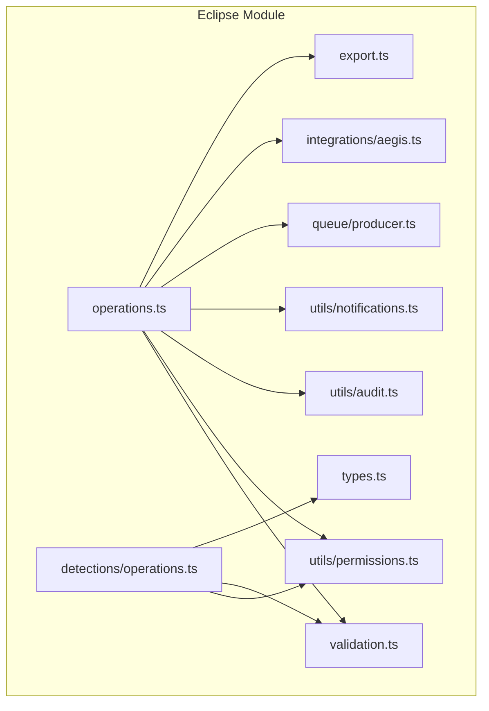

**Diagram sources**
- [operations.ts](file://src/core/modules/eclipse/operations.ts#L1-L2403)
- [detections/operations.ts](file://src/core/modules/eclipse/detections/operations.ts#L1-L183)
- [validation.ts](file://src/core/modules/eclipse/validation.ts#L1-L193)
- [types.ts](file://src/core/modules/eclipse/types.ts#L1-L395)
- [permissions.ts](file://src/core/modules/eclipse/utils/permissions.ts#L1-L60)
- [audit.ts](file://src/core/modules/eclipse/utils/audit.ts#L1-L203)
- [notifications.ts](file://src/core/modules/eclipse/utils/notifications.ts#L1-L166)
- [producer.ts](file://src/core/modules/eclipse/queue/producer.ts#L1-L142)
- [aegis.ts](file://src/core/modules/eclipse/integrations/aegis.ts#L1-L251)
- [export.ts](file://src/core/modules/eclipse/export.ts#L1-L409)

**Section sources**
- [operations.ts](file://src/core/modules/eclipse/operations.ts#L1-L2403)
- [detections/operations.ts](file://src/core/modules/eclipse/detections/operations.ts#L1-L183)
- [validation.ts](file://src/core/modules/eclipse/validation.ts#L1-L193)
- [types.ts](file://src/core/modules/eclipse/types.ts#L1-L395)
- [permissions.ts](file://src/core/modules/eclipse/utils/permissions.ts#L1-L60)
- [audit.ts](file://src/core/modules/eclipse/utils/audit.ts#L1-L203)
- [notifications.ts](file://src/core/modules/eclipse/utils/notifications.ts#L1-L166)
- [producer.ts](file://src/core/modules/eclipse/queue/producer.ts#L1-L142)
- [aegis.ts](file://src/core/modules/eclipse/integrations/aegis.ts#L1-L251)
- [export.ts](file://src/core/modules/eclipse/export.ts#L1-L409)

## Core Components
- Brand operations: CRUD for brands, filtering, pagination, and stats.
- Monitor operations: CRUD for monitors, testing, and automated scheduling.
- Alert operations: CRUD for alerts, acknowledgment, and escalation to infringements.
- Infringement operations: CRUD for infringements, status updates, and Aegis integration.
- Action operations: CRUD for actions associated with infringements.
- Detection utilities: workspace-scoped alert retrieval and filtering.
- Export/import: CSV/JSON exports, report generation, and bulk brand import.
- Validation: Zod schemas for inputs and filters.
- Permissions: workspace membership checks and role-based access.
- Audit and notifications: audit logs and real-time notifications.
- Queue producer: Redis-based task enqueuing for monitoring.

**Section sources**
- [operations.ts](file://src/core/modules/eclipse/operations.ts#L80-L200)
- [operations.ts](file://src/core/modules/eclipse/operations.ts#L312-L464)
- [operations.ts](file://src/core/modules/eclipse/operations.ts#L583-L711)
- [operations.ts](file://src/core/modules/eclipse/operations.ts#L849-L961)
- [operations.ts](file://src/core/modules/eclipse/operations.ts#L1006-L1201)
- [detections/operations.ts](file://src/core/modules/eclipse/detections/operations.ts#L1-L183)
- [export.ts](file://src/core/modules/eclipse/export.ts#L1-L409)
- [validation.ts](file://src/core/modules/eclipse/validation.ts#L1-L193)
- [permissions.ts](file://src/core/modules/eclipse/utils/permissions.ts#L1-L60)
- [audit.ts](file://src/core/modules/eclipse/utils/audit.ts#L1-L203)
- [notifications.ts](file://src/core/modules/eclipse/utils/notifications.ts#L1-L166)
- [producer.ts](file://src/core/modules/eclipse/queue/producer.ts#L1-L142)
- [aegis.ts](file://src/core/modules/eclipse/integrations/aegis.ts#L1-L251)

## Architecture Overview
The operations layer orchestrates:
- Input validation via Zod schemas
- Workspace-level authorization checks
- Entity persistence and relations
- Event-driven notifications and audit logs
- Integration with external systems (Aegis)
- Background task scheduling via Redis queues

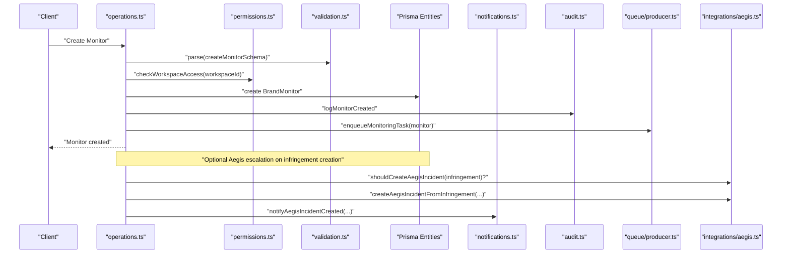

**Diagram sources**
- [operations.ts](file://src/core/modules/eclipse/operations.ts#L427-L464)
- [permissions.ts](file://src/core/modules/eclipse/utils/permissions.ts#L1-L21)
- [validation.ts](file://src/core/modules/eclipse/validation.ts#L31-L50)
- [audit.ts](file://src/core/modules/eclipse/utils/audit.ts#L51-L82)
- [producer.ts](file://src/core/modules/eclipse/queue/producer.ts#L10-L53)
- [aegis.ts](file://src/core/modules/eclipse/integrations/aegis.ts#L16-L31)
- [aegis.ts](file://src/core/modules/eclipse/integrations/aegis.ts#L51-L111)

## Detailed Component Analysis

### Brand Operations
- Filtering and pagination: supports workspace scoping, status/priority filters, date ranges, and free-text search.
- Stats aggregation: counts active brands, unresolved infringements, critical infringements, and action metrics.
- Authorization: OWNER/ADMIN can manage brands; VIEW requires workspace membership.

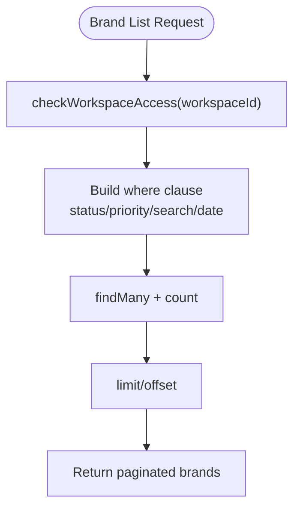

**Diagram sources**
- [operations.ts](file://src/core/modules/eclipse/operations.ts#L80-L149)
- [permissions.ts](file://src/core/modules/eclipse/utils/permissions.ts#L1-L21)

**Section sources**
- [operations.ts](file://src/core/modules/eclipse/operations.ts#L80-L149)
- [operations.ts](file://src/core/modules/eclipse/operations.ts#L1240-L1289)
- [permissions.ts](file://src/core/modules/eclipse/utils/permissions.ts#L23-L32)

### Monitor Operations
- Creation validates monitor configuration and enforces brand ownership.
- Automated monitors enqueue crawl tasks to Redis.
- Testing enqueues a test crawl with a special flag and updates monitor status.

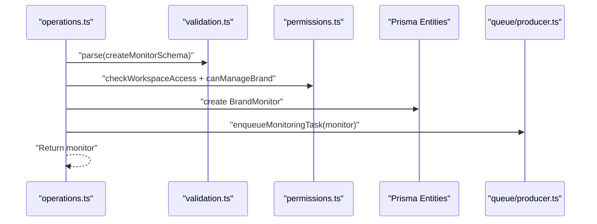

**Diagram sources**
- [operations.ts](file://src/core/modules/eclipse/operations.ts#L427-L464)
- [validation.ts](file://src/core/modules/eclipse/validation.ts#L31-L50)
- [permissions.ts](file://src/core/modules/eclipse/utils/permissions.ts#L23-L32)
- [producer.ts](file://src/core/modules/eclipse/queue/producer.ts#L10-L53)

**Section sources**
- [operations.ts](file://src/core/modules/eclipse/operations.ts#L427-L464)
- [operations.ts](file://src/core/modules/eclipse/operations.ts#L501-L577)
- [producer.ts](file://src/core/modules/eclipse/queue/producer.ts#L10-L53)

### Alert Operations
- Retrieval supports workspace scoping, severity/status filters, date ranges, tags, and regex search.
- Creation validates alert payload, updates monitor metrics, and triggers notifications.
- Acknowledgment sets alert status to acknowledged.

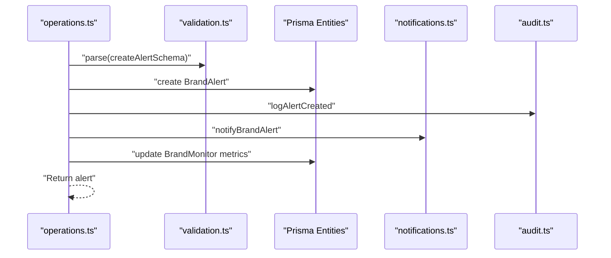

**Diagram sources**
- [operations.ts](file://src/core/modules/eclipse/operations.ts#L671-L711)
- [validation.ts](file://src/core/modules/eclipse/validation.ts#L68-L79)
- [audit.ts](file://src/core/modules/eclipse/utils/audit.ts#L84-L101)
- [notifications.ts](file://src/core/modules/eclipse/utils/notifications.ts#L1-L35)

**Section sources**
- [operations.ts](file://src/core/modules/eclipse/operations.ts#L583-L711)
- [detections/operations.ts](file://src/core/modules/eclipse/detections/operations.ts#L1-L51)

### Infringement Operations
- Creation validates infringement data and triggers notifications.
- Escalation converts alerts to infringements and links them.
- Status updates support resolution and Aegis synchronization.
- Aegis integration: automatic escalation for critical/high threats and mapping to Aegis incidents.

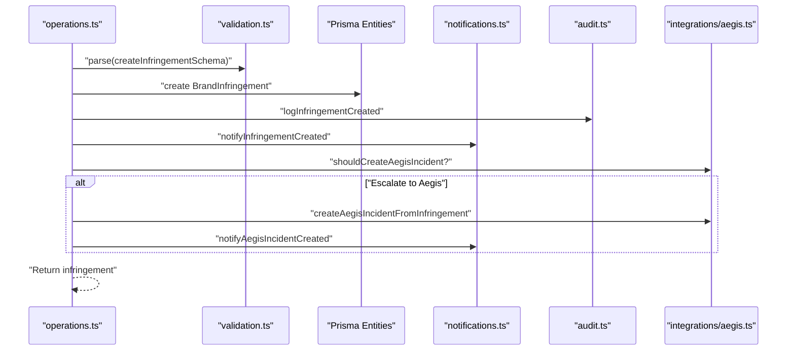

**Diagram sources**
- [operations.ts](file://src/core/modules/eclipse/operations.ts#L849-L961)
- [validation.ts](file://src/core/modules/eclipse/validation.ts#L88-L100)
- [audit.ts](file://src/core/modules/eclipse/utils/audit.ts#L136-L151)
- [notifications.ts](file://src/core/modules/eclipse/utils/notifications.ts#L37-L76)
- [aegis.ts](file://src/core/modules/eclipse/integrations/aegis.ts#L16-L31)
- [aegis.ts](file://src/core/modules/eclipse/integrations/aegis.ts#L51-L111)

**Section sources**
- [operations.ts](file://src/core/modules/eclipse/operations.ts#L849-L961)
- [operations.ts](file://src/core/modules/eclipse/operations.ts#L963-L1000)
- [operations.ts](file://src/core/modules/eclipse/operations.ts#L1534-L1599)
- [operations.ts](file://src/core/modules/eclipse/operations.ts#L1602-L1684)
- [aegis.ts](file://src/core/modules/eclipse/integrations/aegis.ts#L1-L251)

### Action Operations
- Creation validates action inputs and notifies assignees.
- Updates support status transitions and completion timestamps.
- Filtering supports workspace scoping, type/status, priority, dates, tags, and regex.

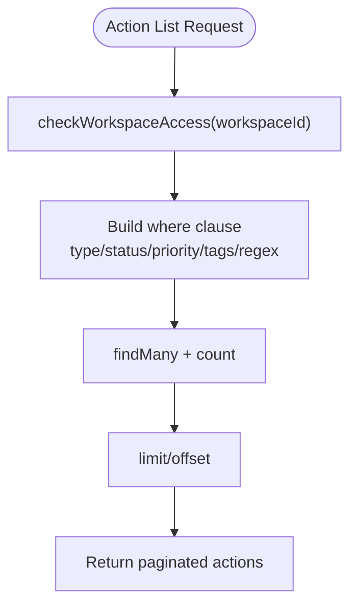

**Diagram sources**
- [operations.ts](file://src/core/modules/eclipse/operations.ts#L1006-L1101)
- [permissions.ts](file://src/core/modules/eclipse/utils/permissions.ts#L1-L21)

**Section sources**
- [operations.ts](file://src/core/modules/eclipse/operations.ts#L1148-L1234)
- [operations.ts](file://src/core/modules/eclipse/operations.ts#L1006-L1101)

### Detection Analysis and Workspace-Level Access
- Workspace-scoped alert retrieval ensures users only access alerts from workspaces they belong to.
- Monitor and alert details enforce workspace membership checks before returning data.

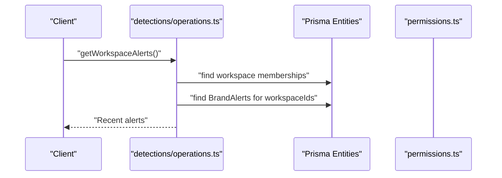

**Diagram sources**
- [detections/operations.ts](file://src/core/modules/eclipse/detections/operations.ts#L1-L51)
- [detections/operations.ts](file://src/core/modules/eclipse/detections/operations.ts#L53-L99)
- [detections/operations.ts](file://src/core/modules/eclipse/detections/operations.ts#L101-L141)

**Section sources**
- [detections/operations.ts](file://src/core/modules/eclipse/detections/operations.ts#L1-L183)

### Export and Reporting Workflows
- Export: CSV/JSON exports for alerts, infringements, and actions with pagination-aware queries.
- Report generation: HTML report builder with summary cards and tables.
- Import: Bulk brand import from CSV with validation and error reporting.

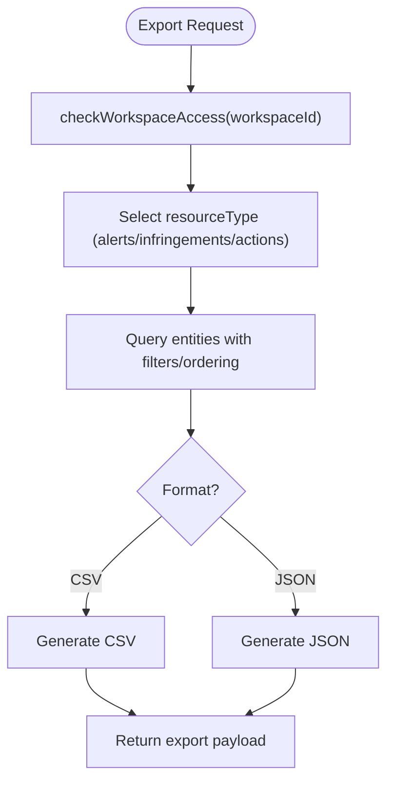

**Diagram sources**
- [operations.ts](file://src/core/modules/eclipse/operations.ts#L1780-L1855)
- [export.ts](file://src/core/modules/eclipse/export.ts#L24-L106)
- [export.ts](file://src/core/modules/eclipse/export.ts#L119-L122)
- [export.ts](file://src/core/modules/eclipse/export.ts#L232-L409)

**Section sources**
- [operations.ts](file://src/core/modules/eclipse/operations.ts#L1780-L1855)
- [export.ts](file://src/core/modules/eclipse/export.ts#L1-L409)

### Validation Patterns
- Zod schemas define strict input contracts for all operations.
- Filters use union types and arrays to support flexible querying.
- Pagination defaults and limits prevent unbounded queries.

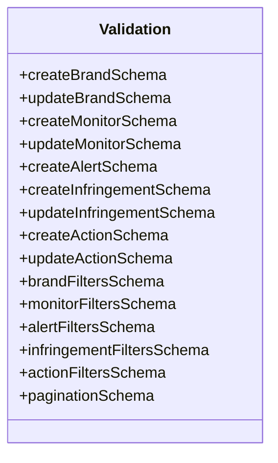

**Diagram sources**
- [validation.ts](file://src/core/modules/eclipse/validation.ts#L1-L193)

**Section sources**
- [validation.ts](file://src/core/modules/eclipse/validation.ts#L1-L193)

### Permission Enforcement
- Workspace membership checks for all operations.
- Role-based access: OWNER/ADMIN can manage brands/monitors/infringements; VIEW requires membership.
- Bulk operations enforce per-item workspace membership.

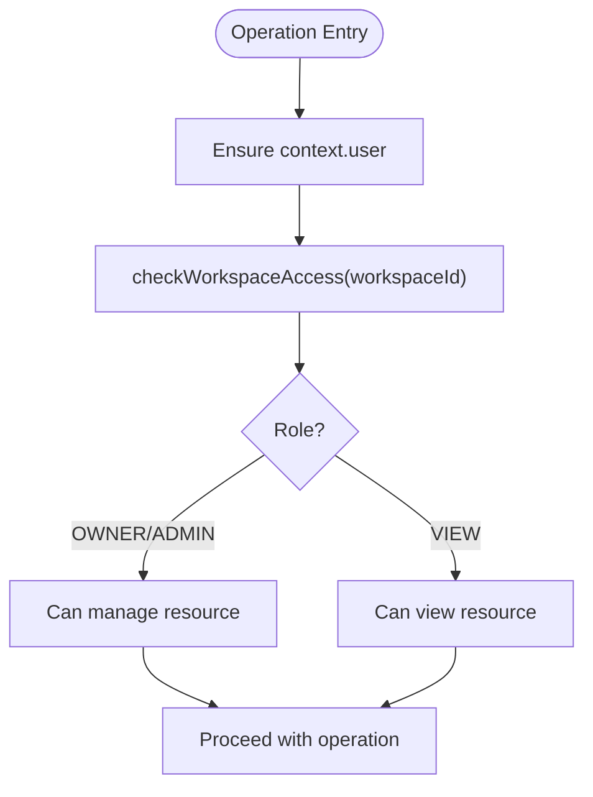

**Diagram sources**
- [permissions.ts](file://src/core/modules/eclipse/utils/permissions.ts#L1-L60)

**Section sources**
- [permissions.ts](file://src/core/modules/eclipse/utils/permissions.ts#L1-L60)
- [operations.ts](file://src/core/modules/eclipse/operations.ts#L2069-L2168)

### Audit Logging and Notifications
- Audit logs capture key lifecycle events for brands, monitors, alerts, infringements, and actions.
- Notifications are created for workspace members and admins for critical events.
- Real-time notifications via WebSocket bus for immediate updates.

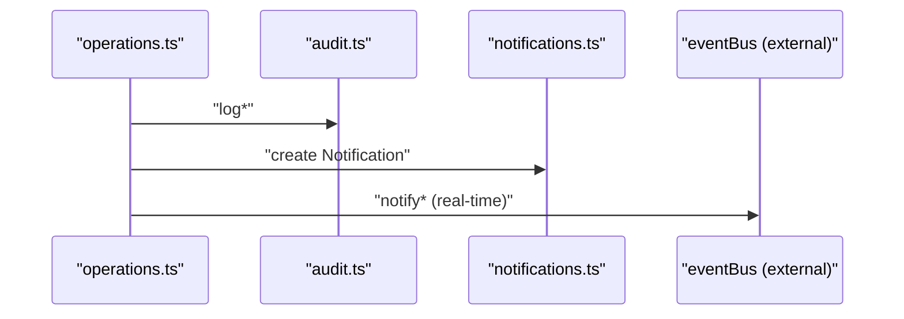

**Diagram sources**
- [audit.ts](file://src/core/modules/eclipse/utils/audit.ts#L1-L203)
- [notifications.ts](file://src/core/modules/eclipse/utils/notifications.ts#L1-L166)
- [operations.ts](file://src/core/modules/eclipse/operations.ts#L219-L226)

**Section sources**
- [audit.ts](file://src/core/modules/eclipse/utils/audit.ts#L1-L203)
- [notifications.ts](file://src/core/modules/eclipse/utils/notifications.ts#L1-L166)

### Queue-Based Monitoring Orchestration
- Enqueue monitoring tasks with structured payloads.
- Bulk enqueue for scaling.
- Queue statistics and health checks.

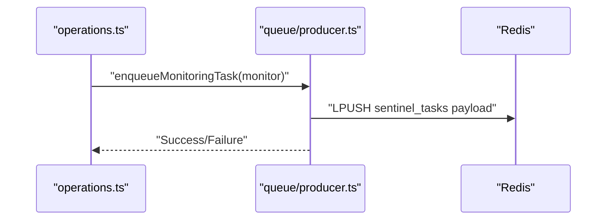

**Diagram sources**
- [producer.ts](file://src/core/modules/eclipse/queue/producer.ts#L10-L53)

**Section sources**
- [producer.ts](file://src/core/modules/eclipse/queue/producer.ts#L1-L142)

### Aegis Integration
- Automatic escalation for critical/high infringements of specific types.
- Incident creation and status synchronization.
- Notifications for escalation events.

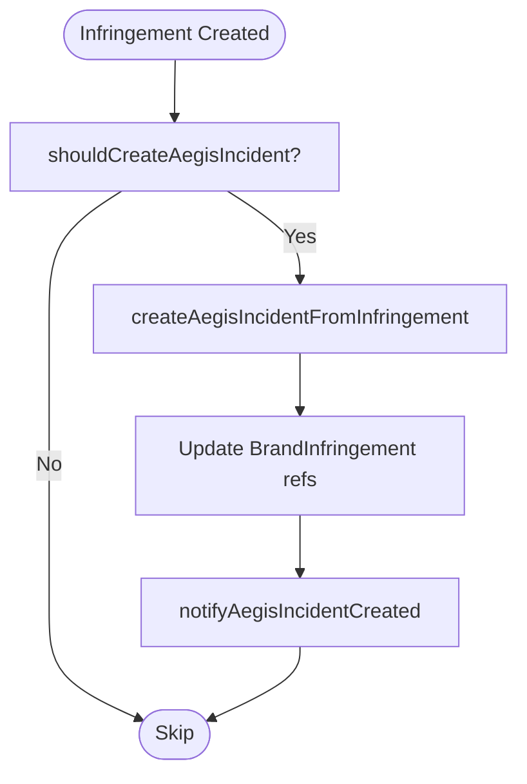

**Diagram sources**
- [aegis.ts](file://src/core/modules/eclipse/integrations/aegis.ts#L16-L31)
- [aegis.ts](file://src/core/modules/eclipse/integrations/aegis.ts#L51-L111)
- [aegis.ts](file://src/core/modules/eclipse/integrations/aegis.ts#L218-L251)

**Section sources**
- [aegis.ts](file://src/core/modules/eclipse/integrations/aegis.ts#L1-L251)

## Dependency Analysis
- Cohesion: Each operation file encapsulates a domain (brands, monitors, alerts, infringements, actions).
- Coupling: Operations depend on validation, permissions, audit, notifications, queue, and Aegis modules.
- External dependencies: Redis for task queueing, Prisma entities for persistence, and Aegis for incident management.

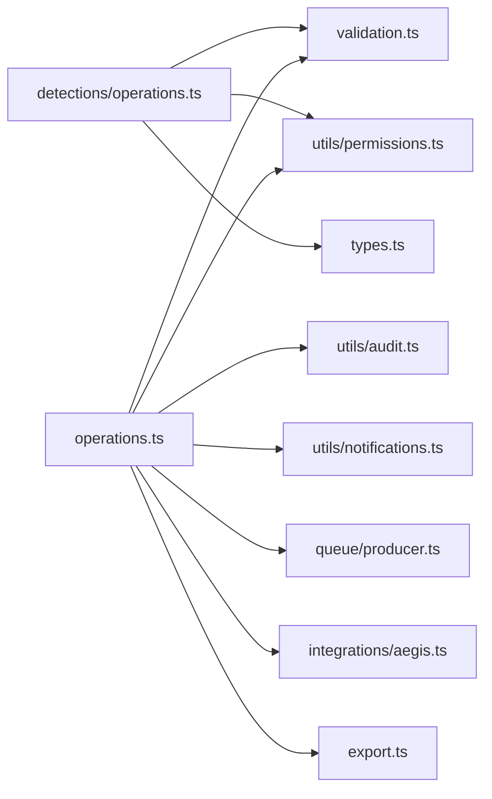

**Diagram sources**
- [operations.ts](file://src/core/modules/eclipse/operations.ts#L1-L2403)
- [detections/operations.ts](file://src/core/modules/eclipse/detections/operations.ts#L1-L183)
- [validation.ts](file://src/core/modules/eclipse/validation.ts#L1-L193)
- [permissions.ts](file://src/core/modules/eclipse/utils/permissions.ts#L1-L60)
- [audit.ts](file://src/core/modules/eclipse/utils/audit.ts#L1-L203)
- [notifications.ts](file://src/core/modules/eclipse/utils/notifications.ts#L1-L166)
- [producer.ts](file://src/core/modules/eclipse/queue/producer.ts#L1-L142)
- [aegis.ts](file://src/core/modules/eclipse/integrations/aegis.ts#L1-L251)
- [export.ts](file://src/core/modules/eclipse/export.ts#L1-L409)
- [types.ts](file://src/core/modules/eclipse/types.ts#L1-L395)

**Section sources**
- [operations.ts](file://src/core/modules/eclipse/operations.ts#L1-L2403)
- [detections/operations.ts](file://src/core/modules/eclipse/detections/operations.ts#L1-L183)
- [validation.ts](file://src/core/modules/eclipse/validation.ts#L1-L193)
- [permissions.ts](file://src/core/modules/eclipse/utils/permissions.ts#L1-L60)
- [audit.ts](file://src/core/modules/eclipse/utils/audit.ts#L1-L203)
- [notifications.ts](file://src/core/modules/eclipse/utils/notifications.ts#L1-L166)
- [producer.ts](file://src/core/modules/eclipse/queue/producer.ts#L1-L142)
- [aegis.ts](file://src/core/modules/eclipse/integrations/aegis.ts#L1-L251)
- [export.ts](file://src/core/modules/eclipse/export.ts#L1-L409)
- [types.ts](file://src/core/modules/eclipse/types.ts#L1-L395)

## Performance Considerations
- Pagination: All list operations use explicit limit/offset to cap result sizes.
- Parallel queries: Many operations use Promise.all to reduce latency (e.g., list + count).
- Index-friendly filters: WorkspaceId-first filters and array_contains for tags minimize scans.
- Queue batching: enqueueBulkMonitoringTasks uses pipeline to reduce round-trips.
- Export limits: Export operations return counts and data arrays; consider chunking for very large exports.
- Audit and notifications: Batched notifications and non-blocking Aegis escalations improve throughput.

[No sources needed since this section provides general guidance]

## Troubleshooting Guide
- Authentication failures: Ensure context.user is present before invoking operations.
- Authorization failures: Verify workspace membership and role (OWNER/ADMIN) for management operations.
- Validation errors: Review Zod schema violations for inputs and filters.
- Queue issues: Use getQueueStats and checkRedisConnection to diagnose Redis problems.
- Aegis escalation failures: Inspect aegisSyncError and retryAegisIncidentCreation.
- Bulk operation limits: Respect max 100 items per bulk operation.

**Section sources**
- [permissions.ts](file://src/core/modules/eclipse/utils/permissions.ts#L1-L60)
- [validation.ts](file://src/core/modules/eclipse/validation.ts#L1-L193)
- [producer.ts](file://src/core/modules/eclipse/queue/producer.ts#L94-L142)
- [aegis.ts](file://src/core/modules/eclipse/integrations/aegis.ts#L145-L216)
- [operations.ts](file://src/core/modules/eclipse/operations.ts#L2078-L2080)
- [operations.ts](file://src/core/modules/eclipse/operations.ts#L2193-L2195)
- [operations.ts](file://src/core/modules/eclipse/operations.ts#L2291-L2293)

## Conclusion
The Eclipse module’s operations provide a robust, permission-enforced foundation for brand protection and infringement detection. They combine strict validation, workspace-scoped access control, auditability, real-time notifications, and scalable queue-based monitoring. Export and reporting utilities support compliance tracking, while Aegis integration streamlines escalation to formal security workflows. The design patterns demonstrated here offer a clear blueprint for extending detection capabilities and adding new operations consistently.

[No sources needed since this section summarizes without analyzing specific files]

## Appendices

### Extension Guidelines
- Follow the established patterns:
  - Validate inputs with Zod schemas.
  - Enforce workspace membership and roles.
  - Emit audit logs for lifecycle events.
  - Publish notifications for critical events.
  - Use Redis queues for background tasks.
  - Implement pagination and filtering for large datasets.
- For new resources:
  - Define Zod schemas for create/update and filters.
  - Add CRUD operations with authorization checks.
  - Implement audit and notifications.
  - Add export support and, if applicable, Aegis integration.
- For detection enhancements:
  - Extend monitor configuration (YARA, regex, OCR).
  - Add queue payloads and crawler logic.
  - Integrate with engine analyzers and crawlers.

[No sources needed since this section provides general guidance]