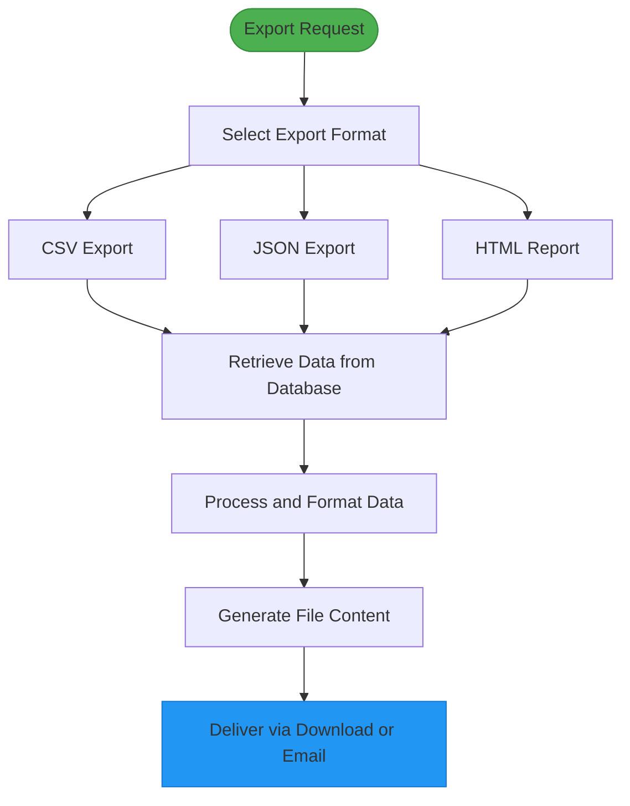
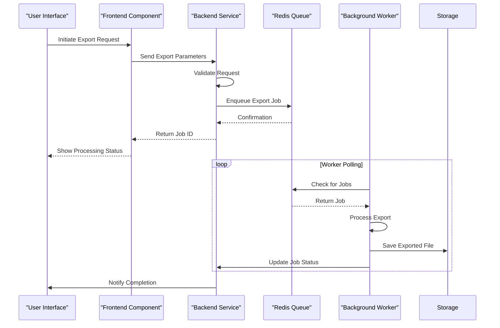
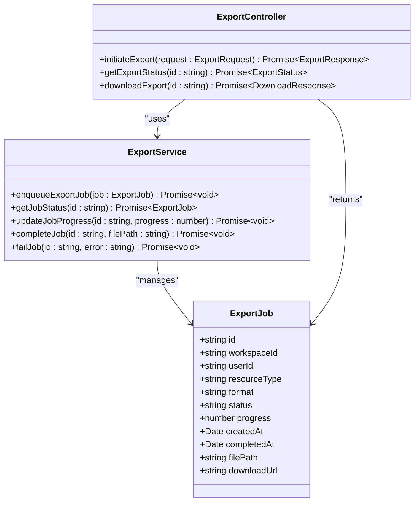
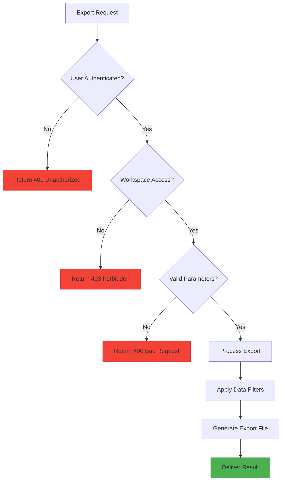
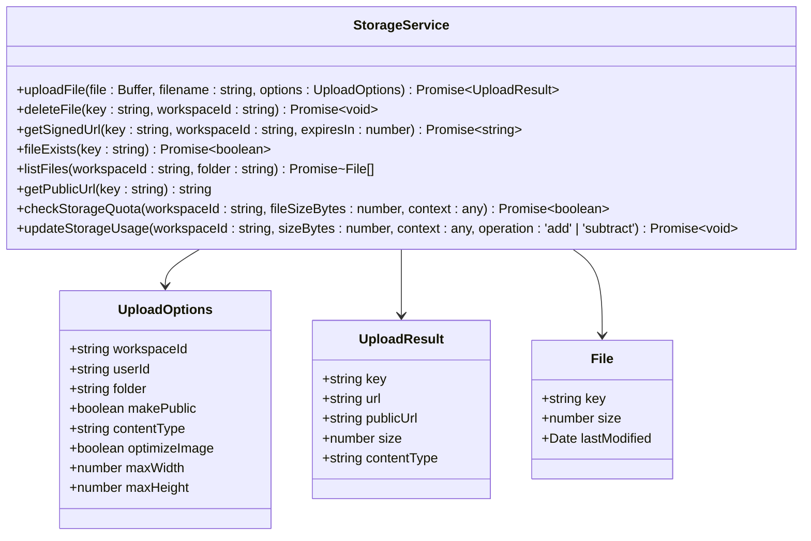
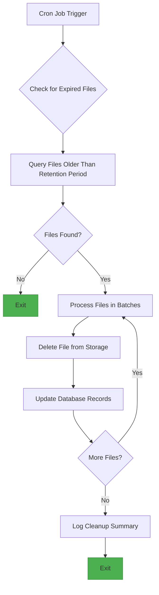
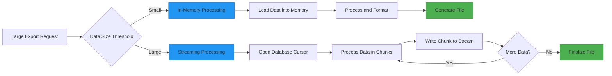
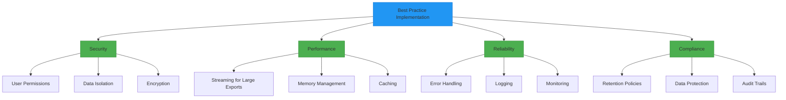

# Export Functionality

<cite>
**Referenced Files in This Document**   
- [export.ts](file://src/core/modules/eclipse/export.ts)
- [producer.ts](file://src/core/modules/eclipse/queue/producer.ts)
- [operations.ts](file://src/core/modules/eclipse/operations.ts)
- [ExportMenu.tsx](file://src/client/pages/modules/eclipse/components/ExportMenu.tsx)
- [DataExportTab.tsx](file://src/client/pages/workspace/settings/tabs/DataExportTab.tsx)
- [storage.ts](file://src/server/storage.ts)
- [types.ts](file://src/core/modules/eclipse/types.ts)
- [validation.ts](file://src/core/modules/eclipse/validation.ts)
</cite>

## Table of Contents
1. [Introduction](#introduction)
2. [Export Formats and Capabilities](#export-formats-and-capabilities)
3. [Export Job Orchestration](#export-job-orchestration)
4. [Progress Tracking and Delivery](#progress-tracking-and-delivery)
5. [Data Isolation and Security](#data-isolation-and-security)
6. [Storage Integration](#storage-integration)
7. [Cleanup and Retention](#cleanup-and-retention)
8. [Performance and Optimization](#performance-and-optimization)
9. [Best Practices](#best-practices)
10. [Troubleshooting](#troubleshooting)

## Introduction
The Eclipse module's export functionality enables users to download detection results, audit logs, and brand monitoring data in various formats including CSV, JSON, and HTML. The system implements a robust export pipeline that handles large datasets through background processing, ensures data consistency, and maintains workspace-level data isolation. This document details the implementation of the export system, including job orchestration via Redis queue, progress tracking, delivery mechanisms, and integration with MinIO/S3 for temporary file storage.

**Section sources**
- [export.ts](file://src/core/modules/eclipse/export.ts)
- [ExportMenu.tsx](file://src/client/pages/modules/eclipse/components/ExportMenu.tsx)

## Export Formats and Capabilities
The Eclipse module supports multiple export formats for different types of data, allowing users to choose the most appropriate format for their needs. The system provides dedicated functions for exporting alerts, infringements, and actions in CSV format, as well as generic JSON export capabilities.

CSV exports include comprehensive headers and properly formatted data for each entity type:
- **Alerts**: Includes ID, title, URL, brand, severity, status, detection date, and monitor source
- **Infringements**: Contains ID, title, type, URL, domain, brand, severity, status, detection date, and number of associated actions
- **Actions**: Features ID, action type, status, associated infringement, priority, assigned user, creation and completion dates, and result

For more detailed reporting, the system supports HTML report generation with embedded styling and visual elements. These reports include executive summaries with key metrics, critical alerts, and open infringements, formatted for easy readability and presentation.

**Diagram sources**
- [export.ts](file://src/core/modules/eclipse/export.ts#L24-L106)
- [ExportMenu.tsx](file://src/client/pages/modules/eclipse/components/ExportMenu.tsx#L37-L87)

**Section sources**
- [export.ts](file://src/core/modules/eclipse/export.ts)
- [ExportMenu.tsx](file://src/client/pages/modules/eclipse/components/ExportMenu.tsx)

## Export Job Orchestration
The export system implements a sophisticated job orchestration mechanism using Redis as a message queue to handle export requests efficiently. When a user initiates an export, the request is validated and then queued for background processing, preventing UI blocking and allowing the system to handle large datasets.

The producer.ts file contains the core functionality for enqueueing export tasks, with methods for both single and bulk task processing. The system uses a pipeline approach for bulk operations to optimize Redis interactions and improve performance.

**Diagram sources**
- [producer.ts](file://src/core/modules/eclipse/queue/producer.ts#L10-L92)
- [operations.ts](file://src/core/modules/eclipse/operations.ts)

**Section sources**
- [producer.ts](file://src/core/modules/eclipse/queue/producer.ts)
- [operations.ts](file://src/core/modules/eclipse/operations.ts)

## Progress Tracking and Delivery
The export system provides comprehensive progress tracking and multiple delivery options for completed exports. When an export job is initiated, the system returns a job identifier that can be used to track the progress of the operation.

For smaller exports, the system supports direct download through the browser's download mechanism, using Blob objects to create downloadable files without requiring server-side file storage. For larger exports or scheduled reports, the system can deliver files via email attachment.

The frontend ExportMenu component implements a user-friendly interface for initiating exports, with visual feedback during processing and success/error notifications upon completion. The component handles both immediate exports of currently displayed data and server-side exports of filtered datasets.

**Diagram sources**
- [ExportMenu.tsx](file://src/client/pages/modules/eclipse/components/ExportMenu.tsx)
- [operations.ts](file://src/core/modules/eclipse/operations.ts)

**Section sources**
- [ExportMenu.tsx](file://src/client/pages/modules/eclipse/components/ExportMenu.tsx)
- [operations.ts](file://src/core/modules/eclipse/operations.ts)

## Data Isolation and Security
The export system implements strict workspace-level data isolation to ensure that users can only access data from workspaces they are authorized to view. This security model is enforced through comprehensive permission checks at multiple levels of the export pipeline.

The validation.ts file contains Zod schemas that define the structure and constraints for export-related operations, ensuring that all input data is properly validated before processing. These schemas include workspace ID validation to prevent unauthorized cross-workspace access.

User permissions are verified through the checkWorkspaceAccess function, which confirms that the requesting user is a member of the specified workspace. Additional permission checks ensure that users have the appropriate roles and privileges to export specific types of data.

**Diagram sources**
- [validation.ts](file://src/core/modules/eclipse/validation.ts)
- [operations.ts](file://src/core/modules/eclipse/operations.ts)

**Section sources**
- [validation.ts](file://src/core/modules/eclipse/validation.ts)
- [operations.ts](file://src/core/modules/eclipse/operations.ts)

## Storage Integration
The export system integrates with MinIO/S3 for temporary storage of exported files, providing scalable and reliable storage for generated reports. The storage.ts file implements a comprehensive storage service that handles file uploads, downloads, and management using AWS SDK v3, with compatibility for both MinIO and AWS S3.

The storage service includes features such as:
- Automatic file optimization for images
- Workspace isolation through directory structure
- Signed URL generation for secure file access
- Storage quota enforcement and tracking
- File type and size validation

Files are stored with a hierarchical structure that includes the workspace ID, ensuring proper data isolation: `workspaces/{workspaceId}/{folder}/{timestamp}-{filename}`. This structure prevents cross-workspace access and simplifies cleanup operations.

**Diagram sources**
- [storage.ts](file://src/server/storage.ts)
- [export.ts](file://src/core/modules/eclipse/export.ts)

**Section sources**
- [storage.ts](file://src/server/storage.ts)
- [export.ts](file://src/core/modules/eclipse/export.ts)

## Cleanup and Retention
The system implements automated cleanup jobs to manage file retention and prevent storage bloat. Temporary export files are automatically removed after a configurable retention period, typically 24-72 hours, to balance accessibility with storage efficiency.

The cleanup process is triggered by scheduled jobs that scan the storage system for files older than the retention threshold. These jobs are designed to run during off-peak hours to minimize impact on system performance.

For workspace-level cleanup, the system provides mechanisms to remove all export files associated with a specific workspace when the workspace is deleted or archived. This ensures compliance with data protection regulations and prevents orphaned files from consuming storage space.

**Diagram sources**
- [storage.ts](file://src/server/storage.ts)
- [operations.ts](file://src/core/modules/eclipse/operations.ts)

**Section sources**
- [storage.ts](file://src/server/storage.ts)
- [operations.ts](file://src/core/modules/eclipse/operations.ts)

## Performance and Optimization
The export system incorporates several performance optimizations to handle large datasets efficiently and minimize resource consumption. For large exports, the system uses streaming techniques to generate files incrementally rather than loading all data into memory at once.

Memory usage is carefully managed during report generation by processing data in chunks and releasing references to processed data as soon as possible. The system also implements caching for frequently accessed data to reduce database load during export operations.

For CSV exports, the system uses efficient string concatenation methods and minimizes object creation to reduce garbage collection pressure. The HTML report generation process optimizes template rendering and avoids unnecessary DOM manipulation.

**Diagram sources**
- [export.ts](file://src/core/modules/eclipse/export.ts)
- [operations.ts](file://src/core/modules/eclipse/operations.ts)

**Section sources**
- [export.ts](file://src/core/modules/eclipse/export.ts)
- [operations.ts](file://src/core/modules/eclipse/operations.ts)

## Best Practices
To ensure secure and efficient use of the export functionality, the following best practices are recommended:

1. **Data Security**: Always apply appropriate user permissions and workspace isolation to prevent unauthorized data access. Sensitive data should be encrypted both in transit and at rest.

2. **File Size Management**: Implement size limits for exports to prevent excessive resource consumption. For large datasets, consider implementing pagination or data sampling.

3. **Retention Policies**: Establish clear file retention policies and ensure automated cleanup jobs are properly configured and monitored.

4. **Error Handling**: Implement comprehensive error handling and logging for export operations to facilitate troubleshooting and auditing.

5. **Performance Monitoring**: Monitor export job success/failure rates, processing times, and resource usage to identify potential bottlenecks.

6. **User Experience**: Provide clear feedback during export operations, including progress indicators and estimated completion times.

7. **Compliance**: Ensure export functionality complies with relevant data protection regulations such as GDPR, CCPA, etc.

**Diagram sources**
- [validation.ts](file://src/core/modules/eclipse/validation.ts)
- [operations.ts](file://src/core/modules/eclipse/operations.ts)
- [storage.ts](file://src/server/storage.ts)

**Section sources**
- [validation.ts](file://src/core/modules/eclipse/validation.ts)
- [operations.ts](file://src/core/modules/eclipse/operations.ts)
- [storage.ts](file://src/server/storage.ts)

## Troubleshooting
Common issues with the export functionality and their solutions include:

1. **Large Export Failures**: For exports that fail due to size limitations, implement chunked processing or streaming. Consider increasing memory allocation for the export service if necessary.

2. **Memory Usage Issues**: Monitor memory consumption during report generation and optimize data processing to release references promptly. Implement streaming for large datasets.

3. **Data Consistency Problems**: Ensure that data snapshots are consistent by using database transactions or read replicas. For time-sensitive exports, consider implementing data versioning.

4. **Permission Errors**: Verify that workspace access checks are properly implemented and that user roles have appropriate export permissions.

5. **Storage Issues**: Monitor storage usage and ensure cleanup jobs are running correctly. Verify that the storage service has proper connectivity to MinIO/S3.

6. **Queue Processing Delays**: Monitor Redis queue length and worker performance. Scale the number of worker processes if queue backlogs occur.

7. **File Corruption**: Implement file integrity checks and validation for generated exports. Use appropriate error handling to detect and recover from generation failures.

**Section sources**
- [operations.ts](file://src/core/modules/eclipse/operations.ts)
- [producer.ts](file://src/core/modules/eclipse/queue/producer.ts)
- [storage.ts](file://src/server/storage.ts)