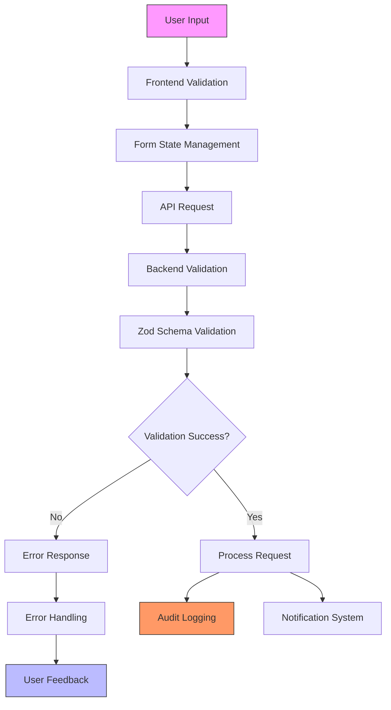
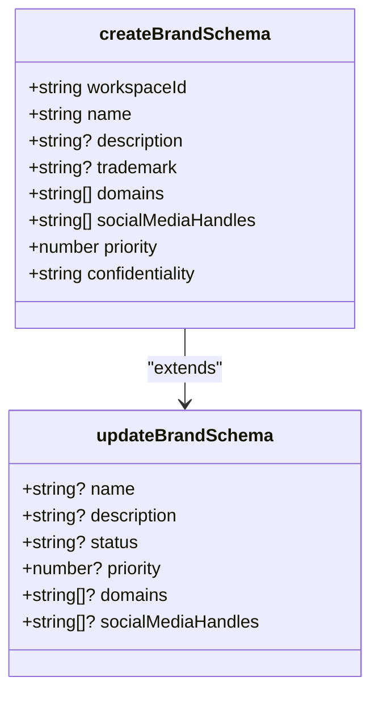
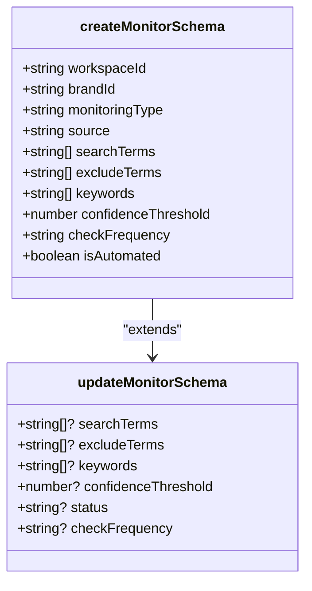
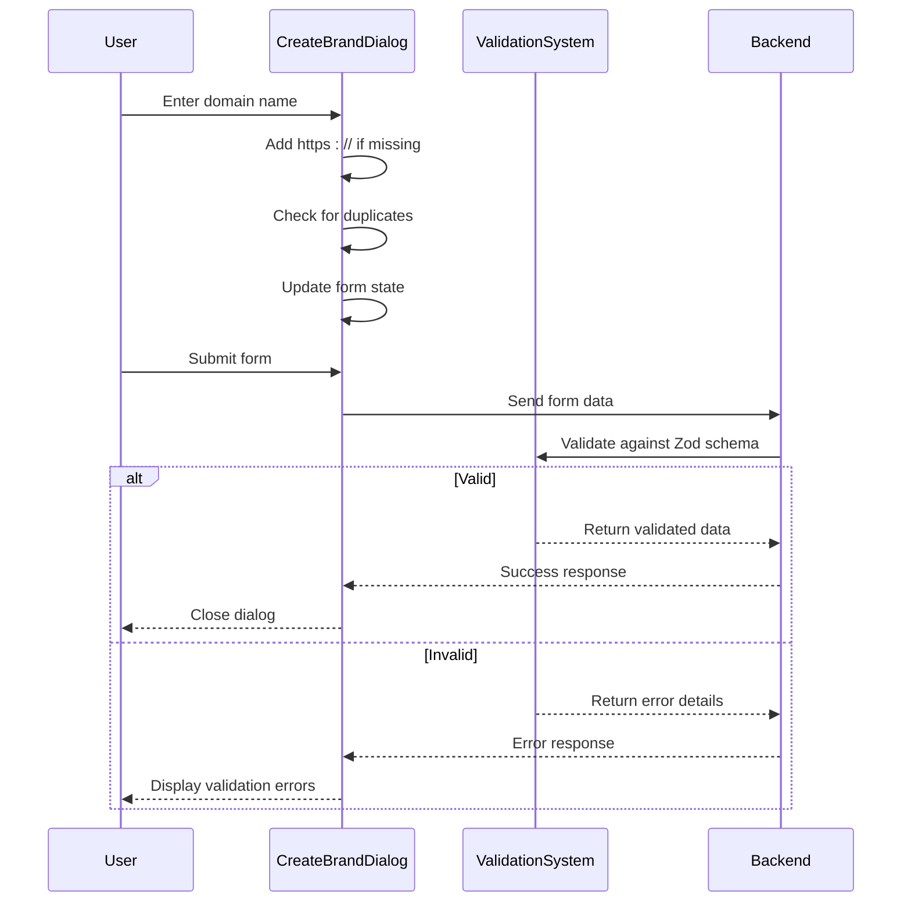
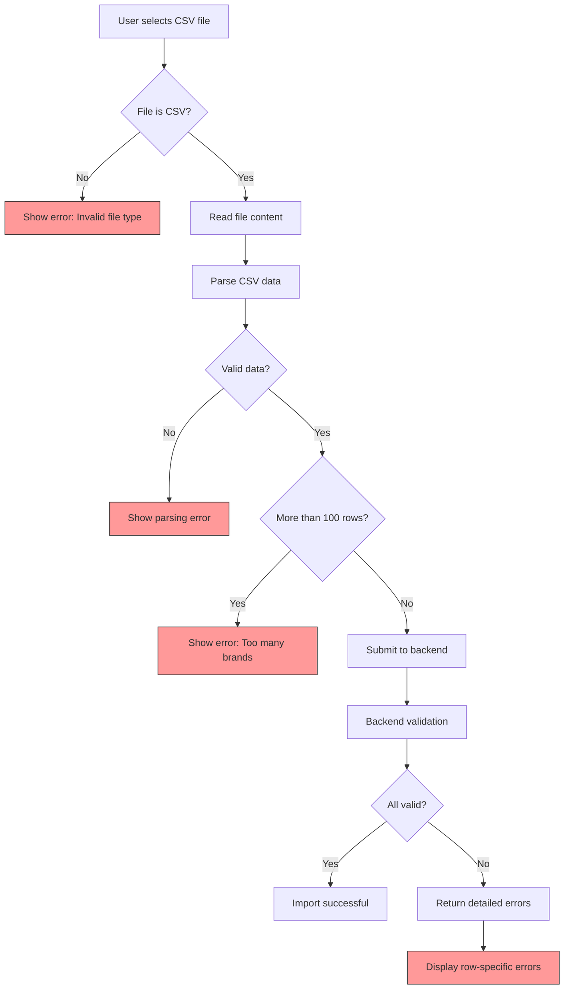
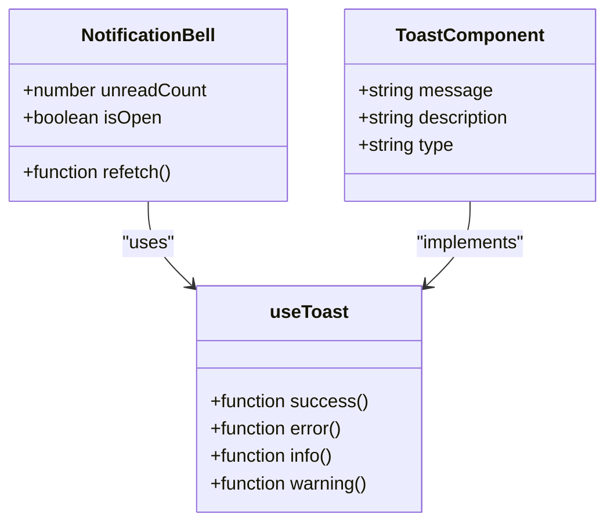
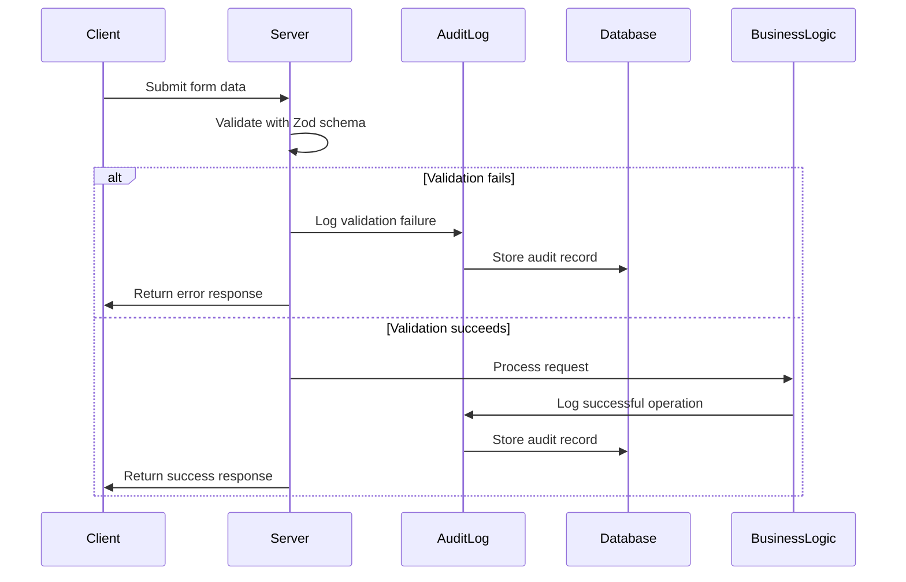

# Validation System

<cite>
**Referenced Files in This Document**   
- [validation.ts](file://src/core/modules/eclipse/validation.ts)
- [CreateBrandDialog.tsx](file://src/client/pages/modules/eclipse/components/CreateBrandDialog.tsx)
- [ImportBrandsDialog.tsx](file://src/client/pages/modules/eclipse/components/ImportBrandsDialog.tsx)
- [server/validation.ts](file://src/server/validation.ts)
- [auditor.ts](file://src/core/audit/auditor.ts)
- [NotificationBell.tsx](file://src/client/components/notifications/NotificationBell.tsx)
- [toaster.tsx](file://src/client/components/ui/toaster.tsx)
- [useToast.tsx](file://src/client/hooks/useToast.tsx)
</cite>

## Table of Contents
1. [Introduction](#introduction)
2. [Validation Architecture](#validation-architecture)
3. [Core Validation Patterns](#core-validation-patterns)
4. [Form Integration](#form-integration)
5. [Error Handling and User Feedback](#error-handling-and-user-feedback)
6. [Audit Logging](#audit-logging)
7. [Performance Considerations](#performance-considerations)
8. [Best Practices for Adding Validation Rules](#best-practices-for-adding-validation-rules)

## Introduction
The Eclipse module's input validation system ensures data integrity across brand monitoring configurations, detection rules, and workspace settings. This document details the validation architecture, patterns, and integration points that maintain data quality and security throughout the application. The system employs a comprehensive validation strategy using Zod schemas for both frontend and backend validation, ensuring consistent data integrity across all user inputs.

## Validation Architecture

**Diagram sources**
- [validation.ts](file://src/core/modules/eclipse/validation.ts)
- [server/validation.ts](file://src/server/validation.ts)
- [CreateBrandDialog.tsx](file://src/client/pages/modules/eclipse/components/CreateBrandDialog.tsx)

**Section sources**
- [validation.ts](file://src/core/modules/eclipse/validation.ts)
- [server/validation.ts](file://src/server/validation.ts)

## Core Validation Patterns

The validation system uses Zod schemas to define comprehensive validation rules for all Eclipse module entities. These schemas are organized by entity type and operation, providing clear validation rules for creation and update operations.

### Brand Validation
The brand validation system ensures data integrity for brand monitoring configurations. The `createBrandSchema` validates required fields like name and workspace ID, while enforcing data constraints such as URL validation for domains and enum validation for confidentiality levels.

**Diagram sources**
- [validation.ts](file://src/core/modules/eclipse/validation.ts#L7-L25)

**Section sources**
- [validation.ts](file://src/core/modules/eclipse/validation.ts#L7-L25)
- [types.ts](file://src/core/modules/eclipse/types.ts#L212-L221)

### Monitor Validation
Monitor validation ensures detection rules are properly configured with valid search terms, target regions, and confidence thresholds. The system validates that at least one search term is provided and that confidence thresholds fall within the acceptable range of 0-100.

**Diagram sources**
- [validation.ts](file://src/core/modules/eclipse/validation.ts#L31-L62)

**Section sources**
- [validation.ts](file://src/core/modules/eclipse/validation.ts#L31-L62)
- [types.ts](file://src/core/modules/eclipse/types.ts#L232-L263)

### Domain and URL Validation
The system implements strict validation for domain names and URLs, ensuring that all domain inputs are properly formatted and include valid protocols. When users input domains without a protocol, the system automatically prepends "https://" to ensure consistency.

**Section sources**
- [CreateBrandDialog.tsx](file://src/client/pages/modules/eclipse/components/CreateBrandDialog.tsx#L63-L66)
- [validation.ts](file://src/core/modules/eclipse/validation.ts#L12)

## Form Integration

The validation system integrates seamlessly with form components like CreateBrandDialog and ImportBrandsDialog, providing real-time feedback and ensuring data integrity before submission.

### CreateBrandDialog Integration
The CreateBrandDialog component implements client-side validation through controlled form state and immediate feedback. The component handles domain input by automatically adding the HTTPS protocol and preventing duplicate entries.

**Diagram sources**
- [CreateBrandDialog.tsx](file://src/client/pages/modules/eclipse/components/CreateBrandDialog.tsx)
- [validation.ts](file://src/core/modules/eclipse/validation.ts)

**Section sources**
- [CreateBrandDialog.tsx](file://src/client/pages/modules/eclipse/components/CreateBrandDialog.tsx)
- [validation.ts](file://src/core/modules/eclipse/validation.ts)

### ImportBrandsDialog Integration
The ImportBrandsDialog component handles bulk brand imports with CSV validation, enforcing limits on file size and row count. The system validates the CSV format and provides detailed error reporting for failed imports.

**Diagram sources**
- [ImportBrandsDialog.tsx](file://src/client/pages/modules/eclipse/components/ImportBrandsDialog.tsx)

**Section sources**
- [ImportBrandsDialog.tsx](file://src/client/pages/modules/eclipse/components/ImportBrandsDialog.tsx)
- [export.ts](file://src/core/modules/eclipse/export.ts)

## Error Handling and User Feedback

The validation system implements a comprehensive error handling strategy that provides clear feedback to users through multiple channels.

### Notification System
Validation errors are communicated to users through both immediate inline feedback and system-wide notifications. The NotificationBell component displays unread notification counts, while toast notifications provide transient feedback for validation results.

**Diagram sources**
- [NotificationBell.tsx](file://src/client/components/notifications/NotificationBell.tsx)
- [toaster.tsx](file://src/client/components/ui/toaster.tsx)
- [useToast.tsx](file://src/client/hooks/useToast.tsx)

**Section sources**
- [NotificationBell.tsx](file://src/client/components/notifications/NotificationBell.tsx)
- [toaster.tsx](file://src/client/components/ui/toaster.tsx)
- [useToast.tsx](file://src/client/hooks/useToast.tsx)

### Error Response Handling
When validation fails at the backend level, the system returns structured error responses that are handled consistently across the application. The server-side validation function `ensureArgsSchemaOrThrowHttpError` processes Zod validation results and generates appropriate HTTP error responses.

**Section sources**
- [server/validation.ts](file://src/server/validation.ts)
- [operations.ts](file://src/core/modules/eclipse/operations.ts)

## Audit Logging

Validation-related actions and system responses are logged for audit purposes, providing a complete record of data integrity events.

**Diagram sources**
- [auditor.ts](file://src/core/audit/auditor.ts)
- [server/validation.ts](file://src/server/validation.ts)

**Section sources**
- [auditor.ts](file://src/core/audit/auditor.ts)
- [server/validation.ts](file://src/server/validation.ts)

## Performance Considerations

The validation system addresses several performance considerations to ensure optimal user experience and system efficiency.

### Async Validation and Race Conditions
The system minimizes race conditions during async validation by using proper state management and request cancellation. For bulk operations like CSV imports, the system implements progress indicators and error batching to maintain responsiveness.

**Section sources**
- [ImportBrandsDialog.tsx](file://src/client/pages/modules/eclipse/components/ImportBrandsDialog.tsx#L158-L163)
- [operations.ts](file://src/core/modules/eclipse/operations.ts#L1959-L2014)

### Complex Rule Validation Performance
For complex validation rules involving multiple conditions or external lookups, the system implements debouncing and caching strategies to prevent performance degradation. The validation schemas are optimized to minimize computational overhead during parsing.

**Section sources**
- [validation.ts](file://src/core/modules/eclipse/validation.ts)
- [useDebounce.tsx](file://src/client/hooks/useDebounce.tsx)

## Best Practices for Adding Validation Rules

When adding new validation rules to the Eclipse module, follow these guidelines to maintain type safety and backward compatibility.

### Type Safety Preservation
Ensure all new validation schemas are properly typed using Zod's inference capabilities. Define corresponding TypeScript interfaces in the types.ts file to maintain consistency between validation rules and data models.

**Section sources**
- [validation.ts](file://src/core/modules/eclipse/validation.ts)
- [types.ts](file://src/core/modules/eclipse/types.ts)

### Backward Compatibility
When modifying existing validation rules, consider the impact on existing data and client applications. Use optional fields and default values to maintain backward compatibility, and implement proper migration strategies for breaking changes.

**Section sources**
- [validation.ts](file://src/core/modules/eclipse/validation.ts)
- [operations.ts](file://src/core/modules/eclipse/operations.ts)

### Schema Reusability
Design validation schemas to be reusable across different contexts. Extract common validation patterns into shared schema components to reduce duplication and ensure consistency.

**Section sources**
- [validation.ts](file://src/core/modules/eclipse/validation.ts)
- [workspace.ts](file://src/shared/validation/workspace.ts)