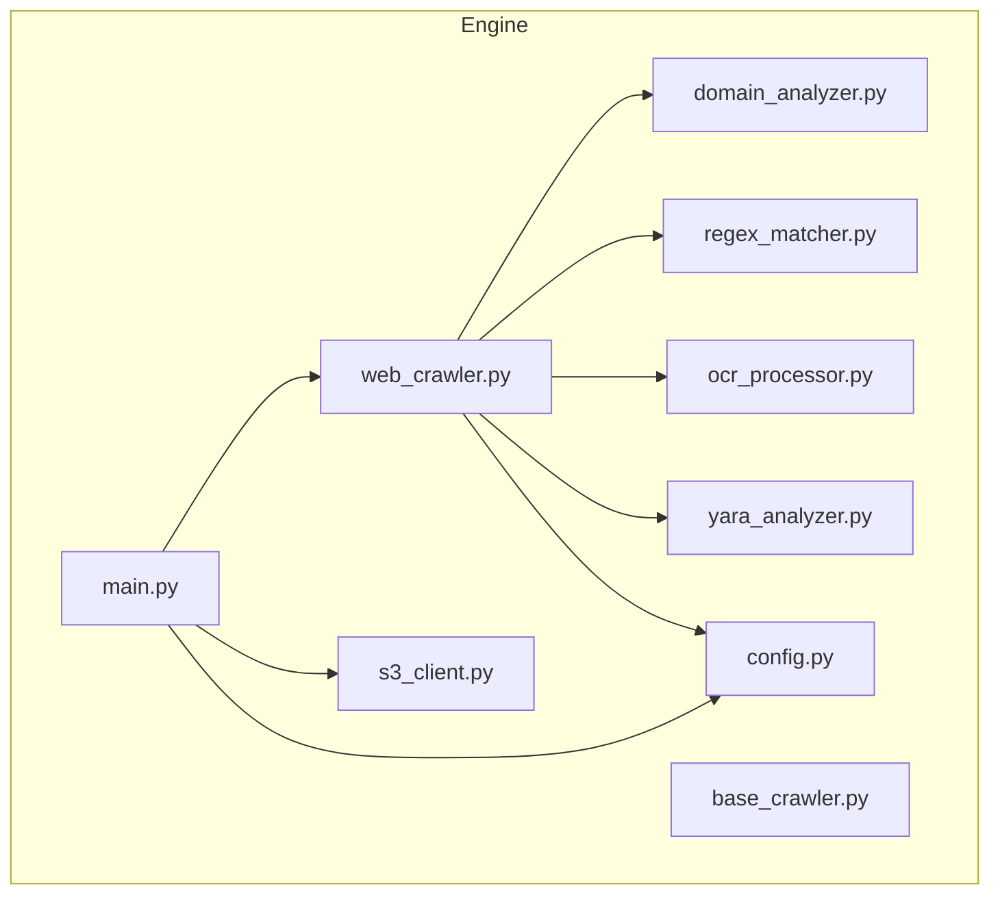
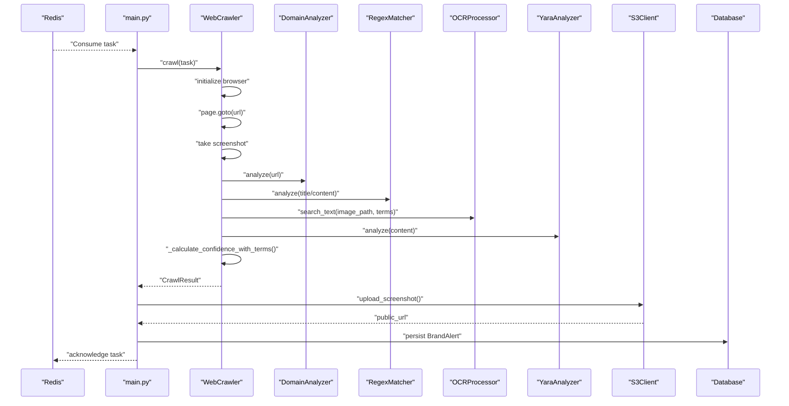
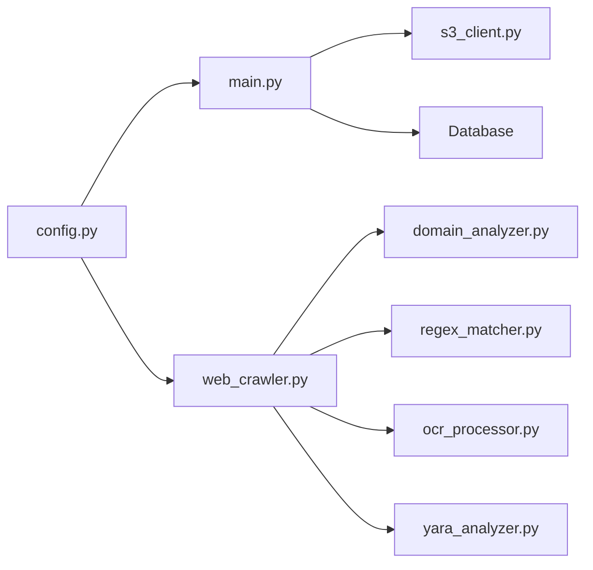
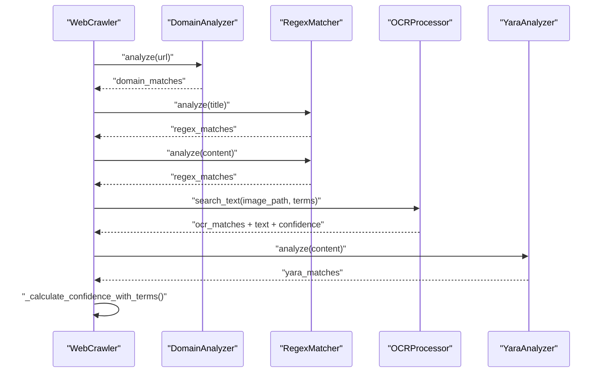

# Analysis Modules

<cite>
**Referenced Files in This Document**
- [domain_analyzer.py](file://services/engine/analyzers/domain_analyzer.py)
- [ocr_processor.py](file://services/engine/analyzers/ocr_processor.py)
- [regex_matcher.py](file://services/engine/analyzers/regex_matcher.py)
- [yara_analyzer.py](file://services/engine/analyzers/yara_analyzer.py)
- [web_crawler.py](file://services/engine/crawlers/web_crawler.py)
- [base_crawler.py](file://services/engine/crawlers/base_crawler.py)
- [main.py](file://services/engine/main.py)
- [s3_client.py](file://services/engine/utils/s3_client.py)
- [config.py](file://services/engine/config.py)
- [Dockerfile](file://services/engine/Dockerfile)
- [requirements.txt](file://services/engine/requirements.txt)
</cite>

## Table of Contents
1. [Introduction](#introduction)
2. [Project Structure](#project-structure)
3. [Core Components](#core-components)
4. [Architecture Overview](#architecture-overview)
5. [Detailed Component Analysis](#detailed-component-analysis)
6. [Dependency Analysis](#dependency-analysis)
7. [Performance Considerations](#performance-considerations)
8. [Troubleshooting Guide](#troubleshooting-guide)
9. [Conclusion](#conclusion)
10. [Appendices](#appendices)

## Introduction
This document analyzes the analysis modules within the data processing engine responsible for threat intelligence lookups, OCR-based text extraction, pattern detection in unstructured data, and signature-based malware detection. It explains how these analyzers are orchestrated by the main engine, receive data from crawlers, and integrate with S3/MinIO for asset retrieval and storage. It also documents interfaces, input/output formats, error handling strategies, configuration parameters, and extensibility patterns for adding new analyzers.

## Project Structure
The analysis engine resides under services/engine and is composed of:
- Analyzers: domain_analyzer.py, ocr_processor.py, regex_matcher.py, yara_analyzer.py
- Crawlers: web_crawler.py (Playwright-based) and base_crawler.py (shared interfaces)
- Orchestrator: main.py (consumer loop)
- Utilities: s3_client.py (S3/MinIO), config.py (environment-driven settings)
- Runtime dependencies: Dockerfile and requirements.txt

**Diagram sources**
- [main.py](file://services/engine/main.py#L1-L284)
- [web_crawler.py](file://services/engine/crawlers/web_crawler.py#L1-L358)
- [base_crawler.py](file://services/engine/crawlers/base_crawler.py#L1-L159)
- [domain_analyzer.py](file://services/engine/analyzers/domain_analyzer.py#L1-L120)
- [regex_matcher.py](file://services/engine/analyzers/regex_matcher.py#L1-L70)
- [ocr_processor.py](file://services/engine/analyzers/ocr_processor.py#L1-L150)
- [yara_analyzer.py](file://services/engine/analyzers/yara_analyzer.py#L1-L95)
- [s3_client.py](file://services/engine/utils/s3_client.py#L1-L160)
- [config.py](file://services/engine/config.py#L1-L78)

**Section sources**
- [main.py](file://services/engine/main.py#L1-L284)
- [web_crawler.py](file://services/engine/crawlers/web_crawler.py#L1-L358)
- [base_crawler.py](file://services/engine/crawlers/base_crawler.py#L1-L159)
- [domain_analyzer.py](file://services/engine/analyzers/domain_analyzer.py#L1-L120)
- [regex_matcher.py](file://services/engine/analyzers/regex_matcher.py#L1-L70)
- [ocr_processor.py](file://services/engine/analyzers/ocr_processor.py#L1-L150)
- [yara_analyzer.py](file://services/engine/analyzers/yara_analyzer.py#L1-L95)
- [s3_client.py](file://services/engine/utils/s3_client.py#L1-L160)
- [config.py](file://services/engine/config.py#L1-L78)

## Core Components
- DomainAnalyzer: Wildcard-to-regex conversion and domain pattern matching; includes typosquatting heuristics.
- RegexMatcher: Case-insensitive, multiline regex pattern matching with deduplication and counts.
- OCRProcessor: Optional OCR using Tesseract/Pillow; extracts text and searches for terms with confidence metrics.
- YaraAnalyzer: Optional signature-based detection using yara-python; compiles rules from string content.
- WebCrawler: Playwright-based crawler that orchestrates analyzers, computes confidence, and severity.
- BaseCrawler: Shared interfaces and utilities for confidence calculation and severity determination.
- S3Client: Uploads screenshots to S3/MinIO and constructs public URLs.
- Config: Centralized environment-driven settings for Redis, DB, Playwright, OCR, performance, logging, ELK/Sentry, and S3.

**Section sources**
- [domain_analyzer.py](file://services/engine/analyzers/domain_analyzer.py#L1-L120)
- [regex_matcher.py](file://services/engine/analyzers/regex_matcher.py#L1-L70)
- [ocr_processor.py](file://services/engine/analyzers/ocr_processor.py#L1-L150)
- [yara_analyzer.py](file://services/engine/analyzers/yara_analyzer.py#L1-L95)
- [web_crawler.py](file://services/engine/crawlers/web_crawler.py#L1-L358)
- [base_crawler.py](file://services/engine/crawlers/base_crawler.py#L1-L159)
- [s3_client.py](file://services/engine/utils/s3_client.py#L1-L160)
- [config.py](file://services/engine/config.py#L1-L78)

## Architecture Overview
The engine runs a continuous consumer loop that pulls tasks from Redis, initializes a browser, crawls a URL, runs analyzers, computes confidence and severity, conditionally uploads screenshots to S3/MinIO, and persists alerts to the database.

**Diagram sources**
- [main.py](file://services/engine/main.py#L44-L193)
- [web_crawler.py](file://services/engine/crawlers/web_crawler.py#L70-L358)
- [domain_analyzer.py](file://services/engine/analyzers/domain_analyzer.py#L38-L82)
- [regex_matcher.py](file://services/engine/analyzers/regex_matcher.py#L32-L70)
- [ocr_processor.py](file://services/engine/analyzers/ocr_processor.py#L43-L145)
- [yara_analyzer.py](file://services/engine/analyzers/yara_analyzer.py#L44-L95)
- [s3_client.py](file://services/engine/utils/s3_client.py#L42-L105)

## Detailed Component Analysis

### DomainAnalyzer
Purpose:
- Detect suspicious domains by matching against wildcard patterns converted to regex.
- Provide quick checks for suspiciousness and domain extraction.
- Heuristic indicators for typosquatting.

Key methods and interfaces:
- analyze(url): Returns list of matched patterns with original pattern, domain, and URL.
- is_suspicious(url): Boolean quick check.
- extract_domain(url): Extracts netloc from URL.
- has_typosquatting_indicators(domain, legitimate_domain): Heuristic checks for character substitutions and extra characters.

Input/Output:
- Input: URL string.
- Output: List of dicts containing pattern, domain, and url.

Error handling:
- Logs invalid regex patterns and returns empty list on exceptions.

Complexity:
- O(P) to compile patterns where P is number of patterns.
- O(N) per URL to match against N patterns.

Extensibility:
- Add new pattern types or normalization rules.

**Section sources**
- [domain_analyzer.py](file://services/engine/analyzers/domain_analyzer.py#L1-L120)

### RegexMatcher
Purpose:
- Perform case-insensitive, multiline regex matching on content.
- Deduplicate matches and limit counts for performance.

Key methods and interfaces:
- analyze(content): Returns list of dicts with pattern, matches (unique), and count.
- has_match(content): Quick boolean check.

Input/Output:
- Input: Content string.
- Output: List of match records.

Error handling:
- Logs invalid regex patterns and continues with valid ones.

Complexity:
- O(M) per pattern to find all matches where M is content length.

Extensibility:
- Add flags or additional match strategies.

**Section sources**
- [regex_matcher.py](file://services/engine/analyzers/regex_matcher.py#L1-L70)

### OCRProcessor
Purpose:
- Extract text from screenshots using Tesseract/Pillow.
- Search for specific terms and report confidence and positions.

Key methods and interfaces:
- __init__(tesseract_cmd): Initializes Tesseract and logs availability.
- extract_text(image_path): Returns text, confidence, word count, and error.
- search_text(image_path, search_terms): Returns found terms, counts, positions, and aggregated match count.
- is_available(): Reports OCR availability.

Input/Output:
- Input: Image path and optional search terms.
- Output: Dict with text, confidence, words, error, and optional found_terms/match_count.

Error handling:
- Graceful degradation when OCR is unavailable.
- Returns structured error fields for downstream handling.

Complexity:
- Depends on image size and Tesseract performance; confidence computed from per-word confidence scores.

Extensibility:
- Add language packs, segmentation strategies, or alternative engines.

**Section sources**
- [ocr_processor.py](file://services/engine/analyzers/ocr_processor.py#L1-L150)

### YaraAnalyzer
Purpose:
- Signature-based detection using YARA rules.
- Compile rules from string content and match against data.

Key methods and interfaces:
- __init__(rules_content): Compiles rules if enabled and available.
- analyze(content): Returns list of matches with rule, namespace, tags, and string instances.
- has_match(content): Quick boolean check.

Input/Output:
- Input: Rules content string and content to scan.
- Output: List of match records.

Error handling:
- Disabled when YARA is not available or when compilation fails.
- Returns empty list on runtime errors.

Complexity:
- Depends on rule complexity and content size.

Extensibility:
- Integrate external rule repositories and rule caching.

**Section sources**
- [yara_analyzer.py](file://services/engine/analyzers/yara_analyzer.py#L1-L95)

### WebCrawler Orchestration
Purpose:
- Drive the crawling lifecycle and coordinate analyzers.
- Compute confidence and severity based on analyzer outputs.

Key responsibilities:
- Initialize browser, navigate to URL, take screenshot, extract metadata.
- Invoke analyzers: domain, regex, OCR.
- Aggregate analysis_data and compute confidence/severity.
- Return CrawlResult to main loop.

Confidence computation highlights:
- Regex matches: +40 points; YARA matches: +15 points; domain matches: +10 points; OCR confirmation: +40 points; perfect cross-validation: +20 points.
- Final score capped at 100.

Severity determination:
- Critical: high confidence and YARA matches.
- High: high confidence or multiple match types.
- Medium: moderate confidence.
- Low: otherwise.

**Section sources**
- [web_crawler.py](file://services/engine/crawlers/web_crawler.py#L70-L358)
- [base_crawler.py](file://services/engine/crawlers/base_crawler.py#L89-L159)

### BaseCrawler Interfaces
Purpose:
- Define the CrawlResult structure and shared utilities.
- Provide a baseline confidence and severity calculation for comparison.

Key elements:
- CrawlResult: Standardized fields for persistence and downstream processing.
- calculate_confidence: Alternative scoring scheme (used in base class).
- determine_severity: Severity classification logic.

**Section sources**
- [base_crawler.py](file://services/engine/crawlers/base_crawler.py#L1-L159)

### S3Client Integration
Purpose:
- Upload screenshots to S3/MinIO and construct public URLs.
- Delete screenshots when needed.

Key methods:
- upload_screenshot(file_path, workspace_id, monitor_id): Returns public URL or None.
- delete_screenshot(s3_key): Returns success/failure.

Behavior:
- Uses environment-configured endpoint, bucket, and credentials.
- Sets public-read ACL and attaches metadata.

**Section sources**
- [s3_client.py](file://services/engine/utils/s3_client.py#L1-L160)
- [config.py](file://services/engine/config.py#L69-L78)

### Configuration Parameters
Environment-driven settings impacting analyzers and engine behavior:
- Redis: REDIS_URL, REDIS_QUEUE_NAME, REDIS_POLL_INTERVAL
- Database: DATABASE_URL
- Crawler: CRAWLER_TIMEOUT, MAX_CONCURRENT_CRAWLS
- Playwright: PLAYWRIGHT_HEADLESS, SCREENSHOT_DIR
- OCR: TESSERACT_LANG
- Performance: MIN_CONFIDENCE, LOG_RETENTION_DAYS
- Logging: LOG_LEVEL, LOG_FILE
- ELK: ELK_ENABLED, LOGSTASH_HOST, LOGSTASH_PORT
- Sentry: SENTRY_DSN, SENTRY_ENVIRONMENT, SENTRY_TRACES_SAMPLE_RATE
- S3/MinIO: S3_ENDPOINT, S3_REGION, S3_ACCESS_KEY, S3_SECRET_KEY, S3_BUCKET_DEV/PROD, S3_PUBLIC_URL, NODE_ENV

Notes:
- YARA availability depends on yara-python installation and ENABLE_YARA flag presence in config (not shown here).
- OCR availability depends on pytesseract installation.

**Section sources**
- [config.py](file://services/engine/config.py#L1-L78)
- [Dockerfile](file://services/engine/Dockerfile#L1-L79)
- [requirements.txt](file://services/engine/requirements.txt#L1-L39)

## Dependency Analysis
- WebCrawler depends on analyzers and configuration; it aggregates results and computes confidence.
- main.py coordinates Redis consumption, crawler initialization, S3 uploads, and database persistence.
- S3Client depends on environment configuration and boto3.
- Analyzers depend on Python stdlib and optional third-party packages (pytesseract, yara-python).

**Diagram sources**
- [main.py](file://services/engine/main.py#L1-L284)
- [web_crawler.py](file://services/engine/crawlers/web_crawler.py#L1-L358)
- [domain_analyzer.py](file://services/engine/analyzers/domain_analyzer.py#L1-L120)
- [regex_matcher.py](file://services/engine/analyzers/regex_matcher.py#L1-L70)
- [ocr_processor.py](file://services/engine/analyzers/ocr_processor.py#L1-L150)
- [yara_analyzer.py](file://services/engine/analyzers/yara_analyzer.py#L1-L95)
- [s3_client.py](file://services/engine/utils/s3_client.py#L1-L160)
- [config.py](file://services/engine/config.py#L1-L78)

**Section sources**
- [main.py](file://services/engine/main.py#L1-L284)
- [web_crawler.py](file://services/engine/crawlers/web_crawler.py#L1-L358)
- [s3_client.py](file://services/engine/utils/s3_client.py#L1-L160)
- [config.py](file://services/engine/config.py#L1-L78)

## Performance Considerations
- RegexMatcher limits unique matches and caps counts to reduce overhead.
- DomainAnalyzer compiles patterns once and performs O(N) matching per URL.
- OCRProcessor’s confidence is derived from per-word confidence; large images increase processing time.
- YaraAnalyzer’s performance depends on rule complexity; keep rules minimal and targeted.
- WebCrawler caps content size and limits link lists to reduce memory footprint.
- S3 uploads are asynchronous relative to crawling; consider batching uploads for throughput.
- Tune REDIS_POLL_INTERVAL and MAX_CONCURRENT_CRAWLS to balance latency and resource usage.

[No sources needed since this section provides general guidance]

## Troubleshooting Guide
Common issues and resolutions:
- OCR disabled: Ensure pytesseract is installed and available; verify Tesseract binary path and languages.
  - Evidence: OCRProcessor logs warnings when pytesseract is missing and returns structured error fields.
- YARA disabled: Ensure yara-python is installed and ENABLE_YARA is set appropriately.
  - Evidence: YaraAnalyzer logs disabled state and compilation errors.
- S3 upload failures: Verify S3_ENDPOINT, S3_ACCESS_KEY, S3_SECRET_KEY, S3_BUCKET_* and S3_PUBLIC_URL.
  - Evidence: S3Client logs ClientError and unexpected errors with component context.
- Redis connectivity: main.py performs health checks and logs queue statistics.
  - Evidence: main_loop logs Redis connection and queue length.
- Playwright/Chromium: Dockerfile installs Chromium and sets cache path; ensure sufficient disk space and permissions.
  - Evidence: Dockerfile and requirements.txt show dependencies.

**Section sources**
- [ocr_processor.py](file://services/engine/analyzers/ocr_processor.py#L1-L150)
- [yara_analyzer.py](file://services/engine/analyzers/yara_analyzer.py#L1-L95)
- [s3_client.py](file://services/engine/utils/s3_client.py#L1-L160)
- [main.py](file://services/engine/main.py#L195-L267)
- [Dockerfile](file://services/engine/Dockerfile#L1-L79)
- [requirements.txt](file://services/engine/requirements.txt#L1-L39)

## Conclusion
The analysis modules provide a modular, extensible foundation for threat detection and content analysis. They integrate cleanly with the crawler orchestration, leverage environment-driven configuration, and support optional integrations like OCR and YARA. Robust error handling and structured outputs enable reliable downstream processing and alert creation.

[No sources needed since this section summarizes without analyzing specific files]

## Appendices

### Analyzer Call Flow (Code-Level)

**Diagram sources**
- [web_crawler.py](file://services/engine/crawlers/web_crawler.py#L214-L358)
- [domain_analyzer.py](file://services/engine/analyzers/domain_analyzer.py#L38-L82)
- [regex_matcher.py](file://services/engine/analyzers/regex_matcher.py#L32-L70)
- [ocr_processor.py](file://services/engine/analyzers/ocr_processor.py#L103-L145)
- [yara_analyzer.py](file://services/engine/analyzers/yara_analyzer.py#L44-L95)

### Detection Results Structure
- CrawlResult fields include success, error, url, title, description, content, screenshot_path, screenshot, confidence, severity, matches, metadata, analysis_data, timestamp, and has_screenshot.
- analysis_data produced by WebCrawler includes domain_matches, regex_matches (with location), ocr_matches, ocr_text, ocr_confidence, and url_analysis.

**Section sources**
- [base_crawler.py](file://services/engine/crawlers/base_crawler.py#L9-L48)
- [web_crawler.py](file://services/engine/crawlers/web_crawler.py#L214-L288)

### Extensibility Patterns
- Adding a new analyzer:
  - Implement a new analyzer class with analyze(content) returning structured matches.
  - Integrate into WebCrawler._analyze_content and update confidence calculation.
  - Add configuration keys in config.py and environment variables.
  - Update Dockerfile and requirements.txt if new system dependencies are needed.
- Scaling analyzers:
  - Use concurrency controls (MAX_CONCURRENT_CRAWLS) and queue backpressure (REDIS_POLL_INTERVAL).
  - Offload heavy OCR/YARA to dedicated workers or containers.
- Integrating external tools:
  - Wrap external binaries with robust error handling and timeouts.
  - Use environment variables for paths and credentials.
  - Log meaningful errors and degrade gracefully when tools are unavailable.

**Section sources**
- [web_crawler.py](file://services/engine/crawlers/web_crawler.py#L214-L358)
- [config.py](file://services/engine/config.py#L1-L78)
- [Dockerfile](file://services/engine/Dockerfile#L1-L79)
- [requirements.txt](file://services/engine/requirements.txt#L1-L39)