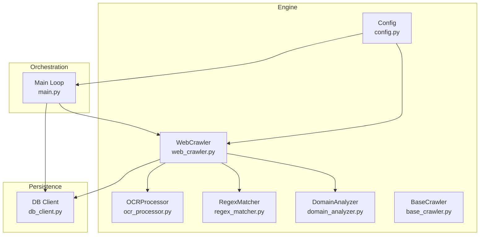
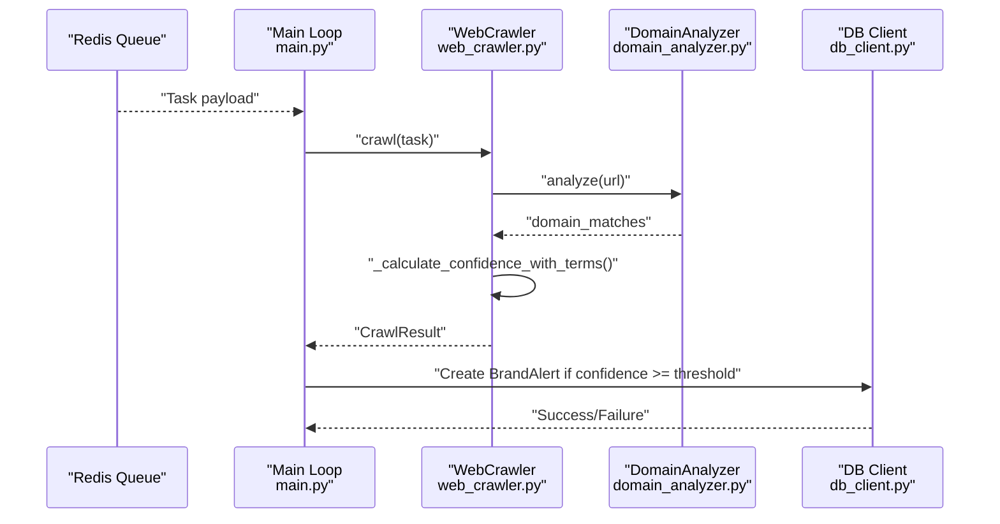
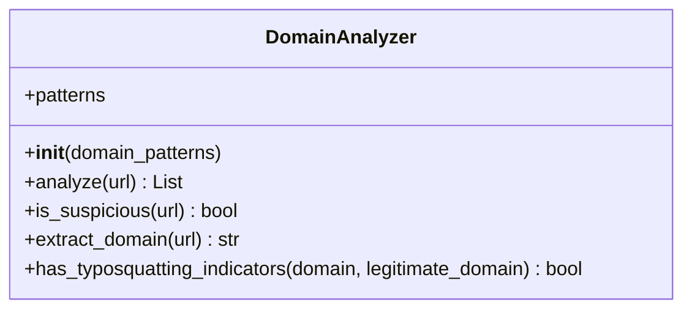
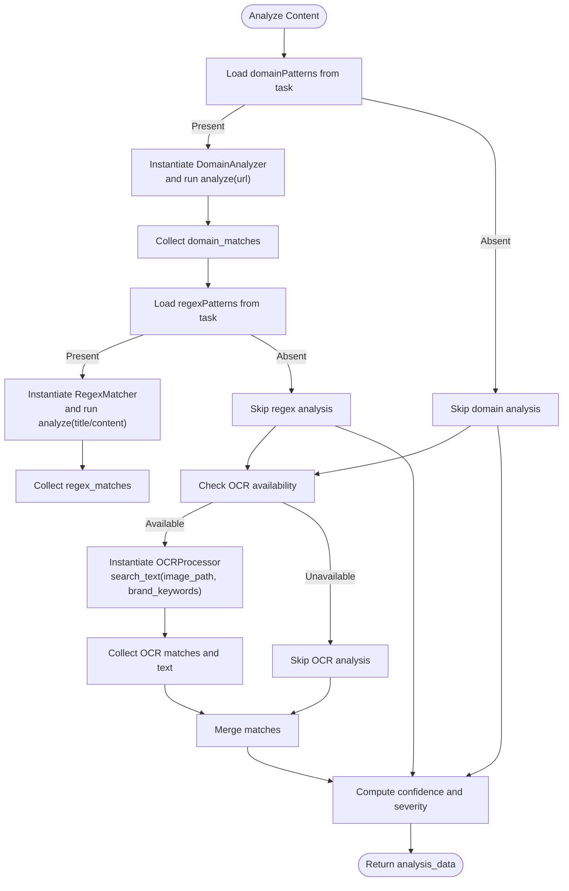
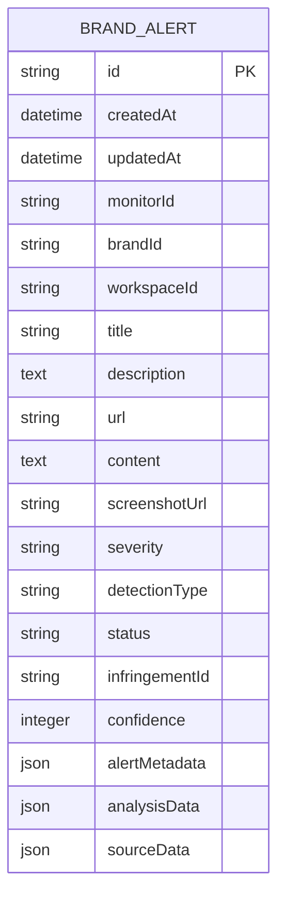
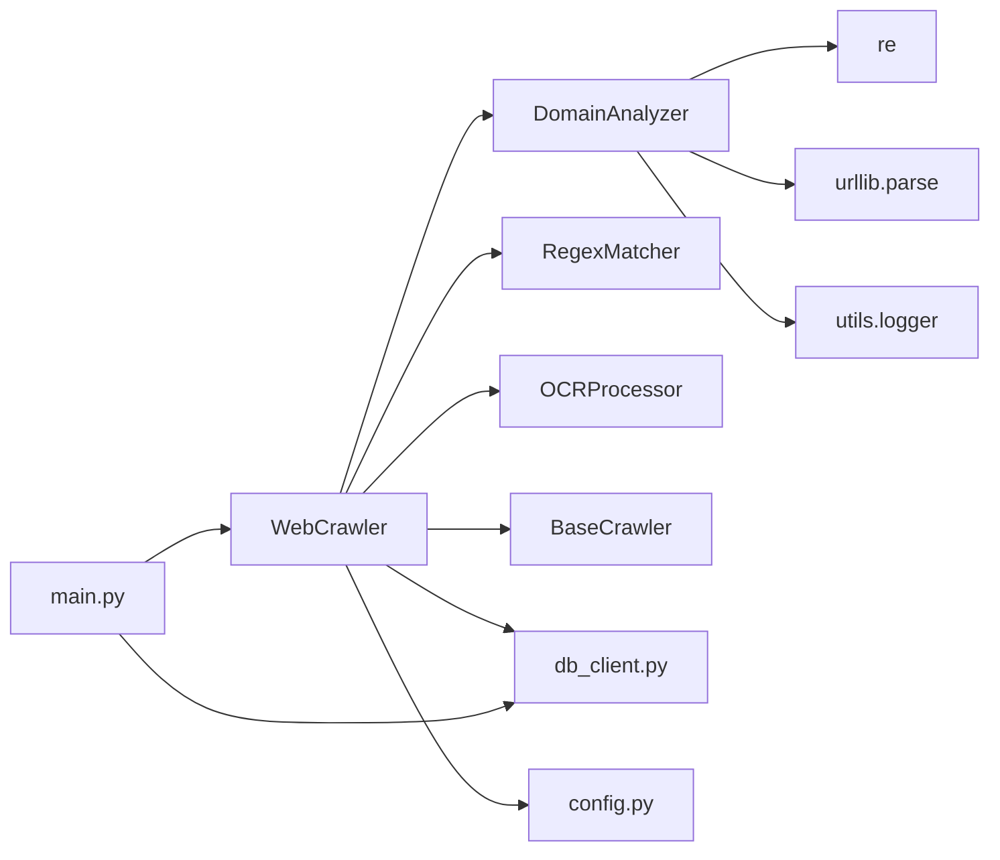

# Domain Analyzer

<cite>
**Referenced Files in This Document**
- [domain_analyzer.py](file://services/engine/analyzers/domain_analyzer.py)
- [web_crawler.py](file://services/engine/crawlers/web_crawler.py)
- [base_crawler.py](file://services/engine/crawlers/base_crawler.py)
- [main.py](file://services/engine/main.py)
- [db_client.py](file://services/engine/utils/db_client.py)
- [config.py](file://services/engine/config.py)
- [regex_matcher.py](file://services/engine/analyzers/regex_matcher.py)
- [ocr_processor.py](file://services/engine/analyzers/ocr_processor.py)
- [validation.ts](file://src/core/modules/eclipse/validation.ts)
</cite>

## Table of Contents
1. [Introduction](#introduction)
2. [Project Structure](#project-structure)
3. [Core Components](#core-components)
4. [Architecture Overview](#architecture-overview)
5. [Detailed Component Analysis](#detailed-component-analysis)
6. [Dependency Analysis](#dependency-analysis)
7. [Performance Considerations](#performance-considerations)
8. [Troubleshooting Guide](#troubleshooting-guide)
9. [Conclusion](#conclusion)
10. [Appendices](#appendices)

## Introduction
This document explains the Domain Analyzer module responsible for threat intelligence lookups and domain reputation analysis. It focuses on how domain_analyzer.py extracts and validates domain information from crawled content, performs pattern-based matching against configured domain patterns, and integrates with the broader engine to produce detection results stored in the database. It also documents the input data format from the web crawler, the analysis logic for identifying suspicious domains, the output structure of detection results, configuration options, error handling, performance considerations, and extensibility points for adding new reputation sources.

## Project Structure
The Domain Analyzer lives under services/engine/analyzers and is consumed by the Web Crawler, which orchestrates the full detection pipeline. Results are persisted via db_client.py and managed by the main engine loop.

**Diagram sources**
- [web_crawler.py](file://services/engine/crawlers/web_crawler.py#L242-L288)
- [domain_analyzer.py](file://services/engine/analyzers/domain_analyzer.py#L1-L120)
- [regex_matcher.py](file://services/engine/analyzers/regex_matcher.py#L1-L70)
- [ocr_processor.py](file://services/engine/analyzers/ocr_processor.py#L1-L150)
- [base_crawler.py](file://services/engine/crawlers/base_crawler.py#L1-L159)
- [config.py](file://services/engine/config.py#L1-L78)
- [db_client.py](file://services/engine/utils/db_client.py#L1-L100)
- [main.py](file://services/engine/main.py#L44-L193)

**Section sources**
- [domain_analyzer.py](file://services/engine/analyzers/domain_analyzer.py#L1-L120)
- [web_crawler.py](file://services/engine/crawlers/web_crawler.py#L1-L358)
- [base_crawler.py](file://services/engine/crawlers/base_crawler.py#L1-L159)
- [main.py](file://services/engine/main.py#L44-L193)
- [db_client.py](file://services/engine/utils/db_client.py#L1-L100)
- [config.py](file://services/engine/config.py#L1-L78)
- [regex_matcher.py](file://services/engine/analyzers/regex_matcher.py#L1-L70)
- [ocr_processor.py](file://services/engine/analyzers/ocr_processor.py#L1-L150)

## Core Components
- DomainAnalyzer: Implements wildcard-to-regex conversion and domain pattern matching. Provides helpers to extract domains and detect typosquatting indicators.
- WebCrawler: Orchestrates crawling, content extraction, and analysis. It invokes DomainAnalyzer during content analysis and aggregates confidence and severity.
- BaseCrawler: Defines confidence calculation and severity determination logic used by WebCrawler.
- db_client.py: Provides SQLAlchemy models and session management for persisting BrandAlert records.
- main.py: Coordinates task consumption, crawling, and persistence to the database.
- config.py: Centralizes environment-driven configuration for timeouts, concurrency, OCR languages, and thresholds.
- regex_matcher.py: Regex-based content matching used alongside domain analysis.
- ocr_processor.py: Optional OCR extraction and keyword search used to corroborate detections.

**Section sources**
- [domain_analyzer.py](file://services/engine/analyzers/domain_analyzer.py#L1-L120)
- [web_crawler.py](file://services/engine/crawlers/web_crawler.py#L214-L358)
- [base_crawler.py](file://services/engine/crawlers/base_crawler.py#L89-L159)
- [db_client.py](file://services/engine/utils/db_client.py#L1-L100)
- [main.py](file://services/engine/main.py#L44-L193)
- [config.py](file://services/engine/config.py#L1-L78)
- [regex_matcher.py](file://services/engine/analyzers/regex_matcher.py#L1-L70)
- [ocr_processor.py](file://services/engine/analyzers/ocr_processor.py#L1-L150)

## Architecture Overview
The Domain Analyzer participates in the Web Crawler’s content analysis pipeline. The crawler extracts metadata and links, runs domain pattern matching, and optionally performs OCR to corroborate findings. Confidence and severity are computed, and results are persisted as BrandAlert entries.

**Diagram sources**
- [main.py](file://services/engine/main.py#L44-L193)
- [web_crawler.py](file://services/engine/crawlers/web_crawler.py#L214-L358)
- [domain_analyzer.py](file://services/engine/analyzers/domain_analyzer.py#L38-L82)

## Detailed Component Analysis

### DomainAnalyzer
Implements:
- Wildcard-to-regex conversion for domain patterns.
- URL parsing and domain extraction.
- Pattern matching against URLs.
- Typosquatting detection heuristics.

Key behaviors:
- Converts patterns like "*fake-nike*" into regex equivalents.
- Matches domains case-insensitively.
- Extracts raw domain from URL and exposes a static extractor.
- Detects typosquatting by normalization and substring checks.

**Diagram sources**
- [domain_analyzer.py](file://services/engine/analyzers/domain_analyzer.py#L1-L120)

**Section sources**
- [domain_analyzer.py](file://services/engine/analyzers/domain_analyzer.py#L1-L120)

### WebCrawler Content Analysis
The crawler’s _analyze_content method integrates DomainAnalyzer with other analyzers:
- Domain pattern matching: Uses task-supplied domainPatterns to instantiate DomainAnalyzer and collect matches.
- Regex matching: Uses RegexMatcher against page title and content.
- OCR matching: Uses OCRProcessor to search for brand keywords in screenshots when available.

Confidence calculation:
- Aggregates contributions from regex matches, domain matches, and OCR confirmations.
- Applies bonuses for cross-validation (both regex and OCR present).
- Caps confidence at 100.

Severity determination:
- Uses BaseCrawler.determine_severity based on confidence and match types.

**Diagram sources**
- [web_crawler.py](file://services/engine/crawlers/web_crawler.py#L214-L358)
- [regex_matcher.py](file://services/engine/analyzers/regex_matcher.py#L1-L70)
- [ocr_processor.py](file://services/engine/analyzers/ocr_processor.py#L103-L145)
- [base_crawler.py](file://services/engine/crawlers/base_crawler.py#L89-L159)

**Section sources**
- [web_crawler.py](file://services/engine/crawlers/web_crawler.py#L214-L358)
- [regex_matcher.py](file://services/engine/analyzers/regex_matcher.py#L1-L70)
- [ocr_processor.py](file://services/engine/analyzers/ocr_processor.py#L1-L150)
- [base_crawler.py](file://services/engine/crawlers/base_crawler.py#L89-L159)

### Persistence and Output Structure
Results are persisted as BrandAlert records with:
- Identification fields: workspaceId, brandId, monitorId.
- Detection metadata: title, description, url, content, screenshotUrl.
- Severity and confidence.
- Status and detectionType.
- analysisData containing regex_matches, domain_matches, OCR fields, and metadata.

The main loop conditionally creates BrandAlert entries when confidence meets or exceeds the task threshold.

**Diagram sources**
- [db_client.py](file://services/engine/utils/db_client.py#L17-L43)

**Section sources**
- [db_client.py](file://services/engine/utils/db_client.py#L17-L43)
- [main.py](file://services/engine/main.py#L129-L149)

### Input Data Format from the Web Crawler
- Task payload keys used by the crawler include:
  - url: Target URL to crawl.
  - monitorId, brandId, workspaceId: Context identifiers.
  - searchTerms: Terms used for confidence calculation and OCR verification.
  - domainPatterns: Wildcard patterns for domain matching.
  - regexPatterns: Regex patterns for content/title matching.
  - enableScreenshots, enableOCR: Feature toggles.
  - confidenceThreshold: Integer percentage threshold for alert creation.

These keys are propagated from the frontend validation schema for Eclipse monitors.

**Section sources**
- [web_crawler.py](file://services/engine/crawlers/web_crawler.py#L70-L175)
- [web_crawler.py](file://services/engine/crawlers/web_crawler.py#L214-L288)
- [validation.ts](file://src/core/modules/eclipse/validation.ts#L27-L50)

### Output Structure of Detection Results
- CrawlResult fields include success, error, url, title, description, content, screenshot_path, metadata, analysis_data, confidence, severity, and timestamp.
- analysis_data contains:
  - regex_matches: Matches from RegexMatcher.
  - domain_matches: Matches from DomainAnalyzer.
  - ocr_text, ocr_matches, ocr_confidence: From OCRProcessor when available.
- The main loop writes BrandAlert records with detectionType set appropriately and stores analysisData for later review.

**Section sources**
- [base_crawler.py](file://services/engine/crawlers/base_crawler.py#L9-L48)
- [web_crawler.py](file://services/engine/crawlers/web_crawler.py#L214-L288)
- [main.py](file://services/engine/main.py#L129-L149)

### Configuration Options
- Crawler and runtime:
  - SENTINEL_CRAWLER_TIMEOUT: Page load timeout in milliseconds.
  - SENTINEL_MAX_CONCURRENT_CRAWLS: Concurrency cap for crawling.
  - SENTINEL_PLAYWRIGHT_HEADLESS: Headless browser toggle.
  - SENTINEL_SCREENSHOT_DIR: Directory for saving screenshots.
  - SENTINEL_TESSERACT_LANG: OCR language configuration.
  - SENTINEL_MIN_CONFIDENCE: Minimum confidence threshold for alerts.
  - LOG_LEVEL, LOG_FILE, LOG_RETENTION_DAYS: Logging controls.
  - ELK_ENABLED, LOGSTASH_HOST, LOGSTASH_PORT: Centralized logging.
  - SENTRY_DSN, SENTRY_ENVIRONMENT, SENTRY_TRACES_SAMPLE_RATE: Error tracking.
  - S3_ENDPOINT, S3_REGION, S3_ACCESS_KEY, S3_SECRET_KEY, S3_BUCKET_DEV/PROD, S3_PUBLIC_URL: Storage configuration.

- Task-level thresholds:
  - confidenceThreshold: Integer percentage used in main loop to decide alert creation.

**Section sources**
- [config.py](file://services/engine/config.py#L1-L78)
- [main.py](file://services/engine/main.py#L96-L103)

### Error Handling
- DomainAnalyzer:
  - Logs invalid domain patterns and returns empty matches on exceptions.
- WebCrawler:
  - Handles Playwright timeouts and general exceptions, returning CrawlResult with error details.
  - Extracts metadata safely and logs failures.
- BaseCrawler:
  - Provides robust confidence and severity calculations with safe fallbacks.
- db_client.py:
  - Wraps database operations in a context manager, rolling back on exceptions and logging errors.
- main.py:
  - Updates monitor status on failures, logs errors, and continues processing.

**Section sources**
- [domain_analyzer.py](file://services/engine/analyzers/domain_analyzer.py#L38-L82)
- [web_crawler.py](file://services/engine/crawlers/web_crawler.py#L161-L175)
- [web_crawler.py](file://services/engine/crawlers/web_crawler.py#L176-L213)
- [base_crawler.py](file://services/engine/crawlers/base_crawler.py#L89-L159)
- [db_client.py](file://services/engine/utils/db_client.py#L59-L77)
- [main.py](file://services/engine/main.py#L165-L191)

### Performance Considerations
- DomainAnalyzer:
  - Regex compilation occurs once per analyzer initialization; pattern count impacts startup cost.
  - Matching is O(n) over patterns per URL; keep domainPatterns concise.
- WebCrawler:
  - Concurrency controlled by SENTINEL_MAX_CONCURRENT_CRAWLS.
  - Timeouts configured via SENTINEL_CRAWLER_TIMEOUT to prevent long hangs.
  - OCR is optional and disabled when pytesseract is unavailable.
- Persistence:
  - SQLAlchemy sessions are short-lived and rolled back on errors to avoid leaks.
- Confidence computation:
  - Linear-time aggregation across match sets; minimal overhead.

**Section sources**
- [domain_analyzer.py](file://services/engine/analyzers/domain_analyzer.py#L12-L37)
- [web_crawler.py](file://services/engine/crawlers/web_crawler.py#L1-L46)
- [config.py](file://services/engine/config.py#L24-L35)
- [db_client.py](file://services/engine/utils/db_client.py#L59-L77)

### Extensibility Points for Adding New Reputation Sources
Current implementation focuses on:
- Pattern-based domain matching (wildcards).
- Regex-based content matching.
- Optional OCR corroboration.

To integrate external threat intelligence APIs (e.g., WHOIS lookups, blocklists, or reputation feeds), extend DomainAnalyzer or introduce a new analyzer module:
- Add a new analyzer class (e.g., ThreatIntelAnalyzer) that accepts API keys and endpoints via configuration.
- Integrate calls in WebCrawler._analyze_content alongside existing analyzers.
- Append results to analysis_data and adjust confidence/weighting in _calculate_confidence_with_terms.
- Persist new fields in BrandAlert via analysisData or dedicated columns if needed.

[No sources needed since this section provides general guidance]

## Dependency Analysis
DomainAnalyzer depends on:
- urllib.parse for URL parsing.
- re for regex compilation and matching.
- utils.logger for structured logging.

WebCrawler depends on:
- DomainAnalyzer, RegexMatcher, and OCRProcessor.
- BaseCrawler for confidence and severity logic.
- db_client for persistence.
- config for runtime settings.

**Diagram sources**
- [domain_analyzer.py](file://services/engine/analyzers/domain_analyzer.py#L1-L120)
- [web_crawler.py](file://services/engine/crawlers/web_crawler.py#L1-L175)
- [base_crawler.py](file://services/engine/crawlers/base_crawler.py#L1-L88)
- [db_client.py](file://services/engine/utils/db_client.py#L1-L100)
- [config.py](file://services/engine/config.py#L1-L78)
- [main.py](file://services/engine/main.py#L44-L193)

**Section sources**
- [domain_analyzer.py](file://services/engine/analyzers/domain_analyzer.py#L1-L120)
- [web_crawler.py](file://services/engine/crawlers/web_crawler.py#L1-L175)
- [base_crawler.py](file://services/engine/crawlers/base_crawler.py#L1-L88)
- [db_client.py](file://services/engine/utils/db_client.py#L1-L100)
- [config.py](file://services/engine/config.py#L1-L78)
- [main.py](file://services/engine/main.py#L44-L193)

## Performance Considerations
- Keep domainPatterns minimal and specific to reduce regex compilation and matching costs.
- Tune SENTINEL_CRAWLER_TIMEOUT to balance responsiveness and reliability.
- Control concurrency with SENTINEL_MAX_CONCURRENT_CRAWLS to avoid resource contention.
- Disable OCR when not needed to save CPU and memory.
- Use efficient regex patterns; avoid overly broad patterns that cause backtracking.

[No sources needed since this section provides general guidance]

## Troubleshooting Guide
Common issues and resolutions:
- Invalid domain patterns:
  - Symptom: Pattern compilation errors logged.
  - Resolution: Fix wildcard syntax; ensure patterns are valid regex.
- Network failures during crawling:
  - Symptom: CrawlResult with error and timeout handling.
  - Resolution: Increase timeout, retry, or adjust proxy/headless settings.
- OCR not available:
  - Symptom: Warning about missing pytesseract; OCR disabled.
  - Resolution: Install pytesseract and Tesseract binaries; configure path if needed.
- Database errors:
  - Symptom: Exceptions caught and logged; session rolled back.
  - Resolution: Inspect DATABASE_URL and credentials; verify connectivity.
- Alerts not created:
  - Symptom: Confidence below threshold.
  - Resolution: Adjust confidenceThreshold or improve match quality.

**Section sources**
- [domain_analyzer.py](file://services/engine/analyzers/domain_analyzer.py#L21-L37)
- [web_crawler.py](file://services/engine/crawlers/web_crawler.py#L161-L175)
- [ocr_processor.py](file://services/engine/analyzers/ocr_processor.py#L1-L42)
- [db_client.py](file://services/engine/utils/db_client.py#L59-L77)
- [main.py](file://services/engine/main.py#L96-L103)

## Conclusion
The Domain Analyzer provides a lightweight, extensible foundation for domain reputation analysis within the engine. It complements regex and OCR analysis in the Web Crawler to compute confidence and severity, and persists actionable results as BrandAlert entries. While the current implementation focuses on pattern-based matching, the architecture readily accommodates integration with external threat intelligence APIs by extending analyzers and adjusting scoring logic.

[No sources needed since this section summarizes without analyzing specific files]

## Appendices

### Concrete Code Example Paths
- Domain pattern matching invocation:
  - [web_crawler.py](file://services/engine/crawlers/web_crawler.py#L242-L250)
- Confidence calculation with domain matches:
  - [web_crawler.py](file://services/engine/crawlers/web_crawler.py#L325-L358)
- Severity determination:
  - [base_crawler.py](file://services/engine/crawlers/base_crawler.py#L131-L159)
- Persistence of detection results:
  - [main.py](file://services/engine/main.py#L129-L149)
  - [db_client.py](file://services/engine/utils/db_client.py#L17-L43)

### Configuration Reference
- Runtime settings:
  - [config.py](file://services/engine/config.py#L24-L46)
- Task-level thresholds:
  - [main.py](file://services/engine/main.py#L96-L103)
- Frontend monitor schema (domainPatterns, confidenceThreshold):
  - [validation.ts](file://src/core/modules/eclipse/validation.ts#L27-L50)