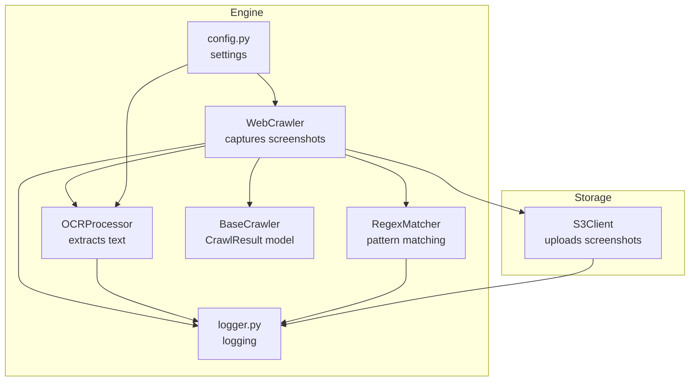
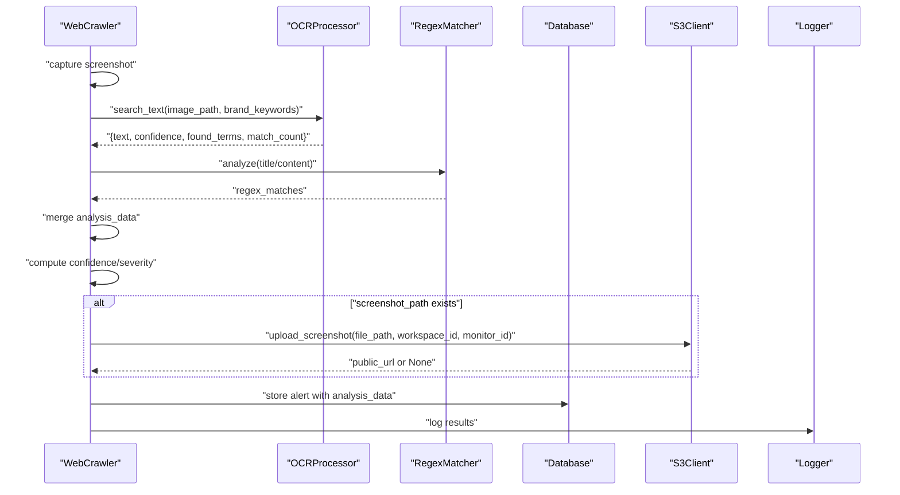
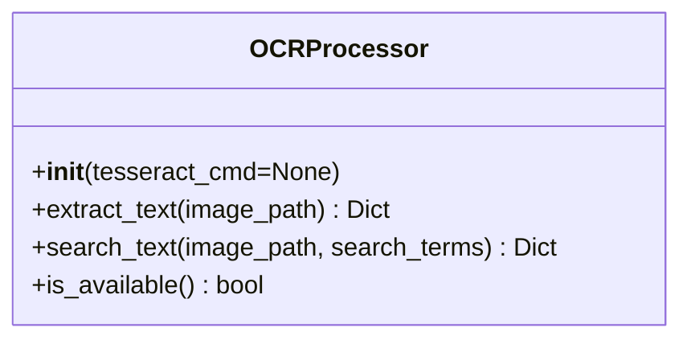
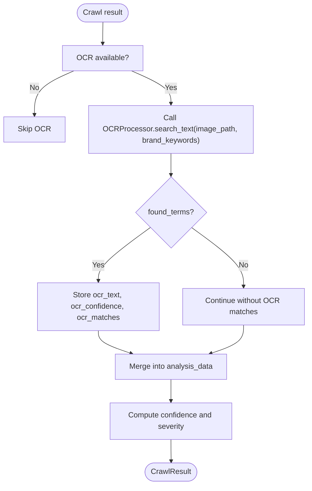
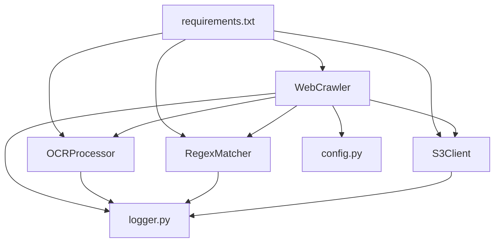

# OCR Processor

<cite>
**Referenced Files in This Document**
- [ocr_processor.py](file://services/engine/analyzers/ocr_processor.py)
- [web_crawler.py](file://services/engine/crawlers/web_crawler.py)
- [base_crawler.py](file://services/engine/crawlers/base_crawler.py)
- [s3_client.py](file://services/engine/utils/s3_client.py)
- [logger.py](file://services/engine/utils/logger.py)
- [config.py](file://services/engine/config.py)
- [main.py](file://services/engine/main.py)
- [regex_matcher.py](file://services/engine/analyzers/regex_matcher.py)
- [requirements.txt](file://services/engine/requirements.txt)
- [README.md](file://services/engine/README.md)
</cite>

## Table of Contents
1. [Introduction](#introduction)
2. [Project Structure](#project-structure)
3. [Core Components](#core-components)
4. [Architecture Overview](#architecture-overview)
5. [Detailed Component Analysis](#detailed-component-analysis)
6. [Dependency Analysis](#dependency-analysis)
7. [Performance Considerations](#performance-considerations)
8. [Troubleshooting Guide](#troubleshooting-guide)
9. [Conclusion](#conclusion)

## Introduction
This document explains the OCR Processor module responsible for extracting text from images captured during web crawling. It covers how the OCR pipeline integrates with the web crawler, how images are prepared and processed, how results are structured and logged, and how downstream analyzers consume OCR outputs. It also documents configuration parameters, error handling, and performance optimization strategies.

## Project Structure
The OCR Processor lives under analyzers and is orchestrated by the Web Crawler. The crawler captures screenshots, runs OCR, and aggregates results alongside regex and domain analysis. Results are stored and later used to compute confidence and severity.

**Diagram sources**
- [web_crawler.py](file://services/engine/crawlers/web_crawler.py#L70-L175)
- [ocr_processor.py](file://services/engine/analyzers/ocr_processor.py#L1-L150)
- [regex_matcher.py](file://services/engine/analyzers/regex_matcher.py#L1-L70)
- [base_crawler.py](file://services/engine/crawlers/base_crawler.py#L1-L159)
- [s3_client.py](file://services/engine/utils/s3_client.py#L1-L160)
- [logger.py](file://services/engine/utils/logger.py#L1-L40)
- [config.py](file://services/engine/config.py#L1-L78)

**Section sources**
- [README.md](file://services/engine/README.md#L1-L120)

## Core Components
- OCRProcessor: Extracts text from images and searches for brand keywords, returning structured results with confidence and counts.
- WebCrawler: Orchestrates capture, OCR, and analysis; computes confidence and severity.
- RegexMatcher: Provides pattern detection used alongside OCR.
- S3Client: Uploads screenshots to S3/MinIO for persistence and downstream use.
- Logger: Centralized logging via Loguru.
- Config: Provides OCR language, thresholds, and other runtime settings.

**Section sources**
- [ocr_processor.py](file://services/engine/analyzers/ocr_processor.py#L1-L150)
- [web_crawler.py](file://services/engine/crawlers/web_crawler.py#L214-L288)
- [regex_matcher.py](file://services/engine/analyzers/regex_matcher.py#L1-L70)
- [s3_client.py](file://services/engine/utils/s3_client.py#L1-L160)
- [logger.py](file://services/engine/utils/logger.py#L1-L40)
- [config.py](file://services/engine/config.py#L36-L46)

## Architecture Overview
The OCR pipeline is invoked by the Web Crawler after capturing a full-page screenshot. The crawler passes the screenshot path and brand keywords to the OCR processor, which returns extracted text, confidence, and keyword occurrences. These results are merged into the analysis data and used to compute confidence and severity.

**Diagram sources**
- [web_crawler.py](file://services/engine/crawlers/web_crawler.py#L109-L156)
- [web_crawler.py](file://services/engine/crawlers/web_crawler.py#L214-L288)
- [ocr_processor.py](file://services/engine/analyzers/ocr_processor.py#L43-L145)
- [regex_matcher.py](file://services/engine/analyzers/regex_matcher.py#L32-L62)
- [s3_client.py](file://services/engine/utils/s3_client.py#L42-L105)
- [main.py](file://services/engine/main.py#L102-L149)

## Detailed Component Analysis

### OCRProcessor
- Purpose: Extract text from images and search for brand keywords; return structured results with confidence and counts.
- Initialization:
  - Attempts to import pytesseract; logs warnings if unavailable.
  - Optionally sets tesseract command path and validates availability.
- Methods:
  - extract_text(image_path): Reads image, runs OCR, computes average confidence from word-level confidence scores, and returns text, confidence, word count, and error field.
  - search_text(image_path, search_terms): Calls extract_text and scans the text for occurrences of each term, returning found terms with counts and positions, plus total match count.
  - is_available(): Static method indicating OCR availability.

**Diagram sources**
- [ocr_processor.py](file://services/engine/analyzers/ocr_processor.py#L1-L150)

**Section sources**
- [ocr_processor.py](file://services/engine/analyzers/ocr_processor.py#L1-L150)

### WebCrawler Integration
- Screenshot capture: Full-page PNG saved to disk.
- OCR invocation: When OCR is available and brand keywords are present, the crawler calls OCRProcessor.search_text and stores:
  - ocr_text: Snippet of extracted text
  - ocr_confidence: Average confidence from OCR
  - ocr_matches: Found terms with counts and positions
- Confidence calculation: The crawler’s confidence function adds points for OCR matches and cross-validates with regex matches.

**Diagram sources**
- [web_crawler.py](file://services/engine/crawlers/web_crawler.py#L272-L287)
- [ocr_processor.py](file://services/engine/analyzers/ocr_processor.py#L103-L145)

**Section sources**
- [web_crawler.py](file://services/engine/crawlers/web_crawler.py#L109-L156)
- [web_crawler.py](file://services/engine/crawlers/web_crawler.py#L272-L287)
- [ocr_processor.py](file://services/engine/analyzers/ocr_processor.py#L43-L145)

### RegexMatcher Integration
- Used to detect brand-related patterns in page title and content.
- Results are merged into analysis_data and influence confidence computation.

**Section sources**
- [regex_matcher.py](file://services/engine/analyzers/regex_matcher.py#L1-L70)
- [web_crawler.py](file://services/engine/crawlers/web_crawler.py#L251-L269)

### Screenshot Upload and Persistence
- After successful crawl, the engine attempts to upload the screenshot to S3/MinIO and replaces the local path with a public URL.
- If upload fails, it falls back to using the local path.

**Section sources**
- [s3_client.py](file://services/engine/utils/s3_client.py#L42-L105)
- [main.py](file://services/engine/main.py#L102-L149)

### Logging and Structured Output
- Logger is configured via Loguru with console and optional file handlers.
- OCRProcessor logs debug messages with character counts and confidence; errors are logged with stack traces.
- WebCrawler logs OCR results and confidence updates.

**Section sources**
- [logger.py](file://services/engine/utils/logger.py#L1-L40)
- [ocr_processor.py](file://services/engine/analyzers/ocr_processor.py#L86-L101)
- [web_crawler.py](file://services/engine/crawlers/web_crawler.py#L280-L286)

## Dependency Analysis
- OCRProcessor depends on:
  - Pillow (PIL) for image handling
  - pytesseract for OCR
  - Logger for diagnostics
- WebCrawler depends on:
  - OCRProcessor for text extraction
  - RegexMatcher for pattern detection
  - S3Client for screenshot persistence
  - Config for timeouts and thresholds
  - Logger for telemetry
- BaseCrawler defines the CrawlResult structure consumed by downstream logic.

**Diagram sources**
- [requirements.txt](file://services/engine/requirements.txt#L1-L39)
- [ocr_processor.py](file://services/engine/analyzers/ocr_processor.py#L1-L150)
- [web_crawler.py](file://services/engine/crawlers/web_crawler.py#L1-L175)
- [regex_matcher.py](file://services/engine/analyzers/regex_matcher.py#L1-L70)
- [s3_client.py](file://services/engine/utils/s3_client.py#L1-L160)
- [config.py](file://services/engine/config.py#L1-L78)
- [logger.py](file://services/engine/utils/logger.py#L1-L40)

**Section sources**
- [requirements.txt](file://services/engine/requirements.txt#L1-L39)
- [config.py](file://services/engine/config.py#L36-L46)

## Performance Considerations
- OCR cost: OCR runs per screenshot; CPU and memory usage increase with image size and resolution.
- Recommendations:
  - Limit concurrent crawlers per container to balance resource usage.
  - Clean up local screenshots after upload to S3/MinIO.
  - Use appropriate tesseract language packs to improve accuracy and reduce retries.
  - Consider batching OCR calls if extending to multiple images concurrently (see Performance Optimization section in README).
- Disk footprint: Screenshots are stored locally until uploaded; ensure adequate disk space and periodic cleanup.

**Section sources**
- [README.md](file://services/engine/README.md#L277-L307)
- [main.py](file://services/engine/main.py#L114-L124)

## Troubleshooting Guide
- OCR not available:
  - Ensure pytesseract is installed and tesseract binary is accessible.
  - Set TESSERACT_CMD if not in PATH.
- Tesseract not found:
  - Install tesseract-ocr and language packs (e.g., eng, por).
- Corrupted or unsupported images:
  - OCRProcessor returns an error field; downstream logic should handle empty text and zero confidence gracefully.
- OCR failures:
  - Errors are logged with stack traces; verify image readability and language settings.
- S3 upload failures:
  - S3Client logs detailed errors; verify endpoint, credentials, and bucket permissions.

**Section sources**
- [ocr_processor.py](file://services/engine/analyzers/ocr_processor.py#L27-L42)
- [ocr_processor.py](file://services/engine/analyzers/ocr_processor.py#L52-L101)
- [s3_client.py](file://services/engine/utils/s3_client.py#L106-L127)
- [README.md](file://services/engine/README.md#L210-L219)

## Conclusion
The OCR Processor integrates tightly with the Web Crawler to extract text from screenshots and validate brand keywords. It returns structured results with confidence and keyword occurrences, which are combined with regex and domain analysis to compute confidence and severity. Proper configuration of tesseract languages and thresholds, robust error handling, and efficient screenshot lifecycle management are essential for reliable OCR-driven detection.