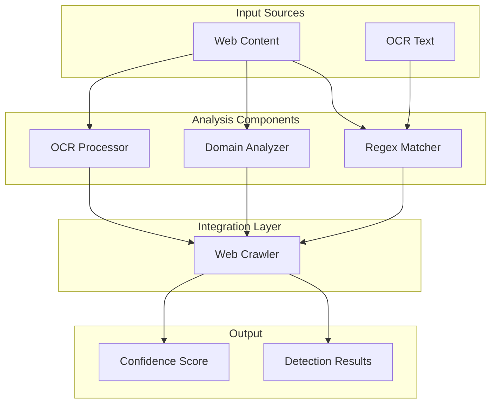
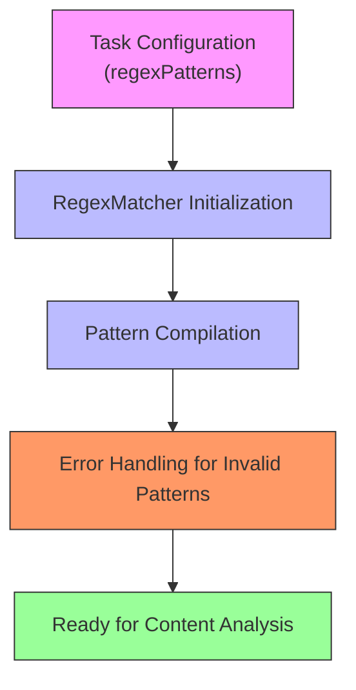
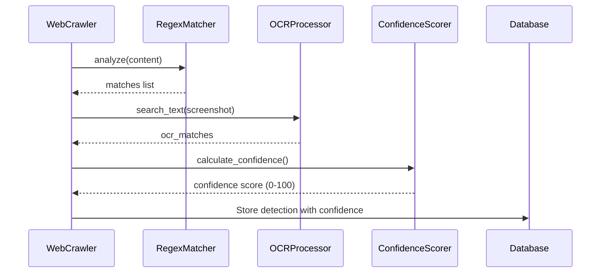

# Regex Matcher

<cite>
**Referenced Files in This Document**   
- [regex_matcher.py](file://services/engine/analyzers/regex_matcher.py)
- [config.py](file://services/engine/config.py)
- [domain_analyzer.py](file://services/engine/analyzers/domain_analyzer.py)
- [web_crawler.py](file://services/engine/crawlers/web_crawler.py)
- [ocr_processor.py](file://services/engine/analyzers/ocr_processor.py)
</cite>

## Table of Contents
1. [Introduction](#introduction)
2. [Core Components](#core-components)
3. [Architecture Overview](#architecture-overview)
4. [Detailed Component Analysis](#detailed-component-analysis)
5. [Rule Configuration System](#rule-configuration-system)
6. [Performance Optimizations](#performance-optimizations)
7. [Detection Results Output Format](#detection-results-output-format)
8. [Integration with Domain Analyzer](#integration-with-domain-analyzer)
9. [Configuration Options](#configuration-options)
10. [Scalability and Extensibility](#scalability-and-extensibility)

## Introduction
The Regex Matcher module is a critical component of the Sentineliq system designed to identify sensitive patterns in unstructured data. It applies predefined regular expressions to detect credentials, personally identifiable information (PII), and other regulated data within crawled content and OCR output. This document provides a comprehensive analysis of the implementation in regex_matcher.py, including the rule configuration system, performance optimizations, detection results format, and integration with other components.

## Core Components
The Regex Matcher module consists of several key components that work together to detect sensitive patterns in unstructured data. The primary component is the RegexMatcher class, which handles the core pattern matching functionality. This class is integrated with the web crawler and OCR processor to provide comprehensive detection capabilities across different data sources.

**Section sources**
- [regex_matcher.py](file://services/engine/analyzers/regex_matcher.py#L8-L70)
- [web_crawler.py](file://services/engine/crawlers/web_crawler.py#L14-L358)

## Architecture Overview
The Regex Matcher module is part of a larger system that includes web crawling, OCR processing, and domain analysis components. The architecture follows a modular design where each component has a specific responsibility and can be used independently or in combination with others.



**Diagram sources**
- [regex_matcher.py](file://services/engine/analyzers/regex_matcher.py#L8-L70)
- [domain_analyzer.py](file://services/engine/analyzers/domain_analyzer.py#L9-L120)
- [ocr_processor.py](file://services/engine/analyzers/ocr_processor.py#L17-L150)
- [web_crawler.py](file://services/engine/crawlers/web_crawler.py#L14-L358)

## Detailed Component Analysis

### Regex Matcher Implementation
The RegexMatcher class is the core component responsible for applying regular expressions to detect sensitive patterns in text content. It is initialized with a list of regex patterns and compiles them for efficient matching.

```mermaid
classDiagram
class RegexMatcher {
+patterns : List[Dict[str, Any]]
+__init__(patterns : List[str])
+analyze(content : str) List[Dict[str, Any]]
+has_match(content : str) bool
}
RegexMatcher : +patterns : List[Dict[str, Any]]
RegexMatcher : +__init__(patterns : List[str])
RegexMatcher : +analyze(content : str) List[Dict[str, Any]]
RegexMatcher : +has_match(content : str) bool
```

**Diagram sources**
- [regex_matcher.py](file://services/engine/analyzers/regex_matcher.py#L8-L70)

#### Pattern Matching Process
The analyze method processes text content against all configured regex patterns and returns detailed information about matches found. The process includes:

1. Iterating through each compiled regex pattern
2. Finding all matches in the content using findall
3. Deduplicating matches and limiting to first 10 results
4. Returning match details including pattern, matches, and count

The has_match method provides a quick check to determine if any pattern matches the content, using search for early termination when a match is found.

**Section sources**
- [regex_matcher.py](file://services/engine/analyzers/regex_matcher.py#L32-L69)

## Rule Configuration System
The rule configuration system allows for flexible definition of regex patterns through task configuration. Patterns are passed to the RegexMatcher during initialization from the task payload, enabling dynamic configuration based on monitoring requirements.

The system supports multiple pattern types including:
- Credentials detection (e.g., API keys, passwords)
- PII detection (e.g., email addresses, phone numbers)
- Regulated data detection (e.g., financial information)

Patterns are configured in the web crawler task as part of the regexPatterns field, which is then used to initialize the RegexMatcher instance.



**Diagram sources**
- [regex_matcher.py](file://services/engine/analyzers/regex_matcher.py#L11-L30)
- [web_crawler.py](file://services/engine/crawlers/web_crawler.py#L252-L269)

## Performance Optimizations
The Regex Matcher implements several performance optimizations to ensure efficient pattern matching, especially when scanning large documents.

### Compiled Regex Patterns
The most significant optimization is the compilation of regex patterns during initialization. Each pattern string is compiled using re.compile with IGNORECASE and MULTILINE flags, which improves matching performance during analysis.

```python
compiled = re.compile(pattern_str, re.IGNORECASE | re.MULTILINE)
```

This approach avoids the overhead of compiling patterns on each analysis call, providing substantial performance benefits when processing multiple documents with the same pattern set.

### Early Termination
The has_match method implements early termination by using search instead of findall. This allows the method to return True as soon as the first match is found, without processing the entire content.

### Match Limiting
To prevent excessive memory usage with high-frequency patterns, the system limits results to the first 10 unique matches:

```python
unique_matches = list(set(found))[:10]
```

This optimization ensures predictable memory usage and response times even with patterns that match thousands of times in a document.

**Section sources**
- [regex_matcher.py](file://services/engine/analyzers/regex_matcher.py#L22-L26)
- [regex_matcher.py](file://services/engine/analyzers/regex_matcher.py#L64-L69)
- [regex_matcher.py](file://services/engine/analyzers/regex_matcher.py#L52-L53)

## Detection Results Output Format
The Regex Matcher returns detection results in a structured format that includes context snippets and confidence levels. The output is designed to provide comprehensive information for downstream processing and alerting.

### Result Structure
The analyze method returns a list of dictionaries, each containing:

- pattern: The original regex pattern string
- matches: List of unique matched strings (limited to 10)
- count: Total number of matches found (before deduplication)

This structure allows consumers to understand both the specific instances of matches and the overall frequency of pattern occurrences.

### Confidence Scoring
The system integrates regex matches with other detection methods to calculate a confidence score. In the web crawler, regex matches contribute to the overall confidence score:

- Regex matches: +40 points if found
- Perfect match bonus: +20 points if both regex and OCR confirm

The final confidence score is capped at 100, providing a standardized measure of detection reliability.



**Diagram sources**
- [regex_matcher.py](file://services/engine/analyzers/regex_matcher.py#L42-L63)
- [web_crawler.py](file://services/engine/crawlers/web_crawler.py#L297-L357)

## Integration with Domain Analyzer
The Regex Matcher works in conjunction with the DomainAnalyzer to provide comprehensive detection capabilities. While the Regex Matcher focuses on content analysis, the DomainAnalyzer examines URL domains for suspicious patterns.

### Combined Analysis Workflow
The integration occurs in the web crawler's _analyze_content method, where both analyzers are applied to the same task:

1. Domain patterns are extracted from the task configuration
2. DomainAnalyzer is initialized with these patterns
3. URL is analyzed for domain pattern matches
4. Regex patterns are extracted from the task configuration
5. RegexMatcher is initialized with these patterns
6. Content and title are analyzed for regex matches

This combined approach allows for detection of both domain-based and content-based threats, providing a more comprehensive security analysis.

### Cross-Validation Benefits
The integration enables cross-validation between different detection methods. When both domain and content patterns match, the system can assign higher confidence scores, reducing false positives and improving detection accuracy.

**Section sources**
- [web_crawler.py](file://services/engine/crawlers/web_crawler.py#L242-L271)
- [domain_analyzer.py](file://services/engine/analyzers/domain_analyzer.py#L12-L37)

## Configuration Options
The Regex Matcher system provides several configuration options to control its behavior and adapt to different use cases.

### Rule Activation
Regex patterns are activated through the task configuration's regexPatterns field. This allows for dynamic activation of specific rules based on monitoring requirements.

### Case Sensitivity
All regex patterns are compiled with the re.IGNORECASE flag, making matches case-insensitive by default. This ensures detection regardless of text casing in the source content.

### False Positive Filtering
The system implements several mechanisms to reduce false positives:

- Deduplication of matches using set()
- Limiting results to first 10 matches
- Context-based validation through OCR confirmation
- Confidence scoring that requires multiple detection methods for high scores

These filters help ensure that alerts are meaningful and actionable, reducing the burden on security teams.

**Section sources**
- [regex_matcher.py](file://services/engine/analyzers/regex_matcher.py#L22-L26)
- [regex_matcher.py](file://services/engine/analyzers/regex_matcher.py#L52-L53)
- [web_crawler.py](file://services/engine/crawlers/web_crawler.py#L297-L357)

## Scalability and Extensibility

### Scalability for Large Documents
The Regex Matcher is designed to handle large documents efficiently through several mechanisms:

- Compiled regex patterns for fast matching
- Stream-like processing without loading entire document into memory
- Match limiting to prevent excessive resource usage
- Asynchronous integration with the web crawler

These optimizations ensure that the system can scan large documents without performance degradation or memory issues.

### Extensibility Mechanism
The system provides a flexible extensibility mechanism for custom regex rules:

1. Rules are defined externally in the task configuration
2. The RegexMatcher accepts any valid regex pattern
3. New patterns can be added without code changes
4. Patterns can be activated/deactivated per monitoring task

This design allows security teams to add custom detection rules for specific threats or compliance requirements without modifying the core codebase.

The extensibility is further enhanced by the integration with the OCR processor, allowing for detection in both text content and image-based text, providing comprehensive coverage for sensitive data detection.

**Section sources**
- [regex_matcher.py](file://services/engine/analyzers/regex_matcher.py#L11-L30)
- [web_crawler.py](file://services/engine/crawlers/web_crawler.py#L252-L269)
- [ocr_processor.py](file://services/engine/analyzers/ocr_processor.py#L103-L144)