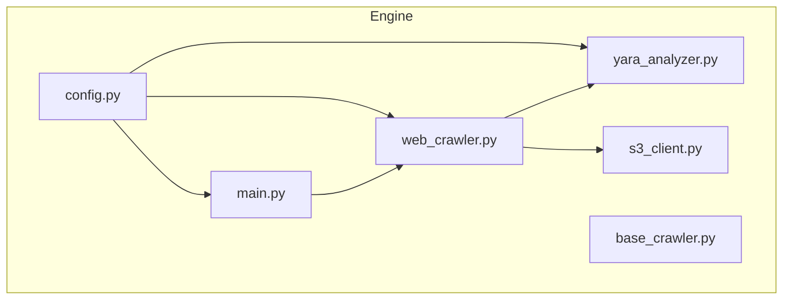
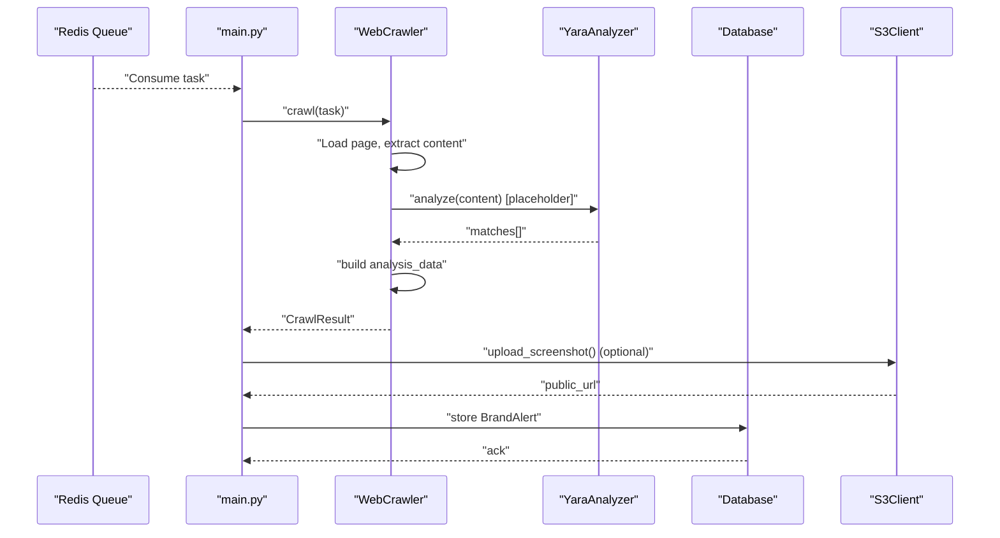
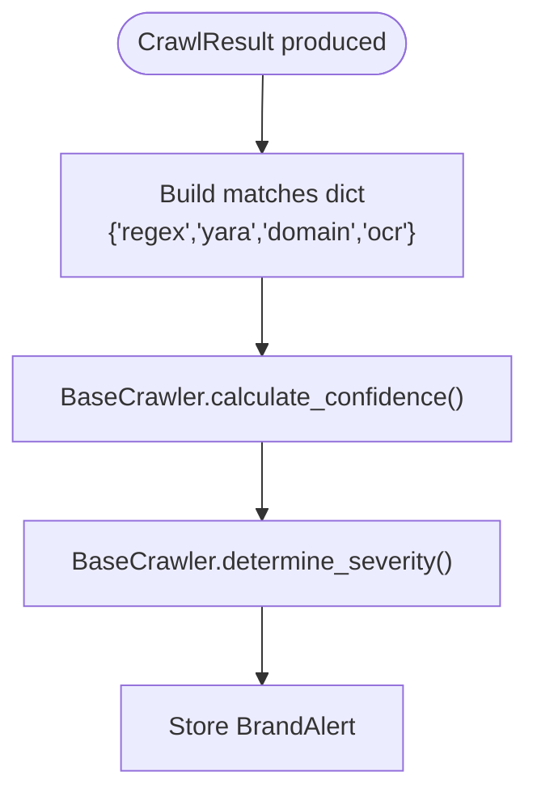
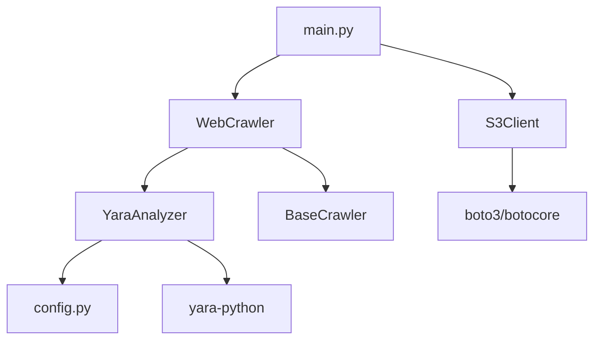

# YARA Analyzer

<cite>
**Referenced Files in This Document**
- [yara_analyzer.py](file://services/engine/analyzers/yara_analyzer.py)
- [web_crawler.py](file://services/engine/crawlers/web_crawler.py)
- [base_crawler.py](file://services/engine/crawlers/base_crawler.py)
- [main.py](file://services/engine/main.py)
- [s3_client.py](file://services/engine/utils/s3_client.py)
- [config.py](file://services/engine/config.py)
- [requirements.txt](file://services/engine/requirements.txt)
- [README.md](file://services/engine/README.md)
</cite>

## Table of Contents
1. [Introduction](#introduction)
2. [Project Structure](#project-structure)
3. [Core Components](#core-components)
4. [Architecture Overview](#architecture-overview)
5. [Detailed Component Analysis](#detailed-component-analysis)
6. [Dependency Analysis](#dependency-analysis)
7. [Performance Considerations](#performance-considerations)
8. [Troubleshooting Guide](#troubleshooting-guide)
9. [Conclusion](#conclusion)
10. [Appendices](#appendices)

## Introduction
This document explains the YARA Analyzer module responsible for signature-based detection of malware and malicious patterns. It covers how the analyzer loads YARA rules from configuration, integrates into the crawling pipeline, and produces structured results consumed by the main processing loop. It also documents configuration options, error handling, performance characteristics, and the workflow for adding and testing new YARA rules.

## Project Structure
The YARA Analyzer lives under the analyzers package and is intended to be integrated alongside other analyzers (regex, domain, OCR) in the web crawler. The main processing loop consumes tasks from Redis, runs the crawler, and stores results to the database.

**Diagram sources**
- [config.py](file://services/engine/config.py#L1-L78)
- [main.py](file://services/engine/main.py#L1-L284)
- [web_crawler.py](file://services/engine/crawlers/web_crawler.py#L1-L358)
- [base_crawler.py](file://services/engine/crawlers/base_crawler.py#L1-L159)
- [yara_analyzer.py](file://services/engine/analyzers/yara_analyzer.py#L1-L95)
- [s3_client.py](file://services/engine/utils/s3_client.py#L1-L160)

**Section sources**
- [README.md](file://services/engine/README.md#L1-L321)

## Core Components
- YaraAnalyzer: Loads YARA rules from a string, compiles them, and runs matches against content. It exposes analyze(content) returning a list of matches and has_match(content) for quick checks.
- WebCrawler: Orchestrates crawling, content extraction, and analysis. It currently initializes YARA analyzer placeholders in the analysis pipeline but does not yet integrate YARA results into confidence scoring.
- BaseCrawler: Provides the CrawlResult model and confidence/severity calculation logic that includes a slot for YARA matches.
- S3Client: Handles screenshot uploads to S3-compatible storage; used by the main loop to persist screenshots associated with alerts.
- config: Centralized environment-driven configuration, including Redis, database, crawler timeouts, and S3 settings.

Key integration points:
- YARA Analyzer is conditionally enabled via configuration and availability of the yara-python package.
- The crawler’s analysis_data structure includes a dedicated field for YARA matches, enabling future integration.
- Confidence calculation in BaseCrawler already accounts for YARA matches, indicating planned integration.

**Section sources**
- [yara_analyzer.py](file://services/engine/analyzers/yara_analyzer.py#L1-L95)
- [web_crawler.py](file://services/engine/crawlers/web_crawler.py#L120-L160)
- [base_crawler.py](file://services/engine/crawlers/base_crawler.py#L20-L48)
- [base_crawler.py](file://services/engine/crawlers/base_crawler.py#L89-L159)
- [s3_client.py](file://services/engine/utils/s3_client.py#L1-L160)
- [config.py](file://services/engine/config.py#L1-L78)

## Architecture Overview
The YARA Analyzer participates in the content analysis phase of the web crawler. The main loop consumes tasks from Redis, runs the crawler, and persists results. Screenshots are optionally uploaded to S3 for later retrieval.

**Diagram sources**
- [main.py](file://services/engine/main.py#L44-L193)
- [web_crawler.py](file://services/engine/crawlers/web_crawler.py#L70-L160)
- [yara_analyzer.py](file://services/engine/analyzers/yara_analyzer.py#L44-L95)
- [s3_client.py](file://services/engine/utils/s3_client.py#L42-L105)

## Detailed Component Analysis

### YaraAnalyzer
Responsibilities:
- Conditional enablement based on configuration and package availability.
- Compilation of YARA rules from a provided string.
- Matching against textual content and returning structured results.

Implementation highlights:
- Initialization validates ENABLE_YARA and yara-python availability; logs warnings if disabled.
- Compilation errors are caught and logged; malformed rules are handled gracefully.
- analyze(content) returns a list of matches with rule identifiers, namespace, tags, and matched string counts.
- has_match(content) provides a fast boolean check.

Output format:
- Each match includes:
  - rule: rule identifier
  - namespace: rule namespace
  - tags: list of tags
  - strings: list of matched string descriptors with identifier and instance count

Error handling:
- Syntax errors during compilation are captured and logged.
- Runtime exceptions during matching are caught and logged; empty results are returned.

Performance characteristics:
- Rule compilation cost occurs once per analyzer instance.
- Matching is performed per content chunk; complexity depends on rule set size and content length.

Integration note:
- The analyzer expects textual content. For binary content, convert to appropriate text representation or integrate a separate binary analyzer.

**Section sources**
- [yara_analyzer.py](file://services/engine/analyzers/yara_analyzer.py#L1-L95)

### WebCrawler Integration
Current state:
- The crawler’s analysis_data structure reserves a field for YARA matches and includes placeholders for YARA results in the confidence calculation method.
- The analyzer is not yet invoked inside _analyze_content; YARA results remain empty.

Future integration steps:
- Instantiate YaraAnalyzer with rules content from configuration.
- Call analyze(content) and merge results into analysis_data['yara'].
- Update confidence calculation to weight YARA matches appropriately.

**Diagram sources**
- [web_crawler.py](file://services/engine/crawlers/web_crawler.py#L120-L160)
- [base_crawler.py](file://services/engine/crawlers/base_crawler.py#L89-L159)

**Section sources**
- [web_crawler.py](file://services/engine/crawlers/web_crawler.py#L120-L160)
- [base_crawler.py](file://services/engine/crawlers/base_crawler.py#L20-L48)
- [base_crawler.py](file://services/engine/crawlers/base_crawler.py#L89-L159)

### BaseCrawler Confidence and Severity
- Matches dictionary includes a dedicated 'yara' key for YARA results.
- Confidence calculation already accounts for YARA matches, indicating that once integrated, YARA results will contribute positively to confidence scores.

**Section sources**
- [base_crawler.py](file://services/engine/crawlers/base_crawler.py#L20-L48)
- [base_crawler.py](file://services/engine/crawlers/base_crawler.py#L89-L159)

### Screenshot Upload and Alert Persistence
- The main loop optionally uploads screenshots to S3 and stores BrandAlert records with analysis_data, including YARA matches when integrated.

**Section sources**
- [main.py](file://services/engine/main.py#L104-L149)
- [s3_client.py](file://services/engine/utils/s3_client.py#L42-L105)

## Dependency Analysis
External dependencies:
- yara-python: Required for YARA rule compilation and matching.
- boto3/botocore: Required for S3/MinIO operations.
- playwright: Required for web crawling and screenshot capture.

Internal dependencies:
- YaraAnalyzer depends on config for ENABLE_YARA and on yara-python for compilation/matching.
- WebCrawler depends on BaseCrawler for result modeling and confidence calculation.
- main.py orchestrates Redis consumption, crawler execution, S3 uploads, and database persistence.

**Diagram sources**
- [yara_analyzer.py](file://services/engine/analyzers/yara_analyzer.py#L1-L43)
- [web_crawler.py](file://services/engine/crawlers/web_crawler.py#L1-L40)
- [base_crawler.py](file://services/engine/crawlers/base_crawler.py#L1-L40)
- [main.py](file://services/engine/main.py#L1-L40)
- [s3_client.py](file://services/engine/utils/s3_client.py#L1-L40)
- [requirements.txt](file://services/engine/requirements.txt#L1-L39)

**Section sources**
- [requirements.txt](file://services/engine/requirements.txt#L1-L39)
- [config.py](file://services/engine/config.py#L1-L78)

## Performance Considerations
- Rule compilation cost: Compile once per analyzer instance; reuse compiled rules across content chunks.
- Matching cost: Complexity grows with rule count and content length; consider optimizing rules and limiting content size.
- Memory footprint: Each browser instance consumes significant memory; balance concurrency with available resources.
- Disk usage: Screenshots accumulate; implement cleanup policies.
- Network latency: S3 uploads add latency; consider asynchronous uploads or batching.

[No sources needed since this section provides general guidance]

## Troubleshooting Guide
Common issues and resolutions:
- YARA not available:
  - Symptom: Warning about missing yara-python and YARA disabled.
  - Resolution: Install yara-python per requirements.
- Malformed YARA rules:
  - Symptom: Syntax errors during compilation.
  - Resolution: Fix rule syntax; ensure namespaces and tags are valid.
- Corrupted or unsupported content:
  - Symptom: Exceptions during matching.
  - Resolution: Validate content encoding and size; handle binary vs text appropriately.
- S3 upload failures:
  - Symptom: Errors during upload or missing public URL.
  - Resolution: Verify S3 endpoint, credentials, and bucket configuration; check network connectivity.

**Section sources**
- [yara_analyzer.py](file://services/engine/analyzers/yara_analyzer.py#L33-L43)
- [yara_analyzer.py](file://services/engine/analyzers/yara_analyzer.py#L33-L43)
- [s3_client.py](file://services/engine/utils/s3_client.py#L106-L127)
- [config.py](file://services/engine/config.py#L69-L78)

## Conclusion
The YARA Analyzer provides a robust foundation for signature-based detection. It is conditionally enabled, handles compilation and runtime errors gracefully, and returns structured results suitable for integration into the broader analysis pipeline. While currently not integrated into the web crawler, the architecture is prepared to incorporate YARA results into confidence scoring and alert generation.

[No sources needed since this section summarizes without analyzing specific files]

## Appendices

### Configuration Options
- Enable/disable YARA:
  - ENABLE_YARA: Boolean flag controlling analyzer activation.
- YARA rule source:
  - Provide rules content to YaraAnalyzer constructor.
- S3 settings:
  - S3_ENDPOINT, S3_REGION, S3_ACCESS_KEY, S3_SECRET_KEY, S3_BUCKET_DEV/PROD, S3_PUBLIC_URL, NODE_ENV.
- Crawler and performance:
  - CRAWLER_TIMEOUT, PLAYWRIGHT_HEADLESS, SCREENSHOT_DIR, MIN_CONFIDENCE.

**Section sources**
- [config.py](file://services/engine/config.py#L1-L78)
- [requirements.txt](file://services/engine/requirements.txt#L1-L39)

### Output Format of Matches
Each YARA match includes:
- rule: rule identifier
- namespace: rule namespace
- tags: list of tags
- strings: list of matched string descriptors with identifier and instance count

**Section sources**
- [yara_analyzer.py](file://services/engine/analyzers/yara_analyzer.py#L60-L79)

### Workflow for Adding and Testing New YARA Rules
- Prepare rules content and pass to YaraAnalyzer constructor.
- Validate rules by attempting compilation; fix syntax errors.
- Integrate into WebCrawler by invoking analyze(content) and merging results into analysis_data['yara'].
- Update confidence calculation to include YARA matches.
- Test with representative content and verify output format and scoring.

**Section sources**
- [yara_analyzer.py](file://services/engine/analyzers/yara_analyzer.py#L29-L43)
- [web_crawler.py](file://services/engine/crawlers/web_crawler.py#L120-L160)
- [base_crawler.py](file://services/engine/crawlers/base_crawler.py#L89-L159)